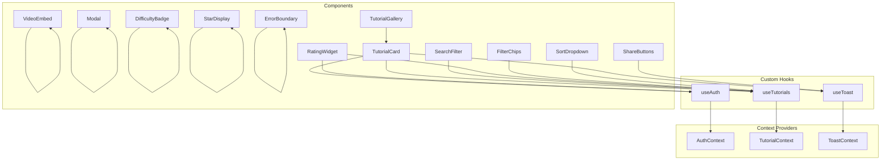
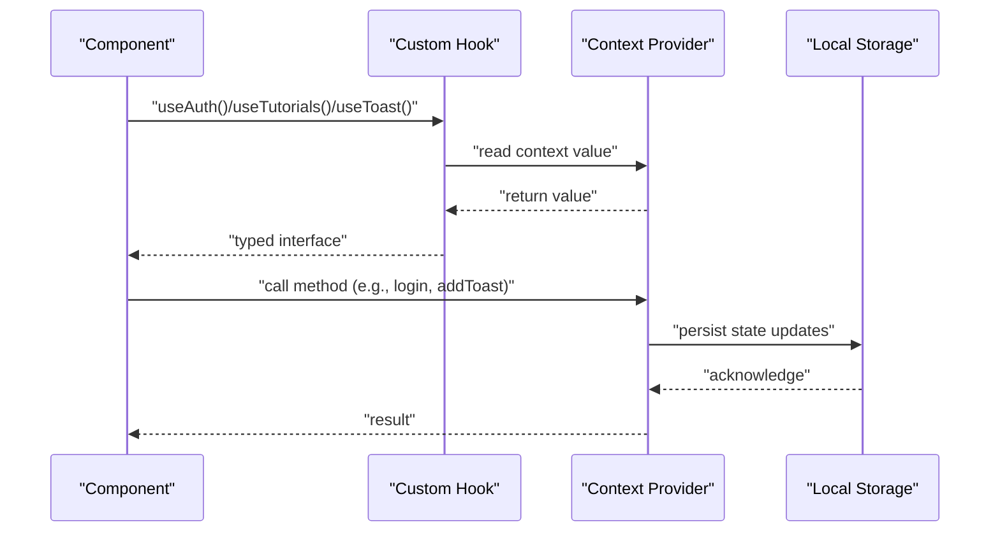
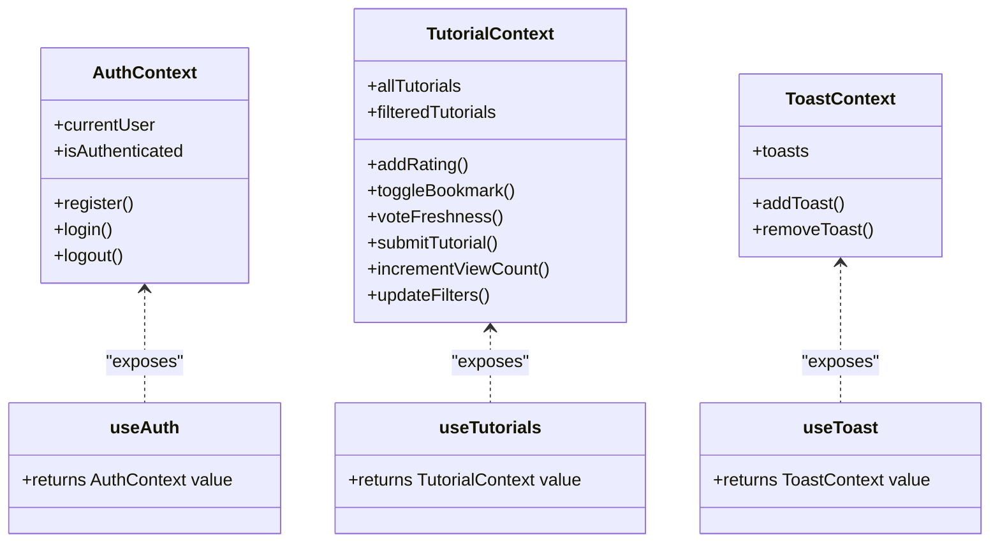

# API Reference

<cite>
**Referenced Files in This Document**
- [AuthContext.jsx](file://src/contexts/AuthContext.jsx)
- [TutorialContext.jsx](file://src/contexts/TutorialContext.jsx)
- [ToastContext.jsx](file://src/contexts/ToastContext.jsx)
- [useAuth.js](file://src/hooks/useAuth.js)
- [useTutorials.js](file://src/hooks/useTutorials.js)
- [useToast.js](file://src/hooks/useToast.js)
- [propTypeShapes.js](file://src/utils/propTypeShapes.js)
- [TutorialCard.jsx](file://src/components/TutorialCard.jsx)
- [TutorialGallery.jsx](file://src/components/TutorialGallery.jsx)
- [SearchFilter.jsx](file://src/components/SearchFilter.jsx)
- [VideoEmbed.jsx](file://src/components/VideoEmbed.jsx)
- [RatingWidget.jsx](file://src/components/RatingWidget.jsx)
- [Modal.jsx](file://src/components/Modal.jsx)
- [ShareButtons.jsx](file://src/components/ShareButtons.jsx)
- [DifficultyBadge.jsx](file://src/components/DifficultyBadge.jsx)
- [StarDisplay.jsx](file://src/components/StarDisplay.jsx)
- [FilterChips.jsx](file://src/components/FilterChips.jsx)
- [SortDropdown.jsx](file://src/components/SortDropdown.jsx)
- [ErrorBoundary.jsx](file://src/components/ErrorBoundary.jsx)
</cite>

## Table of Contents
1. [Introduction](#introduction)
2. [Project Structure](#project-structure)
3. [Core Components](#core-components)
4. [Architecture Overview](#architecture-overview)
5. [Detailed Component Analysis](#detailed-component-analysis)
6. [Dependency Analysis](#dependency-analysis)
7. [Performance Considerations](#performance-considerations)
8. [Troubleshooting Guide](#troubleshooting-guide)
9. [Conclusion](#conclusion)
10. [Appendices](#appendices)

## Introduction
This document provides a comprehensive API reference for GameDev Hub’s public interfaces and component APIs. It covers:
- Context Provider APIs: AuthContext, TutorialContext, and ToastContext
- Custom Hook Interfaces: useAuth, useTutorials, and useToast
- Component Prop Interfaces validated via PropTypes from propTypeShapes.js
- Method signatures, parameter specifications, return values, and usage examples
- Consumption patterns, event handlers, callback functions, and state update patterns
- API versioning, backward compatibility considerations, and migration guidance

## Project Structure
GameDev Hub organizes its public APIs into three primary areas:
- Context Providers: Encapsulate global state and actions for authentication, tutorials, and notifications
- Custom Hooks: Provide typed access to context providers with runtime validation
- Components: Presentational and interactive UI elements with PropTypes-based prop validation

**Diagram sources**
- [AuthContext.jsx:11-104](file://src/contexts/AuthContext.jsx#L11-L104)
- [TutorialContext.jsx:6-541](file://src/contexts/TutorialContext.jsx#L6-L541)
- [ToastContext.jsx:3-50](file://src/contexts/ToastContext.jsx#L3-L50)
- [useAuth.js:4-10](file://src/hooks/useAuth.js#L4-L10)
- [useTutorials.js:4-10](file://src/hooks/useTutorials.js#L4-L10)
- [useToast.js:4-10](file://src/hooks/useToast.js#L4-L10)
- [TutorialCard.jsx:14-109](file://src/components/TutorialCard.jsx#L14-L109)
- [TutorialGallery.jsx:23-137](file://src/components/TutorialGallery.jsx#L23-L137)
- [SearchFilter.jsx:19-236](file://src/components/SearchFilter.jsx#L19-L236)
- [VideoEmbed.jsx:6-86](file://src/components/VideoEmbed.jsx#L6-L86)
- [RatingWidget.jsx:6-83](file://src/components/RatingWidget.jsx#L6-L83)
- [Modal.jsx:8-91](file://src/components/Modal.jsx#L8-L91)
- [ShareButtons.jsx:6-72](file://src/components/ShareButtons.jsx#L6-L72)
- [DifficultyBadge.jsx:5-21](file://src/components/DifficultyBadge.jsx#L5-L21)
- [StarDisplay.jsx:5-48](file://src/components/StarDisplay.jsx#L5-L48)
- [FilterChips.jsx:6-75](file://src/components/FilterChips.jsx#L6-L75)
- [SortDropdown.jsx:6-28](file://src/components/SortDropdown.jsx#L6-L28)
- [ErrorBoundary.jsx:6-62](file://src/components/ErrorBoundary.jsx#L6-L62)

**Section sources**
- [AuthContext.jsx:11-104](file://src/contexts/AuthContext.jsx#L11-L104)
- [TutorialContext.jsx:6-541](file://src/contexts/TutorialContext.jsx#L6-L541)
- [ToastContext.jsx:3-50](file://src/contexts/ToastContext.jsx#L3-L50)
- [useAuth.js:4-10](file://src/hooks/useAuth.js#L4-L10)
- [useTutorials.js:4-10](file://src/hooks/useTutorials.js#L4-L10)
- [useToast.js:4-10](file://src/hooks/useToast.js#L4-L10)

## Core Components

### AuthContext API
AuthContext manages authentication state, registration, login, and logout. It persists sessions and users in local storage and integrates with cryptographic utilities for secure password handling.

- Provider: AuthProvider
  - Props: children
  - State: users, session
  - Exposed value keys: currentUser, isAuthenticated, register, login, logout

Methods
- register({ username, email, password, displayName })
  - Parameters: username (string), email (string), password (string), displayName (string, optional)
  - Returns: { success: boolean, user?: User, error?: string }
  - Behavior: Validates uniqueness, generates salt, hashes password, creates user, sets session
- login({ username, password })
  - Parameters: username (string), password (string)
  - Returns: { success: boolean, user?: User, error?: string }
  - Behavior: Finds user by username or email, supports legacy hash migration to PBKDF2, sets session
- logout()
  - Parameters: none
  - Returns: void
  - Behavior: Clears session

Usage pattern
- Wrap app with AuthProvider
- Consume via useAuth() inside components
- Call register/login/logout based on user actions

**Section sources**
- [AuthContext.jsx:13-104](file://src/contexts/AuthContext.jsx#L13-L104)

### TutorialContext API
TutorialContext orchestrates tutorial data, filtering, sorting, ratings, reviews, bookmarks, completion tracking, review voting, freshness voting, tagging, and submission management.

- Provider: TutorialProvider
  - Props: children
  - State: ratings, reviews, bookmarks, submissions, viewLog, filters, sortBy, completed, reviewVotes, freshnessVotes, followedTags
  - Exposed value keys: allTutorials, filteredTutorials, featuredTutorials, popularTutorials, filters, sortBy, plus numerous getters and setters

Key methods
- Data retrieval
  - getTutorialById(id): Tutorial | null
  - getTutorialsByCategory(category): Tutorial[]
- Ratings and reviews
  - addRating(tutorialId, userId, rating)
  - getUserRating(tutorialId, userId): number
  - addReview(tutorialId, userId, username, text): Review
  - getReviewsForTutorial(tutorialId): Review[]
- Bookmarks
  - toggleBookmark(userId, tutorialId)
  - isBookmarked(userId, tutorialId): boolean
  - getUserBookmarks(userId): Tutorial[]
- Completion tracking
  - toggleCompleted(userId, tutorialId)
  - isCompleted(userId, tutorialId): boolean
  - getUserCompletedTutorials(userId): Tutorial[]
  - getUserCompletedCount(userId): number
- Review voting
  - voteOnReview(reviewId, userId, voteType): 'up'|'down'|undefined
  - getReviewVotes(reviewId): Record<string,'up'|'down'>
  - getUserReviewVote(reviewId, userId): 'up'|'down'|undefined
  - getReviewNetVotes(reviewId): number
- Freshness voting
  - voteFreshness(tutorialId, userId, type): 'works'|'outdated'
  - getFreshnessStatus(tutorialId): { worksCount: number, outdatedCount: number, consensus: 'works'|'outdated'|'unknown' }
  - getUserFreshnessVote(tutorialId, userId): 'works'|'outdated'|null
- Tag following
  - followTag(userId, tag)
  - unfollowTag(userId, tag)
  - isTagFollowed(userId, tag): boolean
  - getFollowedTags(userId): string[]
  - getForYouTutorials(userId): Tutorial[]
- Submissions
  - submitTutorial(tutorialData, userId): Tutorial
  - getUserSubmissions(userId): Submission[]
  - editSubmission(submissionId, updatedData, userId): { success: boolean, error?: string }
  - deleteSubmission(submissionId, userId): { success: boolean, error?: string }
- UI helpers
  - incrementViewCount(tutorialId)
  - updateFilters(newFilters)
  - resetFilters()
  - setSortBy(sortKey)

Usage pattern
- Wrap app with TutorialProvider
- Consume via useTutorials() inside components
- Apply filters/sorting via exposed setters and memoized derived lists

**Section sources**
- [TutorialContext.jsx:18-541](file://src/contexts/TutorialContext.jsx#L18-L541)

### ToastContext API
ToastContext provides a toast notification system with auto-dismissal and dismissal animations.

- Provider: ToastProvider
  - Props: children
  - State: toasts
  - Exposed value keys: toasts, addToast, removeToast

Methods
- addToast(message, variant = 'info'): string (toast id)
  - Parameters: message (string), variant ('info'|'success'|'warning'|'error')
  - Returns: unique toast id
  - Behavior: Creates toast, enqueues auto-dismiss timer, limits to last 5 toasts
- removeToast(id): void
  - Parameters: id (string)
  - Behavior: Triggers dismiss animation, removes after fade-out delay

Usage pattern
- Wrap app with ToastProvider
- Consume via useToast() inside components
- Call addToast with message and variant; removeToast when needed

**Section sources**
- [ToastContext.jsx:5-50](file://src/contexts/ToastContext.jsx#L5-L50)

### Custom Hook Interfaces

#### useAuth
- Purpose: Access AuthContext values and guard against misuse
- Returns: AuthContext value object
- Throws: Error if used outside AuthProvider

Usage example
- const { currentUser, isAuthenticated, login, logout } = useAuth();

**Section sources**
- [useAuth.js:4-10](file://src/hooks/useAuth.js#L4-L10)

#### useTutorials
- Purpose: Access TutorialContext values and guard against misuse
- Returns: TutorialContext value object
- Throws: Error if used outside TutorialProvider

Usage example
- const { allTutorials, filteredTutorials, updateFilters, setSortBy } = useTutorials();

**Section sources**
- [useTutorials.js:4-10](file://src/hooks/useTutorials.js#L4-L10)

#### useToast
- Purpose: Access ToastContext values and guard against misuse
- Returns: ToastContext value object
- Throws: Error if used outside ToastProvider

Usage example
- const { addToast } = useToast();

**Section sources**
- [useToast.js:4-10](file://src/hooks/useToast.js#L4-L10)

## Architecture Overview
The system follows a layered architecture:
- Context Providers encapsulate domain logic and persistence
- Custom Hooks expose typed interfaces to components
- Components consume hooks and render UI with PropTypes validation

**Diagram sources**
- [AuthContext.jsx:13-104](file://src/contexts/AuthContext.jsx#L13-L104)
- [TutorialContext.jsx:18-541](file://src/contexts/TutorialContext.jsx#L18-L541)
- [ToastContext.jsx:5-50](file://src/contexts/ToastContext.jsx#L5-L50)
- [useAuth.js:4-10](file://src/hooks/useAuth.js#L4-L10)
- [useTutorials.js:4-10](file://src/hooks/useTutorials.js#L4-L10)
- [useToast.js:4-10](file://src/hooks/useToast.js#L4-L10)

## Detailed Component Analysis

### TutorialCard
- Consumes: useAuth, useTutorials, useToast
- Props (validated via PropTypes):
  - tutorial: tutorialShape (required)
- Events and callbacks:
  - Click card navigates to tutorial detail
  - Bookmark toggles via toggleBookmark; shows success toast
- State updates:
  - Uses local imgError state for fallback rendering

Usage example
- <TutorialCard tutorial={tutorial} />

**Section sources**
- [TutorialCard.jsx:14-109](file://src/components/TutorialCard.jsx#L14-L109)
- [propTypeShapes.js:3-26](file://src/utils/propTypeShapes.js#L3-L26)

### TutorialGallery
- Consumes: TutorialCard (composition)
- Props (validated via PropTypes):
  - tutorials: array of tutorialShape (required)
  - title, subtitle, viewAllLink: strings
  - showCount: boolean
  - emptyTitle, emptyMessage: strings
  - onClearFilters: function
  - pageSize: number
- Pagination logic:
  - Computes pages based on pageSize and total tutorials
  - Renders page indices with ellipsis for large ranges

Usage example
- <TutorialGallery tutorials={filtered} pageSize={12} onClearFilters={resetFilters} />

**Section sources**
- [TutorialGallery.jsx:23-137](file://src/components/TutorialGallery.jsx#L23-L137)
- [propTypeShapes.js:3-26](file://src/utils/propTypeShapes.js#L3-L26)

### SearchFilter
- Consumes: useDebounce, filterShape
- Props (validated via PropTypes):
  - filters: filterShape (required)
  - onFilterChange: function (required)
  - onReset: function (required)
- Features:
  - Debounced search queries
  - Recent searches stored in localStorage
  - Dynamic suggestions dropdown
  - Multi-select filters for categories, difficulties, platforms, engine versions
  - Duration range selection and minimum rating buttons
- Event handlers:
  - handleSearchChange, handleCheckboxToggle, handleDurationChange, handleMinRating

Usage example
- <SearchFilter filters={filters} onFilterChange={updateFilters} onReset={resetFilters} />

**Section sources**
- [SearchFilter.jsx:19-236](file://src/components/SearchFilter.jsx#L19-L236)
- [propTypeShapes.js:28-36](file://src/utils/propTypeShapes.js#L28-L36)

### VideoEmbed
- Consumes: videoUtils (via internal helpers)
- Props (validated via PropTypes):
  - url: string (required)
  - title: string
- Behavior:
  - Generates embed URL; falls back to external link if invalid
  - Handles loading and error states with lazy iframe

Usage example
- <VideoEmbed url={videoUrl} title={title} />

**Section sources**
- [VideoEmbed.jsx:6-86](file://src/components/VideoEmbed.jsx#L6-L86)

### RatingWidget
- Consumes: useAuth, useTutorials
- Props (validated via PropTypes):
  - currentRating: number
  - onRate: function
  - isAuthenticated: boolean
- Behavior:
  - Disabled when not authenticated
  - Keyboard navigation support for star rating
  - Displays current rating label

Usage example
- <RatingWidget currentRating={userRating} onRate={rateTutorial} isAuthenticated={isAuthenticated} />

**Section sources**
- [RatingWidget.jsx:6-83](file://src/components/RatingWidget.jsx#L6-L83)

### Modal
- Consumes: focus trap and accessibility utilities
- Props (validated via PropTypes):
  - title: string (required)
  - onClose: function (required)
  - children: node (required)
- Behavior:
  - Focus trapping and Escape-to-close
  - Overlay click-to-close
  - Restores focus on unmount

Usage example
- <Modal title="Share" onClose={() => setShow(false)}>...</Modal>

**Section sources**
- [Modal.jsx:8-91](file://src/components/Modal.jsx#L8-L91)

### ShareButtons
- Consumes: useToast
- Props (validated via PropTypes):
  - title: string (required)
  - url: string
- Behavior:
  - Copies link to clipboard with toast feedback
  - Provides social sharing links

Usage example
- <ShareButtons title={tutorial.title} url={shareUrl} />

**Section sources**
- [ShareButtons.jsx:6-72](file://src/components/ShareButtons.jsx#L6-L72)

### DifficultyBadge
- Props (validated via PropTypes):
  - difficulty: oneOf ['Beginner','Intermediate','Advanced'] (required)

Usage example
- <DifficultyBadge difficulty={tutorial.difficulty} />

**Section sources**
- [DifficultyBadge.jsx:5-21](file://src/components/DifficultyBadge.jsx#L5-L21)

### StarDisplay
- Props (validated via PropTypes):
  - rating: number (required)
  - count: number
  - compact: boolean

Usage example
- <StarDisplay rating={avgRating} count={ratingCount} />

**Section sources**
- [StarDisplay.jsx:5-48](file://src/components/StarDisplay.jsx#L5-L48)

### FilterChips
- Consumes: filterShape
- Props (validated via PropTypes):
  - filters: filterShape (required)
  - onRemoveFilter: function (required)
  - onClearAll: function (required)
- Behavior:
  - Renders active filters as removable chips
  - Supports clearing all filters

Usage example
- <FilterChips filters={filters} onRemoveFilter={removeFilter} onClearAll={resetFilters} />

**Section sources**
- [FilterChips.jsx:6-75](file://src/components/FilterChips.jsx#L6-L75)
- [propTypeShapes.js:28-36](file://src/utils/propTypeShapes.js#L28-L36)

### SortDropdown
- Consumes: SORT_OPTIONS
- Props (validated via PropTypes):
  - value: string (required)
  - onChange: function (required)

Usage example
- <SortDropdown value={sortBy} onChange={setSortBy} />

**Section sources**
- [SortDropdown.jsx:6-28](file://src/components/SortDropdown.jsx#L6-L28)

### ErrorBoundary
- Props (validated via PropTypes):
  - children: node (required)
- Behavior:
  - Catches errors via getDerivedStateFromError
  - Reports error via analytics
  - Provides retry and home navigation

Usage example
- <ErrorBoundary><YourApp /></ErrorBoundary>

**Section sources**
- [ErrorBoundary.jsx:6-62](file://src/components/ErrorBoundary.jsx#L6-L62)

## Dependency Analysis
Context-to-Hook-to-Component relationships are explicit and enforced by custom hooks’ guards.

**Diagram sources**
- [AuthContext.jsx:11-104](file://src/contexts/AuthContext.jsx#L11-L104)
- [TutorialContext.jsx:6-541](file://src/contexts/TutorialContext.jsx#L6-L541)
- [ToastContext.jsx:3-50](file://src/contexts/ToastContext.jsx#L3-L50)
- [useAuth.js:4-10](file://src/hooks/useAuth.js#L4-L10)
- [useTutorials.js:4-10](file://src/hooks/useTutorials.js#L4-L10)
- [useToast.js:4-10](file://src/hooks/useToast.js#L4-L10)

**Section sources**
- [useAuth.js:4-10](file://src/hooks/useAuth.js#L4-L10)
- [useTutorials.js:4-10](file://src/hooks/useTutorials.js#L4-L10)
- [useToast.js:4-10](file://src/hooks/useToast.js#L4-L10)

## Performance Considerations
- Memoization: Context providers use useMemo to avoid unnecessary recalculations of derived data (e.g., filtered tutorials, featured/popular lists).
- Local storage persistence: Heavy state is persisted to localStorage; consider throttling frequent writes for ratings, bookmarks, and votes.
- Debouncing: SearchFilter uses debounced input to reduce recomputation during typing.
- Rendering: Components like TutorialGallery slice arrays for pagination to limit DOM nodes per render.

[No sources needed since this section provides general guidance]

## Troubleshooting Guide
Common issues and resolutions:
- Hook used outside provider
  - Symptom: Error thrown indicating hook must be used within a provider
  - Resolution: Ensure component tree is wrapped with the appropriate Provider
- Toast not appearing
  - Symptom: addToast called but no toast visible
  - Resolution: Verify ToastProvider is mounted; confirm variant is one of supported values
- Filters not applying
  - Symptom: Changing filters does not update results
  - Resolution: Ensure onFilterChange updates filters state; remember updateFilters merges partial changes
- Authentication state inconsistencies
  - Symptom: currentUser appears null despite logged-in session
  - Resolution: Confirm session exists in localStorage and user record is present

**Section sources**
- [useAuth.js:6-8](file://src/hooks/useAuth.js#L6-L8)
- [useTutorials.js:6-8](file://src/hooks/useTutorials.js#L6-L8)
- [useToast.js:6-8](file://src/hooks/useToast.js#L6-L8)

## Conclusion
GameDev Hub’s public API surface is intentionally minimal and strongly typed:
- Context Providers encapsulate domain logic and persistence
- Custom Hooks enforce proper usage and expose concise interfaces
- Components rely on PropTypes for predictable prop validation
Adhering to these patterns ensures maintainable, testable, and accessible UI.

[No sources needed since this section summarizes without analyzing specific files]

## Appendices

### PropTypes Validation Reference
- tutorialShape
  - Required: id, title, url, category, difficulty, platform
  - Optional: description, thumbnailUrl, engineVersion, tags, estimatedDuration, seriesId, seriesOrder, prerequisites, author, viewCount, averageRating, ratingCount, isFeatured
- filterShape
  - Optional: searchQuery, categories, difficulties, platforms, engineVersions, durationRange, minRating

**Section sources**
- [propTypeShapes.js:3-26](file://src/utils/propTypeShapes.js#L3-L26)
- [propTypeShapes.js:28-36](file://src/utils/propTypeShapes.js#L28-L36)

### API Versioning and Migration Notes
- Authentication
  - Legacy password hash migration: PBKDF2 is applied transparently upon successful legacy login; ensure clients handle the returned success response and subsequent state updates
- Tutorials
  - New fields may be introduced to tutorial submissions; consumers relying on tutorialShape should remain resilient to additional optional fields
  - Sorting and filtering keys should align with constants; verify SORT_OPTIONS and filterShape keys match expected values
- Notifications
  - Toast variants are constrained; ensure callers pass supported variant strings
- Backward compatibility
  - Existing props and methods are designed to remain stable; new features are additive
  - When extending, prefer adding optional props and deprecate old ones with warnings rather than breaking changes

[No sources needed since this section provides general guidance]