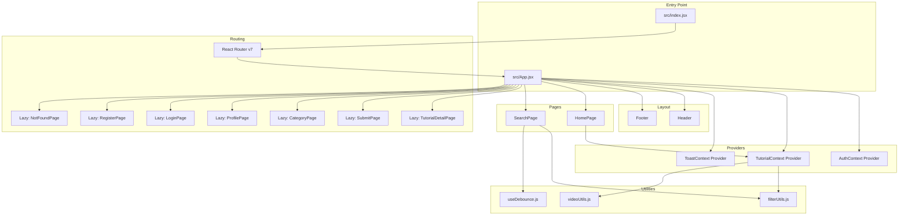
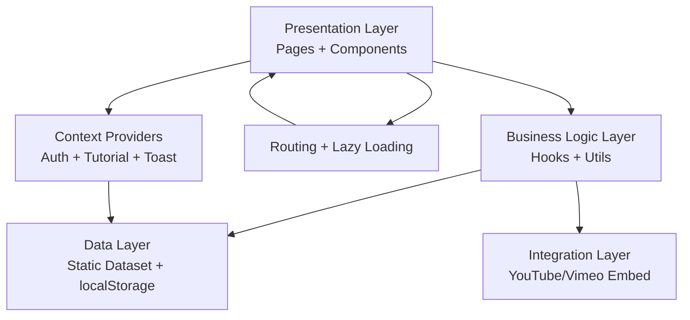
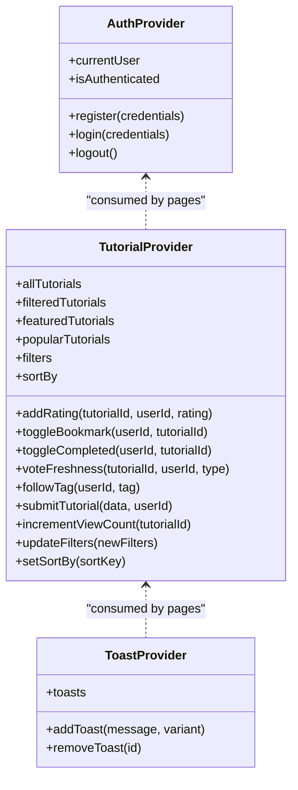
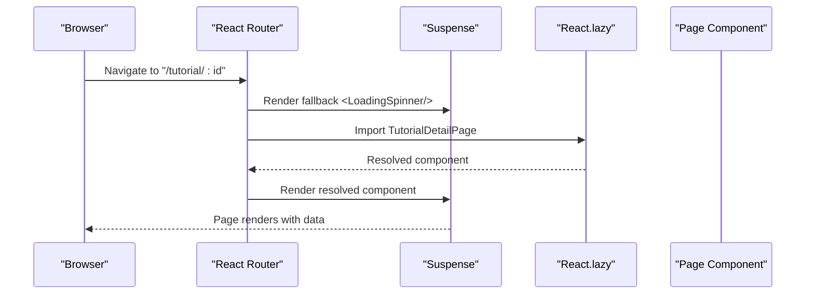
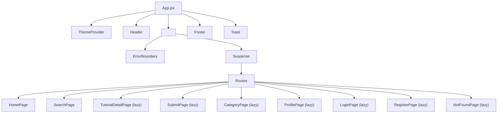
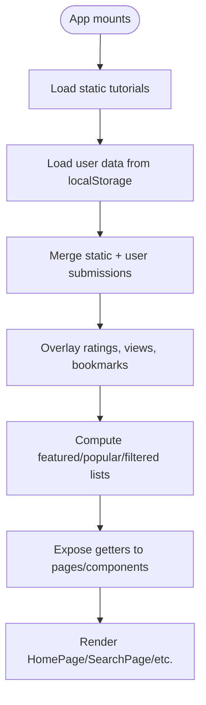
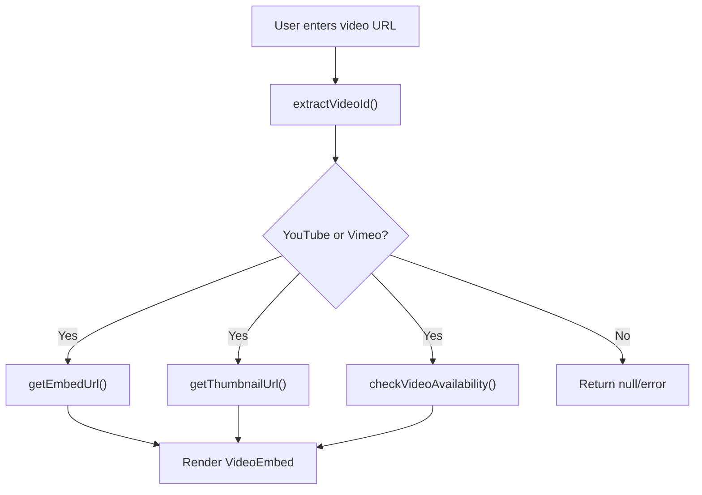
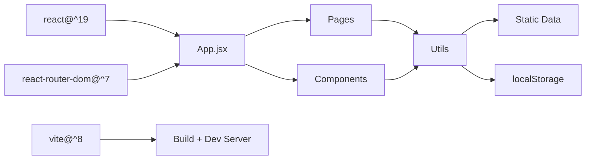

# Architecture Overview

<cite>
**Referenced Files in This Document**
- [README.md](file://README.md)
- [package.json](file://package.json)
- [vite.config.js](file://vite.config.js)
- [src/index.jsx](file://src/index.jsx)
- [src/App.jsx](file://src/App.jsx)
- [src/components/layout/Header.jsx](file://src/components/layout/Header.jsx)
- [src/components/layout/Footer.jsx](file://src/components/layout/Footer.jsx)
- [src/contexts/AuthContext.jsx](file://src/contexts/AuthContext.jsx)
- [src/contexts/TutorialContext.jsx](file://src/contexts/TutorialContext.jsx)
- [src/contexts/ToastContext.jsx](file://src/contexts/ToastContext.jsx)
- [src/hooks/useDebounce.js](file://src/hooks/useDebounce.js)
- [src/utils/filterUtils.js](file://src/utils/filterUtils.js)
- [src/utils/videoUtils.js](file://src/utils/videoUtils.js)
- [src/data/tutorials.js](file://src/data/tutorials.js)
</cite>

## Table of Contents
1. [Introduction](#introduction)
2. [Project Structure](#project-structure)
3. [Core Components](#core-components)
4. [Architecture Overview](#architecture-overview)
5. [Detailed Component Analysis](#detailed-component-analysis)
6. [Dependency Analysis](#dependency-analysis)
7. [Performance Considerations](#performance-considerations)
8. [Troubleshooting Guide](#troubleshooting-guide)
9. [Conclusion](#conclusion)

## Introduction
This document describes the system architecture of GameDev Hub, a React 19 application built with Vite and React Router v7. The application follows a component-based architecture with a Provider Pattern implemented via React Context API to manage global state across authentication, tutorials, and toast notifications. Routing leverages route-level code splitting and lazy loading for improved performance. The system separates concerns across presentation, business logic, and data layers, while integrating external services (YouTube/Vimeo) and local persistence via localStorage.

## Project Structure
The project is organized by feature and layer:
- Presentation: Pages and components under src/pages and src/components
- Business logic: Utilities under src/utils and custom hooks under src/hooks
- Data: Static datasets under src/data
- State: Providers under src/contexts
- Entry point and routing: src/index.jsx and src/App.jsx
- Tooling: Vite configuration under vite.config.js

**Diagram sources**
- [src/index.jsx:1-24](file://src/index.jsx#L1-L24)
- [src/App.jsx:1-51](file://src/App.jsx#L1-L51)
- [src/components/layout/Header.jsx:1-116](file://src/components/layout/Header.jsx#L1-L116)
- [src/components/layout/Footer.jsx:1-51](file://src/components/layout/Footer.jsx#L1-L51)
- [src/contexts/AuthContext.jsx:1-105](file://src/contexts/AuthContext.jsx#L1-L105)
- [src/contexts/TutorialContext.jsx:1-542](file://src/contexts/TutorialContext.jsx#L1-L542)
- [src/contexts/ToastContext.jsx:1-53](file://src/contexts/ToastContext.jsx#L1-L53)
- [src/utils/filterUtils.js:1-99](file://src/utils/filterUtils.js#L1-L99)
- [src/utils/videoUtils.js:1-119](file://src/utils/videoUtils.js#L1-L119)
- [src/hooks/useDebounce.js:1-16](file://src/hooks/useDebounce.js#L1-L16)

**Section sources**
- [README.md:84-115](file://README.md#L84-L115)
- [package.json:1-56](file://package.json#L1-L56)
- [vite.config.js:1-19](file://vite.config.js#L1-L19)

## Core Components
- Provider Pattern with React Context API:
  - AuthContext manages user registration, login/logout, and current user state with secure password hashing and legacy migration.
  - TutorialContext aggregates static tutorials with user-submitted content, overlays dynamic user data (ratings, reviews, bookmarks, completion, freshness votes, followed tags), and exposes filtering/sorting and submission APIs.
  - ToastContext provides global toast notifications with auto-dismiss and dismissal animations.
- Routing with React Router v7:
  - Route-level code splitting using React.lazy and Suspense with a custom LoadingSpinner fallback.
  - Error boundary wrapping routes for graceful error handling.
- Layout components:
  - Header handles navigation, theme toggle, and authentication UI.
  - Footer provides site navigation and branding.
- Utility functions:
  - filterUtils.js implements tutorial filtering and sorting.
  - videoUtils.js parses, validates, sanitizes, and generates embed URLs for YouTube and Vimeo.
  - useDebounce.js provides debounced input handling for search.

**Section sources**
- [src/contexts/AuthContext.jsx:1-105](file://src/contexts/AuthContext.jsx#L1-L105)
- [src/contexts/TutorialContext.jsx:1-542](file://src/contexts/TutorialContext.jsx#L1-L542)
- [src/contexts/ToastContext.jsx:1-53](file://src/contexts/ToastContext.jsx#L1-L53)
- [src/App.jsx:13-19](file://src/App.jsx#L13-L19)
- [src/App.jsx:27-41](file://src/App.jsx#L27-L41)
- [src/components/layout/Header.jsx:1-116](file://src/components/layout/Header.jsx#L1-L116)
- [src/components/layout/Footer.jsx:1-51](file://src/components/layout/Footer.jsx#L1-L51)
- [src/utils/filterUtils.js:1-99](file://src/utils/filterUtils.js#L1-L99)
- [src/utils/videoUtils.js:1-119](file://src/utils/videoUtils.js#L1-L119)
- [src/hooks/useDebounce.js:1-16](file://src/hooks/useDebounce.js#L1-L16)

## Architecture Overview
The system follows a layered architecture:
- Presentation layer: Pages and components render UI and orchestrate user interactions.
- Business logic layer: Utilities encapsulate filtering, sorting, video URL handling, and debounce logic.
- Data layer: Static tutorial dataset and localStorage-backed persistence for user data and preferences.
- Integration layer: External services (YouTube/Vimeo) via embed URLs and availability checks.

[No sources needed since this diagram shows conceptual workflow, not actual code structure]

## Detailed Component Analysis

### Provider Pattern and State Management
The Provider Pattern uses React Context API to distribute state across components:
- AuthContext: Manages user lifecycle and secure credentials.
- TutorialContext: Centralizes tutorial data, user interactions, and submission workflows.
- ToastContext: Provides global notification feedback.

**Diagram sources**
- [src/contexts/AuthContext.jsx:13-104](file://src/contexts/AuthContext.jsx#L13-L104)
- [src/contexts/TutorialContext.jsx:18-540](file://src/contexts/TutorialContext.jsx#L18-L540)
- [src/contexts/ToastContext.jsx:5-50](file://src/contexts/ToastContext.jsx#L5-L50)

**Section sources**
- [src/contexts/AuthContext.jsx:1-105](file://src/contexts/AuthContext.jsx#L1-L105)
- [src/contexts/TutorialContext.jsx:1-542](file://src/contexts/TutorialContext.jsx#L1-L542)
- [src/contexts/ToastContext.jsx:1-53](file://src/contexts/ToastContext.jsx#L1-L53)

### Routing and Lazy Loading
React Router v7 enables route-level code splitting with Suspense and a custom loading spinner. The App component defines routes and lazily imports page components.

**Diagram sources**
- [src/App.jsx:13-19](file://src/App.jsx#L13-L19)
- [src/App.jsx:27-41](file://src/App.jsx#L27-L41)

**Section sources**
- [src/App.jsx:1-51](file://src/App.jsx#L1-L51)

### Component Hierarchy and Orchestration
The App component orchestrates layout, providers, routing, and global UI elements:
- Providers wrap the app to supply state to all pages.
- Header and Footer provide navigation and branding.
- ErrorBoundary and Suspense improve resilience and UX during lazy loading.

**Diagram sources**
- [src/App.jsx:1-51](file://src/App.jsx#L1-L51)
- [src/components/layout/Header.jsx:1-116](file://src/components/layout/Header.jsx#L1-L116)
- [src/components/layout/Footer.jsx:1-51](file://src/components/layout/Footer.jsx#L1-L51)

**Section sources**
- [src/App.jsx:1-51](file://src/App.jsx#L1-L51)
- [src/components/layout/Header.jsx:1-116](file://src/components/layout/Header.jsx#L1-L116)
- [src/components/layout/Footer.jsx:1-51](file://src/components/layout/Footer.jsx#L1-L51)

### Data Flow: Static Datasets to UI
Static tutorial data is merged with user-submitted content, enriched with user-driven metrics, and exposed via TutorialContext. Filtering and sorting are computed from user preferences stored in localStorage.

**Diagram sources**
- [src/contexts/TutorialContext.jsx:37-81](file://src/contexts/TutorialContext.jsx#L37-L81)
- [src/contexts/TutorialContext.jsx:68-71](file://src/contexts/TutorialContext.jsx#L68-L71)
- [src/data/tutorials.js:1-200](file://src/data/tutorials.js#L1-L200)

**Section sources**
- [src/contexts/TutorialContext.jsx:1-542](file://src/contexts/TutorialContext.jsx#L1-L542)
- [src/data/tutorials.js:1-200](file://src/data/tutorials.js#L1-L200)

### External Integrations: YouTube and Vimeo
Video utilities parse URLs, generate embed URLs, validate availability, and sanitize unsafe protocols. The system supports YouTube and Vimeo with fallbacks and safety checks.

**Diagram sources**
- [src/utils/videoUtils.js:3-48](file://src/utils/videoUtils.js#L3-L48)
- [src/utils/videoUtils.js:67-118](file://src/utils/videoUtils.js#L67-L118)

**Section sources**
- [src/utils/videoUtils.js:1-119](file://src/utils/videoUtils.js#L1-L119)

## Dependency Analysis
The application relies on React 19, React Router v7, and Vite for build tooling. Context providers are wired at the application root, and pages consume them via custom hooks.

**Diagram sources**
- [package.json:5-14](file://package.json#L5-L14)
- [vite.config.js:1-19](file://vite.config.js#L1-L19)
- [src/index.jsx:1-24](file://src/index.jsx#L1-L24)

**Section sources**
- [package.json:1-56](file://package.json#L1-L56)
- [vite.config.js:1-19](file://vite.config.js#L1-L19)
- [src/index.jsx:1-24](file://src/index.jsx#L1-L24)

## Performance Considerations
- Route-level code splitting: Reduces initial bundle size by deferring page components until navigation.
- Debounced search: Minimizes re-filtering churn during typing using a debouncing hook.
- Efficient rendering: Memoization in contexts avoids unnecessary recomputation; CSS Modules keep styles scoped and maintainable.
- Lazy loading with Suspense: Provides a smooth loading experience with a custom spinner.
- Local storage caching: Reduces network requests and improves interactivity for user preferences and personal data.

**Section sources**
- [src/App.jsx:13-19](file://src/App.jsx#L13-L19)
- [src/hooks/useDebounce.js:1-16](file://src/hooks/useDebounce.js#L1-L16)
- [src/contexts/TutorialContext.jsx:18-81](file://src/contexts/TutorialContext.jsx#L18-L81)

## Troubleshooting Guide
- Routing issues: Verify lazy imports resolve and Suspense fallback renders during loading.
- Authentication problems: Confirm AuthProvider wraps the app and session/localStorage keys are present.
- Tutorial filtering not updating: Ensure filters are persisted in localStorage and update triggers recomputation.
- Video embed failures: Validate URL parsing and sanitization; check availability checks and platform-specific embed URLs.
- Toast not appearing: Confirm ToastProvider is mounted and addToast is invoked with a message and optional variant.

**Section sources**
- [src/App.jsx:27-41](file://src/App.jsx#L27-L41)
- [src/contexts/AuthContext.jsx:13-104](file://src/contexts/AuthContext.jsx#L13-L104)
- [src/contexts/TutorialContext.jsx:435-444](file://src/contexts/TutorialContext.jsx#L435-L444)
- [src/utils/videoUtils.js:50-60](file://src/utils/videoUtils.js#L50-L60)
- [src/contexts/ToastContext.jsx:27-40](file://src/contexts/ToastContext.jsx#L27-L40)

## Conclusion
GameDev Hub employs a clean, layered architecture with React 19 and Vite, leveraging React Router v7 for efficient routing and code splitting. The Provider Pattern centralizes state management, while utilities encapsulate business logic and integrations. The design emphasizes performance, resilience, and maintainability through memoization, debouncing, and scoped styling.