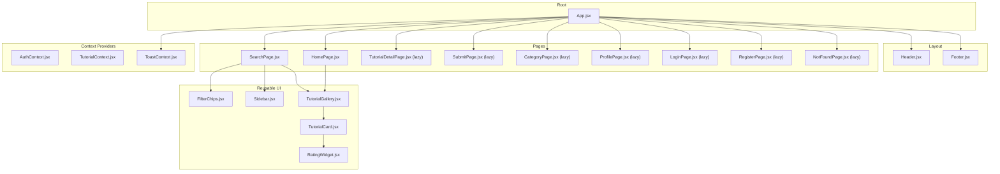
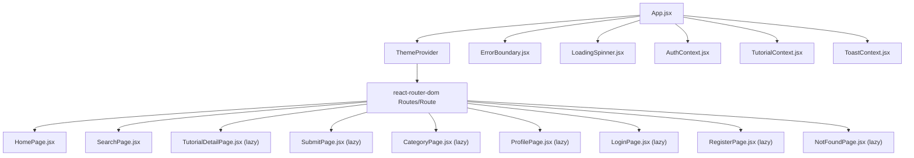
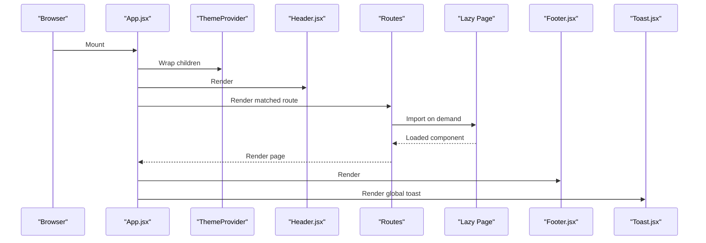
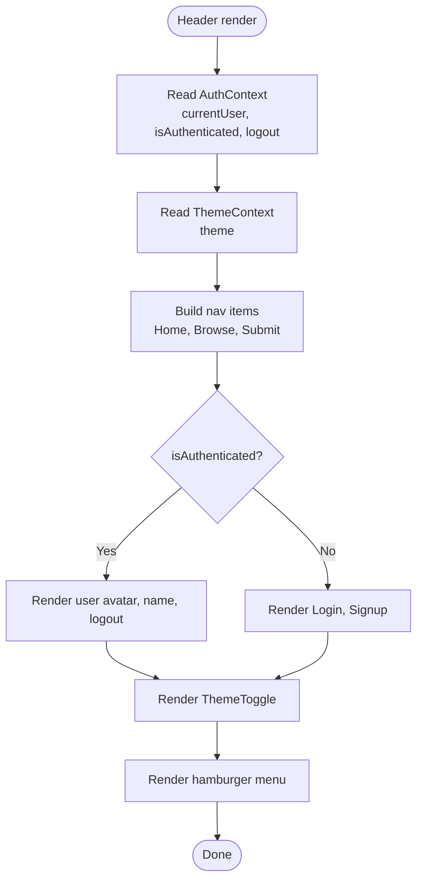
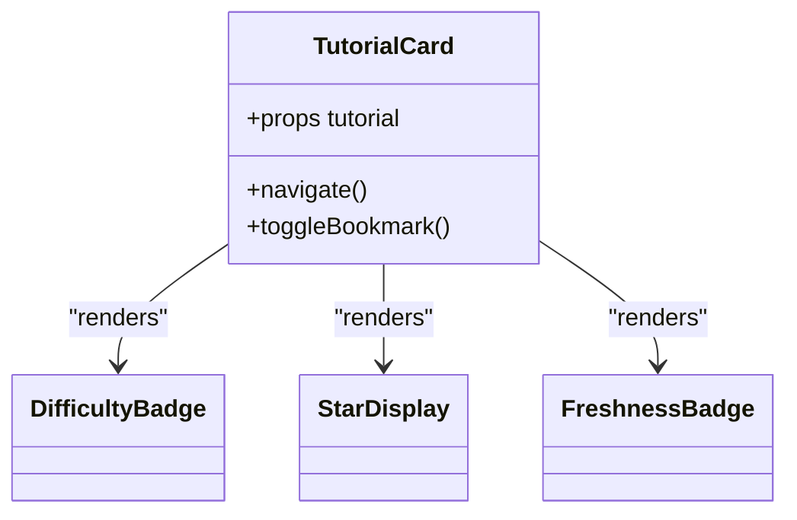
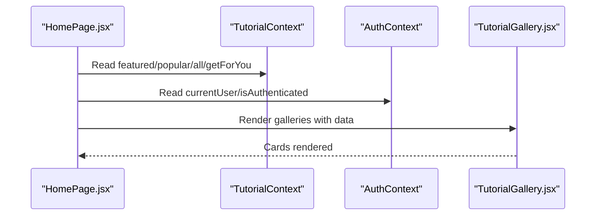
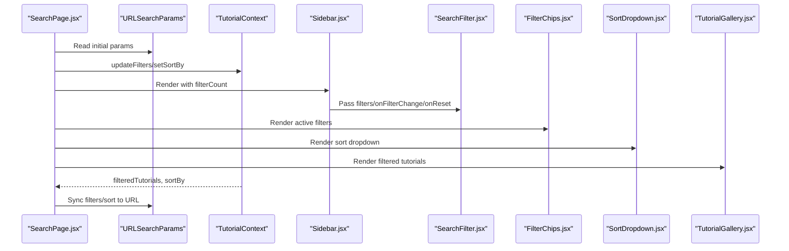
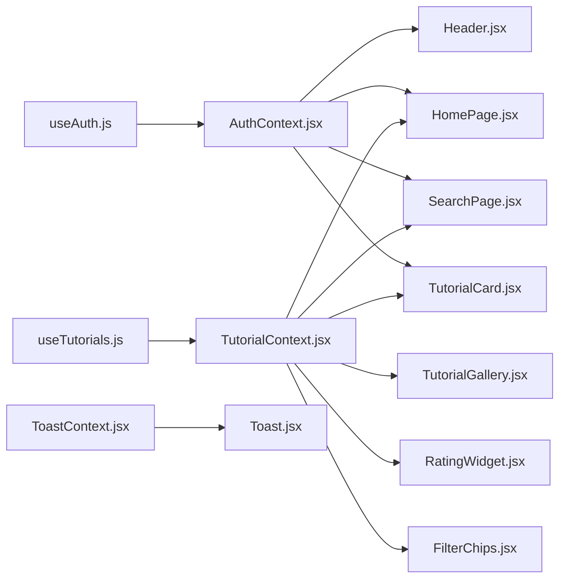
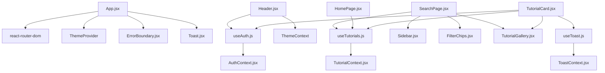

# Component Hierarchy

<cite>
**Referenced Files in This Document**
- [App.jsx](file://src/App.jsx)
- [Header.jsx](file://src/components/layout/Header.jsx)
- [Footer.jsx](file://src/components/layout/Footer.jsx)
- [Sidebar.jsx](file://src/components/layout/Sidebar.jsx)
- [TutorialCard.jsx](file://src/components/TutorialCard.jsx)
- [RatingWidget.jsx](file://src/components/RatingWidget.jsx)
- [FilterChips.jsx](file://src/components/FilterChips.jsx)
- [TutorialGallery.jsx](file://src/components/TutorialGallery.jsx)
- [SearchPage.jsx](file://src/pages/SearchPage.jsx)
- [HomePage.jsx](file://src/pages/HomePage.jsx)
- [AuthContext.jsx](file://src/contexts/AuthContext.jsx)
- [TutorialContext.jsx](file://src/contexts/TutorialContext.jsx)
- [ToastContext.jsx](file://src/contexts/ToastContext.jsx)
- [useAuth.js](file://src/hooks/useAuth.js)
- [useTutorials.js](file://src/hooks/useTutorials.js)
</cite>

## Table of Contents
1. [Introduction](#introduction)
2. [Project Structure](#project-structure)
3. [Core Components](#core-components)
4. [Architecture Overview](#architecture-overview)
5. [Detailed Component Analysis](#detailed-component-analysis)
6. [Dependency Analysis](#dependency-analysis)
7. [Performance Considerations](#performance-considerations)
8. [Troubleshooting Guide](#troubleshooting-guide)
9. [Conclusion](#conclusion)

## Introduction
This document explains GameDev Hub’s component hierarchy and composition patterns. It focuses on how the top-level App.jsx orchestrates layout, pages, and shared UI elements; how the layout components (Header, Footer, Sidebar) provide navigation and branding; how reusable components (TutorialCard, RatingWidget, FilterChips) are integrated across pages; and how context providers enable cross-cutting concerns like authentication, tutorials state, and toast notifications. It also covers routing, lazy-loading, prop drilling alternatives via context, and typical composition scenarios such as tutorial listings, search interfaces, and user profiles.

## Project Structure
The application follows a feature-based structure with clear separation between pages, reusable components, contexts, hooks, and utilities. App.jsx is the root container that wires routing, layout, and global providers.

**Diagram sources**
- [App.jsx:1-51](file://src/App.jsx#L1-L51)
- [Header.jsx:1-116](file://src/components/layout/Header.jsx#L1-L116)
- [Footer.jsx:1-51](file://src/components/layout/Footer.jsx#L1-L51)
- [Sidebar.jsx:1-24](file://src/components/layout/Sidebar.jsx#L1-L24)
- [TutorialCard.jsx:1-110](file://src/components/TutorialCard.jsx#L1-L110)
- [RatingWidget.jsx:1-84](file://src/components/RatingWidget.jsx#L1-L84)
- [FilterChips.jsx:1-76](file://src/components/FilterChips.jsx#L1-L76)
- [TutorialGallery.jsx:1-138](file://src/components/TutorialGallery.jsx#L1-L138)
- [SearchPage.jsx:1-141](file://src/pages/SearchPage.jsx#L1-L141)
- [HomePage.jsx:1-95](file://src/pages/HomePage.jsx#L1-L95)
- [AuthContext.jsx:1-105](file://src/contexts/AuthContext.jsx#L1-L105)
- [TutorialContext.jsx:1-542](file://src/contexts/TutorialContext.jsx#L1-L542)
- [ToastContext.jsx:1-53](file://src/contexts/ToastContext.jsx#L1-L53)

**Section sources**
- [App.jsx:1-51](file://src/App.jsx#L1-L51)

## Core Components
- App.jsx: Declares routes, wraps the app with ThemeProvider, ErrorBoundary, and Toast; renders Header, main content area, Footer, and a global Toast component. It lazy-loads several pages to optimize initial load.
- Header.jsx: Provides responsive navigation, theme toggle, logo, desktop/mobile auth controls, and integrates with AuthContext and ThemeContext.
- Footer.jsx: Presents site branding, quick links, and navigational sections.
- Sidebar.jsx: A collapsible sidebar wrapper that exposes a toggle button and content area, commonly used around filters.
- TutorialCard.jsx: A composite card displaying thumbnail, metadata, difficulty, freshness, series info, tags, stats, and a bookmark action; integrates with AuthContext, TutorialContext, and ToastContext.
- RatingWidget.jsx: An interactive 1–5 star rating widget gated by authentication; communicates rating actions via props.
- FilterChips.jsx: Renders active filters as removable chips and supports clearing all filters.
- TutorialGallery.jsx: A paginated gallery that renders TutorialCard items and handles empty states.

**Section sources**
- [App.jsx:13-19](file://src/App.jsx#L13-L19)
- [Header.jsx:1-116](file://src/components/layout/Header.jsx#L1-L116)
- [Footer.jsx:1-51](file://src/components/layout/Footer.jsx#L1-L51)
- [Sidebar.jsx:1-24](file://src/components/layout/Sidebar.jsx#L1-L24)
- [TutorialCard.jsx:1-110](file://src/components/TutorialCard.jsx#L1-L110)
- [RatingWidget.jsx:1-84](file://src/components/RatingWidget.jsx#L1-L84)
- [FilterChips.jsx:1-76](file://src/components/FilterChips.jsx#L1-L76)
- [TutorialGallery.jsx:1-138](file://src/components/TutorialGallery.jsx#L1-L138)

## Architecture Overview
The app uses React Router for navigation and lazy loading for non-critical pages. Context providers centralize cross-cutting concerns:
- AuthContext: Authentication state and operations.
- TutorialContext: Tutorials data, filtering/sorting, user interactions (bookmarks, ratings, reviews, freshness voting, followed tags), and submission management.
- ToastContext: Global toast notifications with auto-dismiss and dismissal animations.

**Diagram sources**
- [App.jsx:1-51](file://src/App.jsx#L1-L51)
- [AuthContext.jsx:1-105](file://src/contexts/AuthContext.jsx#L1-L105)
- [TutorialContext.jsx:1-542](file://src/contexts/TutorialContext.jsx#L1-L542)
- [ToastContext.jsx:1-53](file://src/contexts/ToastContext.jsx#L1-L53)

## Detailed Component Analysis

### App.jsx Orchestration
- Wraps the entire app with ThemeProvider.
- Renders Header, main content area, Footer, and Toast.
- Defines routes for home, search, category, profile, submit, login, register, and a catch-all for 404.
- Uses Suspense with a global LoadingSpinner fallback while lazily importing pages.

**Diagram sources**
- [App.jsx:1-51](file://src/App.jsx#L1-L51)

**Section sources**
- [App.jsx:21-48](file://src/App.jsx#L21-L48)

### Layout Components

#### Header.jsx
- Integrates AuthContext to conditionally render user menu or login/signup links.
- Uses ThemeContext for theme-aware rendering and includes ThemeToggle.
- Implements responsive mobile menu with controlled open state.
- Navigates programmatically after logout.

**Diagram sources**
- [Header.jsx:8-115](file://src/components/layout/Header.jsx#L8-L115)

**Section sources**
- [Header.jsx:8-115](file://src/components/layout/Header.jsx#L8-L115)

#### Footer.jsx
- Provides site branding and three footer sections: Browse, Categories, Community.
- Uses Link for internal navigation.

**Section sources**
- [Footer.jsx:5-49](file://src/components/layout/Footer.jsx#L5-L49)

#### Sidebar.jsx
- A lightweight wrapper that toggles visibility of child content and displays a filter count badge.
- Useful for wrapping SearchFilter inside SearchPage.

**Section sources**
- [Sidebar.jsx:4-23](file://src/components/layout/Sidebar.jsx#L4-L23)

### Reusable Components and Composition Patterns

#### TutorialCard.jsx
- Displays thumbnail, duration, platform badge, completion indicator, freshness badge, and bookmark button.
- Integrates DifficultyBadge, StarDisplay, FreshnessBadge, and uses hooks for auth, tutorials, and toast.
- Handles image fallback and navigation to detail page.

**Diagram sources**
- [TutorialCard.jsx:14-104](file://src/components/TutorialCard.jsx#L14-L104)

**Section sources**
- [TutorialCard.jsx:14-104](file://src/components/TutorialCard.jsx#L14-L104)

#### RatingWidget.jsx
- Accepts currentRating, onRate callback, and isAuthenticated flag.
- Renders 5-star controls with keyboard navigation and hover/focus states.
- Redirects unauthenticated users to login prompt.

**Section sources**
- [RatingWidget.jsx:6-76](file://src/components/RatingWidget.jsx#L6-L76)

#### FilterChips.jsx
- Converts active filters into removable chips and supports clearing all filters.
- Used in SearchPage toolbar to reflect current filters.

**Section sources**
- [FilterChips.jsx:6-68](file://src/components/FilterChips.jsx#L6-L68)

#### TutorialGallery.jsx
- Paginates tutorial lists and renders TutorialCard for each item.
- Handles empty states with EmptyState and optional “Clear Filters” action.
- Supports optional count display and “View All” link.

**Section sources**
- [TutorialGallery.jsx:23-124](file://src/components/TutorialGallery.jsx#L23-L124)

### Pages and Composition Scenarios

#### HomePage.jsx
- Composes TutorialGallery instances for “For You,” “Featured,” “Categories,” and “Most Popular.”
- Uses TutorialContext to access featured/popular/all tutorials and for-you suggestions.
- Uses AuthContext to detect logged-in state for personalized content.

**Diagram sources**
- [HomePage.jsx:9-94](file://src/pages/HomePage.jsx#L9-L94)
- [TutorialContext.jsx:18-81](file://src/contexts/TutorialContext.jsx#L18-L81)
- [AuthContext.jsx:17-20](file://src/contexts/AuthContext.jsx#L17-L20)

**Section sources**
- [HomePage.jsx:9-94](file://src/pages/HomePage.jsx#L9-L94)

#### SearchPage.jsx
- Synchronizes URL query parameters with TutorialContext filters and sort order.
- Uses Sidebar to wrap SearchFilter, FilterChips for active filters, and SortDropdown for sorting.
- Renders TutorialGallery with pagination and optional “Clear Filters.”

**Diagram sources**
- [SearchPage.jsx:12-139](file://src/pages/SearchPage.jsx#L12-L139)
- [Sidebar.jsx:4-23](file://src/components/layout/Sidebar.jsx#L4-L23)
- [TutorialContext.jsx:68-71](file://src/contexts/TutorialContext.jsx#L68-L71)

**Section sources**
- [SearchPage.jsx:12-139](file://src/pages/SearchPage.jsx#L12-L139)

### Context Providers and Prop Drilling Alternatives
- AuthContext: Exposes currentUser, isAuthenticated, register, login, logout. Consumed via useAuth hook.
- TutorialContext: Centralizes tutorials data, filters, sorting, user interactions (bookmarks, ratings, reviews, freshness votes, followed tags), submissions, and view logs. Consumed via useTutorials hook.
- ToastContext: Manages toasts with add/remove and automatic dismissal timers.

These contexts eliminate deep prop drilling by allowing components anywhere in the tree to access shared state and actions.

**Diagram sources**
- [useAuth.js:1-11](file://src/hooks/useAuth.js#L1-L11)
- [useTutorials.js:1-11](file://src/hooks/useTutorials.js#L1-L11)
- [AuthContext.jsx:13-104](file://src/contexts/AuthContext.jsx#L13-L104)
- [TutorialContext.jsx:18-540](file://src/contexts/TutorialContext.jsx#L18-L540)
- [ToastContext.jsx:5-50](file://src/contexts/ToastContext.jsx#L5-L50)

**Section sources**
- [useAuth.js:4-10](file://src/hooks/useAuth.js#L4-L10)
- [useTutorials.js:4-10](file://src/hooks/useTutorials.js#L4-L10)
- [AuthContext.jsx:13-104](file://src/contexts/AuthContext.jsx#L13-L104)
- [TutorialContext.jsx:18-540](file://src/contexts/TutorialContext.jsx#L18-L540)
- [ToastContext.jsx:5-50](file://src/contexts/ToastContext.jsx#L5-L50)

## Dependency Analysis
- Routing and lazy loading: App.jsx imports lazy page components and wraps them in Suspense.
- Context coupling: Components depend on hooks that require being wrapped by their respective providers.
- Utility coupling: Components rely on shared utilities (formatting, filtering) and prop types for shape validation.

**Diagram sources**
- [App.jsx:1-51](file://src/App.jsx#L1-L51)
- [Header.jsx:1-116](file://src/components/layout/Header.jsx#L1-L116)
- [SearchPage.jsx:1-141](file://src/pages/SearchPage.jsx#L1-L141)
- [HomePage.jsx:1-95](file://src/pages/HomePage.jsx#L1-L95)
- [TutorialCard.jsx:1-110](file://src/components/TutorialCard.jsx#L1-L110)
- [TutorialGallery.jsx:1-138](file://src/components/TutorialGallery.jsx#L1-L138)
- [AuthContext.jsx:1-105](file://src/contexts/AuthContext.jsx#L1-L105)
- [TutorialContext.jsx:1-542](file://src/contexts/TutorialContext.jsx#L1-L542)
- [ToastContext.jsx:1-53](file://src/contexts/ToastContext.jsx#L1-L53)

**Section sources**
- [App.jsx:13-19](file://src/App.jsx#L13-L19)
- [SearchPage.jsx:12-139](file://src/pages/SearchPage.jsx#L12-L139)
- [TutorialCard.jsx:14-104](file://src/components/TutorialCard.jsx#L14-L104)

## Performance Considerations
- Lazy loading: Non-critical pages are lazy-loaded to reduce initial bundle size.
- Memoization: TutorialContext memoizes derived data (filtered, featured, popular) and computed values to avoid unnecessary recalculations.
- Pagination: TutorialGallery paginates large lists to limit DOM nodes per render.
- Local storage caching: TutorialContext persists filters, sort, and user data to localStorage to maintain state across sessions.
- Image fallback: TutorialCard sets a fallback when thumbnails fail to load.

[No sources needed since this section provides general guidance]

## Troubleshooting Guide
- Authentication errors: Ensure AuthProvider is mounted above components using useAuth. Verify session and user retrieval logic.
- Tutorials not updating: Confirm TutorialProvider is present and that filters/sort are applied via updateFilters and setSortBy.
- Toasts not appearing: Check ToastProvider is mounted and addToast/removeToast are invoked correctly.
- URL synchronization issues: In SearchPage, ensure filters are initialized from URL and synced back; verify setSearchParams usage and initialization guard.

**Section sources**
- [AuthContext.jsx:13-104](file://src/contexts/AuthContext.jsx#L13-L104)
- [TutorialContext.jsx:18-540](file://src/contexts/TutorialContext.jsx#L18-L540)
- [ToastContext.jsx:5-50](file://src/contexts/ToastContext.jsx#L5-L50)
- [SearchPage.jsx:25-81](file://src/pages/SearchPage.jsx#L25-L81)

## Conclusion
GameDev Hub’s component hierarchy centers on a clean separation of concerns: App.jsx orchestrates routing and layout, layout components provide navigation and branding, and reusable components compose rich UI surfaces. Context providers minimize prop drilling and unify cross-cutting concerns. Pages like HomePage and SearchPage demonstrate robust composition patterns for tutorial listings, search interfaces, and user-driven personalization. Lazy loading and memoized computations contribute to a responsive and scalable architecture.