# Data Flow Patterns

<cite>
**Referenced Files in This Document**
- [tutorials.js](file://src/data/tutorials.js)
- [TutorialContext.jsx](file://src/contexts/TutorialContext.jsx)
- [filterUtils.js](file://src/utils/filterUtils.js)
- [formatUtils.js](file://src/utils/formatUtils.js)
- [useLocalStorage.js](file://src/hooks/useLocalStorage.js)
- [SearchPage.jsx](file://src/pages/SearchPage.jsx)
- [HomePage.jsx](file://src/pages/HomePage.jsx)
- [SearchFilter.jsx](file://src/components/SearchFilter.jsx)
- [TutorialGallery.jsx](file://src/components/TutorialGallery.jsx)
- [TutorialCard.jsx](file://src/components/TutorialCard.jsx)
- [useTutorials.js](file://src/hooks/useTutorials.js)
- [useDebounce.js](file://src/hooks/useDebounce.js)
- [videoUtils.js](file://src/utils/videoUtils.js)
- [constants.js](file://src/data/constants.js)
- [propTypeShapes.js](file://src/utils/propTypeShapes.js)
</cite>

## Table of Contents
1. [Introduction](#introduction)
2. [Project Structure](#project-structure)
3. [Core Components](#core-components)
4. [Architecture Overview](#architecture-overview)
5. [Detailed Component Analysis](#detailed-component-analysis)
6. [Dependency Analysis](#dependency-analysis)
7. [Performance Considerations](#performance-considerations)
8. [Troubleshooting Guide](#troubleshooting-guide)
9. [Conclusion](#conclusion)

## Introduction
This document explains GameDev Hub’s data flow architecture: how static tutorial datasets move through context providers to UI components, how user input is processed to filter and sort data, how utilities transform data for display, and how local storage persists user preferences. It documents the unidirectional data flow pattern, transformation pipelines, caching strategies, and integration with external video platforms.

## Project Structure
The application follows a layered structure:
- Data layer: Static dataset and constants
- Utilities: Filtering, sorting, formatting, and video parsing
- Context provider: Centralized state and derived computations
- Hooks: Accessors for context
- Pages and Components: Presentation and user interaction
- Local storage: Persistent state for filters, preferences, and user actions

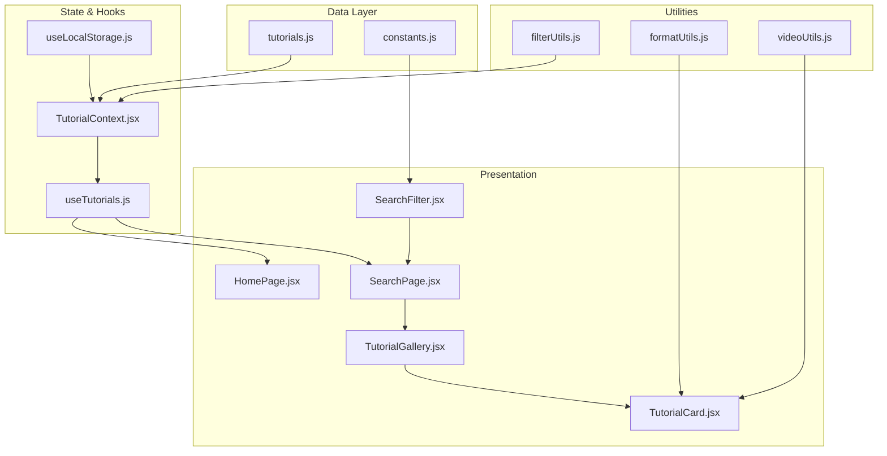

**Diagram sources**
- [tutorials.js:1-522](file://src/data/tutorials.js#L1-L522)
- [constants.js:1-71](file://src/data/constants.js#L1-L71)
- [filterUtils.js:1-99](file://src/utils/filterUtils.js#L1-L99)
- [formatUtils.js:1-45](file://src/utils/formatUtils.js#L1-L45)
- [videoUtils.js:1-119](file://src/utils/videoUtils.js#L1-L119)
- [useLocalStorage.js:1-29](file://src/hooks/useLocalStorage.js#L1-L29)
- [TutorialContext.jsx:1-542](file://src/contexts/TutorialContext.jsx#L1-L542)
- [useTutorials.js:1-11](file://src/hooks/useTutorials.js#L1-L11)
- [HomePage.jsx:1-95](file://src/pages/HomePage.jsx#L1-L95)
- [SearchPage.jsx:1-141](file://src/pages/SearchPage.jsx#L1-L141)
- [SearchFilter.jsx:1-237](file://src/components/SearchFilter.jsx#L1-L237)
- [TutorialGallery.jsx:1-138](file://src/components/TutorialGallery.jsx#L1-L138)
- [TutorialCard.jsx:1-110](file://src/components/TutorialCard.jsx#L1-L110)

**Section sources**
- [tutorials.js:1-522](file://src/data/tutorials.js#L1-L522)
- [constants.js:1-71](file://src/data/constants.js#L1-L71)
- [TutorialContext.jsx:1-542](file://src/contexts/TutorialContext.jsx#L1-L542)
- [filterUtils.js:1-99](file://src/utils/filterUtils.js#L1-L99)
- [formatUtils.js:1-45](file://src/utils/formatUtils.js#L1-L45)
- [videoUtils.js:1-119](file://src/utils/videoUtils.js#L1-L119)
- [useLocalStorage.js:1-29](file://src/hooks/useLocalStorage.js#L1-L29)
- [HomePage.jsx:1-95](file://src/pages/HomePage.jsx#L1-L95)
- [SearchPage.jsx:1-141](file://src/pages/SearchPage.jsx#L1-L141)
- [SearchFilter.jsx:1-237](file://src/components/SearchFilter.jsx#L1-L237)
- [TutorialGallery.jsx:1-138](file://src/components/TutorialGallery.jsx#L1-L138)
- [TutorialCard.jsx:1-110](file://src/components/TutorialCard.jsx#L1-L110)
- [useTutorials.js:1-11](file://src/hooks/useTutorials.js#L1-L11)
- [useDebounce.js:1-16](file://src/hooks/useDebounce.js#L1-L16)

## Core Components
- Static tutorial dataset: A large array of tutorial objects with metadata such as title, description, category, difficulty, platform, engine version, tags, author, timestamps, and metrics.
- Context provider: Merges static tutorials with approved submissions, overlays dynamic user data (ratings, views, bookmarks, etc.), computes derived lists (featured, popular, “For You”), and exposes functions to mutate state.
- Utilities:
  - filterUtils: Implements text search, category/difficulty/platform/engine filters, duration range matching, minimum rating threshold, and sorting.
  - formatUtils: Formats durations, view counts, dates, ratings, and truncates text.
  - videoUtils: Extracts video IDs, generates embed/thumbnail URLs, validates URLs, and checks availability via oEmbed endpoints.
- Hooks:
  - useLocalStorage: Reads/writes to localStorage with safe error handling.
  - useTutorials: Accessor hook for context values and functions.
  - useDebounce: Debounces user input for search suggestions and URL sync.
- Pages and Components:
  - SearchPage: Synchronizes filters and sort order to/from URL parameters, renders filters and gallery.
  - HomePage: Renders featured, popular, and personalized “For You” galleries.
  - SearchFilter: Checkbox and dropdown filters, recent searches, debounced query persistence.
  - TutorialGallery: Pagination, empty state, and result count.
  - TutorialCard: Thumbnail, metadata badges, bookmark toggling, and navigation.

**Section sources**
- [tutorials.js:1-522](file://src/data/tutorials.js#L1-L522)
- [TutorialContext.jsx:18-88](file://src/contexts/TutorialContext.jsx#L18-L88)
- [filterUtils.js:1-99](file://src/utils/filterUtils.js#L1-L99)
- [formatUtils.js:1-45](file://src/utils/formatUtils.js#L1-L45)
- [videoUtils.js:1-119](file://src/utils/videoUtils.js#L1-L119)
- [useLocalStorage.js:1-29](file://src/hooks/useLocalStorage.js#L1-L29)
- [SearchPage.jsx:12-104](file://src/pages/SearchPage.jsx#L12-L104)
- [HomePage.jsx:9-51](file://src/pages/HomePage.jsx#L9-L51)
- [SearchFilter.jsx:19-81](file://src/components/SearchFilter.jsx#L19-L81)
- [TutorialGallery.jsx:23-86](file://src/components/TutorialGallery.jsx#L23-L86)
- [TutorialCard.jsx:14-104](file://src/components/TutorialCard.jsx#L14-L104)
- [useTutorials.js:4-10](file://src/hooks/useTutorials.js#L4-L10)
- [useDebounce.js:3-15](file://src/hooks/useDebounce.js#L3-L15)

## Architecture Overview
The system enforces a strict unidirectional data flow:
- Data source: Static tutorials and constants feed the context.
- Processing: Context merges and augments data, applies filters and sorts.
- Presentation: Pages and components consume computed props and trigger mutations via context functions.
- Persistence: Local storage stores filters, sort order, and user-specific state.

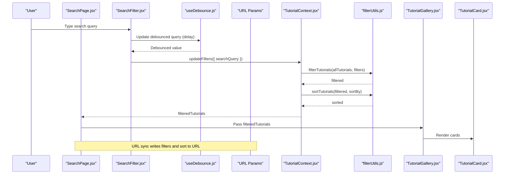

**Diagram sources**
- [SearchPage.jsx:25-81](file://src/pages/SearchPage.jsx#L25-L81)
- [SearchFilter.jsx:22-36](file://src/components/SearchFilter.jsx#L22-L36)
- [useDebounce.js:3-15](file://src/hooks/useDebounce.js#L3-L15)
- [TutorialContext.jsx:68-71](file://src/contexts/TutorialContext.jsx#L68-L71)
- [filterUtils.js:1-99](file://src/utils/filterUtils.js#L1-L99)
- [TutorialGallery.jsx:23-44](file://src/components/TutorialGallery.jsx#L23-L44)
- [TutorialCard.jsx:14-104](file://src/components/TutorialCard.jsx#L14-L104)

## Detailed Component Analysis

### Data Sources and Context Provider
- Static dataset: Loaded once and exported as default.
- Constants: Categories, difficulties, platforms, engine versions, sort options, duration ranges, and video platform patterns.
- Context merges:
  - Approved submissions are appended to the static dataset.
  - Ratings and view logs are overlaid to adjust computed averages and counts.
- Derived computations:
  - Featured, popular, and “For You” lists are computed from merged data.
  - Sorting is delegated to utilities.
- Mutations:
  - Ratings, reviews, bookmarks, completion, review votes, freshness votes, followed tags, and submissions are persisted via local storage hooks.

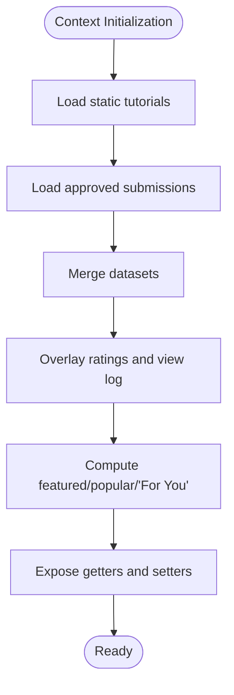

**Diagram sources**
- [TutorialContext.jsx:37-81](file://src/contexts/TutorialContext.jsx#L37-L81)
- [tutorials.js:1-522](file://src/data/tutorials.js#L1-L522)

**Section sources**
- [tutorials.js:1-522](file://src/data/tutorials.js#L1-L522)
- [TutorialContext.jsx:36-81](file://src/contexts/TutorialContext.jsx#L36-L81)

### Filter Processing Pipeline
- filterTutorials applies:
  - Text search across title, description, tags, and author.
  - Category, difficulty, platform, and engine version inclusion.
  - Duration range bounds.
  - Minimum rating threshold.
- sortTutorials supports newest, popularity, highest-rated, and most-viewed.
- getActiveFilterCount helps UI surface active filters.

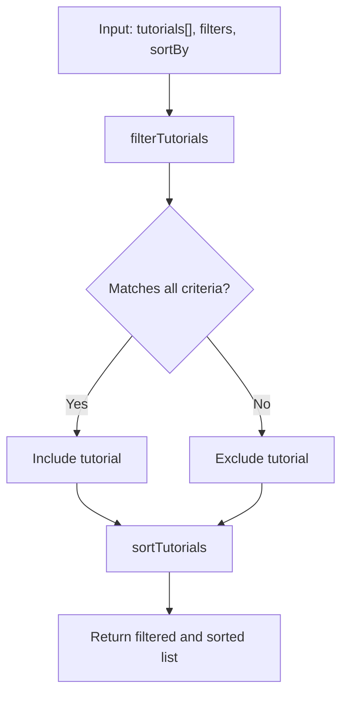

**Diagram sources**
- [filterUtils.js:1-99](file://src/utils/filterUtils.js#L1-L99)

**Section sources**
- [filterUtils.js:1-99](file://src/utils/filterUtils.js#L1-L99)

### Display Formatting Utilities
- formatDuration: Human-friendly duration strings.
- formatViewCount: K/M abbreviations.
- formatDate: Relative time (“Today”, “Yesterday”, etc.).
- formatRating: Rounded to one decimal.
- truncateText: Safe truncation with ellipsis.

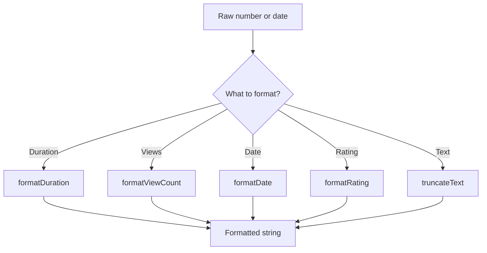

**Diagram sources**
- [formatUtils.js:1-45](file://src/utils/formatUtils.js#L1-L45)

**Section sources**
- [formatUtils.js:1-45](file://src/utils/formatUtils.js#L1-L45)

### Local Storage Integration
- useLocalStorage reads initial values from localStorage with fallback and wraps setters to persist changes.
- Context initializes multiple keys for filters, sort order, ratings, reviews, bookmarks, submissions, view logs, completion, review votes, freshness votes, and followed tags.

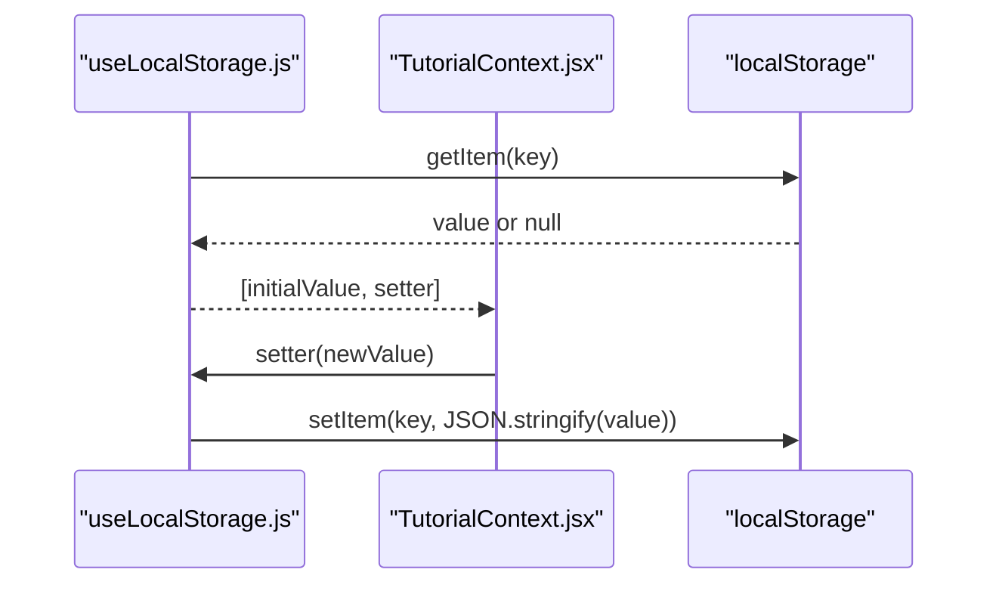

**Diagram sources**
- [useLocalStorage.js:3-28](file://src/hooks/useLocalStorage.js#L3-L28)
- [TutorialContext.jsx:18-34](file://src/contexts/TutorialContext.jsx#L18-L34)

**Section sources**
- [useLocalStorage.js:1-29](file://src/hooks/useLocalStorage.js#L1-L29)
- [TutorialContext.jsx:18-34](file://src/contexts/TutorialContext.jsx#L18-L34)

### Search and URL Synchronization
- SearchPage reads URL params on mount and pushes them into context filters and sort order.
- On subsequent changes, it writes filters and sort back to URL parameters.
- Debounce ensures frequent keystrokes do not flood URL updates.

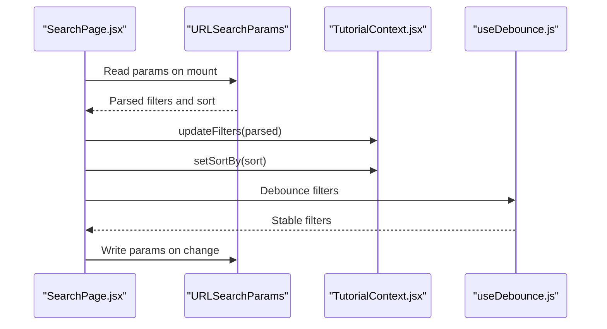

**Diagram sources**
- [SearchPage.jsx:25-81](file://src/pages/SearchPage.jsx#L25-L81)
- [useDebounce.js:3-15](file://src/hooks/useDebounce.js#L3-L15)

**Section sources**
- [SearchPage.jsx:25-81](file://src/pages/SearchPage.jsx#L25-L81)
- [useDebounce.js:3-15](file://src/hooks/useDebounce.js#L3-L15)

### External Video Platform Integration
- videoUtils extracts video IDs from supported platforms, generates embed and thumbnail URLs, validates URLs, and checks availability via oEmbed endpoints.
- This enables consistent thumbnail rendering and embed playback while handling unsupported or inaccessible links gracefully.

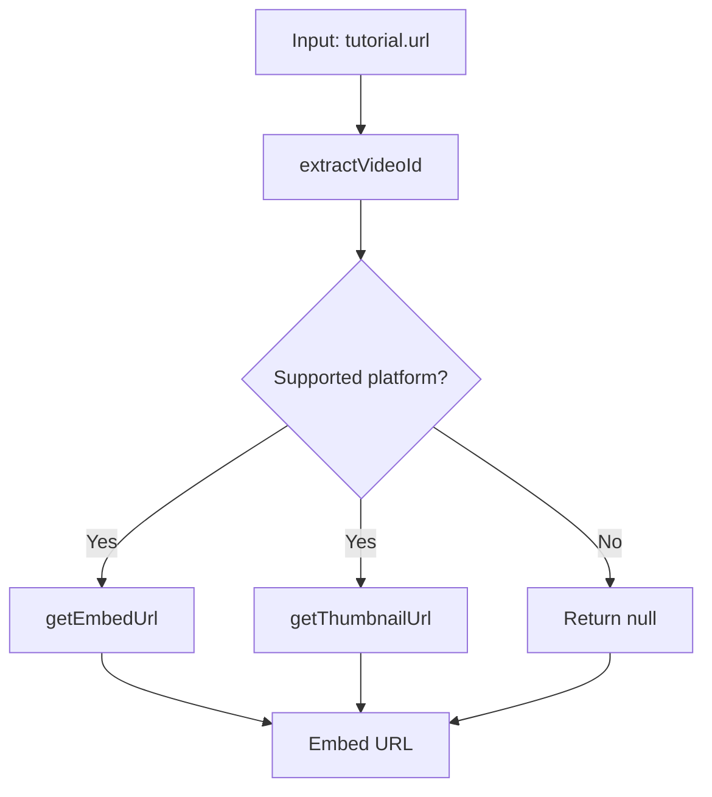

**Diagram sources**
- [videoUtils.js:3-39](file://src/utils/videoUtils.js#L3-L39)
- [constants.js:55-70](file://src/data/constants.js#L55-L70)

**Section sources**
- [videoUtils.js:1-119](file://src/utils/videoUtils.js#L1-L119)
- [constants.js:55-70](file://src/data/constants.js#L55-L70)

### Common Data Flow Scenarios

#### Scenario 1: Search and Filtering
- User types in SearchFilter; debounced query updates context filters.
- Context recomputes filteredTutorials via filterUtils and sortUtils.
- SearchPage displays results in TutorialGallery with pagination and filter chips.

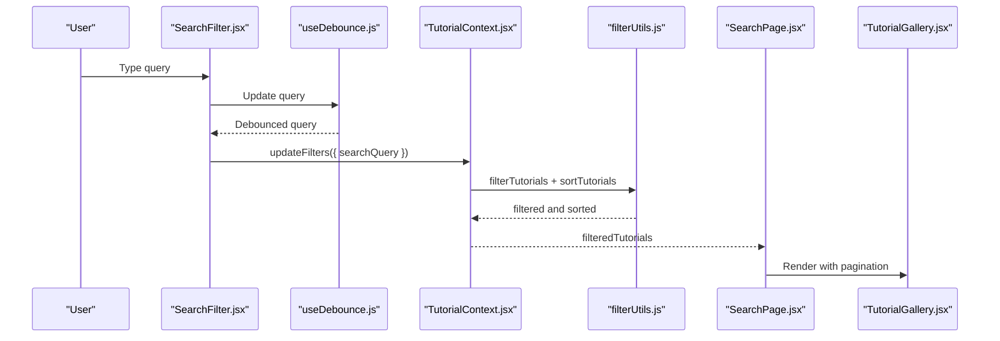

**Diagram sources**
- [SearchFilter.jsx:22-36](file://src/components/SearchFilter.jsx#L22-L36)
- [useDebounce.js:3-15](file://src/hooks/useDebounce.js#L3-L15)
- [TutorialContext.jsx:68-71](file://src/contexts/TutorialContext.jsx#L68-L71)
- [filterUtils.js:1-99](file://src/utils/filterUtils.js#L1-L99)
- [SearchPage.jsx:105-135](file://src/pages/SearchPage.jsx#L105-L135)
- [TutorialGallery.jsx:23-44](file://src/components/TutorialGallery.jsx#L23-L44)

#### Scenario 2: Tutorial Selection and Navigation
- User clicks a TutorialCard; app navigates to the tutorial detail route.
- Card uses formatUtils for display and interacts with context for bookmarks and completion status.

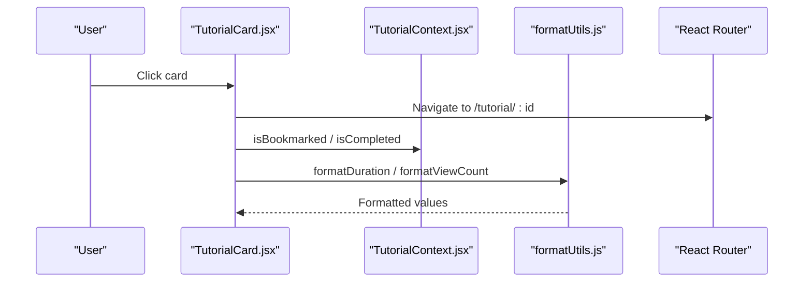

**Diagram sources**
- [TutorialCard.jsx:25-37](file://src/components/TutorialCard.jsx#L25-L37)
- [formatUtils.js:1-45](file://src/utils/formatUtils.js#L1-L45)
- [TutorialContext.jsx:149-154](file://src/contexts/TutorialContext.jsx#L149-L154)

#### Scenario 3: User Preference Management
- User toggles bookmarks or marks completion; context updates local storage-backed state.
- HomePage conditionally renders “For You” based on followed tags.

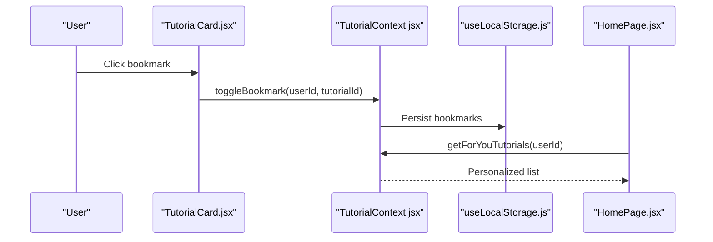

**Diagram sources**
- [TutorialCard.jsx:29-37](file://src/components/TutorialCard.jsx#L29-L37)
- [TutorialContext.jsx:133-147](file://src/contexts/TutorialContext.jsx#L133-L147)
- [useLocalStorage.js:14-25](file://src/hooks/useLocalStorage.js#L14-L25)
- [HomePage.jsx:16-16](file://src/pages/HomePage.jsx#L16-L16)

**Section sources**
- [SearchFilter.jsx:62-80](file://src/components/SearchFilter.jsx#L62-L80)
- [TutorialCard.jsx:29-37](file://src/components/TutorialCard.jsx#L29-L37)
- [HomePage.jsx:16-16](file://src/pages/HomePage.jsx#L16-L16)
- [TutorialContext.jsx:133-147](file://src/contexts/TutorialContext.jsx#L133-L147)

## Dependency Analysis
- Cohesion: Context encapsulates all state and derived computations; utilities are cohesive around specific concerns (filtering, formatting, video).
- Coupling: Pages depend on context via a small accessor hook; components depend on utilities for formatting and constants for options.
- External integrations: videoUtils depends on constants’ platform patterns; SearchPage depends on URL APIs.

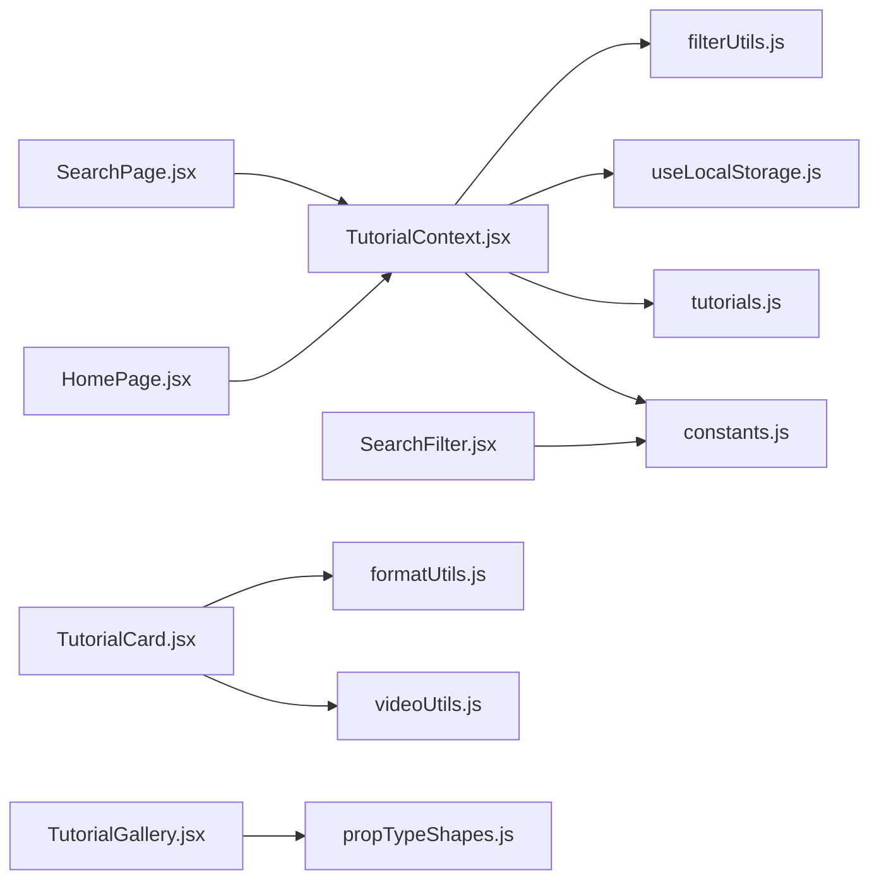

**Diagram sources**
- [TutorialContext.jsx:1-6](file://src/contexts/TutorialContext.jsx#L1-L6)
- [filterUtils.js:1-5](file://src/utils/filterUtils.js#L1-L5)
- [useLocalStorage.js:1-3](file://src/hooks/useLocalStorage.js#L1-L3)
- [tutorials.js:1-2](file://src/data/tutorials.js#L1-L2)
- [constants.js:1-8](file://src/data/constants.js#L1-L8)
- [SearchPage.jsx:1-10](file://src/pages/SearchPage.jsx#L1-L10)
- [HomePage.jsx:1-7](file://src/pages/HomePage.jsx#L1-L7)
- [SearchFilter.jsx:1-6](file://src/components/SearchFilter.jsx#L1-L6)
- [TutorialCard.jsx:1-12](file://src/components/TutorialCard.jsx#L1-L12)
- [formatUtils.js:1-4](file://src/utils/formatUtils.js#L1-L4)
- [videoUtils.js:1-4](file://src/utils/videoUtils.js#L1-L4)
- [TutorialGallery.jsx:1-7](file://src/components/TutorialGallery.jsx#L1-L7)
- [propTypeShapes.js:1-3](file://src/utils/propTypeShapes.js#L1-L3)

**Section sources**
- [TutorialContext.jsx:1-6](file://src/contexts/TutorialContext.jsx#L1-L6)
- [SearchPage.jsx:1-10](file://src/pages/SearchPage.jsx#L1-L10)
- [HomePage.jsx:1-7](file://src/pages/HomePage.jsx#L1-L7)
- [SearchFilter.jsx:1-6](file://src/components/SearchFilter.jsx#L1-L6)
- [TutorialCard.jsx:1-12](file://src/components/TutorialCard.jsx#L1-L12)
- [TutorialGallery.jsx:1-7](file://src/components/TutorialGallery.jsx#L1-L7)
- [propTypeShapes.js:1-3](file://src/utils/propTypeShapes.js#L1-L3)

## Performance Considerations
- Memoization:
  - Context uses useMemo to compute merged tutorials, filtered lists, and derived collections, preventing unnecessary recalculations when dependencies are unchanged.
- Debounced updates:
  - SearchFilter debounces input to reduce frequent updates to filters and URL synchronization.
- Efficient rendering:
  - TutorialGallery paginates results and resets page when data changes, minimizing DOM churn.
  - Components render placeholders for missing thumbnails and avoid heavy computations in render paths.
- Data integrity:
  - Utilities defensively check arrays and values; context merges preserve original metrics while overlaying user contributions.
- External checks:
  - videoUtils falls back to optimistic behavior when network checks fail, avoiding blocking loads.

[No sources needed since this section provides general guidance]

## Troubleshooting Guide
- Filters not applying:
  - Verify URL sync is initialized and filters are written after initialization.
  - Confirm filter keys match expected shapes and values.
- Thumbnails not loading:
  - Ensure thumbnail URLs are generated via videoUtils and fallback placeholders are shown on error.
- Ratings or views not updating:
  - Check that overlay logic in context merges user contributions with base metrics.
- Local storage errors:
  - useLocalStorage warns on read/write failures and falls back to initial values.

**Section sources**
- [SearchPage.jsx:52-81](file://src/pages/SearchPage.jsx#L52-L81)
- [TutorialCard.jsx:42-52](file://src/components/TutorialCard.jsx#L42-L52)
- [TutorialContext.jsx:37-65](file://src/contexts/TutorialContext.jsx#L37-L65)
- [useLocalStorage.js:5-11](file://src/hooks/useLocalStorage.js#L5-L11)

## Conclusion
GameDev Hub’s data flow is centered on a context provider that merges static and dynamic data, applies robust filtering and sorting, and exposes a clean API to pages and components. Utilities ensure consistent transformations and safe integrations with external video platforms. Local storage preserves user preferences and state, while memoization and debouncing optimize performance. This architecture scales cleanly and maintains data integrity across the application.