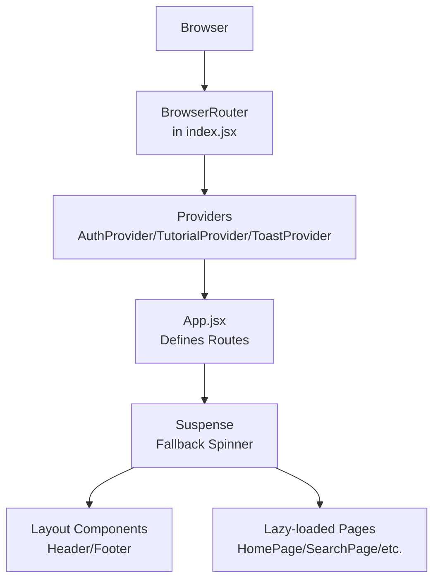
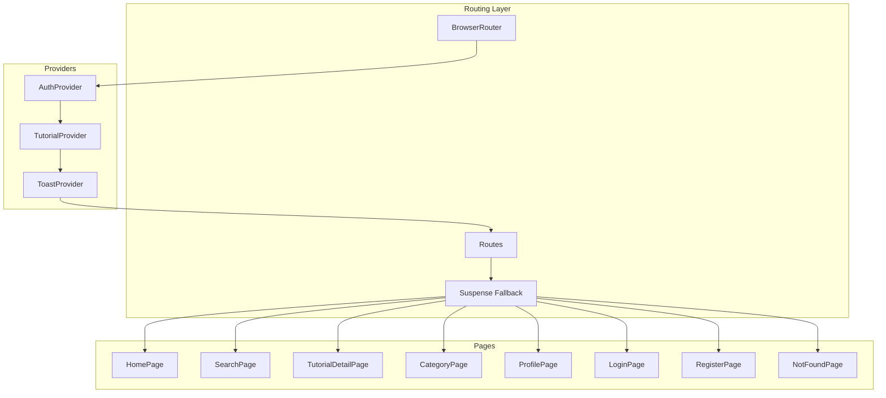
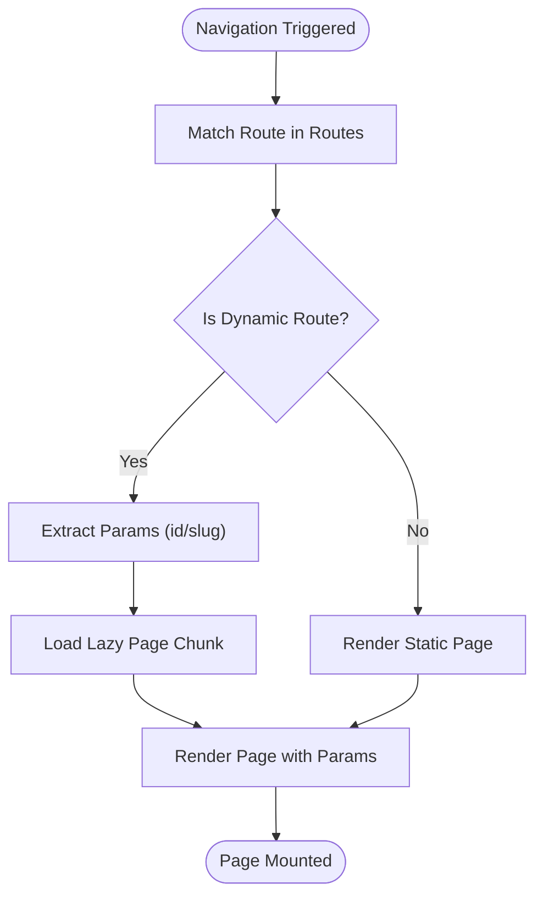
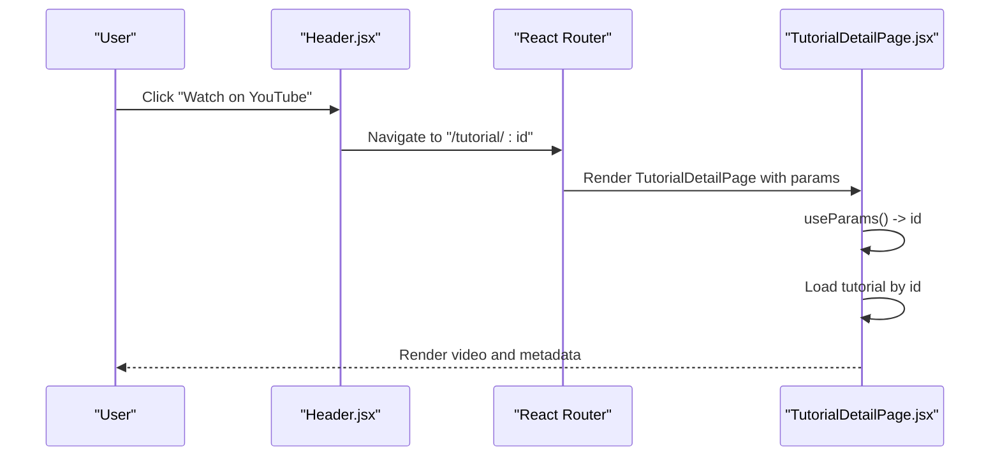
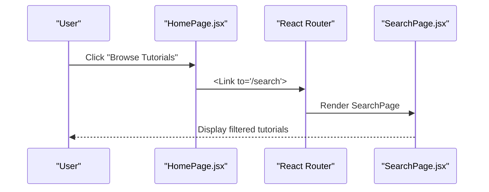
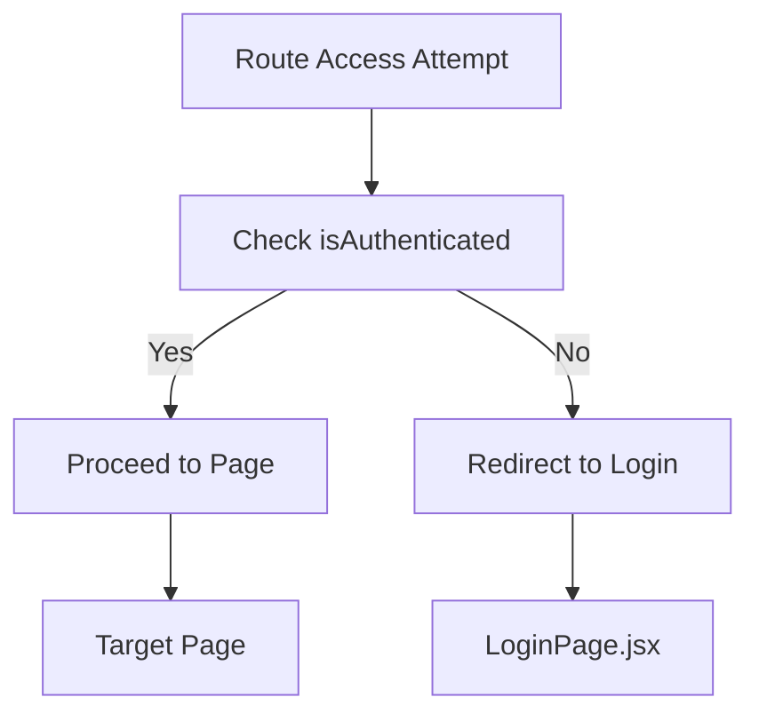
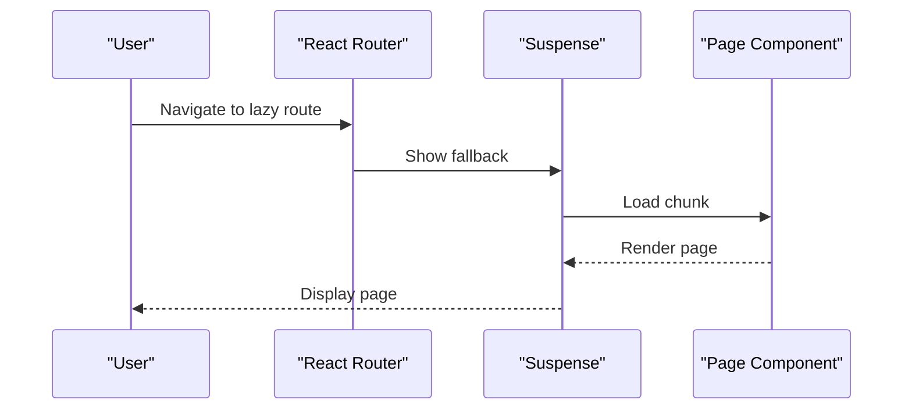
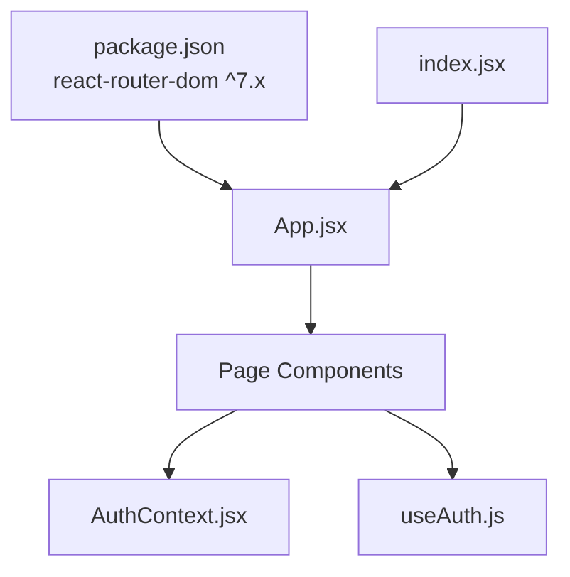

# Routing Architecture

<cite>
**Referenced Files in This Document**
- [App.jsx](file://src/App.jsx)
- [index.jsx](file://src/index.jsx)
- [HomePage.jsx](file://src/pages/HomePage.jsx)
- [TutorialDetailPage.jsx](file://src/pages/TutorialDetailPage.jsx)
- [CategoryPage.jsx](file://src/pages/CategoryPage.jsx)
- [SearchPage.jsx](file://src/pages/SearchPage.jsx)
- [NotFoundPage.jsx](file://src/pages/NotFoundPage.jsx)
- [LoginPage.jsx](file://src/pages/LoginPage.jsx)
- [RegisterPage.jsx](file://src/pages/RegisterPage.jsx)
- [ProfilePage.jsx](file://src/pages/ProfilePage.jsx)
- [SubmitPage.jsx](file://src/pages/SubmitPage.jsx)
- [Header.jsx](file://src/components/layout/Header.jsx)
- [AuthContext.jsx](file://src/contexts/AuthContext.jsx)
- [useAuth.js](file://src/hooks/useAuth.js)
- [package.json](file://package.json)
</cite>

## Table of Contents
1. [Introduction](#introduction)
2. [Project Structure](#project-structure)
3. [Core Components](#core-components)
4. [Architecture Overview](#architecture-overview)
5. [Detailed Component Analysis](#detailed-component-analysis)
6. [Dependency Analysis](#dependency-analysis)
7. [Performance Considerations](#performance-considerations)
8. [Troubleshooting Guide](#troubleshooting-guide)
9. [Conclusion](#conclusion)

## Introduction
This document describes GameDev Hub’s routing architecture built with React Router v7. It explains how routes are configured, how dynamic routes extract parameters, how code splitting is implemented via lazy loading, and how navigation and authentication integrate with the app. It also covers route transitions, error handling, and performance strategies.

## Project Structure
The routing system is centered around a single App component that defines all routes and wraps the application with providers. Providers include routing (BrowserRouter), authentication (AuthProvider), tutorials (TutorialProvider), and toast notifications (ToastProvider). Pages are grouped under src/pages and are lazily loaded to optimize initial load performance.



**Diagram sources**
- [index.jsx:11-24](file://src/index.jsx#L11-L24)
- [App.jsx:21-48](file://src/App.jsx#L21-L48)

**Section sources**
- [index.jsx:1-28](file://src/index.jsx#L1-L28)
- [App.jsx:1-51](file://src/App.jsx#L1-L51)

## Core Components
- App.jsx: Declares all routes, sets up Suspense fallback, and mounts layout and pages.
- index.jsx: Wraps the app with providers and BrowserRouter.
- Page components: Individual pages that render content and manage their own state.
- AuthContext and useAuth: Provide authentication state and guard pages that require login.

Key routing highlights:
- Static routes: "/", "/search", "/submit", "/profile", "/login", "/register".
- Dynamic routes: "/tutorial/:id" and "/category/:slug".
- Catch-all route: "*" renders NotFoundPage.

**Section sources**
- [App.jsx:13-39](file://src/App.jsx#L13-L39)
- [index.jsx:12-22](file://src/index.jsx#L12-L22)

## Architecture Overview
The routing architecture uses React Router v7 with route-level code splitting. Each page component is lazy-loaded using React.lazy and rendered inside Suspense. Authentication state is provided globally and consumed by pages to control navigation and UI.



**Diagram sources**
- [index.jsx:12-22](file://src/index.jsx#L12-L22)
- [App.jsx:28-39](file://src/App.jsx#L28-L39)

## Detailed Component Analysis

### Route Configuration and Lazy Loading
- App.jsx defines all routes and lazily imports pages. Suspense wraps Routes to show a loading spinner while chunks are fetched.
- Dynamic routes:
  - /tutorial/:id → TutorialDetailPage
  - /category/:slug → CategoryPage
- Catch-all "*" → NotFoundPage



**Diagram sources**
- [App.jsx:28-39](file://src/App.jsx#L28-L39)
- [TutorialDetailPage.jsx:22-24](file://src/pages/TutorialDetailPage.jsx#L22-L24)
- [CategoryPage.jsx:8-13](file://src/pages/CategoryPage.jsx#L8-L13)

**Section sources**
- [App.jsx:13-39](file://src/App.jsx#L13-L39)

### Dynamic Routes: Parameter Extraction and Usage
- TutorialDetailPage extracts the tutorial id via useParams and loads data accordingly. It increments view counts and computes related content.
- CategoryPage extracts the slug and resolves it to a category label and tutorials.



**Diagram sources**
- [Header.jsx:14-18](file://src/components/layout/Header.jsx#L14-L18)
- [TutorialDetailPage.jsx:22-24](file://src/pages/TutorialDetailPage.jsx#L22-L24)

**Section sources**
- [TutorialDetailPage.jsx:22-24](file://src/pages/TutorialDetailPage.jsx#L22-L24)
- [CategoryPage.jsx:8-13](file://src/pages/CategoryPage.jsx#L8-L13)

### Navigation Patterns and Programmatic Navigation
- HomePage uses Link to navigate to search, browse categories, and submit tutorials.
- LoginPage and RegisterPage redirect authenticated users away from auth routes.
- Header.jsx uses useNavigate for logout and general navigation.
- TutorialDetailPage uses useNavigate to redirect to login when performing protected actions.



**Diagram sources**
- [HomePage.jsx:32-37](file://src/pages/HomePage.jsx#L32-L37)
- [SearchPage.jsx:105-139](file://src/pages/SearchPage.jsx#L105-L139)

**Section sources**
- [HomePage.jsx:32-37](file://src/pages/HomePage.jsx#L32-L37)
- [Header.jsx:14-18](file://src/components/layout/Header.jsx#L14-L18)
- [LoginPage.jsx:14-17](file://src/pages/LoginPage.jsx#L14-L17)
- [RegisterPage.jsx:16-19](file://src/pages/RegisterPage.jsx#L16-L19)

### Route Guards and Authentication Integration
- AuthContext provides currentUser and isAuthenticated.
- useAuth hook enforces context consumption.
- Several pages guard access:
  - LoginPage and RegisterPage redirect authenticated users.
  - ProfilePage shows a prompt and does not render content for guests.
  - SubmitPage and TutorialDetailPage protect actions by navigating to login when unauthenticated.



**Diagram sources**
- [AuthContext.jsx:17-20](file://src/contexts/AuthContext.jsx#L17-L20)
- [useAuth.js:4-10](file://src/hooks/useAuth.js#L4-L10)
- [LoginPage.jsx:14-17](file://src/pages/LoginPage.jsx#L14-L17)
- [ProfilePage.jsx:44-52](file://src/pages/ProfilePage.jsx#L44-L52)
- [SubmitPage.jsx:43-52](file://src/pages/SubmitPage.jsx#L43-L52)
- [TutorialDetailPage.jsx:125-141](file://src/pages/TutorialDetailPage.jsx#L125-L141)

**Section sources**
- [AuthContext.jsx:13-104](file://src/contexts/AuthContext.jsx#L13-L104)
- [useAuth.js:1-11](file://src/hooks/useAuth.js#L1-L11)
- [LoginPage.jsx:14-17](file://src/pages/LoginPage.jsx#L14-L17)
- [ProfilePage.jsx:44-52](file://src/pages/ProfilePage.jsx#L44-L52)
- [SubmitPage.jsx:43-52](file://src/pages/SubmitPage.jsx#L43-L52)
- [TutorialDetailPage.jsx:125-141](file://src/pages/TutorialDetailPage.jsx#L125-L141)

### Relationship Between Routes and Page Components
- HomePage: Static route "/".
- SearchPage: Static route "/search"; reads URL query parameters and synchronizes filters.
- TutorialDetailPage: Dynamic route "/tutorial/:id"; uses id to fetch and render tutorial details.
- CategoryPage: Dynamic route "/category/:slug"; resolves slug to category and displays tutorials.
- SubmitPage: Static route "/submit"; requires authentication.
- ProfilePage: Static route "/profile"; requires authentication.
- LoginPage: Static route "/login"; redirects authenticated users.
- RegisterPage: Static route "/register"; redirects authenticated users.
- NotFoundPage: Catch-all "*" for 404 handling.

```mermaid
graph LR
"/" --> HP["HomePage.jsx"]
"/search" --> SP["SearchPage.jsx"]
"/tutorial/:id" --> TDP["TutorialDetailPage.jsx"]
"/category/:slug" --> CP["CategoryPage.jsx"]
"/submit" --> SUB["SubmitPage.jsx"]
"/profile" --> PP["ProfilePage.jsx"]
"/login" --> LP["LoginPage.jsx"]
"/register" --> RP["RegisterPage.jsx"]
"*" --> NP["NotFoundPage.jsx"]
```

**Diagram sources**
- [App.jsx:30-38](file://src/App.jsx#L30-L38)

**Section sources**
- [App.jsx:30-38](file://src/App.jsx#L30-L38)

### Route Transitions and Edge Cases
- Suspense fallback: LoadingSpinner is shown during chunk load.
- 404 handling: NotFoundPage renders when no route matches.
- Search synchronization: SearchPage reads URL params on mount and writes back on filter/sort changes.



**Diagram sources**
- [App.jsx:28-40](file://src/App.jsx#L28-L40)
- [NotFoundPage.jsx:5-23](file://src/pages/NotFoundPage.jsx#L5-L23)
- [SearchPage.jsx:22-81](file://src/pages/SearchPage.jsx#L22-L81)

**Section sources**
- [App.jsx:28-40](file://src/App.jsx#L28-L40)
- [NotFoundPage.jsx:5-23](file://src/pages/NotFoundPage.jsx#L5-L23)
- [SearchPage.jsx:22-81](file://src/pages/SearchPage.jsx#L22-L81)

## Dependency Analysis
- App.jsx depends on:
  - React Router DOM for Routes and Route.
  - React.lazy for code splitting.
  - Suspense for fallback rendering.
  - Layout components (Header, Footer) and ErrorBoundary.
- index.jsx composes providers around App:
  - BrowserRouter for routing.
  - AuthProvider, TutorialProvider, ToastProvider for global state.
- Pages depend on:
  - useAuth for authentication checks.
  - useTutorials for data and actions.
  - useNavigate for programmatic navigation.
  - useSearchParams for URL synchronization (SearchPage).



**Diagram sources**
- [package.json:12](file://package.json#L12)
- [index.jsx:12-22](file://src/index.jsx#L12-L22)
- [App.jsx:21-48](file://src/App.jsx#L21-L48)

**Section sources**
- [package.json:12](file://package.json#L12)
- [index.jsx:12-22](file://src/index.jsx#L12-L22)
- [App.jsx:21-48](file://src/App.jsx#L21-L48)

## Performance Considerations
- Route-level code splitting:
  - Pages are lazy-loaded to reduce initial bundle size.
  - Suspense ensures a consistent loading experience while chunks are fetched.
- Minimal re-renders:
  - Pages use memoization (e.g., useMemo) to compute derived data efficiently.
- URL synchronization:
  - SearchPage minimizes URL updates and defers initialization to avoid unnecessary re-renders.
- Provider composition:
  - Providers are layered to keep routing decoupled from business logic.

Recommendations:
- Keep frequently visited static routes (e.g., Home, Search) small and lazy-load heavy pages.
- Consider preloading critical chunks on hover or after initial load.
- Monitor bundle sizes and split further if needed.

**Section sources**
- [App.jsx:13-19](file://src/App.jsx#L13-L19)
- [App.jsx:28-40](file://src/App.jsx#L28-L40)
- [SearchPage.jsx:59-81](file://src/pages/SearchPage.jsx#L59-L81)

## Troubleshooting Guide
Common issues and resolutions:
- Authentication redirects:
  - LoginPage and RegisterPage redirect authenticated users to prevent double-rendering.
  - ProfilePage and SubmitPage show prompts/guards for unauthenticated users.
- Dynamic route mismatches:
  - TutorialDetailPage handles missing tutorials gracefully and offers navigation back to browsing.
  - CategoryPage validates slugs and informs users when invalid.
- 404 handling:
  - NotFoundPage provides clear messaging and navigation options.

**Section sources**
- [LoginPage.jsx:14-17](file://src/pages/LoginPage.jsx#L14-L17)
- [RegisterPage.jsx:16-19](file://src/pages/RegisterPage.jsx#L16-L19)
- [ProfilePage.jsx:44-52](file://src/pages/ProfilePage.jsx#L44-L52)
- [SubmitPage.jsx:43-52](file://src/pages/SubmitPage.jsx#L43-L52)
- [TutorialDetailPage.jsx:87-101](file://src/pages/TutorialDetailPage.jsx#L87-L101)
- [CategoryPage.jsx:15-24](file://src/pages/CategoryPage.jsx#L15-L24)
- [NotFoundPage.jsx:5-23](file://src/pages/NotFoundPage.jsx#L5-L23)

## Conclusion
GameDev Hub’s routing architecture leverages React Router v7 with route-level code splitting and Suspense for a responsive user experience. Dynamic routes enable deep-linking and personalized content, while authentication guards ensure secure access to protected features. The provider model keeps routing concerns separate from business logic, supporting maintainability and scalability.