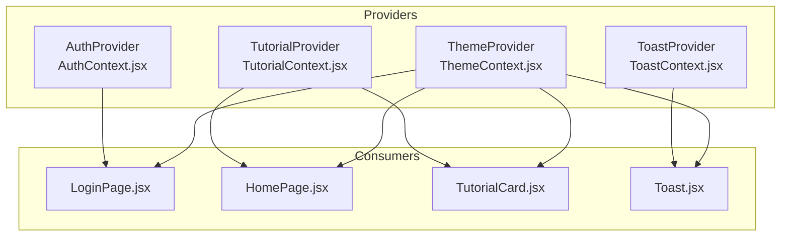
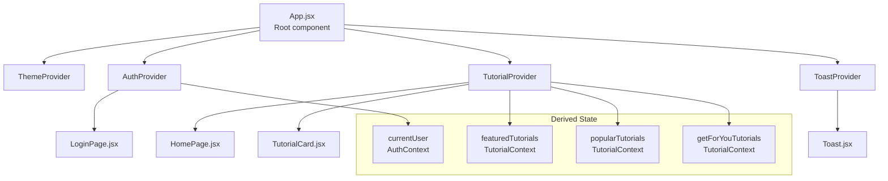
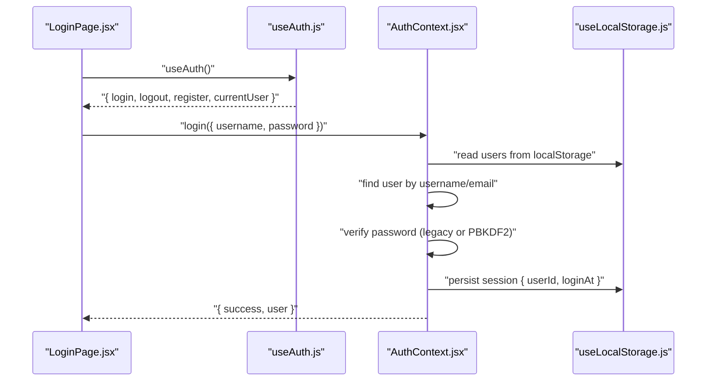
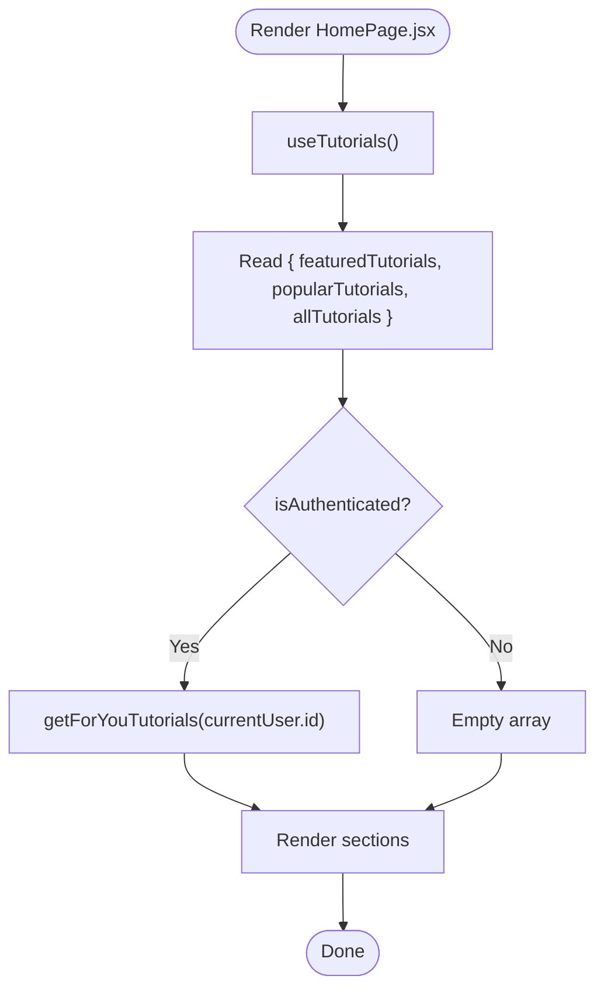
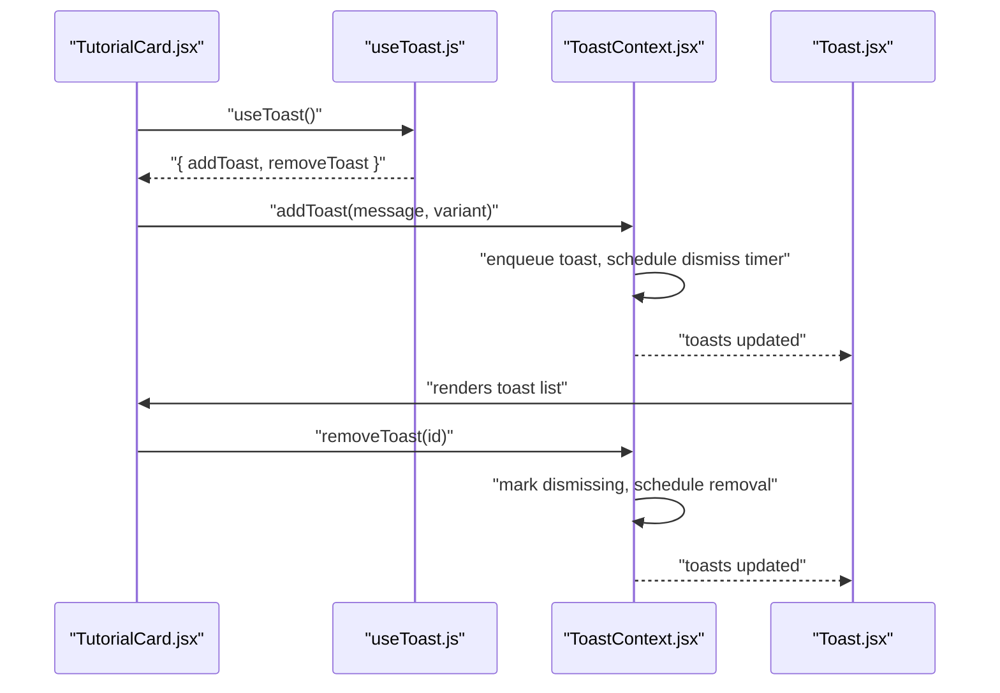
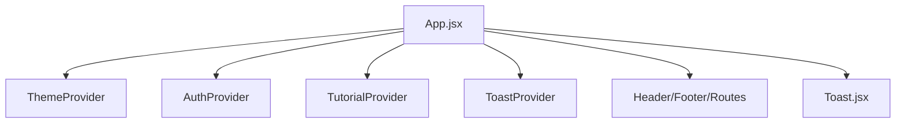
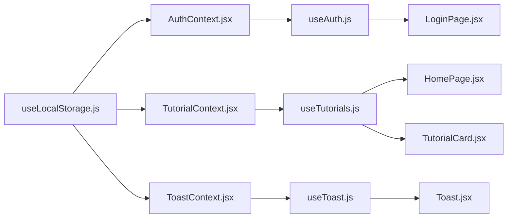

# State Management Patterns

<cite>
**Referenced Files in This Document**
- [AuthContext.jsx](file://src/contexts/AuthContext.jsx)
- [TutorialContext.jsx](file://src/contexts/TutorialContext.jsx)
- [ToastContext.jsx](file://src/contexts/ToastContext.jsx)
- [useAuth.js](file://src/hooks/useAuth.js)
- [useTutorials.js](file://src/hooks/useTutorials.js)
- [useToast.js](file://src/hooks/useToast.js)
- [useLocalStorage.js](file://src/hooks/useLocalStorage.js)
- [App.jsx](file://src/App.jsx)
- [LoginPage.jsx](file://src/pages/LoginPage.jsx)
- [HomePage.jsx](file://src/pages/HomePage.jsx)
- [TutorialCard.jsx](file://src/components/TutorialCard.jsx)
- [Toast.jsx](file://src/components/Toast.jsx)
- [ThemeContext.jsx](file://src/contexts/ThemeContext.jsx)
- [tutorials.js](file://src/data/tutorials.js)
</cite>

## Table of Contents
1. [Introduction](#introduction)
2. [Project Structure](#project-structure)
3. [Core Components](#core-components)
4. [Architecture Overview](#architecture-overview)
5. [Detailed Component Analysis](#detailed-component-analysis)
6. [Dependency Analysis](#dependency-analysis)
7. [Performance Considerations](#performance-considerations)
8. [Troubleshooting Guide](#troubleshooting-guide)
9. [Conclusion](#conclusion)
10. [Appendices](#appendices)

## Introduction
This document explains GameDev Hub’s state management architecture built on React Context API. It focuses on three primary providers:
- Authentication state via AuthContext.jsx
- Tutorial data and user-driven features via TutorialContext.jsx
- Notification handling via ToastContext.jsx

It also documents the custom hooks (useAuth.js, useTutorials.js, useToast.js) that expose clean, typed interfaces to context consumers, and how components subscribe to and update state. Persistence is handled through localStorage integration via a reusable hook, and session management is integrated with authentication. The document covers state update patterns, subscription mechanisms, provider composition, state normalization, cross-context interactions, and guidance on when to use local component state versus global context state.

## Project Structure
The state management layer is organized around three contexts and their associated custom hooks. Providers are composed at the application root, and components consume context through thin hooks.

**Diagram sources**
- [App.jsx:21-47](file://src/App.jsx#L21-L47)
- [AuthContext.jsx:13-104](file://src/contexts/AuthContext.jsx#L13-L104)
- [TutorialContext.jsx:18-541](file://src/contexts/TutorialContext.jsx#L18-L541)
- [ToastContext.jsx:5-50](file://src/contexts/ToastContext.jsx#L5-L50)
- [ThemeContext.jsx:5-26](file://src/contexts/ThemeContext.jsx#L5-L26)

**Section sources**
- [App.jsx:1-51](file://src/App.jsx#L1-L51)

## Core Components
- AuthContext.jsx: Manages user registration, login/logout, current user derivation, and session persistence via localStorage.
- TutorialContext.jsx: Centralizes tutorial data, user interactions (bookmarks, ratings, reviews, completion, voting, freshness, tags), submissions, sorting, filtering, and popularity/featured computations.
- ToastContext.jsx: Provides a queue-based notification system with auto-dismiss and manual dismissal.
- Custom hooks: useAuth.js, useTutorials.js, useToast.js wrap useContext with validation and return the shared context value.
- Persistence: useLocalStorage.js reads/writes to localStorage and ensures safe initialization.

Key patterns:
- Provider Pattern: Each context exports a Provider component that wraps children and exposes a memoized value object.
- Memoization: useMemo is used to prevent unnecessary recomputation of derived state and action objects.
- useCallback: Action functions are wrapped to keep referential stability across renders.
- localStorage integration: useLocalStorage persists primitive collections and primitives under stable keys.

**Section sources**
- [AuthContext.jsx:13-104](file://src/contexts/AuthContext.jsx#L13-L104)
- [TutorialContext.jsx:18-541](file://src/contexts/TutorialContext.jsx#L18-L541)
- [ToastContext.jsx:5-50](file://src/contexts/ToastContext.jsx#L5-L50)
- [useAuth.js:1-11](file://src/hooks/useAuth.js#L1-L11)
- [useTutorials.js:1-11](file://src/hooks/useTutorials.js#L1-L11)
- [useToast.js:1-11](file://src/hooks/useToast.js#L1-L11)
- [useLocalStorage.js:1-29](file://src/hooks/useLocalStorage.js#L1-L29)

## Architecture Overview
The application composes multiple providers at the root. Consumers use thin hooks to access context values. Authentication state influences UI visibility and routing. Tutorial context powers discovery, personalization, and user actions. Toast context centralizes notifications.

**Diagram sources**
- [App.jsx:21-47](file://src/App.jsx#L21-L47)
- [AuthContext.jsx:17-20](file://src/contexts/AuthContext.jsx#L17-L20)
- [TutorialContext.jsx:74-81](file://src/contexts/TutorialContext.jsx#L74-L81)
- [TutorialContext.jsx:79-81](file://src/contexts/TutorialContext.jsx#L79-L81)
- [TutorialContext.jsx:341-349](file://src/contexts/TutorialContext.jsx#L341-L349)

## Detailed Component Analysis

### AuthContext.jsx
Implements authentication state and session management:
- Stores users and session in localStorage via useLocalStorage.
- Derives currentUser from session and users.
- Exposes register, login, logout actions with validation and hashing.
- Supports legacy password hash migration to modern PBKDF2.

**Diagram sources**
- [LoginPage.jsx:19-39](file://src/pages/LoginPage.jsx#L19-L39)
- [useAuth.js:4-10](file://src/hooks/useAuth.js#L4-L10)
- [AuthContext.jsx:54-86](file://src/contexts/AuthContext.jsx#L54-L86)
- [useLocalStorage.js:3-28](file://src/hooks/useLocalStorage.js#L3-L28)

State update pattern:
- Actions are memoized via useCallback to avoid recreating functions on each render.
- Values are memoized via useMemo to prevent unnecessary re-renders of consumers.

Subscription mechanism:
- Components call useAuth() to receive the context value. When AuthProvider updates state, all consumers re-render.

Persistence:
- Session and user registry persisted via useLocalStorage with stable keys.

Error handling:
- Validation errors returned as { success: false, error } from login/register.
- Legacy hash detection triggers silent migration to PBKDF2.

**Section sources**
- [AuthContext.jsx:13-104](file://src/contexts/AuthContext.jsx#L13-L104)
- [LoginPage.jsx:19-39](file://src/pages/LoginPage.jsx#L19-L39)

### TutorialContext.jsx
Centralizes tutorial data and user-driven features:
- Merges default tutorials with approved submissions and overlays dynamic stats (ratings, views).
- Computes derived lists: all, featured, popular, filtered/sorted.
- Exposes CRUD-like actions for ratings, reviews, bookmarks, completion, review voting, freshness voting, tag following, and submissions.
- Provides helpers to fetch tutorials by category and manage filters/sorting.

**Diagram sources**
- [HomePage.jsx:10-16](file://src/pages/HomePage.jsx#L10-L16)
- [TutorialContext.jsx:37-81](file://src/contexts/TutorialContext.jsx#L37-L81)
- [TutorialContext.jsx:341-349](file://src/contexts/TutorialContext.jsx#L341-L349)

State update pattern:
- Each action is a useCallback-wrapped function that updates localStorage-backed state via the setter returned by useLocalStorage.
- Derived state (filtered/sorted lists, computed stats) is recomputed via useMemo when dependencies change.

Subscription mechanism:
- Components call useTutorials() to receive the context value. Updates to localStorage trigger re-computation and re-render.

Persistence:
- Ratings, reviews, bookmarks, submissions, view logs, filters, sort preference, and feature toggles are persisted under dedicated keys.

Cross-context interactions:
- HomePage consumes both AuthContext (isAuthenticated) and TutorialContext (tutorials lists).
- TutorialCard consumes AuthContext (currentUser), TutorialContext (bookmarks/completion/freshness), and ToastContext (notifications).

**Section sources**
- [TutorialContext.jsx:18-541](file://src/contexts/TutorialContext.jsx#L18-L541)
- [HomePage.jsx:10-16](file://src/pages/HomePage.jsx#L10-L16)
- [TutorialCard.jsx:16-23](file://src/components/TutorialCard.jsx#L16-L23)

### ToastContext.jsx
Provides a lightweight notification system:
- Maintains a queue of toasts with auto-dismiss after a timeout and manual dismissal.
- Limits the number of concurrent toasts.
- Uses refs to track timers and clears them on unmount.

**Diagram sources**
- [TutorialCard.jsx:36-37](file://src/components/TutorialCard.jsx#L36-L37)
- [useToast.js:4-10](file://src/hooks/useToast.js#L4-L10)
- [ToastContext.jsx:27-40](file://src/contexts/ToastContext.jsx#L27-L40)
- [Toast.jsx:6-28](file://src/components/Toast.jsx#L6-L28)

**Section sources**
- [ToastContext.jsx:5-50](file://src/contexts/ToastContext.jsx#L5-L50)
- [Toast.jsx:1-32](file://src/components/Toast.jsx#L1-L32)

### Custom Hooks: useAuth.js, useTutorials.js, useToast.js
- Each hook calls useContext on its respective context.
- Throws a descriptive error if used outside its Provider, enforcing proper composition.

Usage pattern:
- Components import the hook and immediately destructure required fields.
- Hooks encapsulate context access and validation, keeping components concise.

**Section sources**
- [useAuth.js:1-11](file://src/hooks/useAuth.js#L1-L11)
- [useTutorials.js:1-11](file://src/hooks/useTutorials.js#L1-L11)
- [useToast.js:1-11](file://src/hooks/useToast.js#L1-L11)

### Provider Composition in App.jsx
- ThemeProvider sets the theme and persists it to localStorage.
- AuthProvider, TutorialProvider, and ToastProvider wrap the UI tree.
- ErrorBoundary and Suspense are layered for robust UX.
- Toast component is rendered at the root to display notifications globally.

**Diagram sources**
- [App.jsx:21-47](file://src/App.jsx#L21-L47)

**Section sources**
- [App.jsx:1-51](file://src/App.jsx#L1-L51)

## Dependency Analysis
- Local storage dependency: All three contexts rely on useLocalStorage for persistence. This introduces a single point of truth for state across browser sessions.
- Derived-state dependency: TutorialContext computes derived data (filtered/sorted lists, popularity, featured) from base arrays and localStorage-backed overlays.
- Cross-context dependency: HomePage depends on both AuthContext (isAuthenticated) and TutorialContext (lists). TutorialCard depends on AuthContext (currentUser), TutorialContext (bookmarks/completion/freshness), and ToastContext (notifications).
- Provider order: ThemeProvider is placed before others to ensure theme-related DOM attributes are initialized early.

**Diagram sources**
- [useLocalStorage.js:3-28](file://src/hooks/useLocalStorage.js#L3-L28)
- [AuthContext.jsx:14-15](file://src/contexts/AuthContext.jsx#L14-L15)
- [TutorialContext.jsx:19-25](file://src/contexts/TutorialContext.jsx#L19-L25)
- [ToastContext.jsx:6](file://src/contexts/ToastContext.jsx#L6)
- [useAuth.js:4-10](file://src/hooks/useAuth.js#L4-L10)
- [useTutorials.js:4-10](file://src/hooks/useTutorials.js#L4-L10)
- [useToast.js:4-10](file://src/hooks/useToast.js#L4-L10)
- [LoginPage.jsx:11](file://src/pages/LoginPage.jsx#L11)
- [HomePage.jsx:10-11](file://src/pages/HomePage.jsx#L10-L11)
- [TutorialCard.jsx:16-18](file://src/components/TutorialCard.jsx#L16-L18)
- [Toast.jsx:6](file://src/components/Toast.jsx#L6)

**Section sources**
- [useLocalStorage.js:1-29](file://src/hooks/useLocalStorage.js#L1-L29)
- [AuthContext.jsx:13-104](file://src/contexts/AuthContext.jsx#L13-L104)
- [TutorialContext.jsx:18-541](file://src/contexts/TutorialContext.jsx#L18-L541)
- [ToastContext.jsx:5-50](file://src/contexts/ToastContext.jsx#L5-L50)

## Performance Considerations
- Memoization:
  - useMemo is used to compute derived state (e.g., currentUser, filtered/popular lists, featured lists) and to memoize the context value object. This prevents unnecessary re-renders of consumers.
- Stable callbacks:
  - useCallback wraps action functions to maintain referential equality across renders, reducing downstream re-renders.
- Selective re-renders:
  - Consumers only subscribe to the parts of context they need (e.g., HomePage reads featured/popular lists; TutorialCard reads bookmarks/completion). This limits re-render scope.
- Local storage batching:
  - useLocalStorage writes are synchronous but batched per setter invocation. For heavy updates, consider grouping operations to minimize repeated localStorage writes.
- Derived computation cost:
  - Sorting and filtering are performed on derived arrays. For very large datasets, consider pagination or virtualization to reduce render cost.
- Timer cleanup:
  - ToastProvider cleans up timeouts on unmount to avoid memory leaks.

[No sources needed since this section provides general guidance]

## Troubleshooting Guide
Common issues and resolutions:
- Using hooks outside providers:
  - All custom hooks throw if used outside their Provider. Ensure App.jsx composes providers correctly.
- Authentication state not persisting:
  - Verify localStorage keys for session and users. Confirm useLocalStorage initialization and write paths.
- Tutorial lists not updating:
  - Check that submission approvals and localStorage overlays are applied. Ensure derived lists depend on the correct keys.
- Toasts not appearing/disappearing:
  - Confirm addToast/removeToast are called and that Toast component is rendered at the root.
- Legacy password migration:
  - If login succeeds with old hash, verify PBKDF2 migration occurs and users are updated in localStorage.

**Section sources**
- [useAuth.js:6-8](file://src/hooks/useAuth.js#L6-L8)
- [useTutorials.js:6-8](file://src/hooks/useTutorials.js#L6-L8)
- [useToast.js:6-8](file://src/hooks/useToast.js#L6-L8)
- [AuthContext.jsx:63-74](file://src/contexts/AuthContext.jsx#L63-L74)
- [ToastContext.jsx:9-14](file://src/contexts/ToastContext.jsx#L9-L14)

## Conclusion
GameDev Hub’s state management leverages React Context API with a clear Provider Pattern and thin custom hooks. Authentication, tutorial data, and notifications are cleanly separated and composed at the root. Persistence is achieved through localStorage-backed hooks, ensuring continuity across sessions. Derived state and memoization keep rendering efficient, while cross-context interactions enable personalized experiences. Following the guidelines below will help maintain scalability and clarity as the application grows.

## Appendices

### Provider Composition Checklist
- Ensure ThemeProvider, AuthProvider, TutorialProvider, and ToastProvider wrap the application root.
- Place Toast component at the root to display notifications globally.
- Keep hooks inside Provider boundaries; otherwise, they will throw.

**Section sources**
- [App.jsx:21-47](file://src/App.jsx#L21-L47)

### When to Use Local Component State vs Global Context State
- Use local component state for:
  - UI-only flags (e.g., form field values, modal open/close).
  - Short-lived transient data not needed across routes.
- Use global context state for:
  - Shared user/session data.
  - Cross-component data that affects multiple views (e.g., tutorial lists, filters).
  - Persistent preferences and user-driven data (e.g., bookmarks, ratings).

[No sources needed since this section provides general guidance]