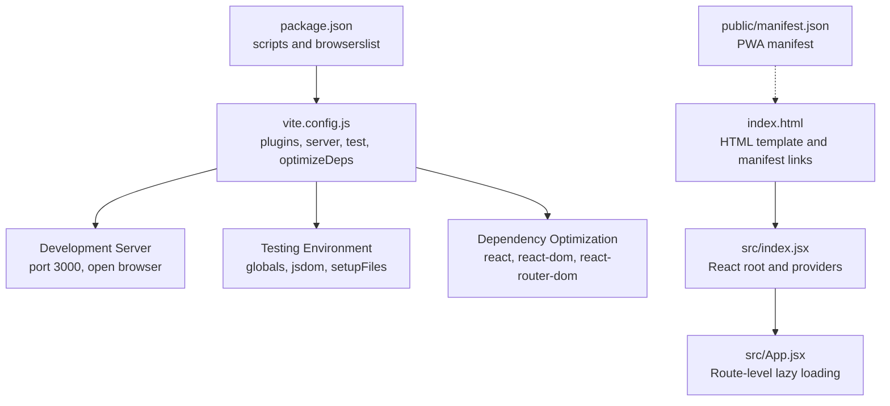
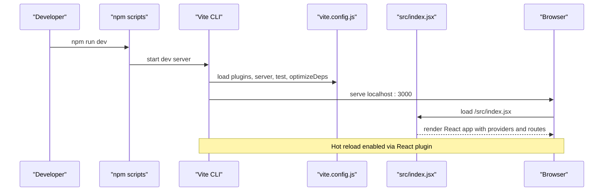
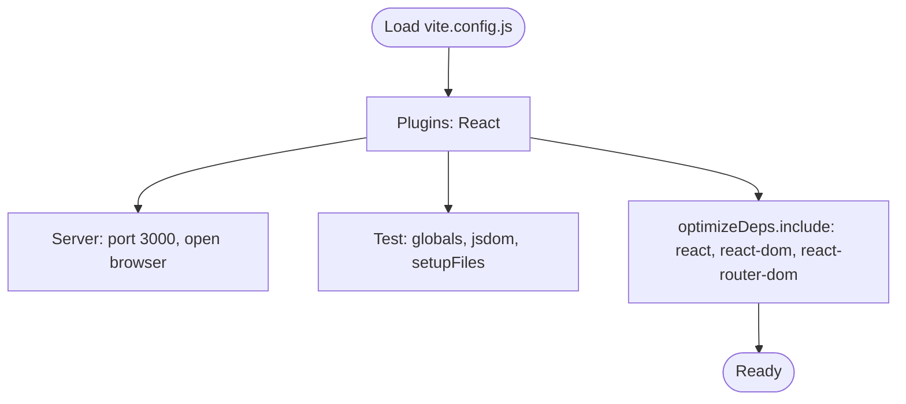
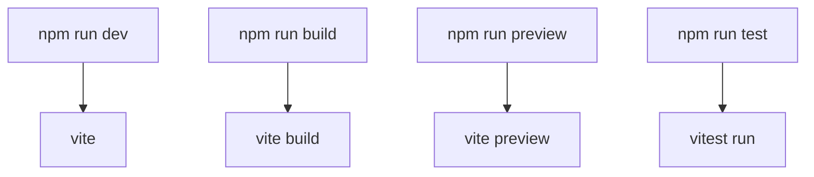
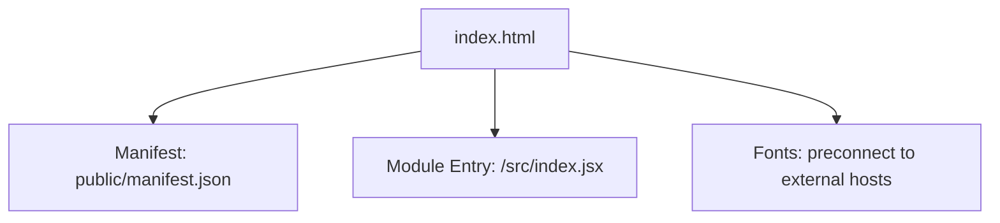
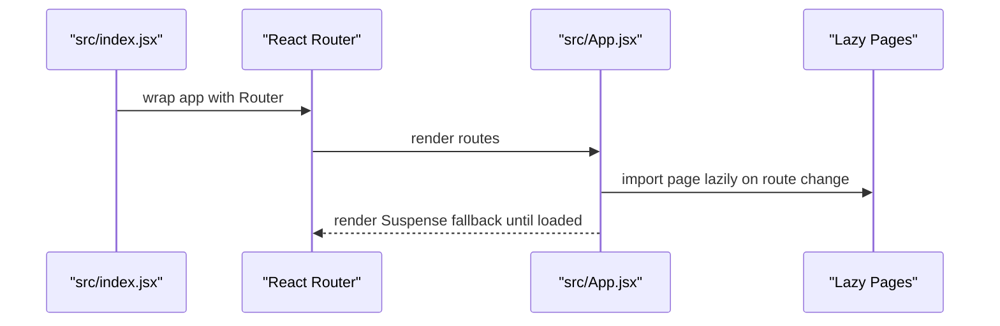
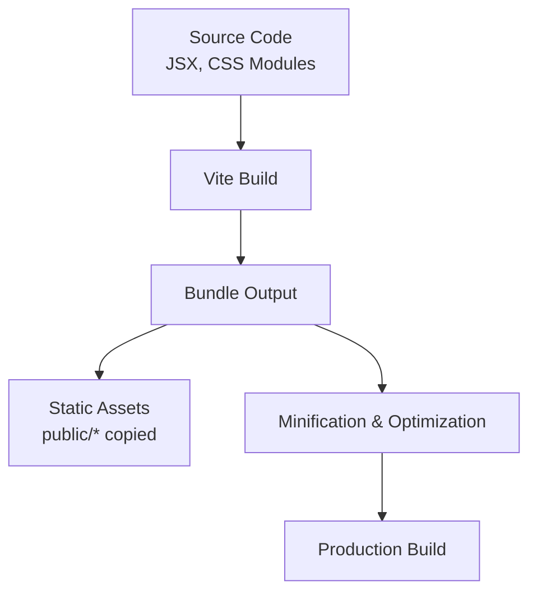
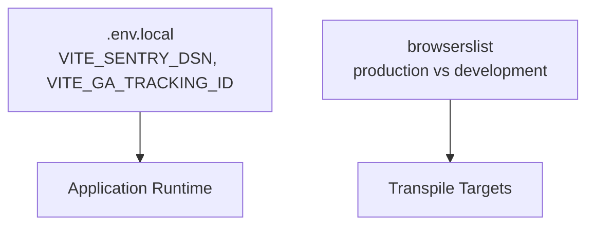
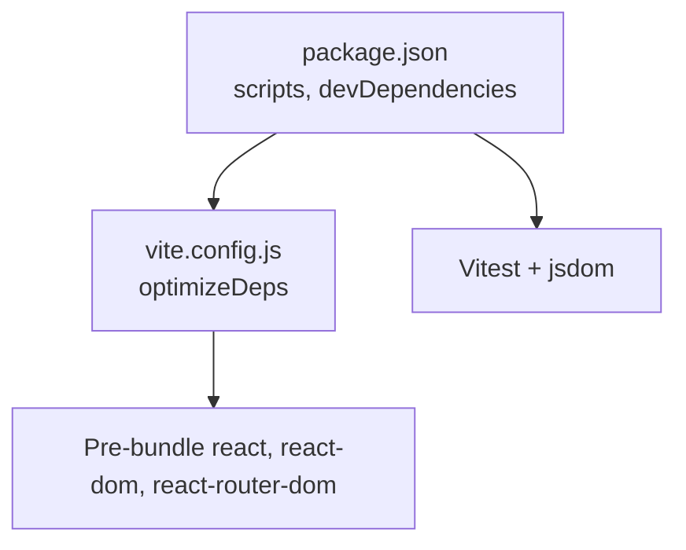

# Build & Deployment

<cite>
**Referenced Files in This Document**
- [package.json](file://package.json)
- [vite.config.js](file://vite.config.js)
- [index.html](file://index.html)
- [src/index.jsx](file://src/index.jsx)
- [src/App.jsx](file://src/App.jsx)
- [src/setupTests.js](file://src/setupTests.js)
- [public/manifest.json](file://public/manifest.json)
- [.gitignore](file://.gitignore)
- [README.md](file://README.md)
</cite>

## Table of Contents
1. [Introduction](#introduction)
2. [Project Structure](#project-structure)
3. [Core Components](#core-components)
4. [Architecture Overview](#architecture-overview)
5. [Detailed Component Analysis](#detailed-component-analysis)
6. [Dependency Analysis](#dependency-analysis)
7. [Performance Considerations](#performance-considerations)
8. [Troubleshooting Guide](#troubleshooting-guide)
9. [Conclusion](#conclusion)
10. [Appendices](#appendices)

## Introduction
This document explains the build and deployment process for GameDev Hub. It covers Vite configuration, npm scripts, development and production workflows, code splitting and bundling, asset handling, environment variables, and deployment strategies for static hosting. It also provides troubleshooting guidance and performance optimization tips tailored to the current repository setup.

## Project Structure
GameDev Hub is a Vite-powered React application. Key build-related artifacts include:
- Vite configuration for development server, testing, and dependency optimization
- Package scripts for development, testing, and production builds
- HTML entry template and public assets manifest
- Application entry and routing with route-level code splitting

**Diagram sources**
- [package.json:15-21](file://package.json#L15-L21)
- [vite.config.js:4-18](file://vite.config.js#L4-L18)
- [index.html:1-22](file://index.html#L1-L22)
- [src/index.jsx:1-28](file://src/index.jsx#L1-L28)
- [src/App.jsx:13-19](file://src/App.jsx#L13-L19)
- [public/manifest.json:1-26](file://public/manifest.json#L1-L26)

**Section sources**
- [package.json:15-21](file://package.json#L15-L21)
- [vite.config.js:4-18](file://vite.config.js#L4-L18)
- [index.html:1-22](file://index.html#L1-L22)
- [src/index.jsx:1-28](file://src/index.jsx#L1-L28)
- [src/App.jsx:13-19](file://src/App.jsx#L13-L19)
- [public/manifest.json:1-26](file://public/manifest.json#L1-L26)

## Core Components
- Vite configuration
  - Plugin: React refresh and Fast Refresh
  - Development server: port 3000, auto-open browser
  - Test environment: jsdom, globals, setup file
  - Dependency optimization: pre-bundling of core React packages
- NPM scripts
  - dev/start: run Vite dev server
  - build: produce production bundle
  - preview: serve built assets locally
  - test: run Vitest suite
- HTML template and manifest
  - HTML template injects the module entry script and links PWA manifest
  - Public manifest defines icons and display metadata
- Application entry and routing
  - Root renders providers and the router
  - Route-level lazy loading with Suspense for faster initial load

**Section sources**
- [vite.config.js:4-18](file://vite.config.js#L4-L18)
- [package.json:15-21](file://package.json#L15-L21)
- [index.html:16-20](file://index.html#L16-L20)
- [public/manifest.json:1-26](file://public/manifest.json#L1-L26)
- [src/index.jsx:1-28](file://src/index.jsx#L1-L28)
- [src/App.jsx:13-19](file://src/App.jsx#L13-L19)

## Architecture Overview
The build pipeline transforms React components and assets into optimized static files served by a static server. Vite orchestrates development and production builds, while the application’s route-level code splitting reduces initial payload.

**Diagram sources**
- [package.json:15-21](file://package.json#L15-L21)
- [vite.config.js:4-18](file://vite.config.js#L4-L18)
- [src/index.jsx:1-28](file://src/index.jsx#L1-L28)

## Detailed Component Analysis

### Vite Configuration
- Plugins
  - React plugin enables JSX transform and Fast Refresh
- Development server
  - Port 3000 and automatic browser open for convenience
- Testing
  - Vitest globals, jsdom environment, and setup file for DOM testing
- Dependency optimization
  - Pre-bundle react, react-dom, react-router-dom to speed up dev startup and HMR

**Diagram sources**
- [vite.config.js:4-18](file://vite.config.js#L4-L18)

**Section sources**
- [vite.config.js:4-18](file://vite.config.js#L4-L18)

### NPM Scripts
- dev/start: launches Vite dev server
- build: produces production build
- preview: serves built assets locally for testing
- test: runs Vitest suite

**Diagram sources**
- [package.json:15-21](file://package.json#L15-L21)

**Section sources**
- [package.json:15-21](file://package.json#L15-L21)

### HTML Template and Manifest
- index.html
  - Provides the root container and loads the module entry script
  - Includes meta tags and font preconnect hints
- public/manifest.json
  - Defines PWA icons and display properties

**Diagram sources**
- [index.html:1-22](file://index.html#L1-L22)
- [public/manifest.json:1-26](file://public/manifest.json#L1-L26)

**Section sources**
- [index.html:1-22](file://index.html#L1-L22)
- [public/manifest.json:1-26](file://public/manifest.json#L1-L26)

### Application Entry and Route-Level Code Splitting
- src/index.jsx
  - Creates the React root and mounts providers and the router
- src/App.jsx
  - Uses React.lazy for several pages and wraps routes in Suspense for fallback UI

**Diagram sources**
- [src/index.jsx:1-28](file://src/index.jsx#L1-L28)
- [src/App.jsx:13-19](file://src/App.jsx#L13-L19)

**Section sources**
- [src/index.jsx:1-28](file://src/index.jsx#L1-L28)
- [src/App.jsx:13-19](file://src/App.jsx#L13-L19)

### Build Process and Asset Handling
- Production build
  - Vite compiles JSX, resolves imports, bundles code, and optimizes assets
  - Output directory is conventional for static hosting (see .gitignore for ignored directories)
- Static assets
  - Public assets under public/ are copied as-is
  - Module imports are resolved and bundled; CSS Modules remain scoped
- Code splitting
  - Route-level lazy imports reduce initial bundle size
- Minification and optimization
  - Vite performs production minification by default in build mode

**Diagram sources**
- [vite.config.js:4-18](file://vite.config.js#L4-L18)
- [.gitignore:11-13](file://.gitignore#L11-L13)

**Section sources**
- [vite.config.js:4-18](file://vite.config.js#L4-L18)
- [.gitignore:11-13](file://.gitignore#L11-L13)

### Environment Variables and Configuration
- Environment variables
  - The project includes guidance for configuring analytics and error tracking via environment variables
  - Local overrides are supported via .env.local files
- Browserslist
  - Separate targets for production and development ensure appropriate transpilation and polyfills

**Diagram sources**
- [README.md:109-114](file://README.md#L109-L114)
- [package.json:29-40](file://package.json#L29-L40)

**Section sources**
- [README.md:109-114](file://README.md#L109-L114)
- [package.json:29-40](file://package.json#L29-L40)

## Dependency Analysis
- Development server and testing
  - Vite dev server and Vitest are configured in package.json
  - Testing uses jsdom and a setup file
- Dependency optimization
  - vite.config.js pre-bundles core React packages to improve dev performance

**Diagram sources**
- [package.json:15-21](file://package.json#L15-L21)
- [vite.config.js:15-17](file://vite.config.js#L15-L17)

**Section sources**
- [package.json:15-21](file://package.json#L15-L21)
- [vite.config.js:15-17](file://vite.config.js#L15-L17)

## Performance Considerations
- Route-level code splitting
  - Implemented via React.lazy and Suspense to defer heavy page chunks
- Dependency optimization
  - Pre-bundling core libraries reduces cold-start and improves HMR
- Static asset strategy
  - Public assets are copied; consider CDN delivery and cache headers for production
- Web Vitals monitoring
  - The project integrates reporting; keep it enabled in production for performance insights

**Section sources**
- [src/App.jsx:13-19](file://src/App.jsx#L13-L19)
- [vite.config.js:15-17](file://vite.config.js#L15-L17)
- [README.md:40-40](file://README.md#L40-L40)

## Troubleshooting Guide
- Common build issues
  - Missing or misconfigured environment variables can break analytics or error tracking initialization
  - Dependency conflicts often stem from mismatched major versions of React and related packages
- Development issues
  - Port 3000 in use: adjust vite.config.js server.port or kill the conflicting process
  - HMR not working: ensure the React plugin is present and that the entry script is a module
- Testing issues
  - If tests fail due to missing DOM APIs, confirm jsdom environment and setup file are correctly configured
- Static hosting and preview
  - Use npm run preview to validate production-like behavior locally

**Section sources**
- [vite.config.js:6-9](file://vite.config.js#L6-L9)
- [package.json:15-21](file://package.json#L15-L21)
- [src/setupTests.js:1-3](file://src/setupTests.js#L1-L3)

## Conclusion
GameDev Hub leverages Vite for a fast development experience and efficient production builds. Route-level code splitting, dependency optimization, and a clean static asset strategy contribute to a responsive user experience. By following the documented scripts, configuration, and environment variable setup, teams can reliably develop, test, and deploy the application to static hosting providers.

## Appendices

### Development Workflow
- Development server
  - Run npm run dev to start Vite on port 3000 with auto-open
- Hot reload and source maps
  - React plugin enables Fast Refresh; source maps are generated by default in development
- Debugging
  - Use browser devtools and React DevTools; enable source maps for accurate stack traces

**Section sources**
- [package.json:15-21](file://package.json#L15-L21)
- [vite.config.js:6-9](file://vite.config.js#L6-L9)

### Production Build and Preview
- Build
  - Run npm run build to generate optimized static assets
- Preview
  - Run npm run preview to serve the built assets locally for validation

**Section sources**
- [package.json:17-18](file://package.json#L17-L18)
- [vite.config.js:4-18](file://vite.config.js#L4-L18)

### Static Site Hosting and CDN Integration
- Hosting
  - Serve the built output directory with any static host
- CDN
  - Place public assets and built bundles behind a CDN; configure cache-control headers appropriately
- PWA
  - The manifest is included; ensure HTTPS and proper caching for offline behavior

**Section sources**
- [.gitignore:11-13](file://.gitignore#L11-L13)
- [public/manifest.json:1-26](file://public/manifest.json#L1-L26)

### CI/CD Pipeline Considerations
- Build stage
  - Install dependencies, run tests, then build
- Deploy stage
  - Upload built artifacts to your static host or CDN
- Monitoring
  - Keep Web Vitals reporting enabled in production for ongoing performance monitoring

**Section sources**
- [package.json:15-21](file://package.json#L15-L21)
- [README.md:40-40](file://README.md#L40-L40)