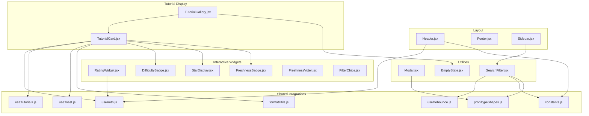
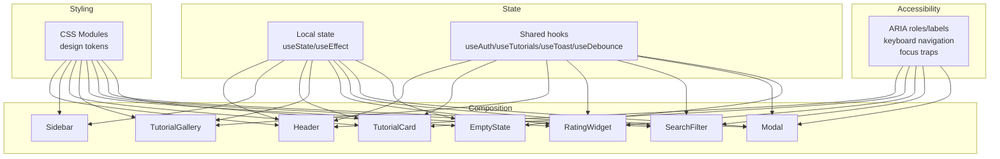
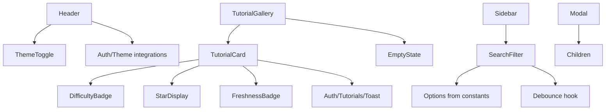
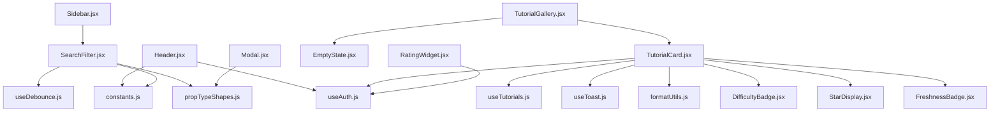

# Component Library

<cite>
**Referenced Files in This Document**
- [Header.jsx](file://src/components/layout/Header.jsx)
- [Header.module.css](file://src/components/layout/Header.module.css)
- [Footer.jsx](file://src/components/layout/Footer.jsx)
- [Footer.module.css](file://src/components/layout/Footer.module.css)
- [Sidebar.jsx](file://src/components/layout/Sidebar.jsx)
- [Sidebar.module.css](file://src/components/layout/Sidebar.module.css)
- [TutorialCard.jsx](file://src/components/TutorialCard.jsx)
- [TutorialCard.module.css](file://src/components/TutorialCard.module.css)
- [TutorialGallery.jsx](file://src/components/TutorialGallery.jsx)
- [TutorialGallery.module.css](file://src/components/TutorialGallery.module.css)
- [RatingWidget.jsx](file://src/components/RatingWidget.jsx)
- [RatingWidget.module.css](file://src/components/RatingWidget.module.css)
- [StarDisplay.jsx](file://src/components/StarDisplay.jsx)
- [StarDisplay.module.css](file://src/components/StarDisplay.module.css)
- [DifficultyBadge.jsx](file://src/components/DifficultyBadge.jsx)
- [DifficultyBadge.module.css](file://src/components/DifficultyBadge.module.css)
- [FreshnessBadge.jsx](file://src/components/FreshnessBadge.jsx)
- [FreshnessBadge.module.css](file://src/components/FreshnessBadge.module.css)
- [FreshnessVoter.jsx](file://src/components/FreshnessVoter.jsx)
- [FreshnessVoter.module.css](file://src/components/FreshnessVoter.module.css)
- [FilterChips.jsx](file://src/components/FilterChips.jsx)
- [FilterChips.module.css](file://src/components/FilterChips.module.css)
- [Modal.jsx](file://src/components/Modal.jsx)
- [Modal.module.css](file://src/components/Modal.module.css)
- [EmptyState.jsx](file://src/components/EmptyState.jsx)
- [EmptyState.module.css](file://src/components/EmptyState.module.css)
- [SearchFilter.jsx](file://src/components/SearchFilter.jsx)
- [SearchFilter.module.css](file://src/components/SearchFilter.module.css)
- [useAuth.js](file://src/hooks/useAuth.js)
- [useTutorials.js](file://src/hooks/useTutorials.js)
- [useToast.js](file://src/hooks/useToast.js)
- [useDebounce.js](file://src/hooks/useDebounce.js)
- [constants.js](file://src/data/constants.js)
- [propTypeShapes.js](file://src/utils/propTypeShapes.js)
- [formatUtils.js](file://src/utils/formatUtils.js)
</cite>

## Table of Contents
1. [Introduction](#introduction)
2. [Project Structure](#project-structure)
3. [Core Components](#core-components)
4. [Architecture Overview](#architecture-overview)
5. [Detailed Component Analysis](#detailed-component-analysis)
6. [Dependency Analysis](#dependency-analysis)
7. [Performance Considerations](#performance-considerations)
8. [Troubleshooting Guide](#troubleshooting-guide)
9. [Conclusion](#conclusion)
10. [Appendices](#appendices)

## Introduction
This document describes GameDev Hub’s component library: reusable UI building blocks that implement consistent design, behavior, and accessibility across the application. It covers layout components (Header, Footer, Sidebar), tutorial display components (TutorialCard, TutorialGallery), interactive widgets (RatingWidget, StarDisplay, DifficultyBadge, FreshnessBadge, FreshnessVoter, FilterChips), and utility components (Modal, EmptyState, SearchFilter). For each component, we explain visual appearance, behavior, user interaction patterns, props/attributes, usage examples, composition patterns, styling architecture, accessibility features, state management, event handling, and extension guidelines.

## Project Structure
The component library is organized by feature and shared concerns:
- Layout: Header, Footer, Sidebar
- Tutorial display: TutorialCard, TutorialGallery
- Interactive widgets: RatingWidget, StarDisplay, DifficultyBadge, FreshnessBadge, FreshnessVoter, FilterChips
- Utilities: Modal, EmptyState, SearchFilter
- Shared integrations: hooks (useAuth, useTutorials, useToast, useDebounce), data (constants), utilities (propTypeShapes, formatUtils), and CSS Modules for component styling

**Diagram sources**
- [Header.jsx:1-116](file://src/components/layout/Header.jsx#L1-L116)
- [Footer.jsx:1-51](file://src/components/layout/Footer.jsx#L1-L51)
- [Sidebar.jsx:1-24](file://src/components/layout/Sidebar.jsx#L1-L24)
- [TutorialCard.jsx:1-110](file://src/components/TutorialCard.jsx#L1-L110)
- [TutorialGallery.jsx:1-138](file://src/components/TutorialGallery.jsx#L1-L138)
- [RatingWidget.jsx:1-84](file://src/components/RatingWidget.jsx#L1-L84)
- [StarDisplay.jsx:1-49](file://src/components/StarDisplay.jsx#L1-L49)
- [DifficultyBadge.jsx:1-22](file://src/components/DifficultyBadge.jsx#L1-L22)
- [FreshnessBadge.jsx:1-32](file://src/components/FreshnessBadge.jsx#L1-L32)
- [FreshnessVoter.jsx:1-55](file://src/components/FreshnessVoter.jsx#L1-L55)
- [FilterChips.jsx:1-76](file://src/components/FilterChips.jsx#L1-L76)
- [Modal.jsx:1-92](file://src/components/Modal.jsx#L1-L92)
- [EmptyState.jsx:1-18](file://src/components/EmptyState.jsx#L1-L18)
- [SearchFilter.jsx:1-237](file://src/components/SearchFilter.jsx#L1-L237)
- [useAuth.js](file://src/hooks/useAuth.js)
- [useTutorials.js](file://src/hooks/useTutorials.js)
- [useToast.js](file://src/hooks/useToast.js)
- [useDebounce.js](file://src/hooks/useDebounce.js)
- [constants.js](file://src/data/constants.js)
- [propTypeShapes.js](file://src/utils/propTypeShapes.js)
- [formatUtils.js](file://src/utils/formatUtils.js)

**Section sources**
- [Header.jsx:1-116](file://src/components/layout/Header.jsx#L1-L116)
- [Footer.jsx:1-51](file://src/components/layout/Footer.jsx#L1-L51)
- [Sidebar.jsx:1-24](file://src/components/layout/Sidebar.jsx#L1-L24)
- [TutorialCard.jsx:1-110](file://src/components/TutorialCard.jsx#L1-L110)
- [TutorialGallery.jsx:1-138](file://src/components/TutorialGallery.jsx#L1-L138)
- [RatingWidget.jsx:1-84](file://src/components/RatingWidget.jsx#L1-L84)
- [StarDisplay.jsx:1-49](file://src/components/StarDisplay.jsx#L1-L49)
- [DifficultyBadge.jsx:1-22](file://src/components/DifficultyBadge.jsx#L1-L22)
- [FreshnessBadge.jsx:1-32](file://src/components/FreshnessBadge.jsx#L1-L32)
- [FreshnessVoter.jsx:1-55](file://src/components/FreshnessVoter.jsx#L1-L55)
- [FilterChips.jsx:1-76](file://src/components/FilterChips.jsx#L1-L76)
- [Modal.jsx:1-92](file://src/components/Modal.jsx#L1-L92)
- [EmptyState.jsx:1-18](file://src/components/EmptyState.jsx#L1-L18)
- [SearchFilter.jsx:1-237](file://src/components/SearchFilter.jsx#L1-L237)

## Core Components
This section summarizes the primary components and their responsibilities.

- Layout
  - Header: Navigation, branding, theme toggle, mobile menu, user menu/logout, responsive behavior
  - Footer: Branding, navigational links, community links, copyright
  - Sidebar: Collapsible filter panel container with open/close state

- Tutorial Display
  - TutorialCard: Individual tutorial item with thumbnail, metadata, badges, actions, lazy image handling
  - TutorialGallery: Grid of cards, pagination, counts, empty state integration

- Interactive Widgets
  - RatingWidget: Five-star rating with hover, focus, keyboard navigation, authentication gating
  - StarDisplay: Visual star rating with optional review count and compact mode
  - DifficultyBadge: Tag indicating tutorial difficulty level
  - FreshnessBadge: Status badge for tutorial accuracy with compact option
  - FreshnessVoter: Voting UI for tutorial freshness with authentication gating
  - FilterChips: Visual representation of active filters with remove/clear actions

- Utilities
  - Modal: Focus trapping, Escape handling, overlay click-to-close, ARIA dialog semantics
  - EmptyState: Neutral state with icon, title, optional message, optional action
  - SearchFilter: Comprehensive filter panel with debounced search, suggestions, checkboxes, selects, rating filter, reset

**Section sources**
- [Header.jsx:1-116](file://src/components/layout/Header.jsx#L1-L116)
- [Footer.jsx:1-51](file://src/components/layout/Footer.jsx#L1-L51)
- [Sidebar.jsx:1-24](file://src/components/layout/Sidebar.jsx#L1-L24)
- [TutorialCard.jsx:1-110](file://src/components/TutorialCard.jsx#L1-L110)
- [TutorialGallery.jsx:1-138](file://src/components/TutorialGallery.jsx#L1-L138)
- [RatingWidget.jsx:1-84](file://src/components/RatingWidget.jsx#L1-L84)
- [StarDisplay.jsx:1-49](file://src/components/StarDisplay.jsx#L1-L49)
- [DifficultyBadge.jsx:1-22](file://src/components/DifficultyBadge.jsx#L1-L22)
- [FreshnessBadge.jsx:1-32](file://src/components/FreshnessBadge.jsx#L1-L32)
- [FreshnessVoter.jsx:1-55](file://src/components/FreshnessVoter.jsx#L1-L55)
- [FilterChips.jsx:1-76](file://src/components/FilterChips.jsx#L1-L76)
- [Modal.jsx:1-92](file://src/components/Modal.jsx#L1-L92)
- [EmptyState.jsx:1-18](file://src/components/EmptyState.jsx#L1-L18)
- [SearchFilter.jsx:1-237](file://src/components/SearchFilter.jsx#L1-L237)

## Architecture Overview
The component library follows a modular, CSS Modules-based architecture with clear separation of concerns:
- Component state: Local state via React hooks for UI toggles, selections, and form inputs
- Shared state: Contexts and hooks for authentication, tutorials, and toast notifications
- Styling: Component-scoped CSS Modules with design tokens (CSS variables) for theme consistency
- Accessibility: ARIA roles, labels, keyboard navigation, focus management, and semantic HTML
- Composition: Small, single-purpose components composed into larger layouts and pages

**Diagram sources**
- [Header.jsx:1-116](file://src/components/layout/Header.jsx#L1-L116)
- [Sidebar.jsx:1-24](file://src/components/layout/Sidebar.jsx#L1-L24)
- [TutorialCard.jsx:1-110](file://src/components/TutorialCard.jsx#L1-L110)
- [TutorialGallery.jsx:1-138](file://src/components/TutorialGallery.jsx#L1-L138)
- [RatingWidget.jsx:1-84](file://src/components/RatingWidget.jsx#L1-L84)
- [SearchFilter.jsx:1-237](file://src/components/SearchFilter.jsx#L1-L237)
- [Modal.jsx:1-92](file://src/components/Modal.jsx#L1-L92)
- [EmptyState.jsx:1-18](file://src/components/EmptyState.jsx#L1-L18)
- [useAuth.js](file://src/hooks/useAuth.js)
- [useTutorials.js](file://src/hooks/useTutorials.js)
- [useToast.js](file://src/hooks/useToast.js)
- [useDebounce.js](file://src/hooks/useDebounce.js)

## Detailed Component Analysis

### Layout Components

#### Header
- Purpose: Top-of-page navigation, branding, theme toggle, user menu, mobile hamburger menu
- Props: None
- Behavior: Manages mobile menu open state, handles logout and navigation, applies active nav link styling
- Accessibility: Hamburger button has aria-label; active nav link highlighted; ThemeToggle integrated
- Styling: CSS Modules with responsive breakpoints; desktop vs. mobile layouts
- Integration: Uses Auth hook for user info, ThemeContext for theme, and React Router for navigation

Usage example (conceptual):
- Place inside App shell; integrates with routing and authentication automatically

**Section sources**
- [Header.jsx:1-116](file://src/components/layout/Header.jsx#L1-L116)
- [Header.module.css:1-189](file://src/components/layout/Header.module.css#L1-L189)

#### Footer
- Purpose: Site footer with brand, sections for browsing, categories, and community links
- Props: None
- Behavior: Renders static links; responsive grid layout
- Accessibility: Semantic headings and links; hover states for focus visibility
- Styling: CSS Modules with responsive grid; stacked on small screens

Usage example (conceptual):
- Place at bottom of App shell; customize sections via routing

**Section sources**
- [Footer.jsx:1-51](file://src/components/layout/Footer.jsx#L1-L51)
- [Footer.module.css:1-114](file://src/components/layout/Footer.module.css#L1-L114)

#### Sidebar
- Purpose: Collapsible container for filter panels (e.g., SearchFilter)
- Props: children, filterCount
- Behavior: Toggle open/close; displays filter count in toggle label
- Accessibility: Toggle button controls content visibility
- Styling: CSS Modules with sticky positioning and responsive behavior

Usage example (conceptual):
- Wrap SearchFilter; pass filterCount from parent state

**Section sources**
- [Sidebar.jsx:1-24](file://src/components/layout/Sidebar.jsx#L1-L24)
- [Sidebar.module.css:1-59](file://src/components/layout/Sidebar.module.css#L1-L59)

### Tutorial Display Components

#### TutorialCard
- Purpose: Card for a single tutorial with thumbnail, metadata, ratings, difficulty, freshness, and actions
- Props: tutorial (PropTypes shape)
- Behavior: Click navigates to tutorial detail; bookmark toggles with toast feedback; fallback placeholder when image fails; marks completed state
- Accessibility: Card is a button-like element with role and tabIndex for keyboard activation
- Styling: CSS Modules with thumbnail scaling, badges, and compact meta display
- Integration: Uses Auth, Tutorials, Toast hooks; formats duration/views; renders supporting badges

Usage example (conceptual):
- Render within TutorialGallery; pass tutorial object from data source

**Section sources**
- [TutorialCard.jsx:1-110](file://src/components/TutorialCard.jsx#L1-L110)
- [TutorialCard.module.css:1-244](file://src/components/TutorialCard.module.css#L1-L244)
- [useAuth.js](file://src/hooks/useAuth.js)
- [useTutorials.js](file://src/hooks/useTutorials.js)
- [useToast.js](file://src/hooks/useToast.js)
- [formatUtils.js](file://src/utils/formatUtils.js)
- [DifficultyBadge.jsx:1-22](file://src/components/DifficultyBadge.jsx#L1-L22)
- [StarDisplay.jsx:1-49](file://src/components/StarDisplay.jsx#L1-L49)
- [FreshnessBadge.jsx:1-32](file://src/components/FreshnessBadge.jsx#L1-L32)

#### TutorialGallery
- Purpose: Grid of TutorialCards with pagination, counts, and empty state
- Props: tutorials, title, subtitle, viewAllLink, showCount, emptyTitle, emptyMessage, onClearFilters, pageSize
- Behavior: Paginates items; computes visible range; shows empty state when no items; clears filters callback
- Accessibility: Pagination buttons disabled states; links for “View All”
- Styling: CSS Modules with grid layout and pagination controls
- Integration: Composes TutorialCard and EmptyState; uses PropTypes shapes

Usage example (conceptual):
- Pass filtered tutorials array; optionally wire onClearFilters to reset filters

**Section sources**
- [TutorialGallery.jsx:1-138](file://src/components/TutorialGallery.jsx#L1-L138)
- [TutorialGallery.module.css](file://src/components/TutorialGallery.module.css)

### Interactive Widgets

#### RatingWidget
- Purpose: Five-star rating widget with hover preview, keyboard navigation, and authentication gating
- Props: currentRating, onRate, isAuthenticated
- Behavior: Hover/focus highlights stars; keyboard arrows move focus; clicking invokes onRate; unauthenticated users see login prompt
- Accessibility: Radiogroup with radio buttons; aria-checked and aria-label; tabbable star aligned with focused/current rating
- Styling: CSS Modules with filled/empty star states
- Integration: Uses refs for focus management; integrates with authentication state

Usage example (conceptual):
- Render in tutorial detail; pass onRate handler to persist rating

**Section sources**
- [RatingWidget.jsx:1-84](file://src/components/RatingWidget.jsx#L1-L84)
- [RatingWidget.module.css](file://src/components/RatingWidget.module.css)

#### StarDisplay
- Purpose: Visual star rating display with optional count and compact mode
- Props: rating, count, compact
- Behavior: Renders filled/half/empty stars; formats rating label
- Accessibility: Presentational; rely on surrounding context for meaning
- Styling: CSS Modules with compact variant

Usage example (conceptual):
- Render alongside tutorial metadata or reviews

**Section sources**
- [StarDisplay.jsx:1-49](file://src/components/StarDisplay.jsx#L1-L49)
- [StarDisplay.module.css](file://src/components/StarDisplay.module.css)

#### DifficultyBadge
- Purpose: Badge indicating tutorial difficulty
- Props: difficulty (one of Beginner, Intermediate, Advanced)
- Behavior: Applies themed class based on difficulty
- Accessibility: Presentational; relies on context
- Styling: CSS Modules with difficulty-specific classes

Usage example (conceptual):
- Render within TutorialCard header

**Section sources**
- [DifficultyBadge.jsx:1-22](file://src/components/DifficultyBadge.jsx#L1-L22)
- [DifficultyBadge.module.css](file://src/components/DifficultyBadge.module.css)

#### FreshnessBadge
- Purpose: Badge indicating whether a tutorial still works or is outdated
- Props: consensus (works, outdated, unknown), compact
- Behavior: Returns null for unknown; renders icon and label; compact variant shows icon only
- Accessibility: Compact variant exposes title for tooltip
- Styling: CSS Modules with themed variants

Usage example (conceptual):
- Render within TutorialCard thumbnail overlay

**Section sources**
- [FreshnessBadge.jsx:1-32](file://src/components/FreshnessBadge.jsx#L1-L32)
- [FreshnessBadge.module.css](file://src/components/FreshnessBadge.module.css)

#### FreshnessVoter
- Purpose: Voting UI for tutorial freshness with authentication gating
- Props: status (worksCount, outdatedCount, consensus), userVote, onVote, isAuthenticated
- Behavior: Buttons trigger onVote with either 'works' or 'outdated'; disabled when not authenticated; shows login prompt
- Accessibility: Buttons disabled when not authenticated; active state classes indicate user selection
- Styling: CSS Modules with themed and active states

Usage example (conceptual):
- Render in tutorial detail; pass onVote handler to update backend

**Section sources**
- [FreshnessVoter.jsx:1-55](file://src/components/FreshnessVoter.jsx#L1-L55)
- [FreshnessVoter.module.css](file://src/components/FreshnessVoter.module.css)

#### FilterChips
- Purpose: Visual summary of active filters with remove and clear-all actions
- Props: filters (PropTypes shape), onRemoveFilter, onClearAll
- Behavior: Builds chips from active filters; supports removing individual chips and clearing all
- Accessibility: Remove buttons have aria-labels
- Styling: CSS Modules with removable chip and clear-all button

Usage example (conceptual):
- Render above search results; wire remove/clear handlers to update filter state

**Section sources**
- [FilterChips.jsx:1-76](file://src/components/FilterChips.jsx#L1-L76)
- [FilterChips.module.css](file://src/components/FilterChips.module.css)

### Utility Components

#### Modal
- Purpose: Dialog overlay with focus trapping, Escape handling, and ARIA dialog semantics
- Props: title, onClose, children
- Behavior: Focus moves to close button on open; Tab/Shift+Tab loops within modal; Escape closes; overlay click closes; restores focus on close; prevents body scroll
- Accessibility: role="dialog", aria-modal, aria-labelledby; focus trap; Escape handling
- Styling: CSS Modules with overlay and modal containers

Usage example (conceptual):
- Wrap forms or confirmations; pass title and onClose handler

**Section sources**
- [Modal.jsx:1-92](file://src/components/Modal.jsx#L1-L92)
- [Modal.module.css:1-79](file://src/components/Modal.module.css#L1-L79)

#### EmptyState
- Purpose: Neutral state for empty lists or search results
- Props: icon, title, message, actionLabel, onAction
- Behavior: Renders icon, title, optional message, optional action button
- Accessibility: Action button is focusable
- Styling: CSS Modules with centered layout

Usage example (conceptual):
- Render when TutorialGallery has no items; wire onAction to clear filters

**Section sources**
- [EmptyState.jsx:1-18](file://src/components/EmptyState.jsx#L1-L18)
- [EmptyState.module.css](file://src/components/EmptyState.module.css)

#### SearchFilter
- Purpose: Comprehensive filter panel for tutorials with debounced search, suggestions, checkboxes, selects, rating filter, and reset
- Props: filters (PropTypes shape), onFilterChange, onReset
- Behavior: Debounces search query; maintains recent searches in localStorage; toggles checkbox groups; selects duration range; toggles minimum rating; clears all filters
- Accessibility: Proper labels, ARIA, and keyboard-friendly controls
- Styling: CSS Modules with grouped filter sections and suggestion dropdown
- Integration: Uses constants for options, debounce hook, and PropTypes shapes

Usage example (conceptual):
- Render inside Sidebar; pass callbacks to update parent filter state

**Section sources**
- [SearchFilter.jsx:1-237](file://src/components/SearchFilter.jsx#L1-L237)
- [SearchFilter.module.css:1-239](file://src/components/SearchFilter.module.css#L1-L239)
- [useDebounce.js](file://src/hooks/useDebounce.js)
- [constants.js](file://src/data/constants.js)
- [propTypeShapes.js](file://src/utils/propTypeShapes.js)

### Component Composition Patterns
- Header composes ThemeToggle and links; uses Auth and ThemeContext
- TutorialCard composes DifficultyBadge, StarDisplay, FreshnessBadge; integrates Auth/Tutorials/Toast
- TutorialGallery composes TutorialCard and EmptyState; manages pagination and counts
- Sidebar wraps SearchFilter and passes filterCount
- Modal composes any children and manages focus and ARIA
- SearchFilter composes many sub-controls and persists recent searches

**Diagram sources**
- [Header.jsx:1-116](file://src/components/layout/Header.jsx#L1-L116)
- [TutorialCard.jsx:1-110](file://src/components/TutorialCard.jsx#L1-L110)
- [TutorialGallery.jsx:1-138](file://src/components/TutorialGallery.jsx#L1-L138)
- [Sidebar.jsx:1-24](file://src/components/layout/Sidebar.jsx#L1-L24)
- [Modal.jsx:1-92](file://src/components/Modal.jsx#L1-L92)
- [SearchFilter.jsx:1-237](file://src/components/SearchFilter.jsx#L1-L237)
- [constants.js](file://src/data/constants.js)
- [useDebounce.js](file://src/hooks/useDebounce.js)

### Accessibility Features
- Keyboard navigation: RatingWidget supports arrow keys; Modal traps Tab/Shift+Tab; TutorialCard is keyboard activatable
- Focus management: Modal sets initial focus and restores focus; RatingWidget focuses next star on arrow keys
- ARIA: Modal has role="dialog" and aria-modal; RatingWidget uses radiogroup/radio with aria-checked; Header hamburger has aria-label
- Semantic HTML: Proper headings, links, buttons, and labels across components

**Section sources**
- [RatingWidget.jsx:1-84](file://src/components/RatingWidget.jsx#L1-L84)
- [Modal.jsx:1-92](file://src/components/Modal.jsx#L1-L92)
- [TutorialCard.jsx:1-110](file://src/components/TutorialCard.jsx#L1-L110)
- [Header.jsx:1-116](file://src/components/layout/Header.jsx#L1-L116)

### Styling Architecture
- CSS Modules: Each component has a dedicated .module.css file scoped to that component
- Design tokens: Variables for colors, spacing, typography, radius, shadows, transitions
- Responsive patterns: Media queries in component styles for mobile/desktop behavior
- Theming: Uses theme context indirectly via CSS variable overrides applied at root

Guidelines:
- Keep styles local to component modules
- Prefer CSS variables for theme tokens
- Use component classes for state-driven variants (e.g., active, hovered, compact)
- Maintain consistent spacing and typography scales

**Section sources**
- [Header.module.css:1-189](file://src/components/layout/Header.module.css#L1-L189)
- [Footer.module.css:1-114](file://src/components/layout/Footer.module.css#L1-L114)
- [Sidebar.module.css:1-59](file://src/components/layout/Sidebar.module.css#L1-L59)
- [TutorialCard.module.css:1-244](file://src/components/TutorialCard.module.css#L1-L244)
- [Modal.module.css:1-79](file://src/components/Modal.module.css#L1-L79)
- [SearchFilter.module.css:1-239](file://src/components/SearchFilter.module.css#L1-L239)

### State Management and Event Handling
- Local state: Header mobile menu, Sidebar open state, RatingWidget hover/focus, Modal open state, SearchFilter focus/suggestions
- Shared state: Authentication, tutorial bookmarks/completions, toast notifications, debounced search
- Events: onClick, onChange, onRate, onVote, onAction; controlled inputs for filters
- Context providers: AuthContext, ToastContext, TutorialContext (referenced by component usage)

Integration examples:
- Header uses Auth and ThemeContext for user and theme state
- TutorialCard uses Auth/Tutorials/Toast for user actions and feedback
- Modal manages focus lifecycle and cleanup
- SearchFilter uses debounce and localStorage for UX

**Section sources**
- [Header.jsx:1-116](file://src/components/layout/Header.jsx#L1-L116)
- [TutorialCard.jsx:1-110](file://src/components/TutorialCard.jsx#L1-L110)
- [Modal.jsx:1-92](file://src/components/Modal.jsx#L1-L92)
- [SearchFilter.jsx:1-237](file://src/components/SearchFilter.jsx#L1-L237)
- [useAuth.js](file://src/hooks/useAuth.js)
- [useTutorials.js](file://src/hooks/useTutorials.js)
- [useToast.js](file://src/hooks/useToast.js)
- [useDebounce.js](file://src/hooks/useDebounce.js)

### Usage Examples
Note: The following are conceptual examples referencing component files and props. Replace with your actual data and handlers.

- Render a tutorial card:
  - [TutorialCard.jsx:14-104](file://src/components/TutorialCard.jsx#L14-L104)
- Display a gallery with pagination:
  - [TutorialGallery.jsx:23-124](file://src/components/TutorialGallery.jsx#L23-L124)
- Show a rating widget:
  - [RatingWidget.jsx:6-76](file://src/components/RatingWidget.jsx#L6-L76)
- Apply a filter panel:
  - [SearchFilter.jsx:19-228](file://src/components/SearchFilter.jsx#L19-L228)
- Open a modal:
  - [Modal.jsx:8-83](file://src/components/Modal.jsx#L8-L83)
- Show an empty state:
  - [EmptyState.jsx:4-15](file://src/components/EmptyState.jsx#L4-L15)

**Section sources**
- [TutorialCard.jsx:1-110](file://src/components/TutorialCard.jsx#L1-L110)
- [TutorialGallery.jsx:1-138](file://src/components/TutorialGallery.jsx#L1-L138)
- [RatingWidget.jsx:1-84](file://src/components/RatingWidget.jsx#L1-L84)
- [SearchFilter.jsx:1-237](file://src/components/SearchFilter.jsx#L1-L237)
- [Modal.jsx:1-92](file://src/components/Modal.jsx#L1-L92)
- [EmptyState.jsx:1-18](file://src/components/EmptyState.jsx#L1-L18)

### Extending Components and Consistency Guidelines
- Extend by composing existing components (e.g., add new badges to TutorialCard)
- Maintain consistency by using design tokens, CSS Modules, and shared PropTypes
- Preserve accessibility: keep ARIA attributes, keyboard support, and focus management
- Follow naming conventions: component name + module.css; use descriptive class names for states
- Keep local state minimal; lift state to parent when multiple components share it

[No sources needed since this section provides general guidance]

## Dependency Analysis
This section maps component dependencies and relationships.

**Diagram sources**
- [Header.jsx:1-116](file://src/components/layout/Header.jsx#L1-L116)
- [Sidebar.jsx:1-24](file://src/components/layout/Sidebar.jsx#L1-L24)
- [TutorialCard.jsx:1-110](file://src/components/TutorialCard.jsx#L1-L110)
- [TutorialGallery.jsx:1-138](file://src/components/TutorialGallery.jsx#L1-L138)
- [RatingWidget.jsx:1-84](file://src/components/RatingWidget.jsx#L1-L84)
- [SearchFilter.jsx:1-237](file://src/components/SearchFilter.jsx#L1-L237)
- [Modal.jsx:1-92](file://src/components/Modal.jsx#L1-L92)
- [useAuth.js](file://src/hooks/useAuth.js)
- [useTutorials.js](file://src/hooks/useTutorials.js)
- [useToast.js](file://src/hooks/useToast.js)
- [useDebounce.js](file://src/hooks/useDebounce.js)
- [constants.js](file://src/data/constants.js)
- [propTypeShapes.js](file://src/utils/propTypeShapes.js)
- [formatUtils.js](file://src/utils/formatUtils.js)

**Section sources**
- [Header.jsx:1-116](file://src/components/layout/Header.jsx#L1-L116)
- [Sidebar.jsx:1-24](file://src/components/layout/Sidebar.jsx#L1-L24)
- [TutorialCard.jsx:1-110](file://src/components/TutorialCard.jsx#L1-L110)
- [TutorialGallery.jsx:1-138](file://src/components/TutorialGallery.jsx#L1-L138)
- [RatingWidget.jsx:1-84](file://src/components/RatingWidget.jsx#L1-L84)
- [SearchFilter.jsx:1-237](file://src/components/SearchFilter.jsx#L1-L237)
- [Modal.jsx:1-92](file://src/components/Modal.jsx#L1-L92)

## Performance Considerations
- Lazy image loading: TutorialCard uses lazy loading and error fallback
- Debounced search: SearchFilter debounces input to reduce re-renders
- Pagination: TutorialGallery limits rendered items per page
- CSS Modules: Scoped styles avoid global conflicts and improve cacheability
- Minimal re-renders: Prefer lifting state and memoizing derived data

[No sources needed since this section provides general guidance]

## Troubleshooting Guide
Common issues and resolutions:
- Modal does not close on Escape or outside click:
  - Verify onClose is passed and handleOverlayClick checks target
  - Ensure focus trap logic runs and Escape key is handled
  - [Modal.jsx:16-55](file://src/components/Modal.jsx#L16-L55)
- RatingWidget keyboard navigation not working:
  - Confirm arrow key handling and focusedStar alignment
  - Ensure star refs are populated and focus moves correctly
  - [RatingWidget.jsx:19-39](file://src/components/RatingWidget.jsx#L19-L39)
- Search suggestions not appearing:
  - Check isFocused state and filteredSuggestions logic
  - Confirm localStorage persistence and debounce timing
  - [SearchFilter.jsx:20-61](file://src/components/SearchFilter.jsx#L20-L61)
- TutorialCard image not loading:
  - Confirm imgError state and placeholder rendering
  - Ensure onError handler updates state
  - [TutorialCard.jsx:19, 42-52](file://src/components/TutorialCard.jsx#L19,L42-L52)

**Section sources**
- [Modal.jsx:1-92](file://src/components/Modal.jsx#L1-L92)
- [RatingWidget.jsx:1-84](file://src/components/RatingWidget.jsx#L1-L84)
- [SearchFilter.jsx:1-237](file://src/components/SearchFilter.jsx#L1-L237)
- [TutorialCard.jsx:1-110](file://src/components/TutorialCard.jsx#L1-L110)

## Conclusion
GameDev Hub’s component library emphasizes modularity, accessibility, and consistency. Components are built with CSS Modules, shared hooks, and clear composition patterns. They integrate seamlessly with routing, authentication, and data utilities while providing robust user interactions and responsive behavior.

[No sources needed since this section summarizes without analyzing specific files]

## Appendices

### Props Reference Summary
- TutorialCard: tutorial (PropTypes)
- TutorialGallery: tutorials, title, subtitle, viewAllLink, showCount, emptyTitle, emptyMessage, onClearFilters, pageSize
- RatingWidget: currentRating, onRate, isAuthenticated
- StarDisplay: rating, count, compact
- DifficultyBadge: difficulty
- FreshnessBadge: consensus, compact
- FreshnessVoter: status, userVote, onVote, isAuthenticated
- FilterChips: filters, onRemoveFilter, onClearAll
- Modal: title, onClose, children
- EmptyState: icon, title, message, actionLabel, onAction
- SearchFilter: filters, onFilterChange, onReset

**Section sources**
- [TutorialCard.jsx:107-110](file://src/components/TutorialCard.jsx#L107-L110)
- [TutorialGallery.jsx:127-137](file://src/components/TutorialGallery.jsx#L127-L137)
- [RatingWidget.jsx:79-84](file://src/components/RatingWidget.jsx#L79-L84)
- [StarDisplay.jsx:44-49](file://src/components/StarDisplay.jsx#L44-L49)
- [DifficultyBadge.jsx:19-22](file://src/components/DifficultyBadge.jsx#L19-L22)
- [FreshnessBadge.jsx:29-32](file://src/components/FreshnessBadge.jsx#L29-L32)
- [FreshnessVoter.jsx:46-55](file://src/components/FreshnessVoter.jsx#L46-L55)
- [FilterChips.jsx:71-76](file://src/components/FilterChips.jsx#L71-L76)
- [Modal.jsx:87-92](file://src/components/Modal.jsx#L87-L92)
- [EmptyState.jsx:4](file://src/components/EmptyState.jsx#L4)
- [SearchFilter.jsx:232-237](file://src/components/SearchFilter.jsx#L232-L237)