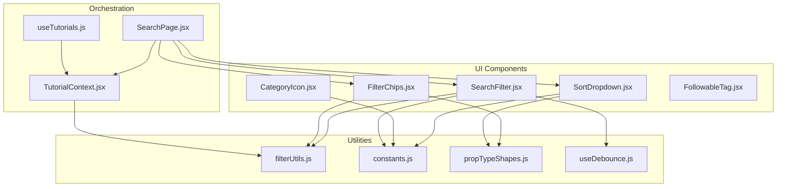
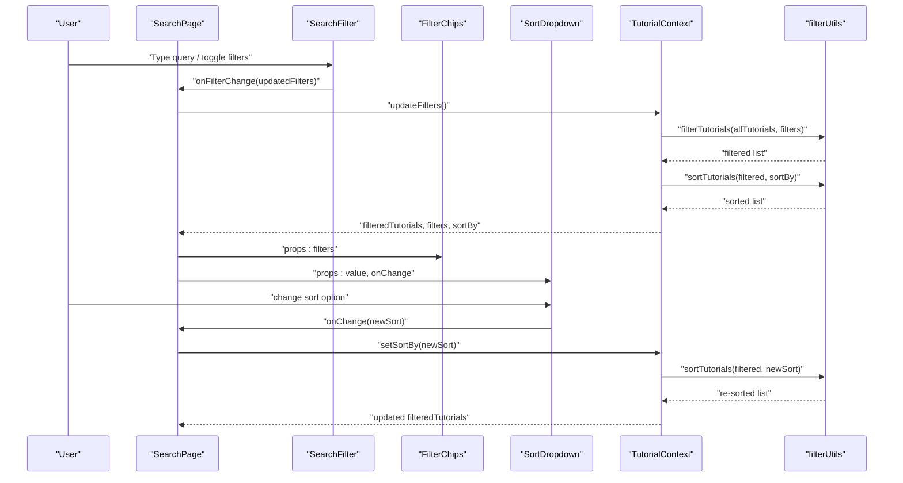
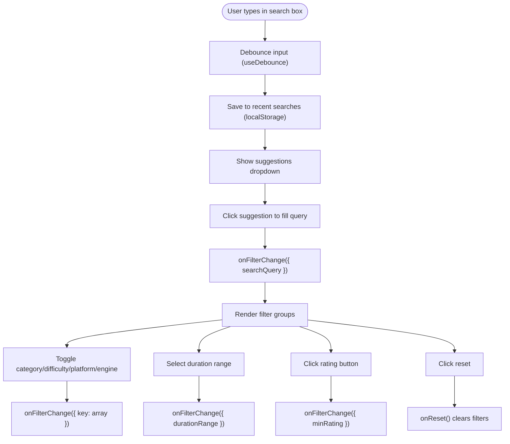
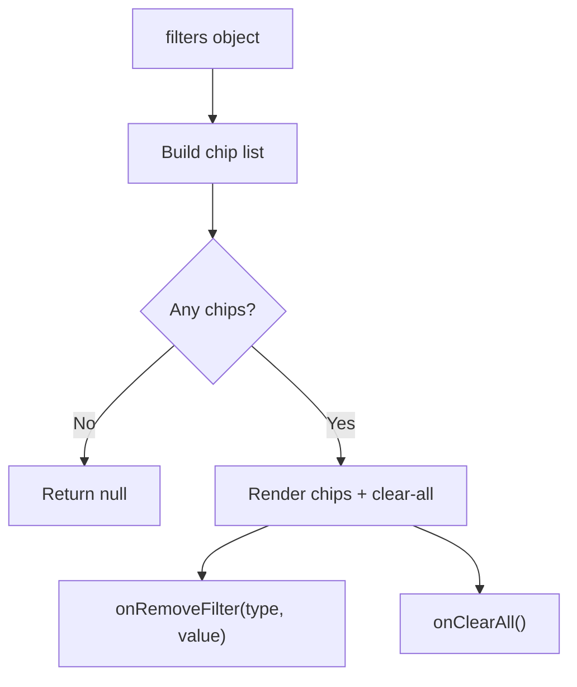
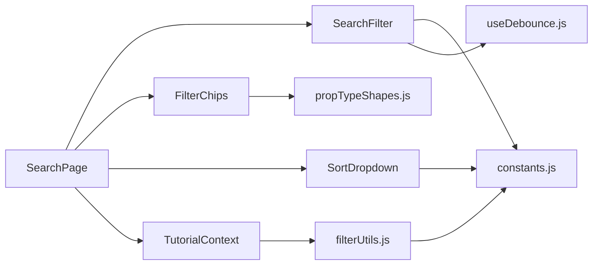

# Filter and Search Components

<cite>
**Referenced Files in This Document**
- [SearchFilter.jsx](file://src/components/SearchFilter.jsx)
- [SearchFilter.module.css](file://src/components/SearchFilter.module.css)
- [FilterChips.jsx](file://src/components/FilterChips.jsx)
- [FilterChips.module.css](file://src/components/FilterChips.module.css)
- [SortDropdown.jsx](file://src/components/SortDropdown.jsx)
- [SortDropdown.module.css](file://src/components/SortDropdown.module.css)
- [CategoryIcon.jsx](file://src/components/CategoryIcon.jsx)
- [CategoryIcon.module.css](file://src/components/CategoryIcon.module.css)
- [FollowableTag.jsx](file://src/components/FollowableTag.jsx)
- [FollowableTag.module.css](file://src/components/FollowableTag.module.css)
- [filterUtils.js](file://src/utils/filterUtils.js)
- [constants.js](file://src/data/constants.js)
- [propTypeShapes.js](file://src/utils/propTypeShapes.js)
- [useDebounce.js](file://src/hooks/useDebounce.js)
- [SearchPage.jsx](file://src/pages/SearchPage.jsx)
- [TutorialContext.jsx](file://src/contexts/TutorialContext.jsx)
- [useTutorials.js](file://src/hooks/useTutorials.js)
</cite>

## Table of Contents
1. [Introduction](#introduction)
2. [Project Structure](#project-structure)
3. [Core Components](#core-components)
4. [Architecture Overview](#architecture-overview)
5. [Detailed Component Analysis](#detailed-component-analysis)
6. [Dependency Analysis](#dependency-analysis)
7. [Performance Considerations](#performance-considerations)
8. [Troubleshooting Guide](#troubleshooting-guide)
9. [Conclusion](#conclusion)

## Introduction
This document explains the filter and search system that powers advanced tutorial discovery. It covers SearchFilter, FilterChips, SortDropdown, CategoryIcon, and FollowableTag, detailing how they collaborate with filtering utilities and user preferences to deliver a responsive, accessible, and efficient browsing experience. You will learn how search queries, filter chips, and sorting options integrate with the backend filtering logic and local storage to maintain state across sessions.

## Project Structure
The filter/search ecosystem spans UI components, shared utilities, constants, and page-level orchestration:

- UI Components: SearchFilter, FilterChips, SortDropdown, CategoryIcon, FollowableTag
- Utilities: filterUtils (filtering, sorting, counts)
- Constants: CATEGORIES, DIFFICULTIES, PLATFORMS, ENGINE_VERSIONS, SORT_OPTIONS, DURATION_RANGES
- Page Orchestration: SearchPage coordinates URL synchronization and context-driven updates
- Context: TutorialContext manages filters, sorting, and persisted preferences
- Hooks: useTutorials, useDebounce

**Diagram sources**
- [SearchFilter.jsx:1-237](file://src/components/SearchFilter.jsx#L1-L237)
- [FilterChips.jsx:1-76](file://src/components/FilterChips.jsx#L1-L76)
- [SortDropdown.jsx:1-29](file://src/components/SortDropdown.jsx#L1-L29)
- [CategoryIcon.jsx:1-16](file://src/components/CategoryIcon.jsx#L1-L16)
- [FollowableTag.jsx:1-34](file://src/components/FollowableTag.jsx#L1-L34)
- [filterUtils.js:1-99](file://src/utils/filterUtils.js#L1-L99)
- [constants.js:1-71](file://src/data/constants.js#L1-L71)
- [propTypeShapes.js:1-37](file://src/utils/propTypeShapes.js#L1-L37)
- [useDebounce.js:1-16](file://src/hooks/useDebounce.js#L1-L16)
- [SearchPage.jsx:1-141](file://src/pages/SearchPage.jsx#L1-L141)
- [TutorialContext.jsx:1-542](file://src/contexts/TutorialContext.jsx#L1-L542)
- [useTutorials.js:1-11](file://src/hooks/useTutorials.js#L1-L11)

**Section sources**
- [SearchFilter.jsx:1-237](file://src/components/SearchFilter.jsx#L1-L237)
- [FilterChips.jsx:1-76](file://src/components/FilterChips.jsx#L1-L76)
- [SortDropdown.jsx:1-29](file://src/components/SortDropdown.jsx#L1-L29)
- [CategoryIcon.jsx:1-16](file://src/components/CategoryIcon.jsx#L1-L16)
- [FollowableTag.jsx:1-34](file://src/components/FollowableTag.jsx#L1-L34)
- [filterUtils.js:1-99](file://src/utils/filterUtils.js#L1-L99)
- [constants.js:1-71](file://src/data/constants.js#L1-L71)
- [propTypeShapes.js:1-37](file://src/utils/propTypeShapes.js#L1-L37)
- [useDebounce.js:1-16](file://src/hooks/useDebounce.js#L1-L16)
- [SearchPage.jsx:1-141](file://src/pages/SearchPage.jsx#L1-L141)
- [TutorialContext.jsx:1-542](file://src/contexts/TutorialContext.jsx#L1-L542)
- [useTutorials.js:1-11](file://src/hooks/useTutorials.js#L1-L11)

## Core Components
- SearchFilter: Provides a searchable input with recent suggestions, category/difficulty/platform/engine filters, duration range selection, minimum rating buttons, and a reset button. Integrates debounced search and local history.
- FilterChips: Renders active filters as removable chips and supports clearing all filters.
- SortDropdown: Presents sorting options (newest, popular, highest-rated, most-viewed) driven by constants.
- CategoryIcon: Displays category emoji and label from constants.
- FollowableTag: Allows authenticated users to follow/unfollow tags with visual feedback.

**Section sources**
- [SearchFilter.jsx:19-230](file://src/components/SearchFilter.jsx#L19-L230)
- [FilterChips.jsx:6-69](file://src/components/FilterChips.jsx#L6-L69)
- [SortDropdown.jsx:6-23](file://src/components/SortDropdown.jsx#L6-L23)
- [CategoryIcon.jsx:5-15](file://src/components/CategoryIcon.jsx#L5-L15)
- [FollowableTag.jsx:5-27](file://src/components/FollowableTag.jsx#L5-L27)

## Architecture Overview
The system is orchestrated by SearchPage, which reads and writes URL parameters to keep filters and sort order synchronized. TutorialContext stores filters and sort preferences in local storage and computes filtered/sorted tutorial lists. filterUtils performs the actual filtering and sorting against the tutorial dataset.

**Diagram sources**
- [SearchPage.jsx:12-81](file://src/pages/SearchPage.jsx#L12-L81)
- [SearchFilter.jsx:62-80](file://src/components/SearchFilter.jsx#L62-L80)
- [FilterChips.jsx:6-69](file://src/components/FilterChips.jsx#L6-L69)
- [SortDropdown.jsx:6-23](file://src/components/SortDropdown.jsx#L6-L23)
- [TutorialContext.jsx:68-71](file://src/contexts/TutorialContext.jsx#L68-L71)
- [filterUtils.js:1-99](file://src/utils/filterUtils.js#L1-L99)

## Detailed Component Analysis

### SearchFilter
Responsibilities:
- Debounced search input updates filters.searchQuery
- Local history of recent searches stored in localStorage
- Suggestion dropdown with click-to-fill and clear history
- Multi-select checkboxes for categories, difficulties, platforms, engine versions
- Duration range selector and star rating filter buttons
- Reset button to clear all filters

State and events:
- Manages focus state to show/hide suggestions
- Uses a blur timeout to prevent premature hiding
- Debounces input via useDebounce to avoid frequent updates
- Emits onFilterChange and onReset callbacks

Accessibility:
- Proper labels and placeholders
- Keyboard-accessible inputs and buttons
- Focus management to control suggestion visibility

Integration:
- Reads constants for options and renders dynamic lists
- Calls onFilterChange with partial filter objects to merge into context

**Diagram sources**
- [SearchFilter.jsx:19-80](file://src/components/SearchFilter.jsx#L19-L80)
- [useDebounce.js:3-15](file://src/hooks/useDebounce.js#L3-L15)
- [constants.js:1-71](file://src/data/constants.js#L1-L71)

**Section sources**
- [SearchFilter.jsx:19-230](file://src/components/SearchFilter.jsx#L19-L230)
- [SearchFilter.module.css:1-239](file://src/components/SearchFilter.module.css#L1-L239)
- [useDebounce.js:1-16](file://src/hooks/useDebounce.js#L1-L16)
- [constants.js:1-71](file://src/data/constants.js#L1-L71)

### FilterChips
Responsibilities:
- Build chips from active filters (search query, categories, difficulties, platforms, engine versions, duration range, minimum rating)
- Provide per-chip removal and global clear-all actions
- Map duration range values to readable labels

Behavior:
- Chips are only rendered when at least one filter is active
- Removal dispatches onRemoveFilter with type and optional value
- Clear-all triggers onClearAll

Accessibility:
- Buttons include aria-labels for screen readers

**Diagram sources**
- [FilterChips.jsx:6-69](file://src/components/FilterChips.jsx#L6-L69)
- [constants.js:47-53](file://src/data/constants.js#L47-L53)

**Section sources**
- [FilterChips.jsx:6-76](file://src/components/FilterChips.jsx#L6-L76)
- [FilterChips.module.css:1-46](file://src/components/FilterChips.module.css#L1-L46)

### SortDropdown
Responsibilities:
- Present sorting options from constants
- Notify parent of changes via onChange

Behavior:
- Controlled select element with current value
- Options derived from SORT_OPTIONS

**Section sources**
- [SortDropdown.jsx:6-23](file://src/components/SortDropdown.jsx#L6-L23)
- [SortDropdown.module.css:1-28](file://src/components/SortDropdown.module.css#L1-L28)
- [constants.js:40-45](file://src/data/constants.js#L40-L45)

### CategoryIcon
Responsibilities:
- Render category icon and optional label from constants
- Safe lookup by category value

Usage:
- Displayed alongside tutorials or in metadata

**Section sources**
- [CategoryIcon.jsx:5-15](file://src/components/CategoryIcon.jsx#L5-L15)
- [CategoryIcon.module.css:1-16](file://src/components/CategoryIcon.module.css#L1-L16)
- [constants.js:1-8](file://src/data/constants.js#L1-L8)

### FollowableTag
Responsibilities:
- Toggle follow state for a tag when authenticated
- Visual feedback for followed/disabled states
- Tooltip titles guide user actions

Behavior:
- Disabled styling and hover effects when not authenticated
- Title attributes reflect current state and required action

**Section sources**
- [FollowableTag.jsx:5-34](file://src/components/FollowableTag.jsx#L5-L34)
- [FollowableTag.module.css:1-40](file://src/components/FollowableTag.module.css#L1-L40)

## Dependency Analysis
- SearchFilter depends on:
  - constants for filter options
  - useDebounce for input throttling
  - filter shape for prop validation
  - localStorage for recent searches
- FilterChips depends on:
  - filter shape for prop validation
  - constants for duration labels
- SortDropdown depends on:
  - constants for options
- filterUtils provides:
  - filterTutorials, sortTutorials, getDurationBounds, getActiveFilterCount
- SearchPage integrates:
  - URL synchronization via useSearchParams
  - TutorialContext for filters and sorting
  - FilterChips and SortDropdown for UI composition
- TutorialContext persists:
  - filters and sortBy in localStorage
  - computes filteredTutorials and popular/featured lists

**Diagram sources**
- [SearchFilter.jsx:1-6](file://src/components/SearchFilter.jsx#L1-L6)
- [FilterChips.jsx:1-4](file://src/components/FilterChips.jsx#L1-L4)
- [SortDropdown.jsx:1-4](file://src/components/SortDropdown.jsx#L1-L4)
- [SearchPage.jsx:1-10](file://src/pages/SearchPage.jsx#L1-L10)
- [TutorialContext.jsx:1-6](file://src/contexts/TutorialContext.jsx#L1-L6)
- [filterUtils.js:1-4](file://src/utils/filterUtils.js#L1-L4)
- [constants.js:1-71](file://src/data/constants.js#L1-L71)
- [propTypeShapes.js:1-37](file://src/utils/propTypeShapes.js#L1-L37)
- [useDebounce.js:1-16](file://src/hooks/useDebounce.js#L1-L16)

**Section sources**
- [SearchFilter.jsx:1-6](file://src/components/SearchFilter.jsx#L1-L6)
- [FilterChips.jsx:1-4](file://src/components/FilterChips.jsx#L1-L4)
- [SortDropdown.jsx:1-4](file://src/components/SortDropdown.jsx#L1-L4)
- [SearchPage.jsx:1-10](file://src/pages/SearchPage.jsx#L1-L10)
- [TutorialContext.jsx:1-6](file://src/contexts/TutorialContext.jsx#L1-L6)
- [filterUtils.js:1-4](file://src/utils/filterUtils.js#L1-L4)
- [constants.js:1-71](file://src/data/constants.js#L1-L71)
- [propTypeShapes.js:1-37](file://src/utils/propTypeShapes.js#L1-L37)
- [useDebounce.js:1-16](file://src/hooks/useDebounce.js#L1-L16)

## Performance Considerations
- Debounced search reduces unnecessary recomputation during typing.
- Local storage caching minimizes repeated parsing and avoids server round-trips for UI state.
- Memoized computations in TutorialContext prevent redundant filtering/sorting on re-renders.
- Sorting operates on shallow copies to avoid mutating original datasets.

Recommendations:
- Keep filter arrays small to reduce iteration costs.
- Consider virtualizing long suggestion lists if the number of recent searches grows large.
- Batch filter updates when toggling multiple checkboxes to minimize re-renders.

[No sources needed since this section provides general guidance]

## Troubleshooting Guide
Common issues and resolutions:
- Filters not applying:
  - Verify onFilterChange is passed correctly from SearchPage to SearchFilter.
  - Ensure updateFilters is called with the intended partial object.
- URL not updating:
  - Confirm setSearchParams is invoked after initialization flag is set.
  - Check that only meaningful parameters are written (e.g., durationRange != "any").
- Suggestions not appearing:
  - Ensure focus handlers are firing and isFocused is toggled.
  - Confirm debounced query meets minimum length threshold.
- Chips not removing:
  - Validate onRemoveFilter routes to the correct handler and updates the appropriate filter key.
- Sorting not changing:
  - Ensure setSortBy is called and sortBy is persisted in local storage.

**Section sources**
- [SearchPage.jsx:22-81](file://src/pages/SearchPage.jsx#L22-L81)
- [SearchFilter.jsx:20-60](file://src/components/SearchFilter.jsx#L20-L60)
- [FilterChips.jsx:48-69](file://src/components/FilterChips.jsx#L48-L69)
- [TutorialContext.jsx:435-444](file://src/contexts/TutorialContext.jsx#L435-L444)

## Conclusion
The filter and search components form a cohesive system that enables precise, fast, and accessible tutorial discovery. SearchFilter captures user intent with suggestions and multi-dimensional filters; FilterChips surfaces active selections for quick awareness and refinement; SortDropdown offers flexible ordering; CategoryIcon and FollowableTag enhance categorization and personalization. Together with filterUtils and TutorialContext, they provide a robust foundation for advanced tutorial exploration while preserving user preferences across sessions.