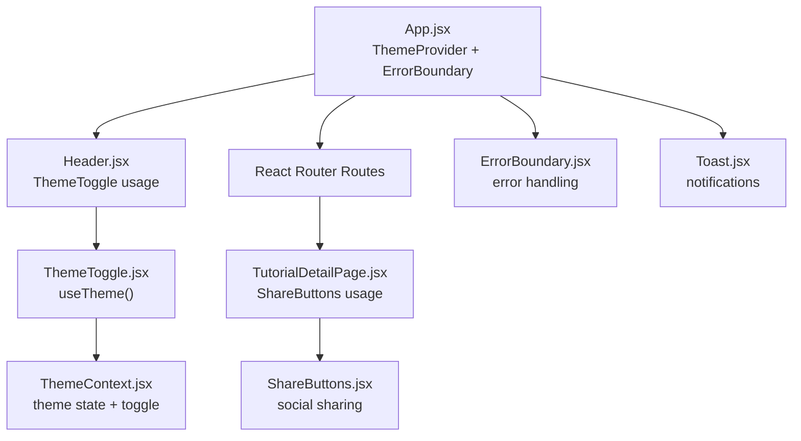
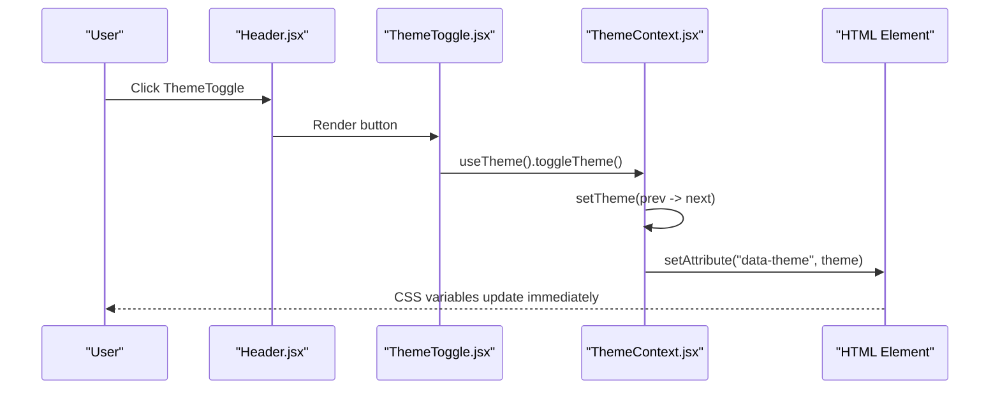
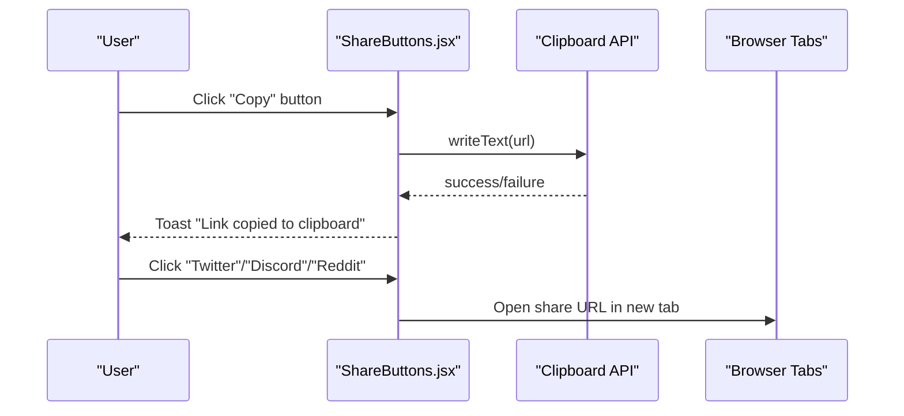
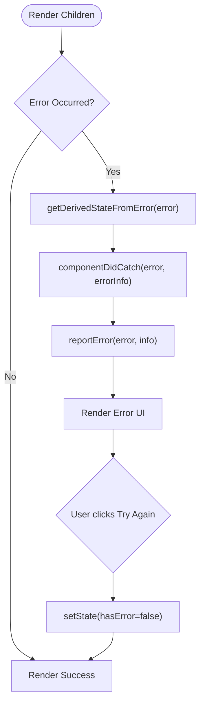
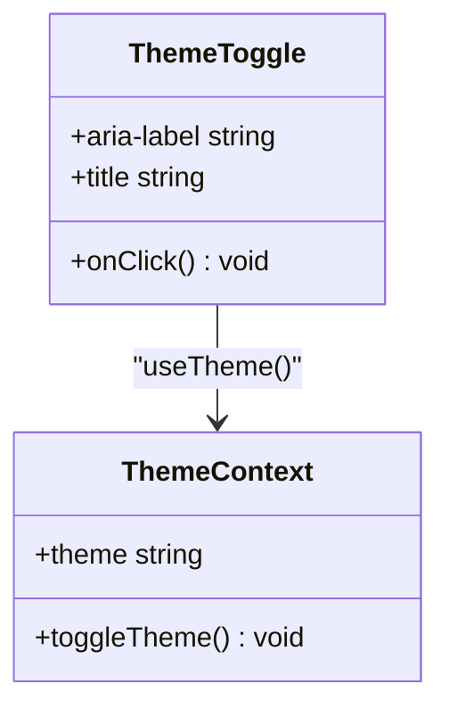
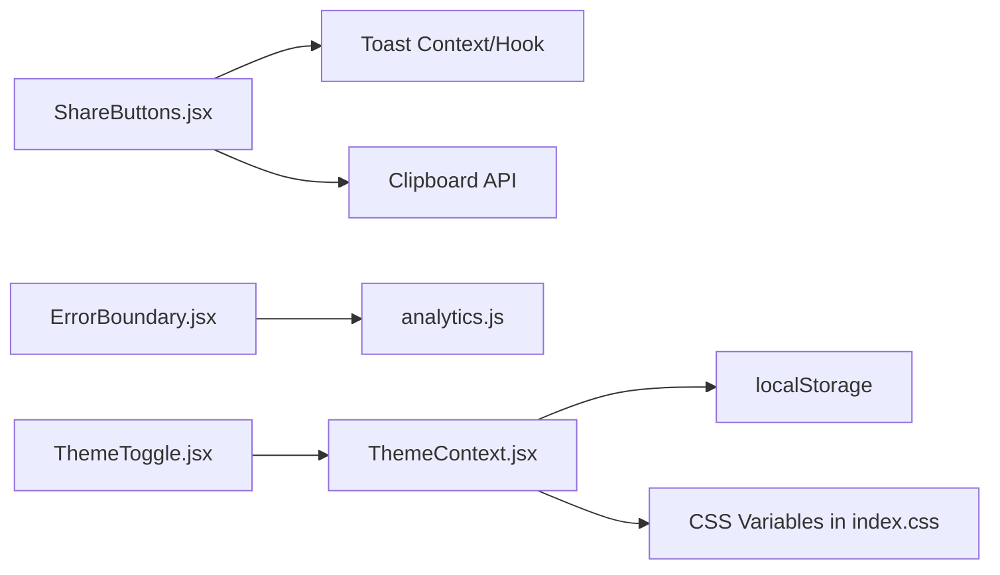

# Form and Interaction Components

<cite>
**Referenced Files in This Document**
- [ShareButtons.jsx](file://src/components/ShareButtons.jsx)
- [ShareButtons.module.css](file://src/components/ShareButtons.module.css)
- [ErrorBoundary.jsx](file://src/components/ErrorBoundary.jsx)
- [ErrorBoundary.module.css](file://src/components/ErrorBoundary.module.css)
- [ThemeToggle.jsx](file://src/components/ThemeToggle.jsx)
- [ThemeToggle.module.css](file://src/components/ThemeToggle.module.css)
- [ThemeContext.jsx](file://src/contexts/ThemeContext.jsx)
- [useLocalStorage.js](file://src/hooks/useLocalStorage.js)
- [analytics.js](file://src/utils/analytics.js)
- [TutorialDetailPage.jsx](file://src/pages/TutorialDetailPage.jsx)
- [Header.jsx](file://src/components/layout/Header.jsx)
- [App.jsx](file://src/App.jsx)
- [index.css](file://src/index.css)
- [Toast.jsx](file://src/components/Toast.jsx)
</cite>

## Table of Contents
1. [Introduction](#introduction)
2. [Project Structure](#project-structure)
3. [Core Components](#core-components)
4. [Architecture Overview](#architecture-overview)
5. [Detailed Component Analysis](#detailed-component-analysis)
6. [Dependency Analysis](#dependency-analysis)
7. [Performance Considerations](#performance-considerations)
8. [Troubleshooting Guide](#troubleshooting-guide)
9. [Conclusion](#conclusion)
10. [Appendices](#appendices)

## Introduction
This document provides comprehensive documentation for three form and interaction components: ShareButtons, ErrorBoundary, and ThemeToggle. It explains social sharing functionality, error boundary implementation, and theme switching capabilities. The guide covers component state management, user interaction patterns, integration with external services, styling approaches, animations, responsive behavior, and how these components enhance user engagement and overall application experience.

## Project Structure
These components are organized under the components directory and integrated via React context and routing. ShareButtons is used within tutorial detail pages, ErrorBoundary wraps the main application routes, and ThemeToggle integrates with ThemeContext to switch themes globally.

**Diagram sources**
- [App.jsx:21-48](file://src/App.jsx#L21-L48)
- [Header.jsx:8-115](file://src/components/layout/Header.jsx#L8-L115)
- [ThemeToggle.jsx:5-22](file://src/components/ThemeToggle.jsx#L5-L22)
- [ThemeContext.jsx:5-26](file://src/contexts/ThemeContext.jsx#L5-L26)
- [TutorialDetailPage.jsx:257](file://src/pages/TutorialDetailPage.jsx#L257)
- [ShareButtons.jsx:6-67](file://src/components/ShareButtons.jsx#L6-L67)
- [ErrorBoundary.jsx:6-58](file://src/components/ErrorBoundary.jsx#L6-L58)
- [Toast.jsx:5-31](file://src/components/Toast.jsx#L5-L31)

**Section sources**
- [App.jsx:21-48](file://src/App.jsx#L21-L48)
- [Header.jsx:8-115](file://src/components/layout/Header.jsx#L8-L115)
- [ThemeToggle.jsx:5-22](file://src/components/ThemeToggle.jsx#L5-L22)
- [ThemeContext.jsx:5-26](file://src/contexts/ThemeContext.jsx#L5-L26)
- [TutorialDetailPage.jsx:257](file://src/pages/TutorialDetailPage.jsx#L257)
- [ShareButtons.jsx:6-67](file://src/components/ShareButtons.jsx#L6-L67)
- [ErrorBoundary.jsx:6-58](file://src/components/ErrorBoundary.jsx#L6-L58)
- [Toast.jsx:5-31](file://src/components/Toast.jsx#L5-L31)

## Core Components
- ShareButtons: Provides social sharing actions (copy link, Twitter, Discord, Reddit) with accessibility attributes and toast notifications.
- ErrorBoundary: Catches rendering errors, logs/report them, and displays a friendly recovery UI with retry/home navigation.
- ThemeToggle: Switches between light and dark themes using ThemeContext and persists the preference.

Key integration points:
- ShareButtons depends on useToast for user feedback and uses window APIs for copying links.
- ErrorBoundary integrates with analytics reporting and renders a structured recovery UI.
- ThemeToggle uses ThemeContext to toggle theme and updates the root HTML attribute for CSS variable switching.

**Section sources**
- [ShareButtons.jsx:6-73](file://src/components/ShareButtons.jsx#L6-L73)
- [ErrorBoundary.jsx:6-63](file://src/components/ErrorBoundary.jsx#L6-L63)
- [ThemeToggle.jsx:5-23](file://src/components/ThemeToggle.jsx#L5-L23)
- [ThemeContext.jsx:5-35](file://src/contexts/ThemeContext.jsx#L5-L35)

## Architecture Overview
The components are wired into the application via App.jsx, which wraps the routing with ThemeProvider and ErrorBoundary. ShareButtons is embedded in TutorialDetailPage, while ThemeToggle appears in Header. Theme switching is persisted via localStorage and reflected in CSS variables applied to the root element.

**Diagram sources**
- [Header.jsx:86-112](file://src/components/layout/Header.jsx#L86-L112)
- [ThemeToggle.jsx:5-22](file://src/components/ThemeToggle.jsx#L5-L22)
- [ThemeContext.jsx:17-19](file://src/contexts/ThemeContext.jsx#L17-L19)
- [ThemeContext.jsx:11-15](file://src/contexts/ThemeContext.jsx#L11-L15)

**Section sources**
- [App.jsx:23-47](file://src/App.jsx#L23-L47)
- [Header.jsx:86-112](file://src/components/layout/Header.jsx#L86-L112)
- [ThemeToggle.jsx:5-22](file://src/components/ThemeToggle.jsx#L5-L22)
- [ThemeContext.jsx:11-19](file://src/contexts/ThemeContext.jsx#L11-L19)

## Detailed Component Analysis

### ShareButtons Component
Purpose:
- Enable users to share content via multiple channels and copy a link to the clipboard.

State and props:
- Props: title (required string), url (optional string).
- Internal state: derived from props and browser APIs.

User interactions:
- Copy link: attempts Clipboard API; falls back to temporary input method if unavailable.
- Social links: open external services in new tabs with encoded parameters.

Accessibility:
- Buttons and links include aria-label attributes for screen readers.

External integrations:
- Uses window.navigator.clipboard for copy operations.
- Constructs URLs for Twitter, Discord, and Reddit with encoded title and URL.

Usage example:
- Embedded in TutorialDetailPage with tutorial title and URL.

Styling and responsiveness:
- Flex layout with spacing tokens.
- Hover effects per platform and a “copied” state class.

**Diagram sources**
- [ShareButtons.jsx:13-26](file://src/components/ShareButtons.jsx#L13-L26)
- [ShareButtons.jsx:38-64](file://src/components/ShareButtons.jsx#L38-L64)
- [TutorialDetailPage.jsx:257](file://src/pages/TutorialDetailPage.jsx#L257)

**Section sources**
- [ShareButtons.jsx:6-73](file://src/components/ShareButtons.jsx#L6-L73)
- [ShareButtons.module.css:1-56](file://src/components/ShareButtons.module.css#L1-L56)
- [TutorialDetailPage.jsx:257](file://src/pages/TutorialDetailPage.jsx#L257)

### ErrorBoundary Component
Purpose:
- Gracefully handle rendering errors in the UI, log/report them, and present a recovery interface.

Lifecycle and state:
- Tracks hasError and error details.
- Uses static getDerivedStateFromError to flip to error state.
- Logs error and errorInfo to console and reports to analytics.

Recovery UI:
- Displays a warning icon, heading, message, optional error details, and action buttons (Try Again, Go Home).

External integrations:
- Integrates with analytics.reportError for error telemetry.

**Diagram sources**
- [ErrorBoundary.jsx:13-28](file://src/components/ErrorBoundary.jsx#L13-L28)
- [ErrorBoundary.jsx:17-24](file://src/components/ErrorBoundary.jsx#L17-L24)
- [ErrorBoundary.jsx:30-57](file://src/components/ErrorBoundary.jsx#L30-L57)
- [analytics.js:26-37](file://src/utils/analytics.js#L26-L37)

**Section sources**
- [ErrorBoundary.jsx:6-63](file://src/components/ErrorBoundary.jsx#L6-L63)
- [ErrorBoundary.module.css:1-83](file://src/components/ErrorBoundary.module.css#L1-L83)
- [analytics.js:26-37](file://src/utils/analytics.js#L26-L37)

### ThemeToggle Component
Purpose:
- Allow users to switch between light and dark themes.

State management:
- Uses ThemeContext to access theme state and toggle function.
- Persists theme preference in localStorage via ThemeContext.

Accessibility:
- Includes aria-label and title attributes indicating current mode.

Styling and responsiveness:
- Circular button with hover scaling effect.
- Filters and icons change based on theme via data-theme attribute.

**Diagram sources**
- [ThemeToggle.jsx:5-22](file://src/components/ThemeToggle.jsx#L5-L22)
- [ThemeContext.jsx:28-34](file://src/contexts/ThemeContext.jsx#L28-L34)

**Section sources**
- [ThemeToggle.jsx:5-23](file://src/components/ThemeToggle.jsx#L5-L23)
- [ThemeToggle.module.css:1-34](file://src/components/ThemeToggle.module.css#L1-L34)
- [ThemeContext.jsx:5-35](file://src/contexts/ThemeContext.jsx#L5-L35)
- [index.css:77-97](file://src/index.css#L77-L97)

## Dependency Analysis
- ShareButtons depends on:
  - useToast for notifications.
  - Browser Clipboard API and window.location for link handling.
- ErrorBoundary depends on:
  - analytics.reportError for error telemetry.
  - React lifecycle methods for error capture.
- ThemeToggle depends on:
  - ThemeContext for theme state and toggle.
  - ThemeContext persists theme via localStorage and applies CSS variables to the root element.

**Diagram sources**
- [ShareButtons.jsx:3](file://src/components/ShareButtons.jsx#L3)
- [ErrorBoundary.jsx:3](file://src/components/ErrorBoundary.jsx#L3)
- [analytics.js:26-37](file://src/utils/analytics.js#L26-L37)
- [ThemeToggle.jsx:2](file://src/components/ThemeToggle.jsx#L2)
- [ThemeContext.jsx:7-15](file://src/contexts/ThemeContext.jsx#L7-L15)
- [index.css:77-97](file://src/index.css#L77-L97)

**Section sources**
- [ShareButtons.jsx:3](file://src/components/ShareButtons.jsx#L3)
- [ErrorBoundary.jsx:3](file://src/components/ErrorBoundary.jsx#L3)
- [analytics.js:26-37](file://src/utils/analytics.js#L26-L37)
- [ThemeToggle.jsx:2](file://src/components/ThemeToggle.jsx#L2)
- [ThemeContext.jsx:7-15](file://src/contexts/ThemeContext.jsx#L7-L15)
- [index.css:77-97](file://src/index.css#L77-L97)

## Performance Considerations
- ShareButtons:
  - Clipboard API is asynchronous; fallback path uses temporary DOM elements. Prefer native API for better UX.
  - Avoid unnecessary re-renders by passing memoized title/url props.
- ErrorBoundary:
  - Keep error UI lightweight to minimize impact during error scenarios.
  - Debounce analytics reporting if needed to avoid excessive calls.
- ThemeToggle:
  - Theme switching relies on CSS variable updates; minimal JS overhead.
  - Persisting to localStorage avoids repeated reads on mount.

## Troubleshooting Guide
- ShareButtons copy fails:
  - Some browsers restrict clipboard access in insecure contexts. Verify HTTPS and user gesture requirements.
  - Fallback path creates a temporary input; ensure document interaction permissions.
- ErrorBoundary not catching errors:
  - Ensure ErrorBoundary wraps the intended components and that errors are thrown during render phase.
  - Confirm analytics.reportError is available and not throwing exceptions.
- ThemeToggle not switching:
  - Verify ThemeProvider is mounted at the root.
  - Check that data-theme attribute is being set on the root element and CSS variables are defined for both modes.

**Section sources**
- [ShareButtons.jsx:13-26](file://src/components/ShareButtons.jsx#L13-L26)
- [ErrorBoundary.jsx:17-24](file://src/components/ErrorBoundary.jsx#L17-L24)
- [ThemeContext.jsx:11-15](file://src/contexts/ThemeContext.jsx#L11-L15)

## Conclusion
These components collectively improve user engagement and resilience:
- ShareButtons encourages content distribution and provides immediate feedback.
- ErrorBoundary enhances reliability by offering graceful degradation and actionable recovery options.
- ThemeToggle personalizes the experience with persistent theme preferences and smooth transitions.

Together, they contribute to a robust, accessible, and visually consistent application.

## Appendices

### Accessibility Features
- ShareButtons:
  - aria-label on buttons and links for assistive technologies.
- ErrorBoundary:
  - Structured headings and labels in the error UI.
- ThemeToggle:
  - aria-label and title attributes indicate current theme state.

**Section sources**
- [ShareButtons.jsx:33-43](file://src/components/ShareButtons.jsx#L33-L43)
- [ShareButtons.jsx:51-52](file://src/components/ShareButtons.jsx#L51-L52)
- [ErrorBoundary.jsx:34-51](file://src/components/ErrorBoundary.jsx#L34-L51)
- [ThemeToggle.jsx:12-13](file://src/components/ThemeToggle.jsx#L12-L13)

### Styling and Animation Approaches
- ShareButtons:
  - CSS variables for spacing, colors, and transitions; hover states per platform.
- ErrorBoundary:
  - Centered layout with hover and focus states for interactive elements.
- ThemeToggle:
  - Circular button with hover scaling and theme-aware filters.

**Section sources**
- [ShareButtons.module.css:1-56](file://src/components/ShareButtons.module.css#L1-L56)
- [ErrorBoundary.module.css:1-83](file://src/components/ErrorBoundary.module.css#L1-L83)
- [ThemeToggle.module.css:1-34](file://src/components/ThemeToggle.module.css#L1-L34)
- [index.css:77-97](file://src/index.css#L77-L97)

### Responsive Behavior
- ThemeToggle includes a media query to adjust margins on smaller screens.
- ShareButtons and ErrorBoundary rely on flexible layouts and CSS variables for consistent spacing across breakpoints.

**Section sources**
- [ThemeToggle.module.css:28-33](file://src/components/ThemeToggle.module.css#L28-L33)
- [ShareButtons.module.css:1-5](file://src/components/ShareButtons.module.css#L1-L5)
- [ErrorBoundary.module.css:6-9](file://src/components/ErrorBoundary.module.css#L6-L9)