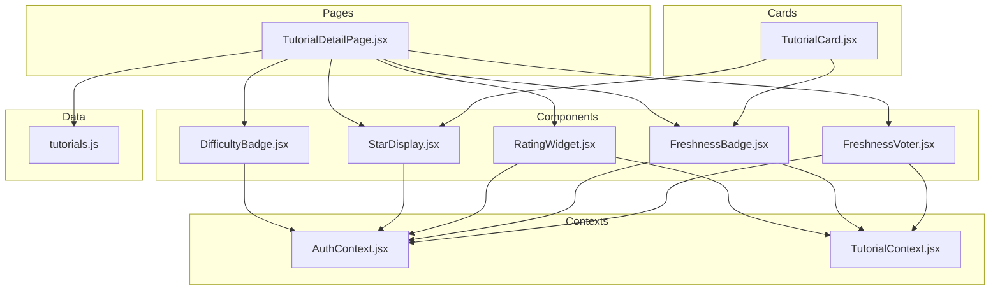
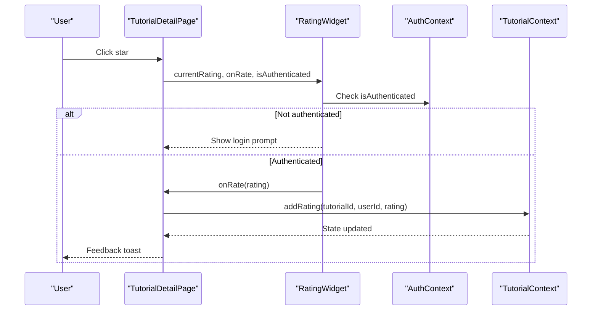
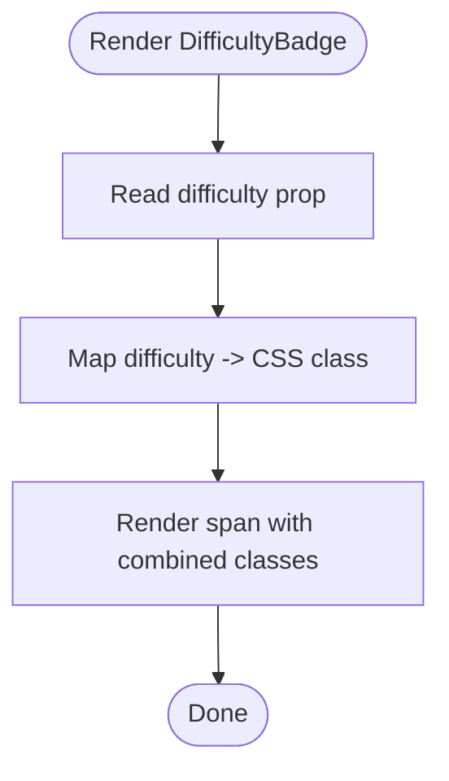
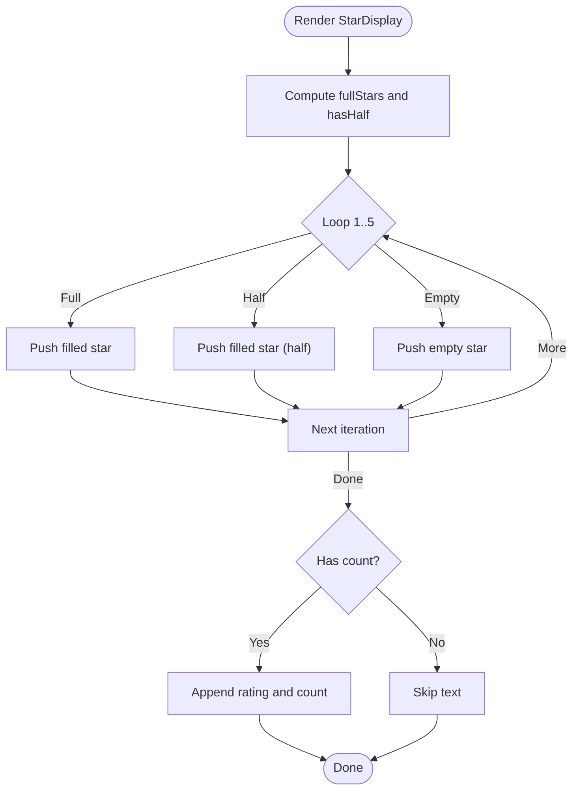
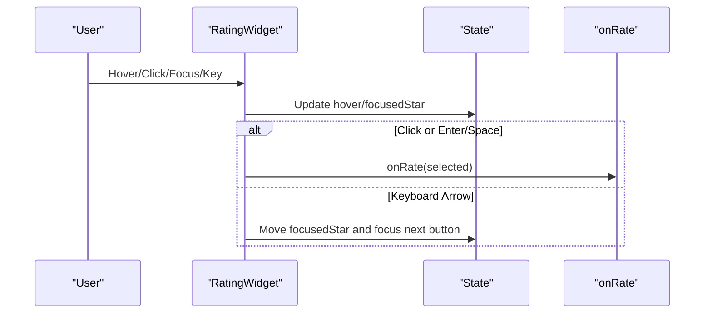
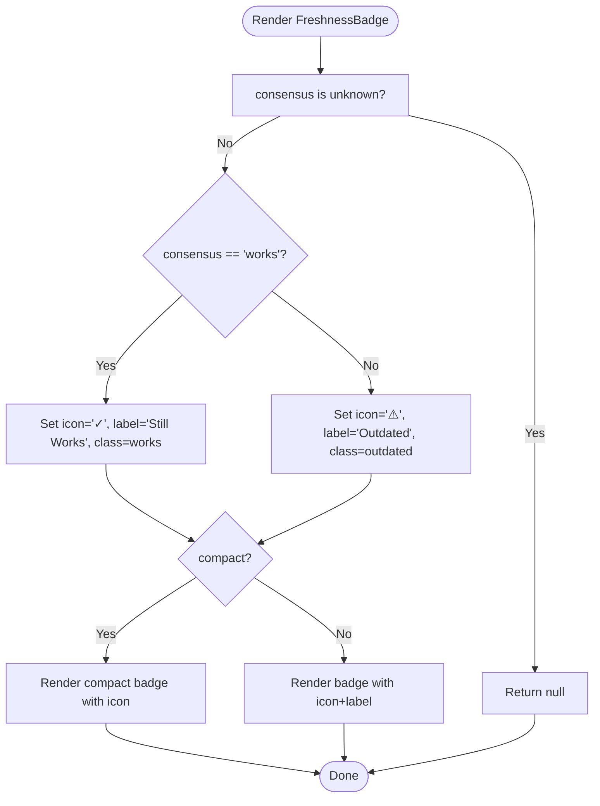
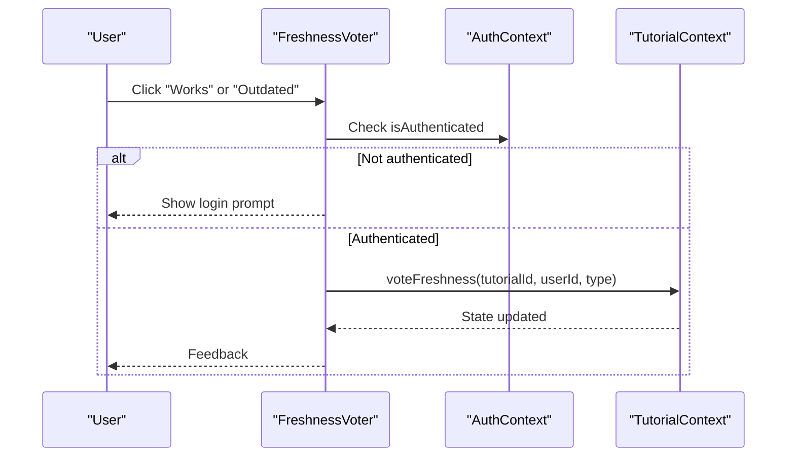
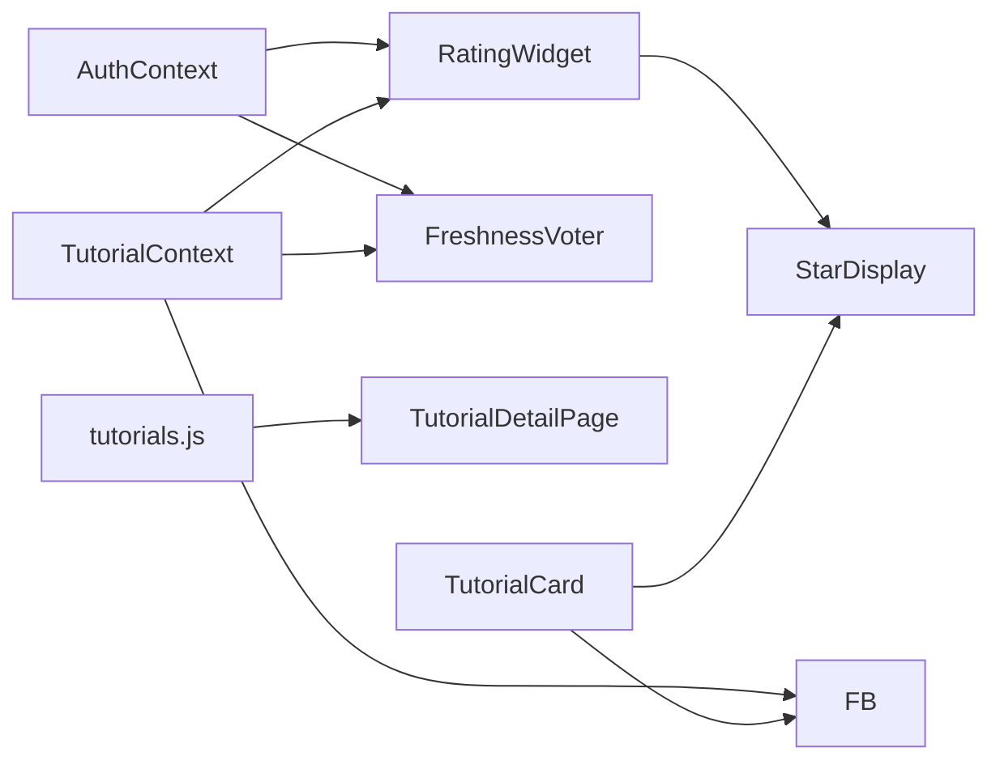

# Interactive Widgets

<cite>
**Referenced Files in This Document**
- [DifficultyBadge.jsx](file://src/components/DifficultyBadge.jsx)
- [DifficultyBadge.module.css](file://src/components/DifficultyBadge.module.css)
- [StarDisplay.jsx](file://src/components/StarDisplay.jsx)
- [StarDisplay.module.css](file://src/components/StarDisplay.module.css)
- [RatingWidget.jsx](file://src/components/RatingWidget.jsx)
- [RatingWidget.module.css](file://src/components/RatingWidget.module.css)
- [FreshnessBadge.jsx](file://src/components/FreshnessBadge.jsx)
- [FreshnessBadge.module.css](file://src/components/FreshnessBadge.module.css)
- [FreshnessVoter.jsx](file://src/components/FreshnessVoter.jsx)
- [TutorialDetailPage.jsx](file://src/pages/TutorialDetailPage.jsx)
- [TutorialCard.jsx](file://src/components/TutorialCard.jsx)
- [AuthContext.jsx](file://src/contexts/AuthContext.jsx)
- [TutorialContext.jsx](file://src/contexts/TutorialContext.jsx)
- [tutorials.js](file://src/data/tutorials.js)
</cite>

## Table of Contents
1. [Introduction](#introduction)
2. [Project Structure](#project-structure)
3. [Core Components](#core-components)
4. [Architecture Overview](#architecture-overview)
5. [Detailed Component Analysis](#detailed-component-analysis)
6. [Dependency Analysis](#dependency-analysis)
7. [Performance Considerations](#performance-considerations)
8. [Troubleshooting Guide](#troubleshooting-guide)
9. [Conclusion](#conclusion)

## Introduction
This document explains the interactive widget components that bring tutorial metadata and user interactions to life: DifficultyBadge, StarDisplay, RatingWidget, and FreshnessBadge. It covers visual representation, user interaction patterns, data binding, and integration with the tutorial data model and authentication system. You will find usage examples across different contexts, prop configurations, state management, styling, accessibility, and performance considerations.

## Project Structure
These widgets live under src/components and are consumed by page and card components. They rely on shared contexts for authentication and tutorial data, and they render static tutorial data from the data module.

**Diagram sources**
- [DifficultyBadge.jsx:1-22](file://src/components/DifficultyBadge.jsx#L1-L22)
- [StarDisplay.jsx:1-49](file://src/components/StarDisplay.jsx#L1-L49)
- [RatingWidget.jsx:1-84](file://src/components/RatingWidget.jsx#L1-L84)
- [FreshnessBadge.jsx:1-32](file://src/components/FreshnessBadge.jsx#L1-L32)
- [FreshnessVoter.jsx:1-55](file://src/components/FreshnessVoter.jsx#L1-L55)
- [TutorialDetailPage.jsx:1-296](file://src/pages/TutorialDetailPage.jsx#L1-L296)
- [TutorialCard.jsx:1-110](file://src/components/TutorialCard.jsx#L1-L110)
- [AuthContext.jsx:1-105](file://src/contexts/AuthContext.jsx#L1-L105)
- [TutorialContext.jsx:1-542](file://src/contexts/TutorialContext.jsx#L1-L542)
- [tutorials.js:1-522](file://src/data/tutorials.js#L1-L522)

**Section sources**
- [DifficultyBadge.jsx:1-22](file://src/components/DifficultyBadge.jsx#L1-L22)
- [StarDisplay.jsx:1-49](file://src/components/StarDisplay.jsx#L1-L49)
- [RatingWidget.jsx:1-84](file://src/components/RatingWidget.jsx#L1-L84)
- [FreshnessBadge.jsx:1-32](file://src/components/FreshnessBadge.jsx#L1-L32)
- [FreshnessVoter.jsx:1-55](file://src/components/FreshnessVoter.jsx#L1-L55)
- [TutorialDetailPage.jsx:1-296](file://src/pages/TutorialDetailPage.jsx#L1-L296)
- [TutorialCard.jsx:1-110](file://src/components/TutorialCard.jsx#L1-L110)
- [AuthContext.jsx:1-105](file://src/contexts/AuthContext.jsx#L1-L105)
- [TutorialContext.jsx:1-542](file://src/contexts/TutorialContext.jsx#L1-L542)
- [tutorials.js:1-522](file://src/data/tutorials.js#L1-L522)

## Core Components
This section summarizes each widget’s purpose, props, rendering behavior, and styling hooks.

- DifficultyBadge
  - Purpose: Displays tutorial difficulty as a labeled badge.
  - Props: difficulty (one of Beginner, Intermediate, Advanced).
  - Rendering: Renders a span with a difficulty-specific CSS class.
  - Styling: Uses modular CSS classes for background, color, and typography.
  - Accessibility: No interactive state; relies on semantic text.

- StarDisplay
  - Purpose: Visualizes an average rating with filled/empty stars and optional rating text.
  - Props: rating (number), count (optional number), compact (boolean).
  - Rendering: Builds up to five star spans; fills full stars, handles half star, and applies compact mode styling.
  - Styling: Modular CSS controls star colors, sizes, spacing, and compact adjustments.

- RatingWidget
  - Purpose: Allows authenticated users to rate a tutorial via 1–5 stars.
  - Props: currentRating (number), onRate (function), isAuthenticated (boolean).
  - Interaction: Hover/focus highlights, keyboard navigation (arrow keys), click submits rating.
  - Accessibility: Radio group semantics, ARIA attributes, focus management, and tab order.
  - Authentication gating: Shows a login prompt when not authenticated.

- FreshnessBadge
  - Purpose: Indicates whether a tutorial still works or is outdated.
  - Props: consensus (one of works, outdated, unknown), compact (boolean).
  - Rendering: Returns null for unknown; otherwise renders a badge with icon and label (or compact icon only).
  - Styling: Modular CSS defines colors, borders, and compact layout.

**Section sources**
- [DifficultyBadge.jsx:5-21](file://src/components/DifficultyBadge.jsx#L5-L21)
- [DifficultyBadge.module.css:1-26](file://src/components/DifficultyBadge.module.css#L1-L26)
- [StarDisplay.jsx:5-48](file://src/components/StarDisplay.jsx#L5-L48)
- [StarDisplay.module.css:1-36](file://src/components/StarDisplay.module.css#L1-L36)
- [RatingWidget.jsx:6-83](file://src/components/RatingWidget.jsx#L6-L83)
- [RatingWidget.module.css:1-48](file://src/components/RatingWidget.module.css#L1-L48)
- [FreshnessBadge.jsx:5-31](file://src/components/FreshnessBadge.jsx#L5-L31)
- [FreshnessBadge.module.css:1-48](file://src/components/FreshnessBadge.module.css#L1-L48)

## Architecture Overview
The widgets are stateless presentational components that receive data and callbacks via props. Authentication and tutorial data are provided by contexts. The tutorial detail page composes these widgets with real data and user actions.

**Diagram sources**
- [TutorialDetailPage.jsx:111-116](file://src/pages/TutorialDetailPage.jsx#L111-L116)
- [RatingWidget.jsx:11-17](file://src/components/RatingWidget.jsx#L11-L17)
- [AuthContext.jsx:92-101](file://src/contexts/AuthContext.jsx#L92-L101)
- [TutorialContext.jsx:90-101](file://src/contexts/TutorialContext.jsx#L90-L101)

## Detailed Component Analysis

### DifficultyBadge
- Visual representation: Badge with rounded corners and platform-appropriate color scheme based on difficulty.
- Interaction: None; purely presentational.
- Data binding: Receives difficulty string; maps to CSS class via a class map.
- Styling: Modular CSS defines background, color, typography, and radius.

**Diagram sources**
- [DifficultyBadge.jsx:5-16](file://src/components/DifficultyBadge.jsx#L5-L16)
- [DifficultyBadge.module.css:1-26](file://src/components/DifficultyBadge.module.css#L1-L26)

**Section sources**
- [DifficultyBadge.jsx:5-21](file://src/components/DifficultyBadge.jsx#L5-L21)
- [DifficultyBadge.module.css:1-26](file://src/components/DifficultyBadge.module.css#L1-L26)

### StarDisplay
- Visual representation: Five stars; filled based on rating floor; optional half star; optional rating text with count.
- Interaction: None; purely presentational.
- Data binding: rating and count props drive star fill and text rendering; compact toggles smaller visuals.
- Styling: Modular CSS sets star colors, spacing, and compact overrides.

**Diagram sources**
- [StarDisplay.jsx:5-41](file://src/components/StarDisplay.jsx#L5-L41)
- [StarDisplay.module.css:1-36](file://src/components/StarDisplay.module.css#L1-L36)

**Section sources**
- [StarDisplay.jsx:5-48](file://src/components/StarDisplay.jsx#L5-L48)
- [StarDisplay.module.css:1-36](file://src/components/StarDisplay.module.css#L1-L36)

### RatingWidget
- Visual representation: Five clickable/star buttons styled as stars; hover/focus highlights; filled state reflects current or hovered rating.
- Interaction: Mouse enter/leave, focus/blur, click, and keyboard arrow keys move focus and select rating.
- Data binding: currentRating drives initial state; onRate callback invoked with selected rating; isAuthenticated gates UI.
- Accessibility: role="radiogroup", role="radio", aria-checked, aria-label, tabindex management, and focus restoration.
- Authentication gating: Shows a login prompt paragraph when not authenticated.

**Diagram sources**
- [RatingWidget.jsx:19-76](file://src/components/RatingWidget.jsx#L19-L76)
- [RatingWidget.module.css:1-48](file://src/components/RatingWidget.module.css#L1-L48)

**Section sources**
- [RatingWidget.jsx:6-83](file://src/components/RatingWidget.jsx#L6-L83)
- [RatingWidget.module.css:1-48](file://src/components/RatingWidget.module.css#L1-L48)

### FreshnessBadge
- Visual representation: Badge indicating “Still Works” or “Outdated” with icon and label; compact mode shows only icon.
- Interaction: None; purely presentational.
- Data binding: consensus prop determines icon, label, and CSS class; compact toggles layout.
- Styling: Modular CSS defines background, border, color, and compact sizing.

**Diagram sources**
- [FreshnessBadge.jsx:5-26](file://src/components/FreshnessBadge.jsx#L5-L26)
- [FreshnessBadge.module.css:1-48](file://src/components/FreshnessBadge.module.css#L1-L48)

**Section sources**
- [FreshnessBadge.jsx:5-31](file://src/components/FreshnessBadge.jsx#L5-L31)
- [FreshnessBadge.module.css:1-48](file://src/components/FreshnessBadge.module.css#L1-L48)

### FreshnessVoter (companion widget)
- Visual representation: Two action buttons (“Yes, Still Works”, “No, Outdated”) with counts; login prompt when unauthenticated.
- Interaction: Click invokes onVote with either 'works' or 'outdated'; disabled when not authenticated.
- Data binding: status provides worksCount/outdatedCount/consensus; userVote indicates current user selection; onVote persists and updates counts.

**Diagram sources**
- [FreshnessVoter.jsx:5-42](file://src/components/FreshnessVoter.jsx#L5-L42)
- [TutorialContext.jsx:260-293](file://src/contexts/TutorialContext.jsx#L260-L293)

**Section sources**
- [FreshnessVoter.jsx:5-55](file://src/components/FreshnessVoter.jsx#L5-L55)
- [TutorialContext.jsx:259-303](file://src/contexts/TutorialContext.jsx#L259-L303)

## Dependency Analysis
- Authentication dependency: RatingWidget and FreshnessVoter check isAuthenticated to decide whether to render interactive controls or a login prompt.
- Tutorial data dependency: RatingWidget reads user rating via getUserRating; FreshnessBadge and FreshnessVoter consume getFreshnessStatus and getUserFreshnessVote.
- Styling dependency: All widgets depend on modular CSS for consistent theming and responsive variants.

**Diagram sources**
- [AuthContext.jsx:92-101](file://src/contexts/AuthContext.jsx#L92-L101)
- [TutorialContext.jsx:453-536](file://src/contexts/TutorialContext.jsx#L453-L536)
- [tutorials.js:1-522](file://src/data/tutorials.js#L1-L522)
- [TutorialDetailPage.jsx:22-156](file://src/pages/TutorialDetailPage.jsx#L22-L156)
- [TutorialCard.jsx:14-104](file://src/components/TutorialCard.jsx#L14-L104)

**Section sources**
- [AuthContext.jsx:1-105](file://src/contexts/AuthContext.jsx#L1-L105)
- [TutorialContext.jsx:1-542](file://src/contexts/TutorialContext.jsx#L1-L542)
- [tutorials.js:1-522](file://src/data/tutorials.js#L1-L522)
- [TutorialDetailPage.jsx:1-296](file://src/pages/TutorialDetailPage.jsx#L1-L296)
- [TutorialCard.jsx:1-110](file://src/components/TutorialCard.jsx#L1-L110)

## Performance Considerations
- StarDisplay loops over a fixed range (1..5); negligible cost but avoid unnecessary re-renders by passing memoized rating/count values.
- RatingWidget maintains minimal local state (hover and focused star) and uses refs for focus management; keep handlers stable to prevent re-renders.
- FreshnessBadge returns null for unknown consensus; avoid rendering when consensus is unavailable to reduce DOM nodes.
- FreshnessVoter conditionally disables buttons when unauthenticated; ensure authentication checks are fast and stable.

[No sources needed since this section provides general guidance]

## Troubleshooting Guide
- RatingWidget does not respond to clicks:
  - Ensure isAuthenticated is true and onRate is passed.
  - Verify that the component receives currentRating and that the callback updates persisted state.
- Login prompt appears unexpectedly:
  - Confirm that AuthContext exposes isAuthenticated and that the provider wraps the consuming components.
- FreshnessBadge not visible:
  - Check that consensus is not 'unknown'; pass a valid 'works' or 'outdated' value.
- StarDisplay shows unexpected half star:
  - Verify rating is a number and count is not passed unintentionally; confirm the half-star threshold logic aligns with your data.

**Section sources**
- [RatingWidget.jsx:11-17](file://src/components/RatingWidget.jsx#L11-L17)
- [AuthContext.jsx:92-101](file://src/contexts/AuthContext.jsx#L92-L101)
- [FreshnessBadge.jsx:6-6](file://src/components/FreshnessBadge.jsx#L6-L6)
- [StarDisplay.jsx:7-8](file://src/components/StarDisplay.jsx#L7-L8)

## Conclusion
These widgets form a cohesive system for communicating tutorial metadata and enabling user participation. DifficultyBadge and StarDisplay provide quick visual summaries; RatingWidget offers an accessible, keyboard-friendly rating experience; FreshnessBadge and FreshnessVoter capture community consensus on tutorial currency. Together with the authentication and tutorial contexts, they deliver a consistent, inclusive, and performant user experience across pages and cards.