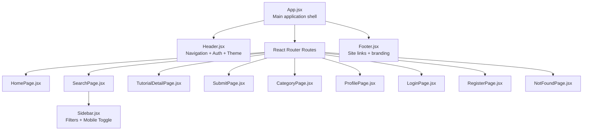
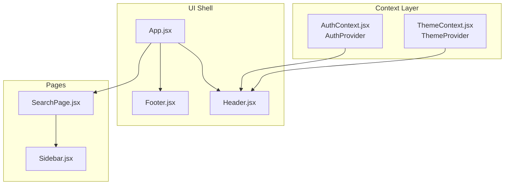
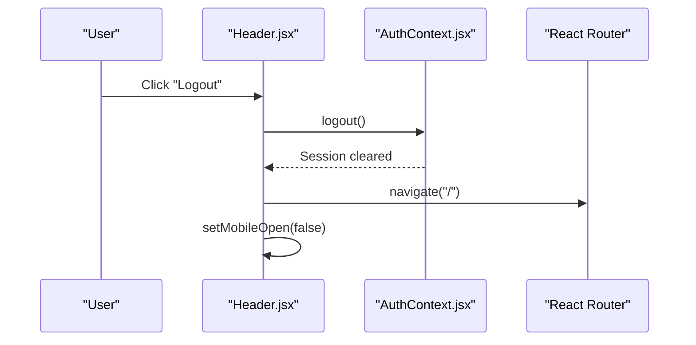
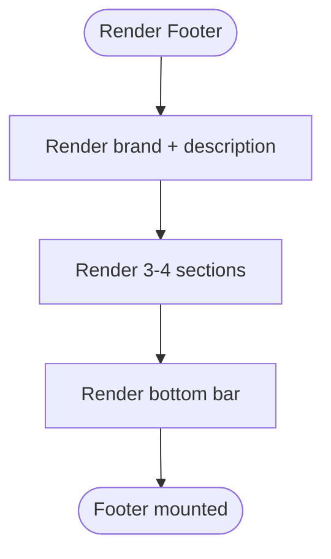
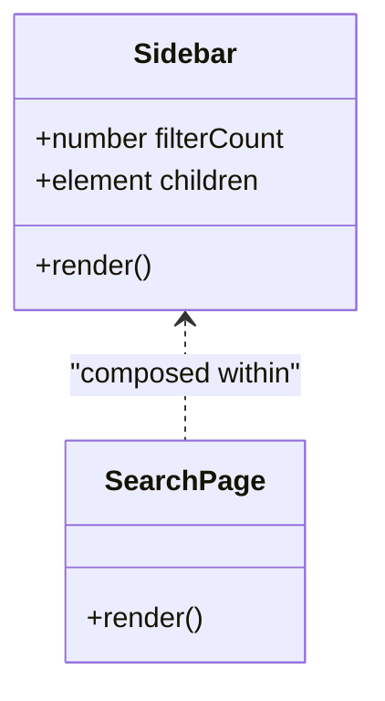
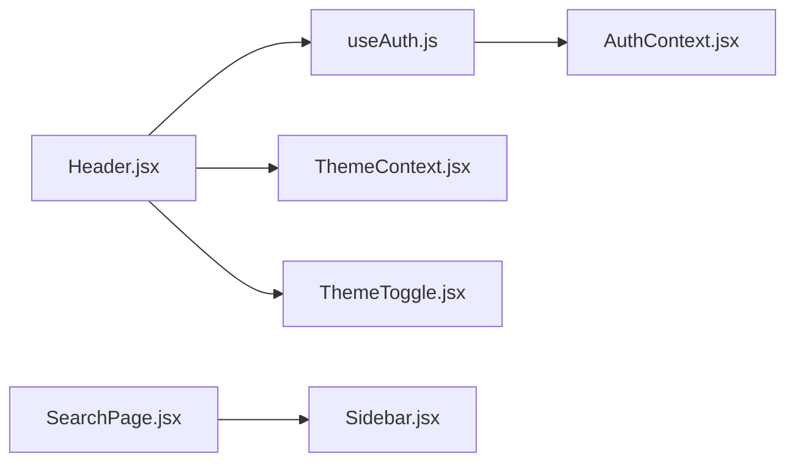

# Layout Components

<cite>
**Referenced Files in This Document**
- [Header.jsx](file://src/components/layout/Header.jsx)
- [Header.module.css](file://src/components/layout/Header.module.css)
- [Footer.jsx](file://src/components/layout/Footer.jsx)
- [Footer.module.css](file://src/components/layout/Footer.module.css)
- [Sidebar.jsx](file://src/components/layout/Sidebar.jsx)
- [Sidebar.module.css](file://src/components/layout/Sidebar.module.css)
- [App.jsx](file://src/App.jsx)
- [ThemeContext.jsx](file://src/contexts/ThemeContext.jsx)
- [AuthContext.jsx](file://src/contexts/AuthContext.jsx)
- [useAuth.js](file://src/hooks/useAuth.js)
- [ThemeToggle.jsx](file://src/components/ThemeToggle.jsx)
- [index.css](file://src/index.css)
- [SearchPage.jsx](file://src/pages/SearchPage.jsx)
</cite>

## Table of Contents
1. [Introduction](#introduction)
2. [Project Structure](#project-structure)
3. [Core Components](#core-components)
4. [Architecture Overview](#architecture-overview)
5. [Detailed Component Analysis](#detailed-component-analysis)
6. [Dependency Analysis](#dependency-analysis)
7. [Performance Considerations](#performance-considerations)
8. [Accessibility Features](#accessibility-features)
9. [Troubleshooting Guide](#troubleshooting-guide)
10. [Conclusion](#conclusion)

## Introduction
This document provides comprehensive documentation for GameDev Hub’s layout components: Header, Footer, and Sidebar. It explains navigation structure, responsive design patterns, integration with authentication state, component props, styling architecture using CSS Modules, mobile-first design approaches, accessibility features, and how these components integrate with the overall application structure.

## Project Structure
The layout components are organized under a dedicated layout folder and are integrated into the main application shell. They rely on shared theming and authentication contexts and use CSS Modules for scoped styling. The main application container composes the Header, page routes, and Footer, while the Sidebar is used within specific pages such as the Search page.

**Diagram sources**
- [App.jsx:21-47](file://src/App.jsx#L21-L47)
- [Header.jsx:8-115](file://src/components/layout/Header.jsx#L8-L115)
- [Footer.jsx:5-50](file://src/components/layout/Footer.jsx#L5-L50)
- [Sidebar.jsx:4-23](file://src/components/layout/Sidebar.jsx#L4-L23)
- [SearchPage.jsx:12-140](file://src/pages/SearchPage.jsx#L12-L140)

**Section sources**
- [App.jsx:21-47](file://src/App.jsx#L21-L47)
- [Header.jsx:8-115](file://src/components/layout/Header.jsx#L8-L115)
- [Footer.jsx:5-50](file://src/components/layout/Footer.jsx#L5-L50)
- [Sidebar.jsx:4-23](file://src/components/layout/Sidebar.jsx#L4-L23)
- [SearchPage.jsx:12-140](file://src/pages/SearchPage.jsx#L12-L140)

## Core Components
This section documents each layout component’s responsibilities, props, styling architecture, and integration points.

- Header
  - Purpose: Provides site branding, primary navigation, authentication controls, theme toggle, and mobile hamburger menu.
  - Props: None.
  - Key behaviors:
    - Uses authentication state to conditionally render profile avatar, username, logout button, or login/register buttons.
    - Integrates ThemeToggle for theme switching.
    - Implements mobile-first responsive behavior with a collapsible mobile menu.
  - Styling: Uses CSS Modules for scoped styles and media queries for responsive breakpoints.

- Footer
  - Purpose: Presents site branding, categorized links, and copyright/social information.
  - Props: None.
  - Key behaviors:
    - Responsive grid layout that adapts across breakpoints.
    - Links styled consistently with hover effects.

- Sidebar
  - Purpose: Encapsulates filter controls and toggles visibility on smaller screens.
  - Props:
    - children: Filter UI components to render inside the sidebar.
    - filterCount: Number indicating active filters for display.
  - Key behaviors:
    - Collapsible content with a toggle button.
    - Responsive behavior to switch to a top-of-content toggle on smaller screens.

**Section sources**
- [Header.jsx:8-115](file://src/components/layout/Header.jsx#L8-L115)
- [Header.module.css:1-189](file://src/components/layout/Header.module.css#L1-L189)
- [Footer.jsx:5-50](file://src/components/layout/Footer.jsx#L5-L50)
- [Footer.module.css:1-114](file://src/components/layout/Footer.module.css#L1-L114)
- [Sidebar.jsx:4-23](file://src/components/layout/Sidebar.jsx#L4-L23)
- [Sidebar.module.css:1-59](file://src/components/layout/Sidebar.module.css#L1-L59)

## Architecture Overview
The layout components integrate with the application via the main App shell. Authentication and theming are provided by dedicated contexts, consumed by Header and ThemeToggle. The Sidebar is composed within page-level components like SearchPage.

**Diagram sources**
- [App.jsx:21-47](file://src/App.jsx#L21-L47)
- [AuthContext.jsx:13-104](file://src/contexts/AuthContext.jsx#L13-L104)
- [ThemeContext.jsx:5-26](file://src/contexts/ThemeContext.jsx#L5-L26)
- [Header.jsx:8-115](file://src/components/layout/Header.jsx#L8-L115)
- [Footer.jsx:5-50](file://src/components/layout/Footer.jsx#L5-L50)
- [SearchPage.jsx:12-140](file://src/pages/SearchPage.jsx#L12-L140)
- [Sidebar.jsx:4-23](file://src/components/layout/Sidebar.jsx#L4-L23)

## Detailed Component Analysis

### Header Component
- Navigation structure:
  - Home, Browse, and Submit links use React Router’s NavLink for active state styling.
  - Active link highlighting is handled via a dynamic class applied through a callback.
- Authentication integration:
  - Reads authentication state via useAuth hook and renders either:
    - Authenticated user menu (avatar, username, logout).
    - Login and Register links.
  - Logout triggers context logout, navigates to home, and closes mobile menu.
- Theming:
  - Renders ThemeToggle for theme switching.
- Responsive design:
  - Desktop: Full navigation and auth controls visible.
  - Mobile: Hamburger menu toggles a vertical mobile menu containing theme toggle, navigation, and auth controls.
- Accessibility:
  - Hamburger button includes an aria-label for screen readers.

**Diagram sources**
- [Header.jsx:14-18](file://src/components/layout/Header.jsx#L14-L18)
- [AuthContext.jsx:88-90](file://src/contexts/AuthContext.jsx#L88-L90)
- [Header.jsx:10-11](file://src/components/layout/Header.jsx#L10-L11)

**Section sources**
- [Header.jsx:8-115](file://src/components/layout/Header.jsx#L8-L115)
- [Header.module.css:165-188](file://src/components/layout/Header.module.css#L165-L188)
- [AuthContext.jsx:13-104](file://src/contexts/AuthContext.jsx#L13-L104)
- [useAuth.js:4-10](file://src/hooks/useAuth.js#L4-L10)

### Footer Component
- Content organization:
  - Brand identity and description.
  - Categorized sections for browsing, categories, and community actions.
  - Bottom bar with copyright and optional social links area.
- Responsive design:
  - Grid layout adjusts number of columns at different breakpoints.
  - Bottom bar stacks vertically on small screens.

**Diagram sources**
- [Footer.jsx:5-50](file://src/components/layout/Footer.jsx#L5-L50)
- [Footer.module.css:93-113](file://src/components/layout/Footer.module.css#L93-L113)

**Section sources**
- [Footer.jsx:5-50](file://src/components/layout/Footer.jsx#L5-L50)
- [Footer.module.css:1-114](file://src/components/layout/Footer.module.css#L1-L114)

### Sidebar Component
- Composition pattern:
  - Accepts children to render filter UI (e.g., SearchFilter).
  - Displays a filter count badge when provided.
- Mobile-first behavior:
  - On larger screens, content remains open and sticky.
  - On smaller screens, content collapses behind a toggle button.
- Interaction:
  - Toggle rotates arrow icon to indicate expanded state.

**Diagram sources**
- [Sidebar.jsx:4-23](file://src/components/layout/Sidebar.jsx#L4-L23)
- [SearchPage.jsx:110-116](file://src/pages/SearchPage.jsx#L110-L116)

**Section sources**
- [Sidebar.jsx:4-23](file://src/components/layout/Sidebar.jsx#L4-L23)
- [Sidebar.module.css:39-58](file://src/components/layout/Sidebar.module.css#L39-L58)
- [SearchPage.jsx:110-116](file://src/pages/SearchPage.jsx#L110-L116)

## Dependency Analysis
- Context dependencies:
  - Header depends on AuthContext via useAuth and ThemeContext via useTheme.
  - ThemeContext persists theme preference and applies it to the document element.
- Component coupling:
  - Header composes ThemeToggle internally.
  - Sidebar is used within SearchPage; it does not depend on routing.
- Routing integration:
  - Header uses React Router’s NavLink and useNavigate for navigation and programmatic routing.

**Diagram sources**
- [Header.jsx:3-10](file://src/components/layout/Header.jsx#L3-L10)
- [useAuth.js:4-10](file://src/hooks/useAuth.js#L4-L10)
- [AuthContext.jsx:13-104](file://src/contexts/AuthContext.jsx#L13-L104)
- [ThemeContext.jsx:5-26](file://src/contexts/ThemeContext.jsx#L5-L26)
- [SearchPage.jsx:5-10](file://src/pages/SearchPage.jsx#L5-L10)
- [Sidebar.jsx:4-23](file://src/components/layout/Sidebar.jsx#L4-L23)

**Section sources**
- [Header.jsx:3-10](file://src/components/layout/Header.jsx#L3-L10)
- [useAuth.js:4-10](file://src/hooks/useAuth.js#L4-L10)
- [AuthContext.jsx:13-104](file://src/contexts/AuthContext.jsx#L13-L104)
- [ThemeContext.jsx:5-26](file://src/contexts/ThemeContext.jsx#L5-L26)
- [SearchPage.jsx:5-10](file://src/pages/SearchPage.jsx#L5-L10)
- [Sidebar.jsx:4-23](file://src/components/layout/Sidebar.jsx#L4-L23)

## Performance Considerations
- CSS Modules scoping reduces style conflicts and improves maintainability.
- Sticky positioning for Sidebar ensures efficient scrolling behavior on content-heavy pages.
- Minimal re-renders:
  - Header memoizes active link class via a callback.
  - Auth state is derived via useMemo in AuthProvider to avoid unnecessary recalculations.
- Theme persistence via localStorage avoids theme recalculation on each render.

[No sources needed since this section provides general guidance]

## Accessibility Features
- Keyboard navigation:
  - Focus styles are globally defined via focus-visible, ensuring visible focus rings for interactive elements.
- Screen reader support:
  - Hamburger menu includes an aria-label for menu toggle.
  - Links and buttons use semantic HTML with appropriate roles and labels.
- Color contrast and readability:
  - Theme-aware color tokens ensure sufficient contrast across light/dark themes.
- Semantic structure:
  - Header, main, and footer are used as landmarks for assistive technologies.

**Section sources**
- [index.css:136-139](file://src/index.css#L136-L139)
- [Header.jsx:99-102](file://src/components/layout/Header.jsx#L99-L102)
- [index.css:77-97](file://src/index.css#L77-L97)

## Troubleshooting Guide
- Header logout not working:
  - Verify AuthProvider is wrapping the app and useAuth is used within Header.
  - Confirm that logout clears session storage and redirects to home.
- Theme toggle not persisting:
  - Ensure ThemeProvider is present at the root and ThemeContext is used in ThemeToggle.
  - Check that data-theme attribute is applied to the document element.
- Sidebar filters not visible on mobile:
  - Confirm media query breakpoint matches device width.
  - Ensure toggle button click updates internal open state and reflects class changes.
- Footer layout breaks on small screens:
  - Validate CSS grid template columns and media queries.
  - Ensure footer bottom bar flex direction stacks on small viewports.

**Section sources**
- [AuthContext.jsx:13-104](file://src/contexts/AuthContext.jsx#L13-L104)
- [ThemeContext.jsx:5-26](file://src/contexts/ThemeContext.jsx#L5-L26)
- [Header.jsx:14-18](file://src/components/layout/Header.jsx#L14-L18)
- [Sidebar.module.css:39-58](file://src/components/layout/Sidebar.module.css#L39-L58)
- [Footer.module.css:93-113](file://src/components/layout/Footer.module.css#L93-L113)

## Conclusion
The layout components form a cohesive, accessible, and responsive foundation for GameDev Hub. They integrate tightly with authentication and theming contexts, employ mobile-first design patterns, and leverage CSS Modules for maintainable styling. The Header manages navigation and auth states, the Footer organizes site content across breakpoints, and the Sidebar encapsulates filtering with a robust mobile toggle. Together, they support a scalable architecture suitable for growth and consistent user experience across devices.