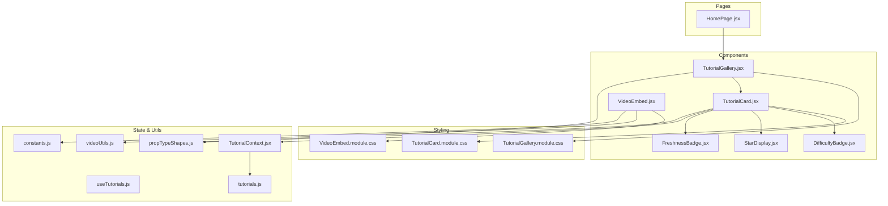
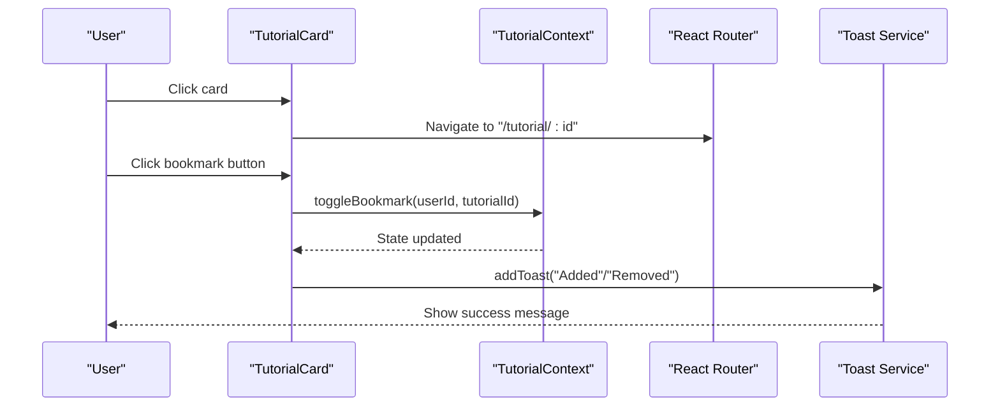
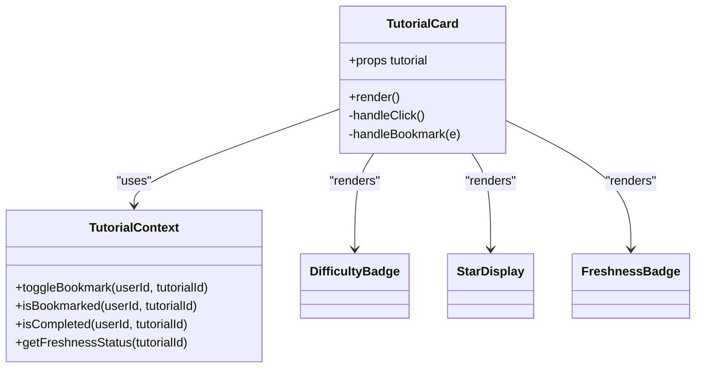
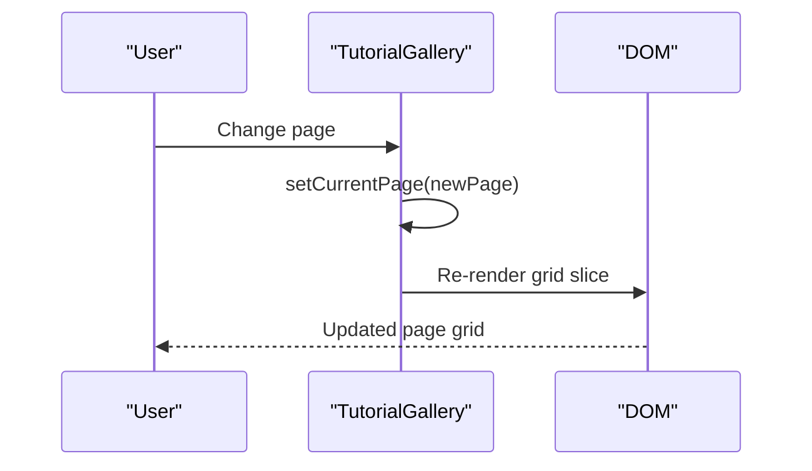
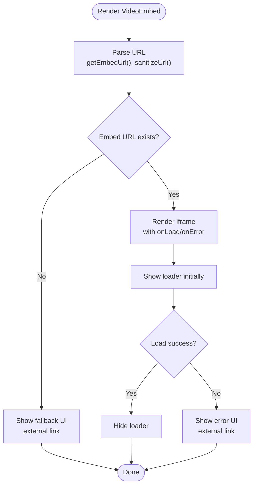
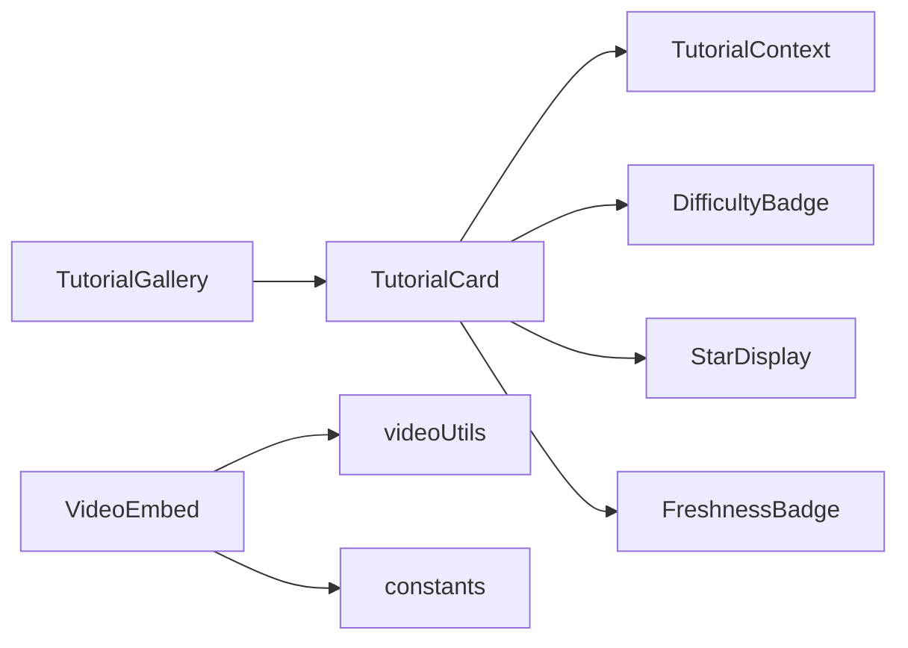

# Tutorial Display Components

<cite>
**Referenced Files in This Document**
- [TutorialCard.jsx](file://src/components/TutorialCard.jsx)
- [TutorialCard.module.css](file://src/components/TutorialCard.module.css)
- [TutorialGallery.jsx](file://src/components/TutorialGallery.jsx)
- [TutorialGallery.module.css](file://src/components/TutorialGallery.module.css)
- [VideoEmbed.jsx](file://src/components/VideoEmbed.jsx)
- [VideoEmbed.module.css](file://src/components/VideoEmbed.module.css)
- [TutorialContext.jsx](file://src/contexts/TutorialContext.jsx)
- [useTutorials.js](file://src/hooks/useTutorials.js)
- [propTypeShapes.js](file://src/utils/propTypeShapes.js)
- [videoUtils.js](file://src/utils/videoUtils.js)
- [constants.js](file://src/data/constants.js)
- [tutorials.js](file://src/data/tutorials.js)
- [HomePage.jsx](file://src/pages/HomePage.jsx)
- [DifficultyBadge.jsx](file://src/components/DifficultyBadge.jsx)
- [StarDisplay.jsx](file://src/components/StarDisplay.jsx)
- [FreshnessBadge.jsx](file://src/components/FreshnessBadge.jsx)
</cite>

## Table of Contents
1. [Introduction](#introduction)
2. [Project Structure](#project-structure)
3. [Core Components](#core-components)
4. [Architecture Overview](#architecture-overview)
5. [Detailed Component Analysis](#detailed-component-analysis)
6. [Dependency Analysis](#dependency-analysis)
7. [Performance Considerations](#performance-considerations)
8. [Troubleshooting Guide](#troubleshooting-guide)
9. [Conclusion](#conclusion)

## Introduction
This document provides comprehensive documentation for the tutorial display components: TutorialCard, TutorialGallery, and VideoEmbed. It explains how these components work together to present tutorials, manage user interactions (bookmarking, completion tracking), and render embedded videos from external platforms. It covers props, state management integration via context, styling patterns, responsive behavior, accessibility features, and composition patterns with the tutorial data model.

## Project Structure
The tutorial display components live under src/components and are supported by:
- Context and hooks for state management
- Utility modules for data shapes and video platform integration
- Example usage in pages (e.g., HomePage)

**Diagram sources**
- [TutorialCard.jsx:1-110](file://src/components/TutorialCard.jsx#L1-L110)
- [TutorialCard.module.css:1-244](file://src/components/TutorialCard.module.css#L1-L244)
- [TutorialGallery.jsx:1-138](file://src/components/TutorialGallery.jsx#L1-L138)
- [TutorialGallery.module.css:1-114](file://src/components/TutorialGallery.module.css#L1-L114)
- [VideoEmbed.jsx:1-87](file://src/components/VideoEmbed.jsx#L1-L87)
- [VideoEmbed.module.css:1-94](file://src/components/VideoEmbed.module.css#L1-L94)
- [TutorialContext.jsx:1-542](file://src/contexts/TutorialContext.jsx#L1-L542)
- [useTutorials.js:1-11](file://src/hooks/useTutorials.js#L1-L11)
- [propTypeShapes.js:1-37](file://src/utils/propTypeShapes.js#L1-L37)
- [videoUtils.js:1-119](file://src/utils/videoUtils.js#L1-L119)
- [constants.js:1-71](file://src/data/constants.js#L1-L71)
- [tutorials.js:1-522](file://src/data/tutorials.js#L1-L522)
- [HomePage.jsx:1-95](file://src/pages/HomePage.jsx#L1-L95)

**Section sources**
- [TutorialCard.jsx:1-110](file://src/components/TutorialCard.jsx#L1-L110)
- [TutorialGallery.jsx:1-138](file://src/components/TutorialGallery.jsx#L1-L138)
- [VideoEmbed.jsx:1-87](file://src/components/VideoEmbed.jsx#L1-L87)
- [TutorialContext.jsx:1-542](file://src/contexts/TutorialContext.jsx#L1-L542)
- [useTutorials.js:1-11](file://src/hooks/useTutorials.js#L1-L11)
- [propTypeShapes.js:1-37](file://src/utils/propTypeShapes.js#L1-L37)
- [videoUtils.js:1-119](file://src/utils/videoUtils.js#L1-L119)
- [constants.js:1-71](file://src/data/constants.js#L1-L71)
- [tutorials.js:1-522](file://src/data/tutorials.js#L1-L522)
- [HomePage.jsx:1-95](file://src/pages/HomePage.jsx#L1-L95)

## Core Components
- TutorialCard: Renders a single tutorial with thumbnail, metadata, badges, and interactive actions (bookmark, click to view details). Integrates with TutorialContext for bookmarking, completion status, and freshness voting.
- TutorialGallery: Grid-based container for displaying multiple TutorialCard instances, with pagination, result counts, and empty-state handling.
- VideoEmbed: Embeds YouTube or Vimeo videos with robust fallbacks, loading states, and error handling.

Key capabilities:
- Interactive features: bookmark toggling, completion tracking, navigation to detail pages.
- Responsive grid layout with pagination and result summaries.
- Video platform integration with URL parsing, embed URL generation, and sanitization.

**Section sources**
- [TutorialCard.jsx:14-105](file://src/components/TutorialCard.jsx#L14-L105)
- [TutorialGallery.jsx:23-125](file://src/components/TutorialGallery.jsx#L23-L125)
- [VideoEmbed.jsx:6-81](file://src/components/VideoEmbed.jsx#L6-L81)

## Architecture Overview
The components are composed around a shared state context that manages user-specific data (bookmarks, completion, ratings, freshness votes) and global tutorial lists. TutorialCard consumes context hooks to compute derived UI states (bookmarked, completed, freshness). TutorialGallery composes multiple TutorialCards and handles pagination. VideoEmbed integrates with video platform utilities to produce embed URLs and safe links.

**Diagram sources**
- [TutorialCard.jsx:25-37](file://src/components/TutorialCard.jsx#L25-L37)
- [TutorialContext.jsx:133-147](file://src/contexts/TutorialContext.jsx#L133-L147)
- [useTutorials.js:4-10](file://src/hooks/useTutorials.js#L4-L10)

**Section sources**
- [TutorialCard.jsx:14-105](file://src/components/TutorialCard.jsx#L14-L105)
- [TutorialContext.jsx:133-147](file://src/contexts/TutorialContext.jsx#L133-L147)
- [useTutorials.js:4-10](file://src/hooks/useTutorials.js#L4-L10)

## Detailed Component Analysis

### TutorialCard
- Purpose: Single tutorial tile with thumbnail, duration, platform badge, completion indicator, freshness badge, bookmark button, title, difficulty, series info, description, tags, author, stats, and rating.
- Interactions:
  - Clicking the card navigates to the tutorial detail route.
  - Bookmark button toggles bookmark state via context and shows a toast message.
  - Lazy image loading with placeholder fallback.
- State management:
  - Uses context to derive bookmarked/completed/freshness status.
  - Requires authenticated user for bookmarking; redirects to login otherwise.
- Accessibility:
  - Card element acts as a button with role and tabIndex for keyboard navigation.
  - Bookmark button has aria-label reflecting current state.
- Styling highlights:
  - Hover effects on card and thumbnail scaling.
  - Completion state dims thumbnail.
  - Bookmark button changes color when active.
  - Tags and badges use semantic colors and typography.

Usage example (conceptual):
- Pass a tutorial object conforming to tutorialShape.
- The component renders all metadata and interactive elements.

Props:
- tutorial: Required tutorial object shape.

State management integration:
- Uses useTutorials hook to access toggleBookmark, isBookmarked, isCompleted, getFreshnessStatus.

Styling patterns:
- CSS Modules with theme tokens for colors, spacing, typography, and shadows.
- Aspect-ratio-preserving thumbnail wrapper using padding-top trick.
- Badge overlays for duration, platform, completion, and freshness.

Accessibility features:
- Keyboard-accessible card via tabIndex and role="button".
- Proper aria-label on bookmark button.

**Section sources**
- [TutorialCard.jsx:14-105](file://src/components/TutorialCard.jsx#L14-L105)
- [TutorialCard.module.css:1-244](file://src/components/TutorialCard.module.css#L1-L244)
- [useTutorials.js:4-10](file://src/hooks/useTutorials.js#L4-L10)
- [propTypeShapes.js:3-26](file://src/utils/propTypeShapes.js#L3-L26)
- [DifficultyBadge.jsx:5-17](file://src/components/DifficultyBadge.jsx#L5-L17)
- [StarDisplay.jsx:5-42](file://src/components/StarDisplay.jsx#L5-L42)
- [FreshnessBadge.jsx:5-27](file://src/components/FreshnessBadge.jsx#L5-L27)

#### Class Diagram: TutorialCard Composition

**Diagram sources**
- [TutorialCard.jsx:14-105](file://src/components/TutorialCard.jsx#L14-L105)
- [TutorialContext.jsx:133-294](file://src/contexts/TutorialContext.jsx#L133-L294)
- [DifficultyBadge.jsx:5-17](file://src/components/DifficultyBadge.jsx#L5-L17)
- [StarDisplay.jsx:5-42](file://src/components/StarDisplay.jsx#L5-L42)
- [FreshnessBadge.jsx:5-27](file://src/components/FreshnessBadge.jsx#L5-L27)

### TutorialGallery
- Purpose: Grid container for tutorials with optional header, result count, pagination, and empty state.
- Layout:
  - CSS Grid with auto-fill minmax(300px, 1fr) on desktop; responsive adjustments on smaller screens.
  - Pagination controls with ellipsis handling for large page sets.
- Behavior:
  - Optional pagination when pageSize is provided and tutorials exceed page size.
  - Resets to page 1 when tutorial list changes.
  - Shows result count with start/end indices when paginating.
- Props:
  - tutorials: array of tutorial objects (required).
  - title, subtitle, viewAllLink, showCount, emptyTitle, emptyMessage, onClearFilters, pageSize.

Responsive behavior:
- On tablets and phones, grid columns adjust and stack to single column on very small screens.

Pagination algorithm:
- Generates page numbers with ellipsis around current page, capped at 7 visible items.

**Section sources**
- [TutorialGallery.jsx:23-125](file://src/components/TutorialGallery.jsx#L23-L125)
- [TutorialGallery.module.css:38-65](file://src/components/TutorialGallery.module.css#L38-L65)
- [TutorialGallery.jsx:9-21](file://src/components/TutorialGallery.jsx#L9-L21)

#### Sequence Diagram: Pagination Navigation

**Diagram sources**
- [TutorialGallery.jsx:88-122](file://src/components/TutorialGallery.jsx#L88-L122)

### VideoEmbed
- Purpose: Embeds YouTube or Vimeo videos with robust fallbacks and error handling.
- Integration:
  - Extracts platform and video ID from URL using videoUtils.
  - Generates embed URL for supported platforms.
  - Sanitizes original URL for external links.
- States:
  - Loading spinner while iframe loads.
  - Fallback UI when embed URL is missing.
  - Error UI when iframe fails to load.
- Accessibility:
  - iframe receives a meaningful title attribute.
  - External link opens in new tab with proper security attributes.

Props:
- url: Required video URL.
- title: Optional iframe title.

External platform support:
- YouTube and Vimeo via patterns and embed endpoints.
- Unknown or unsupported URLs trigger fallback UI.

**Section sources**
- [VideoEmbed.jsx:6-81](file://src/components/VideoEmbed.jsx#L6-L81)
- [VideoEmbed.module.css:1-94](file://src/components/VideoEmbed.module.css#L1-L94)
- [videoUtils.js:28-48](file://src/utils/videoUtils.js#L28-L48)
- [constants.js:55-70](file://src/data/constants.js#L55-L70)

#### Flowchart: VideoEmbed Rendering Logic

**Diagram sources**
- [VideoEmbed.jsx:6-81](file://src/components/VideoEmbed.jsx#L6-L81)
- [videoUtils.js:28-48](file://src/utils/videoUtils.js#L28-L48)

## Dependency Analysis
- TutorialCard depends on:
  - TutorialContext for bookmarking, completion, and freshness.
  - DifficultyBadge, StarDisplay, FreshnessBadge for metadata rendering.
  - Prop types for validation.
- TutorialGallery depends on:
  - TutorialCard for rendering items.
  - Prop types for validation.
  - EmptyState for empty results.
- VideoEmbed depends on:
  - videoUtils for URL parsing and embed URL generation.
  - constants for platform patterns.

**Diagram sources**
- [TutorialCard.jsx:1-12](file://src/components/TutorialCard.jsx#L1-L12)
- [TutorialGallery.jsx:1-7](file://src/components/TutorialGallery.jsx#L1-L7)
- [VideoEmbed.jsx:1-4](file://src/components/VideoEmbed.jsx#L1-L4)
- [videoUtils.js:1-1](file://src/utils/videoUtils.js#L1-L1)
- [constants.js:55-70](file://src/data/constants.js#L55-L70)

**Section sources**
- [TutorialCard.jsx:1-12](file://src/components/TutorialCard.jsx#L1-L12)
- [TutorialGallery.jsx:1-7](file://src/components/TutorialGallery.jsx#L1-L7)
- [VideoEmbed.jsx:1-4](file://src/components/VideoEmbed.jsx#L1-L4)
- [videoUtils.js:1-1](file://src/utils/videoUtils.js#L1-L1)
- [constants.js:55-70](file://src/data/constants.js#L55-L70)

## Performance Considerations
- Lazy image loading in TutorialCard reduces initial payload and improves perceived performance.
- CSS transforms and transitions are hardware-accelerated for smooth hover effects.
- Pagination in TutorialGallery limits DOM nodes rendered at once, improving scroll performance.
- Minimal re-renders through memoized context values in TutorialContext.

## Troubleshooting Guide
Common issues and resolutions:
- Bookmark toggle does nothing:
  - Ensure user is authenticated; unauthenticated users are redirected to login.
  - Verify TutorialContext provider wraps the app.
- Video fails to load:
  - Check URL validity and platform support; unsupported URLs show fallback UI.
  - Network errors may prevent availability verification; VideoEmbed falls back gracefully.
- Pagination not updating:
  - Changing the tutorial list resets pagination to page 1 automatically.
- Thumbnail not showing:
  - Lazy loading triggers an error fallback; verify thumbnail URL validity.

**Section sources**
- [TutorialCard.jsx:31-37](file://src/components/TutorialCard.jsx#L31-L37)
- [TutorialContext.jsx:4-10](file://src/contexts/TutorialContext.jsx#L4-L10)
- [VideoEmbed.jsx:21-60](file://src/components/VideoEmbed.jsx#L21-L60)
- [TutorialGallery.jsx:36-38](file://src/components/TutorialGallery.jsx#L36-L38)

## Conclusion
TutorialCard, TutorialGallery, and VideoEmbed form a cohesive tutorial display system. They leverage a centralized context for user-driven features, provide responsive layouts, and integrate seamlessly with external video platforms. Their modular design enables easy composition, consistent styling, and strong accessibility support.