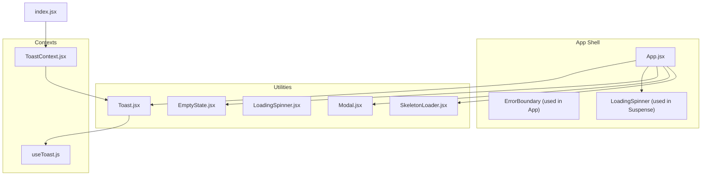
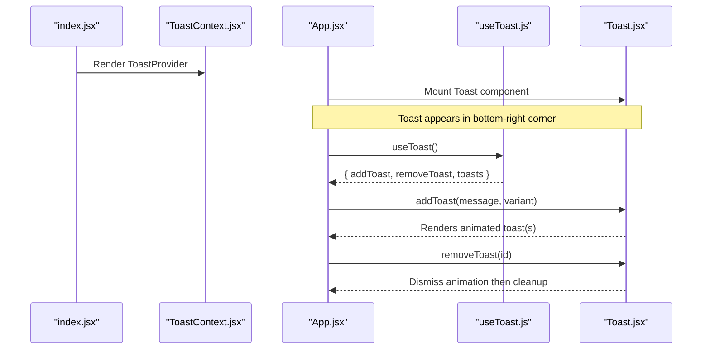
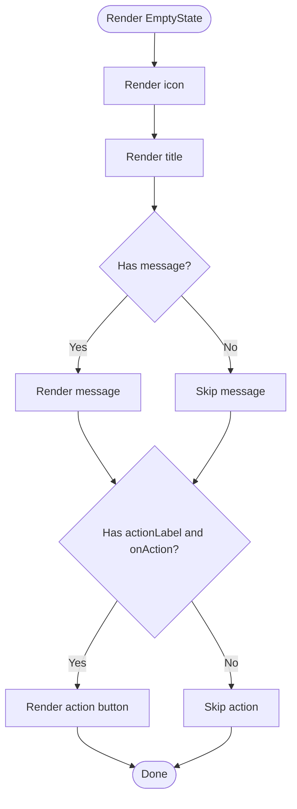
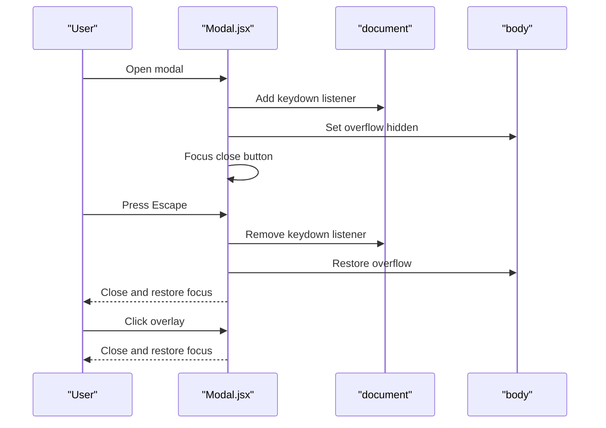
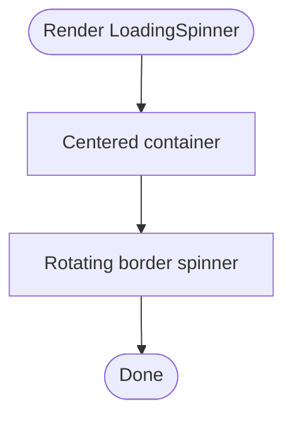
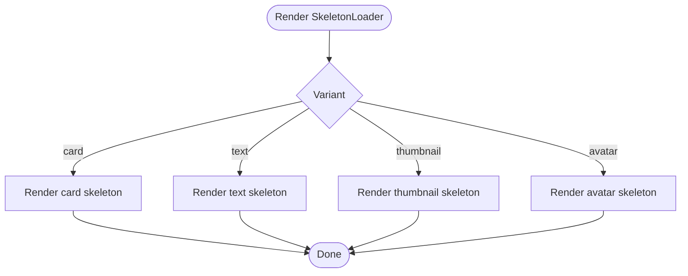
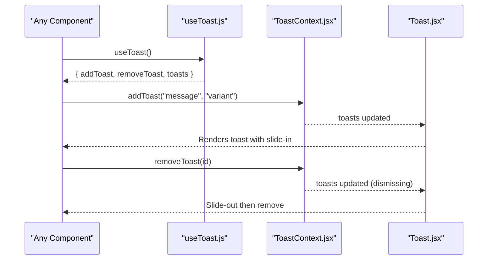
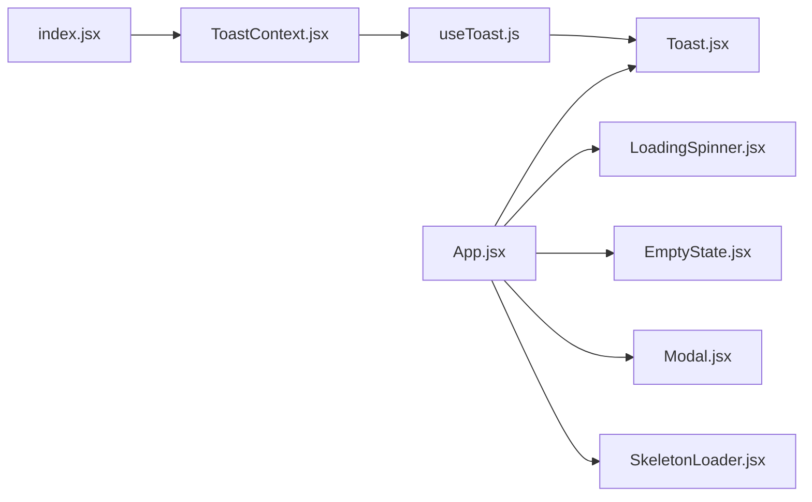

# Utility Components

<cite>
**Referenced Files in This Document**
- [EmptyState.jsx](file://src/components/EmptyState.jsx)
- [EmptyState.module.css](file://src/components/EmptyState.module.css)
- [Modal.jsx](file://src/components/Modal.jsx)
- [Modal.module.css](file://src/components/Modal.module.css)
- [LoadingSpinner.jsx](file://src/components/LoadingSpinner.jsx)
- [LoadingSpinner.module.css](file://src/components/LoadingSpinner.module.css)
- [SkeletonLoader.jsx](file://src/components/SkeletonLoader.jsx)
- [SkeletonLoader.module.css](file://src/components/SkeletonLoader.module.css)
- [Toast.jsx](file://src/components/Toast.jsx)
- [Toast.module.css](file://src/components/Toast.module.css)
- [useToast.js](file://src/hooks/useToast.js)
- [ToastContext.jsx](file://src/contexts/ToastContext.jsx)
- [App.jsx](file://src/App.jsx)
- [index.jsx](file://src/index.jsx)
</cite>

## Table of Contents
1. [Introduction](#introduction)
2. [Project Structure](#project-structure)
3. [Core Components](#core-components)
4. [Architecture Overview](#architecture-overview)
5. [Detailed Component Analysis](#detailed-component-analysis)
6. [Dependency Analysis](#dependency-analysis)
7. [Performance Considerations](#performance-considerations)
8. [Troubleshooting Guide](#troubleshooting-guide)
9. [Conclusion](#conclusion)

## Introduction
This document explains the utility components that enhance user experience during common UI interactions: EmptyState, Modal, LoadingSpinner, SkeletonLoader, and Toast. It covers purpose, usage scenarios, integration patterns, accessibility, animations, and responsive behavior. These components work together to provide clear feedback, graceful loading states, and unobtrusive notifications.

## Project Structure
These components live under src/components and are styled via dedicated CSS modules. Toast integrates with a provider pattern via React Context and is mounted at the app root. Modal is self-contained and manages focus and overlay behavior internally.

**Diagram sources**
- [App.jsx:1-51](file://src/App.jsx#L1-L51)
- [index.jsx:1-27](file://src/index.jsx#L1-L27)
- [ToastContext.jsx:1-53](file://src/contexts/ToastContext.jsx#L1-L53)
- [useToast.js:1-11](file://src/hooks/useToast.js#L1-L11)
- [Toast.jsx:1-32](file://src/components/Toast.jsx#L1-L32)
- [EmptyState.jsx:1-18](file://src/components/EmptyState.jsx#L1-L18)
- [Modal.jsx:1-92](file://src/components/Modal.jsx#L1-L92)
- [LoadingSpinner.jsx:1-11](file://src/components/LoadingSpinner.jsx#L1-L11)
- [SkeletonLoader.jsx:1-32](file://src/components/SkeletonLoader.jsx#L1-L32)

**Section sources**
- [App.jsx:1-51](file://src/App.jsx#L1-L51)
- [index.jsx:1-27](file://src/index.jsx#L1-L27)

## Core Components
- EmptyState: Presents a friendly, actionable message when a list or view is empty. Supports an optional action button.
- Modal: A dialog overlay that traps focus, supports Escape-to-close, Tab wrapping, and overlay dismissal. Announces itself as a dialog with accessible labeling.
- LoadingSpinner: A centered spinner used during short waits or route lazy-loading.
- SkeletonLoader: A shimmer-based placeholder for cards, text, thumbnails, and avatars to communicate loading while preserving layout.
- Toast: A persistent notification area that animates messages in and out, supports dismiss controls, and variant styling for different semantic meanings.

**Section sources**
- [EmptyState.jsx:1-18](file://src/components/EmptyState.jsx#L1-L18)
- [Modal.jsx:1-92](file://src/components/Modal.jsx#L1-L92)
- [LoadingSpinner.jsx:1-11](file://src/components/LoadingSpinner.jsx#L1-L11)
- [SkeletonLoader.jsx:1-32](file://src/components/SkeletonLoader.jsx#L1-L32)
- [Toast.jsx:1-32](file://src/components/Toast.jsx#L1-L32)

## Architecture Overview
The Toast system relies on a provider pattern. The app mounts a provider at the root, enabling any component to trigger toasts. The Toast component renders all queued toasts and handles dismissal with animations. Modal is a standalone component that manages focus and overlay behavior internally. EmptyState, LoadingSpinner, and SkeletonLoader are presentational utilities styled with CSS modules.

**Diagram sources**
- [index.jsx:1-27](file://src/index.jsx#L1-L27)
- [ToastContext.jsx:1-53](file://src/contexts/ToastContext.jsx#L1-L53)
- [useToast.js:1-11](file://src/hooks/useToast.js#L1-L11)
- [Toast.jsx:1-32](file://src/components/Toast.jsx#L1-L32)
- [App.jsx:1-51](file://src/App.jsx#L1-L51)

## Detailed Component Analysis

### EmptyState
- Purpose: Communicate emptiness and offer a clear next action.
- Props:
  - icon: Optional emoji or icon string (default presentational).
  - title: Required heading text.
  - message: Optional explanatory paragraph.
  - actionLabel: Optional label for the action button.
  - onAction: Optional callback invoked on action click.
- Usage scenarios:
  - Empty search results.
  - No items in a user’s collection.
  - Empty filters applied.
- Accessibility: No ARIA roles required; rely on semantic HTML and clear text.
- Styling and responsiveness: Centered layout with spacing tokens; action button hover effects and shadow glow.

**Diagram sources**
- [EmptyState.jsx:4-16](file://src/components/EmptyState.jsx#L4-L16)

**Section sources**
- [EmptyState.jsx:1-18](file://src/components/EmptyState.jsx#L1-L18)
- [EmptyState.module.css:1-44](file://src/components/EmptyState.module.css#L1-L44)

### Modal
- Purpose: Present focused content in a dialog with overlay behavior.
- Overlay behavior:
  - Clicking the overlay triggers close.
  - Body scroll is disabled while open.
  - Focus shifts into the modal and returns to the previous element on close.
- Keyboard navigation:
  - Escape closes the modal.
  - Tab cycles focus within the modal; Shift+Tab loops from first to last focusable element and vice versa.
- Accessibility:
  - Role dialog with aria-modal set.
  - Title is labeled via aria-labelledby.
  - Close button has aria-label.
- Styling and animations:
  - Overlay uses backdrop-filter blur and fade-in.
  - Modal slides up on open.
  - Responsive max-height and padding.

**Diagram sources**
- [Modal.jsx:8-55](file://src/components/Modal.jsx#L8-L55)

**Section sources**
- [Modal.jsx:1-92](file://src/components/Modal.jsx#L1-L92)
- [Modal.module.css:1-79](file://src/components/Modal.module.css#L1-L79)

### LoadingSpinner
- Purpose: Provide immediate feedback during short delays or route lazy-loading.
- Usage scenarios:
  - Suspense fallback during route transitions.
  - Short operations where a full skeleton would feel heavy.
- Styling and animations:
  - Centered container with padding tokens.
  - Rotating border animation with a top accent color.
- Responsiveness: Inherits layout from parent; centered within its container.

**Diagram sources**
- [LoadingSpinner.jsx:4-9](file://src/components/LoadingSpinner.jsx#L4-L9)

**Section sources**
- [LoadingSpinner.jsx:1-11](file://src/components/LoadingSpinner.jsx#L1-L11)
- [LoadingSpinner.module.css:1-22](file://src/components/LoadingSpinner.module.css#L1-L22)

### SkeletonLoader
- Purpose: Show placeholders with a shimmer effect to communicate loading while preserving layout.
- Variants:
  - card: Composite layout with image and text lines.
  - text: Single-line text placeholder.
  - thumbnail: Square placeholder.
  - avatar: Circular placeholder.
- Styling and animations:
  - Gradient background with moving shimmer animation.
  - Rounded corners via border-radius tokens.
  - Theme-aware light-mode overrides for contrast.
- Responsiveness: Width and height props allow flexible sizing; variants define intrinsic dimensions.

**Diagram sources**
- [SkeletonLoader.jsx:4-30](file://src/components/SkeletonLoader.jsx#L4-L30)

**Section sources**
- [SkeletonLoader.jsx:1-32](file://src/components/SkeletonLoader.jsx#L1-L32)
- [SkeletonLoader.module.css:1-110](file://src/components/SkeletonLoader.module.css#L1-L110)

### Toast
- Purpose: Notify users of outcomes (info, success, error) with dismiss controls and animations.
- Integration:
  - Mounted at the app root and wrapped by a provider in the application bootstrap.
  - Consumed via a hook that throws if used outside the provider.
- Behavior:
  - Automatically dismisses after a delay.
  - Supports manual dismissal per toast.
  - Limits concurrent toasts to a small number.
  - Uses directional animation and a “dismissing” state for exit.
- Accessibility:
  - Container uses aria-live polite to announce updates.
  - Dismiss button has aria-label.
- Styling and responsiveness:
  - Fixed bottom-right container with reverse stacking order.
  - Variants change accent border color.
  - Mobile-friendly adjustments for smaller screens.

**Diagram sources**
- [useToast.js:1-11](file://src/hooks/useToast.js#L1-L11)
- [ToastContext.jsx:27-40](file://src/contexts/ToastContext.jsx#L27-L40)
- [Toast.jsx:5-31](file://src/components/Toast.jsx#L5-L31)
- [Toast.module.css:1-99](file://src/components/Toast.module.css#L1-L99)

**Section sources**
- [Toast.jsx:1-32](file://src/components/Toast.jsx#L1-L32)
- [Toast.module.css:1-99](file://src/components/Toast.module.css#L1-L99)
- [useToast.js:1-11](file://src/hooks/useToast.js#L1-L11)
- [ToastContext.jsx:1-53](file://src/contexts/ToastContext.jsx#L1-L53)
- [index.jsx:1-27](file://src/index.jsx#L1-L27)
- [App.jsx:1-51](file://src/App.jsx#L1-L51)

## Dependency Analysis
- Toast depends on a provider context and a hook to access state and actions. The provider manages lifecycle timers and maintains a capped queue.
- Modal is self-contained and does not depend on external contexts; it manages focus and overlay behavior internally.
- EmptyState, LoadingSpinner, and SkeletonLoader are presentational and depend only on their CSS modules.
- App integrates Toast and LoadingSpinner into the routing shell.

**Diagram sources**
- [index.jsx:1-27](file://src/index.jsx#L1-L27)
- [ToastContext.jsx:1-53](file://src/contexts/ToastContext.jsx#L1-L53)
- [useToast.js:1-11](file://src/hooks/useToast.js#L1-L11)
- [Toast.jsx:1-32](file://src/components/Toast.jsx#L1-L32)
- [App.jsx:1-51](file://src/App.jsx#L1-L51)
- [LoadingSpinner.jsx:1-11](file://src/components/LoadingSpinner.jsx#L1-L11)
- [EmptyState.jsx:1-18](file://src/components/EmptyState.jsx#L1-L18)
- [Modal.jsx:1-92](file://src/components/Modal.jsx#L1-L92)
- [SkeletonLoader.jsx:1-32](file://src/components/SkeletonLoader.jsx#L1-L32)

**Section sources**
- [index.jsx:1-27](file://src/index.jsx#L1-L27)
- [ToastContext.jsx:1-53](file://src/contexts/ToastContext.jsx#L1-L53)
- [useToast.js:1-11](file://src/hooks/useToast.js#L1-L11)
- [Toast.jsx:1-32](file://src/components/Toast.jsx#L1-L32)
- [App.jsx:1-51](file://src/App.jsx#L1-L51)

## Performance Considerations
- Toast provider uses memoized context value and cleans up timers on unmount to avoid leaks.
- Modal disables body scroll and restores focus efficiently; focus trapping uses a selector query on open and cleanup.
- SkeletonLoader leverages CSS animations and gradients for smooth shimmer without JavaScript.
- LoadingSpinner uses a simple rotating border animation optimized for GPU acceleration.

[No sources needed since this section provides general guidance]

## Troubleshooting Guide
- Toast not rendering:
  - Ensure the provider wraps the app root. The hook throws if used outside the provider.
- Toast not dismissing:
  - Verify the remove action is called and that the internal timeout clears properly.
- Modal not closing on Escape:
  - Confirm the keydown listener is attached and not removed prematurely.
- Modal focus issues:
  - Ensure focusable elements exist inside the modal; Tab wrapping requires at least one focusable element.
- Overlay click not closing:
  - Ensure the overlay click handler receives the current target and invokes close.

**Section sources**
- [useToast.js:4-10](file://src/hooks/useToast.js#L4-L10)
- [ToastContext.jsx:9-25](file://src/contexts/ToastContext.jsx#L9-L25)
- [Modal.jsx:16-55](file://src/components/Modal.jsx#L16-L55)
- [Modal.jsx:57-59](file://src/components/Modal.jsx#L57-L59)

## Conclusion
These utility components collectively improve perceived performance, accessibility, and clarity:
- EmptyState communicates emptiness and invites action.
- Modal ensures focused, accessible dialogs with robust keyboard and overlay handling.
- LoadingSpinner and SkeletonLoader reduce perceived latency and maintain layout continuity.
- Toast delivers timely, dismissible feedback with thoughtful animations and responsive behavior.