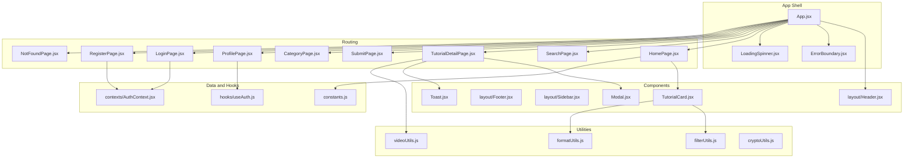

# Contributing Guidelines

<cite>
**Referenced Files in This Document**
- [README.md](file://README.md)
- [package.json](file://package.json)
- [vite.config.js](file://vite.config.js)
- [src/setupTests.js](file://src/setupTests.js)
- [src/App.jsx](file://src/App.jsx)
- [src/components/TutorialCard.jsx](file://src/components/TutorialCard.jsx)
- [src/components/layout/Header.jsx](file://src/components/layout/Header.jsx)
- [src/pages/HomePage.jsx](file://src/pages/HomePage.jsx)
- [src/data/constants.js](file://src/data/constants.js)
- [src/utils/filterUtils.js](file://src/utils/filterUtils.js)
- [src/utils/formatUtils.js](file://src/utils/formatUtils.js)
- [src/utils/videoUtils.js](file://src/utils/videoUtils.js)
- [src/utils/cryptoUtils.js](file://src/utils/cryptoUtils.js)
- [src/hooks/useAuth.js](file://src/hooks/useAuth.js)
- [src/contexts/AuthContext.jsx](file://src/contexts/AuthContext.jsx)
- [src/utils/__tests__/filterUtils.test.js](file://src/utils/__tests__/filterUtils.test.js)
</cite>

## Table of Contents
1. [Introduction](#introduction)
2. [Project Structure](#project-structure)
3. [Development Setup](#development-setup)
4. [Code Style Guidelines](#code-style-guidelines)
5. [Testing Requirements](#testing-requirements)
6. [Pull Request Process](#pull-request-process)
7. [Project Structure Conventions](#project-structure-conventions)
8. [Code Review Guidelines](#code-review-guidelines)
9. [Performance Considerations](#performance-considerations)
10. [Accessibility Requirements](#accessibility-requirements)
11. [Issue Reporting and Workflows](#issue-reporting-and-workflows)
12. [Documentation Updates](#documentation-updates)
13. [Security Considerations](#security-considerations)
14. [Release Process and Versioning](#release-process-and-versioning)
15. [Community Guidelines and Recognition](#community-guidelines-and-recognition)
16. [Troubleshooting Guide](#troubleshooting-guide)
17. [Conclusion](#conclusion)

## Introduction
Thank you for contributing to GameDev Hub. This document provides a comprehensive guide to setting up the development environment, writing code that fits the project’s style, testing your changes, and following the contribution workflow. It also covers performance, accessibility, security, and release practices to help maintain a high-quality, inclusive, and secure application.

## Project Structure
GameDev Hub follows a feature-oriented structure under src/, organized into layers that separate concerns:
- data: Constants and mock datasets used across the app
- contexts: React Context providers for global state (authentication, tutorials, toasts)
- hooks: Reusable hooks for authentication, tutorials, storage, debouncing, and toast notifications
- utils: Pure functions and utilities with unit tests
- components: Reusable UI components, including layout pieces
- pages: Route-level pages with lazy loading and code splitting
- App.jsx and routing: Central routing and error boundary integration

**Diagram sources**
- [src/App.jsx:1-51](file://src/App.jsx#L1-L51)
- [src/components/layout/Header.jsx:1-116](file://src/components/layout/Header.jsx#L1-L116)
- [src/pages/HomePage.jsx:1-95](file://src/pages/HomePage.jsx#L1-L95)
- [src/components/TutorialCard.jsx:1-110](file://src/components/TutorialCard.jsx#L1-L110)
- [src/utils/filterUtils.js:1-99](file://src/utils/filterUtils.js#L1-L99)
- [src/utils/formatUtils.js:1-45](file://src/utils/formatUtils.js#L1-L45)
- [src/utils/videoUtils.js:1-119](file://src/utils/videoUtils.js#L1-L119)
- [src/utils/cryptoUtils.js:1-70](file://src/utils/cryptoUtils.js#L1-L70)
- [src/data/constants.js:1-71](file://src/data/constants.js#L1-L71)
- [src/hooks/useAuth.js:1-11](file://src/hooks/useAuth.js#L1-L11)
- [src/contexts/AuthContext.jsx:1-105](file://src/contexts/AuthContext.jsx#L1-L105)

**Section sources**
- [README.md:79-128](file://README.md#L79-L128)
- [src/App.jsx:13-19](file://src/App.jsx#L13-L19)

## Development Setup
- Prerequisites
  - Node.js and npm installed on your machine
- Install dependencies
  - Run the standard install script to fetch all runtime and development dependencies
- Start the development server
  - Launch Vite with hot module replacement and automatic browser opening
- Run tests
  - Execute unit tests using Vitest with the jsdom environment configured
- Build for production
  - Generate optimized static assets for deployment

Environment configuration highlights:
- Vite server runs on port 3000 and opens automatically
- Test environment uses jsdom and initializes jest-dom for DOM assertions
- Scripts for dev, build, preview, test, and start are defined in package.json

**Section sources**
- [README.md:81-95](file://README.md#L81-L95)
- [package.json:15-21](file://package.json#L15-L21)
- [vite.config.js:4-18](file://vite.config.js#L4-L18)
- [src/setupTests.js:1-3](file://src/setupTests.js#L1-L3)

## Code Style Guidelines
- ESLint configuration
  - Extends recommended rules plus React and React Hooks plugin configurations
- React component conventions
  - Prefer functional components with hooks
  - Use PropTypes for runtime prop validation where applicable
  - Keep components small, focused, and reusable
  - Use CSS Modules for component styling and avoid global styles
- Styling
  - Component styles live alongside components in .module.css files
  - Central theme tokens and CSS custom properties are supported
- Accessibility
  - Ensure keyboard navigation and ARIA attributes are present on interactive elements
  - Provide meaningful aria-labels and roles for controls and modals
- Performance
  - Use lazy loading for route-level components and Suspense boundaries
  - Avoid unnecessary re-renders; leverage memoization and context selectors
- Security
  - Sanitize external URLs and embeds to prevent XSS
  - Hash sensitive data using PBKDF2 with per-user salts

**Section sources**
- [package.json:22-28](file://package.json#L22-L28)
- [src/components/TutorialCard.jsx:107-110](file://src/components/TutorialCard.jsx#L107-L110)
- [src/App.jsx:27-41](file://src/App.jsx#L27-L41)
- [src/utils/videoUtils.js:50-60](file://src/utils/videoUtils.js#L50-L60)
- [src/utils/cryptoUtils.js:1-70](file://src/utils/cryptoUtils.js#L1-L70)

## Testing Requirements
- Test framework
  - Vitest with jsdom environment
  - Global setup includes jest-dom matchers
- Unit tests
  - Located under src/utils/__tests__/
  - Cover utility functions for filtering, formatting, and video parsing/sanitization
  - Example: filter utilities tests assert correctness of filtering, sorting, and duration bounds
- Coverage targets
  - Aim for high coverage across utilities and critical UI logic
- Best practices
  - Write focused tests with clear assertions
  - Use realistic mock data mirroring the shape of real data
  - Test both success and failure paths
  - Use beforeEach/afterEach to reset state when needed

**Section sources**
- [vite.config.js:10-14](file://vite.config.js#L10-L14)
- [src/setupTests.js:1-3](file://src/setupTests.js#L1-L3)
- [src/utils/__tests__/filterUtils.test.js:1-253](file://src/utils/__tests__/filterUtils.test.js#L1-L253)

## Pull Request Process
- Branch naming conventions
  - Use descriptive, hyphen-separated names (e.g., feature/add-search-filters, fix/auth-login-flow)
- Commit message standards
  - Use imperative mood with concise summaries
  - Reference related issues or PRs when applicable
- Review procedures
  - Ensure tests pass locally before opening a PR
  - Include screenshots or short demos for UI changes
  - Request review from maintainers; address feedback promptly
- Checklist
  - New features include unit tests
  - Accessibility reviewed for new interactive elements
  - Performance impact assessed for heavy computations or network calls
  - Security implications considered for data handling and sanitization

[No sources needed since this section provides general guidance]

## Project Structure Conventions
- Add new components under src/components/ or src/components/<area>/ as appropriate
- Place route-level pages under src/pages/
- Put shared utilities under src/utils/ with corresponding unit tests
- Add new constants or enums under src/data/
- Extend hooks under src/hooks/ and wrap providers under src/contexts/
- Keep styling scoped via CSS Modules

**Section sources**
- [README.md:97-128](file://README.md#L97-L128)

## Code Review Guidelines
- Readability and maintainability
  - Prefer clear, self-documenting code and comments where necessary
- Testing
  - Verify that new logic is covered by unit tests
- Accessibility
  - Confirm focus management, ARIA roles, and keyboard navigation
- Performance
  - Avoid blocking operations on the main thread
  - Minimize re-renders and unnecessary effect calls
- Security
  - Validate and sanitize inputs; avoid exposing secrets
- Documentation
  - Update inline docs and README sections affected by changes

[No sources needed since this section provides general guidance]

## Performance Considerations
- Lazy load route-level components and wrap with Suspense
- Use skeleton loaders and lazy image loading to improve perceived performance
- Debounce expensive operations (e.g., search queries)
- Monitor Core Web Vitals and optimize LCP, FID, and CLS
- Avoid heavy synchronous computations in render paths

**Section sources**
- [src/App.jsx:13-19](file://src/App.jsx#L13-L19)
- [README.md:34-40](file://README.md#L34-L40)

## Accessibility Requirements
- Ensure focus visibility and predictable keyboard navigation
- Use ARIA roles and labels for interactive elements
- Manage focus traps in modals and overlays
- Provide accessible names for icons and buttons
- Test with assistive technologies and automated tools

**Section sources**
- [README.md:53-57](file://README.md#L53-L57)
- [src/components/TutorialCard.jsx:39-104](file://src/components/TutorialCard.jsx#L39-L104)

## Issue Reporting and Workflows
- Bug reports
  - Include steps to reproduce, expected vs. actual behavior, environment details, and screenshots
- Feature requests
  - Describe the problem being solved and proposed solution
- Pull requests
  - Link to the related issue
  - Provide testing evidence and documentation updates

[No sources needed since this section provides general guidance]

## Documentation Updates
- Update README.md for new features or configuration changes
- Add inline code comments for complex logic
- Keep component and utility documentation aligned with behavior

**Section sources**
- [README.md:1-144](file://README.md#L1-L144)

## Security Considerations
- Password hashing
  - PBKDF2 with per-user salt; legacy hashes are migrated on login
- URL sanitization
  - Allow only http/https protocols for external links and embeds
- Error handling
  - Centralized error boundary to prevent app crashes
- Error tracking
  - Sentry integration for monitoring and session replay

**Section sources**
- [src/utils/cryptoUtils.js:1-70](file://src/utils/cryptoUtils.js#L1-L70)
- [src/utils/videoUtils.js:50-60](file://src/utils/videoUtils.js#L50-L60)
- [src/App.jsx:27-41](file://src/App.jsx#L27-L41)
- [README.md:42-46](file://README.md#L42-L46)

## Release Process and Versioning
- Versioning
  - Semantic versioning (major.minor.patch)
- Changelog maintenance
  - Summarize breaking changes, new features, fixes, and performance improvements
- Pre-release checks
  - Ensure tests pass, lint free, and no critical accessibility or security issues
- Publishing
  - Build production assets and deploy to hosting provider

[No sources needed since this section provides general guidance]

## Community Guidelines and Recognition
- Be respectful and inclusive in discussions
- Provide constructive feedback during reviews
- Acknowledge contributors in release notes and README where appropriate

[No sources needed since this section provides general guidance]

## Troubleshooting Guide
- Development server not starting
  - Verify Node.js and npm versions; reinstall dependencies if needed
- Tests failing
  - Run tests locally with Vitest; inspect console logs and assertion messages
- Build errors
  - Clear node_modules and lockfile, then reinstall; check for missing environment variables
- Access denied or login issues
  - Confirm AuthContext is wrapped around the app and local storage is enabled

**Section sources**
- [vite.config.js:4-18](file://vite.config.js#L4-L18)
- [src/App.jsx:21-47](file://src/App.jsx#L21-L47)
- [src/contexts/AuthContext.jsx:13-104](file://src/contexts/AuthContext.jsx#L13-L104)

## Conclusion
By following these guidelines, contributors can help keep GameDev Hub reliable, accessible, secure, and easy to maintain. Thank you for helping improve the project!