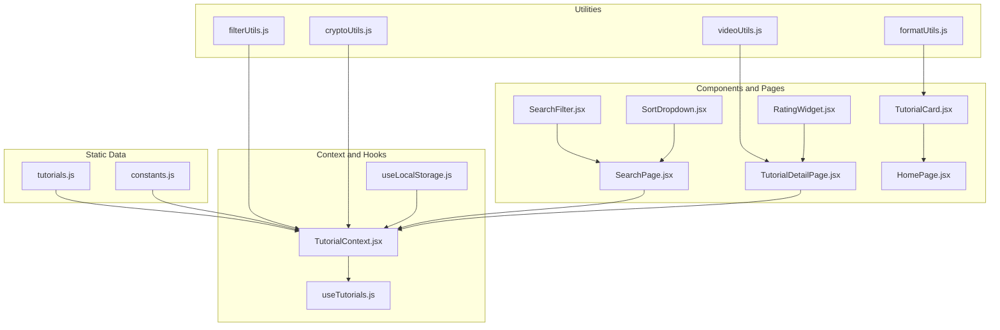
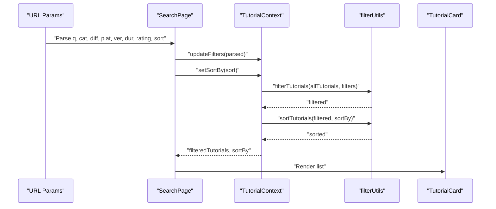
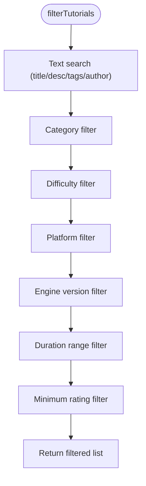
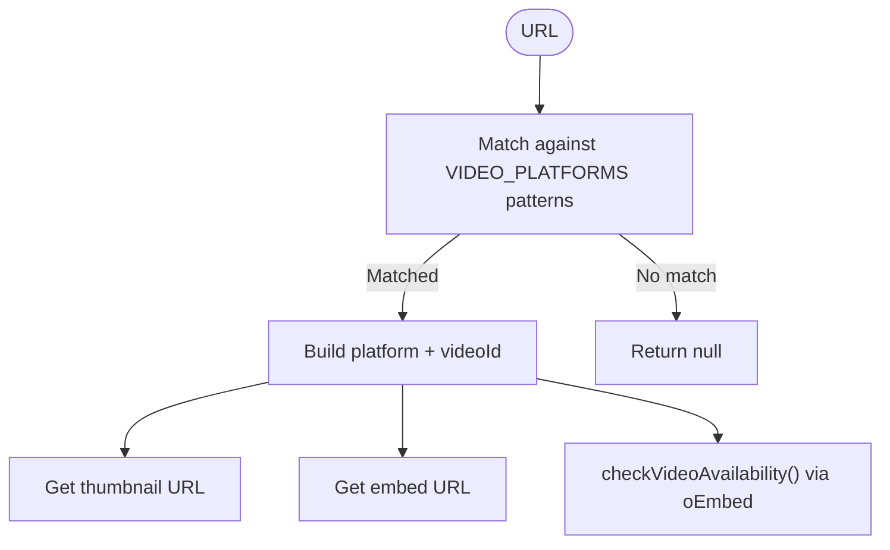
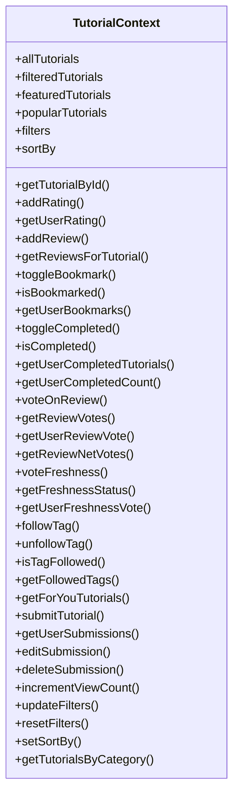
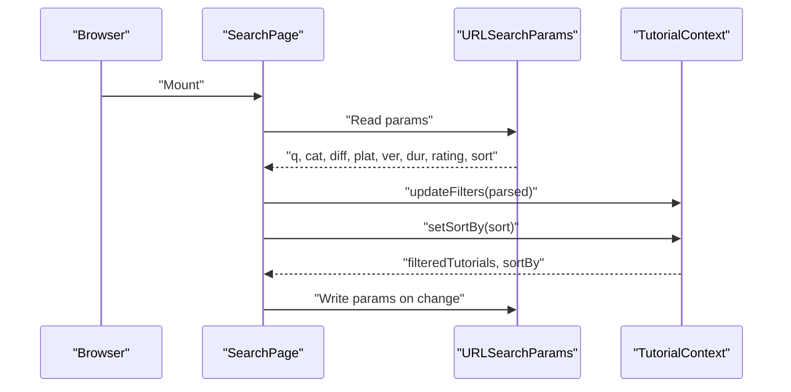
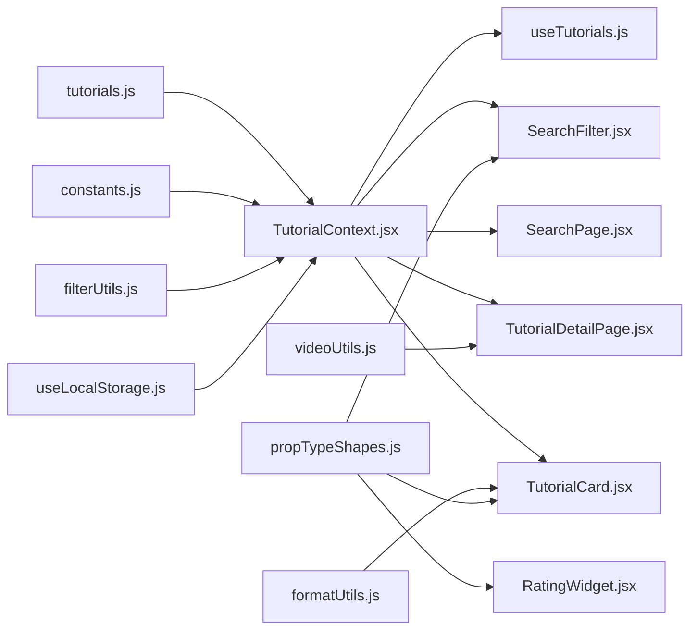

# Data Management

<cite>
**Referenced Files in This Document**
- [tutorials.js](file://src/data/tutorials.js)
- [constants.js](file://src/data/constants.js)
- [filterUtils.js](file://src/utils/filterUtils.js)
- [formatUtils.js](file://src/utils/formatUtils.js)
- [videoUtils.js](file://src/utils/videoUtils.js)
- [cryptoUtils.js](file://src/utils/cryptoUtils.js)
- [TutorialContext.jsx](file://src/contexts/TutorialContext.jsx)
- [useTutorials.js](file://src/hooks/useTutorials.js)
- [propTypeShapes.js](file://src/utils/propTypeShapes.js)
- [SearchFilter.jsx](file://src/components/SearchFilter.jsx)
- [SearchPage.jsx](file://src/pages/SearchPage.jsx)
- [TutorialCard.jsx](file://src/components/TutorialCard.jsx)
- [TutorialDetailPage.jsx](file://src/pages/TutorialDetailPage.jsx)
- [SortDropdown.jsx](file://src/components/SortDropdown.jsx)
- [useLocalStorage.js](file://src/hooks/useLocalStorage.js)
- [RatingWidget.jsx](file://src/components/RatingWidget.jsx)
- [HomePage.jsx](file://src/pages/HomePage.jsx)
</cite>

## Table of Contents
1. [Introduction](#introduction)
2. [Project Structure](#project-structure)
3. [Core Components](#core-components)
4. [Architecture Overview](#architecture-overview)
5. [Detailed Component Analysis](#detailed-component-analysis)
6. [Dependency Analysis](#dependency-analysis)
7. [Performance Considerations](#performance-considerations)
8. [Troubleshooting Guide](#troubleshooting-guide)
9. [Conclusion](#conclusion)
10. [Appendices](#appendices)

## Introduction
This document explains GameDev Hub’s data management system. It covers the tutorial dataset structure, static configuration, filtering and sorting utilities, display formatting, video processing, authentication-related cryptography, and the end-to-end data flow from static datasets through context providers to UI components. It also documents URL-synced filter state, localStorage-backed user preferences, validation patterns, persistence strategies for user-generated content, migration considerations for legacy credentials, and performance guidance for large datasets.

## Project Structure
The data management system centers around:
- Static datasets: tutorial catalog and constants
- Utilities: filtering, formatting, video validation, and cryptography
- Context provider: orchestrates data merging, user state, and persistence
- Hooks and components: consume context, render UI, and manage user interactions
- Pages: integrate URL sync, filters, and sorting

**Diagram sources**
- [tutorials.js:1-522](file://src/data/tutorials.js#L1-L522)
- [constants.js:1-71](file://src/data/constants.js#L1-L71)
- [filterUtils.js:1-99](file://src/utils/filterUtils.js#L1-L99)
- [formatUtils.js:1-45](file://src/utils/formatUtils.js#L1-L45)
- [videoUtils.js:1-119](file://src/utils/videoUtils.js#L1-L119)
- [cryptoUtils.js:1-70](file://src/utils/cryptoUtils.js#L1-L70)
- [TutorialContext.jsx:1-542](file://src/contexts/TutorialContext.jsx#L1-L542)
- [useTutorials.js:1-11](file://src/hooks/useTutorials.js#L1-L11)
- [useLocalStorage.js:1-29](file://src/hooks/useLocalStorage.js#L1-L29)
- [SearchFilter.jsx:1-237](file://src/components/SearchFilter.jsx#L1-L237)
- [SearchPage.jsx:1-141](file://src/pages/SearchPage.jsx#L1-L141)
- [TutorialDetailPage.jsx:1-296](file://src/pages/TutorialDetailPage.jsx#L1-L296)
- [TutorialCard.jsx:1-110](file://src/components/TutorialCard.jsx#L1-L110)
- [SortDropdown.jsx:1-29](file://src/components/SortDropdown.jsx#L1-L29)
- [RatingWidget.jsx:1-84](file://src/components/RatingWidget.jsx#L1-L84)
- [HomePage.jsx:1-95](file://src/pages/HomePage.jsx#L1-L95)

**Section sources**
- [tutorials.js:1-522](file://src/data/tutorials.js#L1-L522)
- [constants.js:1-71](file://src/data/constants.js#L1-L71)
- [TutorialContext.jsx:1-542](file://src/contexts/TutorialContext.jsx#L1-L542)

## Core Components
- Tutorial dataset: 25 curated tutorials spanning categories (2D, 3D, Programming, Art, Audio, Game Design), difficulty levels, platforms, engine versions, tags, and metadata such as author, timestamps, view counts, and ratings.
- Constants: categories, difficulties, platforms, series, engine versions, sort options, and duration ranges.
- Filtering and sorting: reusable utilities to filter by text, category, difficulty, platform, engine version, duration range, and minimum rating; and to sort by newest, popularity, highest rated, or most viewed.
- Formatting: helpers for duration, view counts, dates, ratings, and text truncation.
- Video utilities: URL extraction, thumbnail resolution, embed URLs, validation via oEmbed, sanitization, and platform detection.
- Cryptography: PBKDF2-based password hashing and verification with constant-time comparison and legacy hash detection.
- Context provider: merges static tutorials with approved submissions, overlays user state (ratings, reviews, bookmarks, submissions, view logs), exposes CRUD-like APIs, and persists state to localStorage.
- Validation shapes: PropTypes for tutorial and filter structures to enforce shape expectations at runtime.

**Section sources**
- [tutorials.js:1-522](file://src/data/tutorials.js#L1-L522)
- [constants.js:1-71](file://src/data/constants.js#L1-L71)
- [filterUtils.js:1-99](file://src/utils/filterUtils.js#L1-L99)
- [formatUtils.js:1-45](file://src/utils/formatUtils.js#L1-L45)
- [videoUtils.js:1-119](file://src/utils/videoUtils.js#L1-L119)
- [cryptoUtils.js:1-70](file://src/utils/cryptoUtils.js#L1-L70)
- [TutorialContext.jsx:1-542](file://src/contexts/TutorialContext.jsx#L1-L542)
- [propTypeShapes.js:1-37](file://src/utils/propTypeShapes.js#L1-L37)

## Architecture Overview
The system follows a unidirectional data flow:
- Static datasets are loaded once and merged with user-submitted content.
- User actions update localStorage-backed state via the context provider.
- Components subscribe to context via a typed hook and render filtered/sorted results.
- URL parameters mirror filter and sort state for shareable links.

**Diagram sources**
- [SearchPage.jsx:25-81](file://src/pages/SearchPage.jsx#L25-L81)
- [TutorialContext.jsx:68-71](file://src/contexts/TutorialContext.jsx#L68-L71)
- [filterUtils.js:1-99](file://src/utils/filterUtils.js#L1-L99)
- [TutorialCard.jsx:1-110](file://src/components/TutorialCard.jsx#L1-L110)

## Detailed Component Analysis

### Tutorial Dataset and Metadata
- Structure: Each tutorial includes identifiers, title, description, video URL and normalized fields, category, difficulty, platform, engine version, tags, estimated duration, optional series linkage, author, timestamps, metrics (view count, average rating, rating count), and flags (featured).
- Prerequisites: Some tutorials reference prior tutorials by ID, enabling prerequisite navigation and series ordering.
- Coverage: The dataset spans six categories and three difficulty levels, with representative entries for each combination.

**Section sources**
- [tutorials.js:1-522](file://src/data/tutorials.js#L1-L522)

### Static Configuration (Constants)
- Categories, difficulties, platforms, series, engine versions, sort options, and duration ranges define UI controls and filter semantics.
- Duration ranges map to inclusive bounds for quick filtering.

**Section sources**
- [constants.js:1-71](file://src/data/constants.js#L1-L71)

### Data Transformation Utilities

#### filterUtils
- Filtering supports:
  - Full-text search across title, description, tags, and author name
  - Multi-select filters for categories, difficulties, platforms, and engine versions
  - Duration range selection using predefined bounds
  - Minimum rating threshold
- Sorting supports four modes: newest, popular, highest-rated, most-viewed.
- Active filter count helper computes the number of applied filters for UI feedback.

**Diagram sources**
- [filterUtils.js:1-99](file://src/utils/filterUtils.js#L1-L99)

**Section sources**
- [filterUtils.js:1-99](file://src/utils/filterUtils.js#L1-L99)

#### formatUtils
- Formats durations into human-friendly strings (e.g., minutes to hours/minutes).
- Formats view counts with K/M suffixes.
- Computes relative dates (today/yesterday/days/weeks/months/years ago).
- Rounds ratings to one decimal place.
- Truncates text safely to a maximum length.

**Section sources**
- [formatUtils.js:1-45](file://src/utils/formatUtils.js#L1-L45)

#### videoUtils
- Extracts platform and video ID from supported URL patterns (YouTube, Vimeo).
- Produces thumbnail and embed URLs for supported platforms.
- Validates video availability using oEmbed endpoints with fallbacks for CORS/no-cors scenarios.
- Sanitizes external URLs to safe protocols.

**Diagram sources**
- [videoUtils.js:1-119](file://src/utils/videoUtils.js#L1-L119)
- [constants.js:55-71](file://src/data/constants.js#L55-L71)

**Section sources**
- [videoUtils.js:1-119](file://src/utils/videoUtils.js#L1-L119)
- [constants.js:55-71](file://src/data/constants.js#L55-L71)

#### cryptoUtils
- Generates random salts and derives PBKDF2 hashes with SHA-256.
- Provides constant-time password verification and detects legacy non-PBKDF2 hashes.

**Section sources**
- [cryptoUtils.js:1-70](file://src/utils/cryptoUtils.js#L1-L70)

### Context Provider and Data Flow
- Merges default tutorials with approved submissions and overlays user-specific metrics (ratings, views).
- Exposes memoized computed lists (featured, popular) and lookup helpers.
- Manages user-generated content: ratings, reviews, bookmarks, submissions, completion tracking, review voting, freshness voting, followed tags, and “For You” recommendations.
- Persists all user state to localStorage via a custom hook.

**Diagram sources**
- [TutorialContext.jsx:1-542](file://src/contexts/TutorialContext.jsx#L1-L542)

**Section sources**
- [TutorialContext.jsx:1-542](file://src/contexts/TutorialContext.jsx#L1-L542)
- [useLocalStorage.js:1-29](file://src/hooks/useLocalStorage.js#L1-L29)

### URL-Synced Filter State and LocalStorage Integration
- SearchPage reads URL parameters on mount and applies them to context filters and sort order.
- On subsequent changes, it writes filters and sort back to URL parameters using URLSearchParams.
- LocalStorage keys persist user preferences (filters, sort, ratings, reviews, bookmarks, submissions, view log, completion, review votes, freshness votes, followed tags) via a resilient hook.

**Diagram sources**
- [SearchPage.jsx:25-81](file://src/pages/SearchPage.jsx#L25-L81)
- [TutorialContext.jsx:24-25](file://src/contexts/TutorialContext.jsx#L24-L25)
- [useLocalStorage.js:1-29](file://src/hooks/useLocalStorage.js#L1-L29)

**Section sources**
- [SearchPage.jsx:1-141](file://src/pages/SearchPage.jsx#L1-L141)
- [SearchFilter.jsx:1-237](file://src/components/SearchFilter.jsx#L1-L237)
- [SortDropdown.jsx:1-29](file://src/components/SortDropdown.jsx#L1-L29)
- [TutorialContext.jsx:24-25](file://src/contexts/TutorialContext.jsx#L24-L25)

### Data Validation Patterns
- PropTypes define strict shapes for tutorial and filter objects, ensuring components receive expected data structures.
- Components validate incoming props and can fail fast if context is misused.

**Section sources**
- [propTypeShapes.js:1-37](file://src/utils/propTypeShapes.js#L1-L37)
- [TutorialCard.jsx:107-109](file://src/components/TutorialCard.jsx#L107-L109)
- [SearchFilter.jsx:232-236](file://src/components/SearchFilter.jsx#L232-L236)
- [RatingWidget.jsx:79-83](file://src/components/RatingWidget.jsx#L79-L83)

### Data Persistence Strategies for User-Generated Content
- Ratings: keyed by tutorial and user; recalculated into merged average and count.
- Reviews: persisted as a list with per-review votes.
- Bookmarks, completions, freshness votes, followed tags: keyed by user ID.
- Submissions: appended to a list with approval overlay.
- View logs: incremental per-tutorial counts merged into view totals.
- All user state is persisted to localStorage with safe parsing and error handling.

**Section sources**
- [TutorialContext.jsx:19-34](file://src/contexts/TutorialContext.jsx#L19-L34)
- [TutorialContext.jsx:37-65](file://src/contexts/TutorialContext.jsx#L37-L65)
- [useLocalStorage.js:1-29](file://src/hooks/useLocalStorage.js#L1-L29)

### Data Migration Patterns for Legacy Accounts
- Legacy hashes are detected by prefix; new PBKDF2 hashes are prefixed with a marker.
- Verification uses constant-time comparison to prevent timing attacks.
- Migration path: during login, detect legacy hash, re-hash with PBKDF2, and update storage atomically.

**Section sources**
- [cryptoUtils.js:67-70](file://src/utils/cryptoUtils.js#L67-L70)
- [cryptoUtils.js:50-65](file://src/utils/cryptoUtils.js#L50-L65)

### UI Integration and Rendering
- HomePage consumes featured, popular, and “For You” recommedations.
- SearchPage renders filters, chips, sort dropdown, and paginated galleries.
- TutorialDetailPage displays metadata, prerequisites, series navigation, ratings, reviews, and interactive widgets.
- TutorialCard renders thumbnails, durations, badges, and bookmark toggles.

**Section sources**
- [HomePage.jsx:1-95](file://src/pages/HomePage.jsx#L1-L95)
- [SearchPage.jsx:1-141](file://src/pages/SearchPage.jsx#L1-L141)
- [TutorialDetailPage.jsx:1-296](file://src/pages/TutorialDetailPage.jsx#L1-L296)
- [TutorialCard.jsx:1-110](file://src/components/TutorialCard.jsx#L1-L110)

## Dependency Analysis
- TutorialContext depends on:
  - Static datasets (tutorials.js, constants.js)
  - filterUtils for filtering and sorting
  - useLocalStorage for persistence
- Components depend on:
  - useTutorials for state and actions
  - formatUtils for display formatting
  - videoUtils for URL sanitization and validation
  - propTypeShapes for validation

**Diagram sources**
- [TutorialContext.jsx:1-542](file://src/contexts/TutorialContext.jsx#L1-L542)
- [SearchPage.jsx:1-141](file://src/pages/SearchPage.jsx#L1-L141)
- [TutorialDetailPage.jsx:1-296](file://src/pages/TutorialDetailPage.jsx#L1-L296)
- [TutorialCard.jsx:1-110](file://src/components/TutorialCard.jsx#L1-L110)
- [SearchFilter.jsx:1-237](file://src/components/SearchFilter.jsx#L1-L237)
- [RatingWidget.jsx:1-84](file://src/components/RatingWidget.jsx#L1-L84)
- [formatUtils.js:1-45](file://src/utils/formatUtils.js#L1-L45)
- [videoUtils.js:1-119](file://src/utils/videoUtils.js#L1-L119)
- [propTypeShapes.js:1-37](file://src/utils/propTypeShapes.js#L1-L37)

**Section sources**
- [TutorialContext.jsx:1-542](file://src/contexts/TutorialContext.jsx#L1-L542)
- [SearchPage.jsx:1-141](file://src/pages/SearchPage.jsx#L1-L141)
- [TutorialDetailPage.jsx:1-296](file://src/pages/TutorialDetailPage.jsx#L1-L296)
- [TutorialCard.jsx:1-110](file://src/components/TutorialCard.jsx#L1-L110)
- [SearchFilter.jsx:1-237](file://src/components/SearchFilter.jsx#L1-L237)
- [RatingWidget.jsx:1-84](file://src/components/RatingWidget.jsx#L1-L84)
- [formatUtils.js:1-45](file://src/utils/formatUtils.js#L1-L45)
- [videoUtils.js:1-119](file://src/utils/videoUtils.js#L1-L119)
- [propTypeShapes.js:1-37](file://src/utils/propTypeShapes.js#L1-L37)

## Performance Considerations
- Filtering and sorting are O(n) per operation; with 25 tutorials, performance remains excellent.
- Memoization via useMemo prevents unnecessary recomputation when dependencies are unchanged.
- Debounced search reduces frequent re-filtering during typing.
- Pagination and chunked rendering in galleries limit DOM work.
- Consider indexing by tags and categories for very large datasets; for now, linear scans suffice.

[No sources needed since this section provides general guidance]

## Troubleshooting Guide
- If tutorials do not appear after applying filters, verify that URL parameters are correctly parsed and applied; confirm that filter defaults are being merged into localStorage.
- If ratings or views seem incorrect, inspect the merged computation in the context provider and ensure user state is persisted.
- If video thumbnails fail, check URL sanitization and platform detection; verify oEmbed availability.
- If PropTypes warnings appear, ensure components receive data matching the defined shapes.

**Section sources**
- [SearchPage.jsx:25-81](file://src/pages/SearchPage.jsx#L25-L81)
- [TutorialContext.jsx:37-65](file://src/contexts/TutorialContext.jsx#L37-L65)
- [videoUtils.js:50-60](file://src/utils/videoUtils.js#L50-L60)
- [propTypeShapes.js:1-37](file://src/utils/propTypeShapes.js#L1-L37)

## Conclusion
GameDev Hub’s data management system combines a small, curated dataset with robust utilities for filtering, formatting, and video validation, and a context-driven architecture that merges static and user-generated content. URL-synced filters and localStorage-backed persistence deliver a seamless, shareable experience. Validation via PropTypes and runtime checks ensures reliability. With memoization and simple algorithms, the system scales well for its current size and can evolve with targeted optimizations.

## Appendices

### Tutorial Object Schema Summary
- Identifiers: id, url, videoId, thumbnailUrl
- Content: title, description, tags, estimatedDuration, seriesId, seriesOrder
- Metadata: category, difficulty, platform, engineVersion, author, createdAt
- Metrics: viewCount, averageRating, ratingCount, isFeatured
- Relationships: prerequisites (array of tutorial IDs)

**Section sources**
- [tutorials.js:1-522](file://src/data/tutorials.js#L1-L522)
- [propTypeShapes.js:3-26](file://src/utils/propTypeShapes.js#L3-L26)