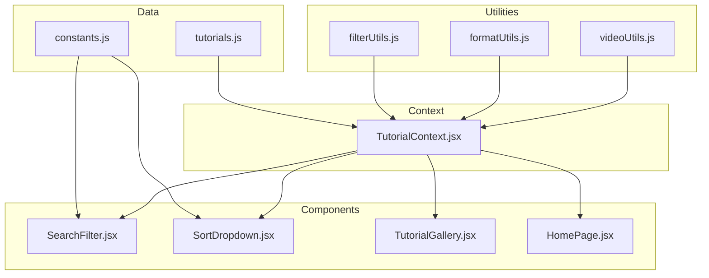
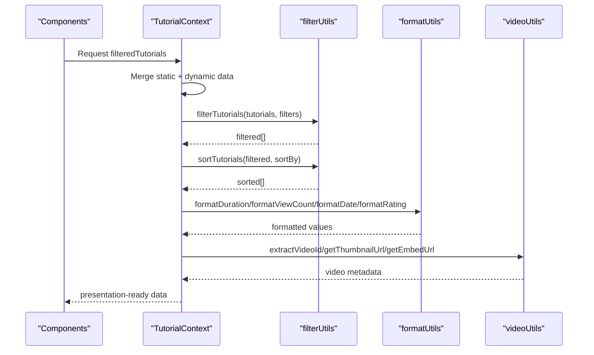
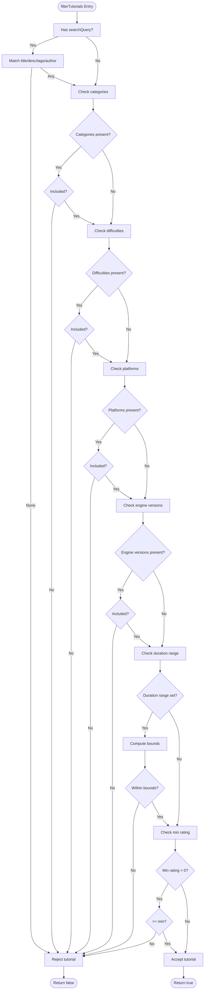
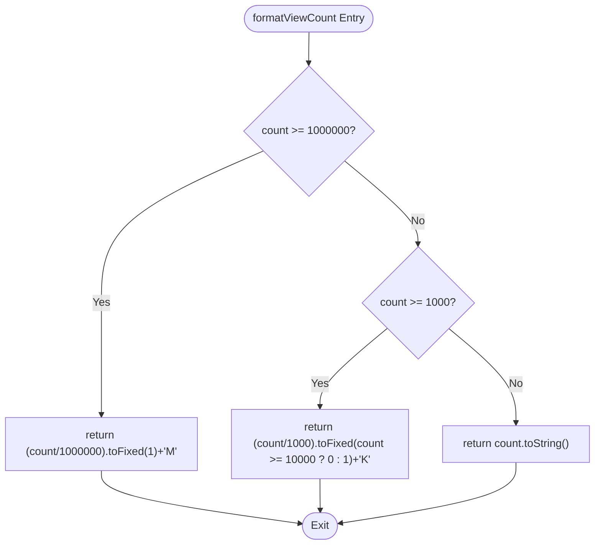
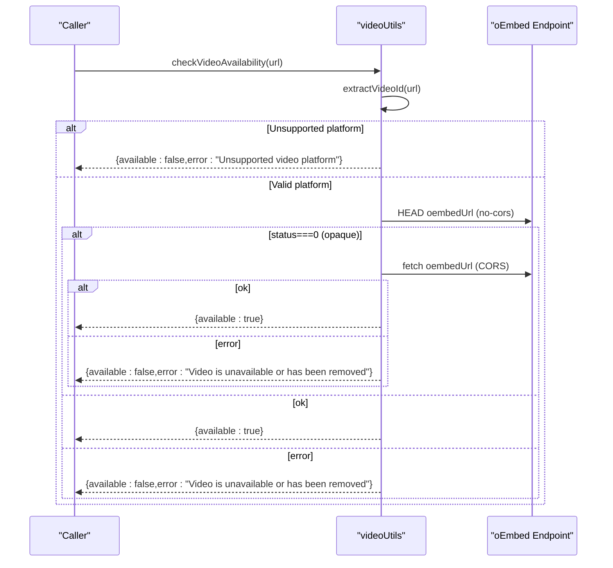
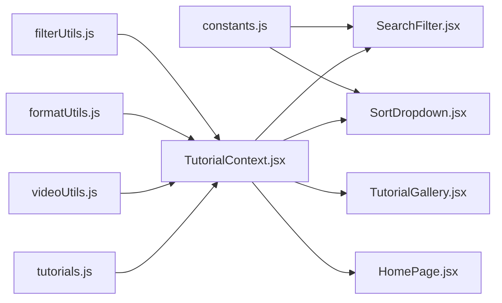

# Data Transformation Utilities

<cite>
**Referenced Files in This Document**
- [filterUtils.js](file://src/utils/filterUtils.js)
- [formatUtils.js](file://src/utils/formatUtils.js)
- [videoUtils.js](file://src/utils/videoUtils.js)
- [constants.js](file://src/data/constants.js)
- [tutorials.js](file://src/data/tutorials.js)
- [TutorialContext.jsx](file://src/contexts/TutorialContext.jsx)
- [SearchFilter.jsx](file://src/components/SearchFilter.jsx)
- [SortDropdown.jsx](file://src/components/SortDropdown.jsx)
- [TutorialGallery.jsx](file://src/components/TutorialGallery.jsx)
- [HomePage.jsx](file://src/pages/HomePage.jsx)
- [filterUtils.test.js](file://src/utils/__tests__/filterUtils.test.js)
- [formatUtils.test.js](file://src/utils/__tests__/formatUtils.test.js)
- [videoUtils.test.js](file://src/utils/__tests__/videoUtils.test.js)
</cite>

## Table of Contents
1. [Introduction](#introduction)
2. [Project Structure](#project-structure)
3. [Core Components](#core-components)
4. [Architecture Overview](#architecture-overview)
5. [Detailed Component Analysis](#detailed-component-analysis)
6. [Dependency Analysis](#dependency-analysis)
7. [Performance Considerations](#performance-considerations)
8. [Troubleshooting Guide](#troubleshooting-guide)
9. [Conclusion](#conclusion)
10. [Appendices](#appendices)

## Introduction
This document explains GameDev Hub’s data transformation utilities that power filtering, sorting, formatting, and video URL processing for tutorials. It covers:
- Filtering by category, difficulty, platform, engine version, duration, rating, and text search
- Sorting by newest, popularity, highest rated, and most viewed
- Formatting durations, view counts, dates, ratings, and truncating text
- Parsing YouTube/Vimeo URLs, extracting IDs, generating thumbnails, and validating videos
- The end-to-end pipeline from raw tutorial objects to presentation-ready data
- Performance, memoization, error handling, and integration with React components

## Project Structure
The utilities live under src/utils and are consumed by the TutorialContext provider, which merges static tutorials with dynamic user data and exposes filtered/sorted results to components.

**Diagram sources**
- [tutorials.js:1-522](file://src/data/tutorials.js#L1-L522)
- [constants.js:1-71](file://src/data/constants.js#L1-L71)
- [filterUtils.js:1-99](file://src/utils/filterUtils.js#L1-L99)
- [formatUtils.js:1-45](file://src/utils/formatUtils.js#L1-L45)
- [videoUtils.js:1-119](file://src/utils/videoUtils.js#L1-L119)
- [TutorialContext.jsx:1-542](file://src/contexts/TutorialContext.jsx#L1-L542)
- [SearchFilter.jsx:1-237](file://src/components/SearchFilter.jsx#L1-L237)
- [SortDropdown.jsx:1-29](file://src/components/SortDropdown.jsx#L1-L29)
- [TutorialGallery.jsx:1-138](file://src/components/TutorialGallery.jsx#L1-L138)
- [HomePage.jsx:1-95](file://src/pages/HomePage.jsx#L1-L95)

**Section sources**
- [filterUtils.js:1-99](file://src/utils/filterUtils.js#L1-L99)
- [formatUtils.js:1-45](file://src/utils/formatUtils.js#L1-L45)
- [videoUtils.js:1-119](file://src/utils/videoUtils.js#L1-L119)
- [constants.js:1-71](file://src/data/constants.js#L1-L71)
- [tutorials.js:1-522](file://src/data/tutorials.js#L1-L522)
- [TutorialContext.jsx:18-71](file://src/contexts/TutorialContext.jsx#L18-L71)
- [SearchFilter.jsx:19-80](file://src/components/SearchFilter.jsx#L19-L80)
- [SortDropdown.jsx:6-22](file://src/components/SortDropdown.jsx#L6-L22)
- [TutorialGallery.jsx:23-44](file://src/components/TutorialGallery.jsx#L23-L44)
- [HomePage.jsx:9-16](file://src/pages/HomePage.jsx#L9-L16)

## Core Components
- filterUtils.js: Implements multi-criteria filtering and sorting for tutorials, plus helpers for duration ranges and active filter counting.
- formatUtils.js: Provides human-friendly formatting for durations, view counts, dates, ratings, and text truncation.
- videoUtils.js: Parses video URLs, extracts IDs, generates thumbnails and embed URLs, validates URLs, sanitizes unsafe URLs, and checks availability via oEmbed.

**Section sources**
- [filterUtils.js:1-99](file://src/utils/filterUtils.js#L1-L99)
- [formatUtils.js:1-45](file://src/utils/formatUtils.js#L1-L45)
- [videoUtils.js:1-119](file://src/utils/videoUtils.js#L1-L119)

## Architecture Overview
The transformation pipeline:
1. Static tutorials are merged with dynamic user data (ratings, views, submissions).
2. Filters are applied to produce a filtered subset.
3. Sorting is applied to the filtered set.
4. Formatters enrich UI-ready values for display.
5. Components render the transformed data.

**Diagram sources**
- [TutorialContext.jsx:37-71](file://src/contexts/TutorialContext.jsx#L37-L71)
- [filterUtils.js:1-99](file://src/utils/filterUtils.js#L1-L99)
- [formatUtils.js:1-45](file://src/utils/formatUtils.js#L1-L45)
- [videoUtils.js:1-119](file://src/utils/videoUtils.js#L1-L119)

## Detailed Component Analysis

### filterUtils.js
- filterTutorials(tutorials, filters): Applies:
  - Text search across title, description, tags, and author name
  - Category, difficulty, platform, engine version inclusion
  - Duration range using getDurationBounds
  - Minimum rating threshold
- getDurationBounds(rangeValue): Maps duration range keys to numeric bounds.
- sortTutorials(tutorials, sortBy): Sorts by newest, popular, highest-rated, or most-viewed.
- getActiveFilterCount(filters): Counts active filters for UI indicators.

**Diagram sources**
- [filterUtils.js:1-60](file://src/utils/filterUtils.js#L1-L60)

**Section sources**
- [filterUtils.js:1-99](file://src/utils/filterUtils.js#L1-L99)
- [filterUtils.test.js:56-160](file://src/utils/__tests__/filterUtils.test.js#L56-L160)
- [filterUtils.test.js:162-194](file://src/utils/__tests__/filterUtils.test.js#L162-L194)
- [filterUtils.test.js:196-230](file://src/utils/__tests__/filterUtils.test.js#L196-L230)
- [filterUtils.test.js:232-252](file://src/utils/__tests__/filterUtils.test.js#L232-L252)

### formatUtils.js
- formatDuration(minutes): Human-readable duration with hours/minutes.
- formatViewCount(count): K/M abbreviations with rounding rules.
- formatDate(dateString): Relative time labels (today/yesterday/days/weeks/months/years ago).
- formatRating(rating): Fixed to one decimal place.
- truncateText(text, maxLength): Truncates and adds ellipsis while preserving word boundaries.

**Diagram sources**
- [formatUtils.js:13-21](file://src/utils/formatUtils.js#L13-L21)

**Section sources**
- [formatUtils.js:1-45](file://src/utils/formatUtils.js#L1-L45)
- [formatUtils.test.js:36-60](file://src/utils/__tests__/formatUtils.test.js#L36-L60)
- [formatUtils.test.js:62-95](file://src/utils/__tests__/formatUtils.test.js#L62-L95)
- [formatUtils.test.js:97-109](file://src/utils/__tests__/formatUtils.test.js#L97-L109)
- [formatUtils.test.js:111-123](file://src/utils/__tests__/formatUtils.test.js#L111-L123)

### videoUtils.js
- extractVideoId(url): Matches YouTube and Vimeo patterns to extract IDs and platform.
- getThumbnailUrl(url): Generates thumbnail URL for supported platforms.
- getEmbedUrl(url): Builds embed URLs for supported platforms.
- isValidVideoUrl(url): Quick validity check using extractVideoId.
- getVideoPlatformName(url): Returns platform name or “Unknown”.
- sanitizeUrl(url): Validates scheme and blocks unsafe protocols.
- checkVideoAvailability(url): Attempts oEmbed HEAD check with fallback to CORS fetch and graceful handling of network issues.

**Diagram sources**
- [videoUtils.js:67-118](file://src/utils/videoUtils.js#L67-L118)

**Section sources**
- [videoUtils.js:1-119](file://src/utils/videoUtils.js#L1-L119)
- [videoUtils.test.js:10-38](file://src/utils/__tests__/videoUtils.test.js#L10-L38)
- [videoUtils.test.js:40-54](file://src/utils/__tests__/videoUtils.test.js#L40-L54)
- [videoUtils.test.js:56-70](file://src/utils/__tests__/videoUtils.test.js#L56-L70)
- [videoUtils.test.js:72-88](file://src/utils/__tests__/videoUtils.test.js#L72-L88)
- [videoUtils.test.js:90-102](file://src/utils/__tests__/videoUtils.test.js#L90-L102)
- [videoUtils.test.js:104-134](file://src/utils/__tests__/videoUtils.test.js#L104-L134)

## Dependency Analysis
- filterUtils depends on constants for duration ranges and is used by TutorialContext to compute filteredTutorials.
- formatUtils is used by components and context to prepare display values.
- videoUtils is used by components and context to derive video metadata and embed URLs.
- TutorialContext merges static tutorials with dynamic data and applies filter/sort.

**Diagram sources**
- [constants.js:47-70](file://src/data/constants.js#L47-L70)
- [SearchFilter.jsx:3,5](file://src/components/SearchFilter.jsx#L3,L5)
- [SortDropdown.jsx:3](file://src/components/SortDropdown.jsx#L3)
- [filterUtils.js:1-99](file://src/utils/filterUtils.js#L1-L99)
- [formatUtils.js:1-45](file://src/utils/formatUtils.js#L1-L45)
- [videoUtils.js:1-119](file://src/utils/videoUtils.js#L1-L119)
- [tutorials.js:1-522](file://src/data/tutorials.js#L1-L522)
- [TutorialContext.jsx:37-71](file://src/contexts/TutorialContext.jsx#L37-L71)
- [TutorialGallery.jsx:1-138](file://src/components/TutorialGallery.jsx#L1-L138)
- [HomePage.jsx:1-95](file://src/pages/HomePage.jsx#L1-L95)

**Section sources**
- [constants.js:47-70](file://src/data/constants.js#L47-L70)
- [TutorialContext.jsx:37-71](file://src/contexts/TutorialContext.jsx#L37-L71)
- [SearchFilter.jsx:3,5](file://src/components/SearchFilter.jsx#L3,L5)
- [SortDropdown.jsx:3](file://src/components/SortDropdown.jsx#L3)

## Performance Considerations
- Memoization:
  - TutorialContext uses useMemo to compute filteredTutorials, avoiding recomputation when inputs are unchanged.
  - TutorialContext also memoizes derived lists (featured, popular) and the merged dataset.
- Sorting:
  - sortTutorials performs an in-place sort on a copied array; for large datasets, consider virtualization and pagination to reduce render cost.
- Filtering:
  - filterTutorials iterates through all tutorials; for very large sets, consider indexing or precomputing boolean flags for frequent filters.
- Formatting:
  - formatUtils functions are lightweight; cache results if reused frequently in tight loops.
- Video availability:
  - checkVideoAvailability makes network requests; debounce or batch calls and cache results per URL to avoid repeated fetches.

[No sources needed since this section provides general guidance]

## Troubleshooting Guide
- Video URL parsing fails:
  - Ensure URL matches supported patterns; use isValidVideoUrl to guard downstream logic.
- Thumbnail not available:
  - getThumbnailUrl returns null for unsupported platforms; handle gracefully in UI.
- Availability checks:
  - checkVideoAvailability may return a warning when network issues occur; treat as “possibly available” and log warnings.
- Sanitization:
  - sanitizeUrl blocks unsafe schemes; always sanitize user-provided URLs before rendering.
- Filter edge cases:
  - getDurationBounds defaults to full range for unknown values; ensure callers pass valid range keys.
  - getActiveFilterCount ignores “any” duration and zero minRating.

**Section sources**
- [videoUtils.js:50-60](file://src/utils/videoUtils.js#L50-L60)
- [videoUtils.test.js:104-134](file://src/utils/__tests__/videoUtils.test.js#L104-L134)
- [filterUtils.js:62-70](file://src/utils/filterUtils.js#L62-L70)
- [filterUtils.test.js:232-252](file://src/utils/__tests__/filterUtils.test.js#L232-L252)

## Conclusion
The data transformation utilities provide a robust foundation for filtering, sorting, formatting, and video metadata handling. Combined with memoized context computation and component-driven pagination, they support scalable rendering of tutorial lists. Extending with indexing, caching, and virtualization can further improve performance for large datasets.

[No sources needed since this section summarizes without analyzing specific files]

## Appendices

### Data Transformation Pipeline Details
- Inputs:
  - Static tutorials from tutorials.js
  - Dynamic overlays: ratings, view logs, submissions
  - User-selected filters and sort preferences
- Processing:
  - Merge and enrich tutorials
  - Apply filterTutorials
  - Apply sortTutorials
  - Apply formatUtils for UI display
  - Resolve video metadata via videoUtils
- Outputs:
  - filteredTutorials, featuredTutorials, popularTutorials
  - Presentation-ready props for components

**Section sources**
- [TutorialContext.jsx:37-81](file://src/contexts/TutorialContext.jsx#L37-L81)
- [filterUtils.js:1-99](file://src/utils/filterUtils.js#L1-L99)
- [formatUtils.js:1-45](file://src/utils/formatUtils.js#L1-L45)
- [videoUtils.js:1-119](file://src/utils/videoUtils.js#L1-L119)

### Integration Patterns with React Components
- SearchFilter.jsx:
  - Updates filters via onFilterChange and clears via onReset
  - Debounces search queries and persists recent searches
- SortDropdown.jsx:
  - Updates sortBy preference
- TutorialGallery.jsx:
  - Renders paginated tutorial cards
- HomePage.jsx:
  - Consumes featuredTutorials, popularTutorials, and for-you suggestions

**Section sources**
- [SearchFilter.jsx:19-80](file://src/components/SearchFilter.jsx#L19-L80)
- [SortDropdown.jsx:6-22](file://src/components/SortDropdown.jsx#L6-L22)
- [TutorialGallery.jsx:23-44](file://src/components/TutorialGallery.jsx#L23-L44)
- [HomePage.jsx:9-16](file://src/pages/HomePage.jsx#L9-L16)