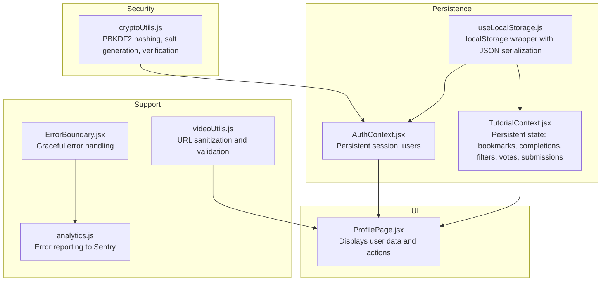
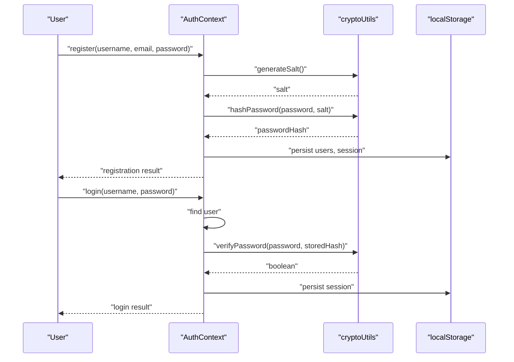
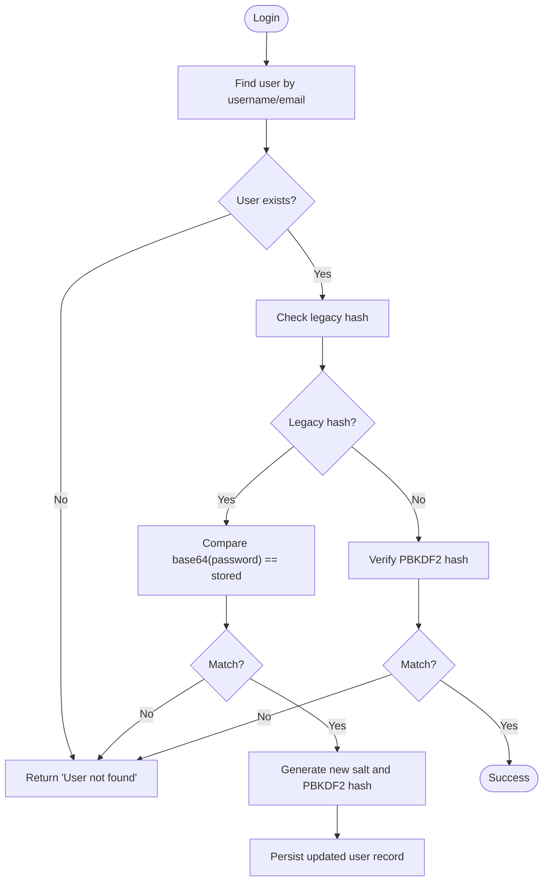
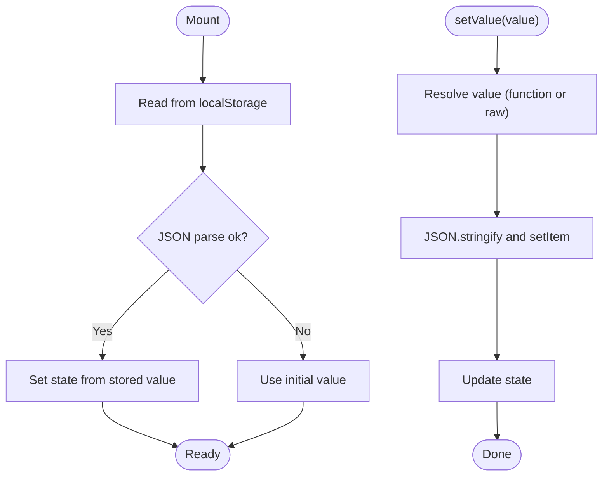
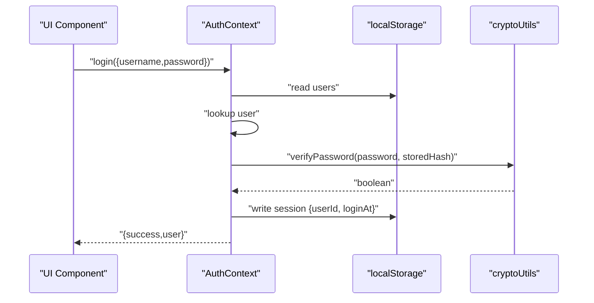
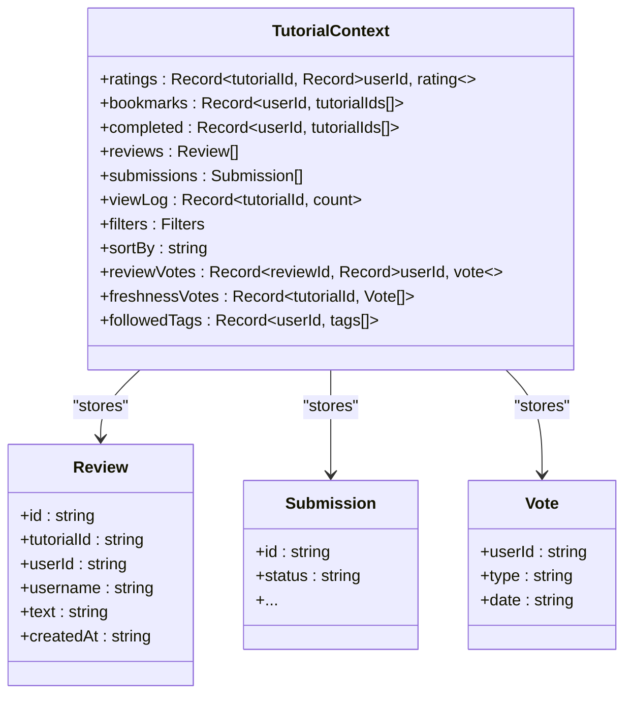
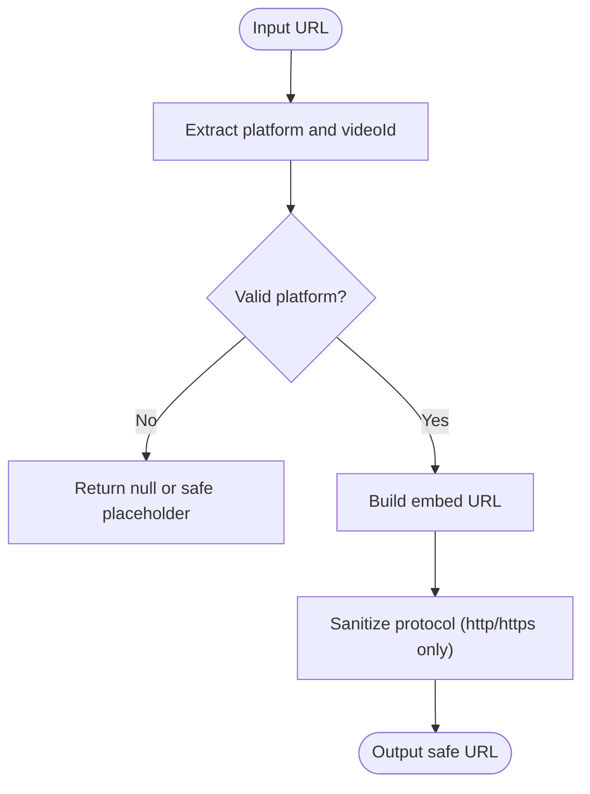
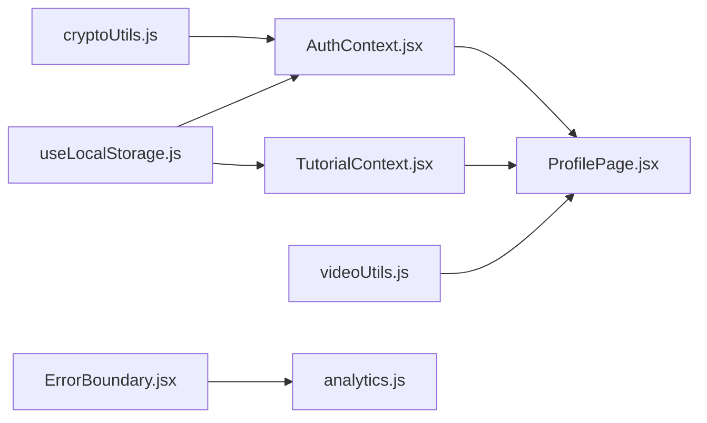

# Security & Data Persistence

<cite>
**Referenced Files in This Document**
- [cryptoUtils.js](file://src/utils/cryptoUtils.js)
- [useLocalStorage.js](file://src/hooks/useLocalStorage.js)
- [AuthContext.jsx](file://src/contexts/AuthContext.jsx)
- [TutorialContext.jsx](file://src/contexts/TutorialContext.jsx)
- [useAuth.js](file://src/hooks/useAuth.js)
- [useTutorials.js](file://src/hooks/useTutorials.js)
- [ProfilePage.jsx](file://src/pages/ProfilePage.jsx)
- [videoUtils.js](file://src/utils/videoUtils.js)
- [constants.js](file://src/data/constants.js)
- [ErrorBoundary.jsx](file://src/components/ErrorBoundary.jsx)
- [analytics.js](file://src/utils/analytics.js)
- [package.json](file://package.json)
- [README.md](file://README.md)
</cite>

## Table of Contents
1. [Introduction](#introduction)
2. [Project Structure](#project-structure)
3. [Core Components](#core-components)
4. [Architecture Overview](#architecture-overview)
5. [Detailed Component Analysis](#detailed-component-analysis)
6. [Dependency Analysis](#dependency-analysis)
7. [Performance Considerations](#performance-considerations)
8. [Troubleshooting Guide](#troubleshooting-guide)
9. [Conclusion](#conclusion)
10. [Appendices](#appendices)

## Introduction
This document explains GameDev Hub’s security measures and data persistence strategies. It focuses on:
- Password hashing and verification using modern cryptographic primitives
- Client-side data persistence via a reusable localStorage hook
- Session management and credential handling
- Data protection patterns for user preferences, bookmarks, completion tracking, and filter state
- Privacy and security considerations, including URL sanitization and error reporting
- Mitigation strategies for common vulnerabilities and best practices for secure handling of sensitive data

## Project Structure
The security and persistence features are implemented across three primary areas:
- Cryptographic utilities for password hashing and verification
- A custom React hook for resilient localStorage management
- Context providers that orchestrate authentication and tutorial-related state, persisted in localStorage

**Diagram sources**
- [cryptoUtils.js:1-70](file://src/utils/cryptoUtils.js#L1-L70)
- [useLocalStorage.js:1-29](file://src/hooks/useLocalStorage.js#L1-L29)
- [AuthContext.jsx:1-105](file://src/contexts/AuthContext.jsx#L1-L105)
- [TutorialContext.jsx:1-200](file://src/contexts/TutorialContext.jsx#L1-L200)
- [ProfilePage.jsx:1-387](file://src/pages/ProfilePage.jsx#L1-L387)
- [videoUtils.js:1-119](file://src/utils/videoUtils.js#L1-L119)
- [ErrorBoundary.jsx:1-62](file://src/components/ErrorBoundary.jsx#L1-L62)
- [analytics.js:1-99](file://src/utils/analytics.js#L1-L99)

**Section sources**
- [README.md:42-46](file://README.md#L42-L46)
- [package.json:1-56](file://package.json#L1-L56)

## Core Components
- cryptoUtils.js: Implements PBKDF2-based password hashing with a cryptographically secure random salt, and constant-time password verification. Includes legacy hash detection and transparent migration.
- useLocalStorage.js: Provides a robust localStorage abstraction with JSON serialization/deserialization, safe initialization, and resilient write/update behavior.
- AuthContext.jsx: Manages user registration, login, logout, and session persistence using localStorage. Integrates cryptographic utilities and handles legacy credentials.
- TutorialContext.jsx: Centralizes user-centric data persistence including bookmarks, completions, review votes, freshness votes, followed tags, and filter/sort preferences.
- ProfilePage.jsx: Renders user-specific views (bookmarks, completions, submissions, followed tags) and exposes CRUD actions backed by TutorialContext.
- videoUtils.js: Validates and sanitizes video URLs to mitigate injection risks in embedded content.
- ErrorBoundary.jsx and analytics.js: Provide error capture and reporting, including user context for diagnostics.

**Section sources**
- [cryptoUtils.js:1-70](file://src/utils/cryptoUtils.js#L1-L70)
- [useLocalStorage.js:1-29](file://src/hooks/useLocalStorage.js#L1-L29)
- [AuthContext.jsx:1-105](file://src/contexts/AuthContext.jsx#L1-L105)
- [TutorialContext.jsx:1-200](file://src/contexts/TutorialContext.jsx#L1-L200)
- [ProfilePage.jsx:1-387](file://src/pages/ProfilePage.jsx#L1-L387)
- [videoUtils.js:1-119](file://src/utils/videoUtils.js#L1-L119)
- [ErrorBoundary.jsx:1-62](file://src/components/ErrorBoundary.jsx#L1-L62)
- [analytics.js:1-99](file://src/utils/analytics.js#L1-L99)

## Architecture Overview
The system combines client-side cryptography with resilient local persistence to protect user credentials and personalize the experience without backend storage.

**Diagram sources**
- [AuthContext.jsx:22-86](file://src/contexts/AuthContext.jsx#L22-L86)
- [cryptoUtils.js:25-65](file://src/utils/cryptoUtils.js#L25-L65)
- [useLocalStorage.js:3-28](file://src/hooks/useLocalStorage.js#L3-L28)

## Detailed Component Analysis

### Password Hashing and Verification (cryptoUtils.js)
- Salt generation: Uses a 16-byte cryptographically strong random source and encodes to a hexadecimal string.
- PBKDF2 hashing: Uses the Web Crypto API with configurable iterations and SHA-256, deriving bits and encoding to a colon-separated string including the algorithm, salt, and derived key.
- Verification: Splits stored hash, regenerates hash with stored salt, and performs constant-time bitwise comparison to prevent timing attacks.
- Legacy hash detection: Identifies non-PBKDF2 hashes and supports transparent migration during login.

**Diagram sources**
- [AuthContext.jsx:54-86](file://src/contexts/AuthContext.jsx#L54-L86)
- [cryptoUtils.js:50-69](file://src/utils/cryptoUtils.js#L50-L69)

**Section sources**
- [cryptoUtils.js:1-70](file://src/utils/cryptoUtils.js#L1-L70)
- [AuthContext.jsx:63-80](file://src/contexts/AuthContext.jsx#L63-L80)

### Client-Side Data Persistence (useLocalStorage.js)
- Initialization: Reads from localStorage on mount, parses JSON safely, and falls back to the provided initial value on error.
- Update mechanism: Accepts either a value or a function, updates state, and writes JSON-serialized value to localStorage, with error handling and warnings.
- Serialization/deserialization: Ensures all stored values are JSON-safe and handles parse errors gracefully.

**Diagram sources**
- [useLocalStorage.js:3-28](file://src/hooks/useLocalStorage.js#L3-L28)

**Section sources**
- [useLocalStorage.js:1-29](file://src/hooks/useLocalStorage.js#L1-L29)

### Authentication and Session Management (AuthContext.jsx)
- Users and session persistence: Stores users and current session in localStorage under dedicated keys.
- Registration: Validates uniqueness, generates salt, hashes password, creates user object, persists users, and starts a session.
- Login: Supports legacy base64 hash verification and migrates to PBKDF2 on successful legacy match; otherwise verifies PBKDF2 hash; sets session on success.
- Logout: Clears session from localStorage.

**Diagram sources**
- [AuthContext.jsx:54-86](file://src/contexts/AuthContext.jsx#L54-L86)
- [cryptoUtils.js:50-65](file://src/utils/cryptoUtils.js#L50-L65)
- [useLocalStorage.js:3-28](file://src/hooks/useLocalStorage.js#L3-L28)

**Section sources**
- [AuthContext.jsx:13-105](file://src/contexts/AuthContext.jsx#L13-L105)
- [useAuth.js:1-11](file://src/hooks/useAuth.js#L1-L11)

### Tutorial Data Persistence and Personalization (TutorialContext.jsx)
- Persistent state keys:
  - Ratings, reviews, bookmarks, submissions, view log, filters, sort preference
  - Completion tracking per user
  - Review votes, freshness votes, followed tags per user
- Data structures:
  - Bookmarks and completions indexed by user ID with arrays of tutorial IDs
  - Votes indexed by entity ID with nested user maps
  - Filters and sort preferences as plain objects
- Computed overlays:
  - Merges default tutorials with approved submissions
  - Computes average ratings and adjusted view counts using stored logs

**Diagram sources**
- [TutorialContext.jsx:18-35](file://src/contexts/TutorialContext.jsx#L18-L35)
- [TutorialContext.jsx:110-131](file://src/contexts/TutorialContext.jsx#L110-L131)
- [TutorialContext.jsx:164-201](file://src/contexts/TutorialContext.jsx#L164-L201)
- [TutorialContext.jsx:204-229](file://src/contexts/TutorialContext.jsx#L204-L229)
- [TutorialContext.jsx:277-291](file://src/contexts/TutorialContext.jsx#L277-L291)

**Section sources**
- [TutorialContext.jsx:1-200](file://src/contexts/TutorialContext.jsx#L1-L200)
- [useTutorials.js:1-11](file://src/hooks/useTutorials.js#L1-L11)

### Profile Page Data Views (ProfilePage.jsx)
- Displays user-specific data:
  - Bookmarks: renders tutorials bookmarked by the current user
  - Completed: renders tutorials marked as completed by the current user
  - Submissions: lists authored submissions editable by the user
  - Followed tags: shows tags the user follows
- Relies on TutorialContext getters and setters for all persistence-backed features.

**Section sources**
- [ProfilePage.jsx:15-387](file://src/pages/ProfilePage.jsx#L15-L387)
- [TutorialContext.jsx:133-162](file://src/contexts/TutorialContext.jsx#L133-L162)
- [TutorialContext.jsx:164-201](file://src/contexts/TutorialContext.jsx#L164-L201)
- [TutorialContext.jsx:425-433](file://src/contexts/TutorialContext.jsx#L425-L433)

### URL Sanitization and Video Validation (videoUtils.js)
- Extracts video IDs from supported platforms and constructs embed URLs.
- Validates URLs to allow only http/https protocols, returning a safe representation otherwise.
- Checks video availability using oEmbed endpoints with graceful fallbacks for network conditions.

**Diagram sources**
- [videoUtils.js:3-48](file://src/utils/videoUtils.js#L3-L48)
- [videoUtils.js:50-60](file://src/utils/videoUtils.js#L50-L60)
- [constants.js:55-71](file://src/data/constants.js#L55-L71)

**Section sources**
- [videoUtils.js:1-119](file://src/utils/videoUtils.js#L1-L119)
- [constants.js:1-71](file://src/data/constants.js#L1-L71)

## Dependency Analysis
- cryptoUtils depends on the Web Crypto API for PBKDF2 and random number generation.
- AuthContext depends on cryptoUtils and useLocalStorage for secure credential handling and session persistence.
- TutorialContext depends on useLocalStorage for personalization and state persistence.
- ProfilePage consumes TutorialContext APIs to render user-specific data.
- ErrorBoundary integrates with analytics to report errors to Sentry while preserving user privacy.

**Diagram sources**
- [cryptoUtils.js:1-70](file://src/utils/cryptoUtils.js#L1-L70)
- [useLocalStorage.js:1-29](file://src/hooks/useLocalStorage.js#L1-L29)
- [AuthContext.jsx:1-105](file://src/contexts/AuthContext.jsx#L1-L105)
- [TutorialContext.jsx:1-200](file://src/contexts/TutorialContext.jsx#L1-L200)
- [ProfilePage.jsx:1-387](file://src/pages/ProfilePage.jsx#L1-L387)
- [videoUtils.js:1-119](file://src/utils/videoUtils.js#L1-L119)
- [ErrorBoundary.jsx:1-62](file://src/components/ErrorBoundary.jsx#L1-L62)
- [analytics.js:1-99](file://src/utils/analytics.js#L1-L99)

**Section sources**
- [package.json:1-56](file://package.json#L1-L56)

## Performance Considerations
- PBKDF2 cost: The configured iteration count balances security and responsiveness; increasing it further improves security at the cost of CPU time during login.
- localStorage throughput: Batched updates and avoiding excessive writes improve UX; the hook already serializes only on change.
- Rendering overhead: Memoization in contexts prevents unnecessary recomputation; keep persisted objects flat or memoized where possible.
- Network checks: Video availability checks use oEmbed endpoints; consider caching results per session to reduce repeated network calls.

[No sources needed since this section provides general guidance]

## Troubleshooting Guide
- Login fails with legacy hash:
  - Cause: Stored hash does not use PBKDF2 prefix.
  - Behavior: On successful legacy match, the system migrates to PBKDF2 and persists the updated record.
  - Action: Ensure users log in after deployment to trigger migration.
- localStorage errors:
  - Symptom: Warnings logged when reading/writing keys.
  - Cause: Storage quota exceeded, private browsing restrictions, or corrupted items.
  - Action: Clear browser data selectively or advise users to disable extensions interfering with storage.
- Video embedding issues:
  - Symptom: Invalid or blocked embed URLs.
  - Action: Use URL sanitization and validation utilities; verify platform-specific embed URLs.
- Error reporting:
  - Symptom: Errors captured and optionally sent to Sentry.
  - Action: Ensure Sentry is initialized with a valid DSN and environment; avoid logging sensitive data.

**Section sources**
- [AuthContext.jsx:63-80](file://src/contexts/AuthContext.jsx#L63-L80)
- [useLocalStorage.js:8-22](file://src/hooks/useLocalStorage.js#L8-L22)
- [videoUtils.js:50-60](file://src/utils/videoUtils.js#L50-L60)
- [ErrorBoundary.jsx:17-24](file://src/components/ErrorBoundary.jsx#L17-L24)
- [analytics.js:26-37](file://src/utils/analytics.js#L26-L37)

## Conclusion
GameDev Hub employs modern cryptographic practices for password handling, resilient client-side persistence for personalization, and defensive measures against common web vulnerabilities. By combining PBKDF2 with secure random salts, constant-time verification, and localStorage-backed state, the application achieves strong privacy and usability. Continued vigilance around secure defaults, error handling, and user data minimization will maintain trust and compliance.

[No sources needed since this section summarizes without analyzing specific files]

## Appendices

### Security Best Practices Implemented
- Cryptography: PBKDF2 with high iteration count and per-user salt; constant-time comparison.
- Storage: JSON serialization/deserialization with safe fallbacks; explicit error logging.
- Input validation: URL sanitization and platform-specific extraction; video availability checks.
- Observability: Error boundaries and Sentry integration for diagnostics without exposing sensitive data.

**Section sources**
- [README.md:42-46](file://README.md#L42-L46)
- [cryptoUtils.js:1-70](file://src/utils/cryptoUtils.js#L1-L70)
- [useLocalStorage.js:1-29](file://src/hooks/useLocalStorage.js#L1-L29)
- [videoUtils.js:1-119](file://src/utils/videoUtils.js#L1-L119)
- [ErrorBoundary.jsx:1-62](file://src/components/ErrorBoundary.jsx#L1-L62)
- [analytics.js:1-99](file://src/utils/analytics.js#L1-L99)

### Data Persistence Patterns
- Authentication: Users and session stored under dedicated keys; session scoped to current user.
- Personalization: Bookmarks, completions, followed tags, and votes keyed by user ID.
- Preferences: Filters and sort order persisted globally for the current device.
- Dynamic overlays: Computed averages and view counts derived from stored logs.

**Section sources**
- [AuthContext.jsx:14-15](file://src/contexts/AuthContext.jsx#L14-L15)
- [TutorialContext.jsx:18-35](file://src/contexts/TutorialContext.jsx#L18-L35)
- [TutorialContext.jsx:36-65](file://src/contexts/TutorialContext.jsx#L36-L65)

### Compliance and Privacy Notes
- No personal data is transmitted to external servers; all sensitive data remains in the browser.
- Error reports exclude user identifiers unless explicitly configured; Sentry user context is cleared on logout.
- URL sanitization prevents unsafe protocols in embedded content.

**Section sources**
- [README.md:42-46](file://README.md#L42-L46)
- [videoUtils.js:50-60](file://src/utils/videoUtils.js#L50-L60)
- [analytics.js:43-56](file://src/utils/analytics.js#L43-L56)