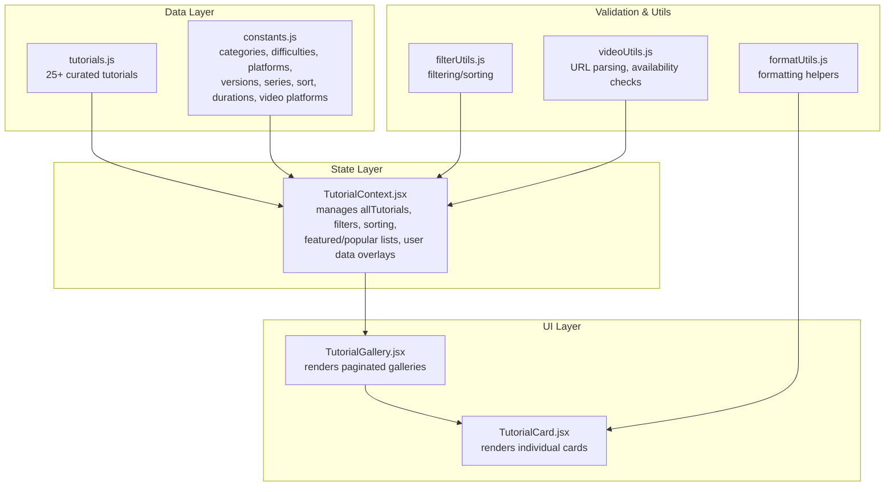
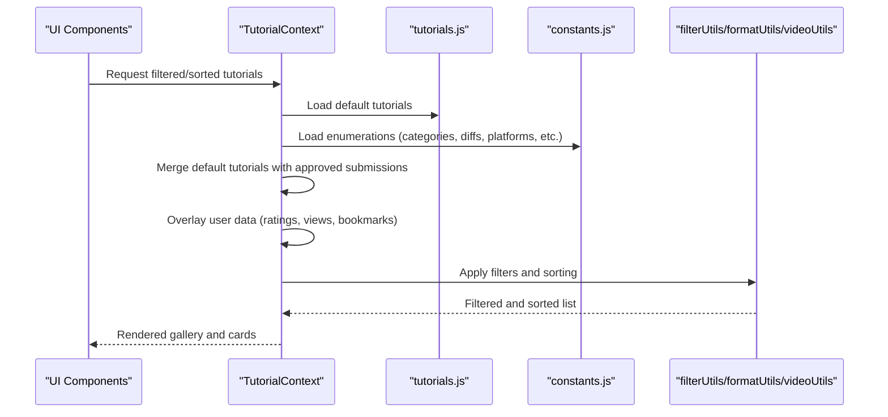
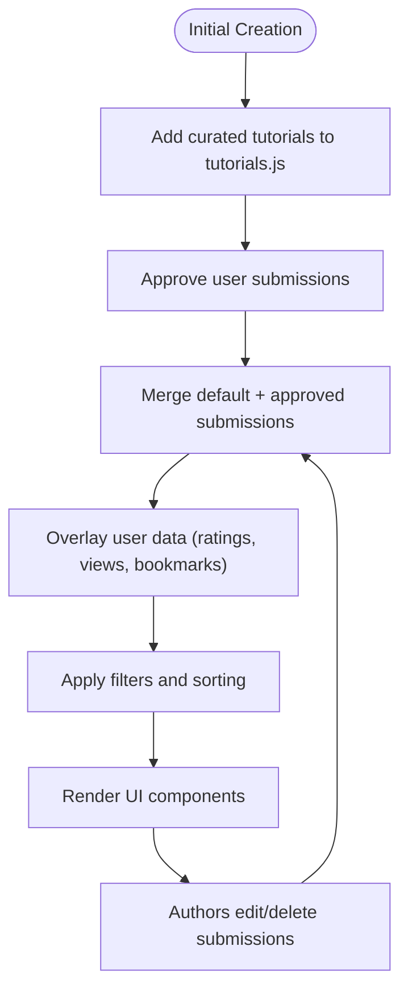
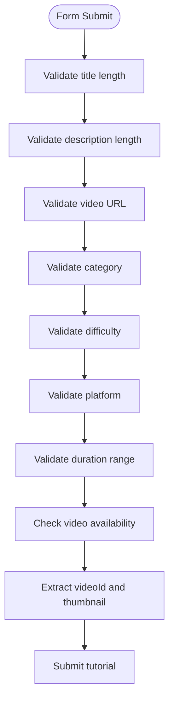
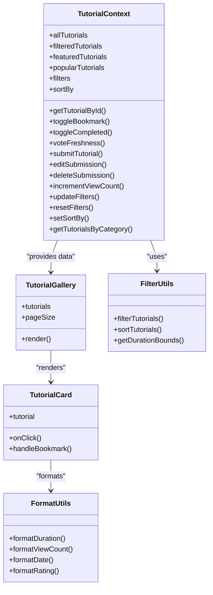
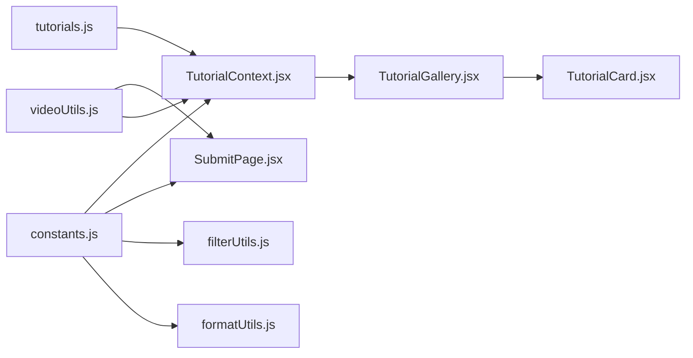

# Static Datasets

<cite>
**Referenced Files in This Document**
- [tutorials.js](file://src/data/tutorials.js)
- [constants.js](file://src/data/constants.js)
- [README.md](file://README.md)
- [TutorialContext.jsx](file://src/contexts/TutorialContext.jsx)
- [filterUtils.js](file://src/utils/filterUtils.js)
- [formatUtils.js](file://src/utils/formatUtils.js)
- [videoUtils.js](file://src/utils/videoUtils.js)
- [propTypeShapes.js](file://src/utils/propTypeShapes.js)
- [TutorialCard.jsx](file://src/components/TutorialCard.jsx)
- [TutorialGallery.jsx](file://src/components/TutorialGallery.jsx)
- [SubmitPage.jsx](file://src/pages/SubmitPage.jsx)
- [videoUtils.test.js](file://src/utils/__tests__/videoUtils.test.js)
</cite>

## Table of Contents
1. [Introduction](#introduction)
2. [Project Structure](#project-structure)
3. [Core Components](#core-components)
4. [Architecture Overview](#architecture-overview)
5. [Detailed Component Analysis](#detailed-component-analysis)
6. [Dependency Analysis](#dependency-analysis)
7. [Performance Considerations](#performance-considerations)
8. [Troubleshooting Guide](#troubleshooting-guide)
9. [Conclusion](#conclusion)
10. [Appendices](#appendices)

## Introduction
This document describes the static datasets that power GameDev Hub’s tutorial catalog. It focuses on:
- The tutorials dataset containing 25+ curated tutorials with rich metadata
- The constants dataset that defines categories, difficulties, platforms, and enumerations
- Data validation patterns, constraints, and business rules
- How tutorials are organized (series, prerequisites, featured flags)
- Example tutorial types across 2D/3D games, programming, art assets, and audio
- The data lifecycle from creation through updates and maintenance
- Strategies for ensuring data consistency and integrity

## Project Structure
The dataset files live under the data directory and are consumed by the application’s state and UI layers.

**Diagram sources**
- [tutorials.js:1-522](file://src/data/tutorials.js#L1-L522)
- [constants.js:1-71](file://src/data/constants.js#L1-L71)
- [TutorialContext.jsx:1-542](file://src/contexts/TutorialContext.jsx#L1-L542)
- [TutorialGallery.jsx:1-138](file://src/components/TutorialGallery.jsx#L1-L138)
- [TutorialCard.jsx:1-110](file://src/components/TutorialCard.jsx#L1-L110)
- [filterUtils.js:1-99](file://src/utils/filterUtils.js#L1-L99)
- [formatUtils.js:1-45](file://src/utils/formatUtils.js#L1-L45)
- [videoUtils.js:1-119](file://src/utils/videoUtils.js#L1-L119)

**Section sources**
- [README.md:97-128](file://README.md#L97-L128)
- [tutorials.js:1-522](file://src/data/tutorials.js#L1-L522)
- [constants.js:1-71](file://src/data/constants.js#L1-L71)

## Core Components
- Tutorials dataset: A static array of tutorial objects with standardized fields for discovery, filtering, and presentation.
- Constants dataset: Centralized enumerations and configuration for categories, difficulties, platforms, engine versions, series, sorting, duration ranges, and supported video platforms.

Key responsibilities:
- Tutorials dataset: Provides canonical metadata for 25+ tutorials, including series grouping, prerequisites, authorship, timestamps, and metrics.
- Constants dataset: Ensures consistent filtering, display, and validation across the UI and submission flow.

**Section sources**
- [tutorials.js:1-522](file://src/data/tutorials.js#L1-L522)
- [constants.js:1-71](file://src/data/constants.js#L1-L71)

## Architecture Overview
The tutorials dataset is merged with user-generated submissions and local storage overlays to produce the final dataset used by the UI. Filtering and sorting are applied at runtime, while constants drive UI controls and validation.

**Diagram sources**
- [TutorialContext.jsx:36-71](file://src/contexts/TutorialContext.jsx#L36-L71)
- [filterUtils.js:1-99](file://src/utils/filterUtils.js#L1-L99)
- [formatUtils.js:1-45](file://src/utils/formatUtils.js#L1-L45)
- [videoUtils.js:1-119](file://src/utils/videoUtils.js#L1-L119)
- [tutorials.js:1-522](file://src/data/tutorials.js#L1-L522)
- [constants.js:1-71](file://src/data/constants.js#L1-L71)

## Detailed Component Analysis

### Tutorials Dataset Structure
Each tutorial object follows a consistent schema with the following categories of fields:
- Identity and media: id, title, description, url, videoId, thumbnailUrl
- Organization: category, difficulty, platform, engineVersion, tags
- Learning: estimatedDuration, seriesId, seriesOrder, prerequisites
- Authoring and timestamps: author (with id, name), createdAt
- Metrics: viewCount, averageRating, ratingCount
- Presentation flags: isFeatured

Representative examples across domains:
- 2D platformer in Godot 4
- Unreal Engine 5 beginner course
- Unity C# fundamentals
- Pixel art character animation
- Game audio design
- Advanced shader programming in Unity URP
- GameMaker Studio 2 RPG
- Procedural generation algorithms
- 3D character modeling in Blender
- Game Design Document fundamentals
- Multiplayer networking in Unity with Netcode
- Godot 4 FPS controller
- Adaptive music with FMOD
- Level design principles
- Unreal Niagara VFX masterclass
- 2D sprite animation with Unity Animator
- AI and pathfinding
- GameMaker smooth camera
- Game economy and progression
- Unreal Blueprint inventory
- Composing chiptune music
- Godot 4 P2P networking
- UI/UX design for games
- GameMaker roguelike
- Player psychology and engagement

Series organization:
- seriesId and seriesOrder group related tutorials into numbered sequences (e.g., “Godot 4 Beginner Series”, “Game Design Fundamentals”, “GameMaker Masterclass”).

Prerequisite relationships:
- prerequisites is an array of tutorial ids indicating “watch these first”.

Featured tutorial flags:
- isFeatured marks tutorials highlighted on the homepage.

**Section sources**
- [tutorials.js:1-522](file://src/data/tutorials.js#L1-L522)

### Constants Dataset
The constants file centralizes:
- Categories: 2D, 3D, Programming, Art, Audio, Game Design
- Difficulties: Beginner, Intermediate, Advanced with color tokens
- Platforms: Unity, Unreal, Godot, GameMaker, Custom
- Series: Named series with ids for grouping
- Engine Versions: Specific engine and version strings
- Sorting Options: Newest, Most Popular, Highest Rated, Most Viewed
- Duration Ranges: Any, Under 15 min, 15–60 min, 1–3 hours, Over 3 hours
- Video Platforms: YouTube and Vimeo URL patterns and oEmbed endpoints

These enumerations are used across filtering, sorting, and submission forms.

**Section sources**
- [constants.js:1-71](file://src/data/constants.js#L1-L71)

### Data Lifecycle and Maintenance
- Creation: Curated tutorials are authored and added to the tutorials dataset.
- Merging: Approved submissions are appended to the default dataset and overlaid with user data (ratings, views, bookmarks).
- Filtering and Sorting: Applied at runtime using filter and sort utilities.
- Presentation: UI components render galleries and cards using the merged dataset.
- Updates: Submissions can be edited or deleted by authors; edits preserve original metadata fields while updating editable attributes.

**Diagram sources**
- [TutorialContext.jsx:36-65](file://src/contexts/TutorialContext.jsx#L36-L65)
- [filterUtils.js:1-99](file://src/utils/filterUtils.js#L1-L99)
- [TutorialGallery.jsx:1-138](file://src/components/TutorialGallery.jsx#L1-L138)
- [TutorialCard.jsx:1-110](file://src/components/TutorialCard.jsx#L1-L110)

**Section sources**
- [TutorialContext.jsx:353-423](file://src/contexts/TutorialContext.jsx#L353-L423)

### Data Validation Patterns and Business Rules
- Submission validation (client-side):
  - Title length: 5–100 characters
  - Description length: 20–500 characters
  - URL must be a valid YouTube or Vimeo link
  - Difficulty and category must be selected
  - Platform selection required
  - Duration numeric, 1–600 minutes
  - Prerequisites limited to 5 items
  - Video availability checked via oEmbed endpoints
- Runtime validation (PropTypes):
  - Tutorial shape enforces required fields and types
  - Filter shape validates filter composition
- URL safety:
  - sanitizeUrl blocks unsafe protocols (e.g., javascript:, data:)
  - Video platform detection and embedding rely on constants’ patterns

**Diagram sources**
- [SubmitPage.jsx:78-173](file://src/pages/SubmitPage.jsx#L78-L173)
- [videoUtils.js:67-118](file://src/utils/videoUtils.js#L67-L118)
- [propTypeShapes.js:3-26](file://src/utils/propTypeShapes.js#L3-L26)

**Section sources**
- [SubmitPage.jsx:78-173](file://src/pages/SubmitPage.jsx#L78-L173)
- [videoUtils.js:50-60](file://src/utils/videoUtils.js#L50-L60)
- [propTypeShapes.js:3-26](file://src/utils/propTypeShapes.js#L3-L26)
- [videoUtils.test.js:104-134](file://src/utils/__tests__/videoUtils.test.js#L104-L134)

### Data Consumption and Rendering
- TutorialGallery renders paginated grids of TutorialCards.
- TutorialCard displays thumbnail, duration, platform badge, completion and freshness badges, author, tags, and stats.
- Formatting helpers convert durations, view counts, dates, and ratings for display.
- Filtering and sorting are driven by constants and utilities.

**Diagram sources**
- [TutorialContext.jsx:453-536](file://src/contexts/TutorialContext.jsx#L453-L536)
- [TutorialGallery.jsx:23-125](file://src/components/TutorialGallery.jsx#L23-L125)
- [TutorialCard.jsx:14-109](file://src/components/TutorialCard.jsx#L14-L109)
- [filterUtils.js:1-99](file://src/utils/filterUtils.js#L1-L99)
- [formatUtils.js:1-45](file://src/utils/formatUtils.js#L1-L45)

**Section sources**
- [TutorialContext.jsx:67-81](file://src/contexts/TutorialContext.jsx#L67-L81)
- [TutorialGallery.jsx:23-125](file://src/components/TutorialGallery.jsx#L23-L125)
- [TutorialCard.jsx:14-109](file://src/components/TutorialCard.jsx#L14-L109)
- [filterUtils.js:72-86](file://src/utils/filterUtils.js#L72-L86)
- [formatUtils.js:1-45](file://src/utils/formatUtils.js#L1-L45)

## Dependency Analysis
- tutorials.js is the primary source of truth for tutorial metadata.
- constants.js drives UI controls and validation rules.
- TutorialContext merges defaults with submissions and overlays user data.
- filterUtils and formatUtils transform and present data consistently.
- videoUtils ensures safe, valid video URLs and embeds.

**Diagram sources**
- [tutorials.js:1-522](file://src/data/tutorials.js#L1-L522)
- [constants.js:1-71](file://src/data/constants.js#L1-L71)
- [TutorialContext.jsx:36-71](file://src/contexts/TutorialContext.jsx#L36-L71)
- [SubmitPage.jsx:1-388](file://src/pages/SubmitPage.jsx#L1-L388)
- [filterUtils.js:1-99](file://src/utils/filterUtils.js#L1-L99)
- [formatUtils.js:1-45](file://src/utils/formatUtils.js#L1-L45)
- [videoUtils.js:1-119](file://src/utils/videoUtils.js#L1-L119)
- [TutorialGallery.jsx:1-138](file://src/components/TutorialGallery.jsx#L1-L138)
- [TutorialCard.jsx:1-110](file://src/components/TutorialCard.jsx#L1-L110)

**Section sources**
- [TutorialContext.jsx:36-71](file://src/contexts/TutorialContext.jsx#L36-L71)
- [SubmitPage.jsx:1-388](file://src/pages/SubmitPage.jsx#L1-L388)
- [filterUtils.js:1-99](file://src/utils/filterUtils.js#L1-L99)
- [formatUtils.js:1-45](file://src/utils/formatUtils.js#L1-L45)
- [videoUtils.js:1-119](file://src/utils/videoUtils.js#L1-L119)

## Performance Considerations
- Filtering and sorting are computed on the client; keep the dataset size reasonable for large collections.
- Memoization in TutorialContext prevents unnecessary recomputation of derived lists.
- Lazy loading and pagination reduce DOM overhead in galleries.
- Thumbnail generation and availability checks occur during submission; consider caching or precomputed thumbnails for production-scale datasets.

[No sources needed since this section provides general guidance]

## Troubleshooting Guide
Common issues and resolutions:
- Invalid video URL: Ensure the URL matches supported patterns for YouTube or Vimeo; validation will reject unsupported formats.
- Video unavailable: Availability checks use oEmbed endpoints; failures indicate the video may be removed or private.
- Duration out of range: Enforce 1–600 minutes during submission.
- Prerequisites limit exceeded: Limit to 5 prerequisite ids.
- UI not rendering thumbnails: Some platforms require API calls for thumbnails; fallback UI is used when unavailable.
- PropTypes warnings: Ensure tutorial objects conform to the expected shape and required fields.

**Section sources**
- [SubmitPage.jsx:82-126](file://src/pages/SubmitPage.jsx#L82-L126)
- [videoUtils.js:67-118](file://src/utils/videoUtils.js#L67-L118)
- [propTypeShapes.js:3-26](file://src/utils/propTypeShapes.js#L3-L26)
- [videoUtils.test.js:104-134](file://src/utils/__tests__/videoUtils.test.js#L104-L134)

## Conclusion
GameDev Hub’s static datasets provide a robust foundation for tutorial discovery and organization. The tutorials dataset encodes rich metadata and relationships, while the constants dataset ensures consistent filtering and validation. Together with the state and UI layers, they deliver a scalable, maintainable system for curating and presenting game development tutorials.

[No sources needed since this section summarizes without analyzing specific files]

## Appendices

### Field Reference and Constraints
- Required fields (tutorialShape): id, title, url, category, difficulty, platform, author.name
- Optional fields: engineVersion, tags, estimatedDuration, seriesId, seriesOrder, prerequisites, thumbnailUrl, viewCount, averageRating, ratingCount, isFeatured
- Constraints:
  - Difficulty must be one of Beginner, Intermediate, Advanced
  - Duration numeric, 1–600 minutes
  - Prerequisites limited to 5 items
  - URL must be valid YouTube or Vimeo

**Section sources**
- [propTypeShapes.js:3-26](file://src/utils/propTypeShapes.js#L3-L26)
- [SubmitPage.jsx:82-110](file://src/pages/SubmitPage.jsx#L82-L110)
- [constants.js:1-71](file://src/data/constants.js#L1-L71)