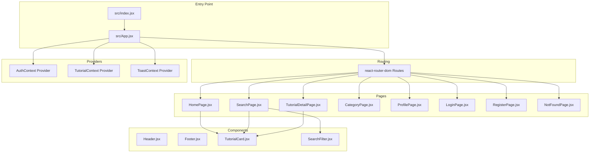
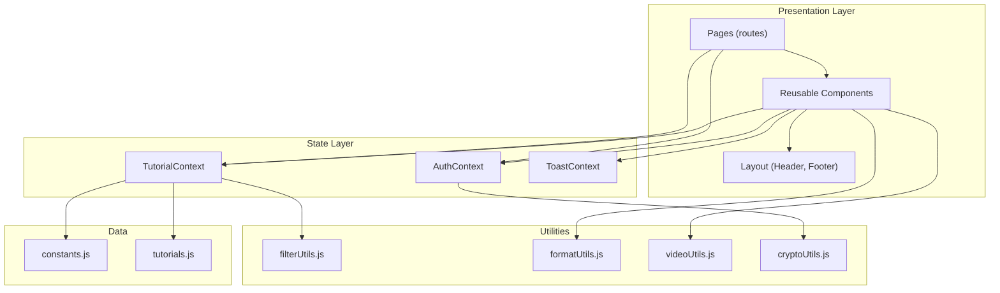
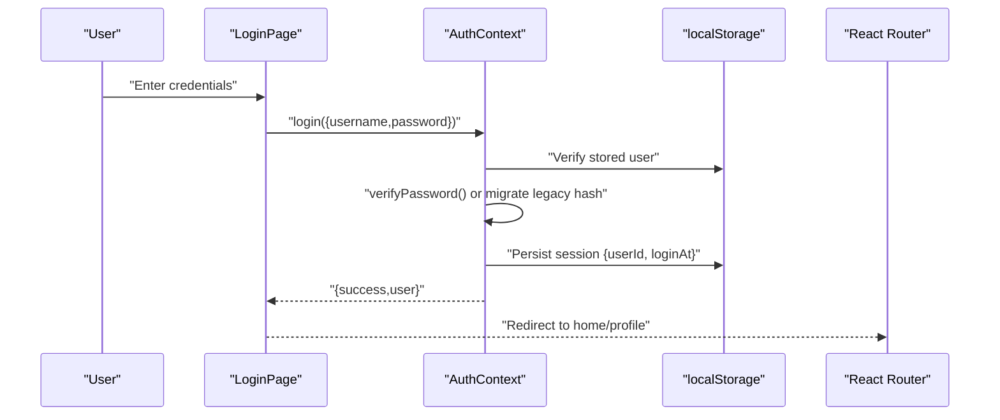
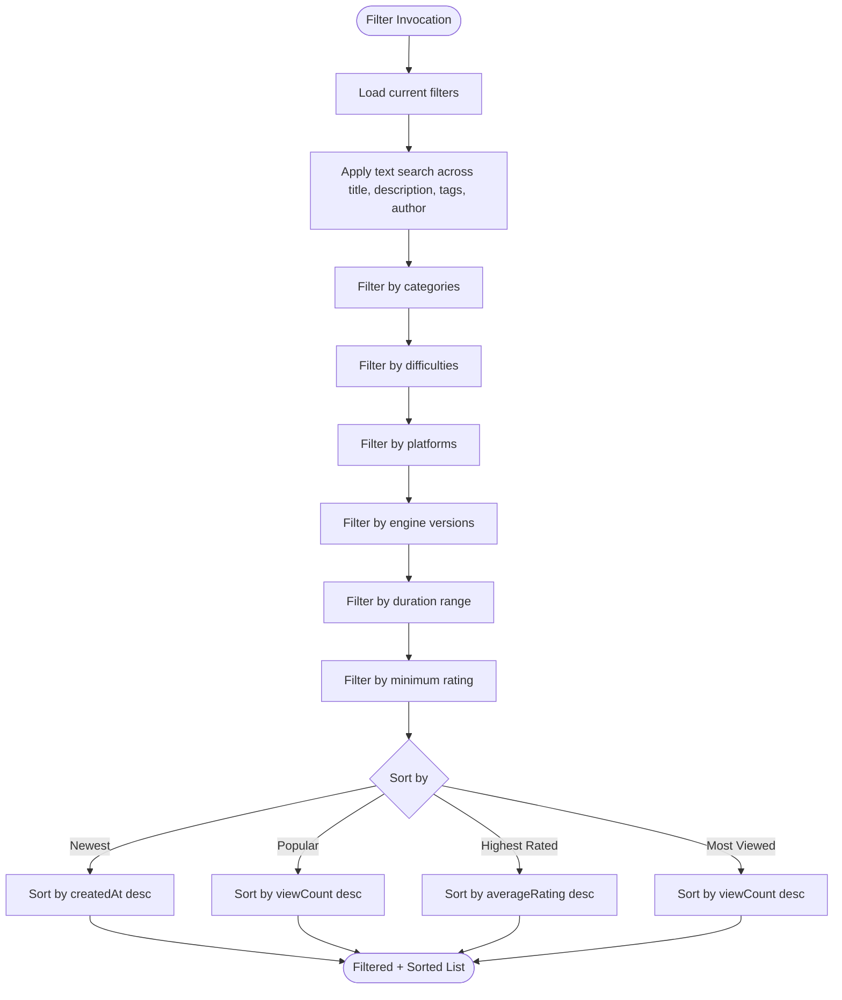
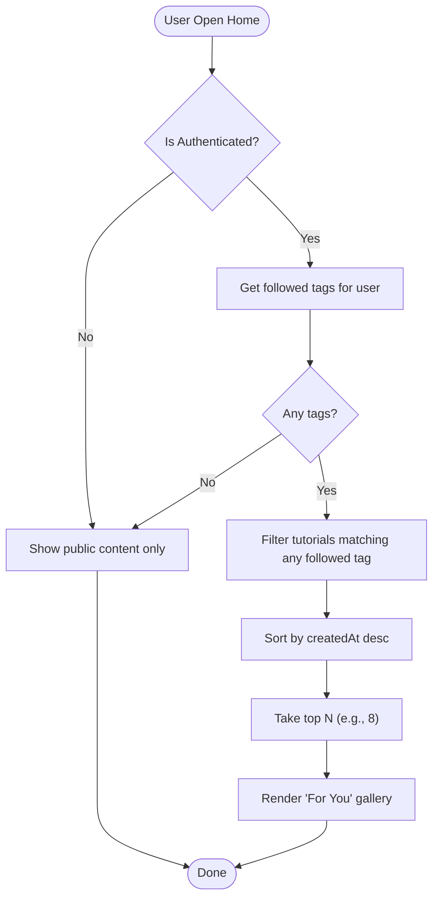
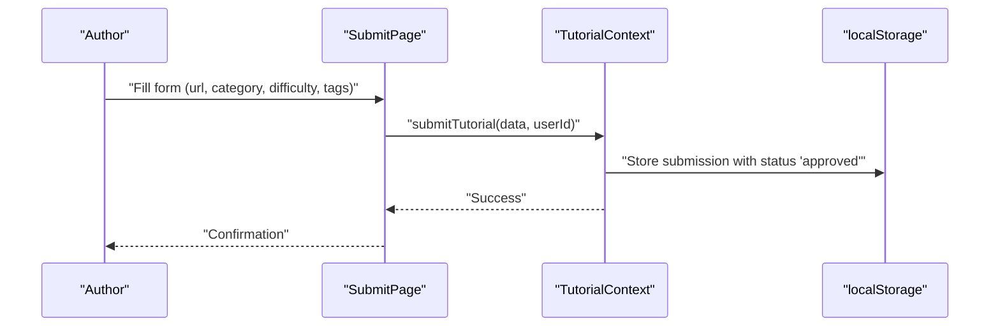
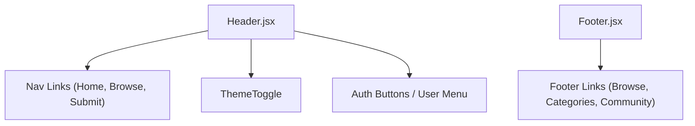
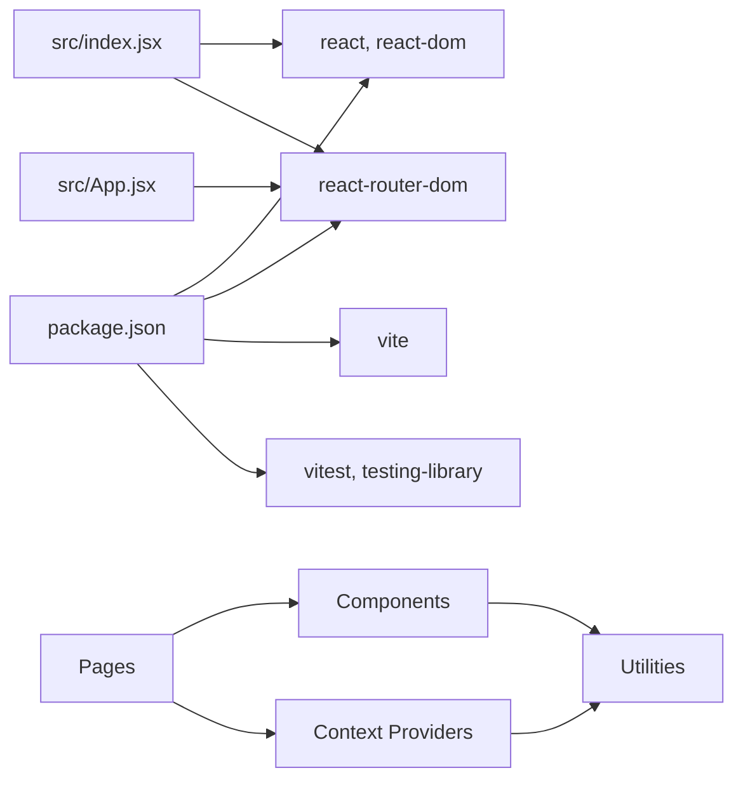

# Project Overview

<cite>
**Referenced Files in This Document**
- [README.md](file://README.md)
- [package.json](file://package.json)
- [src/index.jsx](file://src/index.jsx)
- [src/App.jsx](file://src/App.jsx)
- [src/contexts/AuthContext.jsx](file://src/contexts/AuthContext.jsx)
- [src/contexts/TutorialContext.jsx](file://src/contexts/TutorialContext.jsx)
- [src/contexts/ToastContext.jsx](file://src/contexts/ToastContext.jsx)
- [src/hooks/useAuth.js](file://src/hooks/useAuth.js)
- [src/hooks/useTutorials.js](file://src/hooks/useTutorials.js)
- [src/data/constants.js](file://src/data/constants.js)
- [src/data/tutorials.js](file://src/data/tutorials.js)
- [src/utils/filterUtils.js](file://src/utils/filterUtils.js)
- [src/pages/HomePage.jsx](file://src/pages/HomePage.jsx)
- [src/components/layout/Header.jsx](file://src/components/layout/Header.jsx)
- [src/components/layout/Footer.jsx](file://src/components/layout/Footer.jsx)
- [src/components/TutorialCard.jsx](file://src/components/TutorialCard.jsx)
- [src/components/SearchFilter.jsx](file://src/components/SearchFilter.jsx)
</cite>

## Table of Contents
1. [Introduction](#introduction)
2. [Project Structure](#project-structure)
3. [Core Components](#core-components)
4. [Architecture Overview](#architecture-overview)
5. [Detailed Component Analysis](#detailed-component-analysis)
6. [Dependency Analysis](#dependency-analysis)
7. [Performance Considerations](#performance-considerations)
8. [Troubleshooting Guide](#troubleshooting-guide)
9. [Conclusion](#conclusion)

## Introduction
GameDev Hub is a modern, feature-rich tutorial discovery platform for game development education. It curates high-quality video tutorials across 2D/3D development, programming, art, audio, and game design, helping aspiring developers learn efficiently through structured browsing, personalization, and community-driven insights. The platform emphasizes practical learning paths, with features like prerequisite guidance, tutorial series, and freshness consensus to keep content relevant.

Target audience
- Aspiring game developers seeking guided learning paths
- Educators and learners who benefit from curated, categorized content
- Community contributors who want to share and manage tutorials

Core value proposition
- Curated, high-quality tutorials with robust metadata (difficulty, platform, engine version)
- Personalized discovery via “For You” feed based on followed tags
- Community-powered quality signals (helpful votes, freshness flags, ratings)
- Author tools to manage submissions and maintain content health

Educational focus
- Structured learning with prerequisites and series
- Practical skills across engines and disciplines
- Transparent quality indicators to help learners choose reliable content

## Project Structure
The project follows a component-driven structure with clear separation of concerns:
- Pages: route-level containers for content areas (Home, Search, Tutorial Detail, Category, Profile, Auth)
- Components: reusable UI elements (cards, galleries, filters, modals, badges)
- Contexts: global state providers for authentication, tutorials, and toast notifications
- Hooks: typed wrappers around contexts for easy consumption
- Utilities: filtering, formatting, validation, and crypto helpers
- Data: constants and mock tutorials for realistic demos

**Diagram sources**
- [src/index.jsx:1-24](file://src/index.jsx#L1-L24)
- [src/App.jsx:1-51](file://src/App.jsx#L1-L51)
- [src/pages/HomePage.jsx:1-95](file://src/pages/HomePage.jsx#L1-L95)
- [src/components/layout/Header.jsx:1-116](file://src/components/layout/Header.jsx#L1-L116)
- [src/components/layout/Footer.jsx:1-51](file://src/components/layout/Footer.jsx#L1-L51)
- [src/components/TutorialCard.jsx:1-110](file://src/components/TutorialCard.jsx#L1-L110)
- [src/components/SearchFilter.jsx:1-237](file://src/components/SearchFilter.jsx#L1-L237)

**Section sources**
- [README.md:84-115](file://README.md#L84-L115)
- [src/index.jsx:1-24](file://src/index.jsx#L1-L24)
- [src/App.jsx:1-51](file://src/App.jsx#L1-L51)

## Core Components
- Authentication and user sessions: secure registration/login with PBKDF2-based password hashing, legacy migration, and persistent session storage
- Tutorial management: CRUD-like operations for submissions, completion tracking, bookmarks, ratings, reviews, and freshness consensus
- Personalization: “For You” feed driven by followed tags; featured/popular lists; category browsing
- Advanced filtering and search: multi-criteria filters (category, difficulty, platform, engine version, duration, rating), URL-synced filters, and recent search suggestions
- UX primitives: toast notifications, error boundary, loading skeleton, modal focus traps, and keyboard-accessible controls

Key features summary
- Tutorial management: authors can edit/delete submissions; users can mark completed, bookmark, rate, review, and sort reviews
- Community voting: helpfulness voting on reviews and “Still Works/Outdated” freshness flags
- Personalized feeds: “For You” based on followed tags; featured/popular lists
- Advanced filtering: URL-synced filters persisted in localStorage; debounce for search queries; recent search suggestions
- Educational design: prerequisites, series grouping, and engine version tagging

**Section sources**
- [README.md:10-33](file://README.md#L10-L33)
- [src/contexts/AuthContext.jsx:1-105](file://src/contexts/AuthContext.jsx#L1-L105)
- [src/contexts/TutorialContext.jsx:1-542](file://src/contexts/TutorialContext.jsx#L1-L542)
- [src/utils/filterUtils.js:1-99](file://src/utils/filterUtils.js#L1-L99)

## Architecture Overview
GameDev Hub uses React 19 with Vite, organized around React Router v7 for routing and lazy loading. State is centralized via React Context providers, while utilities encapsulate filtering, formatting, and validation. The design philosophy centers on a gaming-inspired dark theme with electric blue and purple accents, emphasizing readability and developer-friendly interactions.

**Diagram sources**
- [src/App.jsx:1-51](file://src/App.jsx#L1-L51)
- [src/index.jsx:1-24](file://src/index.jsx#L1-L24)
- [src/contexts/AuthContext.jsx:1-105](file://src/contexts/AuthContext.jsx#L1-L105)
- [src/contexts/TutorialContext.jsx:1-542](file://src/contexts/TutorialContext.jsx#L1-L542)
- [src/contexts/ToastContext.jsx:1-53](file://src/contexts/ToastContext.jsx#L1-L53)
- [src/utils/filterUtils.js:1-99](file://src/utils/filterUtils.js#L1-L99)
- [src/data/constants.js:1-71](file://src/data/constants.js#L1-L71)
- [src/data/tutorials.js:1-522](file://src/data/tutorials.js#L1-L522)

**Section sources**
- [README.md:52-65](file://README.md#L52-L65)
- [package.json:1-56](file://package.json#L1-L56)

## Detailed Component Analysis

### Authentication Flow
The authentication system manages user registration, login, and logout with secure password hashing and session persistence. It supports legacy hash migration and integrates with the global state for protected features.

**Diagram sources**
- [src/contexts/AuthContext.jsx:54-86](file://src/contexts/AuthContext.jsx#L54-L86)
- [src/contexts/AuthContext.jsx:17-20](file://src/contexts/AuthContext.jsx#L17-L20)
- [src/index.jsx:4-6](file://src/index.jsx#L4-L6)

**Section sources**
- [src/contexts/AuthContext.jsx:1-105](file://src/contexts/AuthContext.jsx#L1-L105)
- [src/hooks/useAuth.js:1-11](file://src/hooks/useAuth.js#L1-L11)

### Tutorial Filtering and Sorting
The filtering pipeline applies text search, category/difficulty/platform/engine filters, duration range, and minimum rating. Sorting supports newest, popularity, highest-rated, and most-viewed. Active filter counts and URL-synced filters enhance discoverability.

**Diagram sources**
- [src/utils/filterUtils.js:1-99](file://src/utils/filterUtils.js#L1-L99)
- [src/components/SearchFilter.jsx:66-80](file://src/components/SearchFilter.jsx#L66-L80)

**Section sources**
- [src/utils/filterUtils.js:1-99](file://src/utils/filterUtils.js#L1-L99)
- [src/components/SearchFilter.jsx:1-237](file://src/components/SearchFilter.jsx#L1-L237)

### Personalized “For You” Feed
The “For You” feed is generated by intersecting a user’s followed tags with tutorial tags, then ranking by recency. This enables tailored discovery without requiring explicit profiles.

**Diagram sources**
- [src/contexts/TutorialContext.jsx:305-349](file://src/contexts/TutorialContext.jsx#L305-L349)
- [src/pages/HomePage.jsx:16-51](file://src/pages/HomePage.jsx#L16-L51)

**Section sources**
- [src/contexts/TutorialContext.jsx:305-349](file://src/contexts/TutorialContext.jsx#L305-L349)
- [src/pages/HomePage.jsx:1-95](file://src/pages/HomePage.jsx#L1-L95)

### Tutorial Submission and Management
Authors can submit, edit, and delete tutorials. Submissions are merged with mock tutorials and surfaced immediately after approval. View counts and ratings are dynamically updated from local storage overlays.

**Diagram sources**
- [src/contexts/TutorialContext.jsx:353-370](file://src/contexts/TutorialContext.jsx#L353-L370)
- [src/data/tutorials.js:1-522](file://src/data/tutorials.js#L1-L522)

**Section sources**
- [src/contexts/TutorialContext.jsx:353-423](file://src/contexts/TutorialContext.jsx#L353-L423)
- [src/data/tutorials.js:1-522](file://src/data/tutorials.js#L1-L522)

### Layout and Navigation
The header adapts across desktop and mobile, integrating theme switching, navigation, and authentication controls. The footer provides quick links to categories and community resources.

**Diagram sources**
- [src/components/layout/Header.jsx:1-116](file://src/components/layout/Header.jsx#L1-L116)
- [src/components/layout/Footer.jsx:1-51](file://src/components/layout/Footer.jsx#L1-L51)

**Section sources**
- [src/components/layout/Header.jsx:1-116](file://src/components/layout/Header.jsx#L1-L116)
- [src/components/layout/Footer.jsx:1-51](file://src/components/layout/Footer.jsx#L1-L51)

## Dependency Analysis
High-level dependencies and their roles:
- React 19 and React Router v7 power the UI and routing with lazy loading
- Vite builds and serves the app with fast refresh
- Context providers coordinate state across components
- Utility modules encapsulate cross-cutting concerns (filtering, formatting, crypto)
- Constants and mock data define categories, difficulty levels, platforms, and sample tutorials

**Diagram sources**
- [package.json:1-56](file://package.json#L1-L56)
- [src/index.jsx:1-24](file://src/index.jsx#L1-L24)
- [src/App.jsx:1-51](file://src/App.jsx#L1-L51)

**Section sources**
- [package.json:1-56](file://package.json#L1-L56)
- [README.md:52-65](file://README.md#L52-L65)

## Performance Considerations
- Route-level code splitting with React.lazy and Suspense reduces initial bundle size and improves perceived performance
- Debounced search queries minimize unnecessary recomputation during typing
- Memoized selectors in contexts avoid redundant renders across large tutorial sets
- Local storage-backed state prevents expensive network requests for user preferences and filters

## Troubleshooting Guide
Common issues and resolutions
- Authentication errors: verify credentials match stored users; legacy hashes are automatically migrated on successful login
- Filter not applying: ensure filter keys align with supported criteria; check URL-synced filters and localStorage persistence
- Toast notifications not appearing: confirm ToastProvider is mounted at the root and addToast is invoked with a message and optional variant
- Tutorial not showing in “For You”: ensure the user follows at least one tag present in tutorial metadata

**Section sources**
- [src/contexts/AuthContext.jsx:54-86](file://src/contexts/AuthContext.jsx#L54-L86)
- [src/contexts/TutorialContext.jsx:435-444](file://src/contexts/TutorialContext.jsx#L435-L444)
- [src/contexts/ToastContext.jsx:27-40](file://src/contexts/ToastContext.jsx#L27-L40)

## Conclusion
GameDev Hub delivers a focused, scalable platform for discovering and managing game development tutorials. Its combination of robust filtering, community-driven quality signals, and personalized feeds creates a learner-centric experience. The architecture balances simplicity and extensibility, leveraging React 19, Vite, and modern state management to support both beginner-friendly workflows and advanced customization needs.