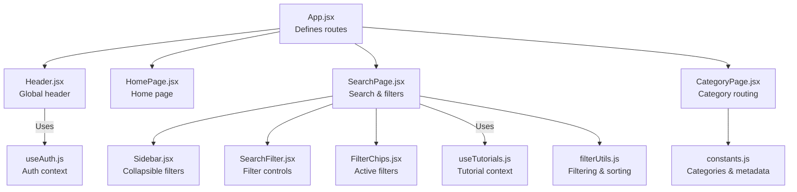
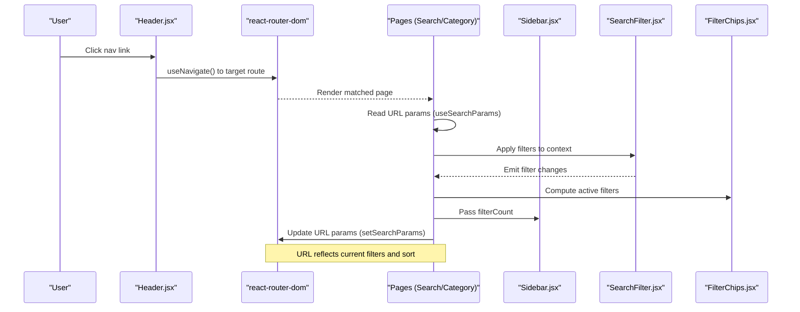
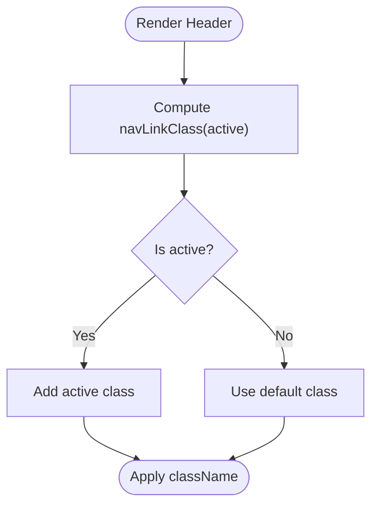
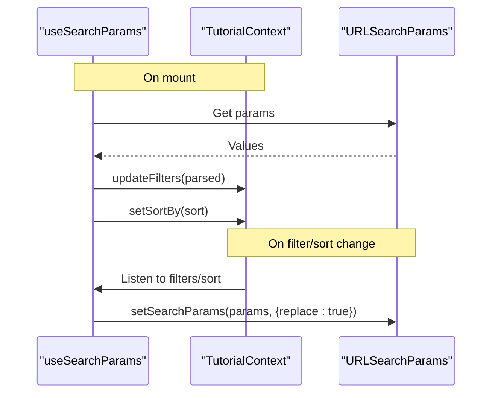
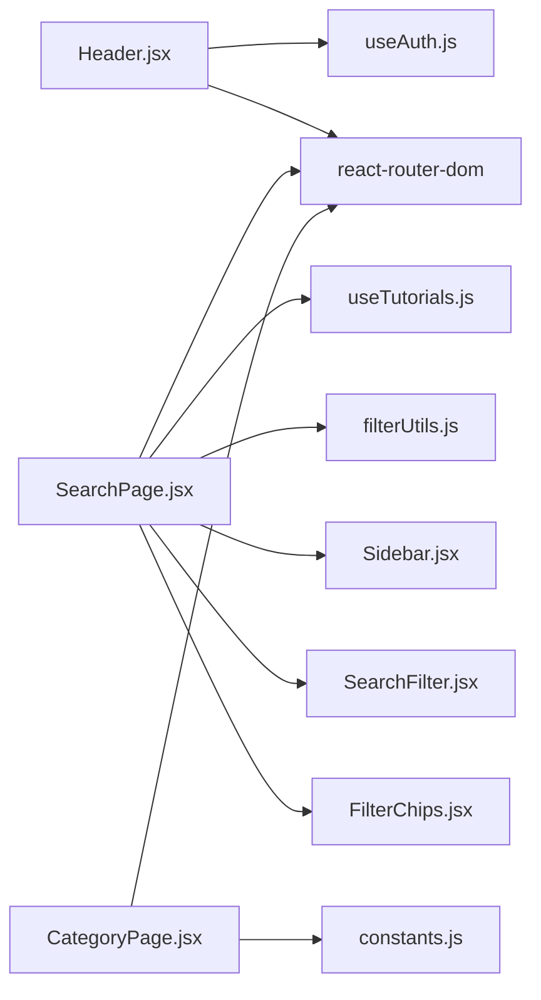

# Navigation Patterns

<cite>
**Referenced Files in This Document**
- [Header.jsx](file://src/components/layout/Header.jsx)
- [Header.module.css](file://src/components/layout/Header.module.css)
- [Sidebar.jsx](file://src/components/layout/Sidebar.jsx)
- [Sidebar.module.css](file://src/components/layout/Sidebar.module.css)
- [App.jsx](file://src/App.jsx)
- [HomePage.jsx](file://src/pages/HomePage.jsx)
- [SearchPage.jsx](file://src/pages/SearchPage.jsx)
- [CategoryPage.jsx](file://src/pages\CategoryPage.jsx)
- [SearchFilter.jsx](file://src/components/SearchFilter.jsx)
- [FilterChips.jsx](file://src/components/FilterChips.jsx)
- [filterUtils.js](file://src/utils/filterUtils.js)
- [constants.js](file://src/data/constants.js)
- [useAuth.js](file://src/hooks/useAuth.js)
- [useTutorials.js](file://src/hooks/useTutorials.js)
</cite>

## Table of Contents
1. [Introduction](#introduction)
2. [Project Structure](#project-structure)
3. [Core Components](#core-components)
4. [Architecture Overview](#architecture-overview)
5. [Detailed Component Analysis](#detailed-component-analysis)
6. [Dependency Analysis](#dependency-analysis)
7. [Performance Considerations](#performance-considerations)
8. [Troubleshooting Guide](#troubleshooting-guide)
9. [Conclusion](#conclusion)

## Introduction
This document explains GameDev Hub’s navigation patterns and user interaction flows. It covers:
- Header navigation: logo linking, main menu items, and authentication-aware sections
- Sidebar navigation: category browsing and filter toggling
- Programmatic navigation via react-router-dom hooks and navigation guards
- URL parameter handling for search queries, categories, and sorting
- Active link highlighting and mobile navigation with responsive design
- Accessibility features and screen reader support
- Navigation performance optimizations and smooth scrolling behaviors
- Persistence of navigation state across reloads and browser history management

## Project Structure
The navigation system spans the app shell, pages, and reusable components:
- App routes define top-level navigation targets
- Header provides global primary navigation and authentication UI
- SearchPage integrates URL-driven filtering and sorting with a collapsible sidebar
- CategoryPage handles dynamic category routing
- Utility modules implement filtering, sorting, and constants for filters

**Diagram sources**
- [App.jsx:21-39](file://src/App.jsx#L21-L39)
- [Header.jsx:8-115](file://src/components/layout/Header.jsx#L8-L115)
- [SearchPage.jsx:12-140](file://src/pages/SearchPage.jsx#L12-L140)
- [CategoryPage.jsx:8-50](file://src/pages/CategoryPage.jsx#L8-L50)
- [Sidebar.jsx:4-23](file://src/components/layout/Sidebar.jsx#L4-L23)
- [SearchFilter.jsx:19-229](file://src/components/SearchFilter.jsx#L19-L229)
- [FilterChips.jsx:6-69](file://src/components/FilterChips.jsx#L6-L69)
- [filterUtils.js:1-99](file://src/utils/filterUtils.js#L1-L99)
- [constants.js:1-71](file://src/data/constants.js#L1-L71)
- [useAuth.js:4-10](file://src/hooks/useAuth.js#L4-L10)
- [useTutorials.js:4-10](file://src/hooks/useTutorials.js#L4-L10)

**Section sources**
- [App.jsx:21-39](file://src/App.jsx#L21-L39)
- [Header.jsx:8-115](file://src/components/layout/Header.jsx#L8-L115)
- [SearchPage.jsx:12-140](file://src/pages/SearchPage.jsx#L12-L140)
- [CategoryPage.jsx:8-50](file://src/pages/CategoryPage.jsx#L8-L50)
- [Sidebar.jsx:4-23](file://src/components/layout/Sidebar.jsx#L4-L23)
- [SearchFilter.jsx:19-229](file://src/components/SearchFilter.jsx#L19-L229)
- [FilterChips.jsx:6-69](file://src/components/FilterChips.jsx#L6-L69)
- [filterUtils.js:1-99](file://src/utils/filterUtils.js#L1-L99)
- [constants.js:1-71](file://src/data/constants.js#L1-L71)
- [useAuth.js:4-10](file://src/hooks/useAuth.js#L4-L10)
- [useTutorials.js:4-10](file://src/hooks/useTutorials.js#L4-L10)

## Core Components
- Header: Provides logo link, primary nav links, theme toggle, and authentication UI. Uses react-router NavLink for active state and useNavigate for programmatic navigation. Implements a mobile hamburger menu with controlled open state.
- Sidebar: Collapsible filter panel with a toggle button and content area. Shows a filter count badge derived from active filters.
- SearchPage: Orchestrates URL parameter synchronization, filter updates, and sorting. Integrates SearchFilter, FilterChips, and TutorialGallery.
- CategoryPage: Resolves category from URL slug and renders matching tutorials with a back link to home.
- SearchFilter: Manages search suggestions, checkbox filters, dropdowns, and emits updates to the parent context.
- FilterChips: Renders active filters as removable chips and supports clearing all filters.
- filterUtils: Implements filtering, sorting, and active filter counting logic.
- constants: Supplies category, difficulty, platform, engine version, and duration range options.

**Section sources**
- [Header.jsx:8-115](file://src/components/layout/Header.jsx#L8-L115)
- [Sidebar.jsx:4-23](file://src/components/layout/Sidebar.jsx#L4-L23)
- [SearchPage.jsx:12-140](file://src/pages/SearchPage.jsx#L12-L140)
- [CategoryPage.jsx:8-50](file://src/pages/CategoryPage.jsx#L8-L50)
- [SearchFilter.jsx:19-229](file://src/components/SearchFilter.jsx#L19-L229)
- [FilterChips.jsx:6-69](file://src/components/FilterChips.jsx#L6-L69)
- [filterUtils.js:1-99](file://src/utils/filterUtils.js#L1-L99)
- [constants.js:1-71](file://src/data/constants.js#L1-L71)

## Architecture Overview
The navigation architecture combines declarative routing with reactive URL synchronization and context-driven filtering.

**Diagram sources**
- [Header.jsx:14-18](file://src/components/layout/Header.jsx#L14-L18)
- [SearchPage.jsx:22-81](file://src/pages/SearchPage.jsx#L22-L81)
- [Sidebar.jsx:4-23](file://src/components/layout/Sidebar.jsx#L4-L23)
- [SearchFilter.jsx:66-80](file://src/components/SearchFilter.jsx#L66-L80)
- [FilterChips.jsx:6-69](file://src/components/FilterChips.jsx#L6-L69)

## Detailed Component Analysis

### Header Navigation
- Logo linking: The logo is a Link to the home route, ensuring consistent branding and navigation.
- Main menu items: Three NavLink entries for Home, Browse, and Submit. Active state is styled via a dynamic className computed by a function passed to NavLink.
- Authentication-aware UI:
  - Authenticated: Avatar area with profile link, user name, and logout button. Logout triggers context logout and navigates to home.
  - Anonymous: Login and Signup buttons.
- Mobile navigation: A hamburger menu toggles a vertical mobile menu containing theme toggle, nav links, and auth section. Clicking any item closes the mobile menu.

Accessibility and styling:
- Active link highlighting uses a dedicated active class applied conditionally.
- Mobile menu visibility is controlled via a boolean state and CSS classes.
- Hamburger button includes an aria-label for assistive technologies.

Programmatic navigation:
- useNavigate is used to redirect after logout.
- useLocation and navigation guards are not implemented in the current code; redirects occur post-action.

Responsive design:
- Desktop: Nav links and auth buttons are visible.
- Mobile: Nav and desktop auth are hidden; hamburger appears. Clicking hamburger toggles the mobile menu.

**Section sources**
- [Header.jsx:20-35](file://src/components/layout/Header.jsx#L20-L35)
- [Header.jsx:37-73](file://src/components/layout/Header.jsx#L37-L73)
- [Header.jsx:96-112](file://src/components/layout/Header.jsx#L96-L112)
- [Header.module.css:165-188](file://src/components/layout/Header.module.css#L165-L188)

#### Header Active Link Highlighting

**Diagram sources**
- [Header.jsx:20-21](file://src/components/layout/Header.jsx#L20-L21)

### Sidebar Navigation and Filter Access
- Toggle behavior: The sidebar exposes a toggle button that switches content visibility. The button label includes a filter count badge when greater than zero.
- Content layout: The sidebar wraps filter controls and uses CSS to adapt layout on smaller screens.
- Interaction pattern: Users open the sidebar to reveal SearchFilter controls, apply filters, and see live updates reflected in the URL and results.

Responsive adaptation:
- On larger screens, the sidebar is fixed and sticky.
- On tablets and below, the sidebar becomes a top-level toggleable panel.

**Section sources**
- [Sidebar.jsx:4-23](file://src/components/layout/Sidebar.jsx#L4-L23)
- [Sidebar.module.css:39-58](file://src/components/layout/Sidebar.module.css#L39-L58)

### Programmatic Navigation and Guards
- Programmatic navigation:
  - useNavigate is used in the header to redirect to the home route after logout.
  - useNavigate is also used inside NavLink onClick handlers to close the mobile menu upon selection.
- Navigation guards:
  - No explicit guards are present in the current code. Authentication-sensitive routes are rendered but not protected at the router level here.

Recommendation:
- Implement route guards using a higher-order component or a wrapper around routes to protect authenticated-only paths.

**Section sources**
- [Header.jsx:14-18](file://src/components/layout/Header.jsx#L14-L18)
- [Header.jsx:25-34](file://src/components/layout/Header.jsx#L25-L34)

### URL Parameter Handling for Search, Filters, and Sorting
- Reading URL params on mount:
  - useSearchParams reads query parameters and populates the filter context.
  - Supported parameters include q (search), cat (categories), diff (difficulties), plat (platforms), ver (engine versions), dur (duration range), rating (minimum rating), and sort (sorting option).
- Synchronizing changes to URL:
  - After initialization, changes to filters and sort are written back to the URL using setSearchParams with replace semantics to avoid polluting history.
- Resetting filters:
  - Clears the filter context and replaces URL params to remove filter keys.

**Diagram sources**
- [SearchPage.jsx:22-81](file://src/pages/SearchPage.jsx#L22-L81)

**Section sources**
- [SearchPage.jsx:22-81](file://src/pages/SearchPage.jsx#L22-L81)

### Breadcrumb Navigation and Active Links
- Breadcrumb-like patterns:
  - CategoryPage displays a back link to home and a category header with icon and label.
  - HomePage includes category cards linking to category pages.
- Active link highlighting:
  - Header applies an active class to NavLink when the route matches.
  - No explicit breadcrumbs are implemented; category navigation uses a back link and category-specific header.

**Section sources**
- [CategoryPage.jsx:29-40](file://src/pages/CategoryPage.jsx#L29-L40)
- [HomePage.jsx:68-79](file://src/pages/HomePage.jsx#L68-L79)
- [Header.jsx:20-21](file://src/components/layout/Header.jsx#L20-L21)

### Mobile Navigation Patterns and Responsive Adaptations
- Hamburger menu:
  - Controlled via a boolean state; toggles open/close and updates the hamburger glyph.
  - Closes automatically when selecting a navigation item.
- Responsive breakpoints:
  - Desktop: Nav links and auth buttons visible; mobile menu hidden.
  - Mobile: Nav and desktop auth hidden; hamburger visible; clicking toggles the mobile menu.

**Section sources**
- [Header.jsx:96-112](file://src/components/layout/Header.jsx#L96-L112)
- [Header.module.css:165-188](file://src/components/layout/Header.module.css#L165-L188)

### Keyboard Navigation and Screen Reader Support
- Keyboard navigation:
  - Interactive elements (buttons, checkboxes, selects) are keyboard focusable by default.
  - No custom keyboard handlers are implemented for navigation menus.
- Screen reader support:
  - The hamburger button includes aria-label.
  - Filter chips include aria-labels for remove actions.
  - No ARIA roles or live regions are used for navigation announcements.

Recommendations:
- Add role="navigation" to navigation containers.
- Use aria-current for active links.
- Consider adding skip-links and focus traps for mobile menus.

**Section sources**
- [Header.jsx:99](file://src/components/layout/Header.jsx#L99)
- [FilterChips.jsx:56](file://src/components/FilterChips.jsx#L56)

### Navigation Performance and Smooth Scrolling
- Performance optimizations:
  - Lazy-loading of pages reduces initial bundle size.
  - Debounced search input prevents excessive re-filtering during typing.
  - URL synchronization uses replace to avoid unnecessary history entries.
- Smooth scrolling:
  - No explicit scroll-behavior is configured in the current code.

Recommendations:
- Consider smooth scrolling to top on route changes.
- Defer heavy computations until after debounce settles.

**Section sources**
- [App.jsx:13-19](file://src/App.jsx#L13-L19)
- [SearchFilter.jsx:22](file://src/components/SearchFilter.jsx#L22)
- [SearchPage.jsx:80](file://src/pages/SearchPage.jsx#L80)

### Navigation State Persistence Across Reloads and Browser History
- Persistence:
  - URL parameters persist across reloads because they are part of the URL.
  - Local storage is used for recent search suggestions in the search filter component.
- Browser history:
  - setSearchParams with replace avoids pushing new entries onto the history stack.
  - Programmatic navigation via useNavigate occurs after logout.

**Section sources**
- [SearchPage.jsx:80](file://src/pages/SearchPage.jsx#L80)
- [SearchFilter.jsx:11-17](file://src/components/SearchFilter.jsx#L11-L17)

## Dependency Analysis
The navigation system relies on:
- react-router-dom for routing, navigation, and URL parameter handling
- Context providers for authentication and tutorial data
- Utility modules for filtering and sorting
- CSS modules for responsive layouts

**Diagram sources**
- [Header.jsx:3-6](file://src/components/layout/Header.jsx#L3-L6)
- [SearchPage.jsx:2-10](file://src/pages/SearchPage.jsx#L2-L10)
- [CategoryPage.jsx:2-6](file://src/pages/CategoryPage.jsx#L2-L6)
- [useAuth.js:4-10](file://src/hooks/useAuth.js#L4-L10)
- [useTutorials.js:4-10](file://src/hooks/useTutorials.js#L4-L10)
- [filterUtils.js:1-99](file://src/utils/filterUtils.js#L1-L99)
- [constants.js:1-71](file://src/data/constants.js#L1-L71)

**Section sources**
- [Header.jsx:3-6](file://src/components/layout/Header.jsx#L3-L6)
- [SearchPage.jsx:2-10](file://src/pages/SearchPage.jsx#L2-L10)
- [CategoryPage.jsx:2-6](file://src/pages/CategoryPage.jsx#L2-L6)
- [useAuth.js:4-10](file://src/hooks/useAuth.js#L4-L10)
- [useTutorials.js:4-10](file://src/hooks/useTutorials.js#L4-L10)
- [filterUtils.js:1-99](file://src/utils/filterUtils.js#L1-L99)
- [constants.js:1-71](file://src/data/constants.js#L1-L71)

## Performance Considerations
- Route lazy loading reduces initial payload.
- Debounce improves responsiveness during text input.
- Replace-based URL updates minimize history growth.
- Sticky positioning in sidebar keeps filters accessible while scrolling.

[No sources needed since this section provides general guidance]

## Troubleshooting Guide
- Active link not highlighted:
  - Verify the active class is applied conditionally in the navLinkClass function and that the route matches the NavLink path.
- Mobile menu does not close:
  - Ensure the onClick handler on NavLink calls the toggle function and that the state is reset appropriately.
- Filters not appearing in URL:
  - Confirm that setSearchParams is called after initialization and that the ref flag allows syncing.
- Filter count badge not updating:
  - Ensure getActiveFilterCount is computed from the current filters and passed to the sidebar toggle label.
- Logout does not redirect:
  - Confirm useNavigate is invoked after logout and that the mobile menu is closed.

**Section sources**
- [Header.jsx:20-21](file://src/components/layout/Header.jsx#L20-L21)
- [Header.jsx:25-34](file://src/components/layout/Header.jsx#L25-L34)
- [SearchPage.jsx:52-57](file://src/pages/SearchPage.jsx#L52-L57)
- [SearchPage.jsx:80](file://src/pages/SearchPage.jsx#L80)
- [filterUtils.js:88-98](file://src/utils/filterUtils.js#L88-L98)

## Conclusion
GameDev Hub’s navigation system blends declarative routing with reactive URL synchronization and context-driven filtering. The header provides consistent primary navigation and authentication-aware UI, while the SearchPage integrates robust URL parameter handling for search, filters, and sorting. The sidebar offers a compact, responsive filter interface, and the category pages enable deep-linking by category. Enhancements such as navigation guards, ARIA improvements, and explicit smooth scrolling would further strengthen the user experience.