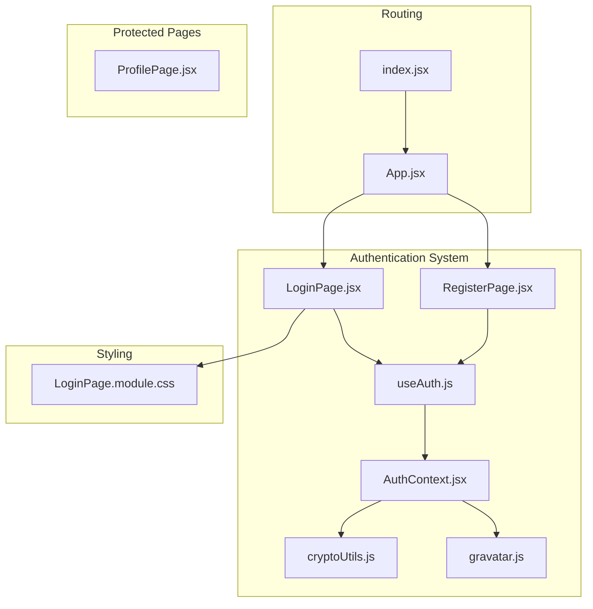
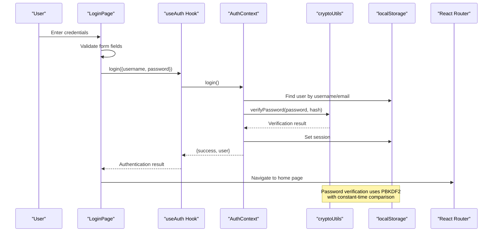
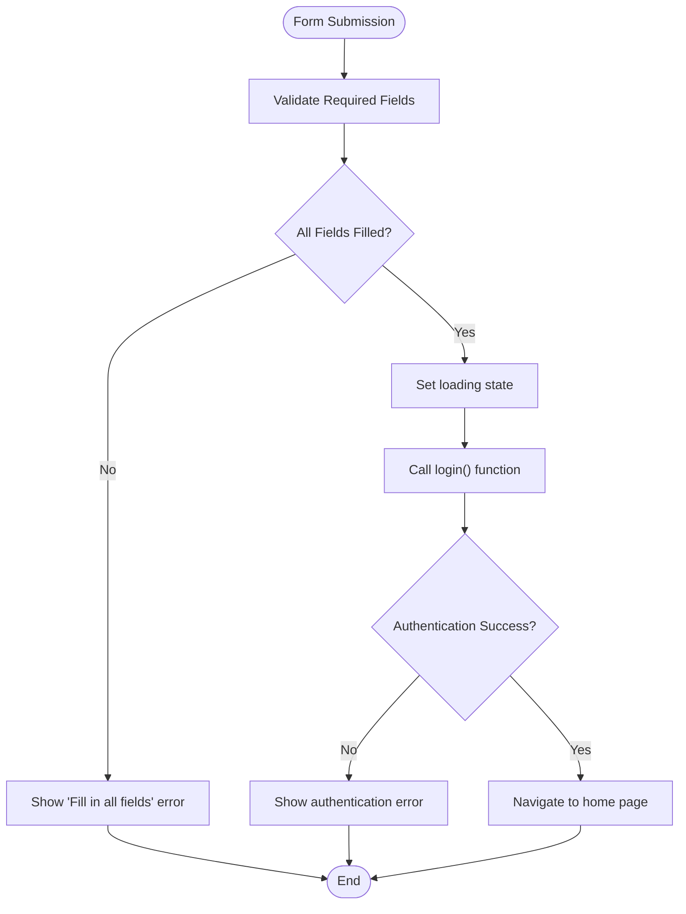
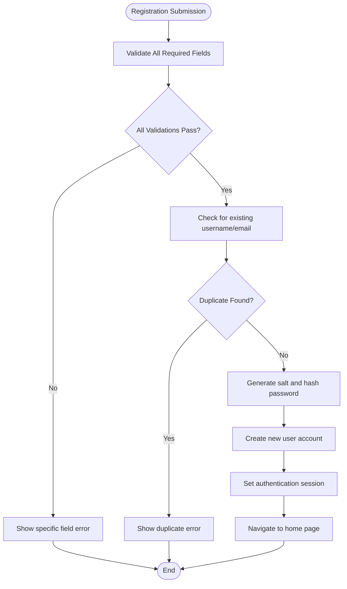
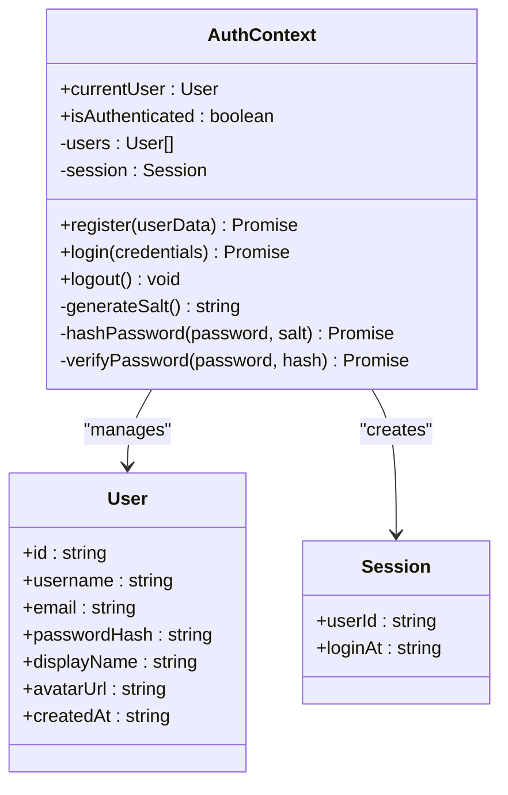
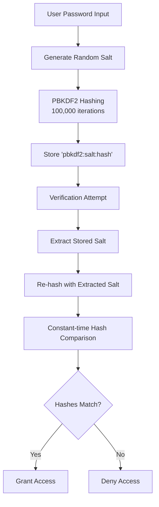
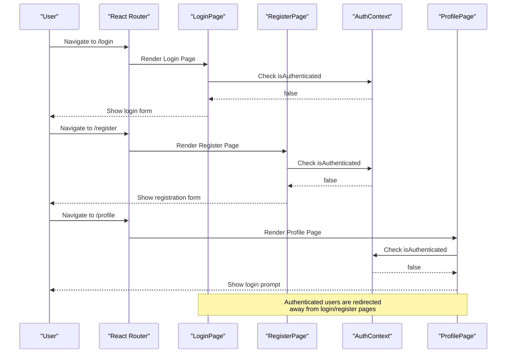
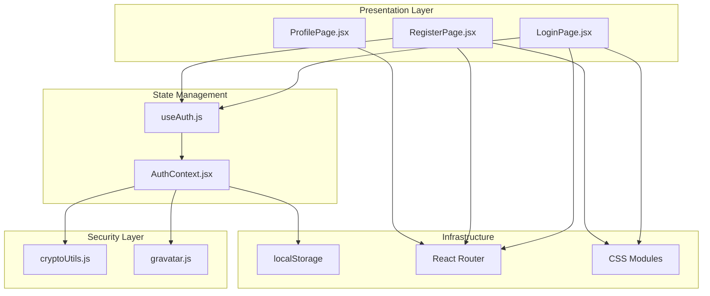

# Authentication Pages

<cite>
**Referenced Files in This Document**
- [LoginPage.jsx](file://src/pages/LoginPage.jsx)
- [RegisterPage.jsx](file://src/pages/RegisterPage.jsx)
- [AuthContext.jsx](file://src/contexts/AuthContext.jsx)
- [cryptoUtils.js](file://src/utils/cryptoUtils.js)
- [useAuth.js](file://src/hooks/useAuth.js)
- [LoginPage.module.css](file://src/pages/LoginPage.module.css)
- [App.jsx](file://src/App.jsx)
- [index.jsx](file://src/index.jsx)
- [ProfilePage.jsx](file://src/pages/ProfilePage.jsx)
- [gravatar.js](file://src/utils/gravatar.js)
</cite>

## Table of Contents
1. [Introduction](#introduction)
2. [Project Structure](#project-structure)
3. [Core Components](#core-components)
4. [Architecture Overview](#architecture-overview)
5. [Detailed Component Analysis](#detailed-component-analysis)
6. [Dependency Analysis](#dependency-analysis)
7. [Performance Considerations](#performance-considerations)
8. [Troubleshooting Guide](#troubleshooting-guide)
9. [Conclusion](#conclusion)

## Introduction
This document provides comprehensive documentation for the authentication system, focusing on the Login and Registration pages. It covers form validation, error handling, password security, authentication state management, and navigation flows. The authentication system uses a local storage-based approach with PBKDF2 password hashing for security.

## Project Structure
The authentication system is organized across several key files:

**Diagram sources**
- [LoginPage.jsx:1-82](file://src/pages/LoginPage.jsx#L1-L82)
- [RegisterPage.jsx:1-132](file://src/pages/RegisterPage.jsx#L1-L132)
- [AuthContext.jsx:1-105](file://src/contexts/AuthContext.jsx#L1-L105)
- [useAuth.js:1-11](file://src/hooks/useAuth.js#L1-L11)
- [cryptoUtils.js:1-70](file://src/utils/cryptoUtils.js#L1-L70)
- [gravatar.js:1-35](file://src/utils/gravatar.js#L1-L35)
- [App.jsx:1-51](file://src/App.jsx#L1-L51)
- [index.jsx:1-27](file://src/index.jsx#L1-L27)
- [LoginPage.module.css:1-105](file://src/pages/LoginPage.module.css#L1-L105)
- [ProfilePage.jsx:1-387](file://src/pages/ProfilePage.jsx#L1-L387)

**Section sources**
- [App.jsx:17-38](file://src/App.jsx#L17-L38)
- [index.jsx:14-22](file://src/index.jsx#L14-L22)

## Core Components
The authentication system consists of four primary components:

### Authentication Context Provider
The AuthContext manages the complete authentication state, including user registration, login, logout, and session management. It provides secure password handling using PBKDF2 with salt generation.

### Login Page Component
Implements the login form with username/email and password fields, real-time validation, loading states, and error handling. Features automatic redirection for authenticated users.

### Registration Page Component
Provides comprehensive user registration with field validation, password strength requirements, and account creation workflow. Includes optional display name field.

### Authentication Hook
The useAuth hook provides convenient access to authentication functions and state throughout the application.

**Section sources**
- [AuthContext.jsx:13-104](file://src/contexts/AuthContext.jsx#L13-L104)
- [LoginPage.jsx:6-82](file://src/pages/LoginPage.jsx#L6-L82)
- [RegisterPage.jsx:6-132](file://src/pages/RegisterPage.jsx#L6-L132)
- [useAuth.js:4-10](file://src/hooks/useAuth.js#L4-L10)

## Architecture Overview
The authentication architecture follows a layered approach with clear separation of concerns:

**Diagram sources**
- [LoginPage.jsx:19-39](file://src/pages/LoginPage.jsx#L19-L39)
- [AuthContext.jsx:54-86](file://src/contexts/AuthContext.jsx#L54-L86)
- [cryptoUtils.js:50-65](file://src/utils/cryptoUtils.js#L50-L65)

The system maintains authentication state through localStorage with session tokens and user data persistence. The architecture ensures secure password handling while maintaining a responsive user experience.

**Section sources**
- [AuthContext.jsx:14-20](file://src/contexts/AuthContext.jsx#L14-L20)
- [AuthContext.jsx:88-90](file://src/contexts/AuthContext.jsx#L88-L90)

## Detailed Component Analysis

### Login Form Implementation
The login form provides a streamlined authentication experience with comprehensive validation:

#### Form Fields and Validation
- Username/Email field: Accepts either username or email for flexible login
- Password field: Secure input with masking
- Real-time validation prevents submission with empty fields
- Trimmed input handling for whitespace removal

#### Error Handling and User Experience
- Clear error messaging for invalid credentials
- Loading states during authentication requests
- Automatic redirection for authenticated users
- Accessible form structure with proper labeling

#### Security Features
- Input sanitization through trimming
- Secure password transmission
- Immediate feedback for authentication failures

**Diagram sources**
- [LoginPage.jsx:19-39](file://src/pages/LoginPage.jsx#L19-L39)

**Section sources**
- [LoginPage.jsx:7-17](file://src/pages/LoginPage.jsx#L7-L17)
- [LoginPage.jsx:19-39](file://src/pages/LoginPage.jsx#L19-L39)
- [LoginPage.jsx:49-72](file://src/pages/LoginPage.jsx#L49-L72)

### Registration Form Implementation
The registration form implements comprehensive user validation and account creation:

#### Field Validation Rules
- Username validation: 3-20 characters, alphanumeric and underscore only
- Email validation: RFC-compliant email format
- Password validation: Minimum 6 characters
- Display name: Optional, defaults to username if not provided
- Maximum length constraints for all fields

#### Account Creation Workflow
- Duplicate detection for usernames and emails
- Secure password hashing with PBKDF2
- Automatic session creation upon successful registration
- Gravatar integration for avatar generation

#### User Experience Enhancements
- Required field indicators with asterisks
- Real-time validation feedback
- Loading states during registration process
- Clear error messages for validation failures

**Diagram sources**
- [RegisterPage.jsx:21-67](file://src/pages/RegisterPage.jsx#L21-L67)
- [AuthContext.jsx:22-52](file://src/contexts/AuthContext.jsx#L22-L52)

**Section sources**
- [RegisterPage.jsx:6-19](file://src/pages/RegisterPage.jsx#L6-L19)
- [RegisterPage.jsx:21-67](file://src/pages/RegisterPage.jsx#L21-L67)
- [RegisterPage.jsx:77-123](file://src/pages/RegisterPage.jsx#L77-L123)

### Authentication State Management
The AuthContext provides centralized authentication state management with the following capabilities:

#### User Operations
- Registration: Validates input, checks duplicates, hashes passwords, creates accounts
- Login: Authenticates users with support for legacy hash migration
- Logout: Clears session state

#### Session Management
- Local storage persistence for users and sessions
- Current user derivation from session data
- Automatic session cleanup on logout

#### Security Features
- PBKDF2 password hashing with configurable iterations
- Salt generation for cryptographic security
- Constant-time password verification
- Legacy hash detection and migration

**Diagram sources**
- [AuthContext.jsx:13-104](file://src/contexts/AuthContext.jsx#L13-L104)

**Section sources**
- [AuthContext.jsx:22-52](file://src/contexts/AuthContext.jsx#L22-L52)
- [AuthContext.jsx:54-86](file://src/contexts/AuthContext.jsx#L54-L86)
- [AuthContext.jsx:88-90](file://src/contexts/AuthContext.jsx#L88-L90)

### Password Security Implementation
The system implements robust password security using modern cryptographic standards:

#### PBKDF2 Implementation
- 100,000 iterations for computational cost
- 256-bit hash length for strong output
- SHA-256 algorithm for cryptographic security
- Random salt generation for each password

#### Security Features
- Constant-time comparison to prevent timing attacks
- Legacy hash detection and automatic migration
- Secure random salt generation using Web Crypto API
- Immediate hash verification during login

**Diagram sources**
- [cryptoUtils.js:25-48](file://src/utils/cryptoUtils.js#L25-L48)
- [cryptoUtils.js:50-65](file://src/utils/cryptoUtils.js#L50-L65)

**Section sources**
- [cryptoUtils.js:1-70](file://src/utils/cryptoUtils.js#L1-L70)
- [AuthContext.jsx:63-75](file://src/contexts/AuthContext.jsx#L63-L75)

### Navigation and Redirect Flow
The authentication system implements intelligent navigation patterns:

#### Protected Route Behavior
- Unauthenticated users attempting to access protected routes are redirected to login
- Authenticated users are redirected away from login/register pages
- Automatic redirects after successful authentication

#### Route Configuration
- Lazy-loaded authentication pages for performance
- Centralized route definition in App component
- Proper nesting of AuthProvider for context availability

**Diagram sources**
- [LoginPage.jsx:14-17](file://src/pages/LoginPage.jsx#L14-L17)
- [RegisterPage.jsx:16-19](file://src/pages/RegisterPage.jsx#L16-L19)
- [ProfilePage.jsx:44-52](file://src/pages/ProfilePage.jsx#L44-L52)

**Section sources**
- [App.jsx:17-38](file://src/App.jsx#L17-L38)
- [index.jsx:14-22](file://src/index.jsx#L14-L22)

## Dependency Analysis
The authentication system demonstrates clean dependency management with clear separation of concerns:

**Diagram sources**
- [LoginPage.jsx:3](file://src/pages/LoginPage.jsx#L3)
- [RegisterPage.jsx:3](file://src/pages/RegisterPage.jsx#L3)
- [useAuth.js:2](file://src/hooks/useAuth.js#L2)
- [AuthContext.jsx:2](file://src/contexts/AuthContext.jsx#L2)
- [cryptoUtils.js:4-8](file://src/utils/cryptoUtils.js#L4-L8)
- [gravatar.js:1](file://src/utils/gravatar.js#L1)

**Section sources**
- [AuthContext.jsx:1-11](file://src/contexts/AuthContext.jsx#L1-L11)
- [useAuth.js:1-11](file://src/hooks/useAuth.js#L1-L11)

## Performance Considerations
The authentication system implements several performance optimizations:

### Lazy Loading
- Authentication pages are lazy-loaded to reduce initial bundle size
- Profile page uses React.lazy for efficient code splitting

### State Management Efficiency
- Memoized current user calculation prevents unnecessary re-renders
- Local storage caching reduces server round-trips
- Efficient session management with minimal state updates

### Security Performance
- PBKDF2 iterations configured for optimal security/performance balance
- Constant-time comparisons prevent timing attacks without significant overhead
- Salt generation uses efficient Web Crypto API

## Troubleshooting Guide

### Common Authentication Issues
- **Login Failures**: Check username/email and password combination
- **Registration Errors**: Verify field validation requirements
- **Session Problems**: Clear browser storage and retry authentication
- **Navigation Issues**: Ensure proper route configuration

### Debugging Authentication Flow
1. Verify AuthProvider is properly wrapped around the application
2. Check localStorage for 'kaz_users' and 'kaz_session' entries
3. Monitor network requests for authentication endpoints
4. Validate password hash format in localStorage

### Security Considerations
- Passwords are hashed with PBKDF2 and salt
- Legacy hash migration occurs automatically
- Constant-time comparison prevents timing attacks
- Input sanitization prevents injection attacks

**Section sources**
- [AuthContext.jsx:63-75](file://src/contexts/AuthContext.jsx#L63-L75)
- [cryptoUtils.js:58-64](file://src/utils/cryptoUtils.js#L58-L64)

## Conclusion
The authentication system provides a comprehensive, secure, and user-friendly solution for user authentication. It combines modern cryptographic practices with excellent user experience design, featuring:

- Secure password handling with PBKDF2
- Comprehensive form validation and error handling
- Intuitive navigation and redirect flows
- Responsive design with accessible form elements
- Clean architecture with clear separation of concerns

The system successfully balances security requirements with usability, providing a solid foundation for user authentication in the application.