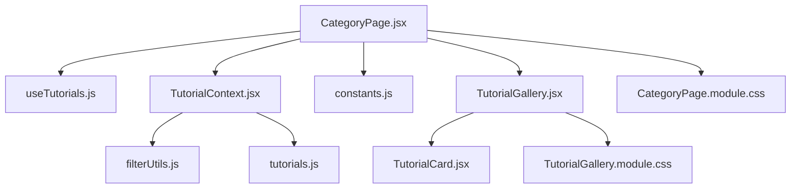
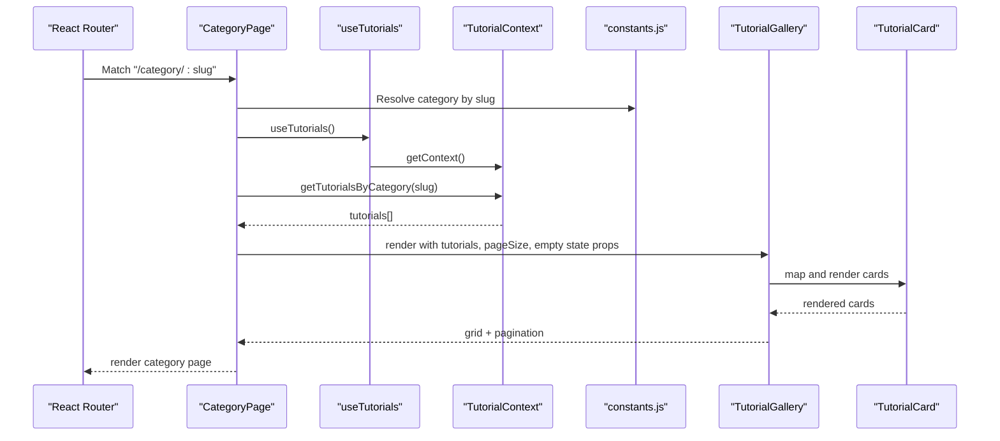
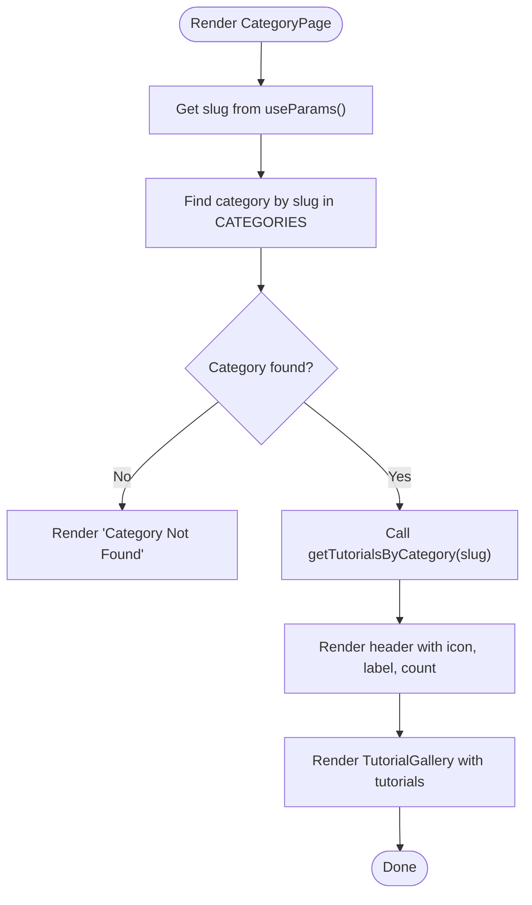
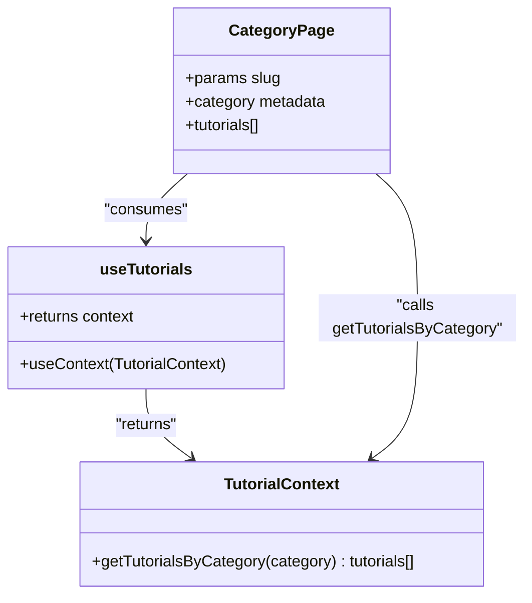
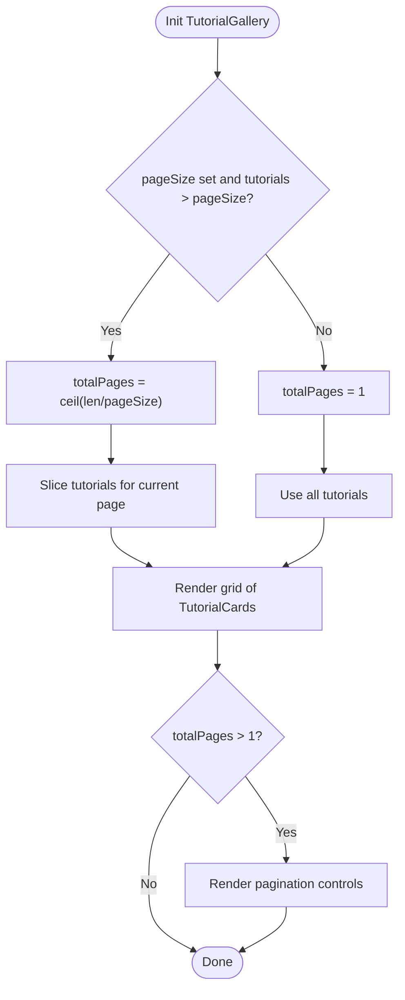
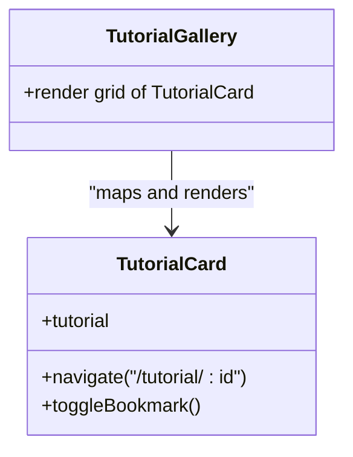
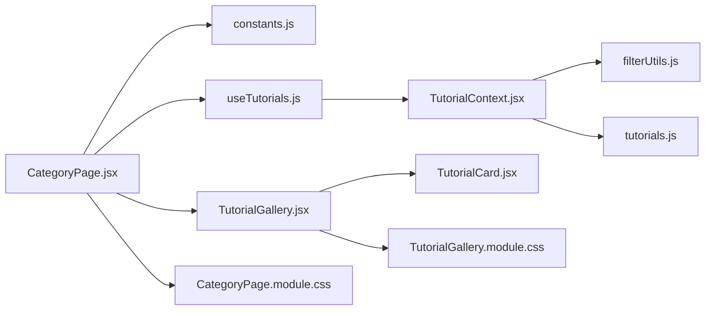

# Category Page

<cite>
**Referenced Files in This Document**
- [CategoryPage.jsx](file://src/pages/CategoryPage.jsx)
- [CategoryPage.module.css](file://src/pages/CategoryPage.module.css)
- [useTutorials.js](file://src/hooks/useTutorials.js)
- [TutorialContext.jsx](file://src/contexts/TutorialContext.jsx)
- [TutorialGallery.jsx](file://src/components/TutorialGallery.jsx)
- [TutorialGallery.module.css](file://src/components/TutorialGallery.module.css)
- [TutorialCard.jsx](file://src/components/TutorialCard.jsx)
- [constants.js](file://src/data/constants.js)
- [tutorials.js](file://src/data/tutorials.js)
- [filterUtils.js](file://src/utils/filterUtils.js)
- [propTypeShapes.js](file://src/utils/propTypeShapes.js)
- [formatUtils.js](file://src/utils/formatUtils.js)
</cite>

## Table of Contents
1. [Introduction](#introduction)
2. [Project Structure](#project-structure)
3. [Core Components](#core-components)
4. [Architecture Overview](#architecture-overview)
5. [Detailed Component Analysis](#detailed-component-analysis)
6. [Dependency Analysis](#dependency-analysis)
7. [Performance Considerations](#performance-considerations)
8. [Troubleshooting Guide](#troubleshooting-guide)
9. [Conclusion](#conclusion)

## Introduction
This document explains the CategoryPage component and its ecosystem for category-based tutorial filtering and display. It covers how category metadata drives the page header, how the tutorial gallery renders category-specific content, and how the system integrates with useTutorials to retrieve filtered data. It also documents the responsive grid layout, tutorial card rendering within category context, and SEO considerations for category pages.

## Project Structure
The CategoryPage resides under src/pages and orchestrates category metadata, filtering, and gallery rendering. It relies on shared utilities, constants, and components.

**Diagram sources**
- [CategoryPage.jsx:1-51](file://src/pages/CategoryPage.jsx#L1-L51)
- [useTutorials.js:1-11](file://src/hooks/useTutorials.js#L1-L11)
- [TutorialContext.jsx:1-542](file://src/contexts/TutorialContext.jsx#L1-L542)
- [constants.js:1-71](file://src/data/constants.js#L1-L71)
- [TutorialGallery.jsx:1-138](file://src/components/TutorialGallery.jsx#L1-L138)
- [TutorialCard.jsx:1-110](file://src/components/TutorialCard.jsx#L1-L110)
- [CategoryPage.module.css:1-48](file://src/pages/CategoryPage.module.css#L1-L48)
- [TutorialGallery.module.css:1-114](file://src/components/TutorialGallery.module.css#L1-L114)
- [filterUtils.js:1-99](file://src/utils/filterUtils.js#L1-L99)
- [tutorials.js:1-522](file://src/data/tutorials.js#L1-L522)

**Section sources**
- [CategoryPage.jsx:1-51](file://src/pages/CategoryPage.jsx#L1-L51)
- [constants.js:1-71](file://src/data/constants.js#L1-L71)

## Core Components
- CategoryPage: Extracts category slug from route params, resolves category metadata, retrieves filtered tutorials, and renders the header and gallery.
- useTutorials: Hook that exposes TutorialContext methods, including category-based filtering.
- TutorialContext: Provides filtered tutorials, sorting, and category-specific getters backed by local storage and computed data.
- TutorialGallery: Renders a paginated, responsive grid of TutorialCards for a given dataset.
- TutorialCard: Individual card rendering with metadata, badges, and interactive actions.
- Constants and Data: Category metadata, difficulty, platform, and tutorial datasets.

**Section sources**
- [CategoryPage.jsx:8-50](file://src/pages/CategoryPage.jsx#L8-L50)
- [useTutorials.js:4-10](file://src/hooks/useTutorials.js#L4-L10)
- [TutorialContext.jsx:446-451](file://src/contexts/TutorialContext.jsx#L446-L451)
- [TutorialGallery.jsx:23-125](file://src/components/TutorialGallery.jsx#L23-L125)
- [TutorialCard.jsx:14-104](file://src/components/TutorialCard.jsx#L14-L104)
- [constants.js:1-71](file://src/data/constants.js#L1-L71)
- [tutorials.js:1-522](file://src/data/tutorials.js#L1-L522)

## Architecture Overview
The CategoryPage composes category metadata and filtered tutorials, then delegates rendering to TutorialGallery. TutorialGallery uses a responsive CSS Grid and pagination controls to present TutorialCards.

**Diagram sources**
- [CategoryPage.jsx:9-47](file://src/pages/CategoryPage.jsx#L9-L47)
- [useTutorials.js:4-10](file://src/hooks/useTutorials.js#L4-L10)
- [TutorialContext.jsx:446-451](file://src/contexts/TutorialContext.jsx#L446-L451)
- [constants.js:1-8](file://src/data/constants.js#L1-L8)
- [TutorialGallery.jsx:42-47](file://src/components/TutorialGallery.jsx#L42-L47)
- [TutorialCard.jsx:14-104](file://src/components/TutorialCard.jsx#L14-L104)

## Detailed Component Analysis

### CategoryPage Component
- Route integration: Uses useParams to extract slug and resolve category metadata from constants.
- Data retrieval: Calls useTutorials to access getTutorialsByCategory and fetches tutorials for the current slug.
- Rendering: Displays a back link, category icon and label, tutorial count, and passes category-specific props to TutorialGallery.
- Fallback: If category is not found, renders a friendly not-found message with a link back to home.

**Diagram sources**
- [CategoryPage.jsx:9-47](file://src/pages/CategoryPage.jsx#L9-L47)
- [constants.js:1-8](file://src/data/constants.js#L1-L8)
- [TutorialContext.jsx:446-451](file://src/contexts/TutorialContext.jsx#L446-L451)

**Section sources**
- [CategoryPage.jsx:8-50](file://src/pages/CategoryPage.jsx#L8-L50)
- [CategoryPage.module.css:1-48](file://src/pages/CategoryPage.module.css#L1-L48)

### Category Metadata Handling
- Categories are defined centrally with value, label, and icon.
- CategoryPage uses the slug to match against category.value and displays category.label and category.icon in the header.
- This ensures consistency across the app and simplifies adding/removing categories.

**Section sources**
- [constants.js:1-8](file://src/data/constants.js#L1-L8)
- [CategoryPage.jsx:12-39](file://src/pages/CategoryPage.jsx#L12-L39)

### Integration with useTutorials and TutorialContext
- useTutorials enforces context usage and returns the context object.
- TutorialContext provides getTutorialsByCategory, which filters all tutorials by category field.
- This separation keeps UI logic in CategoryPage while data logic remains in the provider.

**Diagram sources**
- [CategoryPage.jsx:9-13](file://src/pages/CategoryPage.jsx#L9-L13)
- [useTutorials.js:4-10](file://src/hooks/useTutorials.js#L4-L10)
- [TutorialContext.jsx:446-451](file://src/contexts/TutorialContext.jsx#L446-L451)

**Section sources**
- [useTutorials.js:4-10](file://src/hooks/useTutorials.js#L4-L10)
- [TutorialContext.jsx:446-451](file://src/contexts/TutorialContext.jsx#L446-L451)

### Tutorial Gallery Implementation
- Props: Accepts tutorials, pageSize, and empty state messages. Automatically resets pagination when tutorials change.
- Pagination: Calculates total pages and slices the dataset for the current page. Provides previous/next buttons and numbered pages with ellipsis for large ranges.
- Responsive grid: CSS Grid with auto-fill and minmax to adapt to viewport width. Media queries adjust column counts for smaller screens.

**Diagram sources**
- [TutorialGallery.jsx:34-47](file://src/components/TutorialGallery.jsx#L34-L47)
- [TutorialGallery.jsx:88-122](file://src/components/TutorialGallery.jsx#L88-L122)
- [TutorialGallery.module.css:38-65](file://src/components/TutorialGallery.module.css#L38-L65)

**Section sources**
- [TutorialGallery.jsx:23-125](file://src/components/TutorialGallery.jsx#L23-L125)
- [TutorialGallery.module.css:1-114](file://src/components/TutorialGallery.module.css#L1-L114)

### Tutorial Card Rendering Within Category Context
- Each card receives a tutorial object and renders thumbnail, duration, platform badge, difficulty, series info, tags, author, and stats.
- Clicking a card navigates to the tutorial detail page.
- Bookmarking requires authentication and toggles user bookmarks stored in local storage.

**Diagram sources**
- [TutorialCard.jsx:14-104](file://src/components/TutorialCard.jsx#L14-L104)
- [TutorialGallery.jsx:73-78](file://src/components/TutorialGallery.jsx#L73-L78)

**Section sources**
- [TutorialCard.jsx:14-104](file://src/components/TutorialCard.jsx#L14-L104)
- [formatUtils.js:1-45](file://src/utils/formatUtils.js#L1-L45)

### Category Navigation System
- CategoryPage uses the slug to select the correct category metadata and pass it to the header.
- The back link routes to the home page, maintaining site navigation flow.
- Category metadata is centralized in constants.js, enabling consistent navigation across the app.

**Section sources**
- [CategoryPage.jsx:29-31](file://src/pages/CategoryPage.jsx#L29-L31)
- [constants.js:1-8](file://src/data/constants.js#L1-L8)

### Responsive Grid Layout
- CSS Grid with repeat(auto-fill, minmax(300px, 1fr)) ensures a flexible layout.
- Media queries adjust grid columns for tablets and phones.
- Pagination controls remain centered and styled consistently.

**Section sources**
- [TutorialGallery.module.css:38-65](file://src/components/TutorialGallery.module.css#L38-L65)
- [TutorialGallery.module.css:50-65](file://src/components/TutorialGallery.module.css#L50-L65)

### SEO Considerations for Category Pages
- Dynamic page title and meta description could be derived from category.label and category.icon to improve search visibility.
- Canonical URLs and structured data (e.g., breadcrumbs) would enhance SEO.
- Since CategoryPage currently does not set document head metadata, consider integrating a library like react-helmet to set title and description dynamically based on category metadata.

[No sources needed since this section provides general guidance]

## Dependency Analysis
- CategoryPage depends on constants for category metadata and on TutorialContext for filtered data retrieval.
- TutorialGallery depends on TutorialCard and consumes tutorialShape for prop validation.
- useTutorials enforces context usage and returns the provider’s methods.
- filterUtils powers filtering logic used by TutorialContext.

**Diagram sources**
- [CategoryPage.jsx:1-6](file://src/pages/CategoryPage.jsx#L1-L6)
- [constants.js:1-71](file://src/data/constants.js#L1-L71)
- [useTutorials.js:1-11](file://src/hooks/useTutorials.js#L1-L11)
- [TutorialContext.jsx:1-542](file://src/contexts/TutorialContext.jsx#L1-L542)
- [filterUtils.js:1-99](file://src/utils/filterUtils.js#L1-L99)
- [tutorials.js:1-522](file://src/data/tutorials.js#L1-L522)
- [TutorialGallery.jsx:1-138](file://src/components/TutorialGallery.jsx#L1-L138)
- [TutorialCard.jsx:1-110](file://src/components/TutorialCard.jsx#L1-L110)
- [TutorialGallery.module.css:1-114](file://src/components/TutorialGallery.module.css#L1-L114)
- [CategoryPage.module.css:1-48](file://src/pages/CategoryPage.module.css#L1-L48)

**Section sources**
- [propTypeShapes.js:3-26](file://src/utils/propTypeShapes.js#L3-L26)
- [TutorialGallery.jsx:5](file://src/components/TutorialGallery.jsx#L5)

## Performance Considerations
- Filtering and sorting are computed via useMemo in TutorialContext, preventing unnecessary recalculations when dependencies are unchanged.
- Pagination reduces DOM rendering by slicing arrays for the current page.
- Lazy image loading and placeholder handling in TutorialCard minimize layout shifts and improve perceived performance.

[No sources needed since this section provides general guidance]

## Troubleshooting Guide
- Category not found: If the slug does not match any category, CategoryPage renders a friendly message with a link back to home.
- Empty category: TutorialGallery renders an EmptyState with customizable title and message when no tutorials are available.
- Pagination resets: When tutorials change, TutorialGallery resets to page 1 to ensure correct display.

**Section sources**
- [CategoryPage.jsx:15-24](file://src/pages/CategoryPage.jsx#L15-L24)
- [TutorialGallery.jsx:36-38](file://src/components/TutorialGallery.jsx#L36-L38)
- [TutorialGallery.jsx:79-86](file://src/components/TutorialGallery.jsx#L79-L86)

## Conclusion
The CategoryPage component provides a focused, category-driven experience by combining category metadata, context-based filtering, and a responsive gallery of tutorial cards. Its modular design enables easy maintenance and extension, while the centralized constants and utilities support consistent behavior across the application.