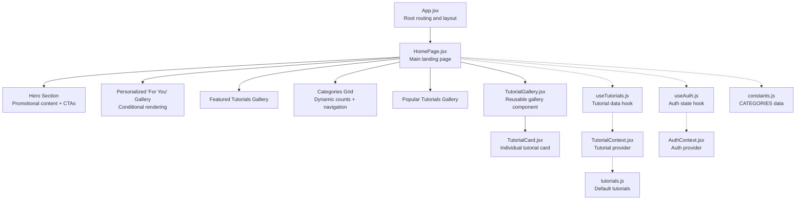
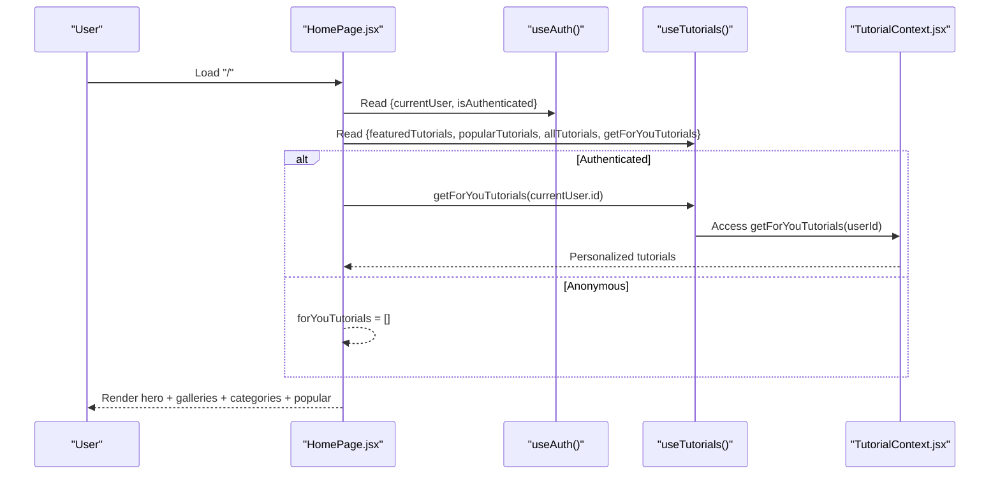
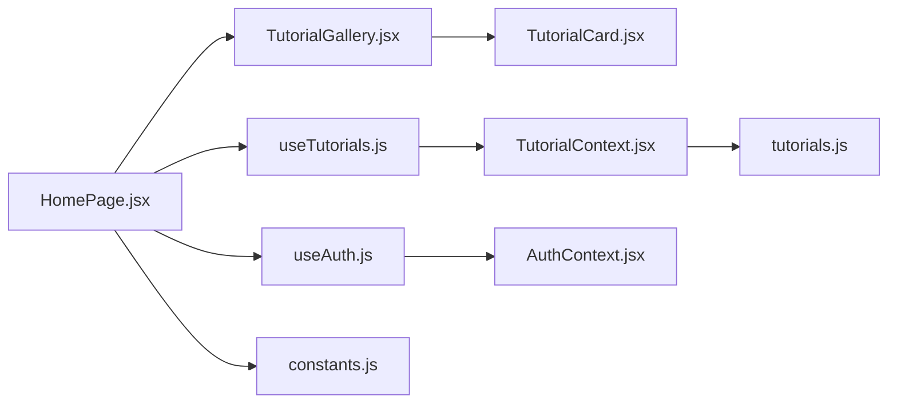

# Home Page

<cite>
**Referenced Files in This Document**
- [HomePage.jsx](file://src/pages/HomePage.jsx)
- [HomePage.module.css](file://src/pages/HomePage.module.css)
- [TutorialGallery.jsx](file://src/components/TutorialGallery.jsx)
- [TutorialGallery.module.css](file://src/components/TutorialGallery.module.css)
- [TutorialCard.jsx](file://src/components/TutorialCard.jsx)
- [TutorialCard.module.css](file://src/components/TutorialCard.module.css)
- [useTutorials.js](file://src/hooks/useTutorials.js)
- [useAuth.js](file://src/hooks/useAuth.js)
- [TutorialContext.jsx](file://src/contexts/TutorialContext.jsx)
- [AuthContext.jsx](file://src/contexts/AuthContext.jsx)
- [constants.js](file://src/data/constants.js)
- [tutorials.js](file://src/data/tutorials.js)
- [App.jsx](file://src/App.jsx)
</cite>

## Table of Contents
1. [Introduction](#introduction)
2. [Project Structure](#project-structure)
3. [Core Components](#core-components)
4. [Architecture Overview](#architecture-overview)
5. [Detailed Component Analysis](#detailed-component-analysis)
6. [Dependency Analysis](#dependency-analysis)
7. [Performance Considerations](#performance-considerations)
8. [Troubleshooting Guide](#troubleshooting-guide)
9. [Conclusion](#conclusion)

## Introduction
This document provides comprehensive documentation for the HomePage component, focusing on the hero section with call-to-action buttons and promotional content, the personalized "For You" section driven by user-followed tags, the featured tutorials gallery, the popular tutorials display, and the category browsing grid. It also covers the integration with useTutorials and useAuth hooks, component composition patterns, responsive design implementation, and user experience considerations for both authenticated and anonymous users.

## Project Structure
The HomePage is the main landing page rendered at the root route. It composes several reusable components and integrates with global contexts for data and authentication state.

**Diagram sources**
- [App.jsx:21-48](file://src/App.jsx#L21-L48)
- [HomePage.jsx:9-95](file://src/pages/HomePage.jsx#L9-L95)
- [TutorialGallery.jsx:23-125](file://src/components/TutorialGallery.jsx#L23-L125)
- [TutorialCard.jsx:14-105](file://src/components/TutorialCard.jsx#L14-L105)
- [useTutorials.js:4-10](file://src/hooks/useTutorials.js#L4-L10)
- [useAuth.js:4-10](file://src/hooks/useAuth.js#L4-L10)
- [TutorialContext.jsx:18-542](file://src/contexts/TutorialContext.jsx#L18-L542)
- [AuthContext.jsx:13-105](file://src/contexts/AuthContext.jsx#L13-L105)
- [constants.js:1-71](file://src/data/constants.js#L1-L71)
- [tutorials.js:1-522](file://src/data/tutorials.js#L1-L522)

**Section sources**
- [App.jsx:21-48](file://src/App.jsx#L21-L48)
- [HomePage.jsx:9-95](file://src/pages/HomePage.jsx#L9-L95)

## Core Components
- HomePage: Orchestrates hero, personalized "For You", featured, categories, and popular sections. Uses useAuth and useTutorials hooks to derive state and data.
- TutorialGallery: Reusable gallery component supporting pagination, view-all links, and empty states.
- TutorialCard: Individual tutorial card with thumbnail, metadata, badges, and interactive actions (bookmark, navigate).
- useAuth/useTutorials: Lightweight hooks that safely access AuthContext and TutorialContext respectively.
- TutorialContext/AuthContext: Providers exposing tutorial data, filtering/sorting, personalization (followed tags), and authentication state.

Key responsibilities:
- Personalization: "For You" section uses followed tags to surface relevant tutorials for authenticated users.
- Discovery: Featured and Popular galleries highlight curated and trending content.
- Navigation: Categories grid provides quick access with dynamic counts and links to category pages.
- UX: Responsive design ensures optimal viewing across devices.

**Section sources**
- [HomePage.jsx:9-95](file://src/pages/HomePage.jsx#L9-L95)
- [TutorialGallery.jsx:23-125](file://src/components/TutorialGallery.jsx#L23-L125)
- [TutorialCard.jsx:14-105](file://src/components/TutorialCard.jsx#L14-L105)
- [useTutorials.js:4-10](file://src/hooks/useTutorials.js#L4-L10)
- [useAuth.js:4-10](file://src/hooks/useAuth.js#L4-L10)
- [TutorialContext.jsx:18-542](file://src/contexts/TutorialContext.jsx#L18-L542)
- [AuthContext.jsx:13-105](file://src/contexts/AuthContext.jsx#L13-L105)

## Architecture Overview
The HomePage renders four primary sections:
1. Hero Section: Promotional headline, description, and two call-to-action buttons.
2. Personalized "For You": Conditional gallery for authenticated users based on followed tags.
3. Featured Tutorials: Curated selection with a "View All" link.
4. Categories Grid: Interactive cards with dynamic counts and navigation.
5. Popular Tutorials: Top tutorials by view count with a "View All" link.

**Diagram sources**
- [HomePage.jsx:9-95](file://src/pages/HomePage.jsx#L9-L95)
- [useAuth.js:4-10](file://src/hooks/useAuth.js#L4-L10)
- [useTutorials.js:4-10](file://src/hooks/useTutorials.js#L4-L10)
- [TutorialContext.jsx:341-349](file://src/contexts/TutorialContext.jsx#L341-L349)

## Detailed Component Analysis

### Hero Section
- Purpose: Establish brand positioning and guide user actions.
- Elements:
  - Headline with accent styling.
  - Subtitle highlighting the breadth of tutorials.
  - Two call-to-action buttons:
    - Browse Tutorials: Links to the search page.
    - Share a Tutorial: Links to the submission page.
- Styling: Centered hero with gradient background, animated radial overlays, and responsive typography and spacing.

Responsive behavior:
- Adjusts font sizes and button layout on smaller screens.
- Buttons stack vertically on extra-small screens.

Accessibility and UX:
- Clear contrast and readable typography.
- Hover states provide visual feedback for CTAs.

**Section sources**
- [HomePage.jsx:20-40](file://src/pages/HomePage.jsx#L20-L40)
- [HomePage.module.css:1-186](file://src/pages/HomePage.module.css#L1-L186)

### Personalized "For You" Section
- Trigger: Only visible when the user is authenticated and has followed tags.
- Data source: getForYouTutorials(userId) from TutorialContext.
- Algorithm:
  - Retrieve followed tags for the user.
  - Filter all tutorials to those matching any followed tag.
  - Sort by creation date (newest first).
  - Limit to a fixed number (preview).
- Rendering: Uses TutorialGallery with title and subtitle indicating personalization.

User experience:
- Immediate value for logged-in users by surfacing relevant content.
- Encourages continued engagement by following more tags.

**Section sources**
- [HomePage.jsx:42-51](file://src/pages/HomePage.jsx#L42-L51)
- [TutorialContext.jsx:341-349](file://src/contexts/TutorialContext.jsx#L341-L349)
- [TutorialGallery.jsx:23-125](file://src/components/TutorialGallery.jsx#L23-L125)

### Featured Tutorials Gallery
- Data source: featuredTutorials computed from all tutorials.
- Behavior: Displays tutorials with optional "View All" link leading to the search page.
- Pagination: Not enabled by default; shows all items.

Design:
- Clean header with title and optional subtitle.
- Grid layout adapts to viewport width.

**Section sources**
- [HomePage.jsx:53-61](file://src/pages/HomePage.jsx#L53-L61)
- [TutorialContext.jsx:73-81](file://src/contexts/TutorialContext.jsx#L73-L81)
- [TutorialGallery.jsx:23-125](file://src/components/TutorialGallery.jsx#L23-L125)
- [TutorialGallery.module.css:1-114](file://src/components/TutorialGallery.module.css#L1-L114)

### Popular Tutorials Gallery
- Data source: popularTutorials computed as the top 8 tutorials by view count.
- Behavior: Same gallery pattern as featured with "View All" link.

UX considerations:
- Highlights community favorites.
- Provides easy access to broader discovery via search.

**Section sources**
- [HomePage.jsx:83-91](file://src/pages/HomePage.jsx#L83-L91)
- [TutorialContext.jsx:78-81](file://src/contexts/TutorialContext.jsx#L78-L81)
- [TutorialGallery.jsx:23-125](file://src/components/TutorialGallery.jsx#L23-L125)

### Category Browsing Grid
- Data source: CATEGORIES constant.
- Dynamic counts: getCategoryCount(category) filters all tutorials by category and displays the count on each card.
- Navigation: Each category card links to the category page (/category/:slug).
- Visual design: Cards include icon, label, and count with hover effects and subtle shadows.

Responsive behavior:
- Grid adjusts column count based on viewport width.
- On extra-small screens, reduces to 2 columns for better readability.

**Section sources**
- [HomePage.jsx:63-81](file://src/pages/HomePage.jsx#L63-L81)
- [constants.js:1-71](file://src/data/constants.js#L1-L71)
- [HomePage.module.css:102-143](file://src/pages/HomePage.module.css#L102-L143)

### TutorialCard Component
- Interactions:
  - Clicking the card navigates to the tutorial detail page.
  - Bookmark toggling requires authentication; otherwise redirects to login.
- Visual indicators:
  - Thumbnail with lazy loading and fallback placeholder.
  - Duration badge and platform badge.
  - Freshness badge derived from consensus voting.
  - Completion indicator for authenticated users.
- Metadata: Title, description, tags, author, stats, and series information when applicable.

Accessibility:
- Keyboard navigable via role and tabIndex.
- Clear focus states and semantic structure.

**Section sources**
- [TutorialCard.jsx:14-105](file://src/components/TutorialCard.jsx#L14-L105)
- [TutorialCard.module.css:1-244](file://src/components/TutorialCard.module.css#L1-L244)

### Component Composition Patterns
- HomePage composes multiple sections, each encapsulated in reusable components (TutorialGallery).
- Conditional rendering: "For You" section only appears for authenticated users with followed tags.
- Shared props: TutorialGallery accepts tutorials, title, subtitle, and optional viewAllLink, enabling consistent presentation across sections.

Benefits:
- Separation of concerns and testability.
- Consistent UX across different content types.

**Section sources**
- [HomePage.jsx:9-95](file://src/pages/HomePage.jsx#L9-L95)
- [TutorialGallery.jsx:23-125](file://src/components/TutorialGallery.jsx#L23-L125)

### Responsive Design Implementation
- HomePage.module.css:
  - Hero title and subtitle scale down on smaller screens.
  - Action buttons stack vertically on extra-small screens.
  - Categories grid switches to 2-column layout on small screens.
- TutorialGallery.module.css:
  - Grid template columns adjust from 300px+ to single column on small screens.
  - Pagination controls remain centered with appropriate spacing.
- TutorialCard.module.css:
  - Card body and meta layout adapt to narrow widths.

Media queries ensure optimal readability and touch targets across breakpoints.

**Section sources**
- [HomePage.module.css:158-185](file://src/pages/HomePage.module.css#L158-L185)
- [TutorialGallery.module.css:50-65](file://src/components/TutorialGallery.module.css#L50-L65)
- [TutorialCard.module.css:12-17](file://src/components/TutorialCard.module.css#L12-L17)

### User Experience Considerations
- Authenticated users:
  - See "For You" section with personalized tutorials.
  - Can bookmark tutorials and mark completion.
  - Freshness consensus helps assess tutorial relevance.
- Anonymous users:
  - Miss personalized content but still see featured, popular, and categories.
  - Bookmark actions redirect to login, encouraging registration.

Consistency:
- Uniform gallery headers and view-all links.
- Consistent card design and interaction patterns.

**Section sources**
- [HomePage.jsx:16-16](file://src/pages/HomePage.jsx#L16-L16)
- [TutorialCard.jsx:25-37](file://src/components/TutorialCard.jsx#L25-L37)
- [TutorialContext.jsx:341-349](file://src/contexts/TutorialContext.jsx#L341-L349)

## Dependency Analysis
- HomePage depends on:
  - useAuth for authentication state.
  - useTutorials for tutorial data and personalization.
  - constants.js for category metadata.
  - TutorialGallery for rendering tutorial lists.
- TutorialGallery depends on:
  - TutorialCard for individual items.
  - EmptyState for empty results.
- Hooks depend on contexts:
  - useAuth -> AuthContext
  - useTutorials -> TutorialContext

**Diagram sources**
- [HomePage.jsx:9-95](file://src/pages/HomePage.jsx#L9-L95)
- [useAuth.js:4-10](file://src/hooks/useAuth.js#L4-L10)
- [useTutorials.js:4-10](file://src/hooks/useTutorials.js#L4-L10)
- [TutorialGallery.jsx:23-125](file://src/components/TutorialGallery.jsx#L23-L125)
- [TutorialCard.jsx:14-105](file://src/components/TutorialCard.jsx#L14-L105)
- [TutorialContext.jsx:18-542](file://src/contexts/TutorialContext.jsx#L18-L542)
- [AuthContext.jsx:13-105](file://src/contexts/AuthContext.jsx#L13-L105)
- [constants.js:1-71](file://src/data/constants.js#L1-L71)
- [tutorials.js:1-522](file://src/data/tutorials.js#L1-L522)

**Section sources**
- [HomePage.jsx:9-95](file://src/pages/HomePage.jsx#L9-L95)
- [TutorialGallery.jsx:23-125](file://src/components/TutorialGallery.jsx#L23-L125)
- [TutorialCard.jsx:14-105](file://src/components/TutorialCard.jsx#L14-L105)
- [useTutorials.js:4-10](file://src/hooks/useTutorials.js#L4-L10)
- [useAuth.js:4-10](file://src/hooks/useAuth.js#L4-L10)
- [TutorialContext.jsx:18-542](file://src/contexts/TutorialContext.jsx#L18-L542)
- [AuthContext.jsx:13-105](file://src/contexts/AuthContext.jsx#L13-L105)
- [constants.js:1-71](file://src/data/constants.js#L1-L71)
- [tutorials.js:1-522](file://src/data/tutorials.js#L1-L522)

## Performance Considerations
- Memoization:
  - TutorialContext computes featured, popular, and filtered lists using useMemo to avoid unnecessary recalculations.
- Pagination:
  - TutorialGallery supports pagination for large sets; HomePage does not enable it for featured/popular, keeping initial render lightweight.
- Lazy loading:
  - TutorialCard uses lazy image loading and a fallback placeholder to reduce render-blocking resources.
- Local storage:
  - Authentication and tutorial interactions persist in local storage, minimizing network requests during typical usage.

Recommendations:
- Consider enabling pagination for large "For You" lists if user tag sets grow substantially.
- Debounce category filtering if additional filters are introduced.

**Section sources**
- [TutorialContext.jsx:37-65](file://src/contexts/TutorialContext.jsx#L37-L65)
- [TutorialContext.jsx:73-81](file://src/contexts/TutorialContext.jsx#L73-L81)
- [TutorialGallery.jsx:40-47](file://src/components/TutorialGallery.jsx#L40-L47)
- [TutorialCard.jsx:19-20](file://src/components/TutorialCard.jsx#L19-L20)

## Troubleshooting Guide
Common issues and resolutions:
- "For You" section not appearing:
  - Ensure the user is authenticated and has followed tags. The section conditionally renders only when both are true.
- Bookmark actions redirect to login:
  - This is expected for anonymous users. Prompt users to log in to manage bookmarks.
- Category counts appear incorrect:
  - Verify that allTutorials includes submissions and that categories match tutorial.category values.
- Featured or Popular lists empty:
  - Confirm that tutorials.js includes isFeatured flags and that viewCount values are populated.

Debug tips:
- Inspect useAuth and useTutorials hook return values.
- Check TutorialContext computations for featured/popular and getForYouTutorials.
- Validate constants.js categories and tutorials.js data shapes.

**Section sources**
- [HomePage.jsx:42-51](file://src/pages/HomePage.jsx#L42-L51)
- [TutorialCard.jsx:25-37](file://src/components/TutorialCard.jsx#L25-L37)
- [TutorialContext.jsx:341-349](file://src/contexts/TutorialContext.jsx#L341-L349)
- [constants.js:1-71](file://src/data/constants.js#L1-L71)
- [tutorials.js:1-522](file://src/data/tutorials.js#L1-L522)

## Conclusion
The HomePage delivers a cohesive, personalized, and discoverable experience. It leverages context-provided data and hooks to present targeted content for authenticated users while offering clear pathways for exploration to everyone. The modular composition of TutorialGallery and TutorialCard, combined with thoughtful responsive design, ensures a consistent and accessible user experience across devices and user states.