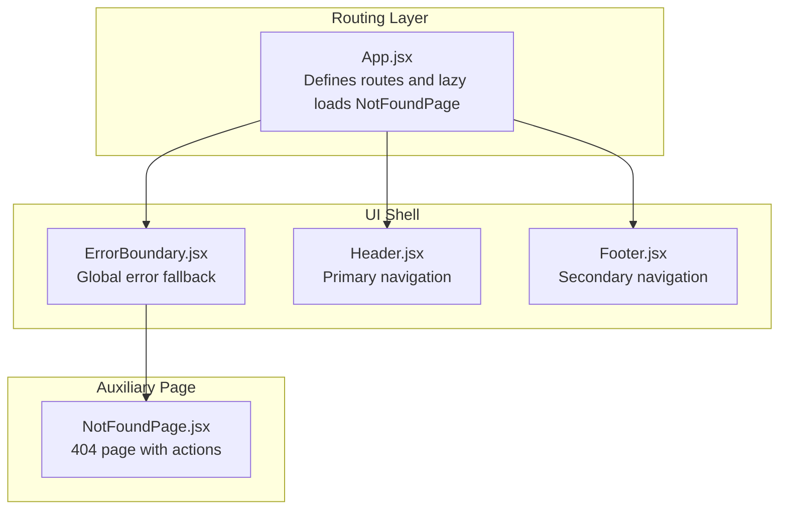
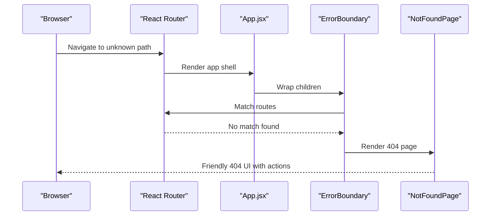
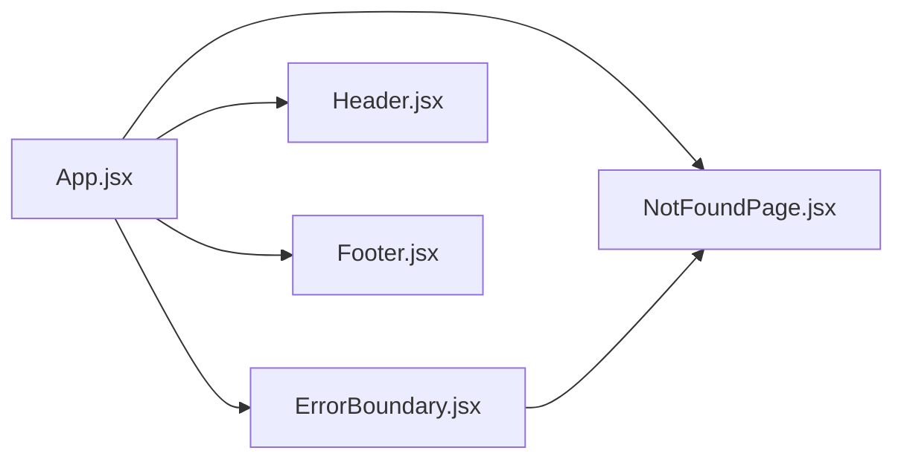

# Other Pages

<cite>
**Referenced Files in This Document**
- [NotFoundPage.jsx](file://src/pages/NotFoundPage.jsx)
- [NotFoundPage.module.css](file://src/pages/NotFoundPage.module.css)
- [ErrorBoundary.jsx](file://src/components/ErrorBoundary.jsx)
- [ErrorBoundary.module.css](file://src/components/ErrorBoundary.module.css)
- [App.jsx](file://src/App.jsx)
- [Header.jsx](file://src/components/layout/Header.jsx)
- [Footer.jsx](file://src/components/layout/Footer.jsx)
</cite>

## Table of Contents
1. [Introduction](#introduction)
2. [Project Structure](#project-structure)
3. [Core Components](#core-components)
4. [Architecture Overview](#architecture-overview)
5. [Detailed Component Analysis](#detailed-component-analysis)
6. [Dependency Analysis](#dependency-analysis)
7. [Performance Considerations](#performance-considerations)
8. [Troubleshooting Guide](#troubleshooting-guide)
9. [Conclusion](#conclusion)

## Introduction
This document focuses on auxiliary page components, primarily the 404 handler NotFoundPage and the global error boundary ErrorBoundary. It explains how 404 errors are handled, how users are redirected or assisted after encountering an error, and how the error boundary integrates with the routing system and error reporting. It also covers UX considerations for error scenarios and recovery pathways, including navigation assistance and helpful links.

## Project Structure
The error-handling ecosystem spans three main areas:
- Routing and lazy loading: App.jsx defines routes and mounts NotFoundPage as the wildcard route.
- Global error boundary: ErrorBoundary.jsx wraps the app shell and provides a fallback UI when errors occur.
- Auxiliary page: NotFoundPage.jsx renders a friendly 404 experience with clear actions.

**Diagram sources**
- [App.jsx:1-51](file://src/App.jsx#L1-L51)
- [ErrorBoundary.jsx:1-63](file://src/components/ErrorBoundary.jsx#L1-L63)
- [NotFoundPage.jsx:1-24](file://src/pages/NotFoundPage.jsx#L1-L24)
- [Header.jsx:1-116](file://src/components/layout/Header.jsx#L1-L116)
- [Footer.jsx:1-51](file://src/components/layout/Footer.jsx#L1-L51)

**Section sources**
- [App.jsx:1-51](file://src/App.jsx#L1-L51)

## Core Components
- NotFoundPage: Renders a 404 experience with a prominent status code, a concise message, and two primary actions: go home and browse tutorials.
- ErrorBoundary: A class-based error boundary that catches JavaScript errors anywhere below it, logs them, reports them via analytics, and displays a user-friendly recovery UI with retry and home actions.

Key behaviors:
- NotFoundPage is lazy-loaded and mounted for unmatched routes.
- ErrorBoundary wraps the entire routing tree to catch rendering errors and promise rejections.
- Both components expose clear recovery actions to guide users back on track.

**Section sources**
- [NotFoundPage.jsx:1-24](file://src/pages/NotFoundPage.jsx#L1-L24)
- [NotFoundPage.module.css:1-73](file://src/pages/NotFoundPage.module.css#L1-L73)
- [ErrorBoundary.jsx:1-63](file://src/components/ErrorBoundary.jsx#L1-L63)
- [ErrorBoundary.module.css:1-83](file://src/components/ErrorBoundary.module.css#L1-L83)

## Architecture Overview
The routing system uses React Router’s wildcard route to direct unknown paths to NotFoundPage. The ErrorBoundary is placed at the top of the UI tree to intercept rendering errors. Together, they form a robust error-handling pipeline that ensures users see helpful guidance rather than blank screens.

**Diagram sources**
- [App.jsx:27-39](file://src/App.jsx#L27-L39)
- [NotFoundPage.jsx:1-24](file://src/pages/NotFoundPage.jsx#L1-L24)

## Detailed Component Analysis

### NotFoundPage
Purpose:
- Provide a clear, friendly 404 experience.
- Offer immediate recovery actions to return users to useful parts of the site.

UX highlights:
- Large status code for visual emphasis.
- Concise explanatory message.
- Two primary actions:
  - Go Home: primary action to return to the homepage.
  - Browse Tutorials: secondary action to explore content.

Integration:
- Lazy-loaded in App.jsx and mapped to the wildcard route to capture unmatched URLs.

Accessibility and usability:
- Centered layout with ample spacing.
- Clear typography hierarchy.
- Hover states for interactive elements.

**Section sources**
- [NotFoundPage.jsx:1-24](file://src/pages/NotFoundPage.jsx#L1-L24)
- [NotFoundPage.module.css:1-73](file://src/pages/NotFoundPage.module.css#L1-L73)
- [App.jsx:19,38](file://src/App.jsx#L19,L38)

### ErrorBoundary
Purpose:
- Provide a global fallback UI when a downstream component throws an error.
- Report errors to analytics for monitoring and debugging.

Behavior:
- Catches errors via static getDerivedStateFromError and componentDidCatch.
- Displays a friendly message, optional error details, and recovery actions.
- Supports resetting the error state to restore normal rendering.

Error reporting:
- Calls a reportError utility during componentDidCatch to log the error and metadata.
- Logs to the console for developer visibility.

Recovery actions:
- Retry button resets the boundary to clear the error.
- Home link navigates to the homepage.

**Section sources**
- [ErrorBoundary.jsx:1-63](file://src/components/ErrorBoundary.jsx#L1-L63)
- [ErrorBoundary.module.css:1-83](file://src/components/ErrorBoundary.module.css#L1-L83)

### Navigation Assistance and Helpful Links
While NotFoundPage provides direct actions, the broader navigation context is provided by Header and Footer:
- Header offers primary navigation links (Home, Browse, Submit) and authentication controls.
- Footer provides categorized links (Browse, Categories, Community) and quick access to registration, sign-in, and profile.

These components complement NotFoundPage by ensuring users can easily find their way back to relevant sections of the site.

**Section sources**
- [Header.jsx:23-35](file://src/components/layout/Header.jsx#L23-L35)
- [Footer.jsx:19-40](file://src/components/layout/Footer.jsx#L19-L40)

## Dependency Analysis
The error-handling stack depends on:
- App.jsx for mounting NotFoundPage and wrapping the routing tree with ErrorBoundary.
- NotFoundPage for rendering the 404 UI.
- ErrorBoundary for catching and recovering from errors.
- Header and Footer for providing navigation context and additional recovery links.

**Diagram sources**
- [App.jsx:1-51](file://src/App.jsx#L1-L51)
- [ErrorBoundary.jsx:1-63](file://src/components/ErrorBoundary.jsx#L1-L63)
- [NotFoundPage.jsx:1-24](file://src/pages/NotFoundPage.jsx#L1-L24)
- [Header.jsx:1-116](file://src/components/layout/Header.jsx#L1-L116)
- [Footer.jsx:1-51](file://src/components/layout/Footer.jsx#L1-L51)

**Section sources**
- [App.jsx:1-51](file://src/App.jsx#L1-L51)

## Performance Considerations
- Lazy-loading of NotFoundPage reduces initial bundle size and defers work until a 404 occurs.
- ErrorBoundary is a lightweight wrapper; keep error payloads minimal to avoid unnecessary memory retention.
- Prefer server-side logging for production errors to offload client-side overhead.

## Troubleshooting Guide
Common scenarios and resolutions:
- Users land on a 404:
  - Verify the requested URL is correct.
  - Use the “Go Home” or “Browse Tutorials” actions to recover.
- Persistent rendering errors:
  - Use the “Try Again” button to reset the error boundary.
  - Check browser console for error messages reported by the boundary.
- Error reporting:
  - Errors are logged to the console and reported via analytics during componentDidCatch.
  - Confirm analytics integration is configured in the environment.

Operational tips:
- Keep error boundaries near the root to maximize coverage.
- Avoid overly verbose error details in production to protect sensitive information.
- Provide actionable links in fallback UIs to improve recovery rates.

**Section sources**
- [ErrorBoundary.jsx:17-24](file://src/components/ErrorBoundary.jsx#L17-L24)
- [ErrorBoundary.jsx:26-28](file://src/components/ErrorBoundary.jsx#L26-L28)
- [NotFoundPage.jsx:13-20](file://src/pages/NotFoundPage.jsx#L13-L20)

## Conclusion
The combination of a lazy-loaded 404 page and a global error boundary creates a resilient user experience. NotFoundPage delivers immediate clarity and recovery actions, while ErrorBoundary ensures that unexpected errors are gracefully contained and reported. Together with navigation aids in Header and Footer, users can quickly recover from both missing pages and runtime errors.