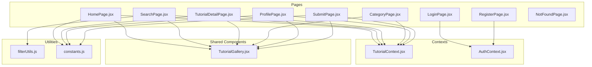
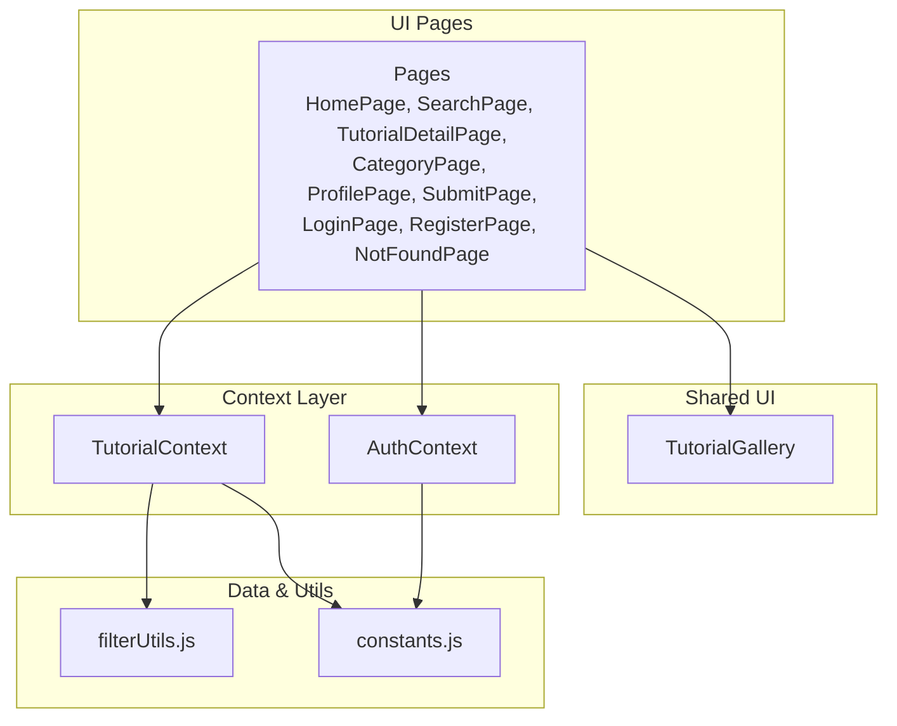
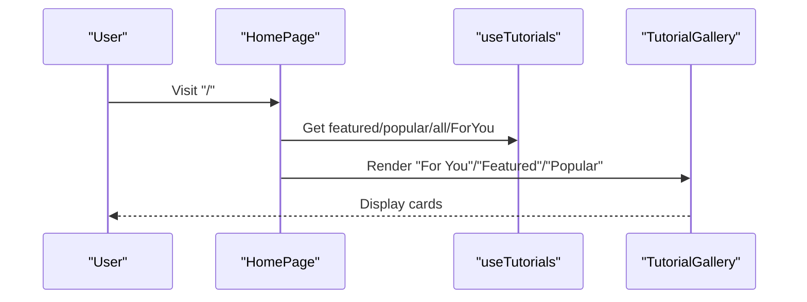
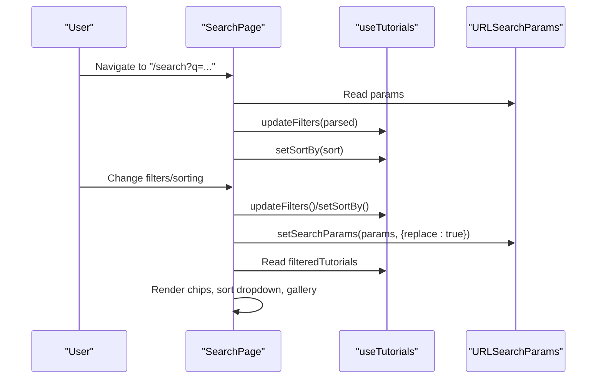
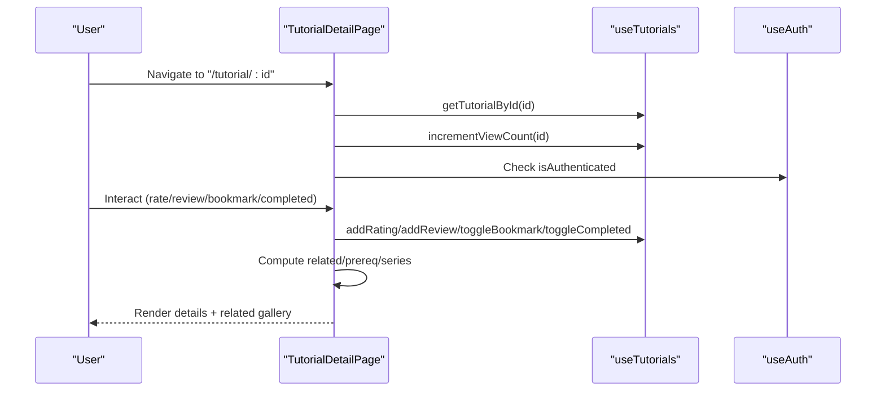
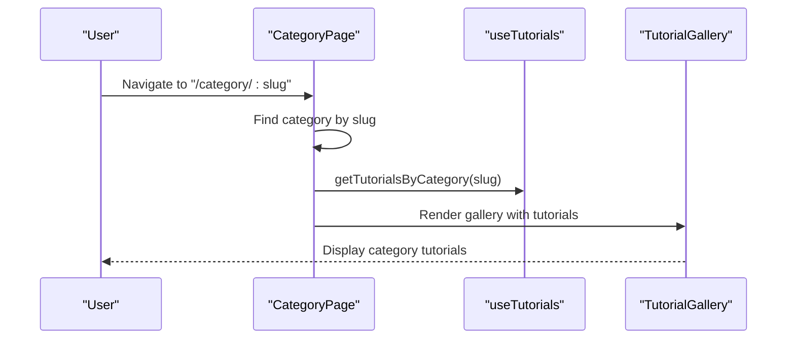
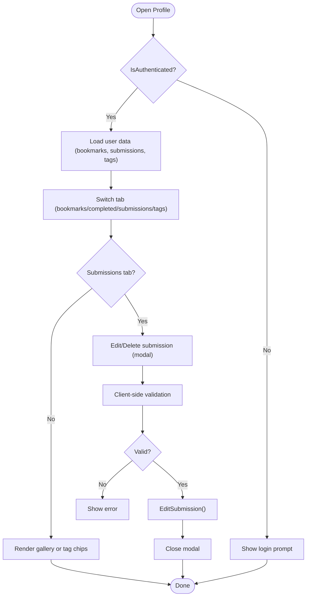
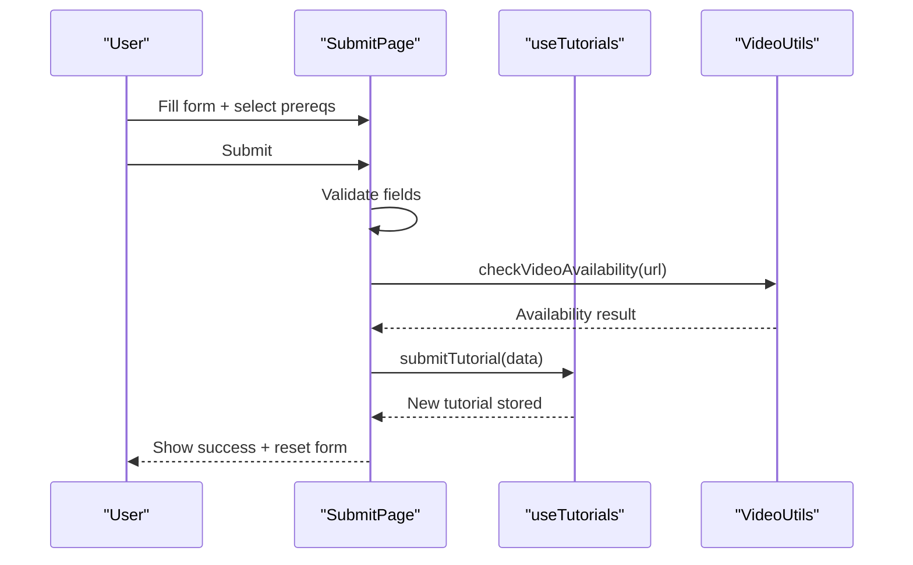
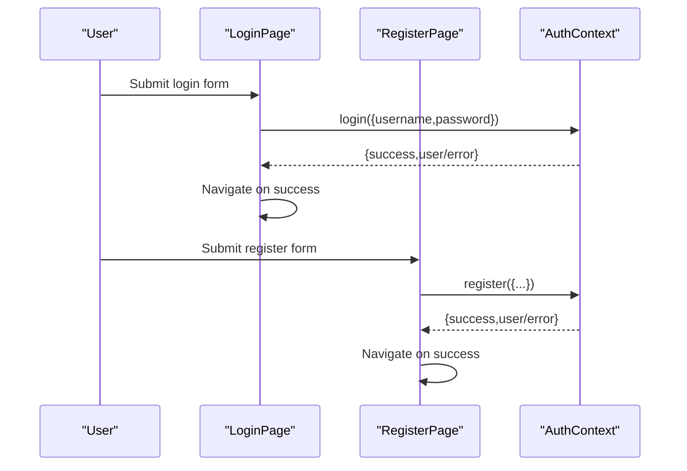
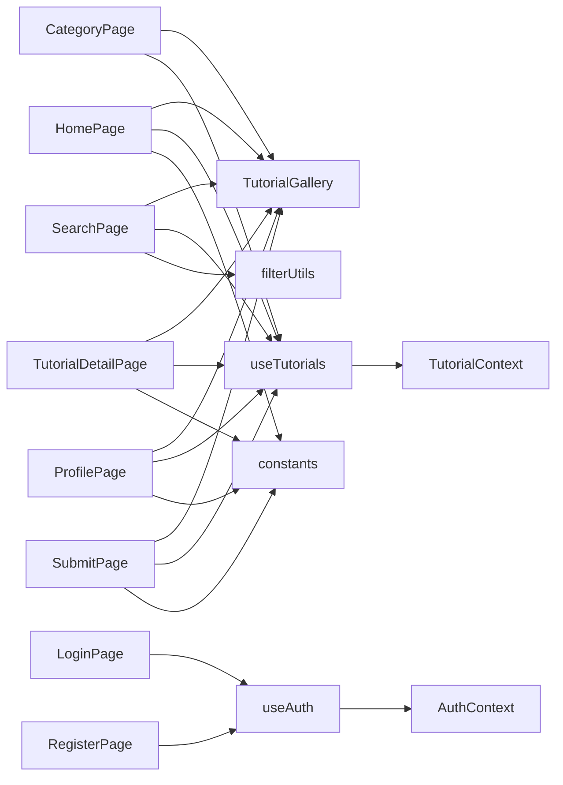

# Page Components

<cite>
**Referenced Files in This Document**
- [HomePage.jsx](file://src/pages/HomePage.jsx)
- [SearchPage.jsx](file://src/pages/SearchPage.jsx)
- [TutorialDetailPage.jsx](file://src/pages/TutorialDetailPage.jsx)
- [CategoryPage.jsx](file://src/pages/CategoryPage.jsx)
- [ProfilePage.jsx](file://src/pages/ProfilePage.jsx)
- [SubmitPage.jsx](file://src/pages/SubmitPage.jsx)
- [LoginPage.jsx](file://src/pages/LoginPage.jsx)
- [RegisterPage.jsx](file://src/pages/RegisterPage.jsx)
- [NotFoundPage.jsx](file://src/pages/NotFoundPage.jsx)
- [TutorialGallery.jsx](file://src/components/TutorialGallery.jsx)
- [TutorialContext.jsx](file://src/contexts/TutorialContext.jsx)
- [AuthContext.jsx](file://src/contexts/AuthContext.jsx)
- [useTutorials.js](file://src/hooks/useTutorials.js)
- [constants.js](file://src/data/constants.js)
- [filterUtils.js](file://src/utils/filterUtils.js)
</cite>

## Table of Contents
1. [Introduction](#introduction)
2. [Project Structure](#project-structure)
3. [Core Components](#core-components)
4. [Architecture Overview](#architecture-overview)
5. [Detailed Component Analysis](#detailed-component-analysis)
6. [Dependency Analysis](#dependency-analysis)
7. [Performance Considerations](#performance-considerations)
8. [Troubleshooting Guide](#troubleshooting-guide)
9. [Conclusion](#conclusion)

## Introduction
This document explains the page components architecture for GameDev Hub. It covers each page’s responsibilities, props interfaces, integration patterns, and state management. It also details advanced features such as URL-synced search, tutorial rendering and related content, category-based filtering, user data management, authentication flows, and error handling.

## Project Structure
The pages are React functional components under src/pages. They rely on:
- Hooks to consume shared contexts (authentication and tutorials)
- Shared components (e.g., TutorialGallery) for consistent UI and pagination
- Utility modules for filtering and constants for categories and options

**Diagram sources**
- [HomePage.jsx:1-95](file://src/pages/HomePage.jsx#L1-L95)
- [SearchPage.jsx:1-141](file://src/pages/SearchPage.jsx#L1-L141)
- [TutorialDetailPage.jsx:1-296](file://src/pages/TutorialDetailPage.jsx#L1-L296)
- [CategoryPage.jsx:1-51](file://src/pages/CategoryPage.jsx#L1-L51)
- [ProfilePage.jsx:1-387](file://src/pages/ProfilePage.jsx#L1-L387)
- [SubmitPage.jsx:1-388](file://src/pages/SubmitPage.jsx#L1-L388)
- [LoginPage.jsx:1-82](file://src/pages/LoginPage.jsx#L1-L82)
- [RegisterPage.jsx:1-132](file://src/pages/RegisterPage.jsx#L1-L132)
- [NotFoundPage.jsx:1-24](file://src/pages/NotFoundPage.jsx#L1-L24)
- [TutorialGallery.jsx:1-138](file://src/components/TutorialGallery.jsx#L1-L138)
- [TutorialContext.jsx:1-542](file://src/contexts/TutorialContext.jsx#L1-L542)
- [AuthContext.jsx:1-105](file://src/contexts/AuthContext.jsx#L1-L105)
- [filterUtils.js:1-99](file://src/utils/filterUtils.js#L1-L99)
- [constants.js:1-71](file://src/data/constants.js#L1-L71)

**Section sources**
- [HomePage.jsx:1-95](file://src/pages/HomePage.jsx#L1-L95)
- [SearchPage.jsx:1-141](file://src/pages/SearchPage.jsx#L1-L141)
- [TutorialDetailPage.jsx:1-296](file://src/pages/TutorialDetailPage.jsx#L1-L296)
- [CategoryPage.jsx:1-51](file://src/pages/CategoryPage.jsx#L1-L51)
- [ProfilePage.jsx:1-387](file://src/pages/ProfilePage.jsx#L1-L387)
- [SubmitPage.jsx:1-388](file://src/pages/SubmitPage.jsx#L1-L388)
- [LoginPage.jsx:1-82](file://src/pages/LoginPage.jsx#L1-L82)
- [RegisterPage.jsx:1-132](file://src/pages/RegisterPage.jsx#L1-L132)
- [NotFoundPage.jsx:1-24](file://src/pages/NotFoundPage.jsx#L1-L24)
- [TutorialGallery.jsx:1-138](file://src/components/TutorialGallery.jsx#L1-L138)
- [TutorialContext.jsx:1-542](file://src/contexts/TutorialContext.jsx#L1-L542)
- [AuthContext.jsx:1-105](file://src/contexts/AuthContext.jsx#L1-L105)
- [filterUtils.js:1-99](file://src/utils/filterUtils.js#L1-L99)
- [constants.js:1-71](file://src/data/constants.js#L1-L71)

## Core Components
- HomePage: Presents hero, “For You”, featured, categories grid, and popular tutorials via TutorialGallery.
- SearchPage: Advanced filtering with URL synchronization, chips, sorting, and gallery.
- TutorialDetailPage: Renders tutorial, related content, ratings, reviews, freshness voting, and actions.
- CategoryPage: Displays tutorials filtered by category with metadata.
- ProfilePage: Tabs for bookmarks, completed, submissions, followed tags; inline edits and deletes.
- SubmitPage: Form validation and submission workflow with prerequisites and video verification.
- LoginPage/RegisterPage: Authentication forms with client-side validation and navigation.
- NotFoundPage: Friendly 404 with navigation options.

**Section sources**
- [HomePage.jsx:9-95](file://src/pages/HomePage.jsx#L9-L95)
- [SearchPage.jsx:12-141](file://src/pages/SearchPage.jsx#L12-L141)
- [TutorialDetailPage.jsx:22-296](file://src/pages/TutorialDetailPage.jsx#L22-L296)
- [CategoryPage.jsx:8-51](file://src/pages/CategoryPage.jsx#L8-L51)
- [ProfilePage.jsx:15-387](file://src/pages/ProfilePage.jsx#L15-L387)
- [SubmitPage.jsx:10-388](file://src/pages/SubmitPage.jsx#L10-L388)
- [LoginPage.jsx:6-82](file://src/pages/LoginPage.jsx#L6-L82)
- [RegisterPage.jsx:6-132](file://src/pages/RegisterPage.jsx#L6-L132)
- [NotFoundPage.jsx:5-24](file://src/pages/NotFoundPage.jsx#L5-L24)

## Architecture Overview
The pages integrate with two primary contexts:
- TutorialContext: Centralizes tutorial data, filters, sorting, user interactions (bookmarks, ratings, reviews, completions, freshness, tags), and CRUD for submissions.
- AuthContext: Manages user registration, login/logout, and current user state.

**Diagram sources**
- [TutorialContext.jsx:18-542](file://src/contexts/TutorialContext.jsx#L18-L542)
- [AuthContext.jsx:13-105](file://src/contexts/AuthContext.jsx#L13-L105)
- [TutorialGallery.jsx:23-138](file://src/components/TutorialGallery.jsx#L23-L138)
- [filterUtils.js:1-99](file://src/utils/filterUtils.js#L1-L99)
- [constants.js:1-71](file://src/data/constants.js#L1-L71)

## Detailed Component Analysis

### HomePage
Responsibilities:
- Build hero section and call-to-action buttons.
- Compute per-category counts from all tutorials.
- Render “For You” gallery for authenticated users.
- Render featured and popular galleries with “View All” links.
- Render category cards linking to CategoryPage.

Props interface (via composition):
- None (reads from hooks and constants).

Integration patterns:
- Uses useTutorials for featured/popular/all/For You data.
- Uses constants for category metadata.
- Uses TutorialGallery for consistent rendering.

**Diagram sources**
- [HomePage.jsx:10-95](file://src/pages/HomePage.jsx#L10-L95)
- [TutorialGallery.jsx:23-138](file://src/components/TutorialGallery.jsx#L23-L138)
- [constants.js:1-8](file://src/data/constants.js#L1-L8)

**Section sources**
- [HomePage.jsx:9-95](file://src/pages/HomePage.jsx#L9-L95)
- [constants.js:1-8](file://src/data/constants.js#L1-L8)

### SearchPage
Responsibilities:
- Advanced filtering across text, categories, difficulties, platforms, engine versions, duration range, and minimum rating.
- URL-synced search experience: reads initial filters from URL and writes changes back to URL.
- Filter chips with remove/clear-all actions.
- Sorting dropdown.
- Tutorial gallery with pagination and result count.

Props interface (via composition):
- None (manages internal state and consumes TutorialContext).

Integration patterns:
- Reads/writes URL search params.
- Uses filterUtils for filtering and sorting.
- Uses Sidebar, SearchFilter, FilterChips, SortDropdown, TutorialGallery.

**Diagram sources**
- [SearchPage.jsx:22-81](file://src/pages/SearchPage.jsx#L22-L81)
- [filterUtils.js:88-99](file://src/utils/filterUtils.js#L88-L99)
- [TutorialContext.jsx:67-71](file://src/contexts/TutorialContext.jsx#L67-L71)

**Section sources**
- [SearchPage.jsx:12-141](file://src/pages/SearchPage.jsx#L12-L141)
- [filterUtils.js:1-99](file://src/utils/filterUtils.js#L1-L99)
- [TutorialContext.jsx:67-71](file://src/contexts/TutorialContext.jsx#L67-L71)

### TutorialDetailPage
Responsibilities:
- Load tutorial by ID and compute related tutorials, prerequisites, and series navigation.
- Increment view count on load.
- Render metadata, badges, description, tags, actions (completed/bookmark), share buttons, freshness voting, rating widget, and reviews.
- Display related tutorials gallery.

Props interface (via composition):
- None (reads from hooks and params).

Integration patterns:
- Uses useTutorials for all CRUD and lookup operations.
- Uses useAuth for user state.
- Uses video sanitization and formatting utilities.
- Uses constants for series metadata.

**Diagram sources**
- [TutorialDetailPage.jsx:22-156](file://src/pages/TutorialDetailPage.jsx#L22-L156)
- [TutorialContext.jsx:83-494](file://src/contexts/TutorialContext.jsx#L83-L494)

**Section sources**
- [TutorialDetailPage.jsx:22-296](file://src/pages/TutorialDetailPage.jsx#L22-L296)
- [TutorialContext.jsx:83-494](file://src/contexts/TutorialContext.jsx#L83-L494)

### CategoryPage
Responsibilities:
- Resolve category from URL slug.
- Fetch tutorials for category and render header with icon, title, and count.
- Render TutorialGallery with empty state messaging.

Props interface (via composition):
- None (reads from useParams and useTutorials).

Integration patterns:
- Uses constants for category metadata.
- Uses TutorialGallery for listing.

**Diagram sources**
- [CategoryPage.jsx:8-51](file://src/pages/CategoryPage.jsx#L8-L51)
- [constants.js:1-8](file://src/data/constants.js#L1-L8)
- [TutorialContext.jsx:446-451](file://src/contexts/TutorialContext.jsx#L446-L451)

**Section sources**
- [CategoryPage.jsx:8-51](file://src/pages/CategoryPage.jsx#L8-L51)
- [constants.js:1-8](file://src/data/constants.js#L1-L8)
- [TutorialContext.jsx:446-451](file://src/contexts/TutorialContext.jsx#L446-L451)

### ProfilePage
Responsibilities:
- Tabs for bookmarks, completed, submissions, and followed tags.
- Inline editing and deletion of user submissions with client-side validation.
- Unfollowing tags and empty states.
- Displays user info and join date.

Props interface (via composition):
- None (manages local state for editing and tabs).

Integration patterns:
- Uses useTutorials for user data and submission management.
- Uses useAuth for user state.
- Uses video utilities for validation and thumbnails.
- Uses constants for options.

**Diagram sources**
- [ProfilePage.jsx:15-387](file://src/pages/ProfilePage.jsx#L15-L387)
- [TutorialContext.jsx:372-423](file://src/contexts/TutorialContext.jsx#L372-L423)

**Section sources**
- [ProfilePage.jsx:15-387](file://src/pages/ProfilePage.jsx#L15-L387)
- [TutorialContext.jsx:372-423](file://src/contexts/TutorialContext.jsx#L372-L423)

### SubmitPage
Responsibilities:
- Full form for submitting tutorials with validation.
- Prerequisite selection with search-as-you-type and dropdown.
- Video URL validation and thumbnail extraction.
- Submission to TutorialContext and toast notification.

Props interface (via composition):
- None (manages local form state).

Integration patterns:
- Uses useAuth for authentication gating.
- Uses useTutorials for submit/edit/delete.
- Uses video utilities for validation/thumbnails.
- Uses constants for options.

**Diagram sources**
- [SubmitPage.jsx:10-388](file://src/pages/SubmitPage.jsx#L10-L388)
- [TutorialContext.jsx:353-370](file://src/contexts/TutorialContext.jsx#L353-L370)

**Section sources**
- [SubmitPage.jsx:10-388](file://src/pages/SubmitPage.jsx#L10-L388)
- [TutorialContext.jsx:353-370](file://src/contexts/TutorialContext.jsx#L353-L370)

### LoginPage and RegisterPage
Responsibilities:
- LoginPage: Username/email and password login with validation and navigation.
- RegisterPage: Username, email, password, optional display name with validation and navigation.

Props interface (via composition):
- None (manages local form state).

Integration patterns:
- Uses useAuth for login/register/logout.
- Redirects authenticated users away from auth routes.

**Diagram sources**
- [LoginPage.jsx:6-82](file://src/pages/LoginPage.jsx#L6-L82)
- [RegisterPage.jsx:6-132](file://src/pages/RegisterPage.jsx#L6-L132)
- [AuthContext.jsx:22-86](file://src/contexts/AuthContext.jsx#L22-L86)

**Section sources**
- [LoginPage.jsx:6-82](file://src/pages/LoginPage.jsx#L6-L82)
- [RegisterPage.jsx:6-132](file://src/pages/RegisterPage.jsx#L6-L132)
- [AuthContext.jsx:22-86](file://src/contexts/AuthContext.jsx#L22-L86)

### NotFoundPage
Responsibilities:
- Friendly 404 page with navigation back to home or browsing.

Props interface (via composition):
- None.

Integration patterns:
- No special context integration.

**Section sources**
- [NotFoundPage.jsx:5-24](file://src/pages/NotFoundPage.jsx#L5-L24)

## Dependency Analysis
Key dependencies and relationships:
- Pages depend on hooks (useAuth, useTutorials) which consume contexts (AuthContext, TutorialContext).
- TutorialGallery composes TutorialCard and handles pagination and empty states.
- filterUtils provides filtering and sorting logic used by TutorialContext and SearchPage.
- constants defines categories, options, and video platform patterns.

**Diagram sources**
- [HomePage.jsx:3-6](file://src/pages/HomePage.jsx#L3-L6)
- [SearchPage.jsx:3-9](file://src/pages/SearchPage.jsx#L3-L9)
- [TutorialDetailPage.jsx:3-4](file://src/pages/TutorialDetailPage.jsx#L3-L4)
- [CategoryPage.jsx:2-5](file://src/pages/CategoryPage.jsx#L2-L5)
- [ProfilePage.jsx:2-9](file://src/pages/ProfilePage.jsx#L2-L9)
- [SubmitPage.jsx:1-8](file://src/pages/SubmitPage.jsx#L1-L8)
- [LoginPage.jsx:2-3](file://src/pages/LoginPage.jsx#L2-L3)
- [RegisterPage.jsx:2-3](file://src/pages/RegisterPage.jsx#L2-L3)
- [TutorialGallery.jsx:1-7](file://src/components/TutorialGallery.jsx#L1-L7)
- [TutorialContext.jsx:18-542](file://src/contexts/TutorialContext.jsx#L18-L542)
- [AuthContext.jsx:13-105](file://src/contexts/AuthContext.jsx#L13-L105)
- [filterUtils.js:1-99](file://src/utils/filterUtils.js#L1-L99)
- [constants.js:1-71](file://src/data/constants.js#L1-L71)

**Section sources**
- [TutorialGallery.jsx:1-138](file://src/components/TutorialGallery.jsx#L1-L138)
- [TutorialContext.jsx:18-542](file://src/contexts/TutorialContext.jsx#L18-L542)
- [AuthContext.jsx:13-105](file://src/contexts/AuthContext.jsx#L13-L105)
- [filterUtils.js:1-99](file://src/utils/filterUtils.js#L1-L99)
- [constants.js:1-71](file://src/data/constants.js#L1-L71)

## Performance Considerations
- Memoization: TutorialContext uses useMemo for derived lists (featured, popular, filtered/sorted) and callbacks to prevent unnecessary re-renders.
- Pagination: TutorialGallery paginates large lists to limit DOM nodes and improve scroll performance.
- Local storage: TutorialContext persists state locally to avoid re-computation and maintain state across sessions.
- Filtering: filterUtils performs O(n) filtering per change; keep filter sets small and avoid excessive recomputation by batching updates.

[No sources needed since this section provides general guidance]

## Troubleshooting Guide
Common issues and resolutions:
- Authentication redirects:
  - Authenticated users are redirected away from LoginPage/RegisterPage.
  - Verify useAuth returns isAuthenticated and navigate accordingly.
- URL sync not working:
  - Ensure SearchPage initializes from URL and only starts syncing after context settles.
  - Confirm setSearchParams is called with replace flag to avoid history bloat.
- Tutorial not found:
  - TutorialDetailPage renders a not-found block; ensure getTutorialById returns null and route fallback is configured.
- Form validation errors:
  - SubmitPage and ProfilePage show localized errors; confirm validation conditions match user input.
- Pagination resets:
  - TutorialGallery resets to page 1 when tutorial list changes; ensure parent components pass stable arrays.

**Section sources**
- [LoginPage.jsx:14-17](file://src/pages/LoginPage.jsx#L14-L17)
- [RegisterPage.jsx:16-19](file://src/pages/RegisterPage.jsx#L16-L19)
- [SearchPage.jsx:25-57](file://src/pages/SearchPage.jsx#L25-L57)
- [TutorialDetailPage.jsx:87-101](file://src/pages/TutorialDetailPage.jsx#L87-L101)
- [SubmitPage.jsx:82-126](file://src/pages/SubmitPage.jsx#L82-L126)
- [ProfilePage.jsx:75-103](file://src/pages/ProfilePage.jsx#L75-L103)
- [TutorialGallery.jsx:36-38](file://src/components/TutorialGallery.jsx#L36-L38)

## Conclusion
GameDev Hub’s page components are cohesive, context-driven, and modular. Each page focuses on a single responsibility, integrates with shared contexts for state and data, and composes reusable components for consistent UX. URL-synced search, robust filtering, and user-centric features like bookmarks, ratings, and submissions are implemented with clear separation of concerns and predictable data flows.