# Profile Page

<cite>
**Referenced Files in This Document**
- [ProfilePage.jsx](file://src/pages/ProfilePage.jsx)
- [ProfilePage.module.css](file://src/pages/ProfilePage.module.css)
- [AuthContext.jsx](file://src/contexts/AuthContext.jsx)
- [useLocalStorage.js](file://src/hooks/useLocalStorage.js)
- [useAuth.js](file://src/hooks/useAuth.js)
- [useTutorials.js](file://src/hooks/useTutorials.js)
- [TutorialContext.jsx](file://src/contexts/TutorialContext.jsx)
- [FollowableTag.jsx](file://src/components/FollowableTag.jsx)
- [FollowableTag.module.css](file://src/components/FollowableTag.module.css)
- [TutorialGallery.jsx](file://src/components/TutorialGallery.jsx)
- [TutorialGallery.module.css](file://src/components/TutorialGallery.module.css)
- [TutorialCard.jsx](file://src/components/TutorialCard.jsx)
- [formatUtils.js](file://src/utils/formatUtils.js)
- [videoUtils.js](file://src/utils/videoUtils.js)
- [constants.js](file://src/data/constants.js)
</cite>

## Table of Contents
1. [Introduction](#introduction)
2. [Project Structure](#project-structure)
3. [Core Components](#core-components)
4. [Architecture Overview](#architecture-overview)
5. [Detailed Component Analysis](#detailed-component-analysis)
6. [Dependency Analysis](#dependency-analysis)
7. [Performance Considerations](#performance-considerations)
8. [Troubleshooting Guide](#troubleshooting-guide)
9. [Conclusion](#conclusion)

## Introduction
This document provides comprehensive documentation for the ProfilePage component. It explains how user profile information is displayed (including avatar generation), how bookmarks and completed tutorials are managed, how tutorial submissions are presented and edited, and how the tag-following system powers personalized content recommendations. It also covers integration with AuthContext for user data and useLocalStorage for persistent storage, along with data synchronization patterns, user privacy considerations, and practical troubleshooting tips.

## Project Structure
ProfilePage is a top-level page that orchestrates multiple subsystems:
- Authentication and user identity via AuthContext and useAuth
- Tutorial data, user actions (bookmarks, completions, submissions), and tag following via TutorialContext and useTutorials
- UI components for rendering galleries, cards, and interactive elements
- Local storage-backed persistence via useLocalStorage

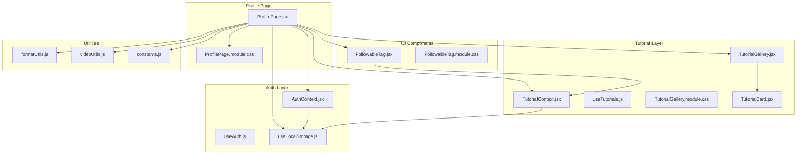

**Diagram sources**
- [ProfilePage.jsx:15-387](file://src/pages/ProfilePage.jsx#L15-L387)
- [AuthContext.jsx:13-105](file://src/contexts/AuthContext.jsx#L13-L105)
- [useLocalStorage.js:3-29](file://src/hooks/useLocalStorage.js#L3-L29)
- [TutorialContext.jsx:18-542](file://src/contexts/TutorialContext.jsx#L18-L542)
- [useTutorials.js:4-10](file://src/hooks/useTutorials.js#L4-L10)
- [TutorialGallery.jsx:23-138](file://src/components/TutorialGallery.jsx#L23-L138)
- [TutorialCard.jsx:14-110](file://src/components/TutorialCard.jsx#L14-L110)
- [FollowableTag.jsx:5-34](file://src/components/FollowableTag.jsx#L5-L34)
- [formatUtils.js:23-35](file://src/utils/formatUtils.js#L23-L35)
- [videoUtils.js:3-43](file://src/utils/videoUtils.js#L3-L43)
- [constants.js:1-71](file://src/data/constants.js#L1-L71)

**Section sources**
- [ProfilePage.jsx:15-52](file://src/pages/ProfilePage.jsx#L15-L52)
- [AuthContext.jsx:13-105](file://src/contexts/AuthContext.jsx#L13-L105)
- [TutorialContext.jsx:18-542](file://src/contexts/TutorialContext.jsx#L18-L542)

## Core Components
- ProfilePage: Renders the authenticated user’s profile header, tabs for bookmarks, completed, submissions, and followed tags, and manages editing/deletion flows.
- AuthContext: Provides currentUser, authentication state, and session persistence via local storage.
- TutorialContext: Centralizes tutorial data, user actions (bookmarks, completions, submissions), and tag following with local storage persistence.
- FollowableTag: Renders a single tag chip with follow/unfollow behavior.
- TutorialGallery: Displays collections of tutorials (bookmarks, completed, submissions) with pagination and empty states.
- Utilities: Formatting helpers and video URL parsing/validation.

Key responsibilities:
- Profile display: Avatar initials, display name, username, join date
- Bookmark management: List and pagination
- Completion tracking: List and counts
- Submission management: List, edit modal, delete confirmation
- Tag following: List, unfollow, and “For You” recommendations
- Persistence: Local storage-backed state for users, sessions, bookmarks, submissions, completions, and followed tags

**Section sources**
- [ProfilePage.jsx:135-387](file://src/pages/ProfilePage.jsx#L135-L387)
- [AuthContext.jsx:17-20](file://src/contexts/AuthContext.jsx#L17-L20)
- [TutorialContext.jsx:133-162](file://src/contexts/TutorialContext.jsx#L133-L162)
- [TutorialContext.jsx:164-201](file://src/contexts/TutorialContext.jsx#L164-L201)
- [TutorialContext.jsx:305-349](file://src/contexts/TutorialContext.jsx#L305-L349)

## Architecture Overview
ProfilePage composes data from AuthContext and TutorialContext, renders UI via styled components, and triggers actions that mutate local storage-backed state.

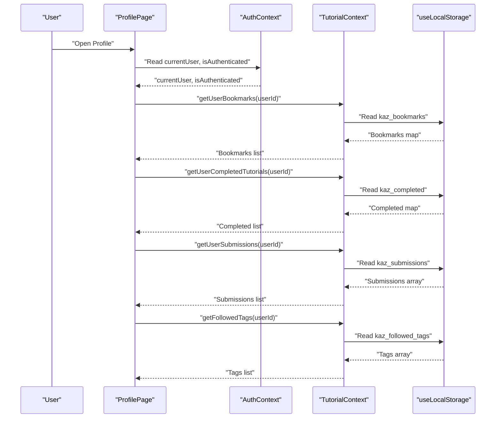

**Diagram sources**
- [ProfilePage.jsx:54-57](file://src/pages/ProfilePage.jsx#L54-L57)
- [AuthContext.jsx:17-20](file://src/contexts/AuthContext.jsx#L17-L20)
- [TutorialContext.jsx:156-162](file://src/contexts/TutorialContext.jsx#L156-L162)
- [TutorialContext.jsx:188-194](file://src/contexts/TutorialContext.jsx#L188-L194)
- [TutorialContext.jsx:372-377](file://src/contexts/TutorialContext.jsx#L372-L377)
- [TutorialContext.jsx:334-339](file://src/contexts/TutorialContext.jsx#L334-L339)

## Detailed Component Analysis

### Profile Header and Avatar Generation
- Avatar: Single uppercase initial derived from the user’s display name.
- Personal info: Display name, username, and joined date formatted for readability.
- Privacy note: The avatar initials are deterministic and non-sensitive; Gravatar URLs are generated server-side during registration and stored in local state.

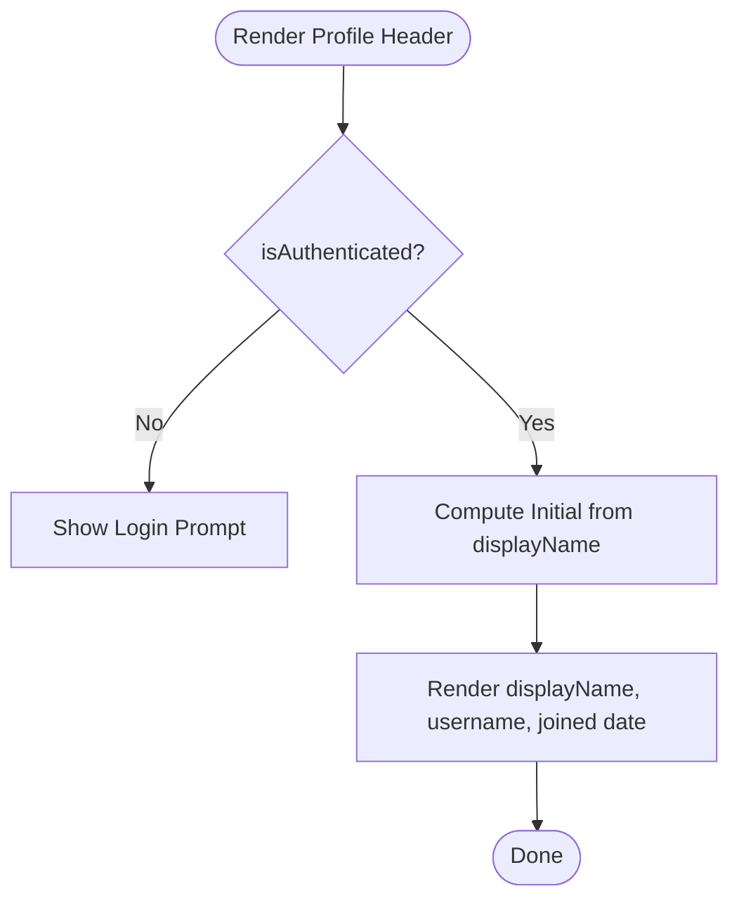

**Diagram sources**
- [ProfilePage.jsx:135-148](file://src/pages/ProfilePage.jsx#L135-L148)
- [AuthContext.jsx:37-45](file://src/contexts/AuthContext.jsx#L37-L45)
- [formatUtils.js:23-35](file://src/utils/formatUtils.js#L23-L35)

**Section sources**
- [ProfilePage.jsx:137-148](file://src/pages/ProfilePage.jsx#L137-L148)
- [AuthContext.jsx:37-45](file://src/contexts/AuthContext.jsx#L37-L45)
- [formatUtils.js:23-35](file://src/utils/formatUtils.js#L23-L35)

### Tabbed Sections: Bookmarks, Completed, Submissions, Tags
- Tabs: Switch between bookmarks, completed tutorials, user submissions, and followed tags.
- Content rendering: Uses TutorialGallery for lists; displays empty states when collections are empty.
- Pagination: TutorialGallery handles pagination for large lists.

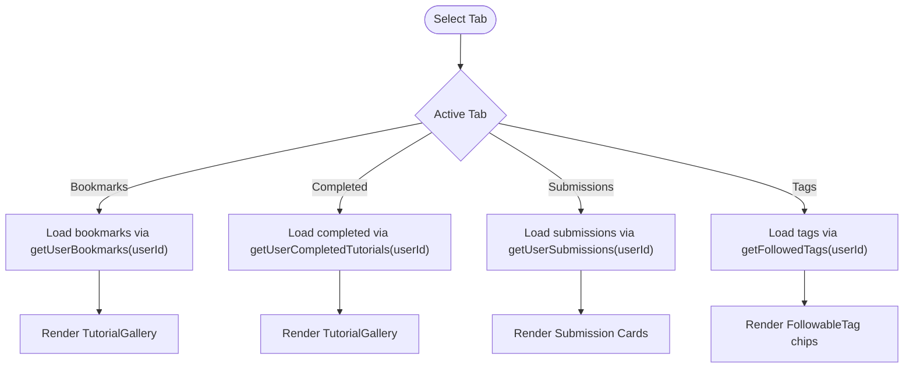

**Diagram sources**
- [ProfilePage.jsx:150-175](file://src/pages/ProfilePage.jsx#L150-L175)
- [ProfilePage.jsx:177-260](file://src/pages/ProfilePage.jsx#L177-L260)
- [TutorialContext.jsx:156-162](file://src/contexts/TutorialContext.jsx#L156-L162)
- [TutorialContext.jsx:188-194](file://src/contexts/TutorialContext.jsx#L188-L194)
- [TutorialContext.jsx:372-377](file://src/contexts/TutorialContext.jsx#L372-L377)
- [TutorialContext.jsx:334-339](file://src/contexts/TutorialContext.jsx#L334-L339)

**Section sources**
- [ProfilePage.jsx:150-260](file://src/pages/ProfilePage.jsx#L150-L260)
- [TutorialGallery.jsx:23-138](file://src/components/TutorialGallery.jsx#L23-L138)

### Bookmark Management System
- Retrieval: getUserBookmarks(userId) returns tutorials bookmarked by the user.
- Rendering: TutorialGallery displays bookmarked items with pagination.
- Behavior: Toggles bookmark state via TutorialContext; toast feedback indicates success.

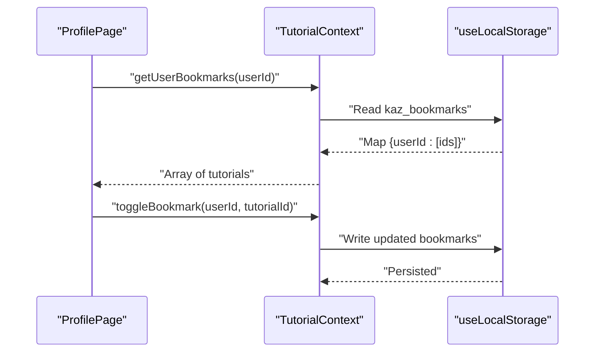

**Diagram sources**
- [ProfilePage.jsx:177-184](file://src/pages/ProfilePage.jsx#L177-L184)
- [TutorialContext.jsx:133-147](file://src/contexts/TutorialContext.jsx#L133-L147)

**Section sources**
- [ProfilePage.jsx:177-184](file://src/pages/ProfilePage.jsx#L177-L184)
- [TutorialContext.jsx:133-147](file://src/contexts/TutorialContext.jsx#L133-L147)

### Tutorial Completion Tracking
- Retrieval: getUserCompletedTutorials(userId) returns tutorials marked as completed by the user.
- Rendering: TutorialGallery displays completed items.
- Behavior: toggleCompleted updates local storage; counts are available via getUserCompletedCount(userId).

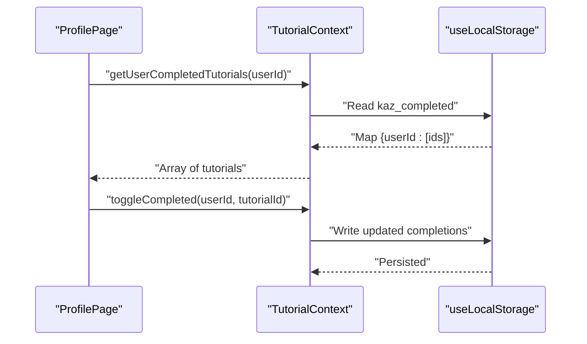

**Diagram sources**
- [ProfilePage.jsx:186-193](file://src/pages/ProfilePage.jsx#L186-L193)
- [TutorialContext.jsx:164-201](file://src/contexts/TutorialContext.jsx#L164-L201)

**Section sources**
- [ProfilePage.jsx:186-193](file://src/pages/ProfilePage.jsx#L186-L193)
- [TutorialContext.jsx:164-201](file://src/contexts/TutorialContext.jsx#L164-L201)

### User Submitted Tutorials: Display and Editing
- Display: Submission cards show title, description, and metadata; actions include Edit and Delete.
- Edit flow:
  - Populate form with current values
  - Client-side validation (title length, description length, URL validity, category/difficulty/platform selection, duration range, tags)
  - Extract video ID and thumbnail URL
  - Call editSubmission with updated data
  - Show success toast and close modal
- Delete flow:
  - Confirmation modal
  - Call deleteSubmission(userId, submissionId)
  - Show success toast and close modal

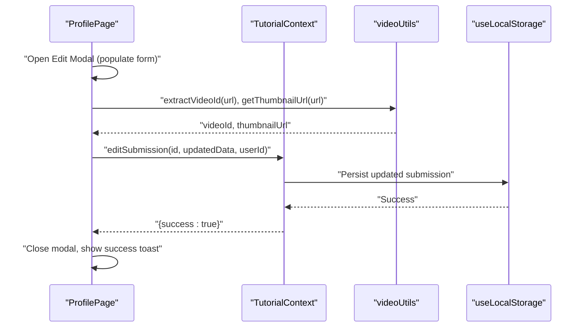

**Diagram sources**
- [ProfilePage.jsx:71-133](file://src/pages/ProfilePage.jsx#L71-L133)
- [videoUtils.js:3-43](file://src/utils/videoUtils.js#L3-L43)
- [TutorialContext.jsx:379-409](file://src/contexts/TutorialContext.jsx#L379-L409)

**Section sources**
- [ProfilePage.jsx:221-260](file://src/pages/ProfilePage.jsx#L221-L260)
- [ProfilePage.jsx:278-383](file://src/pages/ProfilePage.jsx#L278-L383)
- [ProfilePage.jsx:59-64](file://src/pages/ProfilePage.jsx#L59-L64)
- [TutorialContext.jsx:379-423](file://src/contexts/TutorialContext.jsx#L379-L423)
- [videoUtils.js:3-43](file://src/utils/videoUtils.js#L3-L43)

### Tag Following System and Personalized Recommendations
- Display followed tags as chips; clicking unfollow invokes TutorialContext.unfollowTag.
- Personalized “For You” feed: getForYouTutorials(userId) returns tutorials matching followed tags, sorted by recency.
- FollowableTag integrates with authentication state to enable/disable interactions.

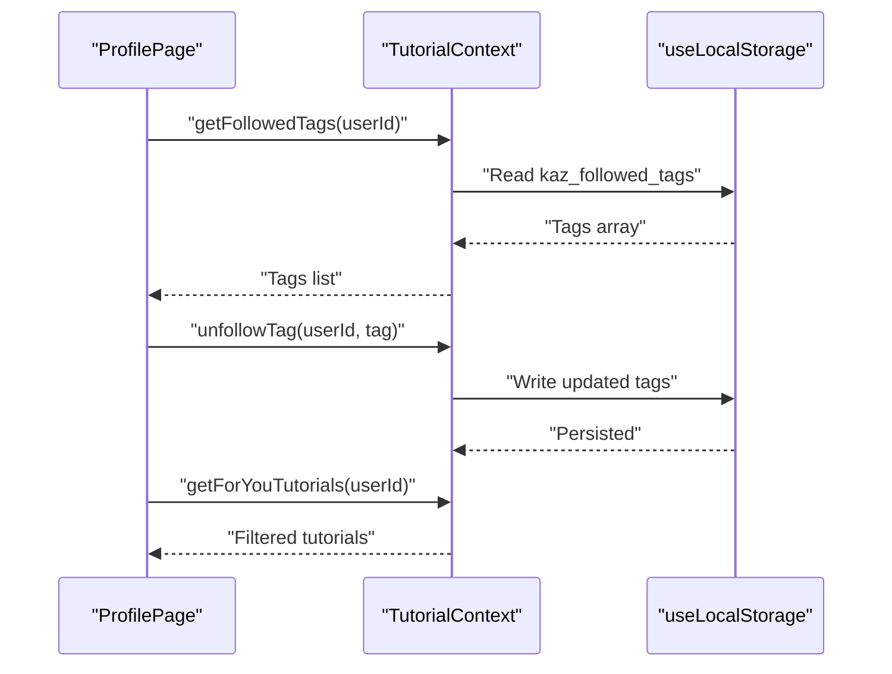

**Diagram sources**
- [ProfilePage.jsx:195-219](file://src/pages/ProfilePage.jsx#L195-L219)
- [TutorialContext.jsx:305-349](file://src/contexts/TutorialContext.jsx#L305-L349)
- [FollowableTag.jsx:5-34](file://src/components/FollowableTag.jsx#L5-L34)

**Section sources**
- [ProfilePage.jsx:195-219](file://src/pages/ProfilePage.jsx#L195-L219)
- [TutorialContext.jsx:305-349](file://src/contexts/TutorialContext.jsx#L305-L349)
- [FollowableTag.jsx:5-34](file://src/components/FollowableTag.jsx#L5-L34)

### Integration with AuthContext and useLocalStorage
- AuthContext stores session and users in local storage and exposes currentUser and authentication state.
- useLocalStorage provides a hook to read/write keys with safe error handling.
- ProfilePage relies on useAuth to guard unauthenticated access and to obtain the current user’s ID.

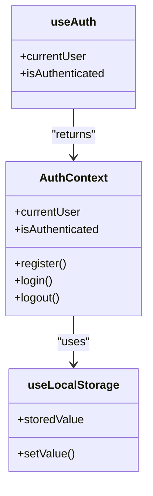

**Diagram sources**
- [AuthContext.jsx:13-105](file://src/contexts/AuthContext.jsx#L13-L105)
- [useLocalStorage.js:3-29](file://src/hooks/useLocalStorage.js#L3-L29)
- [useAuth.js:4-10](file://src/hooks/useAuth.js#L4-L10)

**Section sources**
- [AuthContext.jsx:13-105](file://src/contexts/AuthContext.jsx#L13-L105)
- [useLocalStorage.js:3-29](file://src/hooks/useLocalStorage.js#L3-L29)
- [useAuth.js:4-10](file://src/hooks/useAuth.js#L4-L10)

### Data Synchronization Patterns
- Local storage is the single source of truth for user-specific data (bookmarks, submissions, completions, followed tags).
- Actions mutate state via callbacks exposed by TutorialContext, which internally update useLocalStorage.
- UI re-renders reactively as state changes.

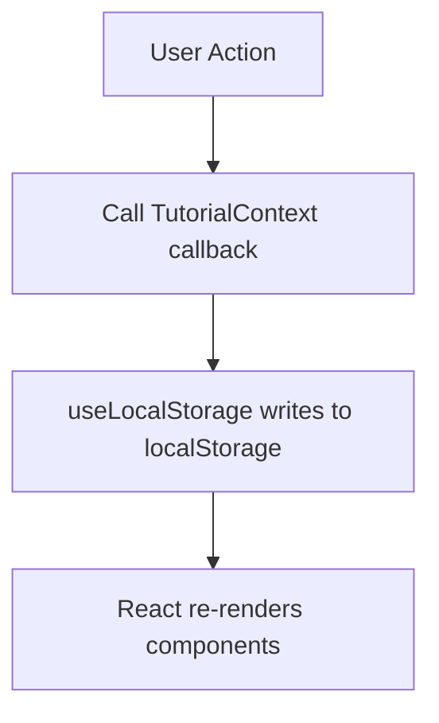

**Diagram sources**
- [TutorialContext.jsx:133-147](file://src/contexts/TutorialContext.jsx#L133-L147)
- [TutorialContext.jsx:379-409](file://src/contexts/TutorialContext.jsx#L379-L409)
- [useLocalStorage.js:14-25](file://src/hooks/useLocalStorage.js#L14-L25)

**Section sources**
- [TutorialContext.jsx:133-147](file://src/contexts/TutorialContext.jsx#L133-L147)
- [TutorialContext.jsx:379-409](file://src/contexts/TutorialContext.jsx#L379-L409)
- [useLocalStorage.js:14-25](file://src/hooks/useLocalStorage.js#L14-L25)

### User Privacy Considerations
- Public profile fields: display name, username, join date, and avatar initials are visible to the user and others.
- Private actions: Bookmarks, completions, and followed tags are stored locally and not transmitted to external servers.
- Submission edits/deletes: Only the author (identified by userId) can modify their own submissions.
- Recommendations: Personalization is client-side and does not leak private preferences to external services.

[No sources needed since this section provides general guidance]

## Dependency Analysis
ProfilePage depends on:
- AuthContext for user identity and authentication state
- TutorialContext for all tutorial-related data and actions
- UI components for rendering galleries and tag chips
- Utility modules for formatting and video URL handling

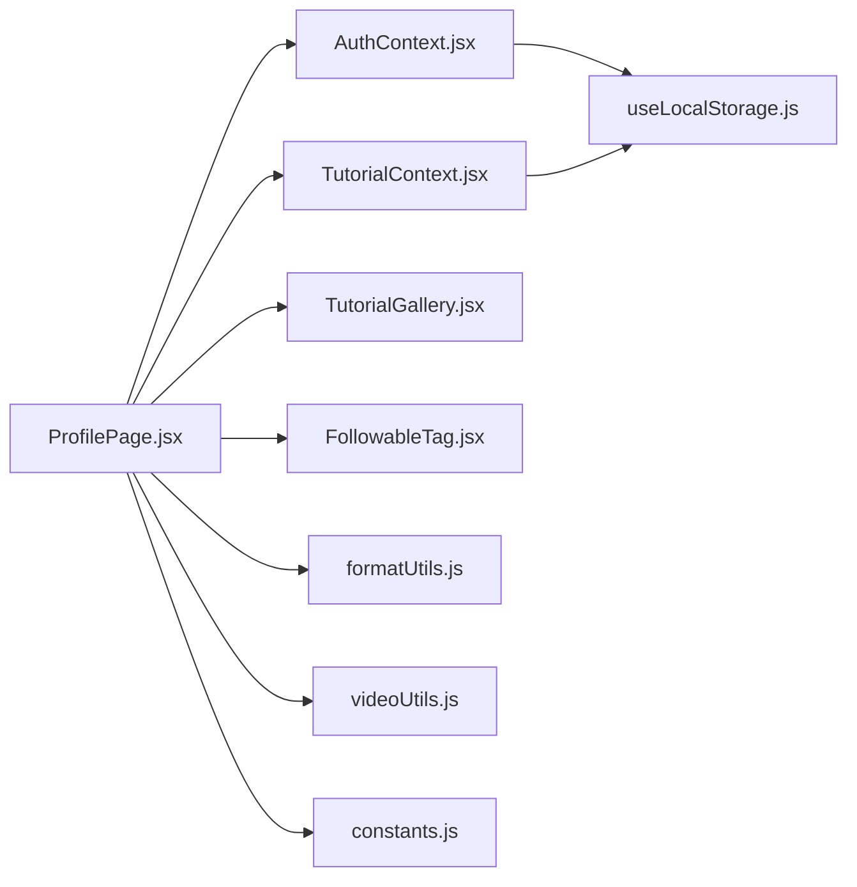

**Diagram sources**
- [ProfilePage.jsx:15-13](file://src/pages/ProfilePage.jsx#L15-L13)
- [AuthContext.jsx:13-105](file://src/contexts/AuthContext.jsx#L13-L105)
- [TutorialContext.jsx:18-542](file://src/contexts/TutorialContext.jsx#L18-L542)
- [TutorialGallery.jsx:23-138](file://src/components/TutorialGallery.jsx#L23-L138)
- [FollowableTag.jsx:5-34](file://src/components/FollowableTag.jsx#L5-L34)
- [formatUtils.js:23-35](file://src/utils/formatUtils.js#L23-L35)
- [videoUtils.js:3-43](file://src/utils/videoUtils.js#L3-L43)
- [constants.js:1-71](file://src/data/constants.js#L1-L71)
- [useLocalStorage.js:3-29](file://src/hooks/useLocalStorage.js#L3-L29)

**Section sources**
- [ProfilePage.jsx:15-13](file://src/pages/ProfilePage.jsx#L15-L13)
- [AuthContext.jsx:13-105](file://src/contexts/AuthContext.jsx#L13-L105)
- [TutorialContext.jsx:18-542](file://src/contexts/TutorialContext.jsx#L18-L542)

## Performance Considerations
- Local storage reads/writes are synchronous; keep payload sizes reasonable (IDs arrays for bookmarks/completions/tags).
- Memoization in contexts avoids unnecessary recomputation of derived data.
- Pagination in TutorialGallery reduces DOM and rendering overhead for long lists.
- Lazy image loading and placeholders minimize render thrash for thumbnails.

[No sources needed since this section provides general guidance]

## Troubleshooting Guide
Common issues and resolutions:
- Cannot edit submission:
  - Ensure the user is authenticated and owns the submission (authorization check inside editSubmission).
  - Verify form validation passes (title length, description length, valid URL, selections, duration range, tags).
- Video thumbnail missing:
  - Some platforms require server-side APIs; fallbacks are handled in videoUtils.
- Unfollow tag not working:
  - Confirm user is authenticated and the tag exists in getFollowedTags.
- Persistent state not updating:
  - Confirm useLocalStorage is functioning and keys are present in browser storage.

**Section sources**
- [ProfilePage.jsx:71-133](file://src/pages/ProfilePage.jsx#L71-L133)
- [TutorialContext.jsx:379-409](file://src/contexts/TutorialContext.jsx#L379-L409)
- [videoUtils.js:15-26](file://src/utils/videoUtils.js#L15-L26)
- [useLocalStorage.js:5-12](file://src/hooks/useLocalStorage.js#L5-L12)

## Conclusion
ProfilePage consolidates user identity, bookmarks, completions, submissions, and tag preferences into a cohesive personal dashboard. It leverages AuthContext and TutorialContext for identity and data orchestration, with useLocalStorage ensuring persistence across sessions. The component supports robust editing and deletion workflows, integrates tag-based personalization, and maintains user privacy by keeping sensitive actions client-side.