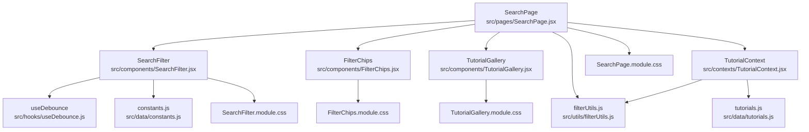
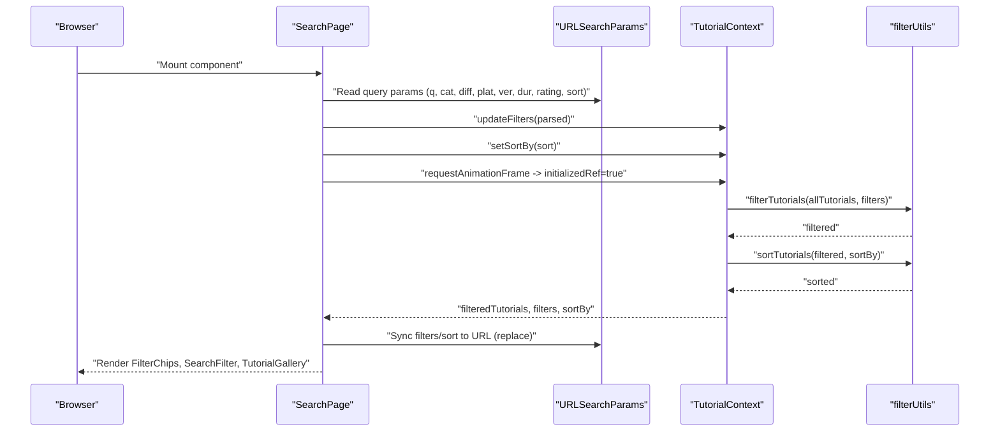
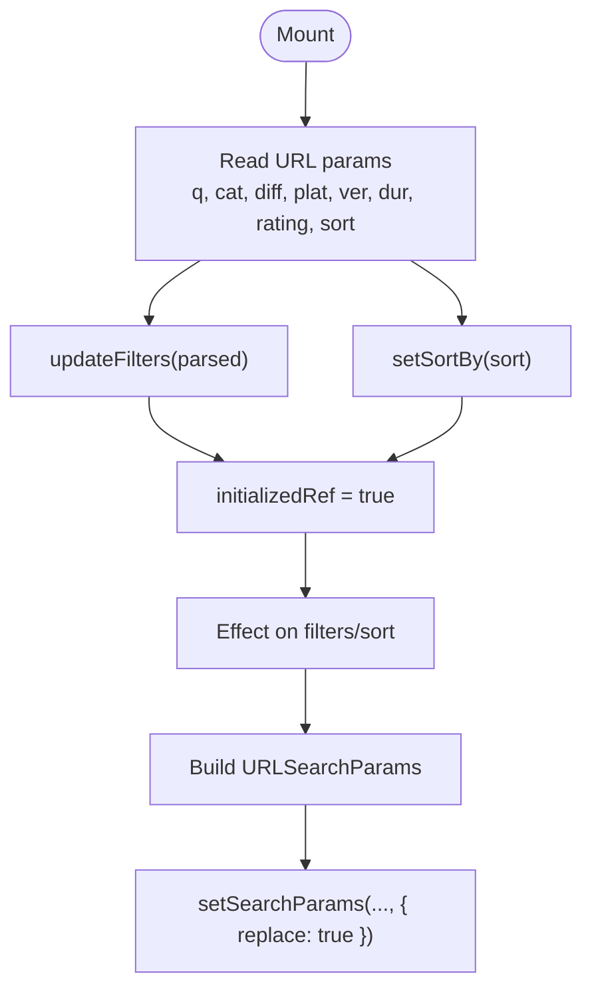
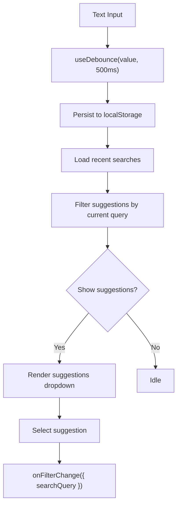
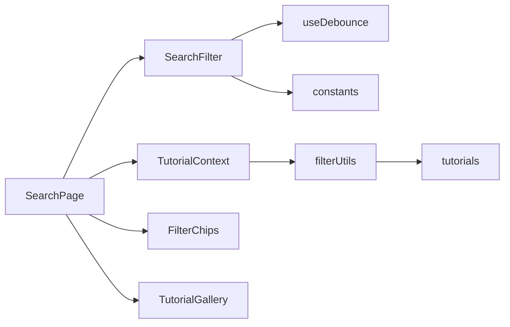

# Search Page

<cite>
**Referenced Files in This Document**
- [SearchPage.jsx](file://src/pages/SearchPage.jsx)
- [SearchFilter.jsx](file://src/components/SearchFilter.jsx)
- [FilterChips.jsx](file://src/components/FilterChips.jsx)
- [TutorialGallery.jsx](file://src/components/TutorialGallery.jsx)
- [TutorialContext.jsx](file://src/contexts/TutorialContext.jsx)
- [useTutorials.js](file://src/hooks/useTutorials.js)
- [useDebounce.js](file://src/hooks/useDebounce.js)
- [filterUtils.js](file://src/utils/filterUtils.js)
- [constants.js](file://src/data/constants.js)
- [tutorials.js](file://src/data/tutorials.js)
- [SearchPage.module.css](file://src/pages/SearchPage.module.css)
- [SearchFilter.module.css](file://src/components/SearchFilter.module.css)
- [FilterChips.module.css](file://src/components/FilterChips.module.css)
- [TutorialGallery.module.css](file://src/components/TutorialGallery.module.css)
</cite>

## Table of Contents
1. [Introduction](#introduction)
2. [Project Structure](#project-structure)
3. [Core Components](#core-components)
4. [Architecture Overview](#architecture-overview)
5. [Detailed Component Analysis](#detailed-component-analysis)
6. [Dependency Analysis](#dependency-analysis)
7. [Performance Considerations](#performance-considerations)
8. [Troubleshooting Guide](#troubleshooting-guide)
9. [Conclusion](#conclusion)

## Introduction
This document provides comprehensive technical and user-focused documentation for the SearchPage component. It explains the advanced multi-factor filtering system (category, difficulty, platform, engine version, duration, and minimum rating), URL-synced search and query parameter management, the tutorial gallery display with pagination, and the filter chips implementation for active filter visualization. It also covers the integration with filterUtils for search logic and useTutorials for data management, along with performance optimizations, debounced input handling, and UX patterns for complex filtering scenarios.

## Project Structure
The SearchPage orchestrates a cohesive search experience by combining:
- A sidebar filter panel with multi-select checkboxes, a duration selector, and a star-rating filter
- Active filter chips that reflect current selections and allow removal
- A gallery of tutorials with pagination and result counts
- URL synchronization for deep-linkable, shareable search states

**Diagram sources**
- [SearchPage.jsx:12-140](file://src/pages/SearchPage.jsx#L12-L140)
- [SearchFilter.jsx:19-229](file://src/components/SearchFilter.jsx#L19-L229)
- [FilterChips.jsx:6-69](file://src/components/FilterChips.jsx#L6-L69)
- [TutorialGallery.jsx:23-124](file://src/components/TutorialGallery.jsx#L23-L124)
- [TutorialContext.jsx:18-540](file://src/contexts/TutorialContext.jsx#L18-L540)
- [useDebounce.js:3-15](file://src/hooks/useDebounce.js#L3-L15)
- [filterUtils.js:1-99](file://src/utils/filterUtils.js#L1-L99)
- [constants.js:1-71](file://src/data/constants.js#L1-L71)
- [tutorials.js:1-522](file://src/data/tutorials.js#L1-L522)
- [SearchPage.module.css:1-43](file://src/pages/SearchPage.module.css#L1-L43)
- [SearchFilter.module.css:1-239](file://src/components/SearchFilter.module.css#L1-L239)
- [FilterChips.module.css:1-46](file://src/components/FilterChips.module.css#L1-L46)
- [TutorialGallery.module.css:1-114](file://src/components/TutorialGallery.module.css#L1-L114)

**Section sources**
- [SearchPage.jsx:12-140](file://src/pages/SearchPage.jsx#L12-L140)
- [SearchPage.module.css:1-43](file://src/pages/SearchPage.module.css#L1-L43)

## Core Components
- SearchPage: Central coordinator that reads URL parameters on mount, syncs filters/sort to URL, computes active filter count, and renders the filter sidebar, chips, sorting dropdown, and tutorial gallery.
- SearchFilter: Multi-factor filter panel with debounced text search suggestions, category/difficulty/platform/engine-version checkboxes, duration range selector, and minimum rating buttons.
- FilterChips: Visual representation of active filters with remove and clear-all actions.
- TutorialGallery: Paginated display of filtered tutorials with result counts and empty-state handling.
- TutorialContext: Provides filtered tutorials, filters, sort order, and update/reset functions via a context provider.
- filterUtils: Implements tutorial filtering, duration bounds mapping, sorting, and active filter counting.
- useDebounce: Hook to debounce text input for search suggestions and reduce unnecessary updates.
- constants: Defines filter option lists (categories, difficulties, platforms, engine versions, durations, sort options).

**Section sources**
- [SearchPage.jsx:12-140](file://src/pages/SearchPage.jsx#L12-L140)
- [SearchFilter.jsx:19-229](file://src/components/SearchFilter.jsx#L19-L229)
- [FilterChips.jsx:6-69](file://src/components/FilterChips.jsx#L6-L69)
- [TutorialGallery.jsx:23-124](file://src/components/TutorialGallery.jsx#L23-L124)
- [TutorialContext.jsx:18-540](file://src/contexts/TutorialContext.jsx#L18-L540)
- [filterUtils.js:1-99](file://src/utils/filterUtils.js#L1-L99)
- [useDebounce.js:3-15](file://src/hooks/useDebounce.js#L3-L15)
- [constants.js:1-71](file://src/data/constants.js#L1-L71)

## Architecture Overview
The SearchPage integrates UI components with data and logic through React hooks and a central context. Filtering and sorting are computed in the context and exposed to the page via a hook. URL synchronization ensures that search and filters persist across navigation and sharing.

**Diagram sources**
- [SearchPage.jsx:22-81](file://src/pages/SearchPage.jsx#L22-L81)
- [TutorialContext.jsx:67-71](file://src/contexts/TutorialContext.jsx#L67-L71)
- [filterUtils.js:1-99](file://src/utils/filterUtils.js#L1-L99)

## Detailed Component Analysis

### SearchPage
Responsibilities:
- Reads URL parameters on mount and applies them to the shared filters and sort order.
- Enables URL synchronization after initial state is settled.
- Computes active filter count for the sidebar badge.
- Provides handlers to remove individual filters and clear all filters.
- Renders the filter sidebar, chips row, sorting dropdown, and tutorial gallery.

Key behaviors:
- URL parsing supports multi-value arrays for categories, difficulties, platforms, and engine versions.
- URL syncing replaces history entries to avoid polluting the back button.
- Filter removal handlers update filters while preserving URL parity.

**Diagram sources**
- [SearchPage.jsx:22-81](file://src/pages/SearchPage.jsx#L22-L81)

**Section sources**
- [SearchPage.jsx:12-140](file://src/pages/SearchPage.jsx#L12-L140)

### SearchFilter
Responsibilities:
- Debounces text search input to improve responsiveness and reduce local storage writes.
- Manages recent search suggestions persisted in localStorage.
- Provides multi-select toggles for categories, difficulties, platforms, and engine versions.
- Offers a duration range selector and minimum rating buttons.
- Exposes reset handler to clear all filters.

Debounced search:
- Uses a 500ms debounce delay for text queries to minimize frequent updates and storage writes.

Recent search suggestions:
- Stores up to a fixed number of recent queries and filters suggestions against the current input.

Filter toggles:
- Checkbox toggles update arrays for categories, difficulties, platforms, and engine versions.
- Duration and rating controls update scalar values.

**Diagram sources**
- [SearchFilter.jsx:22-64](file://src/components/SearchFilter.jsx#L22-L64)
- [useDebounce.js:3-15](file://src/hooks/useDebounce.js#L3-L15)

**Section sources**
- [SearchFilter.jsx:19-229](file://src/components/SearchFilter.jsx#L19-L229)
- [SearchFilter.module.css:1-239](file://src/components/SearchFilter.module.css#L1-L239)

### FilterChips
Responsibilities:
- Visualizes active filters as removable chips.
- Supports removing individual filters (including arrays) and clearing all filters.
- Maps duration ranges and minimum rating thresholds to readable labels.

Rendering logic:
- Builds a flat array of chips from current filters.
- Adds a “Clear all” button when multiple chips exist.

Removal behavior:
- Delegates removal to SearchPage’s handleRemoveFilter, which updates filters accordingly.

**Section sources**
- [FilterChips.jsx:6-69](file://src/components/FilterChips.jsx#L6-L69)
- [FilterChips.module.css:1-46](file://src/components/FilterChips.module.css#L1-L46)

### TutorialGallery
Responsibilities:
- Displays filtered tutorials in a responsive grid.
- Shows result counts and handles empty states with optional clear-filters action.
- Implements pagination with ellipsis for large result sets.

Pagination logic:
- Calculates total pages based on pageSize and current tutorials.
- Resets to page 1 when the tutorial list changes.
- Renders previous/next buttons and numbered pages with ellipsis markers.

**Section sources**
- [TutorialGallery.jsx:23-124](file://src/components/TutorialGallery.jsx#L23-L124)
- [TutorialGallery.module.css:1-114](file://src/components/TutorialGallery.module.css#L1-L114)

### TutorialContext and useTutorials
Responsibilities:
- Provides filtered tutorials, filters, sort order, and update/reset functions.
- Computes filtered and sorted tutorials using filterUtils.
- Persists filters and sort order in localStorage for session continuity.

Integration:
- SearchPage consumes the context via useTutorials to access filteredTutorials, filters, sortBy, updateFilters, resetFilters, and setSortBy.

**Section sources**
- [TutorialContext.jsx:18-540](file://src/contexts/TutorialContext.jsx#L18-L540)
- [useTutorials.js:4-10](file://src/hooks/useTutorials.js#L4-L10)

### filterUtils
Responsibilities:
- filterTutorials: Applies multi-factor filtering including text search across title, description, tags, and author; and exact-match filters for category, difficulty, platform, engine version; duration range bounds; and minimum rating threshold.
- getDurationBounds: Converts duration range keys to numeric bounds.
- sortTutorials: Sorts by newest, popularity, highest-rated, or most viewed.
- getActiveFilterCount: Counts active filters for the sidebar badge.

**Section sources**
- [filterUtils.js:1-99](file://src/utils/filterUtils.js#L1-L99)

### Constants and Data
- constants.js defines filter options for categories, difficulties, platforms, engine versions, duration ranges, and sort options.
- tutorials.js provides the base dataset used by the context to compute filtered and sorted results.

**Section sources**
- [constants.js:1-71](file://src/data/constants.js#L1-L71)
- [tutorials.js:1-522](file://src/data/tutorials.js#L1-L522)

## Dependency Analysis
The SearchPage composes several modules with clear boundaries:
- UI components depend on props and callbacks from SearchPage.
- SearchPage depends on TutorialContext for data and on URL synchronization for persistence.
- filterUtils encapsulates pure filtering and sorting logic, decoupled from UI.
- useDebounce isolates debouncing concerns from SearchFilter.

**Diagram sources**
- [SearchPage.jsx:12-140](file://src/pages/SearchPage.jsx#L12-L140)
- [SearchFilter.jsx:19-229](file://src/components/SearchFilter.jsx#L19-L229)
- [TutorialContext.jsx:18-540](file://src/contexts/TutorialContext.jsx#L18-L540)
- [filterUtils.js:1-99](file://src/utils/filterUtils.js#L1-L99)
- [useDebounce.js:3-15](file://src/hooks/useDebounce.js#L3-L15)
- [constants.js:1-71](file://src/data/constants.js#L1-L71)
- [tutorials.js:1-522](file://src/data/tutorials.js#L1-L522)

**Section sources**
- [SearchPage.jsx:12-140](file://src/pages/SearchPage.jsx#L12-L140)
- [TutorialContext.jsx:18-540](file://src/contexts/TutorialContext.jsx#L18-L540)
- [filterUtils.js:1-99](file://src/utils/filterUtils.js#L1-L99)

## Performance Considerations
- Debounced text search: SearchFilter uses a 500ms debounce to limit frequent updates and localStorage writes during typing.
- Memoized computations: TutorialContext memoizes filteredTutorials and derived lists (featured, popular) to avoid unnecessary recalculations.
- Efficient filtering: filterUtils performs linear scans with early exits for text matching and straightforward array inclusion checks.
- Pagination: TutorialGallery slices arrays for display, avoiding rendering overhead for large unpaginated lists.
- URL replace: SearchPage uses replace to avoid bloating browser history with rapid filter changes.

[No sources needed since this section provides general guidance]

## Troubleshooting Guide
Common issues and resolutions:
- Filters not applying on initial load: Ensure URL parameters are present and correctly formatted; verify that updateFilters is called with parsed values.
- URL not updating: Confirm that initializedRef is true after mount and that the effect watching filters/sort runs after initialization.
- Removing a filter does nothing: Verify handleRemoveFilter logic for the specific filter type and that updateFilters is invoked with the correct payload.
- Pagination resets unexpectedly: Confirm that the gallery resets to page 1 when tutorials change; ensure pageSize is set appropriately.
- Debounced suggestions not appearing: Check localStorage availability and that the debounce delay is sufficient for user input completion.

**Section sources**
- [SearchPage.jsx:22-103](file://src/pages/SearchPage.jsx#L22-L103)
- [SearchFilter.jsx:22-64](file://src/components/SearchFilter.jsx#L22-L64)
- [TutorialGallery.jsx:36-44](file://src/components/TutorialGallery.jsx#L36-L44)

## Conclusion
The SearchPage delivers a robust, URL-synced search experience with comprehensive multi-factor filtering, active filter visualization, and paginated results. Its architecture separates concerns across UI, context, and utilities, enabling maintainability and scalability. Debounced inputs, memoized computations, and pagination contribute to a responsive user experience, while URL synchronization ensures deep-linkability and shareability.