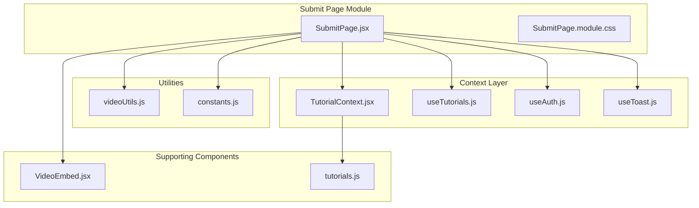
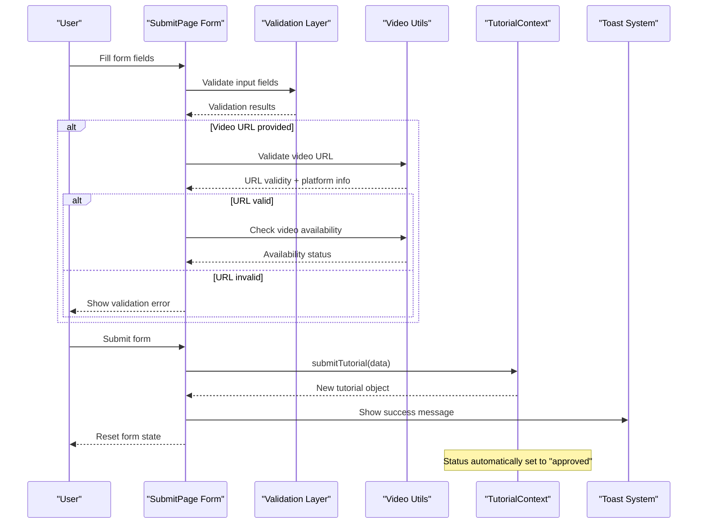
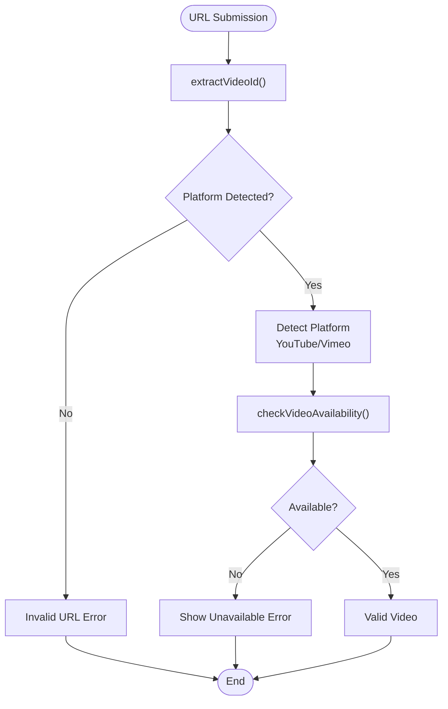
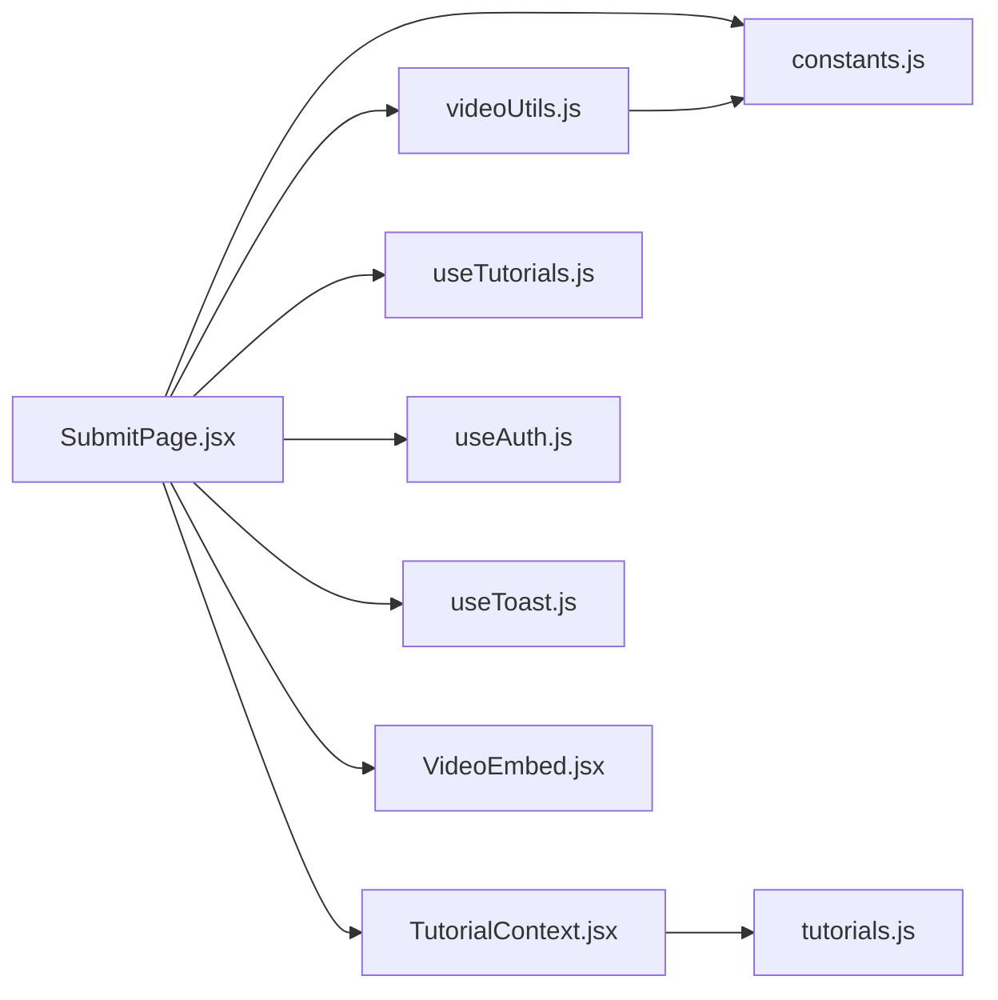

# Submit Page

<cite>
**Referenced Files in This Document**
- [SubmitPage.jsx](file://src/pages/SubmitPage.jsx)
- [SubmitPage.module.css](file://src/pages/SubmitPage.module.css)
- [videoUtils.js](file://src/utils/videoUtils.js)
- [constants.js](file://src/data/constants.js)
- [TutorialContext.jsx](file://src/contexts/TutorialContext.jsx)
- [useTutorials.js](file://src/hooks/useTutorials.js)
- [useAuth.js](file://src/hooks/useAuth.js)
- [useToast.js](file://src/hooks/useToast.js)
- [VideoEmbed.jsx](file://src/components/VideoEmbed.jsx)
- [tutorials.js](file://src/data/tutorials.js)
</cite>

## Table of Contents
1. [Introduction](#introduction)
2. [Project Structure](#project-structure)
3. [Core Components](#core-components)
4. [Architecture Overview](#architecture-overview)
5. [Detailed Component Analysis](#detailed-component-analysis)
6. [Dependency Analysis](#dependency-analysis)
7. [Performance Considerations](#performance-considerations)
8. [Troubleshooting Guide](#troubleshooting-guide)
9. [Conclusion](#conclusion)

## Introduction
The SubmitPage component provides a comprehensive tutorial submission form for users to share educational content with the community. This document covers the complete submission workflow, validation rules, form state management, video URL validation and preview generation, category selection, metadata collection, and the tutorial approval process. It also documents accessibility features, real-time validation feedback, and user guidance elements.

## Project Structure
The SubmitPage component integrates with several key modules and utilities:

**Diagram sources**
- [SubmitPage.jsx:1-388](file://src/pages/SubmitPage.jsx#L1-L388)
- [videoUtils.js:1-119](file://src/utils/videoUtils.js#L1-L119)
- [constants.js:1-71](file://src/data/constants.js#L1-L71)
- [TutorialContext.jsx:1-542](file://src/contexts/TutorialContext.jsx#L1-L542)

**Section sources**
- [SubmitPage.jsx:1-388](file://src/pages/SubmitPage.jsx#L1-L388)
- [SubmitPage.module.css:1-237](file://src/pages/SubmitPage.module.css#L1-L237)

## Core Components
The SubmitPage component consists of several interconnected parts:

### Form State Management
The component maintains comprehensive form state through React's useState hook, managing:
- Basic metadata: title, description, URL, category, difficulty, platform, engine version
- Additional fields: tags, estimated duration, prerequisites
- Validation state: error messages, validation status
- UI state: prerequisite dropdown visibility, click-outside handlers

### Validation System
The form implements both client-side and server-side validation:
- Real-time field validation during input
- Comprehensive validation on form submission
- Video URL verification against external APIs
- Constraint checking for numeric ranges and character limits

### Video Processing
Integrated video URL validation and metadata extraction:
- Pattern matching for YouTube and Vimeo URLs
- Thumbnail URL generation
- Embed URL creation for preview
- Availability verification through oEmbed endpoints

**Section sources**
- [SubmitPage.jsx:10-173](file://src/pages/SubmitPage.jsx#L10-L173)
- [videoUtils.js:41-118](file://src/utils/videoUtils.js#L41-L118)

## Architecture Overview
The submission workflow follows a structured flow from form completion to tutorial approval:

**Diagram sources**
- [SubmitPage.jsx:78-173](file://src/pages/SubmitPage.jsx#L78-L173)
- [videoUtils.js:67-118](file://src/utils/videoUtils.js#L67-L118)
- [TutorialContext.jsx:353-370](file://src/contexts/TutorialContext.jsx#L353-L370)

## Detailed Component Analysis

### Form Field Structure and Validation Rules

#### Required Fields and Constraints
The form enforces strict validation rules for each field:

| Field | Validation Type | Specific Rules | Error Message |
|-------|----------------|----------------|---------------|
| Title | Length + Content | 5-100 characters, trim whitespace | "Title must be 5-100 characters" |
| Description | Length + Content | 20-500 characters, trim whitespace | "Description must be 20-500 characters" |
| Video URL | Format + Platform | YouTube/Vimeo URL validation | "Please enter a valid YouTube or Vimeo URL" |
| Category | Selection | Non-empty selection | "Please select a category" |
| Difficulty | Selection | Non-empty selection | "Please select a difficulty level" |
| Platform | Selection | Non-empty selection | "Please select a platform" |
| Duration | Numeric Range | Integer 1-600 minutes | "Duration must be between 1 and 600 minutes" |

#### Optional Fields and Metadata
- **Tags**: Comma-separated values, trimmed, converted to lowercase, limited to 5 items
- **Engine Version**: Optional dropdown selection
- **Prerequisites**: Interactive search with maximum 5 items limit

**Section sources**
- [SubmitPage.jsx:82-110](file://src/pages/SubmitPage.jsx#L82-L110)
- [SubmitPage.jsx:128-132](file://src/pages/SubmitPage.jsx#L128-L132)

### Video URL Validation and Preview Generation

#### URL Validation Process
The video validation system implements a multi-layered approach:

**Diagram sources**
- [videoUtils.js:3-43](file://src/utils/videoUtils.js#L3-L43)
- [videoUtils.js:67-118](file://src/utils/videoUtils.js#L67-L118)

#### Thumbnail and Embed Generation
The system generates appropriate preview assets:
- **YouTube**: Automatic thumbnail URL generation using standard image endpoint
- **Vimeo**: Requires API call for thumbnails (not implemented)
- **Embed URLs**: Platform-specific embed URL construction for preview

**Section sources**
- [videoUtils.js:15-39](file://src/utils/videoUtils.js#L15-L39)
- [constants.js:55-70](file://src/data/constants.js#L55-L70)

### Category Selection and Metadata Collection

#### Dropdown Options
The form provides comprehensive categorization through predefined constants:

| Category | Value | Icon | Description |
|----------|--------|------|-------------|
| 2D Development | 2D | 🎮 | 2D game development tutorials |
| 3D Development | 3D | 🧊 | 3D game development tutorials |
| Programming | Programming | 💻 | Programming and scripting tutorials |
| Art & Design | Art | 🎨 | Artistic and design tutorials |
| Audio & Music | Audio | 🎵 | Audio production and music tutorials |
| Game Design | Game Design | 📐 | Game design and theory tutorials |

#### Difficulty Levels
- **Beginner**: Green indicator, suitable for newcomers
- **Intermediate**: Yellow indicator, moderate skill level
- **Advanced**: Red indicator, expert-level content

#### Platform Support
Supported game engines and platforms:
- Unity (including LTS versions)
- Unreal Engine (5.3, 5.4)
- Godot (4.2, 4.3)
- GameMaker (2024)
- Custom/Other platforms

**Section sources**
- [constants.js:1-38](file://src/data/constants.js#L1-L38)

### Form State Management Patterns

#### Controlled Components Implementation
The form uses controlled components with centralized state management:
- Single source of truth for all form data
- Real-time validation feedback
- Consistent error handling across all fields

#### Prerequisite Management System
Interactive prerequisite selection with:
- Live search filtering
- Maximum 5 prerequisite limit
- Visual chip-based display
- Click-outside detection for dropdown closure

**Section sources**
- [SubmitPage.jsx:16-31](file://src/pages/SubmitPage.jsx#L16-L31)
- [SubmitPage.jsx:59-71](file://src/pages/SubmitPage.jsx#L59-L71)
- [SubmitPage.jsx:333-380](file://src/pages/SubmitPage.jsx#L333-L380)

### Tutorial Submission Workflow

#### Approval Process
The submission workflow follows a streamlined approval process:
- Submissions are automatically marked as "approved"
- No manual moderation required
- Immediate availability in the tutorial gallery
- Full integration with existing tutorial system

#### Data Structure
Submitted tutorials inherit the complete tutorial data structure:
- Author information with user ID and display name
- Timestamps for creation and updates
- Default values for ratings and views
- Complete metadata preservation

**Section sources**
- [TutorialContext.jsx:353-370](file://src/contexts/TutorialContext.jsx#L353-L370)
- [tutorials.js:1-200](file://src/data/tutorials.js#L1-L200)

### Accessibility Features and User Experience

#### Form Accessibility
- Required field indicators with visual markers
- Proper labeling for all form controls
- Focus management and keyboard navigation support
- Clear error messaging and visual feedback

#### Real-time Validation Feedback
- Instant validation on field change
- Error messages appear immediately upon validation failure
- Disabled submit button during validation process
- Visual indicators for focused and hovered states

#### User Guidance Elements
- Placeholder text with examples for each field
- Hint text for complex requirements (e.g., video URL format)
- Character count limits with immediate feedback
- Responsive design for mobile and desktop

**Section sources**
- [SubmitPage.module.css:36-147](file://src/pages/SubmitPage.module.css#L36-L147)
- [SubmitPage.jsx:184-385](file://src/pages/SubmitPage.jsx#L184-L385)

## Dependency Analysis

### Component Dependencies
The SubmitPage component relies on several key dependencies:

**Diagram sources**
- [SubmitPage.jsx:1-8](file://src/pages/SubmitPage.jsx#L1-L8)
- [videoUtils.js:1](file://src/utils/videoUtils.js#L1)

### External API Dependencies
The component interacts with external services for video validation:
- YouTube oEmbed API for availability verification
- Vimeo oEmbed API for availability verification
- CORS handling for cross-origin requests

### State Management Integration
The form integrates with the global tutorial state management:
- Authentication state for user validation
- Tutorial submission through context provider
- Toast notifications for user feedback
- Local storage persistence for tutorial data

**Section sources**
- [SubmitPage.jsx:3-8](file://src/pages/SubmitPage.jsx#L3-L8)
- [TutorialContext.jsx:18-65](file://src/contexts/TutorialContext.jsx#L18-L65)

## Performance Considerations

### Validation Performance
- Client-side validation runs efficiently on the main thread
- Debounced search functionality for prerequisite dropdown
- Efficient URL pattern matching using precompiled regex
- Minimal re-renders through proper state management

### Video Processing Optimization
- Lazy loading of video validation until submission
- Caching of extracted video information
- Graceful fallbacks for unavailable external services
- Optimized thumbnail generation for supported platforms

### Memory Management
- Cleanup of event listeners for click-outside detection
- Proper disposal of timeouts and intervals
- Efficient rendering of large tutorial lists
- Minimal DOM manipulation for form updates

## Troubleshooting Guide

### Common Validation Issues
- **Title/Description length errors**: Ensure content meets character requirements
- **Invalid video URL**: Verify URL format matches supported platforms
- **Duration range errors**: Enter numeric values within 1-600 minute range
- **Missing required selections**: Select valid options from dropdown menus

### Video URL Problems
- **Unsupported platform**: Only YouTube and Vimeo URLs are accepted
- **Network connectivity issues**: Video availability checks require internet access
- **Private/unavailable videos**: Videos must be publicly accessible
- **API rate limiting**: External service limitations may affect validation

### Form State Issues
- **Field not updating**: Check controlled component implementation
- **Validation not clearing**: Ensure proper error state management
- **Prerequisite dropdown not closing**: Verify click-outside event handling
- **Form reset not working**: Confirm state initialization after successful submission

### Integration Problems
- **Authentication failures**: Verify user is logged in before accessing form
- **Submission not appearing**: Check tutorial context provider setup
- **Toast notifications not showing**: Verify toast context provider configuration
- **CSS styling issues**: Ensure module CSS imports are properly configured

**Section sources**
- [SubmitPage.jsx:43-52](file://src/pages/SubmitPage.jsx#L43-L52)
- [SubmitPage.jsx:112-126](file://src/pages/SubmitPage.jsx#L112-L126)
- [videoUtils.js:67-118](file://src/utils/videoUtils.js#L67-L118)

## Conclusion
The SubmitPage component provides a robust, user-friendly interface for tutorial submission with comprehensive validation, real-time feedback, and seamless integration with the broader tutorial ecosystem. Its architecture supports both immediate user feedback and backend integration while maintaining accessibility standards and responsive design principles. The component successfully balances functionality with usability, providing clear guidance and validation throughout the submission process.

The implementation demonstrates best practices in React component design, including proper state management, error handling, and integration with external services. The video validation system provides reliable URL processing and preview generation, while the form validation ensures data quality and consistency across the platform.