# Tutorial Detail Page

<cite>
**Referenced Files in This Document**
- [TutorialDetailPage.jsx](file://src/pages/TutorialDetailPage.jsx)
- [TutorialDetailPage.module.css](file://src/pages/TutorialDetailPage.module.css)
- [VideoEmbed.jsx](file://src/components/VideoEmbed.jsx)
- [VideoEmbed.module.css](file://src/components/VideoEmbed.module.css)
- [FreshnessVoter.jsx](file://src/components/FreshnessVoter.jsx)
- [FreshnessVoter.module.css](file://src/components/FreshnessVoter.module.css)
- [RatingWidget.jsx](file://src/components/RatingWidget.jsx)
- [RatingWidget.module.css](file://src/components/RatingWidget.module.css)
- [ReviewSection.jsx](file://src/components/ReviewSection.jsx)
- [ReviewSection.module.css](file://src/components/ReviewSection.module.css)
- [ShareButtons.jsx](file://src/components/ShareButtons.jsx)
- [ShareButtons.module.css](file://src/components/ShareButtons.module.css)
- [PrerequisiteSection.jsx](file://src/components/PrerequisiteSection.jsx)
- [PrerequisiteSection.module.css](file://src/components/PrerequisiteSection.module.css)
- [FollowableTag.jsx](file://src/components/FollowableTag.jsx)
- [FollowableTag.module.css](file://src/components/FollowableTag.module.css)
- [FreshnessBadge.jsx](file://src/components/FreshnessBadge.jsx)
- [FreshnessBadge.module.css](file://src/components/FreshnessBadge.module.css)
- [StarDisplay.jsx](file://src/components/StarDisplay.jsx)
- [StarDisplay.module.css](file://src/components/StarDisplay.module.css)
- [TutorialGallery.jsx](file://src/components/TutorialGallery.jsx)
- [TutorialGallery.module.css](file://src/components/TutorialGallery.module.css)
- [useTutorials.js](file://src/hooks/useTutorials.js)
- [videoUtils.js](file://src/utils/videoUtils.js)
- [constants.js](file://src/data/constants.js)
</cite>

## Table of Contents
1. [Introduction](#introduction)
2. [Project Structure](#project-structure)
3. [Core Components](#core-components)
4. [Architecture Overview](#architecture-overview)
5. [Detailed Component Analysis](#detailed-component-analysis)
6. [Dependency Analysis](#dependency-analysis)
7. [Performance Considerations](#performance-considerations)
8. [Troubleshooting Guide](#troubleshooting-guide)
9. [Conclusion](#conclusion)

## Introduction
This document provides comprehensive documentation for the TutorialDetailPage component and its ecosystem. It explains how the tutorial rendering system integrates video embedding and metadata display, how related tutorials and prerequisites are presented, and how user interactions are handled through the rating widget, review system, bookmarks, completion tracking, sharing buttons, and FreshnessVoter. It also covers responsive video player handling, tutorial navigation patterns, and the FreshnessVoter integration for community-driven content quality assessment.

## Project Structure
The TutorialDetailPage orchestrates several specialized components and utilities:
- Page-level logic and rendering in TutorialDetailPage.jsx
- Styling for the page in TutorialDetailPage.module.css
- Video embedding and fallback handling in VideoEmbed.jsx
- Freshness voting UI in FreshnessVoter.jsx
- Rating widget with keyboard accessibility in RatingWidget.jsx
- Review submission and sorting in ReviewSection.jsx
- Social sharing utilities in ShareButtons.jsx
- Prerequisite tutorial links in PrerequisiteSection.jsx
- Tag follow/unfollow in FollowableTag.jsx
- Freshness badge display in FreshnessBadge.jsx
- Star rating visualization in StarDisplay.jsx
- Related tutorials gallery in TutorialGallery.jsx
- Hook to access tutorial context in useTutorials.js
- Video platform parsing and sanitization in videoUtils.js
- Constants for series and platforms in constants.js

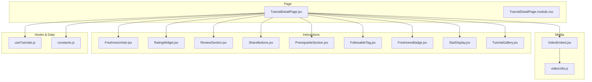

**Diagram sources**
- [TutorialDetailPage.jsx:1-296](file://src/pages/TutorialDetailPage.jsx#L1-L296)
- [TutorialDetailPage.module.css:1-268](file://src/pages/TutorialDetailPage.module.css#L1-L268)
- [VideoEmbed.jsx:1-87](file://src/components/VideoEmbed.jsx#L1-L87)
- [videoUtils.js:1-119](file://src/utils/videoUtils.js#L1-L119)
- [FreshnessVoter.jsx:1-55](file://src/components/FreshnessVoter.jsx#L1-L55)
- [RatingWidget.jsx:1-84](file://src/components/RatingWidget.jsx#L1-L84)
- [ReviewSection.jsx:1-131](file://src/components/ReviewSection.jsx#L1-L131)
- [ShareButtons.jsx:1-73](file://src/components/ShareButtons.jsx#L1-L73)
- [PrerequisiteSection.jsx:1-41](file://src/components/PrerequisiteSection.jsx#L1-L41)
- [FollowableTag.jsx:1-34](file://src/components/FollowableTag.jsx#L1-L34)
- [FreshnessBadge.jsx:1-32](file://src/components/FreshnessBadge.jsx#L1-L32)
- [StarDisplay.jsx:1-49](file://src/components/StarDisplay.jsx#L1-L49)
- [TutorialGallery.jsx:1-138](file://src/components/TutorialGallery.jsx#L1-L138)
- [useTutorials.js:1-11](file://src/hooks/useTutorials.js#L1-L11)
- [constants.js:1-71](file://src/data/constants.js#L1-L71)

**Section sources**
- [TutorialDetailPage.jsx:1-296](file://src/pages/TutorialDetailPage.jsx#L1-L296)
- [TutorialDetailPage.module.css:1-268](file://src/pages/TutorialDetailPage.module.css#L1-L268)

## Core Components
- TutorialDetailPage: Central page that loads a tutorial by ID, computes related and prerequisite tutorials, manages user interactions (ratings, reviews, bookmarks, completion, freshness votes), and renders metadata, actions, and interactive sections.
- VideoEmbed: Renders an iframe-based embedded player for supported platforms, with loading states, fallbacks, and error handling.
- FreshnessVoter: Allows logged-in users to vote on tutorial freshness and displays counts and user’s current vote.
- RatingWidget: Provides a 1–5 star rating interface with hover/focus states and keyboard navigation.
- ReviewSection: Enables authenticated users to post reviews, sorts reviews by helpfulness or recency, and supports up/down voting per review.
- ShareButtons: Offers copy-link and social sharing to Twitter, Discord, and Reddit.
- PrerequisiteSection: Lists prerequisite tutorials with thumbnail, duration, difficulty, and platform.
- FollowableTag: Toggle follow state for tags with appropriate UX affordances.
- FreshnessBadge: Visual indicator for freshness consensus.
- StarDisplay: Renders filled/empty/half stars with optional rating count.
- TutorialGallery: Displays a grid of tutorials with pagination and empty-state handling.

**Section sources**
- [TutorialDetailPage.jsx:22-296](file://src/pages/TutorialDetailPage.jsx#L22-L296)
- [VideoEmbed.jsx:6-87](file://src/components/VideoEmbed.jsx#L6-L87)
- [FreshnessVoter.jsx:5-55](file://src/components/FreshnessVoter.jsx#L5-L55)
- [RatingWidget.jsx:6-84](file://src/components/RatingWidget.jsx#L6-L84)
- [ReviewSection.jsx:7-131](file://src/components/ReviewSection.jsx#L7-L131)
- [ShareButtons.jsx:6-73](file://src/components/ShareButtons.jsx#L6-L73)
- [PrerequisiteSection.jsx:9-41](file://src/components/PrerequisiteSection.jsx#L9-L41)
- [FollowableTag.jsx:5-34](file://src/components/FollowableTag.jsx#L5-L34)
- [FreshnessBadge.jsx:5-32](file://src/components/FreshnessBadge.jsx#L5-L32)
- [StarDisplay.jsx:5-49](file://src/components/StarDisplay.jsx#L5-L49)
- [TutorialGallery.jsx:23-138](file://src/components/TutorialGallery.jsx#L23-L138)

## Architecture Overview
The TutorialDetailPage composes multiple UI components and interacts with shared utilities and hooks. It relies on useTutorials to manage state and mutations for ratings, reviews, bookmarks, completion, freshness, and tagging. Video embedding is handled via videoUtils to extract platform identifiers and construct embed URLs.

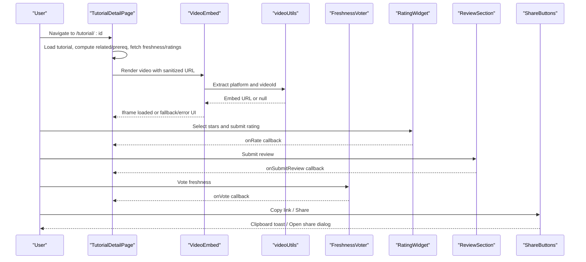

**Diagram sources**
- [TutorialDetailPage.jsx:80-146](file://src/pages/TutorialDetailPage.jsx#L80-L146)
- [VideoEmbed.jsx:6-87](file://src/components/VideoEmbed.jsx#L6-L87)
- [videoUtils.js:28-39](file://src/utils/videoUtils.js#L28-L39)
- [FreshnessVoter.jsx:23-37](file://src/components/FreshnessVoter.jsx#L23-L37)
- [RatingWidget.jsx:50-67](file://src/components/RatingWidget.jsx#L50-L67)
- [ReviewSection.jsx:17-22](file://src/components/ReviewSection.jsx#L17-L22)
- [ShareButtons.jsx:13-26](file://src/components/ShareButtons.jsx#L13-L26)

## Detailed Component Analysis

### TutorialDetailPage Rendering and Navigation
- Loads tutorial by route param and increments view count.
- Computes related tutorials by category and sorts by average rating.
- Builds prerequisite list by resolving prerequisite IDs.
- Constructs series navigation for part ordering and previous/next links.
- Displays metadata: author, duration, view count, creation date, average rating, and freshness badge.
- Presents actions: mark completed, bookmark, external watch link, and share buttons.
- Integrates FreshnessVoter, RatingWidget, ReviewSection, and related TutorialGallery.

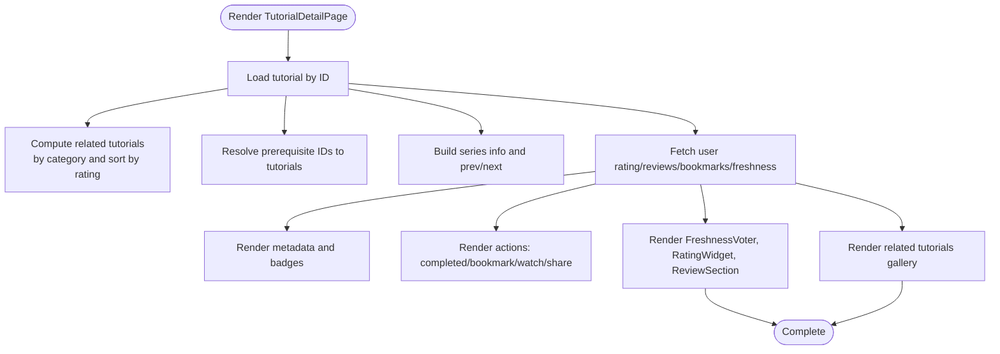

**Diagram sources**
- [TutorialDetailPage.jsx:47-109](file://src/pages/TutorialDetailPage.jsx#L47-L109)
- [TutorialDetailPage.jsx:158-296](file://src/pages/TutorialDetailPage.jsx#L158-L296)

**Section sources**
- [TutorialDetailPage.jsx:22-296](file://src/pages/TutorialDetailPage.jsx#L22-L296)

### Video Embedding System
- Extracts platform and videoId from URL using videoUtils.
- Generates embed URL for YouTube or Vimeo; otherwise falls back to a static preview area.
- Handles loading state, iframe load success, and error conditions with user-friendly messages.
- Sanitizes external URLs for anchor links.

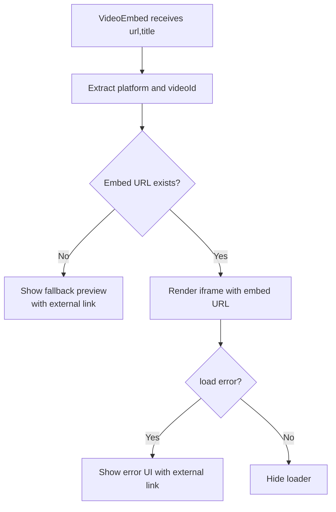

**Diagram sources**
- [VideoEmbed.jsx:6-87](file://src/components/VideoEmbed.jsx#L6-L87)
- [videoUtils.js:28-39](file://src/utils/videoUtils.js#L28-L39)

**Section sources**
- [VideoEmbed.jsx:6-87](file://src/components/VideoEmbed.jsx#L6-L87)
- [videoUtils.js:28-39](file://src/utils/videoUtils.js#L28-L39)

### FreshnessVoter Integration
- Displays “still works” vs “outdated” vote buttons with counts.
- Tracks user’s current vote and disables buttons when not authenticated.
- Calls parent handler on vote to persist and update UI.

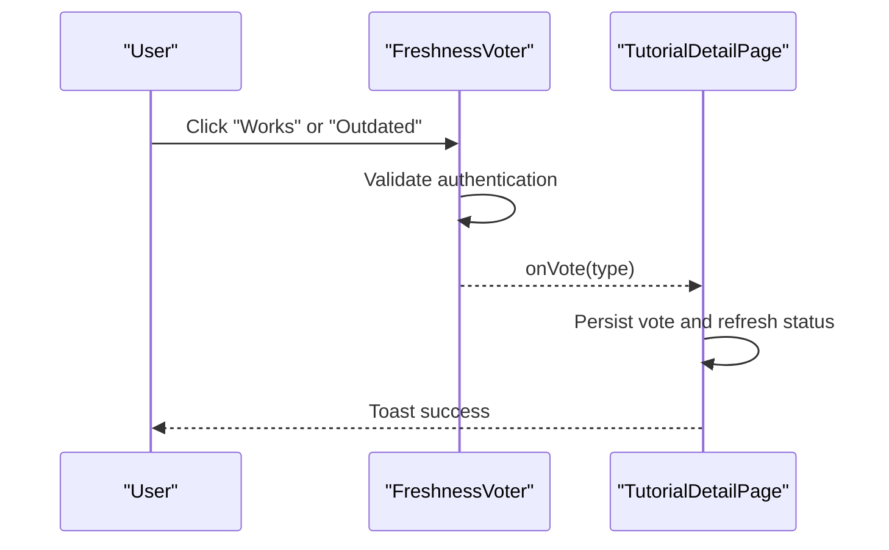

**Diagram sources**
- [FreshnessVoter.jsx:23-37](file://src/components/FreshnessVoter.jsx#L23-L37)
- [TutorialDetailPage.jsx:143-146](file://src/pages/TutorialDetailPage.jsx#L143-L146)

**Section sources**
- [FreshnessVoter.jsx:5-55](file://src/components/FreshnessVoter.jsx#L5-L55)
- [TutorialDetailPage.jsx:108-146](file://src/pages/TutorialDetailPage.jsx#L108-L146)

### Rating Widget Integration
- Provides 1–5 star selection with hover and focus states.
- Keyboard navigation support for star selection.
- Requires authentication; otherwise prompts login.
- Reports selected rating to parent handler.

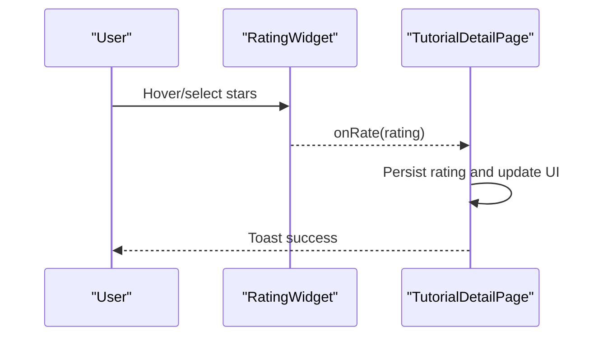

**Diagram sources**
- [RatingWidget.jsx:50-67](file://src/components/RatingWidget.jsx#L50-L67)
- [TutorialDetailPage.jsx:111-116](file://src/pages/TutorialDetailPage.jsx#L111-L116)

**Section sources**
- [RatingWidget.jsx:6-84](file://src/components/RatingWidget.jsx#L6-L84)
- [TutorialDetailPage.jsx:103-116](file://src/pages/TutorialDetailPage.jsx#L103-L116)

### Review System Components
- Authenticated users can submit reviews with a minimum length and character limit.
- Reviews are sorted by helpfulness (net votes) or recency.
- Users can upvote/downvote reviews; voting is disabled when not authenticated.
- Displays review count and provides sorting controls.

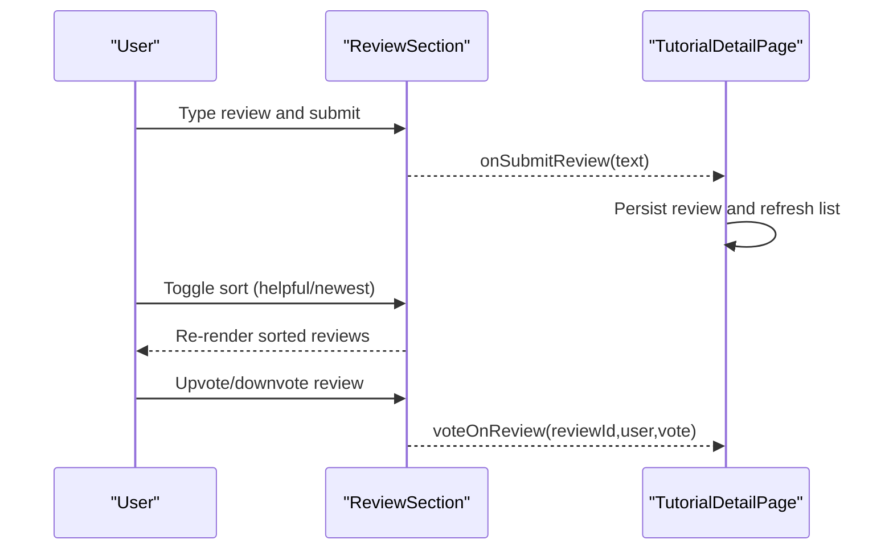

**Diagram sources**
- [ReviewSection.jsx:17-22](file://src/components/ReviewSection.jsx#L17-L22)
- [ReviewSection.jsx:67-79](file://src/components/ReviewSection.jsx#L67-L79)
- [ReviewSection.jsx:95-111](file://src/components/ReviewSection.jsx#L95-L111)
- [TutorialDetailPage.jsx:118-123](file://src/pages/TutorialDetailPage.jsx#L118-L123)

**Section sources**
- [ReviewSection.jsx:7-131](file://src/components/ReviewSection.jsx#L7-L131)
- [TutorialDetailPage.jsx:104-123](file://src/pages/TutorialDetailPage.jsx#L104-L123)

### Bookmark and Completion Tracking
- Bookmark toggles persist per user and tutorial; UI reflects active state.
- Completion toggles persist per user and tutorial; UI reflects active state.
- Both actions require authentication and redirect to login if unauthenticated.

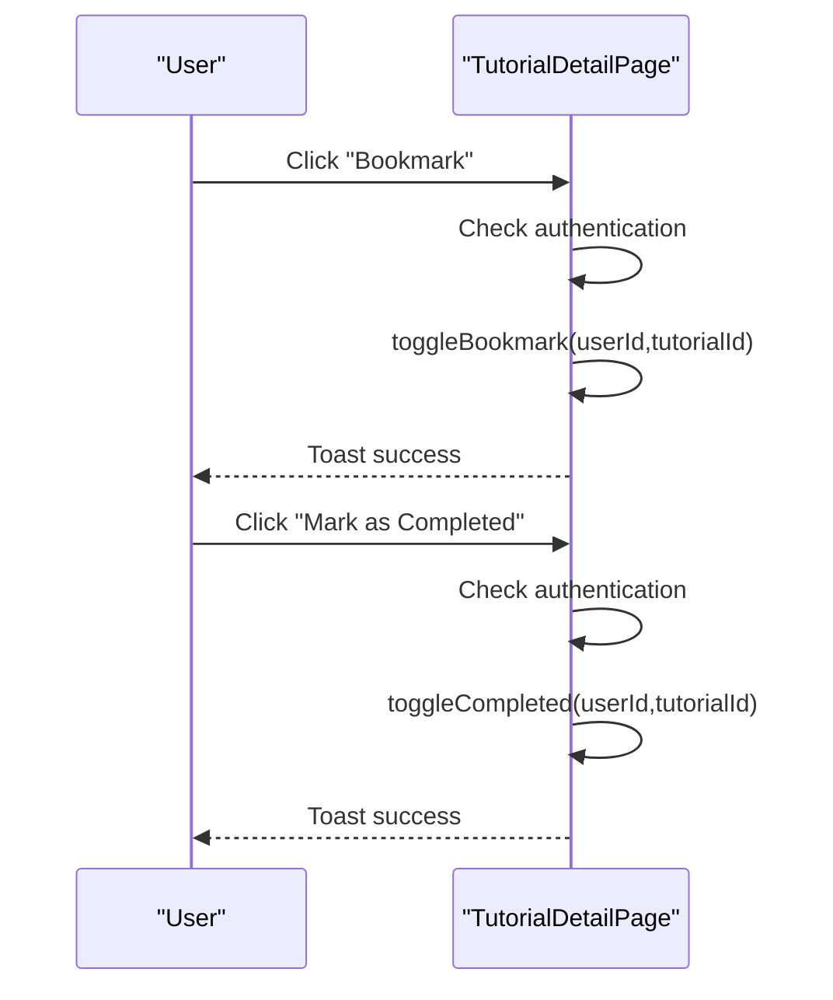

**Diagram sources**
- [TutorialDetailPage.jsx:125-141](file://src/pages/TutorialDetailPage.jsx#L125-L141)

**Section sources**
- [TutorialDetailPage.jsx:105-141](file://src/pages/TutorialDetailPage.jsx#L105-L141)

### Share Buttons Implementation
- Copies canonical URL to clipboard with a toast notification.
- Opens pre-filled share dialogs for Twitter, Discord, and Reddit.
- Falls back to a manual copy if Clipboard API is unavailable.

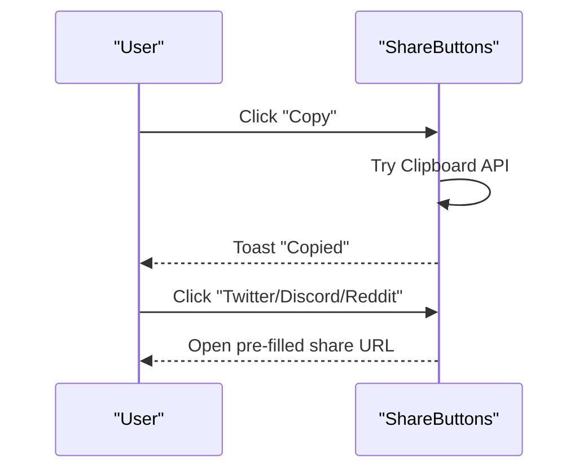

**Diagram sources**
- [ShareButtons.jsx:13-26](file://src/components/ShareButtons.jsx#L13-L26)
- [ShareButtons.jsx:38-65](file://src/components/ShareButtons.jsx#L38-L65)

**Section sources**
- [ShareButtons.jsx:6-73](file://src/components/ShareButtons.jsx#L6-L73)

### Prerequisites and Related Tutorials
- PrerequisiteSection renders prerequisite cards with thumbnail, duration, difficulty, and platform.
- Related tutorials are computed by matching category and excluding current tutorial, then sorting by average rating and limiting to four items.

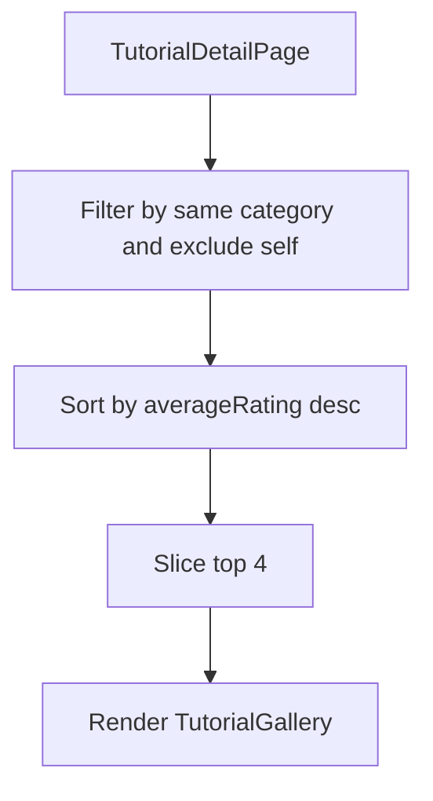

**Diagram sources**
- [TutorialDetailPage.jsx:49-55](file://src/pages/TutorialDetailPage.jsx#L49-L55)
- [TutorialDetailPage.jsx:285-292](file://src/pages/TutorialDetailPage.jsx#L285-L292)
- [TutorialGallery.jsx:74-78](file://src/components/TutorialGallery.jsx#L74-L78)

**Section sources**
- [PrerequisiteSection.jsx:9-41](file://src/components/PrerequisiteSection.jsx#L9-L41)
- [TutorialDetailPage.jsx:57-60](file://src/pages/TutorialDetailPage.jsx#L57-L60)
- [TutorialDetailPage.jsx:49-55](file://src/pages/TutorialDetailPage.jsx#L49-L55)
- [TutorialDetailPage.jsx:285-292](file://src/pages/TutorialDetailPage.jsx#L285-L292)

### Freshness Badge and Consensus Display
- FreshnessBadge renders a compact or expanded badge based on consensus ("works", "outdated", or hidden if unknown).
- TutorialDetailPage displays a FreshnessBadge alongside metadata.

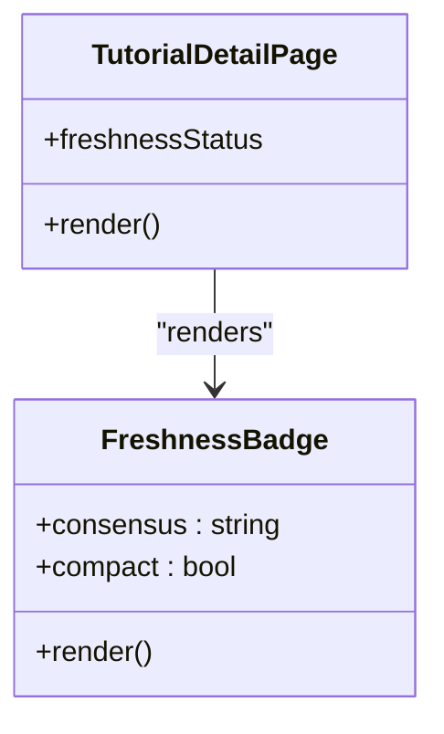

**Diagram sources**
- [FreshnessBadge.jsx:5-32](file://src/components/FreshnessBadge.jsx#L5-L32)
- [TutorialDetailPage.jsx:217-217](file://src/pages/TutorialDetailPage.jsx#L217-L217)

**Section sources**
- [FreshnessBadge.jsx:5-32](file://src/components/FreshnessBadge.jsx#L5-L32)
- [TutorialDetailPage.jsx:217-217](file://src/pages/TutorialDetailPage.jsx#L217-L217)

### Star Display and Metadata
- StarDisplay renders filled/empty/half stars and optionally shows rating and count.
- TutorialDetailPage passes tutorial.averageRating and tutorial.ratingCount to StarDisplay.

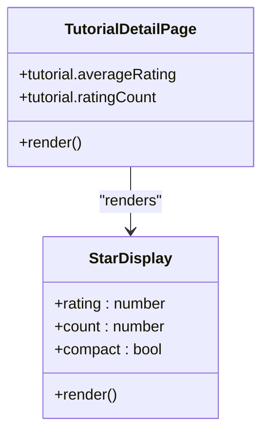

**Diagram sources**
- [StarDisplay.jsx:5-49](file://src/components/StarDisplay.jsx#L5-L49)
- [TutorialDetailPage.jsx:213-216](file://src/pages/TutorialDetailPage.jsx#L213-L216)

**Section sources**
- [StarDisplay.jsx:5-49](file://src/components/StarDisplay.jsx#L5-L49)
- [TutorialDetailPage.jsx:213-216](file://src/pages/TutorialDetailPage.jsx#L213-L216)

### Responsive Video Player Handling
- VideoEmbed uses an iframe with allow attributes for modern player features.
- On small screens, the page adjusts typography and layout for readability and usability.

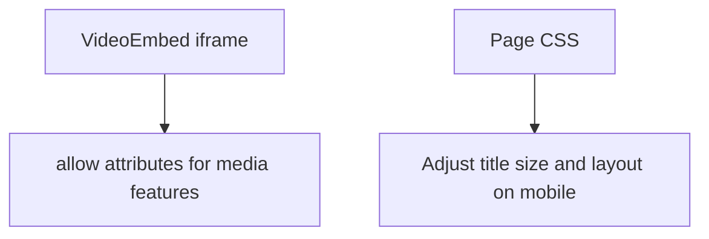

**Diagram sources**
- [VideoEmbed.jsx:70-78](file://src/components/VideoEmbed.jsx#L70-L78)
- [TutorialDetailPage.module.css:259-267](file://src/pages/TutorialDetailPage.module.css#L259-L267)

**Section sources**
- [VideoEmbed.jsx:70-78](file://src/components/VideoEmbed.jsx#L70-L78)
- [TutorialDetailPage.module.css:259-267](file://src/pages/TutorialDetailPage.module.css#L259-L267)

### Tutorial Navigation Patterns
- Series navigation shows previous/next links within a series and current position.
- Back link returns users to the search/browse page.
- PrerequisiteSection provides quick navigation to prerequisite tutorials.

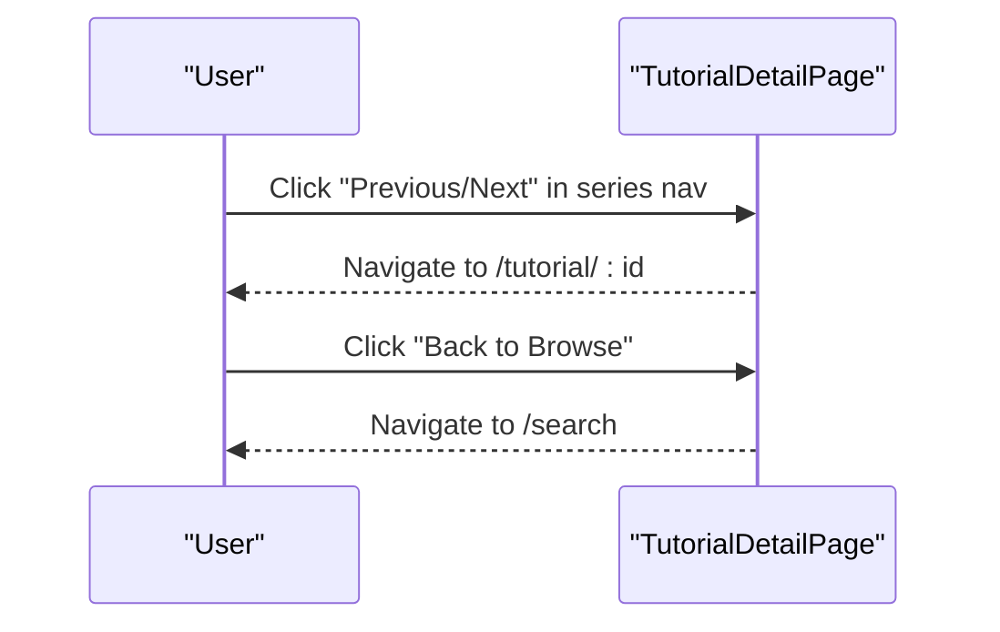

**Diagram sources**
- [TutorialDetailPage.jsx:175-184](file://src/pages/TutorialDetailPage.jsx#L175-L184)
- [TutorialDetailPage.jsx:160-162](file://src/pages/TutorialDetailPage.jsx#L160-L162)
- [PrerequisiteSection.jsx:20-32](file://src/components/PrerequisiteSection.jsx#L20-L32)

**Section sources**
- [TutorialDetailPage.jsx:169-187](file://src/pages/TutorialDetailPage.jsx#L169-L187)
- [TutorialDetailPage.jsx:160-162](file://src/pages/TutorialDetailPage.jsx#L160-L162)
- [PrerequisiteSection.jsx:9-41](file://src/components/PrerequisiteSection.jsx#L9-L41)

### User Interaction Elements
- Action buttons: completed, bookmark, external watch, and share.
- Tag follow/unfollow toggles with visual feedback.
- Sorting controls for reviews.
- Login prompts for authenticated-only features.

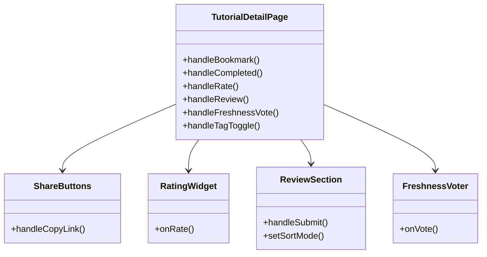

**Diagram sources**
- [TutorialDetailPage.jsx:125-156](file://src/pages/TutorialDetailPage.jsx#L125-L156)
- [ShareButtons.jsx:13-26](file://src/components/ShareButtons.jsx#L13-L26)
- [RatingWidget.jsx:50-67](file://src/components/RatingWidget.jsx#L50-L67)
- [ReviewSection.jsx:17-22](file://src/components/ReviewSection.jsx#L17-L22)
- [FreshnessVoter.jsx:23-37](file://src/components/FreshnessVoter.jsx#L23-L37)

**Section sources**
- [TutorialDetailPage.jsx:125-156](file://src/pages/TutorialDetailPage.jsx#L125-L156)
- [ShareButtons.jsx:13-26](file://src/components/ShareButtons.jsx#L13-L26)
- [RatingWidget.jsx:50-67](file://src/components/RatingWidget.jsx#L50-L67)
- [ReviewSection.jsx:17-22](file://src/components/ReviewSection.jsx#L17-L22)
- [FreshnessVoter.jsx:23-37](file://src/components/FreshnessVoter.jsx#L23-L37)

## Dependency Analysis
- TutorialDetailPage depends on useTutorials hook for all data and mutation operations.
- VideoEmbed depends on videoUtils for platform detection and embed URL generation.
- FreshnessVoter, RatingWidget, ReviewSection, and ShareButtons are self-contained UI components with minimal cross-dependencies.
- PrerequisiteSection and TutorialGallery rely on shared prop types and styling modules.

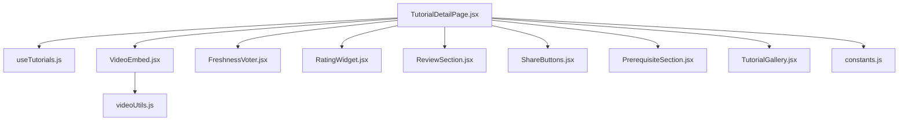

**Diagram sources**
- [TutorialDetailPage.jsx:1-44](file://src/pages/TutorialDetailPage.jsx#L1-L44)
- [useTutorials.js:1-11](file://src/hooks/useTutorials.js#L1-L11)
- [VideoEmbed.jsx:1-4](file://src/components/VideoEmbed.jsx#L1-L4)
- [videoUtils.js:1-2](file://src/utils/videoUtils.js#L1-L2)
- [constants.js:24-28](file://src/data/constants.js#L24-L28)

**Section sources**
- [TutorialDetailPage.jsx:1-44](file://src/pages/TutorialDetailPage.jsx#L1-L44)
- [useTutorials.js:1-11](file://src/hooks/useTutorials.js#L1-L11)
- [VideoEmbed.jsx:1-4](file://src/components/VideoEmbed.jsx#L1-L4)
- [videoUtils.js:1-2](file://src/utils/videoUtils.js#L1-L2)
- [constants.js:24-28](file://src/data/constants.js#L24-L28)

## Performance Considerations
- Computation of related tutorials is O(n) filtering plus O(m log m) sorting; keep related count bounded (as implemented).
- Prerequisite resolution is O(p) where p is prerequisite count; ensure prerequisite lists are concise.
- Video availability checks use oEmbed endpoints; avoid frequent polling and cache results at the application level if needed.
- Rendering large review lists can be optimized by virtualization; current implementation sorts in-memory and renders all items.

## Troubleshooting Guide
- Video fails to load:
  - Verify URL matches supported platforms and patterns.
  - Check embed URL generation and iframe allow attributes.
  - Confirm network access to oEmbed endpoints for availability checks.
- Authentication prompts:
  - Features requiring authentication (rate, review, vote, bookmark, completion, follow tags) redirect to login; ensure auth context is properly configured.
- Share button failures:
  - Clipboard API may be unavailable in some environments; fallback to manual copy is used.
- Freshness vote not reflected:
  - Ensure user is authenticated and vote is submitted via onVote handler; verify backend persistence.

**Section sources**
- [videoUtils.js:67-118](file://src/utils/videoUtils.js#L67-L118)
- [VideoEmbed.jsx:40-60](file://src/components/VideoEmbed.jsx#L40-L60)
- [ShareButtons.jsx:13-26](file://src/components/ShareButtons.jsx#L13-L26)
- [TutorialDetailPage.jsx:111-116](file://src/pages/TutorialDetailPage.jsx#L111-L116)
- [TutorialDetailPage.jsx:118-123](file://src/pages/TutorialDetailPage.jsx#L118-L123)
- [TutorialDetailPage.jsx:143-146](file://src/pages/TutorialDetailPage.jsx#L143-L146)

## Conclusion
The TutorialDetailPage integrates a cohesive set of components to deliver a rich tutorial consumption experience. It emphasizes user agency through ratings, reviews, bookmarks, completion tracking, and social sharing, while maintaining robust video playback and contextual navigation. The FreshnessVoter adds a community-driven quality dimension, and responsive design ensures usability across devices.