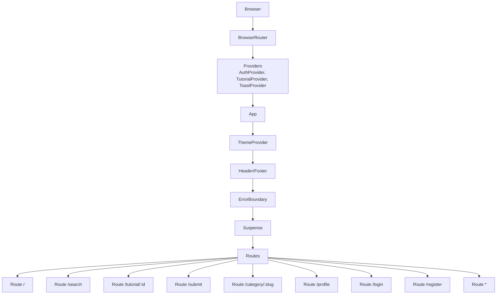
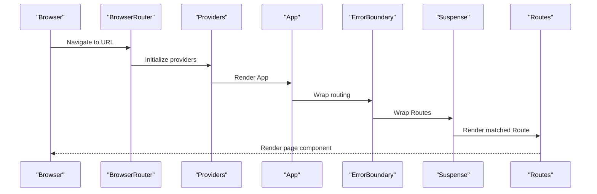
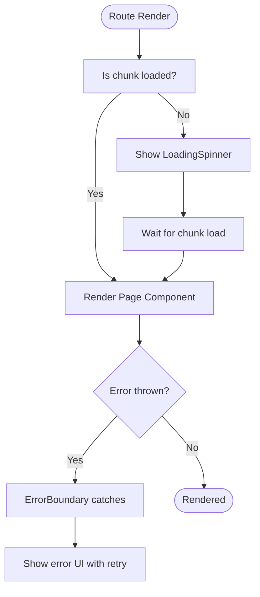
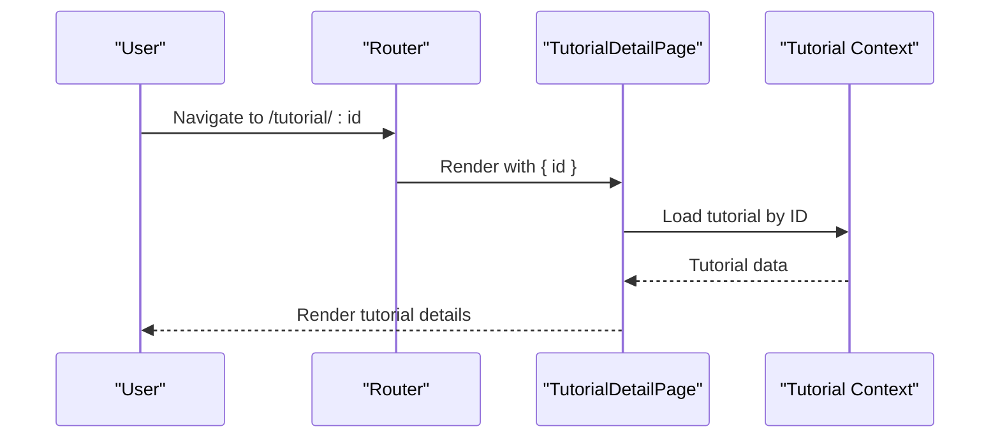
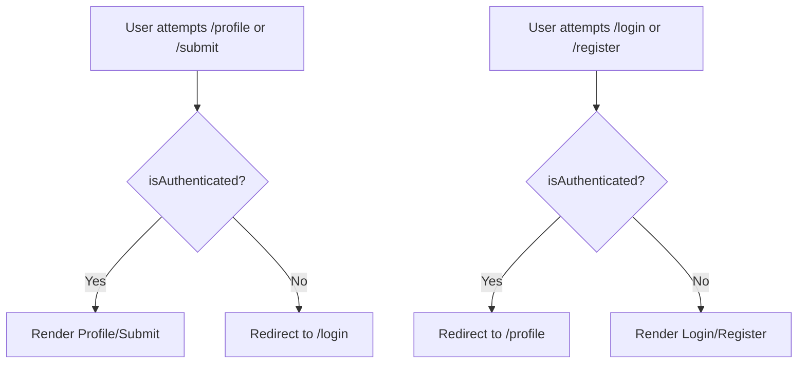
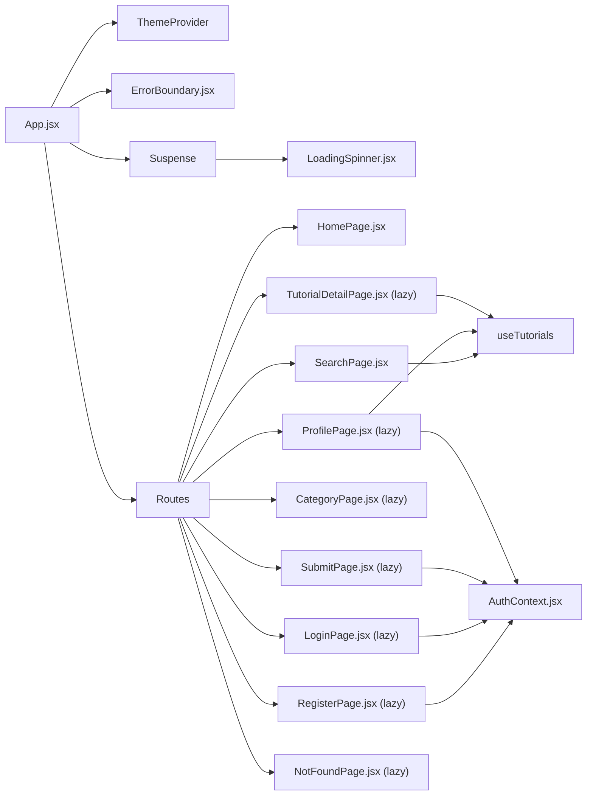

# Route Configuration

<cite>
**Referenced Files in This Document**
- [App.jsx](file://src/App.jsx)
- [index.jsx](file://src/index.jsx)
- [HomePage.jsx](file://src/pages/HomePage.jsx)
- [SearchPage.jsx](file://src/pages/SearchPage.jsx)
- [TutorialDetailPage.jsx](file://src/pages/TutorialDetailPage.jsx)
- [CategoryPage.jsx](file://src/pages/CategoryPage.jsx)
- [ProfilePage.jsx](file://src/pages/ProfilePage.jsx)
- [SubmitPage.jsx](file://src/pages/SubmitPage.jsx)
- [LoginPage.jsx](file://src/pages/LoginPage.jsx)
- [RegisterPage.jsx](file://src/pages/RegisterPage.jsx)
- [NotFoundPage.jsx](file://src/pages/NotFoundPage.jsx)
- [ErrorBoundary.jsx](file://src/components/ErrorBoundary.jsx)
- [LoadingSpinner.jsx](file://src/components/LoadingSpinner.jsx)
- [AuthContext.jsx](file://src/contexts/AuthContext.jsx)
</cite>

## Table of Contents
1. [Introduction](#introduction)
2. [Project Structure](#project-structure)
3. [Core Components](#core-components)
4. [Architecture Overview](#architecture-overview)
5. [Detailed Component Analysis](#detailed-component-analysis)
6. [Dependency Analysis](#dependency-analysis)
7. [Performance Considerations](#performance-considerations)
8. [Troubleshooting Guide](#troubleshooting-guide)
9. [Conclusion](#conclusion)

## Introduction
This document explains GameDev Hub’s route configuration built with React Router v7. It covers all defined routes, their hierarchy and nesting patterns, lazy loading with React.lazy, fallback behavior via Suspense and LoadingSpinner, parameter handling for dynamic segments, wildcard matching, integration with ThemeProvider and ErrorBoundary, and security considerations for protected routes.

## Project Structure
The routing is declared at the application root and wraps the entire UI tree. Providers (theme, auth, tutorials, toast) are set up in the entry file and consumed by pages and components.

**Diagram sources**
- [index.jsx:11-24](file://src/index.jsx#L11-L24)
- [App.jsx:21-48](file://src/App.jsx#L21-L48)

**Section sources**
- [index.jsx:11-24](file://src/index.jsx#L11-L24)
- [App.jsx:21-48](file://src/App.jsx#L21-L48)

## Core Components
- App renders the top-level routing and integrates providers, theme, error boundary, and loading fallback.
- Pages are statically imported for frequently visited routes and lazily imported for less-frequently accessed ones to optimize initial load.
- ErrorBoundary wraps the routing to gracefully handle rendering errors.
- LoadingSpinner is used as the Suspense fallback while lazy chunks are loading.

Key routing highlights:
- Static imports: Home, Search.
- Lazy imports: TutorialDetail, Submit, Category, Profile, Login, Register, NotFound.
- Parameterized routes: /tutorial/:id, /category/:slug.
- Wildcard route: * for 404 handling.

**Section sources**
- [App.jsx:13-19](file://src/App.jsx#L13-L19)
- [App.jsx:27-41](file://src/App.jsx#L27-L41)

## Architecture Overview
The routing system is flat (no nested routes) but leverages lazy loading and global providers to keep the UX responsive and consistent.

**Diagram sources**
- [index.jsx:11-24](file://src/index.jsx#L11-L24)
- [App.jsx:27-41](file://src/App.jsx#L27-L41)

## Detailed Component Analysis

### Route Definitions and Behavior
- Route /
  - Element: HomePage
  - Purpose: Landing page with navigation to search and submission.
  - Navigation: Uses Link to /search and /submit.

- Route /search
  - Element: SearchPage
  - Behavior: Reads URL query parameters and synchronizes filters/sorting to URL; updates context accordingly.

- Route /tutorial/:id
  - Element: TutorialDetailPage (lazy)
  - Parameter: id (tutorial identifier)
  - Behavior: Loads tutorial by ID, increments view count, supports ratings, reviews, bookmarks, completion tracking, and series navigation.

- Route /submit
  - Element: SubmitPage (lazy)
  - Security: Requires authentication; redirects unauthenticated users to /login.

- Route /category/:slug
  - Element: CategoryPage (lazy)
  - Parameter: slug (category identifier)
  - Behavior: Displays tutorials filtered by category; handles unknown categories.

- Route /profile
  - Element: ProfilePage (lazy)
  - Security: Requires authentication; redirects unauthenticated users to /login.

- Route /login
  - Element: LoginPage (lazy)
  - Behavior: Handles login; redirects authenticated users to /profile.

- Route /register
  - Element: RegisterPage (lazy)
  - Behavior: Handles registration; redirects authenticated users to /profile.

- Route *
  - Element: NotFoundPage (lazy)
  - Behavior: Fallback for unmatched routes.

**Section sources**
- [App.jsx:30-38](file://src/App.jsx#L30-L38)
- [SearchPage.jsx:22-81](file://src/pages/SearchPage.jsx#L22-L81)
- [TutorialDetailPage.jsx:22-101](file://src/pages/TutorialDetailPage.jsx#L22-L101)
- [CategoryPage.jsx:8-24](file://src/pages/CategoryPage.jsx#L8-L24)
- [ProfilePage.jsx:15-52](file://src/pages/ProfilePage.jsx#L15-L52)
- [SubmitPage.jsx:10-52](file://src/pages/SubmitPage.jsx#L10-L52)
- [LoginPage.jsx:6-17](file://src/pages/LoginPage.jsx#L6-L17)
- [RegisterPage.jsx:6-19](file://src/pages/RegisterPage.jsx#L6-L19)
- [NotFoundPage.jsx:5-23](file://src/pages/NotFoundPage.jsx#L5-L23)

### Route Hierarchy and Nesting
- No nested routes are defined. All routes are top-level.
- Global providers and layout (header/footer) wrap all routes.
- Authentication checks are performed inside individual pages rather than at the route level.

**Section sources**
- [App.jsx:21-48](file://src/App.jsx#L21-L48)

### Lazy Loading Implementation
- Dynamic imports are used for pages that are not frequently accessed or are large:
  - TutorialDetailPage
  - SubmitPage
  - CategoryPage
  - ProfilePage
  - LoginPage
  - RegisterPage
  - NotFoundPage
- Static imports are used for:
  - HomePage
  - SearchPage

Why lazy?
- Reduces initial bundle size.
- Improves first paint and time-to-interactive for the most common paths (/ and /search).
- Defers heavy components until they are actually needed.

**Section sources**
- [App.jsx:13-19](file://src/App.jsx#L13-L19)
- [App.jsx:30-38](file://src/App.jsx#L30-L38)

### Fallback Mechanism with Suspense and LoadingSpinner
- Suspense wraps Routes to show a fallback while lazy chunks are loading.
- LoadingSpinner is rendered as the fallback UI.
- ErrorBoundary wraps the routing to catch rendering errors and present a friendly UI with retry.

**Diagram sources**
- [App.jsx:27-41](file://src/App.jsx#L27-L41)
- [ErrorBoundary.jsx:6-58](file://src/components/ErrorBoundary.jsx#L6-L58)
- [LoadingSpinner.jsx:4-10](file://src/components/LoadingSpinner.jsx#L4-L10)

**Section sources**
- [App.jsx:27-41](file://src/App.jsx#L27-L41)
- [ErrorBoundary.jsx:6-58](file://src/components/ErrorBoundary.jsx#L6-L58)
- [LoadingSpinner.jsx:4-10](file://src/components/LoadingSpinner.jsx#L4-L10)

### Route Parameter Handling
- /tutorial/:id
  - Extracted via useParams; loads tutorial by ID and handles missing tutorials gracefully.
  - Navigates to related tutorials and supports series navigation.

- /category/:slug
  - Extracted via useParams; resolves category label/icon/count; handles invalid slugs.

**Diagram sources**
- [TutorialDetailPage.jsx:22-101](file://src/pages/TutorialDetailPage.jsx#L22-L101)

**Section sources**
- [TutorialDetailPage.jsx:22-101](file://src/pages/TutorialDetailPage.jsx#L22-L101)
- [CategoryPage.jsx:8-24](file://src/pages/CategoryPage.jsx#L8-L24)

### Route Precedence and Wildcard Matching
- React Router v7 matches routes in order. Since no nested routes are defined, the order in the Routes block determines precedence.
- The wildcard route (*) matches any path not matched by previous routes and is used for 404 handling.
- Because all top-level routes are defined before the wildcard, the wildcard acts as a catch-all after explicit routes.

**Section sources**
- [App.jsx:38](file://src/App.jsx#L38)

### Integration with ThemeProvider and ErrorBoundary
- ThemeProvider wraps the app to enable theme-aware components.
- ErrorBoundary wraps the routing so rendering errors in any page are handled gracefully.
- Suspense ensures a smooth loading experience during lazy chunk fetches.

**Section sources**
- [App.jsx:23-41](file://src/App.jsx#L23-L41)

### Route Security and Authentication
- Protected routes:
  - /profile: Redirects unauthenticated users to /login.
  - /submit: Redirects unauthenticated users to /login.
  - /login and /register: Redirect authenticated users to /profile.
- Authentication state is provided by AuthProvider and consumed via useAuth in pages.
- Navigation helpers:
  - LoginPage and RegisterPage redirect authenticated users appropriately.
  - TutorialDetailPage navigates to /login when attempting actions requiring authentication.

**Diagram sources**
- [ProfilePage.jsx:15-52](file://src/pages/ProfilePage.jsx#L15-L52)
- [SubmitPage.jsx:10-52](file://src/pages/SubmitPage.jsx#L10-L52)
- [LoginPage.jsx:6-17](file://src/pages/LoginPage.jsx#L6-L17)
- [RegisterPage.jsx:6-19](file://src/pages/RegisterPage.jsx#L6-L19)
- [TutorialDetailPage.jsx:125-141](file://src/pages/TutorialDetailPage.jsx#L125-L141)

**Section sources**
- [AuthContext.jsx:13-104](file://src/contexts/AuthContext.jsx#L13-L104)
- [ProfilePage.jsx:15-52](file://src/pages/ProfilePage.jsx#L15-L52)
- [SubmitPage.jsx:10-52](file://src/pages/SubmitPage.jsx#L10-L52)
- [LoginPage.jsx:6-17](file://src/pages/LoginPage.jsx#L6-L17)
- [RegisterPage.jsx:6-19](file://src/pages/RegisterPage.jsx#L6-L19)
- [TutorialDetailPage.jsx:125-141](file://src/pages/TutorialDetailPage.jsx#L125-L141)

## Dependency Analysis
- App depends on:
  - ThemeProvider (layout theming)
  - ErrorBoundary (rendering error handling)
  - Suspense + LoadingSpinner (lazy loading UX)
  - React.lazy imports for heavy pages
- Pages depend on:
  - useAuth for authentication checks
  - useTutorials for data operations
  - useToast for notifications
  - useSearchParams/useNavigate for URL interactions

**Diagram sources**
- [App.jsx:21-48](file://src/App.jsx#L21-L48)
- [ProfilePage.jsx:15-52](file://src/pages/ProfilePage.jsx#L15-L52)
- [SubmitPage.jsx:10-52](file://src/pages/SubmitPage.jsx#L10-L52)
- [LoginPage.jsx:6-17](file://src/pages/LoginPage.jsx#L6-L17)
- [RegisterPage.jsx:6-19](file://src/pages/RegisterPage.jsx#L6-L19)
- [TutorialDetailPage.jsx:22-101](file://src/pages/TutorialDetailPage.jsx#L22-L101)
- [SearchPage.jsx:22-81](file://src/pages/SearchPage.jsx#L22-L81)
- [AuthContext.jsx:13-104](file://src/contexts/AuthContext.jsx#L13-L104)

**Section sources**
- [App.jsx:21-48](file://src/App.jsx#L21-L48)
- [AuthContext.jsx:13-104](file://src/contexts/AuthContext.jsx#L13-L104)

## Performance Considerations
- Keep frequently visited routes (/, /search) statically imported to avoid extra network requests.
- Continue lazy-loading heavier pages to reduce initial payload.
- Use Suspense boundaries around lazy components to prevent layout shifts and improve perceived performance.
- Consider preloading hints for pages users are likely to visit next (e.g., after visiting /search).

## Troubleshooting Guide
- Symptom: Blank screen or long load time on first navigation
  - Cause: Lazy chunk not yet loaded
  - Resolution: Ensure Suspense fallback is visible; verify lazy import paths are correct

- Symptom: Error overlay appears unexpectedly
  - Cause: Rendering error in a page component
  - Resolution: ErrorBoundary will display a friendly UI; check browser console for stack traces

- Symptom: 404 page shows for valid URLs
  - Cause: Route order or parameter mismatch
  - Resolution: Verify route order and parameter names; ensure wildcard is last

- Symptom: Protected route shows login prompt
  - Cause: Unauthenticated user
  - Resolution: Redirect to /login; after login, route will navigate to /profile

**Section sources**
- [ErrorBoundary.jsx:6-58](file://src/components/ErrorBoundary.jsx#L6-L58)
- [App.jsx:38](file://src/App.jsx#L38)
- [ProfilePage.jsx:15-52](file://src/pages/ProfilePage.jsx#L15-L52)

## Conclusion
GameDev Hub’s routing is intentionally simple and efficient: a flat set of top-level routes with strategic lazy loading, robust error handling via ErrorBoundary, and a consistent loading experience through Suspense and LoadingSpinner. Authentication is enforced at the page level, ensuring a clean separation of concerns and predictable UX for both authenticated and anonymous users.