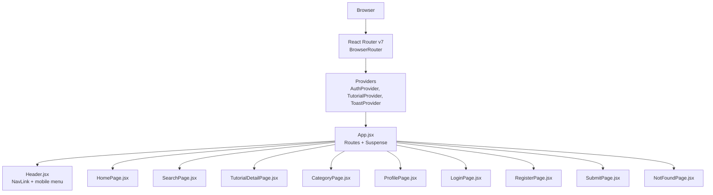
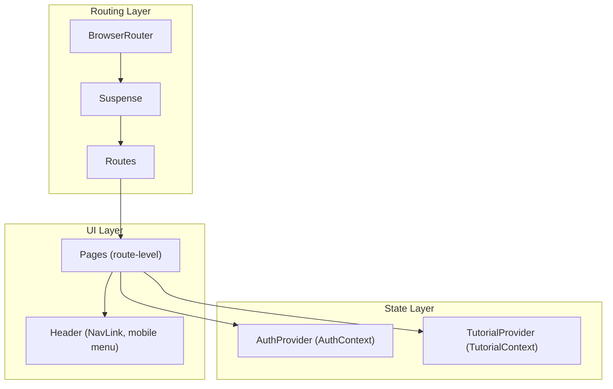
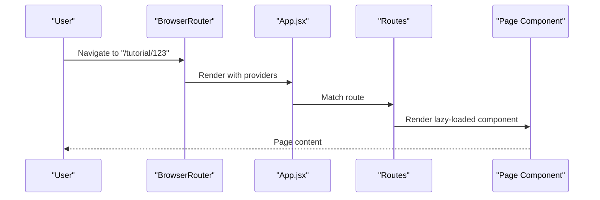
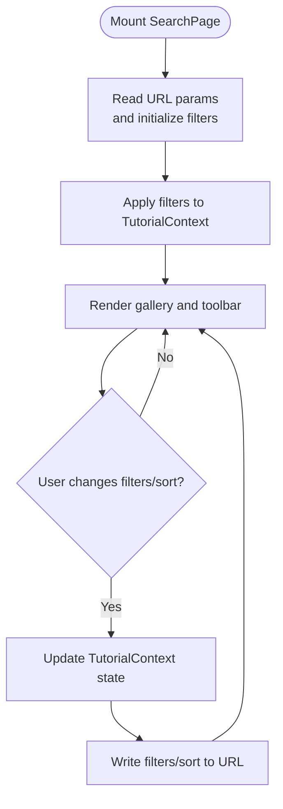
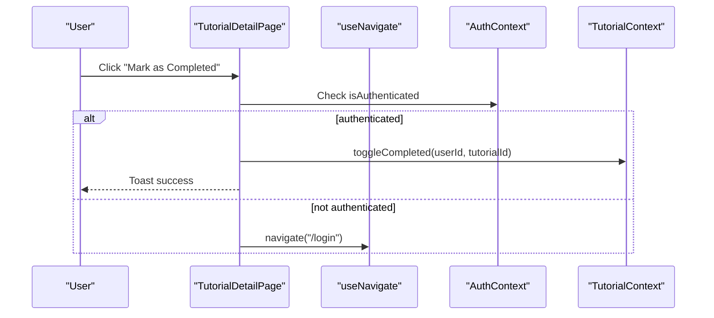
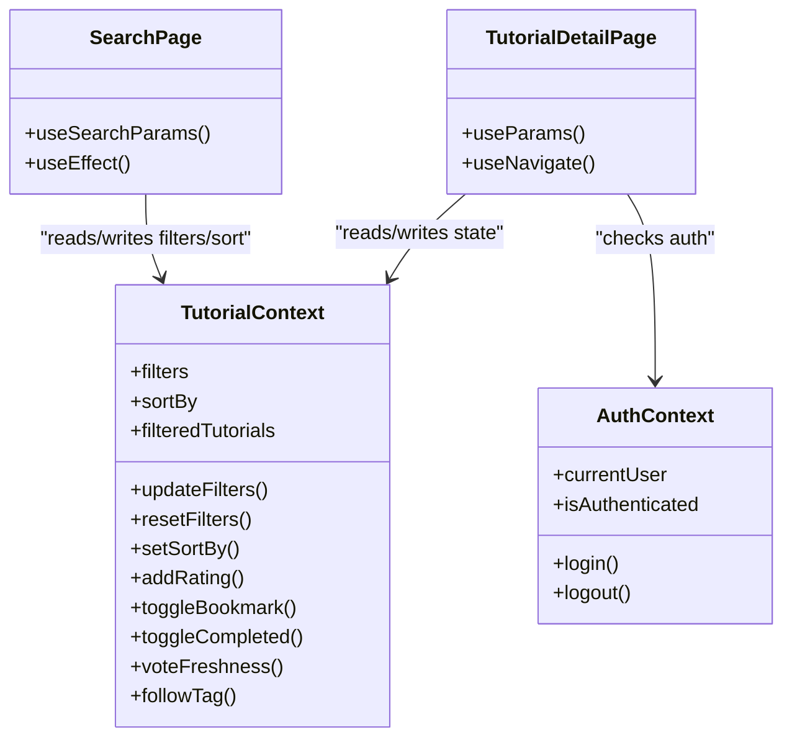
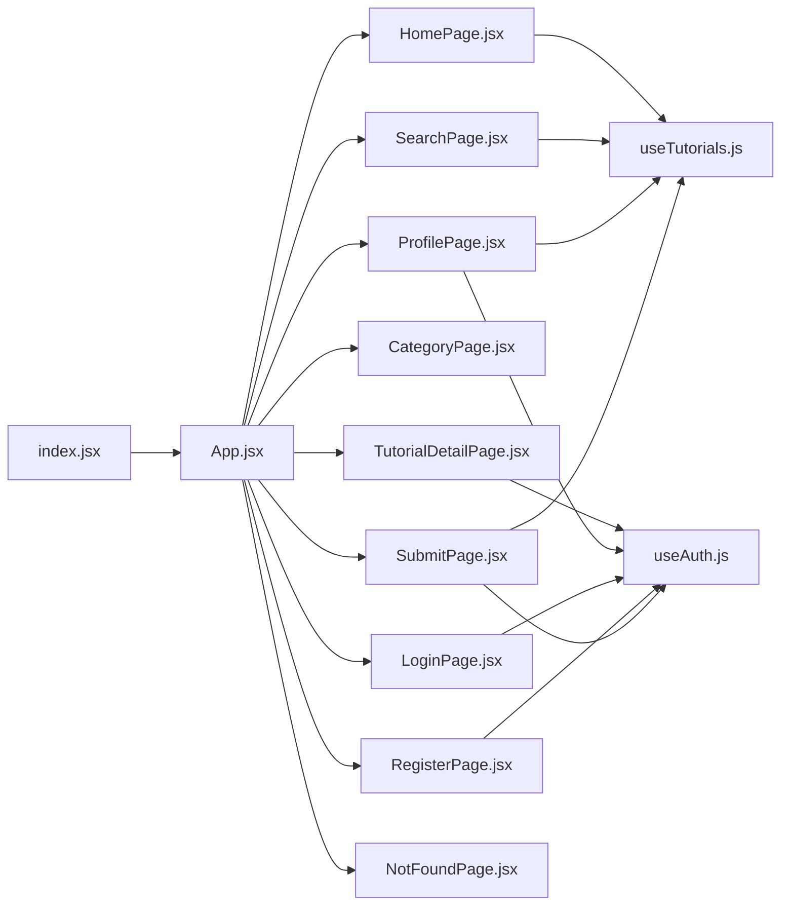

# Routing & Navigation

<cite>
**Referenced Files in This Document**
- [App.jsx](file://src/App.jsx)
- [index.jsx](file://src/index.jsx)
- [Header.jsx](file://src/components/layout/Header.jsx)
- [Sidebar.jsx](file://src/components/layout/Sidebar.jsx)
- [HomePage.jsx](file://src/pages/HomePage.jsx)
- [SearchPage.jsx](file://src/pages/SearchPage.jsx)
- [TutorialDetailPage.jsx](file://src/pages/TutorialDetailPage.jsx)
- [CategoryPage.jsx](file://src/pages/CategoryPage.jsx)
- [ProfilePage.jsx](file://src/pages/ProfilePage.jsx)
- [LoginPage.jsx](file://src/pages/LoginPage.jsx)
- [RegisterPage.jsx](file://src/pages/RegisterPage.jsx)
- [SubmitPage.jsx](file://src/pages/SubmitPage.jsx)
- [NotFoundPage.jsx](file://src/pages/NotFoundPage.jsx)
- [TutorialContext.jsx](file://src/contexts/TutorialContext.jsx)
- [AuthContext.jsx](file://src/contexts/AuthContext.jsx)
- [useTutorials.js](file://src/hooks/useTutorials.js)
- [useAuth.js](file://src/hooks/useAuth.js)
- [filterUtils.js](file://src/utils/filterUtils.js)
</cite>

## Table of Contents
1. [Introduction](#introduction)
2. [Project Structure](#project-structure)
3. [Core Components](#core-components)
4. [Architecture Overview](#architecture-overview)
5. [Detailed Component Analysis](#detailed-component-analysis)
6. [Dependency Analysis](#dependency-analysis)
7. [Performance Considerations](#performance-considerations)
8. [Troubleshooting Guide](#troubleshooting-guide)
9. [Conclusion](#conclusion)

## Introduction
This document explains GameDev Hub’s routing and navigation system built with React Router v7. It covers route definitions, lazy loading and code splitting, page component responsibilities, programmatic navigation, authentication-aware navigation, URL-synced filtering, breadcrumbs and active link highlighting, accessibility features, performance optimizations, error handling for invalid routes, mobile navigation patterns, and integration with state management for persistent filter state.

## Project Structure
The routing system is bootstrapped at the application root and composed of:
- A central router configuration that defines routes and wraps the app with providers.
- Route-level page components that encapsulate page-specific logic and UI.
- Navigation components (header, sidebar) that provide user-driven navigation and mobile responsiveness.
- Context providers that supply shared state (authentication, tutorials) to route components.

**Diagram sources**
- [index.jsx:11-24](file://src/index.jsx#L11-L24)
- [App.jsx:21-48](file://src/App.jsx#L21-L48)
- [Header.jsx:8-115](file://src/components/layout/Header.jsx#L8-L115)

**Section sources**
- [index.jsx:11-24](file://src/index.jsx#L11-L24)
- [App.jsx:21-48](file://src/App.jsx#L21-L48)

## Core Components
- Router and Providers: The application mounts under a single Router and provider stack, ensuring global access to authentication, tutorials, and toast services.
- Route Definitions: Static routes define top-level pages and a catch-all for invalid paths.
- Lazy Loading: Route-level components are dynamically imported to reduce initial bundle size.
- Suspense Fallback: A loading spinner is shown while lazy components load.

Key responsibilities:
- App.jsx: Declares routes, lazy-loads heavy pages, and wraps content with providers and error boundary.
- index.jsx: Sets up the Router and provider chain.

**Section sources**
- [App.jsx:13-19](file://src/App.jsx#L13-L19)
- [App.jsx:28-41](file://src/App.jsx#L28-L41)
- [index.jsx:14-22](file://src/index.jsx#L14-L22)

## Architecture Overview
The routing architecture integrates React Router with application-wide contexts and page components. Authentication and tutorial state are consumed via hooks inside route components. Navigation is driven by declarative links and programmatic navigation where needed.

**Diagram sources**
- [index.jsx:14-22](file://src/index.jsx#L14-L22)
- [App.jsx:28-41](file://src/App.jsx#L28-L41)
- [Header.jsx:20-35](file://src/components/layout/Header.jsx#L20-L35)
- [AuthContext.jsx:13-104](file://src/contexts/AuthContext.jsx#L13-L104)
- [TutorialContext.jsx:18-541](file://src/contexts/TutorialContext.jsx#L18-L541)

## Detailed Component Analysis

### Route Configuration and Lazy Loading
- Static routes cover the primary application pages: home, search, category, tutorial detail, profile, submit, login, register, and a catch-all for 404.
- Heavy pages (tutorial detail, submit, category, profile, login, register, not-found) are lazy-loaded using React.lazy and grouped under a single Suspense boundary for consistent UX.
- The catch-all route renders the not-found page for unmatched URLs.

**Diagram sources**
- [App.jsx:29-39](file://src/App.jsx#L29-L39)
- [App.jsx:13-19](file://src/App.jsx#L13-L19)

**Section sources**
- [App.jsx:29-39](file://src/App.jsx#L29-L39)
- [App.jsx:13-19](file://src/App.jsx#L13-L19)

### Page Component Architecture

#### HomePage
- Purpose: Landing page showcasing featured, popular, and personalized content.
- Navigation: Uses Link to navigate to search and submit pages; displays category cards linking to category pages.
- State: Consumes tutorial and auth hooks to tailor content for logged-in users.

**Section sources**
- [HomePage.jsx:9-94](file://src/pages/HomePage.jsx#L9-L94)

#### SearchPage
- Purpose: Full-text and faceted search with URL-synced filters and sorting.
- URL Sync: Reads query parameters on mount and writes changes back to the URL using useSearchParams.
- Filters: Integrates with TutorialContext via useTutorials to apply and persist filters and sort order.
- UI: Sidebar toggles filters; chips display active filters; sort dropdown controls ordering.

**Diagram sources**
- [SearchPage.jsx:22-81](file://src/pages/SearchPage.jsx#L22-L81)
- [filterUtils.js:1-99](file://src/utils/filterUtils.js#L1-L99)
- [TutorialContext.jsx:68-71](file://src/contexts/TutorialContext.jsx#L68-L71)

**Section sources**
- [SearchPage.jsx:12-141](file://src/pages/SearchPage.jsx#L12-L141)
- [filterUtils.js:1-99](file://src/utils/filterUtils.js#L1-L99)
- [TutorialContext.jsx:68-71](file://src/contexts/TutorialContext.jsx#L68-L71)

#### TutorialDetailPage
- Purpose: Detailed view of a tutorial with embedded video, metadata, actions, reviews, and related content.
- Programmatic Navigation: Uses useNavigate to redirect unauthenticated users to login for protected actions.
- URL Parameter Handling: useParams extracts the tutorial ID; navigates back to search on missing content.
- Series Navigation: Computes previous/next tutorial in a series for seamless browsing.

**Diagram sources**
- [TutorialDetailPage.jsx:134-141](file://src/pages/TutorialDetailPage.jsx#L134-L141)
- [AuthContext.jsx:17-20](file://src/contexts/AuthContext.jsx#L17-L20)
- [TutorialContext.jsx:164-186](file://src/contexts/TutorialContext.jsx#L164-L186)

**Section sources**
- [TutorialDetailPage.jsx:22-296](file://src/pages/TutorialDetailPage.jsx#L22-L296)
- [AuthContext.jsx:17-20](file://src/contexts/AuthContext.jsx#L17-L20)
- [TutorialContext.jsx:164-186](file://src/contexts/TutorialContext.jsx#L164-L186)

#### CategoryPage
- Purpose: Renders tutorials filtered by category slug.
- URL Parameter Handling: useParams reads the slug; falls back to a friendly “not found” UI if the slug does not match a known category.

**Section sources**
- [CategoryPage.jsx:8-51](file://src/pages/CategoryPage.jsx#L8-L51)

#### ProfilePage
- Purpose: User dashboard showing bookmarks, completed tutorials, personal submissions, and followed tags.
- Authentication Guard: Redirects anonymous users to login prompt; uses auth hooks to enforce access.
- Forms and Modals: Supports editing/deleting submissions with inline validation and modal confirmations.

**Section sources**
- [ProfilePage.jsx:15-387](file://src/pages/ProfilePage.jsx#L15-L387)

#### LoginPage and RegisterPage
- Purpose: Authentication flows with programmatic navigation after successful actions.
- Guards: Redirect authenticated users away from login/register to profile/home.

**Section sources**
- [LoginPage.jsx:6-82](file://src/pages/LoginPage.jsx#L6-L82)
- [RegisterPage.jsx:6-132](file://src/pages/RegisterPage.jsx#L6-L132)

#### SubmitPage
- Purpose: Tutorial submission form with validation, prerequisite selection, and video availability checks.
- Authentication Guard: Requires login; otherwise prompts to log in.

**Section sources**
- [SubmitPage.jsx:10-388](file://src/pages/SubmitPage.jsx#L10-L388)

#### NotFoundPage
- Purpose: Catch-all page for invalid routes with navigational links.

**Section sources**
- [NotFoundPage.jsx:5-24](file://src/pages/NotFoundPage.jsx#L5-L24)

### Navigation Patterns

#### Active Link Highlighting
- Header uses NavLink with a dynamic class factory to apply an “active” class when the route matches. An optional end prop ensures exact matching for the home route.

**Section sources**
- [Header.jsx:20-21](file://src/components/layout/Header.jsx#L20-L21)
- [Header.jsx:25-34](file://src/components/layout/Header.jsx#L25-L34)

#### Programmatic Navigation
- useNavigate is used in TutorialDetailPage to redirect unauthenticated users to login.
- LoginPage and RegisterPage use navigate after successful auth operations.
- Header uses navigate to reset mobile menu state after clicking a link.

**Section sources**
- [TutorialDetailPage.jsx:135-138](file://src/pages/TutorialDetailPage.jsx#L135-L138)
- [LoginPage.jsx:14-17](file://src/pages/LoginPage.jsx#L14-L17)
- [Header.jsx:16-17](file://src/components/layout/Header.jsx#L16-L17)

#### URL Parameter Handling
- TutorialDetailPage uses useParams to read the tutorial ID.
- CategoryPage uses useParams to resolve category slugs.
- SearchPage uses useSearchParams to read and write filters and sort options.

**Section sources**
- [TutorialDetailPage.jsx:23](file://src/pages/TutorialDetailPage.jsx#L23)
- [CategoryPage.jsx:9](file://src/pages/CategoryPage.jsx#L9)
- [SearchPage.jsx:22](file://src/pages/SearchPage.jsx#L22)

#### Breadcrumb Navigation
- While explicit breadcrumb components are not present, several pages include “Back” links or category breadcrumbs:
  - TutorialDetailPage includes a back-to-search link.
  - CategoryPage includes a back-to-home link.
  - HomePage includes category cards linking to category pages.

**Section sources**
- [TutorialDetailPage.jsx:160-162](file://src/pages/TutorialDetailPage.jsx#L160-L162)
- [CategoryPage.jsx:29-31](file://src/pages/CategoryPage.jsx#L29-L31)
- [HomePage.jsx:68-78](file://src/pages/HomePage.jsx#L68-L78)

#### Mobile Navigation
- Header implements a collapsible mobile menu with a hamburger button, toggling visibility and applying an active state class to the open menu.
- Sidebar provides a mobile-friendly filter panel with a toggle button and counts of active filters.

**Section sources**
- [Header.jsx:96-112](file://src/components/layout/Header.jsx#L96-L112)
- [Sidebar.jsx:4-23](file://src/components/layout/Sidebar.jsx#L4-L23)

#### Accessibility Features
- Header uses aria-label on the hamburger menu for screen readers.
- Links and buttons use semantic markup and appropriate roles; focus management is implicit through native elements.

**Section sources**
- [Header.jsx:99](file://src/components/layout/Header.jsx#L99)

### State Management Integration
- TutorialContext manages:
  - Filter state persisted in localStorage and synchronized with URL query parameters in SearchPage.
  - Sorting preferences persisted in localStorage.
  - Derived computed lists (featured, popular, filtered).
  - Actions for ratings, reviews, bookmarks, completions, freshness voting, and tag following.
- AuthContext manages:
  - Current user session and authentication state.
  - Local storage-backed persistence for sessions and users.

**Diagram sources**
- [TutorialContext.jsx:18-541](file://src/contexts/TutorialContext.jsx#L18-L541)
- [AuthContext.jsx:13-104](file://src/contexts/AuthContext.jsx#L13-L104)
- [SearchPage.jsx:22-81](file://src/pages/SearchPage.jsx#L22-L81)
- [TutorialDetailPage.jsx:23-44](file://src/pages/TutorialDetailPage.jsx#L23-L44)

**Section sources**
- [TutorialContext.jsx:18-541](file://src/contexts/TutorialContext.jsx#L18-L541)
- [AuthContext.jsx:13-104](file://src/contexts/AuthContext.jsx#L13-L104)

## Dependency Analysis
- App.jsx depends on:
  - Lazy-loaded page components.
  - Provider stack from index.jsx.
  - Error boundary and loading fallback.
- Pages depend on:
  - Hooks for auth and tutorials.
  - Router hooks for navigation and URL parameters.
- Header depends on:
  - AuthContext for user state.
  - ThemeContext for UI theming.
  - Router hooks for navigation and active link styling.

**Diagram sources**
- [index.jsx:14-22](file://src/index.jsx#L14-L22)
- [App.jsx:9-19](file://src/App.jsx#L9-L19)
- [useTutorials.js:4-10](file://src/hooks/useTutorials.js#L4-L10)
- [useAuth.js:4-10](file://src/hooks/useAuth.js#L4-L10)

**Section sources**
- [index.jsx:14-22](file://src/index.jsx#L14-L22)
- [App.jsx:9-19](file://src/App.jsx#L9-L19)

## Performance Considerations
- Code Splitting: Route-level components are lazily imported to reduce initial JavaScript payload.
- Suspense Fallback: A loading spinner is shown during component loading to improve perceived performance.
- Filtering and Sorting: TutorialContext computes derived data and sorts only when inputs change, minimizing re-renders.
- URL Sync: SearchPage defers URL synchronization until after initial hydration to avoid redundant updates.

Recommendations:
- Consider granular Suspense boundaries per heavy page if further optimization is needed.
- Debounce URL writes in SearchPage for very frequent filter changes.
- Use memoization for expensive computations in TutorialContext where applicable.

**Section sources**
- [App.jsx:13-19](file://src/App.jsx#L13-L19)
- [App.jsx:28-41](file://src/App.jsx#L28-L41)
- [SearchPage.jsx:59-81](file://src/pages/SearchPage.jsx#L59-L81)
- [TutorialContext.jsx:68-71](file://src/contexts/TutorialContext.jsx#L68-L71)

## Troubleshooting Guide
- Invalid Routes:
  - The catch-all route renders NotFoundPage. Ensure users are directed appropriately after login failures or invalid navigation attempts.
- Authentication Guards:
  - LoginPage and RegisterPage redirect authenticated users; verify navigation after login/register success.
  - TutorialDetailPage redirects unauthenticated users attempting protected actions; ensure proper messaging.
- URL Sync Issues:
  - If filters do not persist in the URL, verify that setSearchParams is called after initialization and that no conflicting updates occur.
- Lazy Loading Failures:
  - Confirm that lazy imports resolve correctly and that the Suspense fallback appears during loading.

**Section sources**
- [App.jsx:38](file://src/App.jsx#L38)
- [NotFoundPage.jsx:5-24](file://src/pages/NotFoundPage.jsx#L5-L24)
- [LoginPage.jsx:14-17](file://src/pages/LoginPage.jsx#L14-L17)
- [RegisterPage.jsx:16-19](file://src/pages/RegisterPage.jsx#L16-L19)
- [TutorialDetailPage.jsx:135-138](file://src/pages/TutorialDetailPage.jsx#L135-L138)
- [SearchPage.jsx:59-81](file://src/pages/SearchPage.jsx#L59-L81)

## Conclusion
GameDev Hub’s routing and navigation system leverages React Router v7 with a clean provider stack, route-level lazy loading, and robust URL-synced filtering. Page components encapsulate responsibilities, while Header and Sidebar provide accessible, responsive navigation. Authentication-aware guards and programmatic navigation ensure secure and smooth user experiences. The integration with TutorialContext and AuthContext enables persistent state across navigation, supporting advanced features like personalized feeds, bookmarks, and user-generated content.