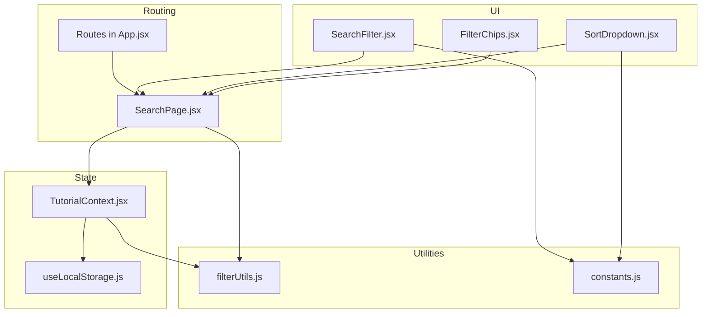
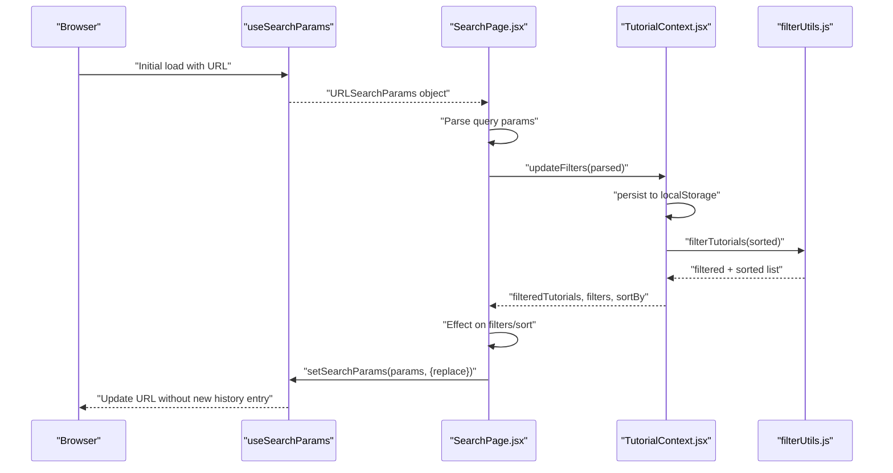
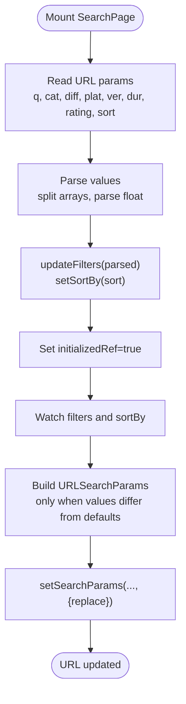
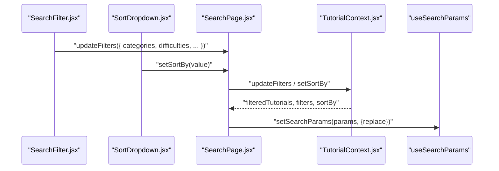
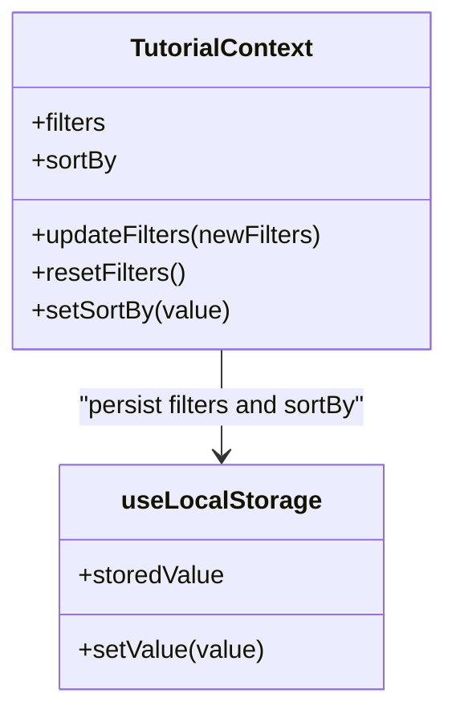
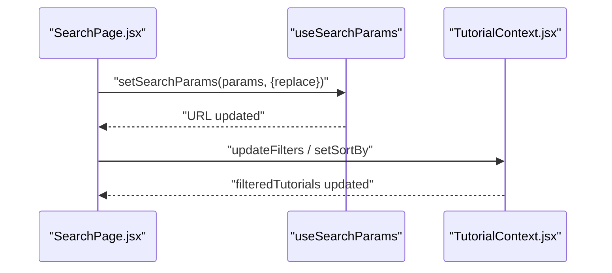
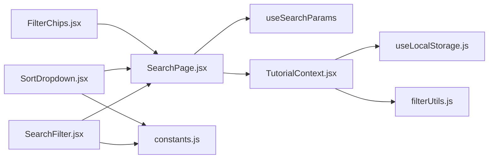

# URL Synchronization

<cite>
**Referenced Files in This Document**
- [App.jsx](file://src/App.jsx)
- [SearchPage.jsx](file://src/pages/SearchPage.jsx)
- [TutorialContext.jsx](file://src/contexts/TutorialContext.jsx)
- [useTutorials.js](file://src/hooks/useTutorials.js)
- [filterUtils.js](file://src/utils/filterUtils.js)
- [SearchFilter.jsx](file://src/components/SearchFilter.jsx)
- [SortDropdown.jsx](file://src/components/SortDropdown.jsx)
- [FilterChips.jsx](file://src/components/FilterChips.jsx)
- [constants.js](file://src/data/constants.js)
- [useLocalStorage.js](file://src/hooks/useLocalStorage.js)
- [tutorials.js](file://src/data/tutorials.js)
</cite>

## Table of Contents
1. [Introduction](#introduction)
2. [Project Structure](#project-structure)
3. [Core Components](#core-components)
4. [Architecture Overview](#architecture-overview)
5. [Detailed Component Analysis](#detailed-component-analysis)
6. [Dependency Analysis](#dependency-analysis)
7. [Performance Considerations](#performance-considerations)
8. [Troubleshooting Guide](#troubleshooting-guide)
9. [Conclusion](#conclusion)
10. [Appendices](#appendices)

## Introduction
This document explains GameDev Hub’s URL synchronization system for search criteria, filters, and user preferences. It covers how URL query strings persist search terms, filter selections, and sort order; how react-router hooks integrate with component state; how localStorage maintains state across browser sessions; the bidirectional sync mechanism between URL parameters and UI state; URL encoding and decoding behavior; browser back/forward button behavior and history management; URL validation and fallbacks; SEO implications; and URL cleanup and normalization.

## Project Structure
The URL synchronization spans several layers:
- Routing and page container: SearchPage reads and writes URL query parameters.
- State management: TutorialContext stores filters and sort preferences in localStorage and exposes filtered results.
- UI components: SearchFilter, SortDropdown, and FilterChips update filters and trigger URL sync.
- Utilities: filterUtils performs filtering and sorting based on the current filters.

**Diagram sources**
- [App.jsx:29-39](file://src/App.jsx#L29-L39)
- [SearchPage.jsx:12-22](file://src/pages/SearchPage.jsx#L12-L22)
- [TutorialContext.jsx:18-26](file://src/contexts/TutorialContext.jsx#L18-L26)
- [useLocalStorage.js:3-28](file://src/hooks/useLocalStorage.js#L3-L28)
- [SearchFilter.jsx:19-80](file://src/components/SearchFilter.jsx#L19-L80)
- [SortDropdown.jsx:6-22](file://src/components/SortDropdown.jsx#L6-L22)
- [FilterChips.jsx:6-46](file://src/components/FilterChips.jsx#L6-L46)
- [filterUtils.js:1-99](file://src/utils/filterUtils.js#L1-L99)
- [constants.js:1-71](file://src/data/constants.js#L1-L71)

**Section sources**
- [App.jsx:29-39](file://src/App.jsx#L29-L39)
- [SearchPage.jsx:12-22](file://src/pages/SearchPage.jsx#L12-L22)
- [TutorialContext.jsx:18-26](file://src/contexts/TutorialContext.jsx#L18-L26)

## Core Components
- URL parameter handling: SearchPage uses useSearchParams to read/write query parameters q, cat, diff, plat, ver, dur, rating, sort.
- State persistence: TutorialContext persists filters and sort order in localStorage via useLocalStorage.
- Bidirectional sync: Changes in UI propagate to URL; URL changes propagate to UI.
- Filtering and sorting: filterUtils applies filters and sorts results based on current state.

**Section sources**
- [SearchPage.jsx:22-81](file://src/pages/SearchPage.jsx#L22-L81)
- [TutorialContext.jsx:18-26](file://src/contexts/TutorialContext.jsx#L18-L26)
- [filterUtils.js:1-99](file://src/utils/filterUtils.js#L1-L99)

## Architecture Overview
The URL synchronization architecture integrates react-router, local state, and localStorage to keep the URL and UI synchronized while preserving user preferences across sessions.

**Diagram sources**
- [SearchPage.jsx:22-81](file://src/pages/SearchPage.jsx#L22-L81)
- [TutorialContext.jsx:435-444](file://src/contexts/TutorialContext.jsx#L435-L444)
- [filterUtils.js:1-99](file://src/utils/filterUtils.js#L1-L99)

## Detailed Component Analysis

### URL Parameter Mapping and Sync
- URL parameters:
  - q: searchQuery
  - cat: categories (comma-separated)
  - diff: difficulties (comma-separated)
  - plat: platforms (comma-separated)
  - ver: engineVersions (comma-separated)
  - dur: durationRange
  - rating: minRating
  - sort: sortBy
- Parsing and pushing to state:
  - On mount, SearchPage reads URL params and calls updateFilters and setSortBy.
  - A small delay ensures context settles before enabling URL sync.
- Writing to URL:
  - On filter/sort changes, SearchPage constructs URLSearchParams and calls setSearchParams with replace to avoid polluting browser history.

**Diagram sources**
- [SearchPage.jsx:25-57](file://src/pages/SearchPage.jsx#L25-L57)
- [SearchPage.jsx:60-81](file://src/pages/SearchPage.jsx#L60-L81)

**Section sources**
- [SearchPage.jsx:22-81](file://src/pages/SearchPage.jsx#L22-L81)

### Integration Between URL Parameters and Component State
- SearchPage holds the URL state via useSearchParams and reconciles it with TutorialContext filters and sortBy.
- UI components (SearchFilter, SortDropdown, FilterChips) update filters and sort via context methods, which trigger URL updates.

**Diagram sources**
- [SearchFilter.jsx:66-80](file://src/components/SearchFilter.jsx#L66-L80)
- [SortDropdown.jsx:10-14](file://src/components/SortDropdown.jsx#L10-L14)
- [SearchPage.jsx:13-20](file://src/pages/SearchPage.jsx#L13-L20)
- [SearchPage.jsx:60-81](file://src/pages/SearchPage.jsx#L60-L81)

**Section sources**
- [SearchFilter.jsx:19-80](file://src/components/SearchFilter.jsx#L19-L80)
- [SortDropdown.jsx:6-22](file://src/components/SortDropdown.jsx#L6-L22)
- [SearchPage.jsx:13-20](file://src/pages/SearchPage.jsx#L13-L20)

### localStorage Integration for Persistent State
- TutorialContext persists filters and sortBy in localStorage using useLocalStorage.
- This enables cross-session continuity: users can reload the page or return later and retain their filters and sort preference.
- The same keys are used for URL sync, ensuring consistency between URL and localStorage.

**Diagram sources**
- [TutorialContext.jsx:18-26](file://src/contexts/TutorialContext.jsx#L18-L26)
- [useLocalStorage.js:3-28](file://src/hooks/useLocalStorage.js#L3-L28)

**Section sources**
- [TutorialContext.jsx:18-26](file://src/contexts/TutorialContext.jsx#L18-L26)
- [useLocalStorage.js:3-28](file://src/hooks/useLocalStorage.js#L3-L28)

### Sync Mechanism: URL ↔ UI State
- Mount-time sync:
  - URL params are parsed and pushed into context state.
- Change-time sync:
  - When filters or sortBy change, URLSearchParams is rebuilt and setSearchParams is called with replace to update the URL without adding history entries.
- Reset behavior:
  - Clearing filters replaces URL with empty params to normalize the URL.

**Diagram sources**
- [SearchPage.jsx:60-81](file://src/pages/SearchPage.jsx#L60-L81)
- [SearchPage.jsx:85-90](file://src/pages/SearchPage.jsx#L85-L90)

**Section sources**
- [SearchPage.jsx:60-81](file://src/pages/SearchPage.jsx#L60-L81)
- [SearchPage.jsx:85-90](file://src/pages/SearchPage.jsx#L85-L90)

### URL Encoding and Decoding Behavior
- Arrays are encoded as comma-separated strings in the URL (e.g., cat=2D,3D).
- Numeric and floating values are encoded as strings (e.g., rating=4.5).
- Special characters in search queries are handled by the browser’s URLSearchParams implementation; no custom encoding is performed in the codebase.
- Duration and rating defaults are normalized to remove redundant parameters when equal to “any” or zero.

**Section sources**
- [SearchPage.jsx:37-43](file://src/pages/SearchPage.jsx#L37-L43)
- [SearchPage.jsx:63-78](file://src/pages/SearchPage.jsx#L63-L78)

### Browser Back/Forward Button Behavior and History Management
- setSearchParams is called with replace: true, which updates the current history entry instead of creating a new one.
- This prevents polluting the browser history with incremental filter changes and keeps the back/forward stack clean.
- The initializedRef guard avoids triggering URL updates during the initial mount reconciliation.

**Section sources**
- [SearchPage.jsx:80](file://src/pages/SearchPage.jsx#L80)
- [SearchPage.jsx:52-57](file://src/pages/SearchPage.jsx#L52-L57)

### URL Validation and Fallback Mechanisms
- Parsing logic:
  - Only non-empty values are applied to filters.
  - Arrays are split and filtered to remove empty entries.
  - rating is parsed as a float; invalid values default to 0.
- Defaults:
  - durationRange defaults to “any”.
  - minRating defaults to 0.
  - sortBy defaults to “newest”.
- Reset behavior:
  - Clearing filters replaces URL with empty params, normalizing the URL.

**Section sources**
- [SearchPage.jsx:27-50](file://src/pages/SearchPage.jsx#L27-L50)
- [SearchPage.jsx:74-78](file://src/pages/SearchPage.jsx#L74-L78)
- [SearchPage.jsx:87-89](file://src/pages/SearchPage.jsx#L87-L89)

### SEO Implications and Crawling Filtered Content
- Canonical URLs:
  - The site uses a single route (/search) with URL parameters for filters. There is no separate canonical URL per filter combination.
- Crawling:
  - Search engines can crawl the same URL with different query parameters, but they may not index each parameter permutation separately.
- Recommendations:
  - Consider implementing server-side rendering or static generation for frequently visited filter combinations to improve discoverability.
  - Use structured data or sitemaps to highlight popular filtered views if feasible.

[No sources needed since this section provides general guidance]

### URL Cleanup and Parameter Normalization
- Redundant parameters are omitted:
  - durationRange is only written when not “any”.
  - minRating is only written when greater than 0.
  - sortBy is only written when not “newest”.
- Arrays are normalized:
  - Empty segments are filtered out when splitting.
- Resetting clears all parameters, returning to a clean URL.

**Section sources**
- [SearchPage.jsx:74-78](file://src/pages/SearchPage.jsx#L74-L78)
- [SearchPage.jsx:38-43](file://src/pages/SearchPage.jsx#L38-L43)
- [SearchPage.jsx:87-89](file://src/pages/SearchPage.jsx#L87-L89)

## Dependency Analysis
The URL synchronization depends on:
- react-router-dom for URL manipulation via useSearchParams.
- TutorialContext for centralized state and localStorage persistence.
- filterUtils for applying filters and sorting.
- UI components for user-driven updates.

**Diagram sources**
- [SearchPage.jsx:22-22](file://src/pages/SearchPage.jsx#L22-L22)
- [TutorialContext.jsx:18-26](file://src/contexts/TutorialContext.jsx#L18-L26)
- [useLocalStorage.js:3-28](file://src/hooks/useLocalStorage.js#L3-L28)
- [filterUtils.js:1-99](file://src/utils/filterUtils.js#L1-L99)
- [SearchFilter.jsx:19-80](file://src/components/SearchFilter.jsx#L19-L80)
- [SortDropdown.jsx:6-22](file://src/components/SortDropdown.jsx#L6-L22)
- [FilterChips.jsx:6-46](file://src/components/FilterChips.jsx#L6-L46)
- [constants.js:1-71](file://src/data/constants.js#L1-L71)

**Section sources**
- [SearchPage.jsx:22-22](file://src/pages/SearchPage.jsx#L22-L22)
- [TutorialContext.jsx:18-26](file://src/contexts/TutorialContext.jsx#L18-L26)
- [filterUtils.js:1-99](file://src/utils/filterUtils.js#L1-L99)

## Performance Considerations
- Debouncing search queries:
  - SearchFilter debounces input to reduce frequent updates and localStorage writes.
- Avoiding unnecessary URL updates:
  - setSearchParams uses replace to prevent extra history entries.
- Efficient filtering:
  - filterUtils applies filters and sorting in a single pass over the dataset.

**Section sources**
- [SearchFilter.jsx:22](file://src/components/SearchFilter.jsx#L22)
- [SearchPage.jsx:80](file://src/pages/SearchPage.jsx#L80)
- [filterUtils.js:1-99](file://src/utils/filterUtils.js#L1-L99)

## Troubleshooting Guide
- Filters not updating URL:
  - Ensure initializedRef is true before URL updates occur.
  - Verify setSearchParams is called with replace and that filters/sort actually changed.
- Invalid or malformed URLs:
  - Empty or malformed arrays are filtered out during parsing.
  - rating is coerced to a float; invalid values default to 0.
- Unexpected filter resets:
  - Clearing filters replaces URL with empty params; confirm handleResetFilters is invoked intentionally.

**Section sources**
- [SearchPage.jsx:52-57](file://src/pages/SearchPage.jsx#L52-L57)
- [SearchPage.jsx:87-89](file://src/pages/SearchPage.jsx#L87-L89)
- [SearchPage.jsx:27-50](file://src/pages/SearchPage.jsx#L27-L50)

## Conclusion
GameDev Hub’s URL synchronization system provides a robust, user-friendly way to share and persist filtered views. By combining react-router’s URL manipulation with localStorage-backed state and careful normalization, the system offers seamless navigation, clean browser history, and consistent behavior across sessions. While the current implementation focuses on a single route with query parameters, future enhancements could include canonicalization strategies to improve SEO.

## Appendices

### URL Parameter Reference
- q: searchQuery (string)
- cat: categories (comma-separated string)
- diff: difficulties (comma-separated string)
- plat: platforms (comma-separated string)
- ver: engineVersions (comma-separated string)
- dur: durationRange (string among predefined ranges)
- rating: minRating (float)
- sort: sortBy (string among predefined options)

**Section sources**
- [SearchPage.jsx:27-50](file://src/pages/SearchPage.jsx#L27-L50)
- [SearchPage.jsx:63-78](file://src/pages/SearchPage.jsx#L63-L78)
- [constants.js:40-53](file://src/data/constants.js#L40-L53)