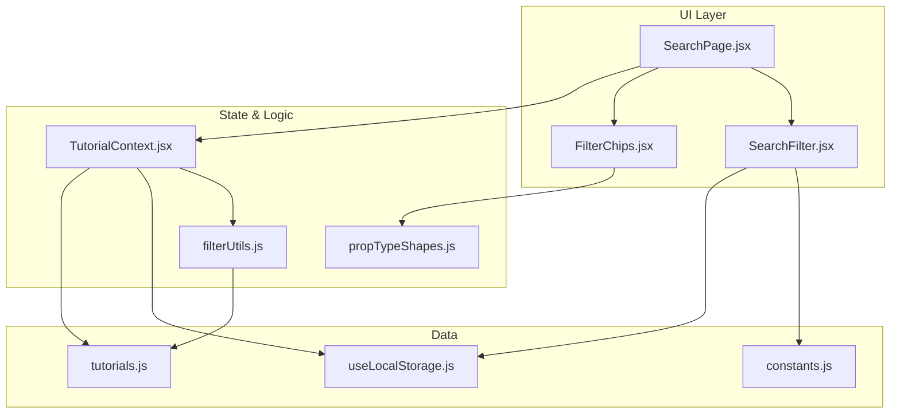
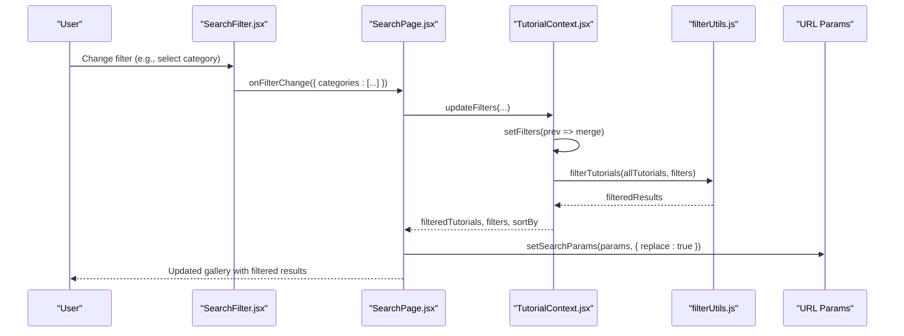
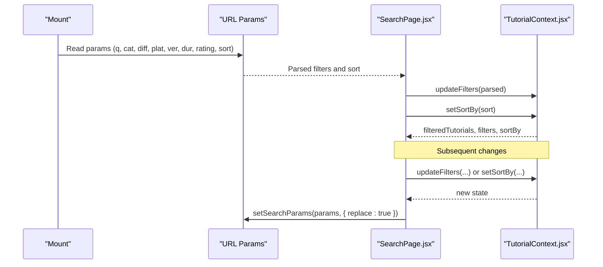
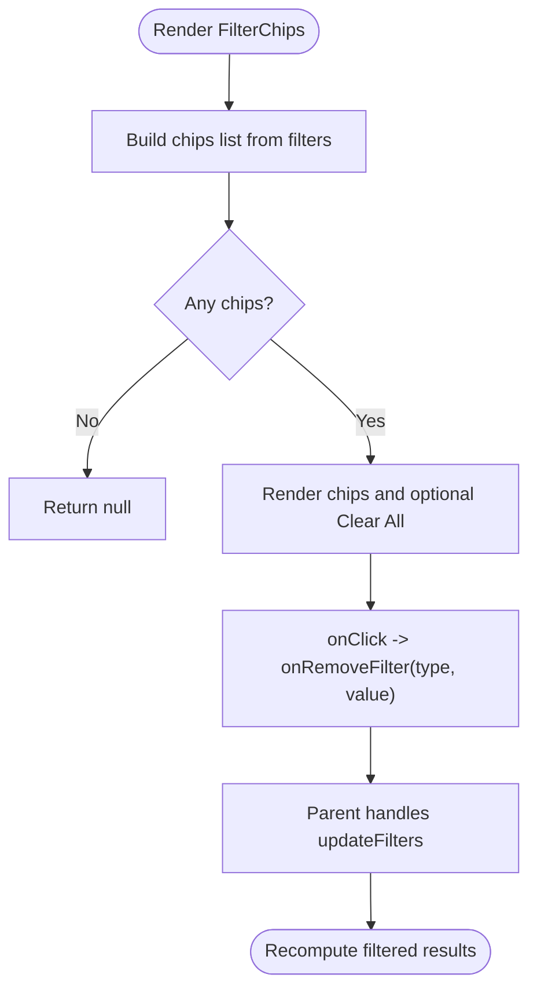
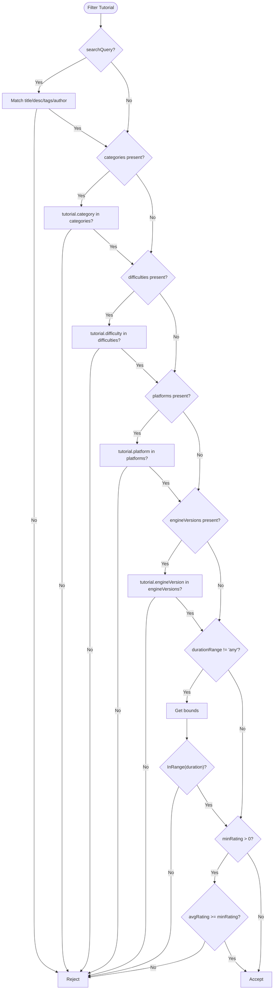
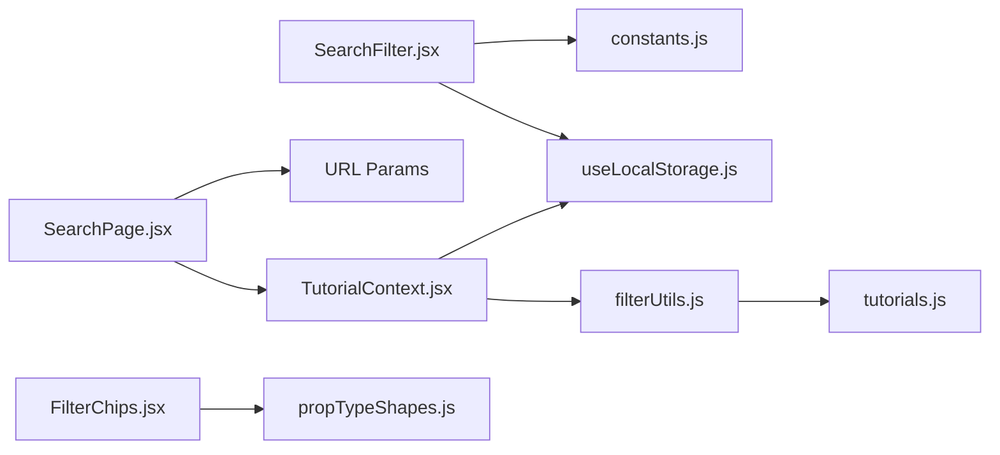

# Filter System

<cite>
**Referenced Files in This Document**
- [useTutorials.js](file://src/hooks/useTutorials.js)
- [TutorialContext.jsx](file://src/contexts/TutorialContext.jsx)
- [filterUtils.js](file://src/utils/filterUtils.js)
- [SearchFilter.jsx](file://src/components/SearchFilter.jsx)
- [FilterChips.jsx](file://src/components/FilterChips.jsx)
- [SearchPage.jsx](file://src/pages/SearchPage.jsx)
- [constants.js](file://src/data/constants.js)
- [tutorials.js](file://src/data/tutorials.js)
- [propTypeShapes.js](file://src/utils/propTypeShapes.js)
- [SearchFilter.module.css](file://src/components/SearchFilter.module.css)
- [FilterChips.module.css](file://src/components/FilterChips.module.css)
- [useLocalStorage.js](file://src/hooks/useLocalStorage.js)
- [useDebounce.js](file://src/hooks/useDebounce.js)
- [filterUtils.test.js](file://src/utils/__tests__/filterUtils.test.js)
</cite>

## Table of Contents
1. [Introduction](#introduction)
2. [Project Structure](#project-structure)
3. [Core Components](#core-components)
4. [Architecture Overview](#architecture-overview)
5. [Detailed Component Analysis](#detailed-component-analysis)
6. [Dependency Analysis](#dependency-analysis)
7. [Performance Considerations](#performance-considerations)
8. [Troubleshooting Guide](#troubleshooting-guide)
9. [Conclusion](#conclusion)
10. [Appendices](#appendices)

## Introduction
This document describes the multi-factor filtering system used to discover tutorials. It covers all filter types (category, difficulty, platform, engine version, duration range, and minimum rating), filter state management via a custom hook and context, URL parameter synchronization, filter chips UI for active filters, validation and defaults, filter count calculation, combination logic, precedence rules, examples, reset functionality, persistence across sessions, performance optimizations, and UI/UX patterns including accessibility and responsiveness.

## Project Structure
The filtering system spans several layers:
- UI components for filter controls and chips
- A context provider that manages filter state and derived results
- Utility functions for filtering, sorting, and counts
- Constants defining filter options
- Tests validating behavior

**Diagram sources**
- [SearchPage.jsx:12-141](file://src/pages/SearchPage.jsx#L12-L141)
- [SearchFilter.jsx:19-237](file://src/components/SearchFilter.jsx#L19-L237)
- [FilterChips.jsx:6-76](file://src/components/FilterChips.jsx#L6-L76)
- [TutorialContext.jsx:18-542](file://src/contexts/TutorialContext.jsx#L18-L542)
- [filterUtils.js:1-99](file://src/utils/filterUtils.js#L1-L99)
- [constants.js:1-71](file://src/data/constants.js#L1-L71)
- [tutorials.js:1-522](file://src/data/tutorials.js#L1-L522)
- [useLocalStorage.js:3-28](file://src/hooks/useLocalStorage.js#L3-L28)
- [propTypeShapes.js:28-36](file://src/utils/propTypeShapes.js#L28-L36)

**Section sources**
- [SearchPage.jsx:12-141](file://src/pages/SearchPage.jsx#L12-L141)
- [TutorialContext.jsx:18-542](file://src/contexts/TutorialContext.jsx#L18-L542)
- [filterUtils.js:1-99](file://src/utils/filterUtils.js#L1-L99)
- [constants.js:1-71](file://src/data/constants.js#L1-L71)

## Core Components
- Filter state and derived results are managed in a context provider that persists filters and sort preferences to local storage.
- The filter UI is composed of a sidebar filter panel and a chips bar for active filters.
- Filtering logic is centralized in a utility that applies all filter criteria in a single pass.
- URL synchronization keeps browser address and filter state in sync.

Key responsibilities:
- State management: TutorialContext maintains filters, sort order, and computed filtered results.
- Filtering: filterUtils.js applies search, category, difficulty, platform, engine version, duration range, and minimum rating filters.
- UI: SearchFilter renders filter controls; FilterChips displays active filters with one-click removal.
- Persistence: useLocalStorage persists filters and sort across sessions.
- Synchronization: SearchPage reads URL params on mount and writes changes back to URL.

**Section sources**
- [TutorialContext.jsx:8-16](file://src/contexts/TutorialContext.jsx#L8-L16)
- [TutorialContext.jsx:67-71](file://src/contexts/TutorialContext.jsx#L67-L71)
- [filterUtils.js:1-99](file://src/utils/filterUtils.js#L1-L99)
- [SearchFilter.jsx:19-237](file://src/components/SearchFilter.jsx#L19-L237)
- [FilterChips.jsx:6-76](file://src/components/FilterChips.jsx#L6-L76)
- [SearchPage.jsx:22-81](file://src/pages/SearchPage.jsx#L22-L81)
- [useLocalStorage.js:3-28](file://src/hooks/useLocalStorage.js#L3-L28)

## Architecture Overview
The filtering architecture follows a unidirectional data flow:
- UI components dispatch filter updates to the context.
- The context merges updates into persistent state and recomputes filtered results.
- The page subscribes to filtered results and renders them.

**Diagram sources**
- [SearchFilter.jsx:66-80](file://src/components/SearchFilter.jsx#L66-L80)
- [SearchPage.jsx:13-20](file://src/pages/SearchPage.jsx#L13-L20)
- [TutorialContext.jsx:435-444](file://src/contexts/TutorialContext.jsx#L435-L444)
- [filterUtils.js:1-60](file://src/utils/filterUtils.js#L1-L60)
- [SearchPage.jsx:60-81](file://src/pages/SearchPage.jsx#L60-L81)

## Detailed Component Analysis

### Filter Types and Options
- Category: Select one or more categories (e.g., 2D, 3D, Programming, Art, Audio, Game Design).
- Difficulty: Select one or more difficulty levels (Beginner, Intermediate, Advanced).
- Platform: Select one or more platforms (Unity, Unreal, Godot, GameMaker, Custom).
- Engine Version: Select one or more engine versions (Unity LTS, Unreal, Godot, GameMaker).
- Duration Range: Choose a duration bucket (Any, Under 15 min, 15–60 min, 1–3 hours, Over 3 hours).
- Minimum Rating: Set a star threshold (3, 3.5, 4, 4.5+).
- Text Search: Free-text search across title, description, tags, and author.

Options are defined centrally and used by both UI and filtering logic.

**Section sources**
- [constants.js:1-71](file://src/data/constants.js#L1-L71)
- [SearchFilter.jsx:120-222](file://src/components/SearchFilter.jsx#L120-L222)
- [filterUtils.js:4-56](file://src/utils/filterUtils.js#L4-L56)

### Filter State Management and URL Synchronization
- State is persisted in TutorialContext using local storage keys for filters and sort.
- Default filters initialize with empty arrays and neutral values (e.g., durationRange set to "any").
- URL synchronization:
  - On mount, URL params are parsed and pushed into context filters.
  - On subsequent changes, context updates URL params to reflect current filters and sort.
  - A small initialization delay prevents premature URL writes.

**Diagram sources**
- [SearchPage.jsx:25-57](file://src/pages/SearchPage.jsx#L25-L57)
- [SearchPage.jsx:60-81](file://src/pages/SearchPage.jsx#L60-L81)
- [TutorialContext.jsx:24-25](file://src/contexts/TutorialContext.jsx#L24-L25)

**Section sources**
- [TutorialContext.jsx:8-16](file://src/contexts/TutorialContext.jsx#L8-L16)
- [TutorialContext.jsx:24-25](file://src/contexts/TutorialContext.jsx#L24-L25)
- [SearchPage.jsx:22-81](file://src/pages/SearchPage.jsx#L22-L81)

### Filter Chips Component
- Renders active filters as removable chips.
- Supports one-click removal per filter type and a global clear-all action.
- Accessibility: buttons include aria-labels for screen readers.

**Diagram sources**
- [FilterChips.jsx:6-69](file://src/components/FilterChips.jsx#L6-L69)

**Section sources**
- [FilterChips.jsx:6-76](file://src/components/FilterChips.jsx#L6-L76)

### Filter Validation, Defaults, and Count Calculation
- Defaults: TutorialContext initializes filters to neutral values.
- Validation:
  - Duration range "any" is ignored for filtering.
  - Minimum rating 0 is ignored for filtering.
  - Arrays are treated as OR within a group; filters across groups are ANDed.
- Count: getActiveFilterCount sums active filters, counting each selected category/difficulty/platform/engine version as a separate unit.

```mermaid
flowchart TD
Start(["Compute Active Filter Count"]) --> Init["count = 0"]
Init --> CheckSearch{"searchQuery?"}
CheckSearch --> |Yes| Inc1["count++"]
CheckSearch --> |No| Next1["continue"]
Inc1 --> Next1
Next1 --> CheckCats{"categories.length > 0?"}
CheckCats --> |Yes| IncCats["count += categories.length"]
CheckCats --> |No| Next2["continue"]
IncCats --> Next2
Next2 --> CheckDiff{"difficulties.length > 0?"}
CheckDiff --> |Yes| IncDiff["count += difficulties.length"]
CheckDiff --> |No| Next3["continue"]
IncDiff --> Next3
Next3 --> CheckPlat{"platforms.length > 0?"}
CheckPlat --> |Yes| IncPlat["count += platforms.length"]
CheckPlat --> |No| Next4["continue"]
IncPlat --> Next4
Next4 --> CheckVer{"engineVersions.length > 0?"}
CheckVer --> |Yes| IncVer["count += engineVersions.length"]
CheckVer --> |No| Next5["continue"]
IncVer --> Next5
Next5 --> CheckDur{"durationRange != 'any'?"}
CheckDur --> |Yes| IncDur["count++"]
CheckDur --> |No| Next6["continue"]
IncDur --> Next6
Next6 --> CheckRating{"minRating > 0?"}
CheckRating --> |Yes| IncRating["count++"]
CheckRating --> |No| Done["return count"]
IncRating --> Done
```

**Diagram sources**
- [filterUtils.js:88-98](file://src/utils/filterUtils.js#L88-L98)

**Section sources**
- [TutorialContext.jsx:8-16](file://src/contexts/TutorialContext.jsx#L8-L16)
- [filterUtils.js:88-98](file://src/utils/filterUtils.js#L88-L98)

### Filter Combination Logic and Precedence
- Combination rules:
  - Categories, difficulties, platforms, engineVersions are OR within each group.
  - Across groups, filters are ANDed (all conditions must match).
  - Text search is matched against title, description, tags, and author.
  - Duration range defines a numeric interval; tutorials must fall within the range.
  - Minimum rating requires the tutorial’s average rating to be greater than or equal to the threshold.
- Precedence:
  - Text search is evaluated first, then category/difficulty/platform/engine version, then duration, then minimum rating.
  - This order ensures early exits for non-matching tutorials.

**Diagram sources**
- [filterUtils.js:1-60](file://src/utils/filterUtils.js#L1-L60)

**Section sources**
- [filterUtils.js:1-60](file://src/utils/filterUtils.js#L1-L60)

### Examples of Filter Combinations
- Example 1: Search "build" AND Beginner AND 15–60 min duration.
- Example 2: Multiple categories (2D and 3D) AND platform Unity AND minimum rating 4+.
- Example 3: No filters (default) returns all tutorials.

These examples are validated by unit tests.

**Section sources**
- [filterUtils.test.js:148-159](file://src/utils/__tests__/filterUtils.test.js#L148-L159)

### Filter Reset Functionality and Persistence
- Reset clears filters to defaults and removes URL parameters.
- Persistence uses local storage for filters and sort order so users’ selections remain across sessions.
- Search suggestions persist in local storage and are debounced to reduce writes.

**Section sources**
- [SearchPage.jsx:85-90](file://src/pages/SearchPage.jsx#L85-L90)
- [TutorialContext.jsx:442-444](file://src/contexts/TutorialContext.jsx#L442-L444)
- [TutorialContext.jsx:24-25](file://src/contexts/TutorialContext.jsx#L24-L25)
- [SearchFilter.jsx:11-41](file://src/components/SearchFilter.jsx#L11-L41)
- [useDebounce.js:3-15](file://src/hooks/useDebounce.js#L3-L15)

### Filter UI Patterns, Accessibility, and Responsive Layouts
- Search input with suggestions dropdown and clear history button.
- Checkbox groups for multi-select filters with hover/focus states.
- Select dropdown for duration range.
- Rating filter toggles with active state styling.
- Chips display active filters with remove buttons and optional clear-all.
- CSS modules provide consistent spacing, colors, and responsive behavior.

Accessibility features:
- Buttons include aria-labels for screen readers.
- Focus states and keyboard-friendly controls.
- Clear visual feedback for active selections.

**Section sources**
- [SearchFilter.jsx:82-229](file://src/components/SearchFilter.jsx#L82-L229)
- [FilterChips.jsx:53-66](file://src/components/FilterChips.jsx#L53-L66)
- [SearchFilter.module.css:1-239](file://src/components/SearchFilter.module.css#L1-L239)
- [FilterChips.module.css:1-46](file://src/components/FilterChips.module.css#L1-L46)

## Dependency Analysis
- SearchPage depends on TutorialContext for filtered results and on URL params for synchronization.
- SearchFilter depends on constants for options and on local storage for search history.
- FilterChips depends on prop types for shape validation.
- filterUtils.js depends on dataset for filtering and on constants for duration ranges.
- TutorialContext depends on useLocalStorage for persistence and on filterUtils for computation.

**Diagram sources**
- [SearchPage.jsx:12-20](file://src/pages/SearchPage.jsx#L12-L20)
- [SearchFilter.jsx:3-5](file://src/components/SearchFilter.jsx#L3-L5)
- [FilterChips.jsx](file://src/components/FilterChips.jsx#L3)
- [TutorialContext.jsx:4-4](file://src/contexts/TutorialContext.jsx#L4-L4)
- [filterUtils.js:1-1](file://src/utils/filterUtils.js#L1-L1)
- [tutorials.js:1-522](file://src/data/tutorials.js#L1-L522)

**Section sources**
- [SearchPage.jsx:12-20](file://src/pages/SearchPage.jsx#L12-L20)
- [SearchFilter.jsx:3-5](file://src/components/SearchFilter.jsx#L3-L5)
- [FilterChips.jsx](file://src/components/FilterChips.jsx#L3)
- [TutorialContext.jsx:4-4](file://src/contexts/TutorialContext.jsx#L4-L4)
- [filterUtils.js:1-1](file://src/utils/filterUtils.js#L1-L1)

## Performance Considerations
- Single-pass filtering: filterTutorials iterates once over the dataset, applying all conditions in sequence.
- Early exit: Non-matching text search immediately rejects a tutorial, reducing downstream checks.
- Memoized computations: TutorialContext memoizes filtered results and derived lists to avoid unnecessary recalculations.
- Debounced search: SearchFilter debounces input to limit frequent updates and local storage writes.
- Efficient chips rendering: FilterChips builds chips from current filters without heavy DOM manipulation.

Recommendations:
- Batch updates: Prefer passing a single update object to updateFilters to minimize re-renders.
- Avoid excessive re-renders: Keep filter change handlers stable and use callbacks where appropriate.
- Large datasets: Consider pagination or virtualization for the tutorial gallery to reduce DOM overhead.

**Section sources**
- [filterUtils.js:1-60](file://src/utils/filterUtils.js#L1-L60)
- [TutorialContext.jsx:67-71](file://src/contexts/TutorialContext.jsx#L67-L71)
- [SearchFilter.jsx:22-36](file://src/components/SearchFilter.jsx#L22-L36)
- [useDebounce.js:3-15](file://src/hooks/useDebounce.js#L3-L15)

## Troubleshooting Guide
Common issues and resolutions:
- Filters not applying:
  - Verify filters are passed to updateFilters and persisted in local storage.
  - Confirm URL params are parsed correctly on mount.
- Unexpected results:
  - Check that durationRange is not "any" when expecting bounds.
  - Ensure minRating is greater than 0 to activate rating filter.
- Chips not updating:
  - Ensure onRemoveFilter routes to updateFilters with correct type/value.
  - Confirm handleResetFilters clears both filters and URL params.
- Local storage errors:
  - useLocalStorage catches and warns on errors; verify browser support and quota.

Validation references:
- Unit tests cover search, category, difficulty, platform, engine version, duration range, and minimum rating behavior.

**Section sources**
- [SearchPage.jsx:92-103](file://src/pages/SearchPage.jsx#L92-L103)
- [TutorialContext.jsx:435-444](file://src/contexts/TutorialContext.jsx#L435-L444)
- [filterUtils.test.js:56-160](file://src/utils/__tests__/filterUtils.test.js#L56-L160)

## Conclusion
The filtering system provides a robust, accessible, and performant way to discover tutorials. It combines multiple filter types with clear precedence rules, persists state across sessions, synchronizes with URL parameters, and offers a clean UI for managing active filters. The modular design and unit tests ensure reliability and ease of maintenance.

## Appendices

### Filter State Shape Reference
- searchQuery: string
- categories: string[]
- difficulties: string[]
- platforms: string[]
- engineVersions: string[]
- durationRange: string ("any" | "short" | "medium" | "long" | "extra-long")
- minRating: number (0 to ignore)

**Section sources**
- [propTypeShapes.js:28-36](file://src/utils/propTypeShapes.js#L28-L36)
- [TutorialContext.jsx:8-16](file://src/contexts/TutorialContext.jsx#L8-L16)