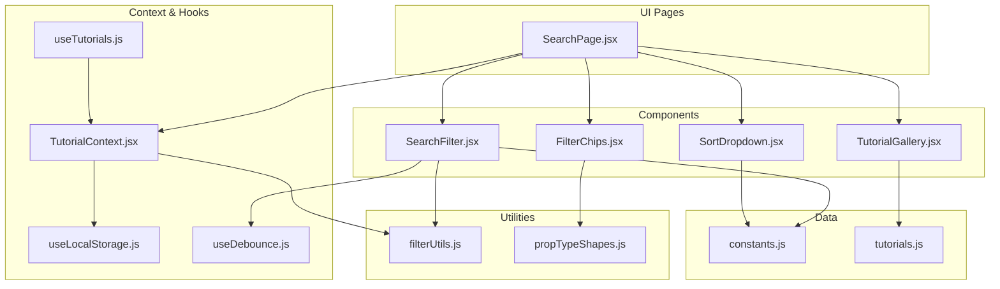
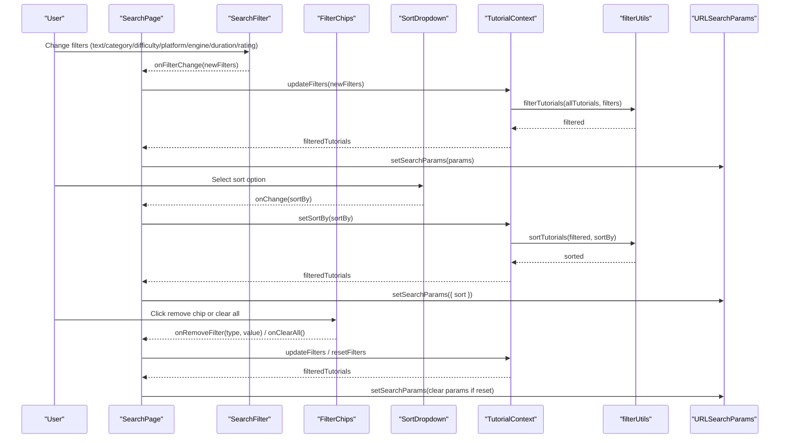
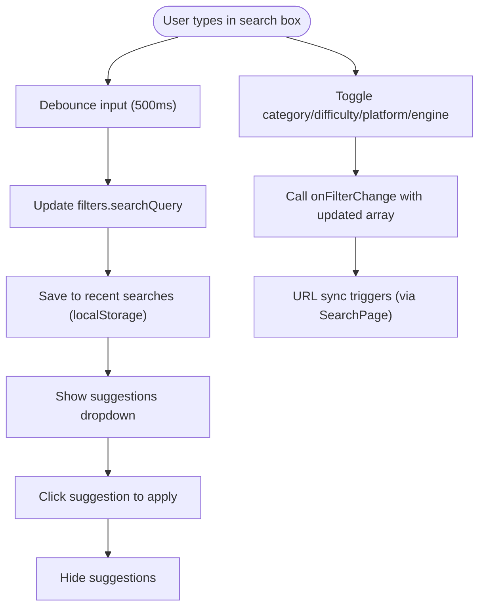
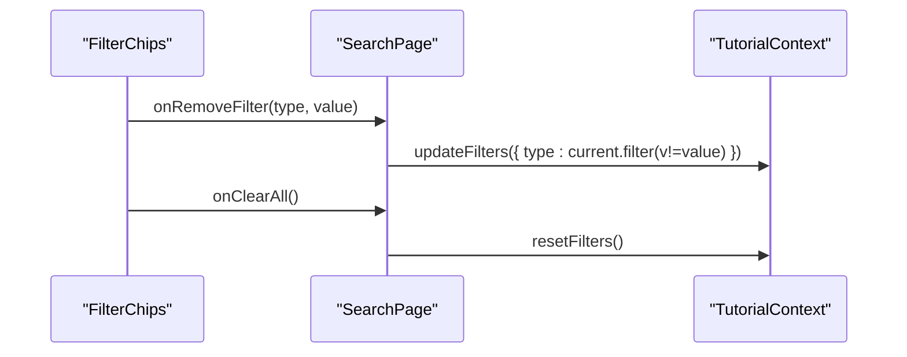
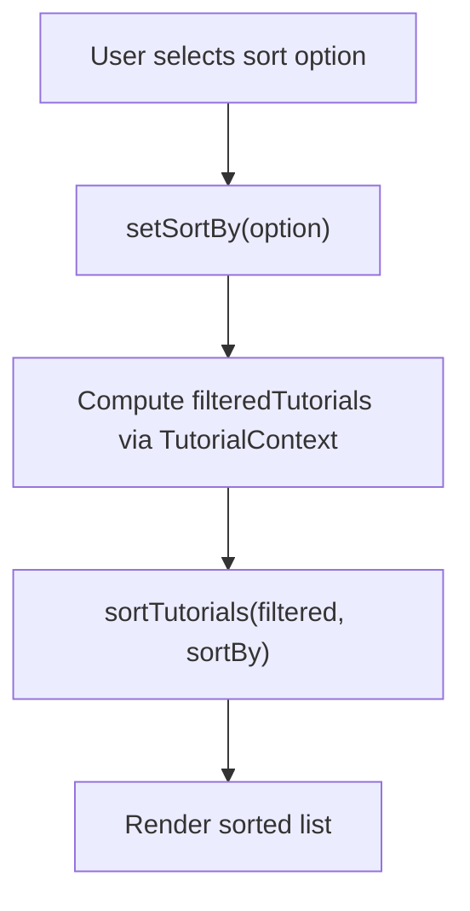
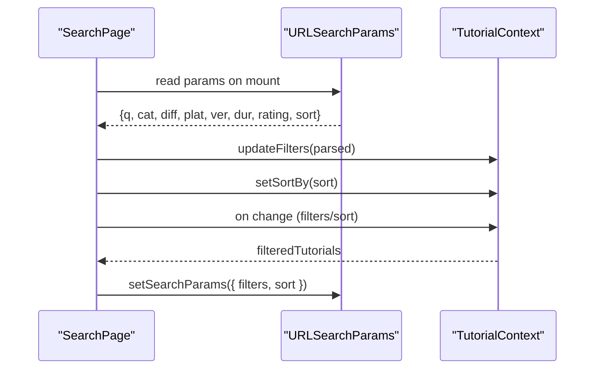
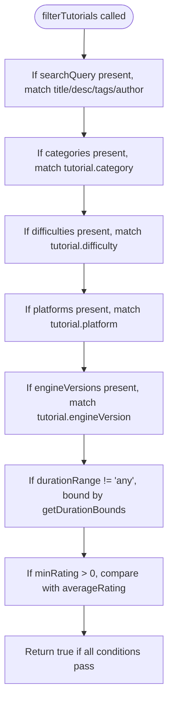
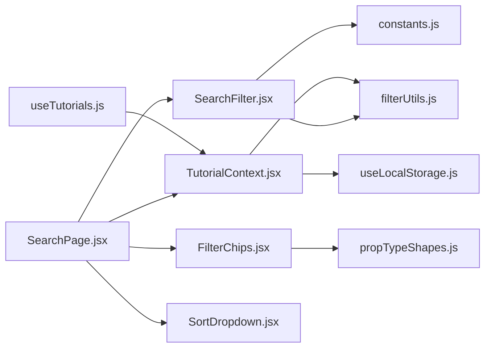

# Search & Filtering System

<cite>
**Referenced Files in This Document**
- [SearchFilter.jsx](file://src/components/SearchFilter.jsx)
- [SearchFilter.module.css](file://src/components/SearchFilter.module.css)
- [FilterChips.jsx](file://src/components/FilterChips.jsx)
- [FilterChips.module.css](file://src/components/FilterChips.module.css)
- [SortDropdown.jsx](file://src/components/SortDropdown.jsx)
- [SortDropdown.module.css](file://src/components/SortDropdown.module.css)
- [SearchPage.jsx](file://src/pages/SearchPage.jsx)
- [TutorialGallery.jsx](file://src/components/TutorialGallery.jsx)
- [TutorialContext.jsx](file://src/contexts/TutorialContext.jsx)
- [useTutorials.js](file://src/hooks/useTutorials.js)
- [useLocalStorage.js](file://src/hooks/useLocalStorage.js)
- [useDebounce.js](file://src/hooks/useDebounce.js)
- [filterUtils.js](file://src/utils/filterUtils.js)
- [constants.js](file://src/data/constants.js)
- [tutorials.js](file://src/data/tutorials.js)
- [propTypeShapes.js](file://src/utils/propTypeShapes.js)
</cite>

## Table of Contents
1. [Introduction](#introduction)
2. [Project Structure](#project-structure)
3. [Core Components](#core-components)
4. [Architecture Overview](#architecture-overview)
5. [Detailed Component Analysis](#detailed-component-analysis)
6. [Dependency Analysis](#dependency-analysis)
7. [Performance Considerations](#performance-considerations)
8. [Troubleshooting Guide](#troubleshooting-guide)
9. [Conclusion](#conclusion)

## Introduction
This document explains GameDev Hub’s client-side search and filtering system. It covers multi-factor filtering (category, difficulty, platform, engine version, duration, and rating), the SearchFilter component and URL synchronization, filter chips for active filters, sorting mechanisms, debounced search, validation and edge-case handling, empty-state management, and accessibility features. The system operates entirely in the browser using React hooks, local state, localStorage, and URL query parameters to persist filter state for shareable views.

## Project Structure
The filtering system spans UI components, a central context provider, utilities, and shared constants. The SearchPage orchestrates URL synchronization and renders the filter panel, chips, sorting dropdown, and gallery.

**Diagram sources**
- [SearchPage.jsx:12-141](file://src/pages/SearchPage.jsx#L12-L141)
- [SearchFilter.jsx:19-237](file://src/components/SearchFilter.jsx#L19-L237)
- [FilterChips.jsx:6-76](file://src/components/FilterChips.jsx#L6-L76)
- [SortDropdown.jsx:6-29](file://src/components/SortDropdown.jsx#L6-L29)
- [TutorialGallery.jsx:23-138](file://src/components/TutorialGallery.jsx#L23-L138)
- [TutorialContext.jsx:18-542](file://src/contexts/TutorialContext.jsx#L18-L542)
- [useTutorials.js:4-11](file://src/hooks/useTutorials.js#L4-L11)
- [useLocalStorage.js:3-29](file://src/hooks/useLocalStorage.js#L3-L29)
- [useDebounce.js:3-16](file://src/hooks/useDebounce.js#L3-L16)
- [filterUtils.js:1-99](file://src/utils/filterUtils.js#L1-L99)
- [constants.js:1-71](file://src/data/constants.js#L1-L71)
- [tutorials.js:1-522](file://src/data/tutorials.js#L1-L522)
- [propTypeShapes.js:28-37](file://src/utils/propTypeShapes.js#L28-L37)

**Section sources**
- [SearchPage.jsx:12-141](file://src/pages/SearchPage.jsx#L12-L141)
- [constants.js:1-71](file://src/data/constants.js#L1-L71)

## Core Components
- SearchFilter: Renders the filter panel with text search, category/difficulty/platform/engine checkboxes, duration range selector, minimum rating buttons, and a reset button. It debounces the search query and manages recent searches in localStorage.
- FilterChips: Displays active filters as removable chips and supports clearing all filters.
- SortDropdown: Provides sorting options (newest, most popular, highest rated, most viewed).
- SearchPage: Orchestrates URL synchronization, initializes filters from URL, updates URL on changes, and wires up chips and sorting.
- TutorialContext: Centralizes filtered tutorials computation, default filters, and persistence via localStorage.
- filterUtils: Implements filtering and sorting logic over the tutorial dataset.
- Constants: Defines filter options and sort choices.

**Section sources**
- [SearchFilter.jsx:19-237](file://src/components/SearchFilter.jsx#L19-L237)
- [FilterChips.jsx:6-76](file://src/components/FilterChips.jsx#L6-L76)
- [SortDropdown.jsx:6-29](file://src/components/SortDropdown.jsx#L6-L29)
- [SearchPage.jsx:12-141](file://src/pages/SearchPage.jsx#L12-L141)
- [TutorialContext.jsx:18-71](file://src/contexts/TutorialContext.jsx#L18-L71)
- [filterUtils.js:1-99](file://src/utils/filterUtils.js#L1-L99)
- [constants.js:40-45](file://src/data/constants.js#L40-L45)

## Architecture Overview
The system follows a unidirectional data flow:
- UI components dispatch filter/sort actions.
- TutorialContext computes filteredTutorials from allTutorials using filterUtils.
- SearchPage reads and writes URL query parameters to keep filters persistent and shareable.
- localStorage persists default filters and sort preferences across sessions.

**Diagram sources**
- [SearchPage.jsx:22-81](file://src/pages/SearchPage.jsx#L22-L81)
- [SearchFilter.jsx:62-80](file://src/components/SearchFilter.jsx#L62-L80)
- [FilterChips.jsx:53-66](file://src/components/FilterChips.jsx#L53-L66)
- [TutorialContext.jsx:435-444](file://src/contexts/TutorialContext.jsx#L435-L444)
- [filterUtils.js:72-86](file://src/utils/filterUtils.js#L72-L86)

## Detailed Component Analysis

### SearchFilter Component
- Responsibilities:
  - Manages text search input with debounced updates.
  - Maintains recent searches in localStorage and shows suggestions.
  - Toggles multi-select filters (categories, difficulties, platforms, engine versions).
  - Controls duration range and minimum rating.
  - Exposes onReset callback to clear all filters.
- Debounced search:
  - Uses a 500ms debounce delay for search queries to reduce unnecessary recomputations.
- Recent searches:
  - Stores up to a fixed number of recent queries and filters suggestions based on current input.
- Accessibility:
  - Focus and blur handling to show/hide suggestions.
  - Keyboard-friendly checkbox and radio controls styled for clarity.

**Diagram sources**
- [SearchFilter.jsx:22-46](file://src/components/SearchFilter.jsx#L22-L46)
- [SearchFilter.jsx:62-80](file://src/components/SearchFilter.jsx#L62-L80)
- [SearchFilter.module.css:11-239](file://src/components/SearchFilter.module.css#L11-L239)

**Section sources**
- [SearchFilter.jsx:19-237](file://src/components/SearchFilter.jsx#L19-L237)
- [SearchFilter.module.css:1-239](file://src/components/SearchFilter.module.css#L1-L239)
- [useDebounce.js:3-16](file://src/hooks/useDebounce.js#L3-L16)

### Filter Chips System
- Displays active filters as labeled chips with one-click removal.
- Supports removing individual filter values or clearing all filters.
- Announces filters to assistive technologies via aria-labels.

**Diagram sources**
- [FilterChips.jsx:53-66](file://src/components/FilterChips.jsx#L53-L66)
- [SearchPage.jsx:92-103](file://src/pages/SearchPage.jsx#L92-L103)
- [TutorialContext.jsx:435-444](file://src/contexts/TutorialContext.jsx#L435-L444)

**Section sources**
- [FilterChips.jsx:6-76](file://src/components/FilterChips.jsx#L6-L76)
- [FilterChips.module.css:1-46](file://src/components/FilterChips.module.css#L1-L46)

### Sorting Mechanisms
- Options: newest, most popular, highest rated, most viewed.
- Implementation:
  - sortTutorials creates a shallow copy and sorts by the selected criterion.
  - Default sort is newest.
- UI:
  - SortDropdown renders options from constants and notifies parent on change.

**Diagram sources**
- [SortDropdown.jsx:6-29](file://src/components/SortDropdown.jsx#L6-L29)
- [constants.js:40-45](file://src/data/constants.js#L40-L45)
- [filterUtils.js:72-86](file://src/utils/filterUtils.js#L72-L86)

**Section sources**
- [SortDropdown.jsx:6-29](file://src/components/SortDropdown.jsx#L6-L29)
- [constants.js:40-45](file://src/data/constants.js#L40-L45)
- [filterUtils.js:72-86](file://src/utils/filterUtils.js#L72-L86)

### URL-Synced Filtering and Persistence
- Initialization:
  - On mount, SearchPage parses URL query parameters into filters and applies them via context.
- Synchronization:
  - On subsequent filter/sort changes, SearchPage serializes active filters and sort to URL.
  - Uses requestAnimationFrame to avoid race conditions during initialization.
- Reset:
  - Clears URL parameters and resets filters when requested.

**Diagram sources**
- [SearchPage.jsx:25-57](file://src/pages/SearchPage.jsx#L25-L57)
- [SearchPage.jsx:59-81](file://src/pages/SearchPage.jsx#L59-L81)

**Section sources**
- [SearchPage.jsx:22-81](file://src/pages/SearchPage.jsx#L22-L81)

### Search Algorithm and Ranking
- Matching:
  - Tutorials are included if the search query appears in title, description, any tag, or author name.
- Multi-factor filtering:
  - Categories, difficulties, platforms, engine versions, duration range, and minimum rating are applied as AND conditions.
- Duration bounds:
  - Duration range is mapped to min/max bounds for comparison against estimatedDuration.
- Sorting:
  - Newest, most popular (by viewCount), highest rated (by averageRating), most viewed (by viewCount).

**Diagram sources**
- [filterUtils.js:1-60](file://src/utils/filterUtils.js#L1-L60)
- [filterUtils.js:62-70](file://src/utils/filterUtils.js#L62-L70)
- [filterUtils.js:72-86](file://src/utils/filterUtils.js#L72-L86)

**Section sources**
- [filterUtils.js:1-99](file://src/utils/filterUtils.js#L1-L99)

### Debounced Search
- Debounce hook:
  - Returns a delayed value after a configurable delay, preventing rapid re-computation.
- SearchFilter:
  - Debounces the searchQuery with a 500ms delay before updating filters and saving recent searches.

**Section sources**
- [useDebounce.js:3-16](file://src/hooks/useDebounce.js#L3-L16)
- [SearchFilter.jsx:22](file://src/components/SearchFilter.jsx#L22)

### Validation, Edge Cases, and Empty States
- Validation:
  - Filters are validated via PropTypes in propTypeShapes.
  - Duration range defaults to 'any'; minRating defaults to 0.
- Edge cases:
  - Empty arrays for multi-select filters are treated as “no filter”.
  - Short queries are ignored for recent search storage.
  - Clearing history removes localStorage entries safely.
- Empty state:
  - TutorialGallery displays an EmptyState component when no tutorials match filters and offers a clear-filters action when applicable.

**Section sources**
- [propTypeShapes.js:28-37](file://src/utils/propTypeShapes.js#L28-L37)
- [SearchFilter.jsx:11-17](file://src/components/SearchFilter.jsx#L11-L17)
- [TutorialGallery.jsx:79-86](file://src/components/TutorialGallery.jsx#L79-L86)

### Accessibility Features
- Keyboard navigation:
  - Checkbox and select inputs are focusable and styled for clarity.
  - Buttons use appropriate hover/focus states.
- Screen reader support:
  - Filter chips include aria-labels for remove actions.
  - Sort dropdown uses semantic labels and options.

**Section sources**
- [SearchFilter.module.css:66-125](file://src/components/SearchFilter.module.css#L66-L125)
- [FilterChips.module.css:21-33](file://src/components/FilterChips.module.css#L21-L33)
- [SortDropdown.module.css:13-27](file://src/components/SortDropdown.module.css#L13-L27)
- [FilterChips.jsx:56](file://src/components/FilterChips.jsx#L56)

## Dependency Analysis
- Component coupling:
  - SearchFilter depends on constants for options and filterUtils for filtering.
  - SearchPage depends on TutorialContext for state and on URL APIs for persistence.
  - FilterChips depends on filterShape for validation.
- Data flow:
  - UI -> Context -> Utilities -> UI rendering.
- Persistence:
  - useLocalStorage persists filters and sort order; URL keeps filters shareable.

**Diagram sources**
- [SearchFilter.jsx:3-6](file://src/components/SearchFilter.jsx#L3-L6)
- [SearchPage.jsx:1-10](file://src/pages/SearchPage.jsx#L1-L10)
- [FilterChips.jsx:3](file://src/components/FilterChips.jsx#L3)
- [TutorialContext.jsx:2-4](file://src/contexts/TutorialContext.jsx#L2-L4)
- [useTutorials.js:1-2](file://src/hooks/useTutorials.js#L1-L2)
- [useLocalStorage.js:3-28](file://src/hooks/useLocalStorage.js#L3-L28)

**Section sources**
- [SearchFilter.jsx:1-7](file://src/components/SearchFilter.jsx#L1-L7)
- [SearchPage.jsx:1-10](file://src/pages/SearchPage.jsx#L1-L10)
- [FilterChips.jsx:1-4](file://src/components/FilterChips.jsx#L1-L4)
- [TutorialContext.jsx:1-6](file://src/contexts/TutorialContext.jsx#L1-L6)
- [useTutorials.js:1-11](file://src/hooks/useTutorials.js#L1-L11)
- [useLocalStorage.js:1-29](file://src/hooks/useLocalStorage.js#L1-L29)

## Performance Considerations
- Debouncing:
  - Search input is debounced to limit frequent recomputations.
- Memoization:
  - filteredTutorials is memoized in TutorialContext to avoid redundant filtering/sorting.
- Pagination:
  - TutorialGallery slices results for large lists to reduce DOM rendering overhead.
- Recommendations:
  - Consider virtualizing the gallery for very large result sets.
  - Batch URL updates if many filters change simultaneously.

[No sources needed since this section provides general guidance]

## Troubleshooting Guide
- Filters not applying:
  - Verify URL parameters are being read and updateFilters is invoked.
  - Confirm default filters are loaded from localStorage.
- URL not updating:
  - Ensure setSearchParams is called after initialization completes.
- Empty results:
  - Check that getActiveFilterCount reflects current filters and that TutorialGallery shows EmptyState with clear-filters action.
- Sorting not changing:
  - Ensure setSortBy is called and filteredTutorials is recalculated.

**Section sources**
- [SearchPage.jsx:25-57](file://src/pages/SearchPage.jsx#L25-L57)
- [SearchPage.jsx:59-81](file://src/pages/SearchPage.jsx#L59-L81)
- [TutorialContext.jsx:435-444](file://src/contexts/TutorialContext.jsx#L435-L444)
- [TutorialGallery.jsx:79-86](file://src/components/TutorialGallery.jsx#L79-L86)

## Conclusion
GameDev Hub’s search and filtering system combines a robust client-side filtering engine with a clean UI and persistent state management. Users benefit from multi-factor filtering, one-click chips, sortable results, and shareable URLs. The design emphasizes performance via debouncing and memoization, while accessibility and edge-case handling ensure a reliable experience.