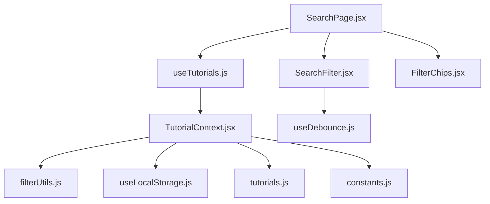
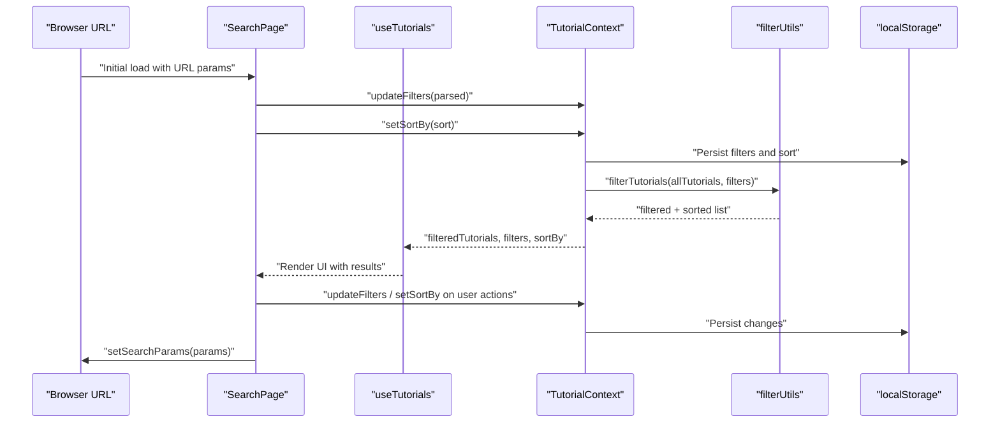
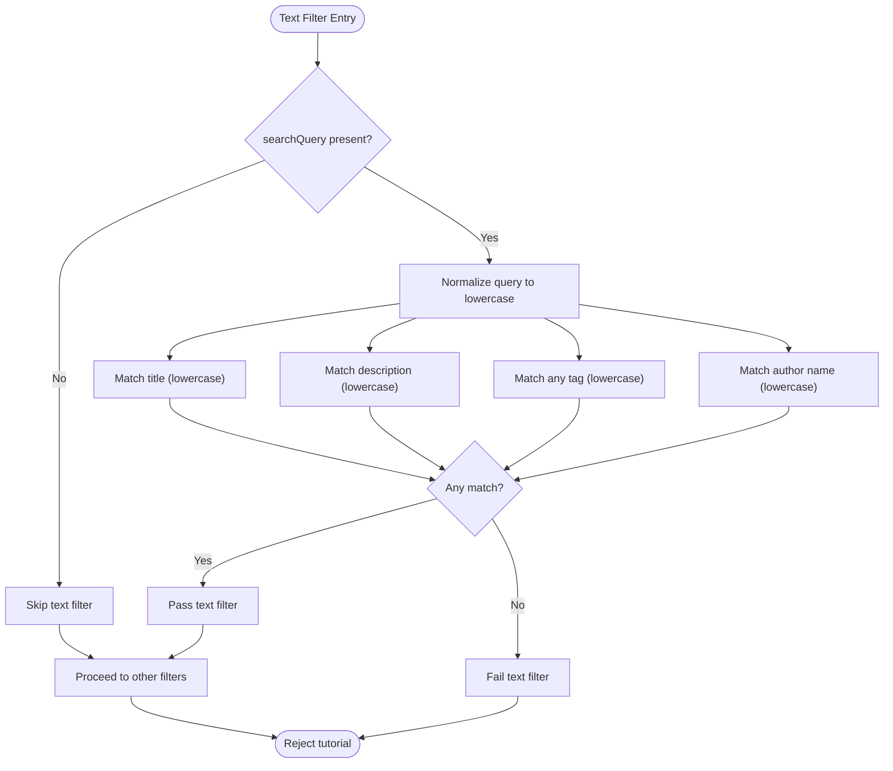
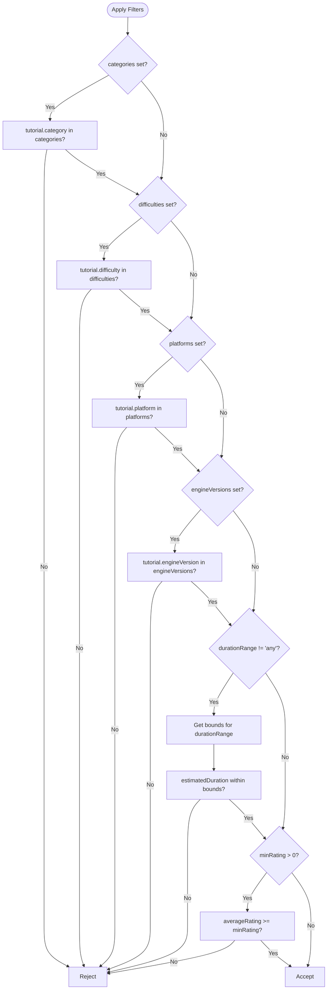
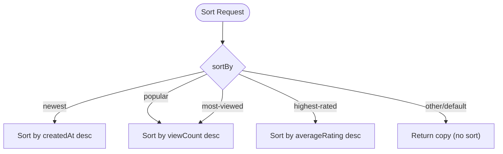
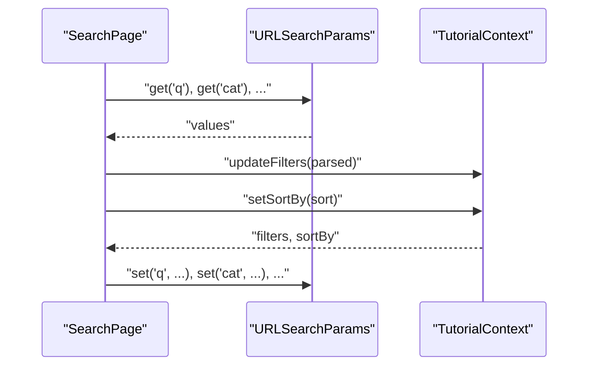
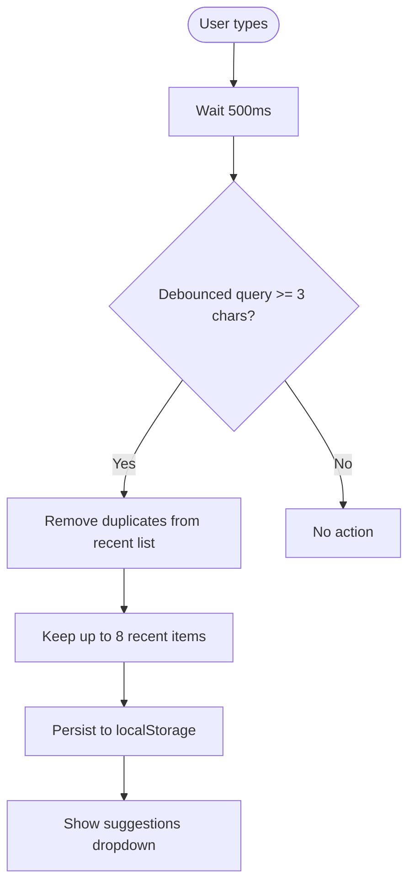
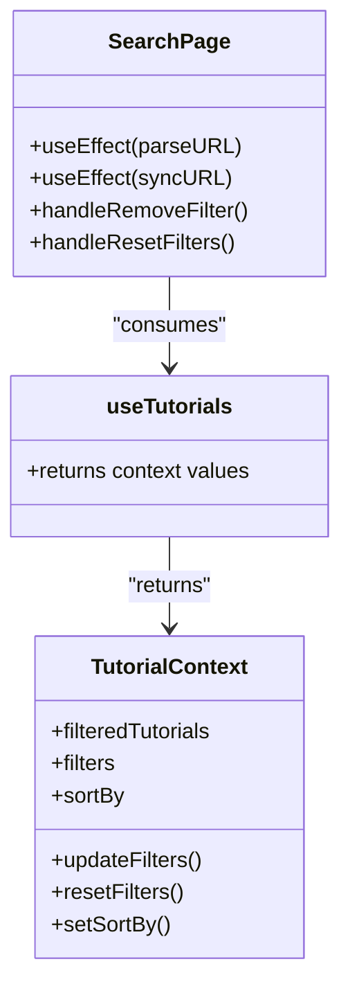
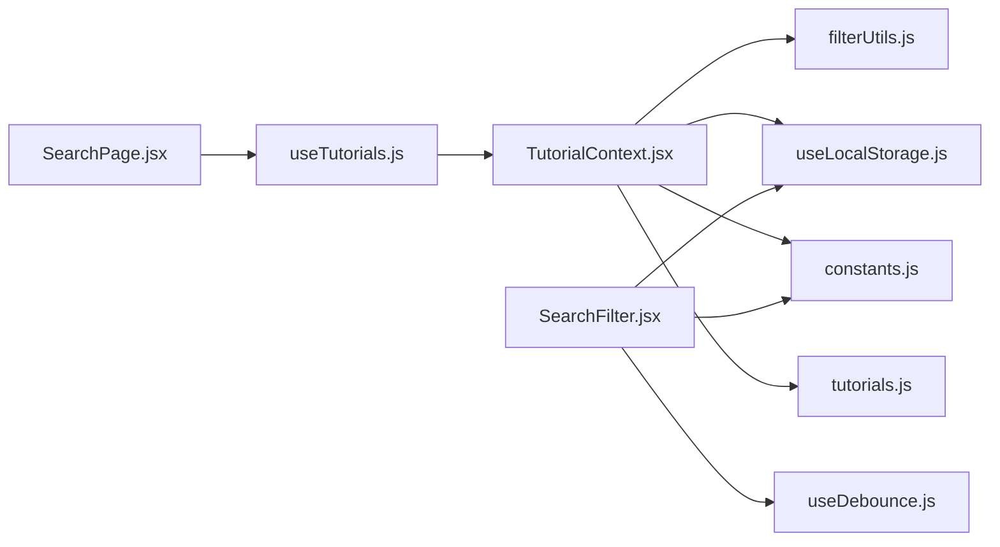

# Search Functionality

<cite>
**Referenced Files in This Document**
- [SearchPage.jsx](file://src/pages/SearchPage.jsx)
- [useTutorials.js](file://src/hooks/useTutorials.js)
- [TutorialContext.jsx](file://src/contexts/TutorialContext.jsx)
- [filterUtils.js](file://src/utils/filterUtils.js)
- [SearchFilter.jsx](file://src/components/SearchFilter.jsx)
- [FilterChips.jsx](file://src/components/FilterChips.jsx)
- [useLocalStorage.js](file://src/hooks/useLocalStorage.js)
- [constants.js](file://src/data/constants.js)
- [tutorials.js](file://src/data/tutorials.js)
- [filterUtils.test.js](file://src/utils/__tests__/filterUtils.test.js)
</cite>

## Table of Contents
1. [Introduction](#introduction)
2. [Project Structure](#project-structure)
3. [Core Components](#core-components)
4. [Architecture Overview](#architecture-overview)
5. [Detailed Component Analysis](#detailed-component-analysis)
6. [Dependency Analysis](#dependency-analysis)
7. [Performance Considerations](#performance-considerations)
8. [Troubleshooting Guide](#troubleshooting-guide)
9. [Conclusion](#conclusion)

## Introduction
This document explains the search functionality implemented in the application. It covers how search queries are processed, how keywords are extracted from tutorial metadata, how filters and sorting are applied, and how the URL state is synchronized with the application’s internal state. It also documents the debounced search mechanism, the integration between the SearchPage component and the useTutorials hook, and the fallback to localStorage for persisted search state. Finally, it outlines the ranking and relevance scoring behavior, supported search operators, and performance considerations for large datasets.

## Project Structure
The search feature spans several layers:
- Page layer: SearchPage orchestrates URL synchronization and renders filters and results.
- Hook layer: useTutorials exposes the shared tutorial state via TutorialContext.
- Context layer: TutorialContext manages filters, sorting, and derived filtered results.
- Utilities: filterUtils defines filtering, sorting, and helper functions.
- Components: SearchFilter provides the interactive filter UI and debounced suggestions; FilterChips displays active filters.
- Persistence: useLocalStorage persists filters, sort order, and other user preferences.
- Data: constants defines filter options; tutorials.js provides the tutorial corpus.

**Diagram sources**
- [SearchPage.jsx:12-141](file://src/pages/SearchPage.jsx#L12-L141)
- [useTutorials.js:1-11](file://src/hooks/useTutorials.js#L1-L11)
- [TutorialContext.jsx:18-71](file://src/contexts/TutorialContext.jsx#L18-L71)
- [filterUtils.js:1-99](file://src/utils/filterUtils.js#L1-L99)
- [SearchFilter.jsx:19-237](file://src/components/SearchFilter.jsx#L19-L237)
- [FilterChips.jsx:6-76](file://src/components/FilterChips.jsx#L6-L76)
- [useLocalStorage.js:3-28](file://src/hooks/useLocalStorage.js#L3-L28)
- [tutorials.js:1-522](file://src/data/tutorials.js#L1-L522)
- [constants.js:1-71](file://src/data/constants.js#L1-L71)

**Section sources**
- [SearchPage.jsx:12-141](file://src/pages/SearchPage.jsx#L12-L141)
- [TutorialContext.jsx:18-71](file://src/contexts/TutorialContext.jsx#L18-L71)
- [filterUtils.js:1-99](file://src/utils/filterUtils.js#L1-L99)
- [SearchFilter.jsx:19-237](file://src/components/SearchFilter.jsx#L19-L237)
- [FilterChips.jsx:6-76](file://src/components/FilterChips.jsx#L6-L76)
- [useLocalStorage.js:3-28](file://src/hooks/useLocalStorage.js#L3-L28)
- [constants.js:1-71](file://src/data/constants.js#L1-L71)
- [tutorials.js:1-522](file://src/data/tutorials.js#L1-L522)

## Core Components
- SearchPage: Parses URL parameters on mount, updates context filters, and synchronizes context changes back to the URL. Manages removal of individual filters and clearing all filters.
- useTutorials: A convenience hook that retrieves the TutorialContext values for the page.
- TutorialContext: Holds filters and sort order in localStorage, computes filteredTutorials, and exposes update/reset functions and setters.
- filterUtils: Implements text search across title, description, tags, and author name; applies category/difficulty/platform/engine-version filters; enforces duration and rating thresholds; sorts results.
- SearchFilter: Debounces text input, maintains recent searches in localStorage, and renders filter controls.
- FilterChips: Visual representation of active filters for quick removal.
- useLocalStorage: A generic hook to persist state to localStorage with safe error handling.
- constants: Declares available categories, difficulties, platforms, engine versions, durations, and sort options.
- tutorials: The static tutorial dataset used as the base corpus.

**Section sources**
- [SearchPage.jsx:12-141](file://src/pages/SearchPage.jsx#L12-L141)
- [useTutorials.js:1-11](file://src/hooks/useTutorials.js#L1-L11)
- [TutorialContext.jsx:18-71](file://src/contexts/TutorialContext.jsx#L18-L71)
- [filterUtils.js:1-99](file://src/utils/filterUtils.js#L1-L99)
- [SearchFilter.jsx:19-237](file://src/components/SearchFilter.jsx#L19-L237)
- [FilterChips.jsx:6-76](file://src/components/FilterChips.jsx#L6-L76)
- [useLocalStorage.js:3-28](file://src/hooks/useLocalStorage.js#L3-L28)
- [constants.js:1-71](file://src/data/constants.js#L1-L71)
- [tutorials.js:1-522](file://src/data/tutorials.js#L1-L522)

## Architecture Overview
The search pipeline integrates UI, state, persistence, and computation:

**Diagram sources**
- [SearchPage.jsx:25-81](file://src/pages/SearchPage.jsx#L25-L81)
- [TutorialContext.jsx:67-71](file://src/contexts/TutorialContext.jsx#L67-L71)
- [filterUtils.js:1-99](file://src/utils/filterUtils.js#L1-L99)
- [useLocalStorage.js:3-28](file://src/hooks/useLocalStorage.js#L3-L28)

## Detailed Component Analysis

### Search Query Processing and Text Matching
- Text matching targets:
  - Title: case-insensitive substring match.
  - Description: case-insensitive substring match.
  - Tags: case-insensitive substring match against any tag.
  - Author name: case-insensitive substring match.
- Behavior: A tutorial passes the text filter if any of the above matches; otherwise it fails the filter.
- Keyword extraction: The system does not tokenize or extract keywords; it performs substring matching on normalized lowercase text.

**Diagram sources**
- [filterUtils.js:3-13](file://src/utils/filterUtils.js#L3-L13)

**Section sources**
- [filterUtils.js:3-13](file://src/utils/filterUtils.js#L3-L13)

### Filter Application Logic
- Categories: inclusion filter; multiple selections allowed.
- Difficulties: inclusion filter; multiple selections allowed.
- Platforms: inclusion filter; multiple selections allowed.
- Engine Versions: inclusion filter; multiple selections allowed.
- Duration Range: numeric bounds enforced; “any” disables this filter.
- Minimum Rating: numeric threshold; tutorials must meet or exceed the rating.

**Diagram sources**
- [filterUtils.js:15-56](file://src/utils/filterUtils.js#L15-L56)
- [filterUtils.js:62-70](file://src/utils/filterUtils.js#L62-L70)

**Section sources**
- [filterUtils.js:15-56](file://src/utils/filterUtils.js#L15-L56)
- [filterUtils.js:62-70](file://src/utils/filterUtils.js#L62-L70)

### Sorting and Ranking
- Sorting options:
  - Newest: descending by creation date.
  - Most Popular: descending by viewCount.
  - Highest Rated: descending by averageRating.
  - Most Viewed: alias of Most Popular.
- Ranking behavior: The system does not implement a separate relevance score; results are ranked by the selected sort option. Popularity and ratings are considered during sorting but not as a composite score.

**Diagram sources**
- [filterUtils.js:72-86](file://src/utils/filterUtils.js#L72-L86)

**Section sources**
- [filterUtils.js:72-86](file://src/utils/filterUtils.js#L72-L86)

### URL Parameter Synchronization
- Parsing:
  - Reads q, cat, diff, plat, ver, dur, rating, sort from URL.
  - Converts multi-valued filters from comma-separated lists.
  - Applies parsed filters to context and sets sort if provided.
- Synchronization:
  - On subsequent filter/sort changes, updates URL parameters while avoiding infinite loops by gating after initialization.
  - Uses replace mode to avoid polluting browser history.

**Diagram sources**
- [SearchPage.jsx:25-81](file://src/pages/SearchPage.jsx#L25-L81)

**Section sources**
- [SearchPage.jsx:25-81](file://src/pages/SearchPage.jsx#L25-L81)

### Debounced Search and Recent Suggestions
- Debounce:
  - SearchFilter debounces the search query input with a 500ms delay.
  - When the debounced query is three characters or more, it is saved to localStorage as a recent search.
- Suggestions:
  - Displays recent searches that match the current input.
  - Supports selecting a suggestion to apply it as the search query.
- LocalStorage fallback:
  - Recent searches are persisted under a dedicated key.
  - Clears history via button or by removing the key.

**Diagram sources**
- [SearchFilter.jsx:22-36](file://src/components/SearchFilter.jsx#L22-L36)
- [SearchFilter.jsx:84-118](file://src/components/SearchFilter.jsx#L84-L118)

**Section sources**
- [SearchFilter.jsx:22-36](file://src/components/SearchFilter.jsx#L22-L36)
- [SearchFilter.jsx:84-118](file://src/components/SearchFilter.jsx#L84-L118)

### Integration Between SearchPage and useTutorials
- SearchPage obtains filteredTutorials, filters, sortBy, updateFilters, resetFilters, and setSortBy from useTutorials.
- It parses URL parameters on mount and updates context accordingly.
- It listens to context changes to synchronize URL parameters.
- It supports removing individual filters and clearing all filters, with URL updates handled automatically.

**Diagram sources**
- [SearchPage.jsx:12-103](file://src/pages/SearchPage.jsx#L12-L103)
- [useTutorials.js:4-10](file://src/hooks/useTutorials.js#L4-L10)
- [TutorialContext.jsx:453-536](file://src/contexts/TutorialContext.jsx#L453-L536)

**Section sources**
- [SearchPage.jsx:12-103](file://src/pages/SearchPage.jsx#L12-L103)
- [useTutorials.js:4-10](file://src/hooks/useTutorials.js#L4-L10)
- [TutorialContext.jsx:453-536](file://src/contexts/TutorialContext.jsx#L453-L536)

### Supported Search Operators and Syntax
- Exact phrase matching: Not implemented. Queries are treated as plain text and matched via substring checks.
- Boolean operators: Not implemented. Multiple filters are combined with AND semantics.
- Wildcards: Not implemented.
- Field-specific targeting: Not implemented. Searches across title, description, tags, and author name.
- Edge cases:
  - Empty or whitespace-only queries are ignored by the text filter.
  - Duration range “any” disables the duration filter.
  - Minimum rating 0 disables the rating filter.
  - Multi-valued filters are comma-separated in URL and arrays in context.

Examples of supported URL syntax:
- q=search term
- cat=2D,3D
- diff=Beginner,Intermediate
- plat=Unity,Unreal
- ver=Unity%202022%20LTS,Godot%204.2
- dur=medium
- rating=4
- sort=popular

**Section sources**
- [SearchPage.jsx:27-50](file://src/pages/SearchPage.jsx#L27-L50)
- [SearchPage.jsx:63-80](file://src/pages/SearchPage.jsx#L63-L80)
- [filterUtils.js:44-56](file://src/utils/filterUtils.js#L44-L56)
- [filterUtils.js:52-56](file://src/utils/filterUtils.js#L52-L56)

### Tutorial Metadata Coverage for Search
- Covered fields:
  - Title
  - Description
  - Tags
  - Author name
- Additional filters:
  - Category
  - Difficulty
  - Platform
  - Engine version
  - Estimated duration
  - Minimum rating

**Section sources**
- [filterUtils.js:3-13](file://src/utils/filterUtils.js#L3-L13)
- [filterUtils.js:15-56](file://src/utils/filterUtils.js#L15-L56)
- [tutorials.js:2-22](file://src/data/tutorials.js#L2-L22)

## Dependency Analysis
- SearchPage depends on:
  - useTutorials for state.
  - useSearchParams for URL synchronization.
- useTutorials depends on TutorialContext.
- TutorialContext depends on:
  - filterUtils for filtering and sorting.
  - useLocalStorage for persistence.
  - constants for filter options.
  - tutorials for the base dataset.
- SearchFilter depends on:
  - useDebounce for debouncing.
  - constants for filter options.
  - useLocalStorage for recent searches.

**Diagram sources**
- [SearchPage.jsx:12-20](file://src/pages/SearchPage.jsx#L12-L20)
- [useTutorials.js:1-11](file://src/hooks/useTutorials.js#L1-L11)
- [TutorialContext.jsx:18-71](file://src/contexts/TutorialContext.jsx#L18-L71)
- [filterUtils.js:1-99](file://src/utils/filterUtils.js#L1-L99)
- [SearchFilter.jsx:19-237](file://src/components/SearchFilter.jsx#L19-L237)
- [useLocalStorage.js:3-28](file://src/hooks/useLocalStorage.js#L3-L28)
- [constants.js:1-71](file://src/data/constants.js#L1-L71)
- [tutorials.js:1-522](file://src/data/tutorials.js#L1-L522)

**Section sources**
- [SearchPage.jsx:12-20](file://src/pages/SearchPage.jsx#L12-L20)
- [useTutorials.js:1-11](file://src/hooks/useTutorials.js#L1-L11)
- [TutorialContext.jsx:18-71](file://src/contexts/TutorialContext.jsx#L18-L71)
- [filterUtils.js:1-99](file://src/utils/filterUtils.js#L1-L99)
- [SearchFilter.jsx:19-237](file://src/components/SearchFilter.jsx#L19-L237)
- [useLocalStorage.js:3-28](file://src/hooks/useLocalStorage.js#L3-L28)
- [constants.js:1-71](file://src/data/constants.js#L1-L71)
- [tutorials.js:1-522](file://src/data/tutorials.js#L1-L522)

## Performance Considerations
- Filtering cost:
  - filterTutorials iterates over all tutorials and applies a constant number of checks per tutorial. Complexity is O(N) with N being the number of tutorials.
- Sorting cost:
  - sortTutorials creates a shallow copy and sorts using a comparator. Complexity is O(N log N).
- Debouncing:
  - SearchFilter debounces input to reduce frequent recomputation of filters and suggestions.
- Memoization:
  - TutorialContext memoizes filteredTutorials and derived lists (featured/popular) to avoid unnecessary recalculations.
- DOM rendering:
  - TutorialGallery renders a fixed page size to limit DOM nodes.
- Large dataset handling:
  - Current implementation loads all tutorials into memory. For very large datasets, consider pagination, server-side filtering, or client-side indexing (e.g., inverted index) to improve responsiveness.

[No sources needed since this section provides general guidance]

## Troubleshooting Guide
- URL parameters not updating:
  - Ensure the component is mounted and initialized before URL sync begins. The initialization gate prevents premature synchronization.
- Filters not applying:
  - Verify that multi-valued parameters are comma-separated in the URL.
  - Confirm that durationRange and minRating are set correctly; “any” disables duration filtering and 0 disables rating filtering.
- Debounced query not saving to history:
  - The debounce delay is 500ms and the minimum length is 3 characters. Adjust input accordingly.
- Sorting not changing results:
  - Confirm that sortBy is one of the supported values; unknown values return a copy without sorting.
- Tests validation:
  - Unit tests cover text matching across title, description, tags, and author; duration ranges; minimum rating; and sorting behavior.

**Section sources**
- [SearchPage.jsx:52-57](file://src/pages/SearchPage.jsx#L52-L57)
- [SearchPage.jsx:63-80](file://src/pages/SearchPage.jsx#L63-L80)
- [SearchFilter.jsx:22-36](file://src/components/SearchFilter.jsx#L22-L36)
- [filterUtils.js:72-86](file://src/utils/filterUtils.js#L72-L86)
- [filterUtils.test.js:56-160](file://src/utils/__tests__/filterUtils.test.js#L56-L160)
- [filterUtils.test.js:162-194](file://src/utils/__tests__/filterUtils.test.js#L162-L194)
- [filterUtils.test.js:196-230](file://src/utils/__tests__/filterUtils.test.js#L196-L230)
- [filterUtils.test.js:232-252](file://src/utils/__tests__/filterUtils.test.js#L232-L252)

## Conclusion
The search functionality combines a straightforward substring-based text matcher with robust categorical and threshold filters, debounced user input, and persistent state across URL and localStorage. Results are ranked by configurable sort criteria. While the current implementation is efficient for moderate-sized datasets, future enhancements could include advanced text matching (tokenization, stemming, phrase queries), indexing, and pagination for improved performance at scale.