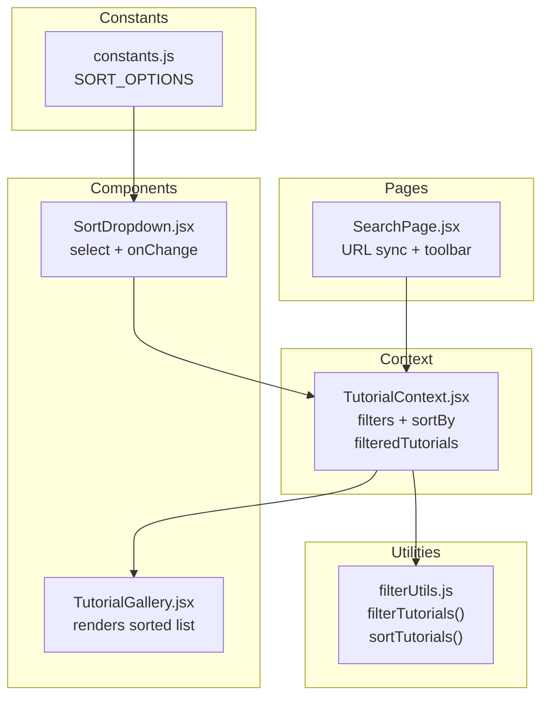
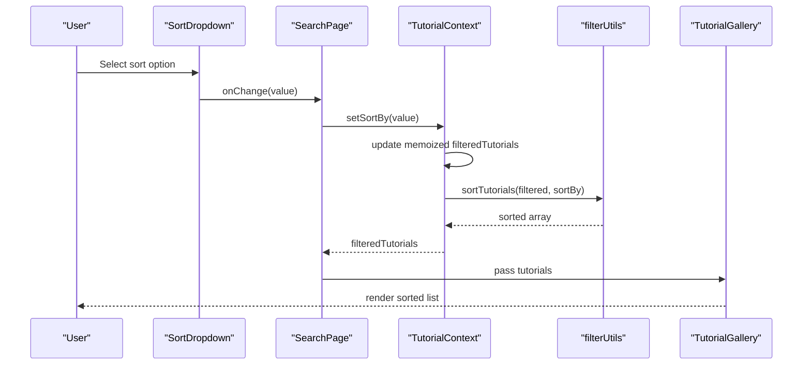
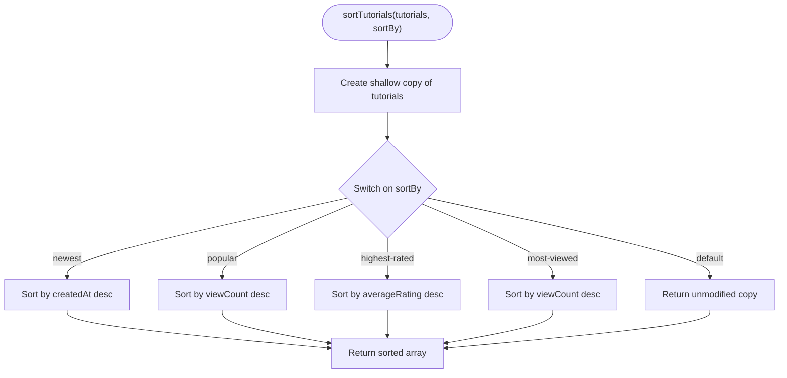
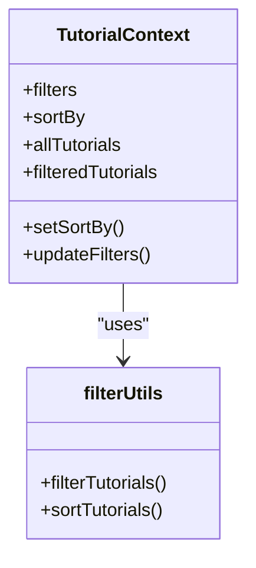
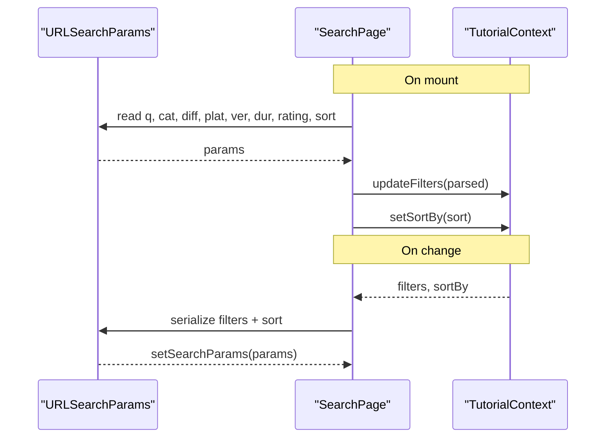
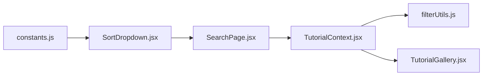

# Sorting Mechanisms

<cite>
**Referenced Files in This Document**
- [SortDropdown.jsx](file://src/components/SortDropdown.jsx)
- [SortDropdown.module.css](file://src/components/SortDropdown.module.css)
- [filterUtils.js](file://src/utils/filterUtils.js)
- [constants.js](file://src/data/constants.js)
- [TutorialContext.jsx](file://src/contexts/TutorialContext.jsx)
- [SearchPage.jsx](file://src/pages/SearchPage.jsx)
- [useLocalStorage.js](file://src/hooks/useLocalStorage.js)
- [TutorialGallery.jsx](file://src/components/TutorialGallery.jsx)
- [filterUtils.test.js](file://src/utils/__tests__/filterUtils.test.js)
- [tutorials.js](file://src/data/tutorials.js)
</cite>

## Table of Contents
1. [Introduction](#introduction)
2. [Project Structure](#project-structure)
3. [Core Components](#core-components)
4. [Architecture Overview](#architecture-overview)
5. [Detailed Component Analysis](#detailed-component-analysis)
6. [Dependency Analysis](#dependency-analysis)
7. [Performance Considerations](#performance-considerations)
8. [Troubleshooting Guide](#troubleshooting-guide)
9. [Conclusion](#conclusion)
10. [Appendices](#appendices)

## Introduction
This document explains the tutorial sorting system in the application. It covers all available sorting options, the implementation of the sorting algorithm, the SortDropdown component, integration with the tutorial filtering context, persistence via URL parameters and local storage, performance characteristics, and accessibility considerations. It also clarifies how sorting interacts with filtering and how dynamic updates occur.

## Project Structure
The sorting system spans several layers:
- Constants define available sort options.
- Utilities implement filtering and sorting logic.
- Context manages global state, including filters and sort selection.
- Pages integrate sorting with URL synchronization and UI rendering.
- Components render the sort selector and display sorted results.

**Diagram sources**
- [constants.js:40-45](file://src/data/constants.js#L40-L45)
- [filterUtils.js:1-99](file://src/utils/filterUtils.js#L1-L99)
- [TutorialContext.jsx:18-71](file://src/contexts/TutorialContext.jsx#L18-L71)
- [SearchPage.jsx:12-81](file://src/pages/SearchPage.jsx#L12-L81)
- [SortDropdown.jsx:6-23](file://src/components/SortDropdown.jsx#L6-L23)
- [TutorialGallery.jsx:23-86](file://src/components/TutorialGallery.jsx#L23-L86)

**Section sources**
- [constants.js:40-45](file://src/data/constants.js#L40-L45)
- [filterUtils.js:1-99](file://src/utils/filterUtils.js#L1-L99)
- [TutorialContext.jsx:18-71](file://src/contexts/TutorialContext.jsx#L18-L71)
- [SearchPage.jsx:12-81](file://src/pages/SearchPage.jsx#L12-L81)
- [SortDropdown.jsx:6-23](file://src/components/SortDropdown.jsx#L6-L23)
- [TutorialGallery.jsx:23-86](file://src/components/TutorialGallery.jsx#L23-L86)

## Core Components
- Sort options definition: The available sorts are declared centrally and consumed by the dropdown and context.
- Sorting algorithm: A single-purpose function sorts the filtered dataset according to the selected criterion.
- Context-managed state: Filters and sort preference are persisted and recomputed together to produce filtered and sorted results.
- UI integration: The SortDropdown updates context state, which triggers recomputation and URL synchronization.

Key responsibilities:
- Constants: Provide the list of sort options.
- Utilities: Apply filters first, then sort the result set.
- Context: Expose filteredTutorials and manage persistence.
- Page: Synchronize filters and sort with URL parameters.
- Component: Render the sort dropdown and pass changes to context.

**Section sources**
- [constants.js:40-45](file://src/data/constants.js#L40-L45)
- [filterUtils.js:72-86](file://src/utils/filterUtils.js#L72-L86)
- [TutorialContext.jsx:68-71](file://src/contexts/TutorialContext.jsx#L68-L71)
- [SearchPage.jsx:25-81](file://src/pages/SearchPage.jsx#L25-L81)
- [SortDropdown.jsx:6-23](file://src/components/SortDropdown.jsx#L6-L23)

## Architecture Overview
The sorting pipeline is:
1. Filters are applied to the full tutorial dataset.
2. The resulting subset is sorted according to the selected sort option.
3. The sorted list is exposed via context and rendered by the gallery component.
4. URL parameters reflect the current filters and sort; changes propagate bidirectionally.

**Diagram sources**
- [SortDropdown.jsx:6-23](file://src/components/SortDropdown.jsx#L6-L23)
- [SearchPage.jsx:19-20](file://src/pages/SearchPage.jsx#L19-L20)
- [TutorialContext.jsx:25](file://src/contexts/TutorialContext.jsx#L25)
- [filterUtils.js:72-86](file://src/utils/filterUtils.js#L72-L86)
- [TutorialGallery.jsx:23-33](file://src/components/TutorialGallery.jsx#L23-L33)

## Detailed Component Analysis

### Sort Options and Definitions
Available sorts are defined centrally and include:
- Newest first
- Most popular
- Highest rated
- Most viewed

These options are rendered by the dropdown and consumed by the sorting utility.

**Section sources**
- [constants.js:40-45](file://src/data/constants.js#L40-L45)
- [SortDropdown.jsx:15-19](file://src/components/SortDropdown.jsx#L15-L19)

### SortDropdown Component
Responsibilities:
- Renders a labeled select element with options from constants.
- Calls the provided onChange handler with the chosen value.
- Applies consistent styling via module CSS.

Accessibility and UX:
- Uses a native select element for simplicity.
- Focus styling is defined in CSS for keyboard navigation.

Integration:
- Passed value and onChange from the page context.
- Connected to the TutorialContext sort state.

**Section sources**
- [SortDropdown.jsx:6-23](file://src/components/SortDropdown.jsx#L6-L23)
- [SortDropdown.module.css:1-28](file://src/components/SortDropdown.module.css#L1-L28)

### Sorting Algorithm Implementation (filterUtils.js)
The sorting function operates on a copy of the filtered dataset and supports:
- Newest first: sorts by creation date descending.
- Most popular: sorts by view count descending.
- Highest rated: sorts by average rating descending.
- Most viewed: sorts by view count descending.

Behavior:
- Returns a new array without mutating input.
- Unknown sort values return the original order unchanged.

**Diagram sources**
- [filterUtils.js:72-86](file://src/utils/filterUtils.js#L72-L86)

**Section sources**
- [filterUtils.js:72-86](file://src/utils/filterUtils.js#L72-L86)
- [filterUtils.test.js:162-194](file://src/utils/__tests__/filterUtils.test.js#L162-L194)

### Tutorial Filtering and Sorting Context
The context composes filtering and sorting:
- Merges default tutorials with approved submissions and overlays dynamic metrics.
- Computes filteredTutorials by applying filters first, then sorting.
- Persists filters and sort preference in local storage.
- Exposes setSortBy to update the sort order.

**Diagram sources**
- [TutorialContext.jsx:18-71](file://src/contexts/TutorialContext.jsx#L18-L71)
- [filterUtils.js:1-99](file://src/utils/filterUtils.js#L1-L99)

**Section sources**
- [TutorialContext.jsx:18-71](file://src/contexts/TutorialContext.jsx#L18-L71)
- [TutorialContext.jsx:24-25](file://src/contexts/TutorialContext.jsx#L24-L25)
- [useLocalStorage.js:3-28](file://src/hooks/useLocalStorage.js#L3-L28)

### URL Parameter Synchronization (SearchPage)
Bidirectional synchronization:
- On mount, parses URL parameters and applies them to context (filters and sort).
- On subsequent changes, serializes filters and sort back to the URL.
- Ignores default sort value when writing to URL to keep URLs concise.

**Diagram sources**
- [SearchPage.jsx:25-81](file://src/pages/SearchPage.jsx#L25-L81)

**Section sources**
- [SearchPage.jsx:25-81](file://src/pages/SearchPage.jsx#L25-L81)

### Rendering Sorted Results (TutorialGallery)
- Receives filteredTutorials from context.
- Displays the list, optionally with pagination and counts.
- No sorting logic here; relies on context-provided sorted data.

**Section sources**
- [TutorialGallery.jsx:23-86](file://src/components/TutorialGallery.jsx#L23-L86)

### Relationship Between Sorting and Filtering
- Filtering occurs first, reducing the dataset.
- Sorting then operates on the filtered subset.
- Changing filters or sort triggers recomputation of filteredTutorials.
- URL synchronization ensures both filters and sort are preserved across sessions.

**Section sources**
- [TutorialContext.jsx:68-71](file://src/contexts/TutorialContext.jsx#L68-L71)
- [SearchPage.jsx:25-81](file://src/pages/SearchPage.jsx#L25-L81)

### Accessibility Features
- SortDropdown uses a native select element, which is keyboard accessible by default.
- Focus styles are defined in CSS for visual focus indication.
- Screen reader compatibility is achieved through standard select semantics and labels.

Recommendations:
- Consider adding aria-label to the select for explicit labeling if needed.
- Ensure the label text is descriptive and visible near the control.

**Section sources**
- [SortDropdown.jsx:10-20](file://src/components/SortDropdown.jsx#L10-L20)
- [SortDropdown.module.css:24-27](file://src/components/SortDropdown.module.css#L24-L27)

## Dependency Analysis
- SortDropdown depends on constants for options and on TutorialContext for state.
- SearchPage orchestrates URL synchronization and passes props to SortDropdown.
- TutorialContext depends on filterUtils for filtering and sorting.
- TutorialGallery depends on context-provided sorted data.

**Diagram sources**
- [constants.js:40-45](file://src/data/constants.js#L40-L45)
- [SortDropdown.jsx:3](file://src/components/SortDropdown.jsx#L3)
- [SearchPage.jsx:8](file://src/pages/SearchPage.jsx#L8)
- [TutorialContext.jsx:4](file://src/contexts/TutorialContext.jsx#L4)
- [filterUtils.js:1-99](file://src/utils/filterUtils.js#L1-L99)
- [TutorialGallery.jsx:4](file://src/components/TutorialGallery.jsx#L4)

**Section sources**
- [constants.js:40-45](file://src/data/constants.js#L40-L45)
- [SortDropdown.jsx:3](file://src/components/SortDropdown.jsx#L3)
- [SearchPage.jsx:8](file://src/pages/SearchPage.jsx#L8)
- [TutorialContext.jsx:4](file://src/contexts/TutorialContext.jsx#L4)
- [filterUtils.js:1-99](file://src/utils/filterUtils.js#L1-L99)
- [TutorialGallery.jsx:4](file://src/components/TutorialGallery.jsx#L4)

## Performance Considerations
Current implementation:
- Sorting is performed on the filtered subset using an in-memory array sort.
- Complexity is O(n log n) for comparison-based sorts.
- Filtering is linear in the number of tutorials and filters.

Scalability considerations:
- For very large datasets, consider:
  - Precomputing derived metrics and maintaining indices.
  - Using immutable data structures to reduce copies.
  - Debouncing frequent sort changes.
  - Virtualizing lists to avoid rendering overhead.
- Memoization is already applied in the context to avoid unnecessary recomputations when inputs have not changed.

[No sources needed since this section provides general guidance]

## Troubleshooting Guide
Common issues and resolutions:
- Sort does not persist after refresh:
  - Verify local storage keys for filters and sort are present.
  - Confirm the context initializes from local storage.
- URL does not update on sort change:
  - Ensure setSortBy is passed to SortDropdown and that SearchPage listens to context changes.
  - Check that the URL serialization excludes default sort values.
- Unexpected sort order:
  - Confirm the selected sort value matches one of the supported options.
  - Validate that sortTutorials handles the chosen value.

Testing references:
- Sorting tests confirm expected ordering for each sort option.
- Filtering tests confirm correctness under combined filters.

**Section sources**
- [useLocalStorage.js:3-28](file://src/hooks/useLocalStorage.js#L3-L28)
- [SearchPage.jsx:25-81](file://src/pages/SearchPage.jsx#L25-L81)
- [filterUtils.test.js:162-194](file://src/utils/__tests__/filterUtils.test.js#L162-L194)

## Conclusion
The sorting system is intentionally simple and focused: filter first, then sort. It integrates cleanly with the tutorial filtering context, persists state via local storage, and synchronizes with URL parameters. The current implementation is efficient for typical datasets and provides a solid foundation for future enhancements such as multi-criteria sorting, custom criteria, and advanced performance optimizations.

[No sources needed since this section summarizes without analyzing specific files]

## Appendices

### Available Sorting Options
- Newest first
- Most popular
- Highest rated
- Most viewed

These are defined in constants and rendered by the dropdown.

**Section sources**
- [constants.js:40-45](file://src/data/constants.js#L40-L45)

### Example Sort Combinations and Dynamic Updates
- Combine filters (e.g., category + difficulty) with any sort option; the result is filtered first, then sorted.
- Dynamic updates:
  - Changing sort immediately updates filteredTutorials and the URL.
  - Changing filters recomputes filteredTutorials and updates the URL accordingly.

**Section sources**
- [TutorialContext.jsx:68-71](file://src/contexts/TutorialContext.jsx#L68-L71)
- [SearchPage.jsx:25-81](file://src/pages/SearchPage.jsx#L25-L81)

### Persistence Details
- Filters and sort are persisted in local storage with dedicated keys.
- URL parameters reflect active filters and sort; default sort is omitted to keep URLs clean.

**Section sources**
- [TutorialContext.jsx:24-25](file://src/contexts/TutorialContext.jsx#L24-L25)
- [SearchPage.jsx:48-80](file://src/pages/SearchPage.jsx#L48-L80)
- [useLocalStorage.js:3-28](file://src/hooks/useLocalStorage.js#L3-L28)

### Data Model Notes
- The tutorial dataset includes fields used by the sorting logic (creation date, view count, average rating).
- These fields are also used for other features (e.g., popularity calculation).

**Section sources**
- [tutorials.js:1-522](file://src/data/tutorials.js#L1-L522)