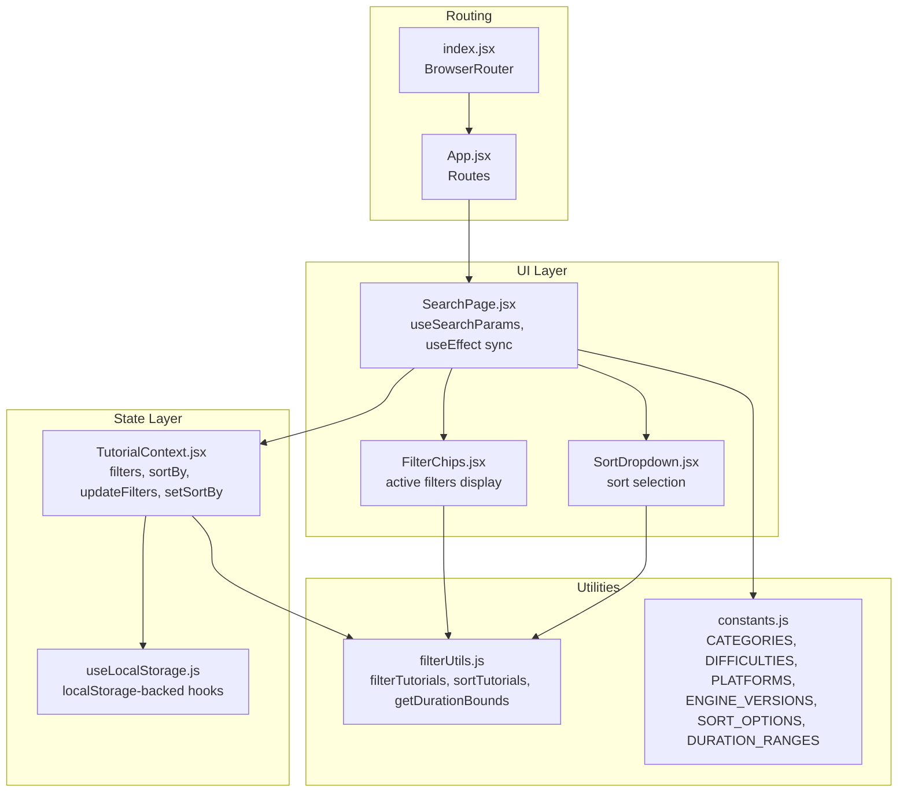
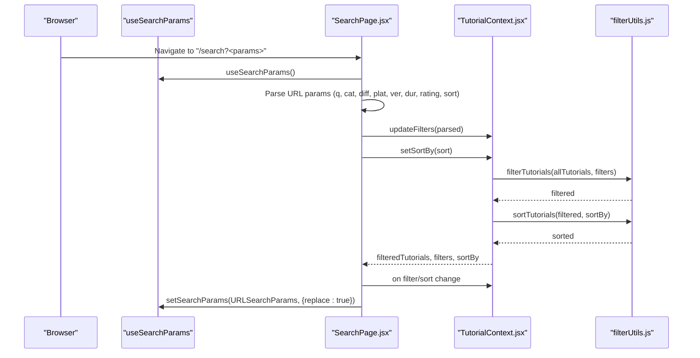
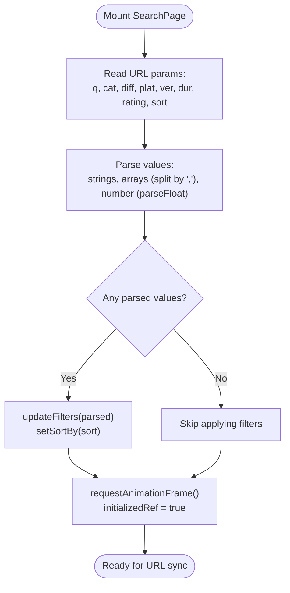
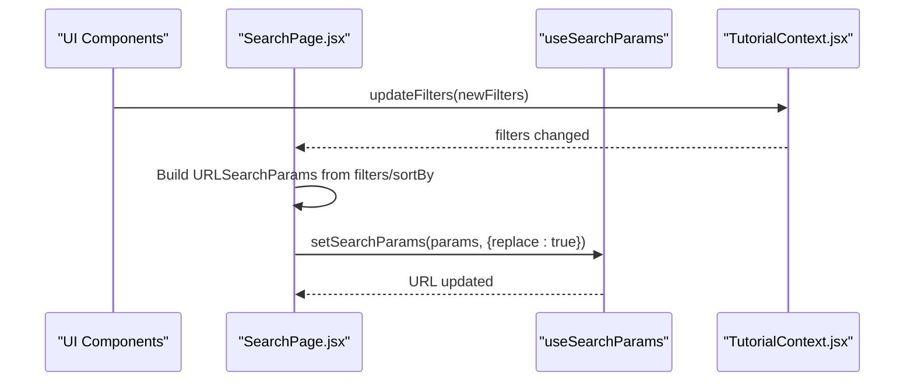
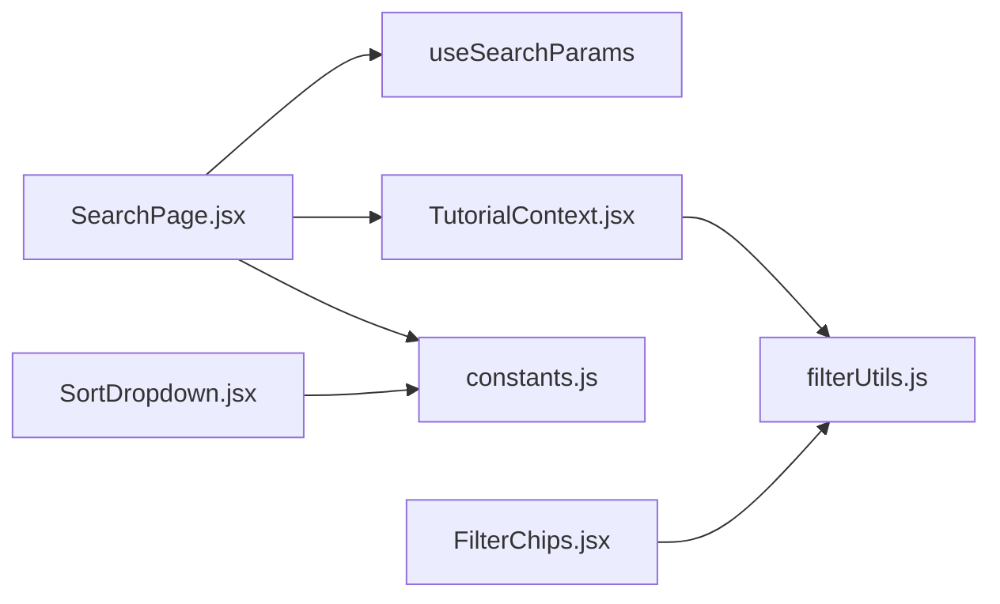

# URL Synchronization & State Management

<cite>
**Referenced Files in This Document**
- [SearchPage.jsx](file://src/pages/SearchPage.jsx)
- [TutorialContext.jsx](file://src/contexts/TutorialContext.jsx)
- [useLocalStorage.js](file://src/hooks/useLocalStorage.js)
- [filterUtils.js](file://src/utils/filterUtils.js)
- [constants.js](file://src/data/constants.js)
- [App.jsx](file://src/App.jsx)
- [index.jsx](file://src/index.jsx)
- [FilterChips.jsx](file://src/components/FilterChips.jsx)
- [SortDropdown.jsx](file://src/components/SortDropdown.jsx)
- [useTutorials.js](file://src/hooks/useTutorials.js)
</cite>

## Table of Contents
1. [Introduction](#introduction)
2. [Project Structure](#project-structure)
3. [Core Components](#core-components)
4. [Architecture Overview](#architecture-overview)
5. [Detailed Component Analysis](#detailed-component-analysis)
6. [Dependency Analysis](#dependency-analysis)
7. [Performance Considerations](#performance-considerations)
8. [Troubleshooting Guide](#troubleshooting-guide)
9. [Conclusion](#conclusion)

## Introduction
This document explains the URL synchronization and state management system that keeps URL query parameters in sync with component state. It covers:
- Bidirectional synchronization using the useSearchParams hook
- Initialization sequence that reads URL parameters on component mount and applies them to the filtering context
- State-to-URL synchronization that automatically updates URL parameters when filters or sort options change
- Encoding and decoding of complex filter objects (arrays, numbers, strings)
- An initialization guard using useRef to prevent premature URL updates during component mounting
- Examples of shareable URLs, filter state persistence across browser sessions, and URL parameter validation
- Edge cases including malformed URLs, parameter conflicts, and default parameter handling
- Integration with browser history, back/forward button behavior, and deep linking support
- Relationship between URL state and localStorage for enhanced user experience

## Project Structure
The URL synchronization system spans several layers:
- Routing and app bootstrap in App.jsx and index.jsx
- Filtering and sorting state in TutorialContext.jsx backed by localStorage via useLocalStorage.js
- UI components that render filters and sort options in SearchPage.jsx, FilterChips.jsx, and SortDropdown.jsx
- Utility functions for filter logic and duration bounds in filterUtils.js
- Constants for filter options and sort options in constants.js

**Diagram sources**
- [index.jsx:11-24](file://src/index.jsx#L11-L24)
- [App.jsx:21-47](file://src/App.jsx#L21-L47)
- [SearchPage.jsx:12-20](file://src/pages/SearchPage.jsx#L12-L20)
- [TutorialContext.jsx:18-25](file://src/contexts/TutorialContext.jsx#L18-L25)
- [useLocalStorage.js:3-27](file://src/hooks/useLocalStorage.js#L3-L27)
- [FilterChips.jsx:6-44](file://src/components/FilterChips.jsx#L6-L44)
- [SortDropdown.jsx:6-22](file://src/components/SortDropdown.jsx#L6-L22)
- [filterUtils.js:1-99](file://src/utils/filterUtils.js#L1-L99)
- [constants.js:1-71](file://src/data/constants.js#L1-L71)

**Section sources**
- [index.jsx:11-24](file://src/index.jsx#L11-L24)
- [App.jsx:21-47](file://src/App.jsx#L21-L47)
- [SearchPage.jsx:12-20](file://src/pages/SearchPage.jsx#L12-L20)
- [TutorialContext.jsx:18-25](file://src/contexts/TutorialContext.jsx#L18-L25)
- [useLocalStorage.js:3-27](file://src/hooks/useLocalStorage.js#L3-L27)
- [FilterChips.jsx:6-44](file://src/components/FilterChips.jsx#L6-L44)
- [SortDropdown.jsx:6-22](file://src/components/SortDropdown.jsx#L6-L22)
- [filterUtils.js:1-99](file://src/utils/filterUtils.js#L1-L99)
- [constants.js:1-71](file://src/data/constants.js#L1-L71)

## Core Components
- SearchPage.jsx: Implements the URL ↔ state synchronization using useSearchParams. It parses URL parameters on mount and writes back to the URL when filters or sort change. It uses a ref guard to avoid premature updates.
- TutorialContext.jsx: Provides the filtering and sorting state via React Context. Filters and sort are persisted to localStorage using useLocalStorage.js. The context exposes updateFilters and setSortBy to the UI.
- useLocalStorage.js: A generic localStorage hook that initializes from localStorage and persists updates.
- filterUtils.js: Contains filterTutorials, sortTutorials, and getDurationBounds used by the context to compute filtered and sorted results.
- constants.js: Defines filter and sort option lists used by UI components and validation logic.
- FilterChips.jsx and SortDropdown.jsx: UI components that render active filters and sort selection, integrating with the shared state.

Key behaviors:
- URL initialization: On mount, SearchPage reads query parameters and applies them to the filtering context.
- URL synchronization: On subsequent changes, SearchPage writes the current state back to the URL.
- Defaults: Certain defaults are omitted from the URL to keep it concise (e.g., durationRange "any", minRating 0, sortBy "newest").
- Persistence: Filters and sort order persist across sessions via localStorage.

**Section sources**
- [SearchPage.jsx:25-57](file://src/pages/SearchPage.jsx#L25-L57)
- [SearchPage.jsx:59-81](file://src/pages/SearchPage.jsx#L59-L81)
- [TutorialContext.jsx:8-16](file://src/contexts/TutorialContext.jsx#L8-L16)
- [TutorialContext.jsx:435-444](file://src/contexts/TutorialContext.jsx#L435-L444)
- [useLocalStorage.js:3-27](file://src/hooks/useLocalStorage.js#L3-L27)
- [filterUtils.js:1-99](file://src/utils/filterUtils.js#L1-L99)
- [constants.js:40-45](file://src/data/constants.js#L40-L45)
- [FilterChips.jsx:6-44](file://src/components/FilterChips.jsx#L6-L44)
- [SortDropdown.jsx:6-22](file://src/components/SortDropdown.jsx#L6-L22)

## Architecture Overview
The system follows a unidirectional data flow with bidirectional URL synchronization:
- Mount: URL → Context (parse and apply)
- Runtime: Context → URL (write back on change)
- UI: Components read from context and call setters to mutate state

**Diagram sources**
- [SearchPage.jsx:25-57](file://src/pages/SearchPage.jsx#L25-L57)
- [SearchPage.jsx:59-81](file://src/pages/SearchPage.jsx#L59-L81)
- [TutorialContext.jsx:68-71](file://src/contexts/TutorialContext.jsx#L68-L71)
- [filterUtils.js:1-99](file://src/utils/filterUtils.js#L1-L99)

## Detailed Component Analysis

### URL Initialization and Guard (SearchPage.jsx)
- Reads URL parameters on mount and applies them to the filtering context.
- Uses a ref guard initialized after a requestAnimationFrame tick to prevent URL updates while the context is settling.
- Applies defaults only when present in the URL; otherwise leaves context defaults unchanged.

**Diagram sources**
- [SearchPage.jsx:25-57](file://src/pages/SearchPage.jsx#L25-L57)

**Section sources**
- [SearchPage.jsx:25-57](file://src/pages/SearchPage.jsx#L25-L57)

### State-to-URL Synchronization (SearchPage.jsx)
- On every change to filters or sortBy, constructs a URLSearchParams object and writes it back to the URL using setSearchParams with replace: true.
- Omits default values to keep URLs concise (durationRange "any", minRating 0, sortBy "newest").

**Diagram sources**
- [SearchPage.jsx:59-81](file://src/pages/SearchPage.jsx#L59-L81)
- [TutorialContext.jsx:435-444](file://src/contexts/TutorialContext.jsx#L435-L444)

**Section sources**
- [SearchPage.jsx:59-81](file://src/pages/SearchPage.jsx#L59-L81)

### Encoding and Decoding of Complex Objects
- Arrays: Stored as comma-separated strings in the URL (e.g., categories, difficulties, platforms, engineVersions).
- Numbers: Stored as numeric strings; parsed back to numbers (e.g., minRating).
- Booleans: Not used directly in URL parameters; defaults are handled by omitting parameters.
- Strings: Stored as-is (e.g., searchQuery, durationRange, sort).

Validation and defaults:
- Empty arrays and "any" duration range are omitted from the URL.
- minRating 0 is omitted from the URL.
- sortBy "newest" is omitted from the URL.

**Section sources**
- [SearchPage.jsx:37-43](file://src/pages/SearchPage.jsx#L37-L43)
- [SearchPage.jsx:65-78](file://src/pages/SearchPage.jsx#L65-L78)

### Initialization Guard Using useRef
- initializedRef prevents URL updates until after the first animation frame, allowing the context to settle and avoiding race conditions during mount.

**Section sources**
- [SearchPage.jsx:52-55](file://src/pages/SearchPage.jsx#L52-L55)

### Shareable URLs and Deep Linking
- Shareable URLs encode the current filter and sort state. Users can bookmark or share links to reproduce the exact view.
- Deep linking is supported because the page reads URL parameters on mount and applies them to the context.

Examples of shareable URLs:
- Basic search: /search?q=platformer
- Multiple categories: /search?cat=2D,3D
- Difficulty and platform: /search?diff=Beginner,Intermediate&plat=Unity
- Duration and rating: /search?dur=medium&rating=4.5
- Sort order: /search?sort=highest-rated
- Combined filters: /search?q=scripting&cat=Programming&diff=Beginner&plat=Unity&dur=medium&rating=4.0&sort=popular

Persistence across sessions:
- Filters and sort order persist via localStorage-backed hooks, ensuring a consistent experience across reloads.

**Section sources**
- [SearchPage.jsx:25-57](file://src/pages/SearchPage.jsx#L25-L57)
- [SearchPage.jsx:59-81](file://src/pages/SearchPage.jsx#L59-L81)
- [TutorialContext.jsx:24-25](file://src/contexts/TutorialContext.jsx#L24-L25)

### URL Parameter Validation and Edge Cases
- Malformed URLs: The parsing logic checks for presence of parameters before applying them. Non-numeric rating values are coerced to 0 if parsing fails.
- Parameter conflicts: The system does not enforce mutual exclusivity; conflicting parameters are applied as written. The filter logic handles logical conflicts (e.g., durationRange vs. minRating).
- Default handling: Defaults are omitted from the URL to keep it minimal. On mount, only non-empty parameters are applied.

**Section sources**
- [SearchPage.jsx:37-43](file://src/pages/SearchPage.jsx#L37-L43)
- [SearchPage.jsx:74-78](file://src/pages/SearchPage.jsx#L74-L78)

### Integration with Browser History and Back/Forward Buttons
- setSearchParams with replace: true updates the current entry in the browser history, preserving the ability to navigate back/forward.
- The page re-applies URL parameters on mount, ensuring correct state restoration when navigating back to the page.

**Section sources**
- [SearchPage.jsx](file://src/pages/SearchPage.jsx#L80)
- [SearchPage.jsx:25-57](file://src/pages/SearchPage.jsx#L25-L57)

### Relationship Between URL State and localStorage
- The filtering context persists filters and sort order to localStorage using useLocalStorage.js. This ensures that:
  - Users see their preferred filters after refresh
  - URL state and local storage are decoupled, allowing for robust state management
- The URL remains the canonical source of truth for sharing and deep linking, while localStorage provides session continuity.

**Section sources**
- [TutorialContext.jsx:24-25](file://src/contexts/TutorialContext.jsx#L24-L25)
- [useLocalStorage.js:3-27](file://src/hooks/useLocalStorage.js#L3-L27)

## Dependency Analysis
The URL synchronization depends on:
- React Router’s useSearchParams for reading and writing URL parameters
- TutorialContext for the canonical state of filters and sort
- filterUtils for applying filters and sorting
- constants for option lists used by UI and validation

**Diagram sources**
- [SearchPage.jsx:22-20](file://src/pages/SearchPage.jsx#L22-L20)
- [TutorialContext.jsx:68-71](file://src/contexts/TutorialContext.jsx#L68-L71)
- [filterUtils.js:1-99](file://src/utils/filterUtils.js#L1-L99)
- [constants.js:40-45](file://src/data/constants.js#L40-L45)
- [FilterChips.jsx:6-44](file://src/components/FilterChips.jsx#L6-L44)
- [SortDropdown.jsx:6-22](file://src/components/SortDropdown.jsx#L6-L22)

**Section sources**
- [SearchPage.jsx:22-20](file://src/pages/SearchPage.jsx#L22-L20)
- [TutorialContext.jsx:68-71](file://src/contexts/TutorialContext.jsx#L68-L71)
- [filterUtils.js:1-99](file://src/utils/filterUtils.js#L1-L99)
- [constants.js:40-45](file://src/data/constants.js#L40-L45)
- [FilterChips.jsx:6-44](file://src/components/FilterChips.jsx#L6-L44)
- [SortDropdown.jsx:6-22](file://src/components/SortDropdown.jsx#L6-L22)

## Performance Considerations
- Minimizing URL writes: Only write to the URL when initializedRef is true and when filters/sort actually change.
- Efficient parameter building: Construct URLSearchParams once per change and use replace: true to avoid extra history entries.
- Debouncing: While not directly part of URL sync, SearchFilter uses a debounce hook to reduce frequent updates to the search query, indirectly reducing URL churn.

[No sources needed since this section provides general guidance]

## Troubleshooting Guide
Common issues and resolutions:
- Filters not applying on initial load:
  - Ensure URL parameters are present and correctly formatted (comma-separated arrays, numeric rating).
  - Verify that the component mounts under the /search route.
- URL updates firing during mount:
  - Confirm that initializedRef is set after a requestAnimationFrame tick.
- Unexpected default values in URL:
  - Defaults are intentionally omitted. If you see unexpected parameters, check for manual URL edits or external links.
- Malformed rating values:
  - Non-numeric rating values are coerced to 0. Ensure numeric values are passed.

**Section sources**
- [SearchPage.jsx:52-55](file://src/pages/SearchPage.jsx#L52-L55)
- [SearchPage.jsx](file://src/pages/SearchPage.jsx#L43)
- [SearchPage.jsx:76-77](file://src/pages/SearchPage.jsx#L76-L77)

## Conclusion
The URL synchronization system provides a robust, bidirectional bridge between URL query parameters and component state. It supports deep linking, preserves user preferences via localStorage, and maintains clean, shareable URLs by omitting defaults. The initialization guard and careful parameter encoding/decoding ensure reliable behavior across navigation and browser history actions.