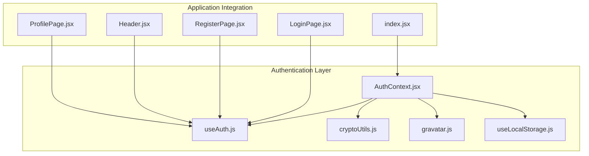
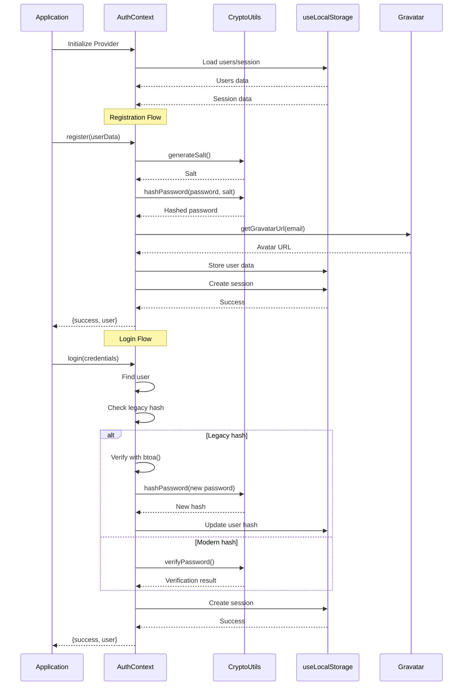
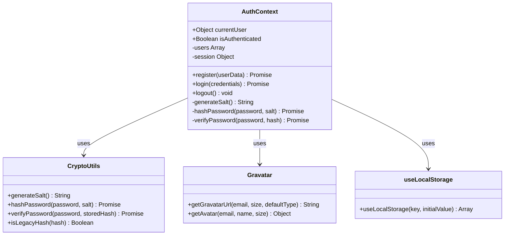
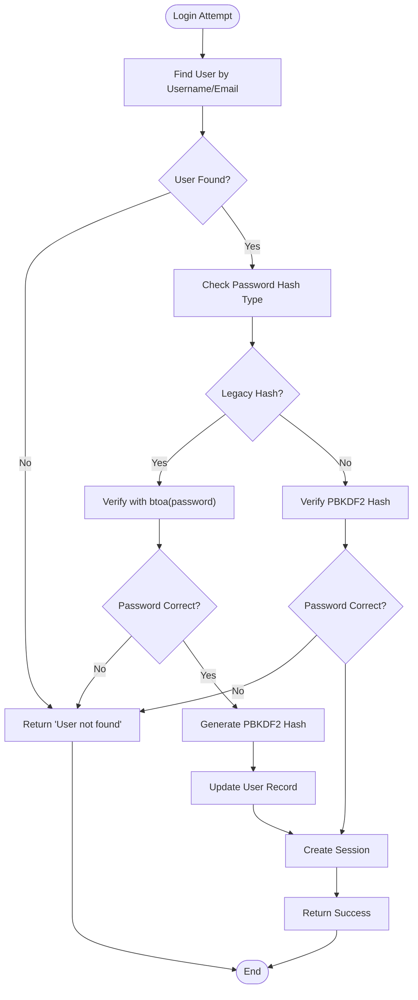
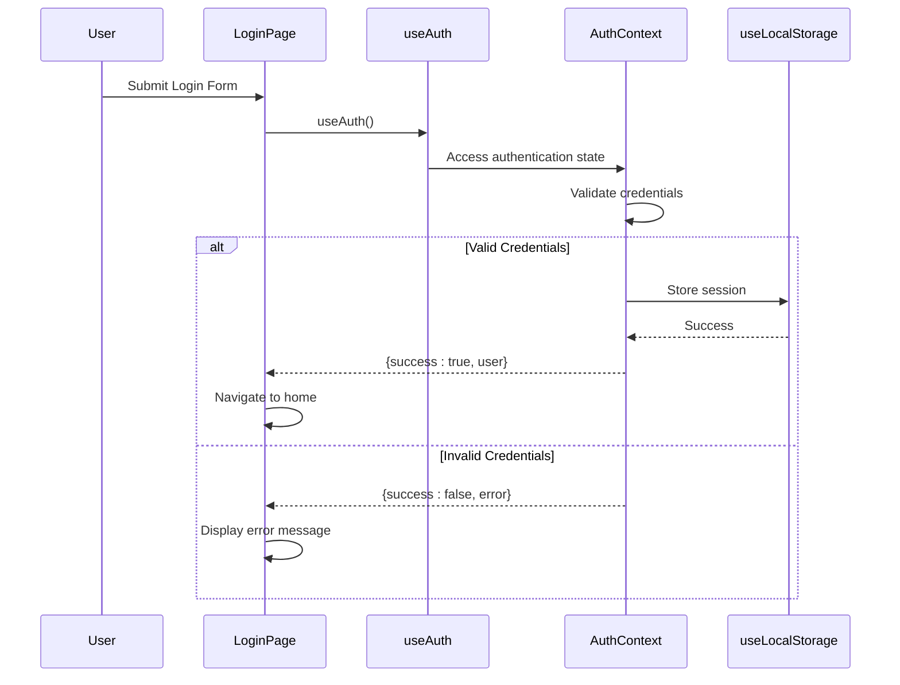
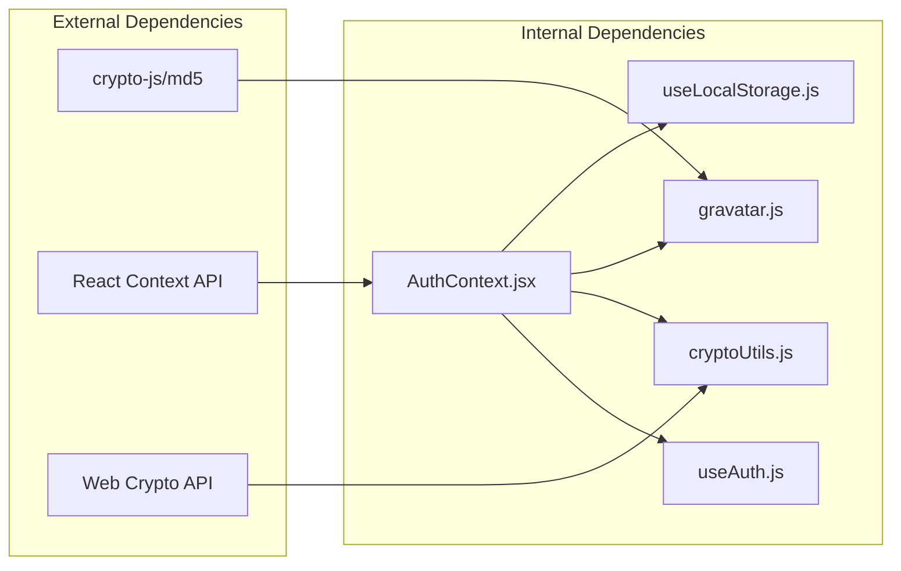

# Authentication Context

<cite>
**Referenced Files in This Document**
- [AuthContext.jsx](file://src/contexts/AuthContext.jsx)
- [useAuth.js](file://src/hooks/useAuth.js)
- [cryptoUtils.js](file://src/utils/cryptoUtils.js)
- [gravatar.js](file://src/utils/gravatar.js)
- [useLocalStorage.js](file://src/hooks/useLocalStorage.js)
- [index.jsx](file://src/index.jsx)
- [LoginPage.jsx](file://src/pages/LoginPage.jsx)
- [RegisterPage.jsx](file://src/pages/RegisterPage.jsx)
- [Header.jsx](file://src/components/layout/Header.jsx)
- [ProfilePage.jsx](file://src/pages/ProfilePage.jsx)
</cite>

## Table of Contents
1. [Introduction](#introduction)
2. [Project Structure](#project-structure)
3. [Core Components](#core-components)
4. [Architecture Overview](#architecture-overview)
5. [Detailed Component Analysis](#detailed-component-analysis)
6. [Dependency Analysis](#dependency-analysis)
7. [Performance Considerations](#performance-considerations)
8. [Troubleshooting Guide](#troubleshooting-guide)
9. [Conclusion](#conclusion)

## Introduction
This document provides comprehensive documentation for the AuthContext system that manages user authentication state across the GameDev Hub application. The system implements the Provider Pattern using React Context API for centralized authentication state management, featuring secure password hashing with PBKDF2, legacy password migration, Gravatar integration, and localStorage persistence.

## Project Structure
The authentication system is organized around several key files that work together to provide a complete authentication solution:

**Diagram sources**
- [index.jsx:12-22](file://src/index.jsx#L12-L22)
- [AuthContext.jsx:1-105](file://src/contexts/AuthContext.jsx#L1-L105)

**Section sources**
- [index.jsx:1-28](file://src/index.jsx#L1-L28)
- [AuthContext.jsx:1-105](file://src/contexts/AuthContext.jsx#L1-L105)

## Core Components
The authentication system consists of several interconnected components that work together to provide comprehensive user authentication functionality:

### Authentication Context Provider
The AuthContext provides centralized state management for authentication across the entire application. It manages user sessions, handles authentication operations, and maintains persistent state using localStorage.

### Custom Hooks
The useAuth hook provides a convenient way for components to access authentication state and operations without worrying about the underlying context implementation.

### Cryptographic Utilities
The cryptoUtils module implements secure password hashing using PBKDF2 with salt-based encryption, providing modern cryptographic standards for password storage.

### Avatar Generation
The gravatar integration automatically generates user avatars from email addresses, falling back to initials when Gravatar is unavailable.

**Section sources**
- [AuthContext.jsx:11-105](file://src/contexts/AuthContext.jsx#L11-L105)
- [useAuth.js:1-11](file://src/hooks/useAuth.js#L1-L11)
- [cryptoUtils.js:1-70](file://src/utils/cryptoUtils.js#L1-L70)
- [gravatar.js:1-35](file://src/utils/gravatar.js#L1-L35)

## Architecture Overview
The authentication system follows a layered architecture with clear separation of concerns:

**Diagram sources**
- [AuthContext.jsx:22-90](file://src/contexts/AuthContext.jsx#L22-L90)
- [cryptoUtils.js:25-65](file://src/utils/cryptoUtils.js#L25-L65)
- [gravatar.js:10-15](file://src/utils/gravatar.js#L10-L15)

## Detailed Component Analysis

### AuthContext Implementation
The AuthContext provides the core authentication functionality through a comprehensive set of operations:

#### Authentication Operations
The context exposes four primary authentication operations: register, login, logout, and currentUser derivation.

#### State Management
Authentication state is managed using two localStorage-backed stores: user accounts and active sessions.

#### Security Features
The system implements modern cryptographic standards with PBKDF2 password hashing and legacy password migration support.

**Diagram sources**
- [AuthContext.jsx:13-105](file://src/contexts/AuthContext.jsx#L13-L105)
- [cryptoUtils.js:1-70](file://src/utils/cryptoUtils.js#L1-L70)
- [gravatar.js:1-35](file://src/utils/gravatar.js#L1-L35)
- [useLocalStorage.js:1-29](file://src/hooks/useLocalStorage.js#L1-L29)

**Section sources**
- [AuthContext.jsx:13-105](file://src/contexts/AuthContext.jsx#L13-L105)

### Password Security Implementation
The authentication system implements robust password security using PBKDF2 with the following specifications:

#### PBKDF2 Configuration
- Iterations: 100,000
- Hash Length: 256 bits
- Algorithm: SHA-256
- Salt Generation: Cryptographically secure random 16-byte salt

#### Legacy Password Migration
The system automatically migrates legacy base64-encoded passwords to PBKDF2 format during login attempts, ensuring security improvements without user intervention.

**Diagram sources**
- [AuthContext.jsx:54-86](file://src/contexts/AuthContext.jsx#L54-L86)
- [cryptoUtils.js:50-65](file://src/utils/cryptoUtils.js#L50-L65)

**Section sources**
- [cryptoUtils.js:1-70](file://src/utils/cryptoUtils.js#L1-L70)
- [AuthContext.jsx:63-80](file://src/contexts/AuthContext.jsx#L63-L80)

### Gravatar Integration
The system integrates with Gravatar for automatic avatar generation:

#### Avatar Generation Process
- Email normalization (lowercase, whitespace removal)
- MD5 hash calculation for Gravatar URL construction
- Default avatar type selection (identicon)
- Size customization (default 80px)

#### Fallback Mechanism
When Gravatar is unavailable, the system falls back to displaying the user's initials as a backup avatar.

**Section sources**
- [gravatar.js:10-35](file://src/utils/gravatar.js#L10-L35)
- [AuthContext.jsx:43](file://src/contexts/AuthContext.jsx#L43)

### Component Integration Patterns
Authentication state is consumed throughout the application using the useAuth hook:

#### Protected Route Implementation
Components can check authentication status and redirect unauthenticated users to login pages.

#### User-Specific UI Elements
Authenticated users see personalized navigation elements including avatar displays and profile links.

#### Form Validation and Submission
Registration and login forms implement comprehensive client-side validation before attempting authentication operations.

**Diagram sources**
- [LoginPage.jsx:19-39](file://src/pages/LoginPage.jsx#L19-L39)
- [useAuth.js:4-10](file://src/hooks/useAuth.js#L4-L10)
- [AuthContext.jsx:54-86](file://src/contexts/AuthContext.jsx#L54-L86)

**Section sources**
- [LoginPage.jsx:1-82](file://src/pages/LoginPage.jsx#L1-L82)
- [RegisterPage.jsx:1-132](file://src/pages/RegisterPage.jsx#L1-L132)
- [Header.jsx:37-73](file://src/components/layout/Header.jsx#L37-L73)

### Session Management
The authentication system implements persistent session management using localStorage:

#### Session Persistence
- Session data stored under 'kaz_session' key
- Automatic loading on application startup
- Session cleanup on logout operation

#### User Data Persistence
- User accounts stored under 'kaz_users' key
- Automatic synchronization of user modifications
- Data serialization using JSON format

**Section sources**
- [AuthContext.jsx:14-15](file://src/contexts/AuthContext.jsx#L14-L15)
- [useLocalStorage.js:3-28](file://src/hooks/useLocalStorage.js#L3-L28)

## Dependency Analysis
The authentication system has well-defined dependencies that contribute to its modularity and maintainability:

**Diagram sources**
- [gravatar.js:1](file://src/utils/gravatar.js#L1)
- [cryptoUtils.js:27](file://src/utils/cryptoUtils.js#L27)
- [AuthContext.jsx:1](file://src/contexts/AuthContext.jsx#L1)

### Component Coupling
The authentication system demonstrates good separation of concerns with minimal coupling between components. Each module has a specific responsibility and communicates through well-defined interfaces.

### Circular Dependency Prevention
The system avoids circular dependencies by maintaining a unidirectional data flow from components to the context, with no reverse dependencies.

**Section sources**
- [AuthContext.jsx:1-10](file://src/contexts/AuthContext.jsx#L1-L10)
- [gravatar.js:1](file://src/utils/gravatar.js#L1)
- [cryptoUtils.js:27](file://src/utils/cryptoUtils.js#L27)

## Performance Considerations
The authentication system implements several performance optimizations:

### Memoization Strategy
The currentUser derivation uses useMemo to prevent unnecessary recalculations when session or user data hasn't changed.

### Lazy Loading
Authentication operations are wrapped in useCallback to prevent unnecessary re-renders of consuming components.

### Constant-Time Password Comparison
The password verification uses constant-time comparison to prevent timing attacks.

### Storage Optimization
localStorage operations are batched and optimized to minimize write operations.

**Section sources**
- [AuthContext.jsx:17-20](file://src/contexts/AuthContext.jsx#L17-L20)
- [AuthContext.jsx:92-101](file://src/contexts/AuthContext.jsx#L92-L101)
- [cryptoUtils.js:58-64](file://src/utils/cryptoUtils.js#L58-L64)

## Troubleshooting Guide

### Common Authentication Issues

#### Invalid Credentials
- **Symptoms**: Login attempts fail with "Incorrect password" or "User not found" messages
- **Causes**: Wrong username/email, incorrect password, or account not found
- **Solutions**: Verify credential format, check for typos, ensure account exists

#### Registration Failures
- **Symptoms**: Registration form shows validation errors or fails silently
- **Causes**: Username/email conflicts, invalid input formats, or server-side validation failures
- **Solutions**: Check username/email uniqueness, validate input formats, review error messages

#### Session Persistence Issues
- **Symptoms**: Users appear logged out unexpectedly or lose session data
- **Causes**: localStorage quota exceeded, browser privacy settings blocking storage
- **Solutions**: Clear browser cache, check storage quotas, verify browser settings

#### Legacy Password Migration Problems
- **Symptoms**: Existing users cannot log in after system upgrade
- **Causes**: Migration process failed or corrupted user records
- **Solutions**: Manually verify user records, check migration logs, implement manual migration

### Debugging Authentication Flow
To debug authentication issues, developers can:

1. Check localStorage keys ('kaz_users', 'kaz_session') for data integrity
2. Monitor network requests for authentication endpoints
3. Verify cryptographic operations using browser developer tools
4. Test password hashing and verification functions independently

**Section sources**
- [AuthContext.jsx:27-32](file://src/contexts/AuthContext.jsx#L27-L32)
- [AuthContext.jsx:59-61](file://src/contexts/AuthContext.jsx#L59-L61)
- [useLocalStorage.js:8-12](file://src/hooks/useLocalStorage.js#L8-L12)

## Conclusion
The AuthContext system provides a robust, secure, and maintainable authentication solution for the GameDev Hub application. Its implementation of modern cryptographic standards, comprehensive error handling, and seamless integration with the React ecosystem demonstrates best practices in authentication system design. The system successfully balances security requirements with user experience, providing transparent password migration, persistent sessions, and responsive user interface integration.

The modular architecture ensures easy maintenance and extension, while the clear separation of concerns facilitates testing and debugging. The integration with Gravatar and localStorage persistence creates a cohesive user experience that scales effectively as the application grows.