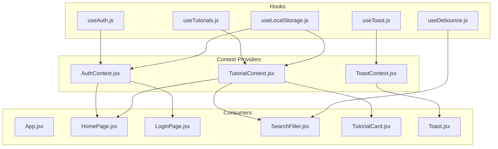
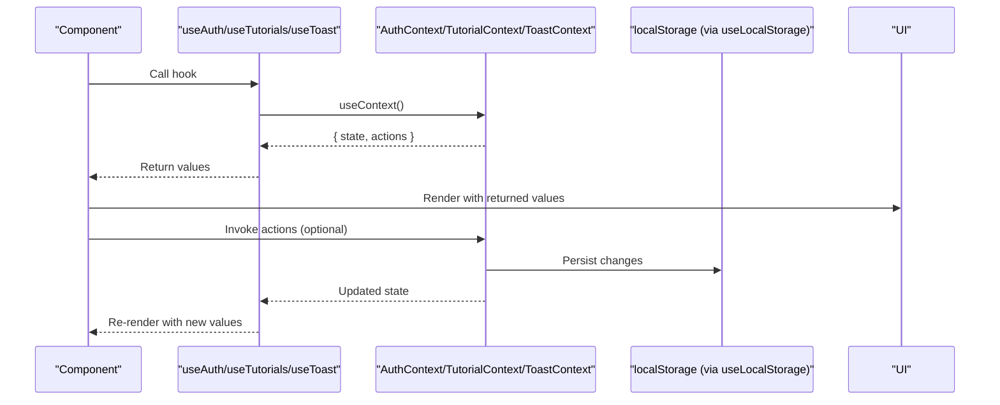
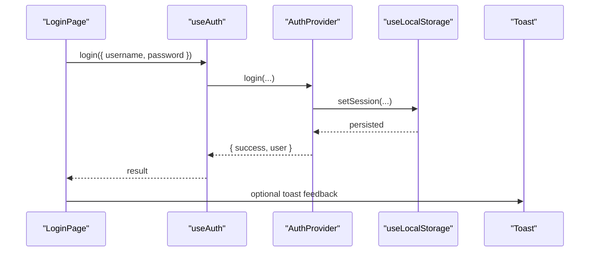
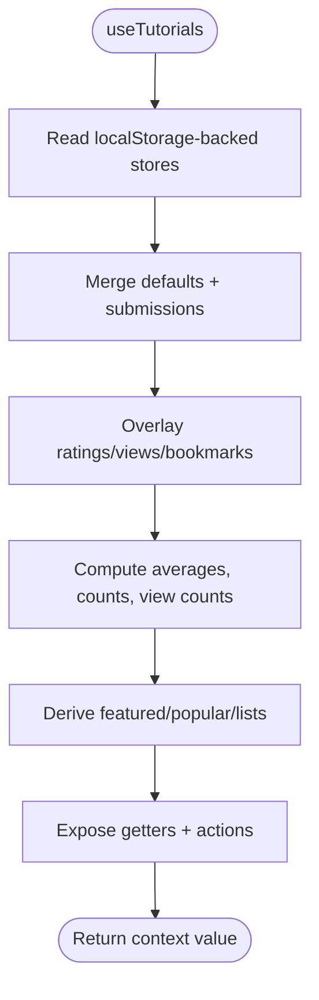
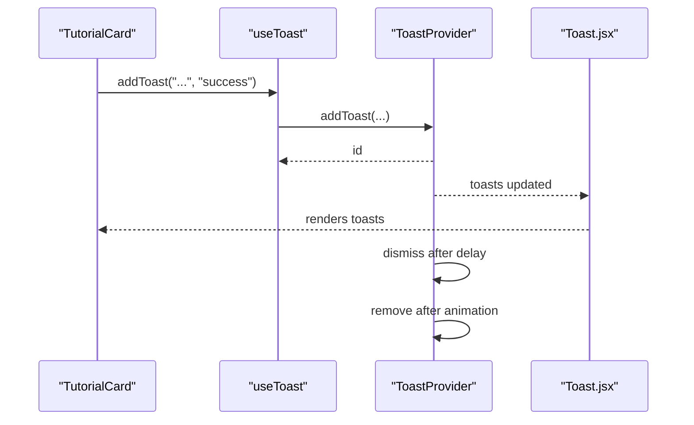
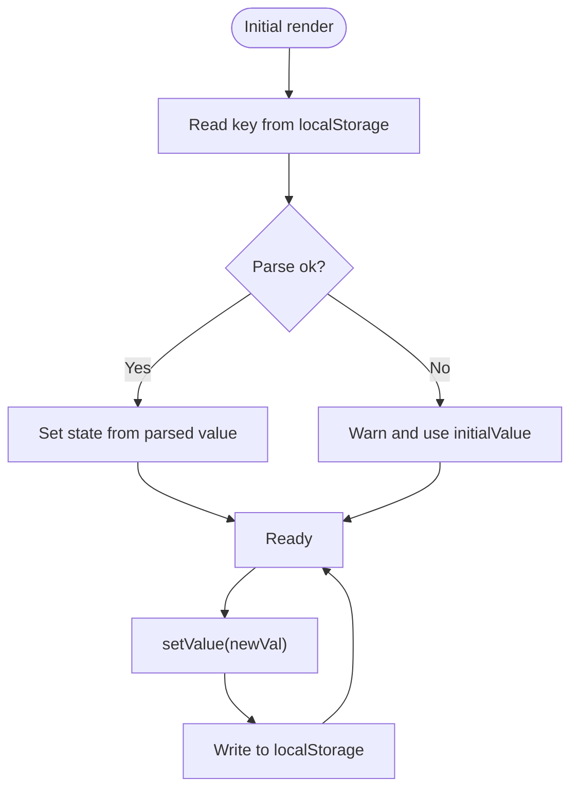
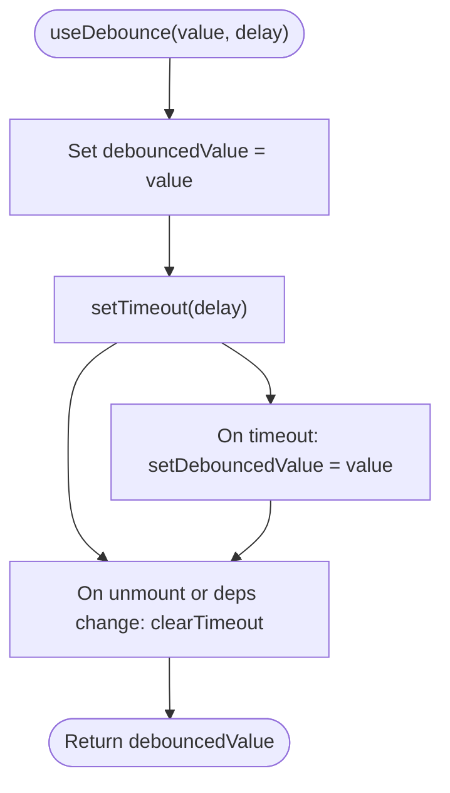
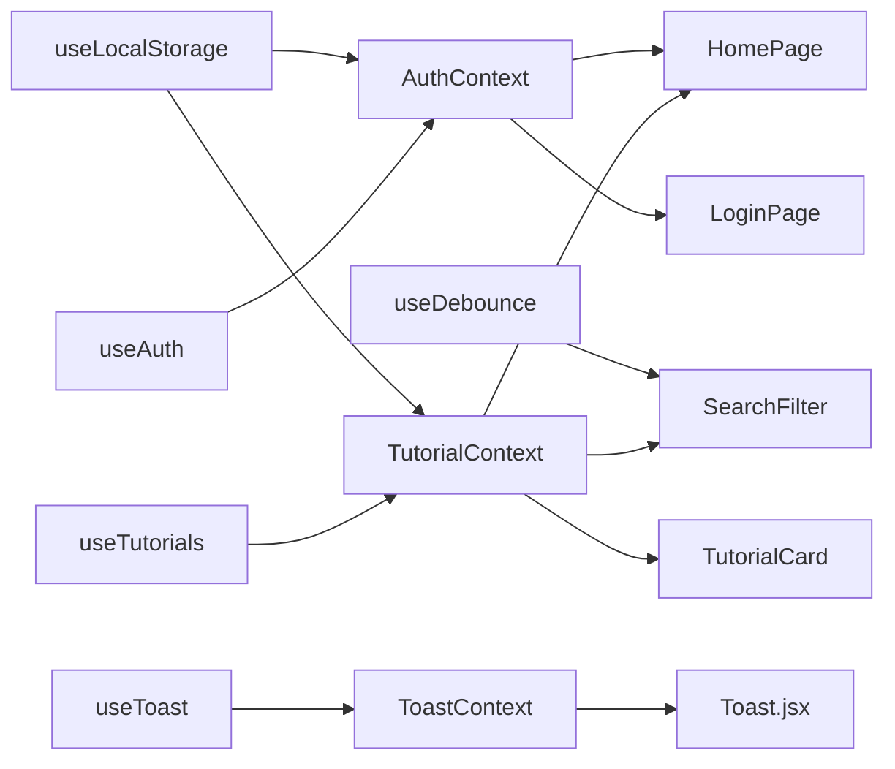

# Custom Hooks

<cite>
**Referenced Files in This Document**
- [useAuth.js](file://src/hooks/useAuth.js)
- [useTutorials.js](file://src/hooks/useTutorials.js)
- [useToast.js](file://src/hooks/useToast.js)
- [useLocalStorage.js](file://src/hooks/useLocalStorage.js)
- [useDebounce.js](file://src/hooks/useDebounce.js)
- [AuthContext.jsx](file://src/contexts/AuthContext.jsx)
- [TutorialContext.jsx](file://src/contexts/TutorialContext.jsx)
- [ToastContext.jsx](file://src/contexts/ToastContext.jsx)
- [Toast.jsx](file://src/components/Toast.jsx)
- [SearchFilter.jsx](file://src/components/SearchFilter.jsx)
- [TutorialCard.jsx](file://src/components/TutorialCard.jsx)
- [HomePage.jsx](file://src/pages/HomePage.jsx)
- [LoginPage.jsx](file://src/pages/LoginPage.jsx)
- [App.jsx](file://src/App.jsx)
</cite>

## Table of Contents
1. [Introduction](#introduction)
2. [Project Structure](#project-structure)
3. [Core Components](#core-components)
4. [Architecture Overview](#architecture-overview)
5. [Detailed Component Analysis](#detailed-component-analysis)
6. [Dependency Analysis](#dependency-analysis)
7. [Performance Considerations](#performance-considerations)
8. [Troubleshooting Guide](#troubleshooting-guide)
9. [Conclusion](#conclusion)
10. [Appendices](#appendices)

## Introduction
This document explains the custom hooks system that powers state management and reusable logic across the GameDev Hub application. It covers five hooks:
- useAuth: Authentication state access via a context provider
- useTutorials: Tutorial data manipulation and derived state
- useToast: Notification management via a context provider
- useLocalStorage: Browser storage abstraction with safe read/write
- useDebounce: Performance optimization for search and input throttling

Each hook is documented with implementation patterns, dependencies, return value structures, side effects, and practical usage examples. Guidance is also provided on composition strategies, testing approaches, and extension best practices.

## Project Structure
The hooks live under src/hooks and are consumed by components and pages. Providers under src/contexts supply the shared state and functions that the hooks expose to consumers.

**Diagram sources**
- [useAuth.js:1-11](file://src/hooks/useAuth.js#L1-L11)
- [useTutorials.js:1-11](file://src/hooks/useTutorials.js#L1-L11)
- [useToast.js:1-11](file://src/hooks/useToast.js#L1-L11)
- [useLocalStorage.js:1-29](file://src/hooks/useLocalStorage.js#L1-L29)
- [useDebounce.js:1-16](file://src/hooks/useDebounce.js#L1-L16)
- [AuthContext.jsx:1-105](file://src/contexts/AuthContext.jsx#L1-L105)
- [TutorialContext.jsx:1-542](file://src/contexts/TutorialContext.jsx#L1-L542)
- [ToastContext.jsx:1-53](file://src/contexts/ToastContext.jsx#L1-L53)
- [App.jsx:1-51](file://src/App.jsx#L1-L51)
- [HomePage.jsx:1-95](file://src/pages/HomePage.jsx#L1-L95)
- [LoginPage.jsx:1-82](file://src/pages/LoginPage.jsx#L1-L82)
- [SearchFilter.jsx:1-237](file://src/components/SearchFilter.jsx#L1-L237)
- [TutorialCard.jsx:1-110](file://src/components/TutorialCard.jsx#L1-L110)
- [Toast.jsx:1-32](file://src/components/Toast.jsx#L1-L32)

**Section sources**
- [useAuth.js:1-11](file://src/hooks/useAuth.js#L1-L11)
- [useTutorials.js:1-11](file://src/hooks/useTutorials.js#L1-L11)
- [useToast.js:1-11](file://src/hooks/useToast.js#L1-L11)
- [useLocalStorage.js:1-29](file://src/hooks/useLocalStorage.js#L1-L29)
- [useDebounce.js:1-16](file://src/hooks/useDebounce.js#L1-L16)
- [AuthContext.jsx:1-105](file://src/contexts/AuthContext.jsx#L1-L105)
- [TutorialContext.jsx:1-542](file://src/contexts/TutorialContext.jsx#L1-L542)
- [ToastContext.jsx:1-53](file://src/contexts/ToastContext.jsx#L1-L53)
- [App.jsx:1-51](file://src/App.jsx#L1-L51)

## Core Components
This section documents each hook’s purpose, implementation pattern, dependencies, and return value structure.

- useAuth
  - Purpose: Provide authentication state and actions (login, register, logout) to components.
  - Implementation pattern: Thin consumer hook around AuthContext.
  - Dependencies: React useContext, AuthContext.
  - Returns: Object containing currentUser, isAuthenticated, register, login, logout.
  - Side effects: None in the hook itself; actions mutate persisted state via AuthProvider.
  - Hook composition: Used alongside useLocalStorage inside AuthProvider for persistence.

- useTutorials
  - Purpose: Provide tutorial data, filtering/sorting, user-specific overlays, and feature toggles.
  - Implementation pattern: Thin consumer hook around TutorialContext.
  - Dependencies: React useContext, TutorialContext.
  - Returns: Large object of computed and action functions (see TutorialContext for full shape).
  - Side effects: Derived state computed via useMemo; actions write to localStorage-backed stores.
  - Hook composition: Uses useLocalStorage internally for persistence.

- useToast
  - Purpose: Provide toast notifications (add/remove) and current list to UI.
  - Implementation pattern: Thin consumer hook around ToastContext.
  - Dependencies: React useContext, ToastContext.
  - Returns: Object containing toasts array, addToast, removeToast.
  - Side effects: Manages timers for dismissal and removal; cleans up on unmount.
  - Hook composition: Used by Toast component to render notifications.

- useLocalStorage
  - Purpose: Abstract localStorage reads/writes with safe parsing and error handling.
  - Implementation pattern: useState plus useCallback for setter; persists on change.
  - Dependencies: React useState, useCallback.
  - Returns: Array pair [storedValue, setValue].
  - Side effects: Reads initial value from localStorage; writes updates synchronously to storage.
  - Hook composition: Used by AuthProvider and TutorialProvider to persist state.

- useDebounce
  - Purpose: Debounce input changes to reduce expensive computations.
  - Implementation pattern: useState plus useEffect to schedule updates after delay.
  - Dependencies: React useState, useEffect.
  - Returns: Debounced value (scalar).
  - Side effects: Sets up/clears timeout; cleanup on dependency changes.
  - Hook composition: Used in SearchFilter to debounce search queries.

**Section sources**
- [useAuth.js:1-11](file://src/hooks/useAuth.js#L1-L11)
- [useTutorials.js:1-11](file://src/hooks/useTutorials.js#L1-L11)
- [useToast.js:1-11](file://src/hooks/useToast.js#L1-L11)
- [useLocalStorage.js:1-29](file://src/hooks/useLocalStorage.js#L1-L29)
- [useDebounce.js:1-16](file://src/hooks/useDebounce.js#L1-L16)

## Architecture Overview
The hooks rely on context providers to centralize state and logic. Consumers use the hooks to access a normalized API surface.

**Diagram sources**
- [useAuth.js:1-11](file://src/hooks/useAuth.js#L1-L11)
- [useTutorials.js:1-11](file://src/hooks/useTutorials.js#L1-L11)
- [useToast.js:1-11](file://src/hooks/useToast.js#L1-L11)
- [AuthContext.jsx:1-105](file://src/contexts/AuthContext.jsx#L1-L105)
- [TutorialContext.jsx:1-542](file://src/contexts/TutorialContext.jsx#L1-L542)
- [ToastContext.jsx:1-53](file://src/contexts/ToastContext.jsx#L1-L53)
- [useLocalStorage.js:1-29](file://src/hooks/useLocalStorage.js#L1-L29)

## Detailed Component Analysis

### useAuth
- Implementation pattern: Consumer hook returning context value; guards against misuse outside provider.
- Dependencies: React useContext, AuthContext.
- Return value structure: { currentUser, isAuthenticated, register, login, logout }.
- Encapsulation: Authentication logic centralized in AuthProvider; hook exposes a clean API.
- Side effects: Actions mutate persisted state via useLocalStorage inside AuthProvider.

**Diagram sources**
- [LoginPage.jsx:1-82](file://src/pages/LoginPage.jsx#L1-L82)
- [useAuth.js:1-11](file://src/hooks/useAuth.js#L1-L11)
- [AuthContext.jsx:1-105](file://src/contexts/AuthContext.jsx#L1-L105)
- [useLocalStorage.js:1-29](file://src/hooks/useLocalStorage.js#L1-L29)

**Section sources**
- [useAuth.js:1-11](file://src/hooks/useAuth.js#L1-L11)
- [AuthContext.jsx:1-105](file://src/contexts/AuthContext.jsx#L1-L105)
- [LoginPage.jsx:1-82](file://src/pages/LoginPage.jsx#L1-L82)

### useTutorials
- Implementation pattern: Consumer hook returning context value; exposes derived lists and actions.
- Dependencies: React useContext, TutorialContext.
- Return value structure: Large object with computed lists (featured, popular, filtered) and functions (addRating, toggleBookmark, voteFreshness, submit/edit/delete, sorting/filters, etc.).
- Encapsulation: Complex merging of default tutorials and submissions; overlays user-specific data; computes derived metrics.
- Side effects: Derived state via useMemo; actions persist via useLocalStorage.

**Diagram sources**
- [TutorialContext.jsx:1-542](file://src/contexts/TutorialContext.jsx#L1-L542)
- [useTutorials.js:1-11](file://src/hooks/useTutorials.js#L1-L11)

**Section sources**
- [useTutorials.js:1-11](file://src/hooks/useTutorials.js#L1-L11)
- [TutorialContext.jsx:1-542](file://src/contexts/TutorialContext.jsx#L1-L542)
- [HomePage.jsx:1-95](file://src/pages/HomePage.jsx#L1-L95)

### useToast
- Implementation pattern: Consumer hook returning context value; manages lifecycle of toasts.
- Dependencies: React useContext, ToastContext.
- Return value structure: { toasts[], addToast(message, variant), removeToast(id) }.
- Encapsulation: Toast lifecycle (dismiss, remove) managed internally; limits queue size.
- Side effects: Sets timers for auto-dismiss; clears timers on unmount.

**Diagram sources**
- [useToast.js:1-11](file://src/hooks/useToast.js#L1-L11)
- [ToastContext.jsx:1-53](file://src/contexts/ToastContext.jsx#L1-L53)
- [Toast.jsx:1-32](file://src/components/Toast.jsx#L1-L32)
- [TutorialCard.jsx:1-110](file://src/components/TutorialCard.jsx#L1-L110)

**Section sources**
- [useToast.js:1-11](file://src/hooks/useToast.js#L1-L11)
- [ToastContext.jsx:1-53](file://src/contexts/ToastContext.jsx#L1-L53)
- [Toast.jsx:1-32](file://src/components/Toast.jsx#L1-L32)

### useLocalStorage
- Implementation pattern: Initialize from localStorage; persist updates; handle parse errors gracefully.
- Dependencies: React useState, useCallback.
- Return value structure: [storedValue, setValue].
- Encapsulation: Centralizes localStorage IO and error handling.
- Side effects: Synchronous write on setValue; warns on read/write errors.

**Diagram sources**
- [useLocalStorage.js:1-29](file://src/hooks/useLocalStorage.js#L1-L29)

**Section sources**
- [useLocalStorage.js:1-29](file://src/hooks/useLocalStorage.js#L1-L29)

### useDebounce
- Implementation pattern: Track debounced value; schedule updates on value/delay changes.
- Dependencies: React useState, useEffect.
- Return value structure: Scalar debounced value.
- Encapsulation: Encapsulates timing logic; caller only needs the debounced value.
- Side effects: Creates/cleans up timeout; cleanup runs on unmount or dependency change.

**Diagram sources**
- [useDebounce.js:1-16](file://src/hooks/useDebounce.js#L1-L16)

**Section sources**
- [useDebounce.js:1-16](file://src/hooks/useDebounce.js#L1-L16)
- [SearchFilter.jsx:1-237](file://src/components/SearchFilter.jsx#L1-L237)

## Dependency Analysis
- Hook-to-provider relationships:
  - useAuth -> AuthContext
  - useTutorials -> TutorialContext
  - useToast -> ToastContext
  - useLocalStorage -> localStorage (browser API)
  - useDebounce -> React (no external dependency)
- Composition:
  - AuthProvider and TutorialProvider both depend on useLocalStorage for persistence.
  - Components depend on hooks; hooks depend on contexts; contexts depend on localStorage.

**Diagram sources**
- [useAuth.js:1-11](file://src/hooks/useAuth.js#L1-L11)
- [useTutorials.js:1-11](file://src/hooks/useTutorials.js#L1-L11)
- [useToast.js:1-11](file://src/hooks/useToast.js#L1-L11)
- [useLocalStorage.js:1-29](file://src/hooks/useLocalStorage.js#L1-L29)
- [useDebounce.js:1-16](file://src/hooks/useDebounce.js#L1-L16)
- [AuthContext.jsx:1-105](file://src/contexts/AuthContext.jsx#L1-L105)
- [TutorialContext.jsx:1-542](file://src/contexts/TutorialContext.jsx#L1-L542)
- [ToastContext.jsx:1-53](file://src/contexts/ToastContext.jsx#L1-L53)
- [SearchFilter.jsx:1-237](file://src/components/SearchFilter.jsx#L1-L237)
- [TutorialCard.jsx:1-110](file://src/components/TutorialCard.jsx#L1-L110)
- [HomePage.jsx:1-95](file://src/pages/HomePage.jsx#L1-L95)
- [LoginPage.jsx:1-82](file://src/pages/LoginPage.jsx#L1-L82)
- [Toast.jsx:1-32](file://src/components/Toast.jsx#L1-L32)

**Section sources**
- [useAuth.js:1-11](file://src/hooks/useAuth.js#L1-L11)
- [useTutorials.js:1-11](file://src/hooks/useTutorials.js#L1-L11)
- [useToast.js:1-11](file://src/hooks/useToast.js#L1-L11)
- [useLocalStorage.js:1-29](file://src/hooks/useLocalStorage.js#L1-L29)
- [useDebounce.js:1-16](file://src/hooks/useDebounce.js#L1-L16)
- [AuthContext.jsx:1-105](file://src/contexts/AuthContext.jsx#L1-L105)
- [TutorialContext.jsx:1-542](file://src/contexts/TutorialContext.jsx#L1-L542)
- [ToastContext.jsx:1-53](file://src/contexts/ToastContext.jsx#L1-L53)
- [SearchFilter.jsx:1-237](file://src/components/SearchFilter.jsx#L1-L237)
- [TutorialCard.jsx:1-110](file://src/components/TutorialCard.jsx#L1-L110)
- [HomePage.jsx:1-95](file://src/pages/HomePage.jsx#L1-L95)
- [LoginPage.jsx:1-82](file://src/pages/LoginPage.jsx#L1-L82)
- [Toast.jsx:1-32](file://src/components/Toast.jsx#L1-L32)

## Performance Considerations
- Memoization and dependency arrays:
  - useLocalStorage: setValue memoized with dependency on key and storedValue to avoid unnecessary re-renders.
  - useDebounce: Effect depends on value and delay; cleanup clears previous timeout to prevent leaks.
  - AuthProvider and TutorialProvider extensively use useMemo to compute derived state and bind callbacks with useCallback to stabilize refs.
- Rendering cost:
  - useTutorials returns many computed lists; consumers should only destructure what they need.
  - ToastProvider caps the number of concurrent toasts to limit DOM nodes.
- Storage I/O:
  - useLocalStorage wraps read/write; consider batching updates if many writes occur in quick succession.
- Debouncing:
  - useDebounce reduces repeated computations during typing; tune delay per use case.

[No sources needed since this section provides general guidance]

## Troubleshooting Guide
- Hook used outside provider:
  - All three consumer hooks (useAuth, useTutorials, useToast) throw if used outside their respective providers. Wrap app with providers or ensure proper nesting.
- localStorage errors:
  - useLocalStorage warns and falls back to initialValue on read/write errors; check browser privacy settings or quota limits.
- Toast not dismissing:
  - ToastProvider cleans up timers on unmount; ensure Toast component is mounted and not conditionally rendered away prematurely.
- Debounce not updating:
  - Ensure dependency arrays include value and delay; clearing previous timeouts happens automatically on change.

**Section sources**
- [useAuth.js:1-11](file://src/hooks/useAuth.js#L1-L11)
- [useTutorials.js:1-11](file://src/hooks/useTutorials.js#L1-L11)
- [useToast.js:1-11](file://src/hooks/useToast.js#L1-L11)
- [useLocalStorage.js:1-29](file://src/hooks/useLocalStorage.js#L1-L29)
- [ToastContext.jsx:1-53](file://src/contexts/ToastContext.jsx#L1-L53)

## Conclusion
The custom hooks system cleanly abstracts state management and cross-cutting concerns:
- useAuth, useTutorials, and useToast provide focused, composable APIs backed by context providers.
- useLocalStorage and useDebounce encapsulate persistence and performance optimizations.
- Composition patterns emphasize separation of concerns, with providers handling persistence and derived logic while hooks offer simple, testable interfaces.

[No sources needed since this section summarizes without analyzing specific files]

## Appendices

### Practical Usage Examples
- Authentication
  - LoginPage uses useAuth to call login and redirect on success.
  - HomePage uses useAuth to conditionally render “For You” content.
  - Reference: [LoginPage.jsx:1-82](file://src/pages/LoginPage.jsx#L1-L82), [HomePage.jsx:1-95](file://src/pages/HomePage.jsx#L1-L95)

- Tutorials
  - HomePage consumes featured/popular/allTutorials and getForYouTutorials.
  - TutorialCard uses toggleBookmark, isBookmarked, isCompleted, getFreshnessStatus, and addToast.
  - Reference: [HomePage.jsx:1-95](file://src/pages/HomePage.jsx#L1-L95), [TutorialCard.jsx:1-110](file://src/components/TutorialCard.jsx#L1-L110)

- Notifications
  - Toast component renders toasts from useToast; TutorialCard triggers addToast on bookmark actions.
  - Reference: [Toast.jsx:1-32](file://src/components/Toast.jsx#L1-L32), [TutorialCard.jsx:1-110](file://src/components/TutorialCard.jsx#L1-L110)

- Search and Filtering
  - SearchFilter uses useDebounce to debounce search queries and local storage for recent searches.
  - Reference: [SearchFilter.jsx:1-237](file://src/components/SearchFilter.jsx#L1-L237)

### Hook Composition Strategies
- Prefer composing hooks inside providers (e.g., AuthProvider uses useLocalStorage) to keep hooks thin and reusable.
- Keep hook return values minimal; components can destructure only needed fields.
- Use useCallback for actions and useMemo for derived state to minimize re-renders.

### Testing Approaches for Custom Hooks
- Unit tests:
  - Test hook return values in isolation by rendering a component that calls the hook under a provider mock.
  - Verify error is thrown when hook is used outside provider.
- Integration tests:
  - Render pages/components that consume the hooks and assert UI behavior (e.g., toast appears, debounced query triggers).
- Provider mocks:
  - For hooks that rely on context, wrap tests with appropriate Provider components to simulate state and actions.

### Best Practices for Extending the Hook Library
- Keep hooks small and focused; delegate heavy logic to providers.
- Always guard against misuse (throw if context is missing).
- Favor useMemo/useCallback in providers to stabilize references.
- Document return shapes and side effects for consumers.
- Add clear error boundaries and warnings for storage failures.

[No sources needed since this section provides general guidance]