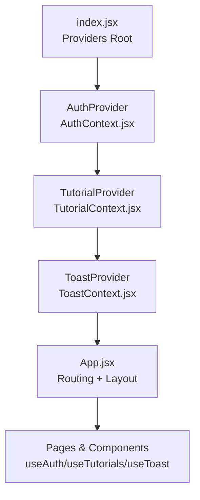
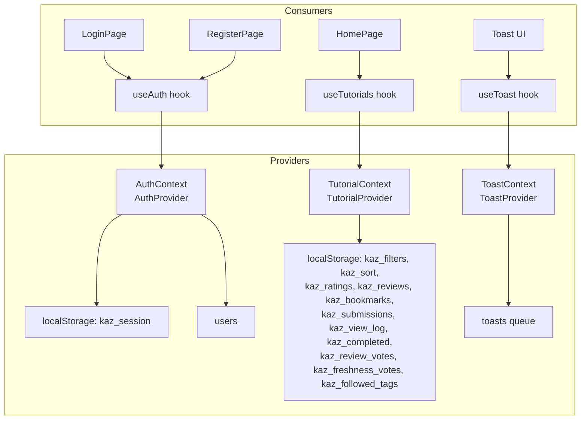
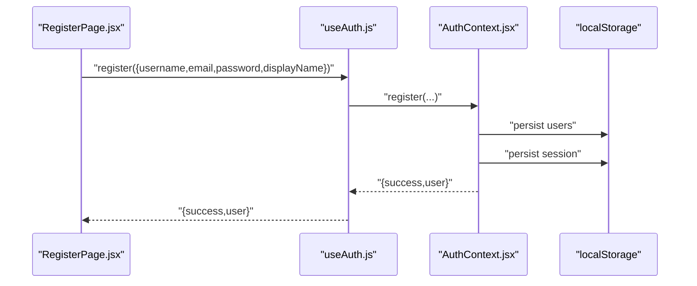
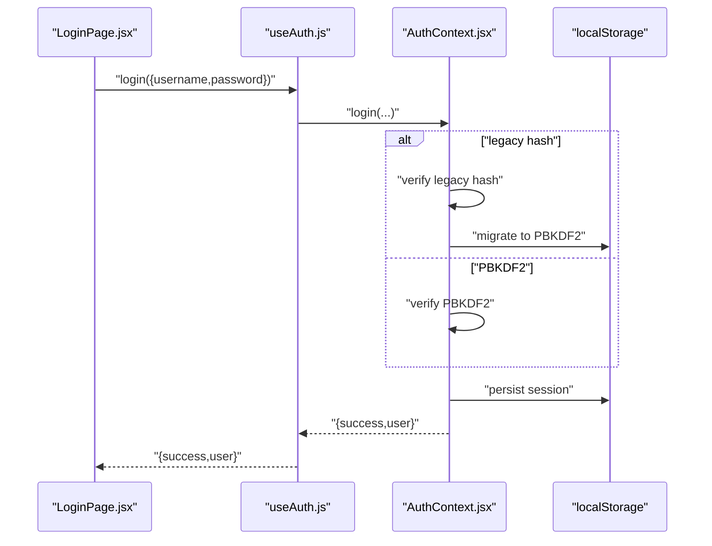
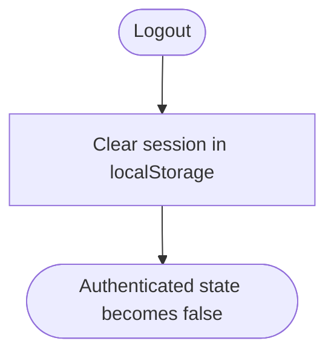
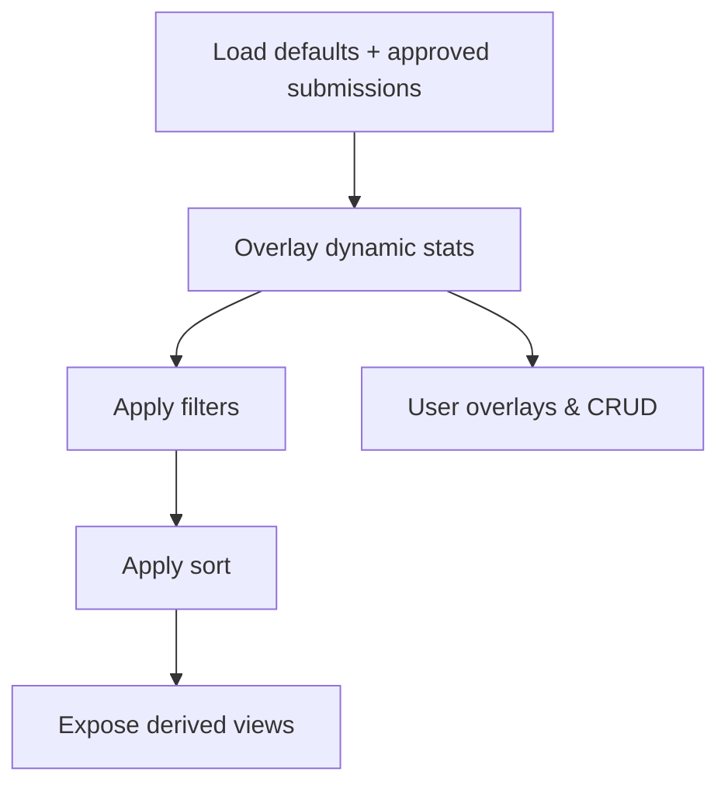
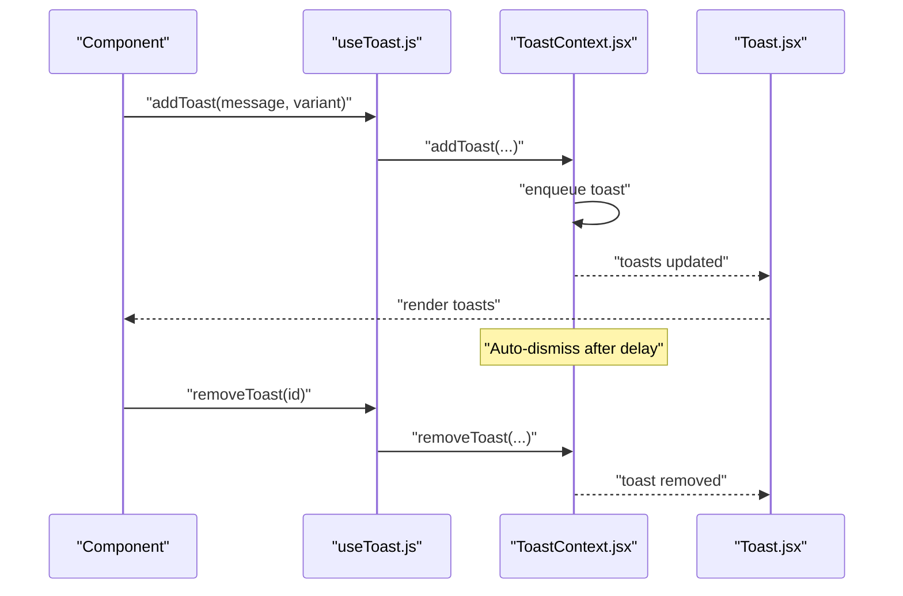
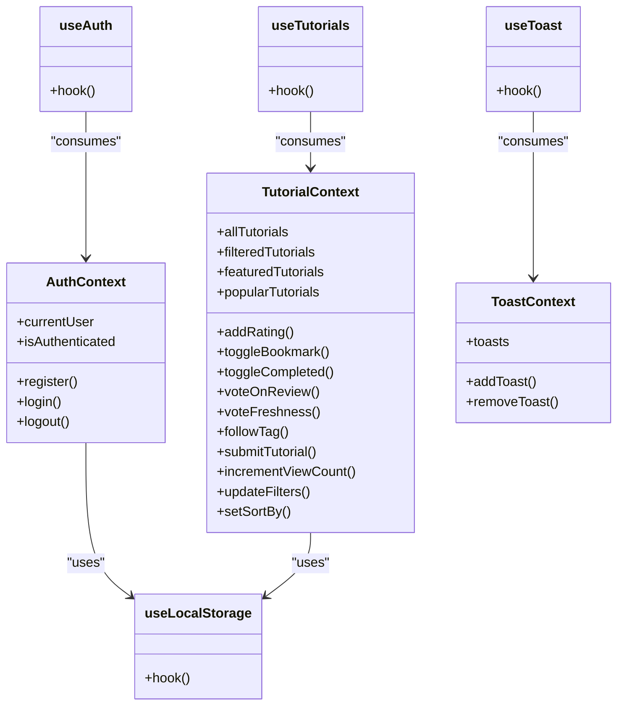
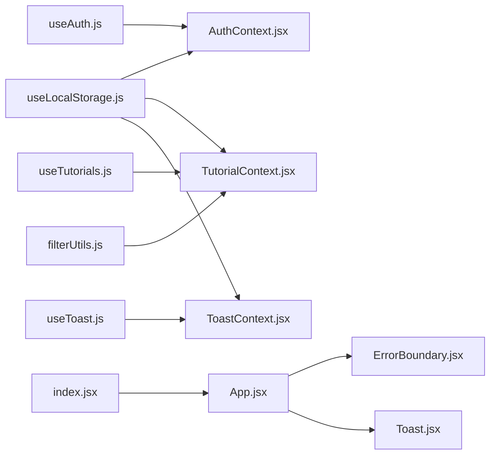
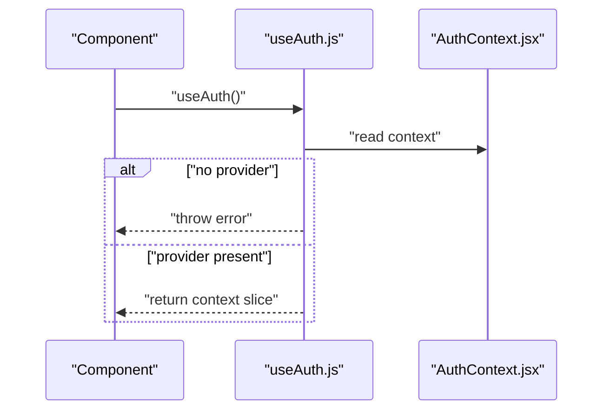

# State Management

<cite>
**Referenced Files in This Document**
- [index.jsx](file://src/index.jsx)
- [App.jsx](file://src/App.jsx)
- [AuthContext.jsx](file://src/contexts/AuthContext.jsx)
- [TutorialContext.jsx](file://src/contexts/TutorialContext.jsx)
- [ToastContext.jsx](file://src/contexts/ToastContext.jsx)
- [useAuth.js](file://src/hooks/useAuth.js)
- [useTutorials.js](file://src/hooks/useTutorials.js)
- [useToast.js](file://src/hooks/useToast.js)
- [useLocalStorage.js](file://src/hooks/useLocalStorage.js)
- [ErrorBoundary.jsx](file://src/components/ErrorBoundary.jsx)
- [Toast.jsx](file://src/components/Toast.jsx)
- [HomePage.jsx](file://src/pages/HomePage.jsx)
- [LoginPage.jsx](file://src/pages/LoginPage.jsx)
- [RegisterPage.jsx](file://src/pages/RegisterPage.jsx)
- [filterUtils.js](file://src/utils/filterUtils.js)
- [tutorials.js](file://src/data/tutorials.js)
- [constants.js](file://src/data/constants.js)
</cite>

## Table of Contents
1. [Introduction](#introduction)
2. [Project Structure](#project-structure)
3. [Core Components](#core-components)
4. [Architecture Overview](#architecture-overview)
5. [Detailed Component Analysis](#detailed-component-analysis)
6. [Dependency Analysis](#dependency-analysis)
7. [Performance Considerations](#performance-considerations)
8. [Troubleshooting Guide](#troubleshooting-guide)
9. [Conclusion](#conclusion)

## Introduction
This document explains GameDev Hub’s state management system built on React’s Context API and custom hooks. It covers:
- Provider Pattern implementation via three contexts: AuthContext, TutorialContext, and ToastContext
- Authentication lifecycle: registration, login, logout, and session persistence using localStorage
- Tutorial data management: filtering, sorting, and URL-synced state
- Toast notifications for user feedback and error handling
- Custom hooks that encapsulate state logic and enforce safe consumption
- Patterns for state updates, context consumption, and component integration
- Persistence across browser sessions, data migration for legacy accounts, and performance optimizations

## Project Structure
Providers wrap the app in a strict hierarchy to enable cross-component state sharing. The providers are initialized at the root and consumed by pages and components throughout the app.

**Diagram sources**
- [index.jsx:11-24](file://src/index.jsx#L11-L24)
- [App.jsx:21-47](file://src/App.jsx#L21-L47)

**Section sources**
- [index.jsx:11-24](file://src/index.jsx#L11-L24)
- [App.jsx:21-47](file://src/App.jsx#L21-L47)

## Core Components
- AuthContext: Manages user registration, login, logout, and current user resolution using localStorage-backed session storage.
- TutorialContext: Centralizes tutorial data, user-specific overlays (ratings, bookmarks, submissions), filtering/sorting, and feature toggles.
- ToastContext: Provides a toast queue with auto-dismissal and manual dismissal, with cleanup on unmount.
- Custom hooks: useAuth, useTutorials, useToast, and useLocalStorage abstract provider consumption and localStorage persistence.

Key responsibilities:
- AuthContext: user lookup, register/login with PBKDF2 hashing and legacy migration, logout, and session persistence.
- TutorialContext: merges default tutorials with approved submissions, computes derived views (featured/popular), exposes CRUD-like operations for user data, and manages filters/sort.
- ToastContext: maintains a capped list of toasts, auto-dismiss timers, and removal logic.
- useLocalStorage: reads/writes to localStorage with safe parsing and error logging.

**Section sources**
- [AuthContext.jsx:13-104](file://src/contexts/AuthContext.jsx#L13-L104)
- [TutorialContext.jsx:18-541](file://src/contexts/TutorialContext.jsx#L18-L541)
- [ToastContext.jsx:5-50](file://src/contexts/ToastContext.jsx#L5-L50)
- [useLocalStorage.js:3-28](file://src/hooks/useLocalStorage.js#L3-L28)

## Architecture Overview
The system follows a layered Provider pattern:
- Providers initialize state and expose memoized values
- Custom hooks validate provider presence and return the shared slice
- Components consume hooks to read/write state
- localStorage persists across sessions and recovers initial state

**Diagram sources**
- [AuthContext.jsx:13-104](file://src/contexts/AuthContext.jsx#L13-L104)
- [TutorialContext.jsx:18-541](file://src/contexts/TutorialContext.jsx#L18-L541)
- [ToastContext.jsx:5-50](file://src/contexts/ToastContext.jsx#L5-L50)
- [useAuth.js:4-10](file://src/hooks/useAuth.js#L4-L10)
- [useTutorials.js:4-10](file://src/hooks/useTutorials.js#L4-L10)
- [useToast.js:4-10](file://src/hooks/useToast.js#L4-L10)

## Detailed Component Analysis

### Authentication State Flow (AuthContext)
- Registration:
  - Validates uniqueness of username/email
  - Generates salt and hashes password using PBKDF2
  - Creates user with Gravatar avatar and timestamps
  - Persists users and sets session
- Login:
  - Resolves user by username or email
  - Supports legacy hash (btoa) with silent migration to PBKDF2
  - Verifies password and sets session
- Logout:
  - Clears session from localStorage
- Session resolution:
  - Computes current user from session.userId against persisted users

**Diagram sources**
- [RegisterPage.jsx:51-66](file://src/pages/RegisterPage.jsx#L51-L66)
- [useAuth.js:4-10](file://src/hooks/useAuth.js#L4-L10)
- [AuthContext.jsx:22-52](file://src/contexts/AuthContext.jsx#L22-L52)

**Diagram sources**
- [LoginPage.jsx:29-38](file://src/pages/LoginPage.jsx#L29-L38)
- [useAuth.js:4-10](file://src/hooks/useAuth.js#L4-L10)
- [AuthContext.jsx:54-86](file://src/contexts/AuthContext.jsx#L54-L86)

**Diagram sources**
- [AuthContext.jsx:88-90](file://src/contexts/AuthContext.jsx#L88-L90)

**Section sources**
- [AuthContext.jsx:13-104](file://src/contexts/AuthContext.jsx#L13-L104)
- [LoginPage.jsx:14-17](file://src/pages/LoginPage.jsx#L14-L17)
- [RegisterPage.jsx:16-19](file://src/pages/RegisterPage.jsx#L16-L19)

### Tutorial Data Management (TutorialContext)
- Data composition:
  - Merges default tutorials with approved submissions
  - Overlays dynamic stats (ratings, views) onto base tutorials
- Derived views:
  - featuredTutorials, popularTutorials
  - getForYouTutorials powered by followed tags
- Filtering and sorting:
  - Filters applied via filterUtils
  - Sorting by newest, popular, highest-rated, most-viewed
- User overlays:
  - Ratings, reviews, bookmarks, completion, review votes, freshness votes, followed tags
- Submissions:
  - CRUD for user-submitted tutorials (status handling)
- View counting:
  - Increment view log per tutorial

**Diagram sources**
- [TutorialContext.jsx:37-81](file://src/contexts/TutorialContext.jsx#L37-L81)
- [filterUtils.js:1-99](file://src/utils/filterUtils.js#L1-L99)

**Section sources**
- [TutorialContext.jsx:18-541](file://src/contexts/TutorialContext.jsx#L18-L541)
- [filterUtils.js:1-99](file://src/utils/filterUtils.js#L1-L99)
- [tutorials.js:1-522](file://src/data/tutorials.js#L1-L522)
- [constants.js:1-71](file://src/data/constants.js#L1-L71)

### Toast Notification System (ToastContext)
- Adds toasts with variants and caps the queue length
- Auto-dismiss after a delay with a dismiss animation
- Manual dismissal supported
- Cleanup of timers on unmount

**Diagram sources**
- [ToastContext.jsx:27-40](file://src/contexts/ToastContext.jsx#L27-L40)
- [Toast.jsx:5-31](file://src/components/Toast.jsx#L5-L31)
- [useToast.js:4-10](file://src/hooks/useToast.js#L4-L10)

**Section sources**
- [ToastContext.jsx:5-50](file://src/contexts/ToastContext.jsx#L5-L50)
- [Toast.jsx:5-31](file://src/components/Toast.jsx#L5-L31)

### Custom Hooks and Consumption Patterns
- useAuth: returns currentUser, isAuthenticated, register, login, logout
- useTutorials: returns all computed slices and actions for tutorials and user overlays
- useToast: returns toasts array and add/remove functions
- useLocalStorage: returns [storedValue, setValue] with localStorage persistence

Integration examples:
- HomePage consumes both Auth and Tutorial contexts to conditionally render “For You” recommendations
- LoginPage and RegisterPage drive authentication flows and redirect on success
- Toast UI renders the toast queue and allows manual dismissal

**Diagram sources**
- [AuthContext.jsx:13-104](file://src/contexts/AuthContext.jsx#L13-L104)
- [TutorialContext.jsx:18-541](file://src/contexts/TutorialContext.jsx#L18-L541)
- [ToastContext.jsx:5-50](file://src/contexts/ToastContext.jsx#L5-L50)
- [useAuth.js:4-10](file://src/hooks/useAuth.js#L4-L10)
- [useTutorials.js:4-10](file://src/hooks/useTutorials.js#L4-L10)
- [useToast.js:4-10](file://src/hooks/useToast.js#L4-L10)
- [useLocalStorage.js:3-28](file://src/hooks/useLocalStorage.js#L3-L28)

**Section sources**
- [useAuth.js:4-10](file://src/hooks/useAuth.js#L4-L10)
- [useTutorials.js:4-10](file://src/hooks/useTutorials.js#L4-L10)
- [useToast.js:4-10](file://src/hooks/useToast.js#L4-L10)
- [useLocalStorage.js:3-28](file://src/hooks/useLocalStorage.js#L3-L28)
- [HomePage.jsx:9-16](file://src/pages/HomePage.jsx#L9-L16)
- [LoginPage.jsx:6-17](file://src/pages/LoginPage.jsx#L6-L17)
- [RegisterPage.jsx:6-19](file://src/pages/RegisterPage.jsx#L6-L19)

## Dependency Analysis
- Providers depend on useLocalStorage for persistence
- Components depend on custom hooks for safe context access
- TutorialContext depends on filterUtils for deterministic filtering/sorting
- App wraps providers and mounts ErrorBoundary and Toast UI

**Diagram sources**
- [useLocalStorage.js:3-28](file://src/hooks/useLocalStorage.js#L3-L28)
- [AuthContext.jsx:13-104](file://src/contexts/AuthContext.jsx#L13-L104)
- [TutorialContext.jsx:18-541](file://src/contexts/TutorialContext.jsx#L18-L541)
- [ToastContext.jsx:5-50](file://src/contexts/ToastContext.jsx#L5-L50)
- [useAuth.js:4-10](file://src/hooks/useAuth.js#L4-L10)
- [useTutorials.js:4-10](file://src/hooks/useTutorials.js#L4-L10)
- [useToast.js:4-10](file://src/hooks/useToast.js#L4-L10)
- [filterUtils.js:1-99](file://src/utils/filterUtils.js#L1-L99)
- [App.jsx:21-47](file://src/App.jsx#L21-L47)
- [ErrorBoundary.jsx:6-57](file://src/components/ErrorBoundary.jsx#L6-L57)
- [Toast.jsx:5-31](file://src/components/Toast.jsx#L5-L31)
- [index.jsx:11-24](file://src/index.jsx#L11-L24)

**Section sources**
- [index.jsx:11-24](file://src/index.jsx#L11-L24)
- [App.jsx:21-47](file://src/App.jsx#L21-L47)
- [filterUtils.js:1-99](file://src/utils/filterUtils.js#L1-L99)

## Performance Considerations
- Memoization:
  - AuthContext memoizes currentUser and provider value to prevent unnecessary re-renders
  - TutorialContext memoizes derived lists (allTutorials, filteredTutorials, featured/popular) and provider value
- Local storage writes:
  - useLocalStorage batches writes and guards against serialization errors
- Derived computations:
  - Filtering and sorting are recomputed only when inputs change
- UI rendering:
  - Toast queue capped to limit DOM nodes
- Recommendations:
  - Consider splitting large contexts into smaller ones if hot zones diverge
  - Debounce heavy filters when integrating with URL sync
  - Use shallow comparisons for primitive filters to avoid deep equality checks

**Section sources**
- [AuthContext.jsx:17-20](file://src/contexts/AuthContext.jsx#L17-L20)
- [AuthContext.jsx:92-101](file://src/contexts/AuthContext.jsx#L92-L101)
- [TutorialContext.jsx:37-81](file://src/contexts/TutorialContext.jsx#L37-L81)
- [TutorialContext.jsx:68-71](file://src/contexts/TutorialContext.jsx#L68-L71)
- [TutorialContext.jsx:453-536](file://src/contexts/TutorialContext.jsx#L453-L536)
- [ToastContext.jsx:27-40](file://src/contexts/ToastContext.jsx#L27-L40)
- [useLocalStorage.js:14-25](file://src/hooks/useLocalStorage.js#L14-L25)

## Troubleshooting Guide
- Missing Provider:
  - All custom hooks assert provider presence and throw descriptive errors if used outside a provider
- localStorage failures:
  - useLocalStorage logs warnings and falls back to initial values
- Toast cleanup:
  - ToastProvider clears timers on unmount to prevent memory leaks
- Error boundaries:
  - App wraps routing in ErrorBoundary to gracefully handle rendering errors
- Authentication redirects:
  - LoginPage and RegisterPage redirect authenticated users to profile/home

**Diagram sources**
- [useAuth.js:4-10](file://src/hooks/useAuth.js#L4-L10)
- [useTutorials.js:4-10](file://src/hooks/useTutorials.js#L4-L10)
- [useToast.js:4-10](file://src/hooks/useToast.js#L4-L10)

**Section sources**
- [useAuth.js:4-10](file://src/hooks/useAuth.js#L4-L10)
- [useTutorials.js:4-10](file://src/hooks/useTutorials.js#L4-L10)
- [useToast.js:4-10](file://src/hooks/useToast.js#L4-L10)
- [useLocalStorage.js:5-11](file://src/hooks/useLocalStorage.js#L5-L11)
- [ErrorBoundary.jsx:6-24](file://src/components/ErrorBoundary.jsx#L6-L24)
- [LoginPage.jsx:14-17](file://src/pages/LoginPage.jsx#L14-L17)
- [RegisterPage.jsx:16-19](file://src/pages/RegisterPage.jsx#L16-L19)

## Conclusion
GameDev Hub’s state management leverages React Context and custom hooks to centralize and share state across the app. AuthContext handles secure user lifecycle and session persistence; TutorialContext composes data, applies filters/sorts, and manages user overlays; ToastContext provides a resilient notification system. Custom hooks enforce safe consumption, while useLocalStorage ensures persistence across sessions. The architecture balances simplicity, performance, and resilience through memoization, defensive programming, and error boundaries.