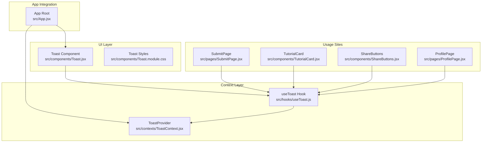
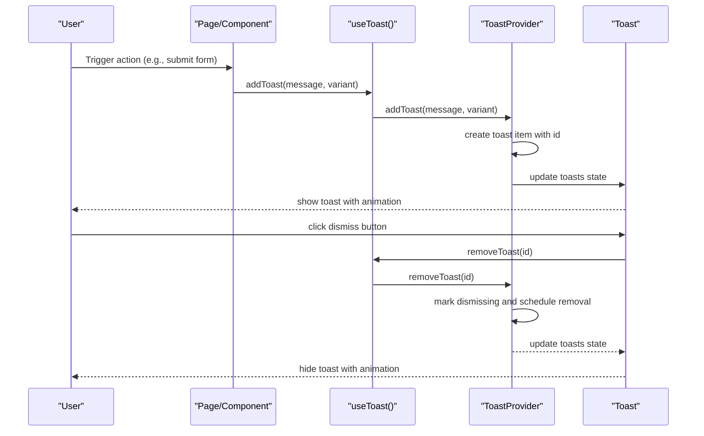
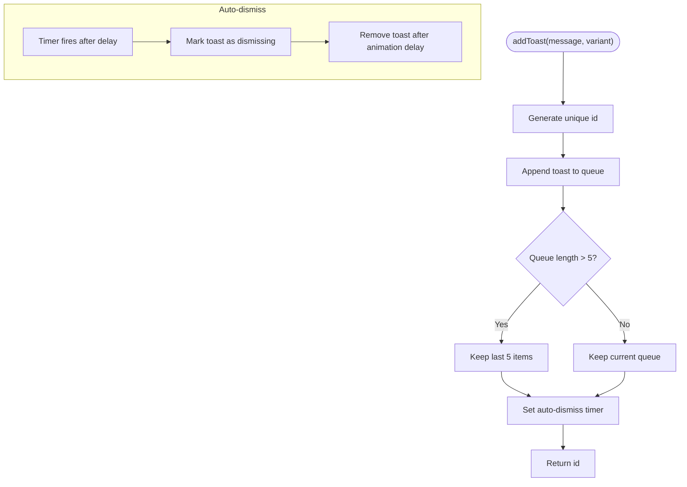
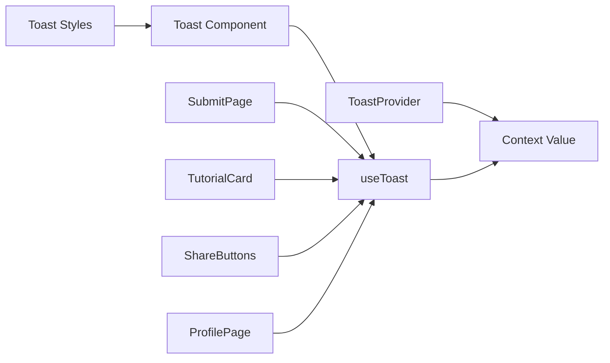

# Toast Notification Context

<cite>
**Referenced Files in This Document**
- [ToastContext.jsx](file://src/contexts/ToastContext.jsx)
- [useToast.js](file://src/hooks/useToast.js)
- [Toast.jsx](file://src/components/Toast.jsx)
- [Toast.module.css](file://src/components/Toast.module.css)
- [App.jsx](file://src/App.jsx)
- [SubmitPage.jsx](file://src/pages/SubmitPage.jsx)
- [TutorialCard.jsx](file://src/components/TutorialCard.jsx)
- [ShareButtons.jsx](file://src/components/ShareButtons.jsx)
- [ProfilePage.jsx](file://src/pages/ProfilePage.jsx)
- [TutorialDetailPage.jsx](file://src/pages/TutorialDetailPage.jsx)
- [ErrorBoundary.jsx](file://src/components/ErrorBoundary.jsx)
</cite>

## Table of Contents
1. [Introduction](#introduction)
2. [Project Structure](#project-structure)
3. [Core Components](#core-components)
4. [Architecture Overview](#architecture-overview)
5. [Detailed Component Analysis](#detailed-component-analysis)
6. [Dependency Analysis](#dependency-analysis)
7. [Performance Considerations](#performance-considerations)
8. [Troubleshooting Guide](#troubleshooting-guide)
9. [Conclusion](#conclusion)

## Introduction
This document explains the ToastContext system that manages user notifications and feedback across the GameDev Hub application. It covers the Provider Pattern implementation for toast notification management, including notification queuing, auto-dismiss functionality, and user-triggered dismissal. It documents toast notification types (success, error, warning, info), positioning strategies, and timing configurations. It also details the integration with the useToast custom hook for consuming toast functionality in components, notification state management, and cleanup procedures for memory efficiency. Practical usage examples are included for authentication flows, form submissions, tutorial interactions, and error scenarios. Accessibility considerations, screen reader compatibility, and keyboard navigation are addressed.

## Project Structure
The toast system is composed of:
- A context provider that holds the toast state and exposes add/remove functions
- A consumer component that renders toasts and handles dismissal
- A custom hook that provides access to the context
- Global integration via the main App component
- Usage across multiple pages and components for user feedback

**Diagram sources**
- [App.jsx:21-48](file://src/App.jsx#L21-L48)
- [ToastContext.jsx:5-50](file://src/contexts/ToastContext.jsx#L5-L50)
- [useToast.js:4-10](file://src/hooks/useToast.js#L4-L10)
- [Toast.jsx:5-31](file://src/components/Toast.jsx#L5-L31)
- [SubmitPage.jsx:10-173](file://src/pages/SubmitPage.jsx#L10-L173)
- [TutorialCard.jsx:14-37](file://src/components/TutorialCard.jsx#L14-L37)
- [ShareButtons.jsx:6-26](file://src/components/ShareButtons.jsx#L6-L26)
- [ProfilePage.jsx:15-206](file://src/pages/ProfilePage.jsx#L15-L206)

**Section sources**
- [App.jsx:21-48](file://src/App.jsx#L21-L48)
- [ToastContext.jsx:5-50](file://src/contexts/ToastContext.jsx#L5-L50)
- [useToast.js:4-10](file://src/hooks/useToast.js#L4-L10)
- [Toast.jsx:5-31](file://src/components/Toast.jsx#L5-L31)

## Core Components
- ToastProvider: Manages the toast queue, auto-dismiss timers, and removal with animations. It ensures cleanup of timers on unmount.
- useToast: A custom hook that enforces proper usage within a ToastProvider and returns the context value.
- Toast Component: Renders the current toasts, applies variant-specific styling, and supports manual dismissal.
- Toast Styles: Defines positioning, variants, and animations for toasts.

Key behaviors:
- Queuing: New toasts are appended; the queue is capped at five items.
- Auto-dismiss: Each toast dismisses automatically after a fixed delay.
- Manual dismissal: Users can click the close button to dismiss immediately.
- Animations: Smooth slide-in and slide-out transitions during dismissal.
- Cleanup: All timers are cleared when the provider unmounts.

**Section sources**
- [ToastContext.jsx:5-50](file://src/contexts/ToastContext.jsx#L5-L50)
- [useToast.js:4-10](file://src/hooks/useToast.js#L4-L10)
- [Toast.jsx:5-31](file://src/components/Toast.jsx#L5-L31)
- [Toast.module.css:12-98](file://src/components/Toast.module.css#L12-L98)

## Architecture Overview
The toast system follows the Provider Pattern:
- App wraps the routing tree with ToastProvider.
- Components consume toasts via useToast.
- Toast renders toasts at a fixed position in the viewport.

**Diagram sources**
- [App.jsx:27-44](file://src/App.jsx#L27-L44)
- [ToastContext.jsx:27-40](file://src/contexts/ToastContext.jsx#L27-L40)
- [Toast.jsx:10-28](file://src/components/Toast.jsx#L10-L28)

## Detailed Component Analysis

### ToastProvider
Responsibilities:
- Maintains an array of active toasts.
- Generates unique IDs for each toast.
- Schedules auto-dismiss timers per toast.
- Supports manual dismissal with a two-phase animation (set dismissing, then remove after animation completes).
- Cleans up timers on unmount to prevent memory leaks.

Implementation highlights:
- Uses a ref to store timeout IDs keyed by toast ID to support multiple concurrent timers.
- Limits the queue to the most recent five items.
- Exposes addToast and removeToast via a memoized context value.

**Diagram sources**
- [ToastContext.jsx:27-40](file://src/contexts/ToastContext.jsx#L27-L40)

**Section sources**
- [ToastContext.jsx:5-50](file://src/contexts/ToastContext.jsx#L5-L50)

### useToast Hook
Responsibilities:
- Returns the current context value from ToastContext.
- Throws a descriptive error if used outside a ToastProvider.

Usage pattern:
- Destructure addToast and removeToast from the returned context.
- Call addToast with a message and optional variant.
- Optionally pass the returned id to removeToast for programmatic dismissal.

**Section sources**
- [useToast.js:4-10](file://src/hooks/useToast.js#L4-L10)

### Toast Component
Responsibilities:
- Reads the current toasts and removeToast from useToast.
- Renders toasts in a fixed container positioned at the bottom-right.
- Applies variant-specific classes and a dismissing animation class when appropriate.
- Provides a dismiss button with accessible labeling.

Accessibility and UX:
- Uses aria-live to announce messages to assistive technologies.
- Dismiss button has an aria-label for screen readers.
- Pointer events are disabled on the container and enabled on individual toasts and buttons for interaction.

Positioning and responsiveness:
- Fixed bottom-right with z-index and gap spacing.
- Mobile-friendly adjustments for smaller screens.

**Section sources**
- [Toast.jsx:5-31](file://src/components/Toast.jsx#L5-L31)
- [Toast.module.css:12-98](file://src/components/Toast.module.css#L12-L98)

### Toast Variants and Timing
Variants:
- success: Used for positive actions (e.g., submission success, bookmark toggles).
- info: Used for informational feedback (e.g., copy-to-clipboard).
- error: Not directly exposed by the current provider; use caution when passing unsupported variants.
- warning: Not directly exposed by the current provider; use caution when passing unsupported variants.
- info is applied by default when no variant is specified.

Timing:
- Auto-dismiss delay: A fixed period after which toasts are dismissed automatically.
- Dismiss animation duration: A short animation completes before removing the toast from the DOM.

Positioning:
- Container is fixed at the bottom-right with a z-index suitable for overlays.
- Flex direction stacks items with the newest at the top (column-reverse).

**Section sources**
- [ToastContext.jsx:27-40](file://src/contexts/ToastContext.jsx#L27-L40)
- [Toast.module.css:12-98](file://src/components/Toast.module.css#L12-L98)

### Integration with App and Error Boundaries
- App integrates Toast as a sibling to the main content area, ensuring toasts overlay the page content.
- ErrorBoundary wraps the route rendering to catch runtime errors; while it does not directly emit toasts, it complements the toast system by surfacing errors to users and logging them.

**Section sources**
- [App.jsx:27-44](file://src/App.jsx#L27-L44)
- [ErrorBoundary.jsx:6-58](file://src/components/ErrorBoundary.jsx#L6-L58)

### Practical Usage Examples

#### Authentication Flows
- Login and Registration pages manage local form validation and error display. While they do not directly call addToast, the toast system is available via useToast for success or informational feedback if integrated later.

**Section sources**
- [SubmitPage.jsx:19-39](file://src/pages/LoginPage.jsx#L19-L39)
- [SubmitPage.jsx:21-67](file://src/pages/RegisterPage.jsx#L21-L67)

#### Form Submissions
- SubmitPage uses addToast to confirm successful tutorial submissions with a success variant.

**Section sources**
- [SubmitPage.jsx:159-160](file://src/pages/SubmitPage.jsx#L159-L160)

#### Tutorial Interactions
- TutorialCard triggers addToast for bookmark toggles with a success variant.
- TutorialDetailPage uses addToast for saving ratings, posting reviews, and managing bookmarks with success and info variants.

**Section sources**
- [TutorialCard.jsx:35-36](file://src/components/TutorialCard.jsx#L35-L36)
- [TutorialDetailPage.jsx:113-113](file://src/pages/TutorialDetailPage.jsx#L113-L113)
- [TutorialDetailPage.jsx:120-120](file://src/pages/TutorialDetailPage.jsx#L120-L120)
- [TutorialDetailPage.jsx:130-130](file://src/pages/TutorialDetailPage.jsx#L130-L130)

#### Sharing Actions
- ShareButtons uses addToast to inform users when a link is copied to the clipboard with an info variant.

**Section sources**
- [ShareButtons.jsx:13-26](file://src/components/ShareButtons.jsx#L13-L26)

#### Profile Management
- ProfilePage uses addToast for confirming deletion, updates, and unfollow actions with success and info variants.

**Section sources**
- [ProfilePage.jsx:59-64](file://src/pages/ProfilePage.jsx#L59-L64)
- [ProfilePage.jsx:114-131](file://src/pages/ProfilePage.jsx#L114-L131)
- [ProfilePage.jsx:204-206](file://src/pages/ProfilePage.jsx#L204-L206)

## Dependency Analysis
The toast system exhibits low coupling and clear separation of concerns:
- ToastProvider depends only on React state and refs.
- useToast depends only on React context.
- Toast depends on useToast and styles.
- Pages and components depend on useToast to emit notifications.

**Diagram sources**
- [ToastContext.jsx:42-45](file://src/contexts/ToastContext.jsx#L42-L45)
- [useToast.js:4-10](file://src/hooks/useToast.js#L4-L10)
- [Toast.jsx:5-31](file://src/components/Toast.jsx#L5-L31)
- [SubmitPage.jsx:10-173](file://src/pages/SubmitPage.jsx#L10-L173)
- [TutorialCard.jsx:14-37](file://src/components/TutorialCard.jsx#L14-L37)
- [ShareButtons.jsx:6-26](file://src/components/ShareButtons.jsx#L6-L26)
- [ProfilePage.jsx:15-206](file://src/pages/ProfilePage.jsx#L15-L206)

**Section sources**
- [ToastContext.jsx:42-45](file://src/contexts/ToastContext.jsx#L42-L45)
- [useToast.js:4-10](file://src/hooks/useToast.js#L4-L10)
- [Toast.jsx:5-31](file://src/components/Toast.jsx#L5-L31)

## Performance Considerations
- Queue cap: The provider limits the number of active toasts to five, preventing excessive DOM nodes and memory growth.
- Timers: Each toast creates two timers (auto-dismiss and removal). The provider clears all timers on unmount to avoid leaks.
- Rendering: The Toast component re-renders only when the toasts array changes, minimizing unnecessary work.
- Animations: CSS transitions are hardware-accelerated where supported, keeping UI responsive.

[No sources needed since this section provides general guidance]

## Troubleshooting Guide
Common issues and resolutions:
- Using useToast outside ToastProvider: The hook throws an error. Ensure the component tree is wrapped with ToastProvider.
- Toasts not disappearing: Verify that auto-dismiss timers are not being blocked by long-running operations. Confirm that removeToast is called on user dismissal.
- Memory leaks: Ensure the provider is mounted for the app lifetime and relies on React's automatic cleanup of timers on unmount.
- Accessibility: Confirm that aria-live is present on the container and dismiss buttons have aria-label attributes.

**Section sources**
- [useToast.js:6-8](file://src/hooks/useToast.js#L6-L8)
- [Toast.jsx:11-26](file://src/components/Toast.jsx#L11-L26)

## Conclusion
The ToastContext system provides a concise, efficient mechanism for delivering user feedback across the GameDev Hub application. Its Provider Pattern implementation cleanly separates state management from presentation, supports both automatic and manual dismissal, and integrates seamlessly with existing components and pages. With thoughtful variant usage, consistent timing, and robust accessibility features, the system enhances usability while maintaining performance and reliability.