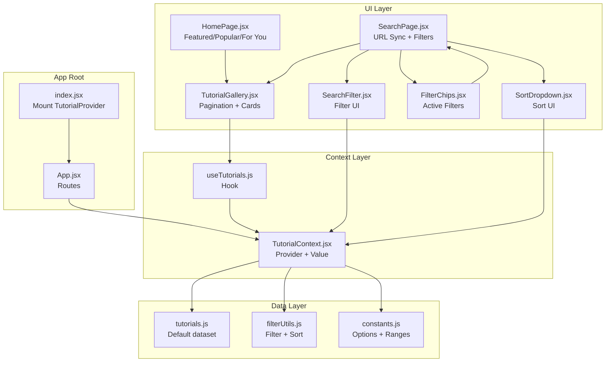
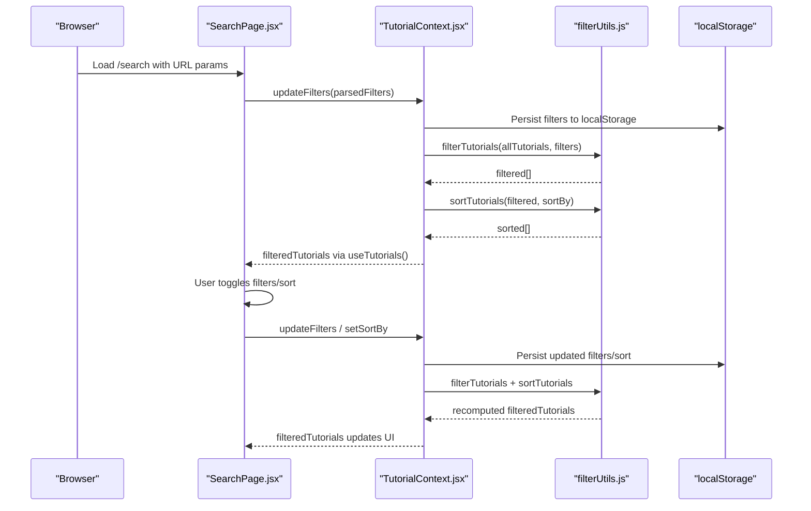
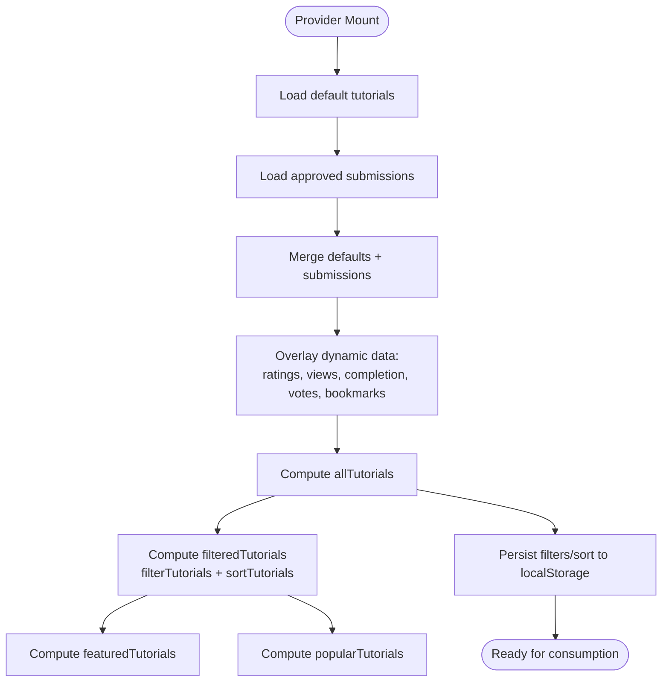
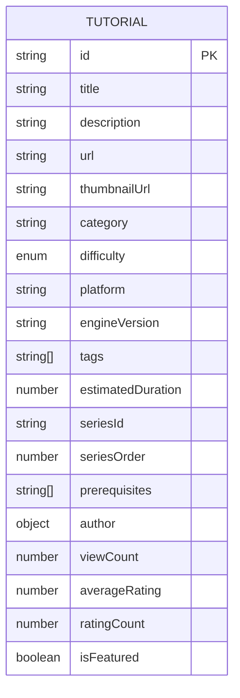
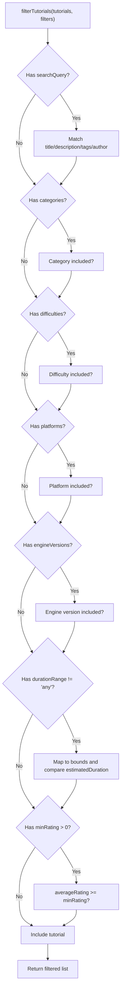
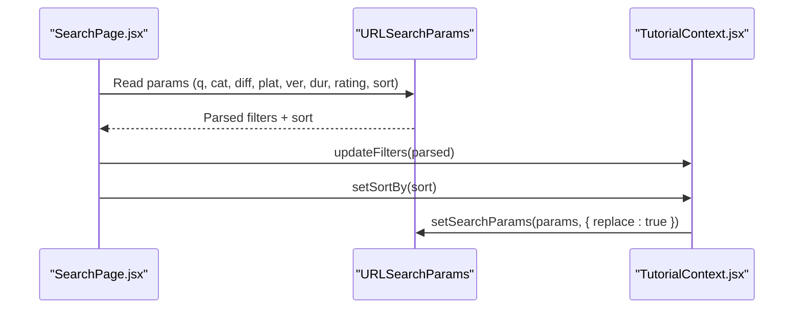
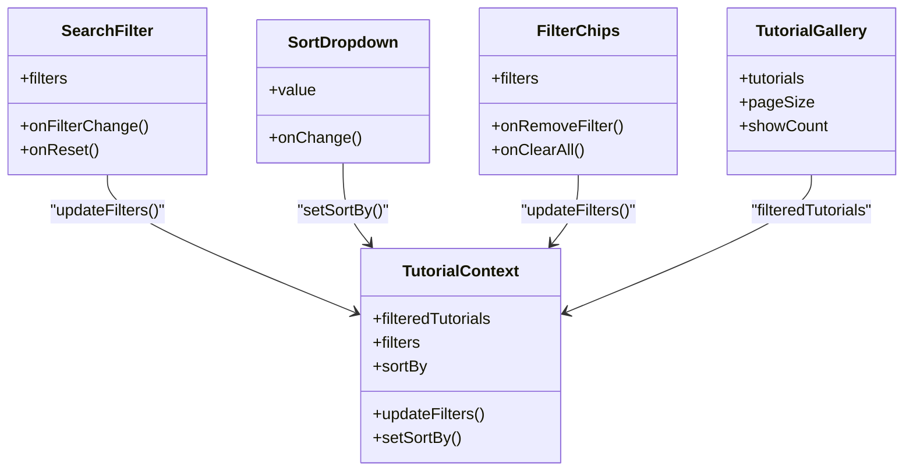
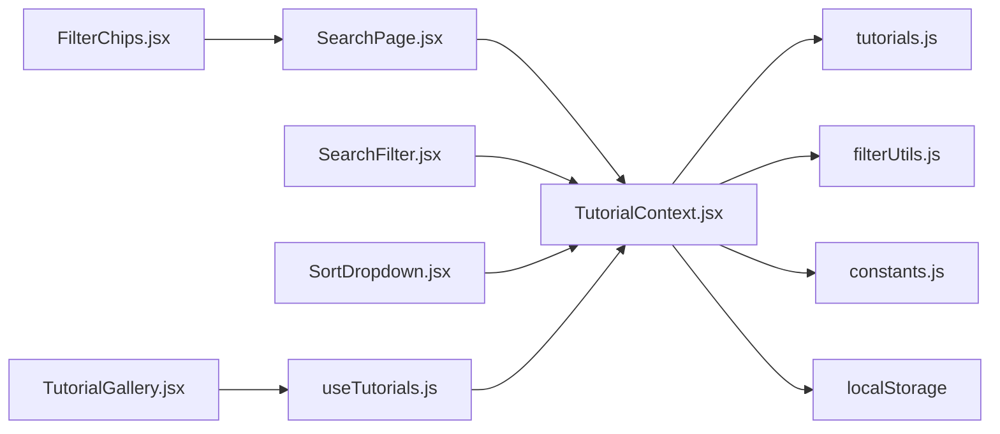

# Tutorial Context

<cite>
**Referenced Files in This Document**
- [TutorialContext.jsx](file://src/contexts/TutorialContext.jsx)
- [tutorials.js](file://src/data/tutorials.js)
- [filterUtils.js](file://src/utils/filterUtils.js)
- [useTutorials.js](file://src/hooks/useTutorials.js)
- [constants.js](file://src/data/constants.js)
- [propTypeShapes.js](file://src/utils/propTypeShapes.js)
- [SearchFilter.jsx](file://src/components/SearchFilter.jsx)
- [SortDropdown.jsx](file://src/components/SortDropdown.jsx)
- [FilterChips.jsx](file://src/components/FilterChips.jsx)
- [TutorialGallery.jsx](file://src/components/TutorialGallery.jsx)
- [SearchPage.jsx](file://src/pages/SearchPage.jsx)
- [HomePage.jsx](file://src/pages/HomePage.jsx)
- [index.jsx](file://src/index.jsx)
- [App.jsx](file://src/App.jsx)
</cite>

## Table of Contents
1. [Introduction](#introduction)
2. [Project Structure](#project-structure)
3. [Core Components](#core-components)
4. [Architecture Overview](#architecture-overview)
5. [Detailed Component Analysis](#detailed-component-analysis)
6. [Dependency Analysis](#dependency-analysis)
7. [Performance Considerations](#performance-considerations)
8. [Troubleshooting Guide](#troubleshooting-guide)
9. [Conclusion](#conclusion)

## Introduction
This document explains the TutorialContext system that powers tutorial discovery and management in the GameDev Hub application. It covers the Provider Pattern implementation, initial dataset loading, filtering and sorting logic, URL synchronization for persistent filter state, and real-time updates that drive component re-renders. It also documents the tutorial data model, advanced filtering via filterUtils, localStorage persistence for user preferences, and practical usage patterns in gallery components, search, and pagination.

## Project Structure
The TutorialContext lives under the contexts folder and integrates with data, utilities, components, and pages across the app. The provider is mounted at the application root so all pages and components can consume tutorial state.

**Diagram sources**
- [index.jsx:12-24](file://src/index.jsx#L12-L24)
- [App.jsx:21-48](file://src/App.jsx#L21-L48)
- [TutorialContext.jsx:18-542](file://src/contexts/TutorialContext.jsx#L18-L542)
- [tutorials.js:1-522](file://src/data/tutorials.js#L1-L522)
- [filterUtils.js:1-99](file://src/utils/filterUtils.js#L1-L99)
- [constants.js:1-71](file://src/data/constants.js#L1-L71)
- [SearchPage.jsx:12-141](file://src/pages/SearchPage.jsx#L12-L141)
- [SearchFilter.jsx:19-237](file://src/components/SearchFilter.jsx#L19-L237)
- [SortDropdown.jsx:6-29](file://src/components/SortDropdown.jsx#L6-L29)
- [FilterChips.jsx:6-76](file://src/components/FilterChips.jsx#L6-L76)
- [TutorialGallery.jsx:23-138](file://src/components/TutorialGallery.jsx#L23-L138)
- [HomePage.jsx:9-95](file://src/pages/HomePage.jsx#L9-L95)

**Section sources**
- [index.jsx:12-24](file://src/index.jsx#L12-L24)
- [App.jsx:21-48](file://src/App.jsx#L21-L48)

## Core Components
- TutorialContext provider initializes and exposes:
  - Tutorial datasets: allTutorials, filteredTutorials, featuredTutorials, popularTutorials
  - Filters and sort: filters, sortBy, updateFilters, resetFilters, setSortBy
  - Helper methods: getTutorialById, getTutorialsByCategory
  - User-centric features: ratings, reviews, bookmarks, submissions, view log, completion tracking, review voting, freshness voting, followed tags
  - For You recommendations based on followed tags
- filterUtils provides filtering and sorting logic used by the context
- SearchPage coordinates URL synchronization with context filters and sort
- UI components (SearchFilter, SortDropdown, FilterChips, TutorialGallery) consume context via useTutorials hook

**Section sources**
- [TutorialContext.jsx:18-542](file://src/contexts/TutorialContext.jsx#L18-L542)
- [filterUtils.js:1-99](file://src/utils/filterUtils.js#L1-L99)
- [SearchPage.jsx:12-141](file://src/pages/SearchPage.jsx#L12-L141)

## Architecture Overview
The TutorialContext follows a Provider Pattern:
- Provider reads defaults from tutorials.js and overlays dynamic data from localStorage
- Computes derived datasets (filtered, featured, popular) via memoized computations
- Exposes a value object consumed by components via useTutorials hook
- SearchPage reads URL params and writes back to context, keeping URL and state synchronized

**Diagram sources**
- [SearchPage.jsx:25-81](file://src/pages/SearchPage.jsx#L25-L81)
- [TutorialContext.jsx:67-71](file://src/contexts/TutorialContext.jsx#L67-L71)
- [filterUtils.js:1-99](file://src/utils/filterUtils.js#L1-L99)

## Detailed Component Analysis

### TutorialContext Provider
- Initial dataset loading:
  - Loads default tutorials from tutorials.js
  - Merges with approved submissions and overlays dynamic data (ratings, views, completion, votes, bookmarks)
- Derived computations:
  - allTutorials: computed from defaults + submissions + dynamic overlays
  - filteredTutorials: filterTutorials(allTutorials, filters) then sortTutorials(...)
  - featuredTutorials: tutorials where isFeatured is true
  - popularTutorials: top 8 by viewCount
- State and persistence:
  - Filters and sort persisted to localStorage keys: kaz_filters, kaz_sort
  - Ratings, reviews, bookmarks, submissions, view logs, completion, review votes, freshness votes, followed tags persisted separately
- Filtering and sorting:
  - Uses filterTutorials and sortTutorials from filterUtils
- URL synchronization:
  - SearchPage reads URL params and pushes into context
  - Context writes back to URL via useSearchParams

**Diagram sources**
- [TutorialContext.jsx:37-81](file://src/contexts/TutorialContext.jsx#L37-L81)
- [TutorialContext.jsx:67-81](file://src/contexts/TutorialContext.jsx#L67-L81)
- [filterUtils.js:1-99](file://src/utils/filterUtils.js#L1-L99)

**Section sources**
- [TutorialContext.jsx:18-542](file://src/contexts/TutorialContext.jsx#L18-L542)

### Tutorial Data Model
- Base tutorial fields include identifiers, metadata, author, counts, flags, and categorization
- Extended fields from dynamic overlays:
  - averageRating, ratingCount, viewCount
- Constants define categories, difficulties, platforms, engine versions, and sort options

**Diagram sources**
- [propTypeShapes.js:3-26](file://src/utils/propTypeShapes.js#L3-L26)
- [constants.js:1-71](file://src/data/constants.js#L1-L71)

**Section sources**
- [propTypeShapes.js:3-26](file://src/utils/propTypeShapes.js#L3-L26)
- [constants.js:1-71](file://src/data/constants.js#L1-L71)

### Filtering Mechanisms
- filterTutorials applies:
  - Text search across title, description, tags, and author
  - Category, difficulty, platform, engine version inclusion
  - Duration range bounds
  - Minimum rating threshold
- Duration ranges are mapped to min/max bounds
- Active filter count helper supports UI feedback

**Diagram sources**
- [filterUtils.js:1-60](file://src/utils/filterUtils.js#L1-L60)
- [filterUtils.js:62-70](file://src/utils/filterUtils.js#L62-L70)

**Section sources**
- [filterUtils.js:1-99](file://src/utils/filterUtils.js#L1-L99)

### Sorting Algorithms
- sortTutorials supports:
  - Newest (by createdAt)
  - Popular/Most Viewed (by viewCount)
  - Highest Rated (by averageRating)
- Defaults to returning the list unchanged

**Section sources**
- [filterUtils.js:72-86](file://src/utils/filterUtils.js#L72-L86)

### URL Synchronization
- SearchPage reads URL params on mount and updates context filters and sort
- On subsequent changes, it writes back to URL using useSearchParams
- Maintains a small initialization guard to avoid premature writes

**Diagram sources**
- [SearchPage.jsx:25-81](file://src/pages/SearchPage.jsx#L25-L81)

**Section sources**
- [SearchPage.jsx:25-81](file://src/pages/SearchPage.jsx#L25-L81)

### Integration with Filter UI and Gallery
- SearchFilter.jsx controls filters and persists recent searches to localStorage
- SortDropdown.jsx controls sortBy
- FilterChips.jsx displays active filters and supports removal/clear-all
- TutorialGallery.jsx handles pagination and renders cards

**Diagram sources**
- [SearchFilter.jsx:19-237](file://src/components/SearchFilter.jsx#L19-L237)
- [SortDropdown.jsx:6-29](file://src/components/SortDropdown.jsx#L6-L29)
- [FilterChips.jsx:6-76](file://src/components/FilterChips.jsx#L6-L76)
- [TutorialGallery.jsx:23-138](file://src/components/TutorialGallery.jsx#L23-L138)
- [TutorialContext.jsx:453-536](file://src/contexts/TutorialContext.jsx#L453-L536)

**Section sources**
- [SearchFilter.jsx:19-237](file://src/components/SearchFilter.jsx#L19-L237)
- [SortDropdown.jsx:6-29](file://src/components/SortDropdown.jsx#L6-L29)
- [FilterChips.jsx:6-76](file://src/components/FilterChips.jsx#L6-L76)
- [TutorialGallery.jsx:23-138](file://src/components/TutorialGallery.jsx#L23-L138)

### State Consumption in Pages
- HomePage.jsx consumes featuredTutorials, popularTutorials, allTutorials, and getForYouTutorials for authenticated users
- SearchPage.jsx consumes filteredTutorials, filters, sortBy, and provides UI to adjust them

**Section sources**
- [HomePage.jsx:9-95](file://src/pages/HomePage.jsx#L9-L95)
- [SearchPage.jsx:12-141](file://src/pages/SearchPage.jsx#L12-L141)

## Dependency Analysis
- Provider dependencies:
  - tutorials.js for default dataset
  - filterUtils.js for filtering and sorting
  - constants.js for option lists and ranges
  - useLocalStorage hook for persistence
- UI dependencies:
  - SearchFilter, SortDropdown, FilterChips, TutorialGallery depend on useTutorials hook
  - SearchPage orchestrates URL sync and passes props to UI components

**Diagram sources**
- [TutorialContext.jsx:18-542](file://src/contexts/TutorialContext.jsx#L18-L542)
- [tutorials.js:1-522](file://src/data/tutorials.js#L1-L522)
- [filterUtils.js:1-99](file://src/utils/filterUtils.js#L1-L99)
- [constants.js:1-71](file://src/data/constants.js#L1-L71)
- [SearchPage.jsx:12-141](file://src/pages/SearchPage.jsx#L12-L141)
- [SearchFilter.jsx:19-237](file://src/components/SearchFilter.jsx#L19-L237)
- [SortDropdown.jsx:6-29](file://src/components/SortDropdown.jsx#L6-L29)
- [FilterChips.jsx:6-76](file://src/components/FilterChips.jsx#L6-L76)
- [TutorialGallery.jsx:23-138](file://src/components/TutorialGallery.jsx#L23-L138)
- [useTutorials.js:4-10](file://src/hooks/useTutorials.js#L4-L10)

**Section sources**
- [TutorialContext.jsx:18-542](file://src/contexts/TutorialContext.jsx#L18-L542)
- [SearchPage.jsx:12-141](file://src/pages/SearchPage.jsx#L12-L141)

## Performance Considerations
- Memoization:
  - allTutorials computed via useMemo to avoid recomputation when submissions/ratings/viewLog change
  - filteredTutorials computed via useMemo to avoid recomputation when filters/sort change
  - featuredTutorials and popularTutorials computed via useMemo
- Selective re-rendering:
  - useTutorials hook returns a memoized value object; components consuming it will re-render only when referenced fields change
- Sorting and filtering:
  - filterTutorials and sortTutorials operate on arrays; keep datasets reasonably sized for smooth UX
- Pagination:
  - TutorialGallery slices arrays for display; consider virtualization for very large lists

[No sources needed since this section provides general guidance]

## Troubleshooting Guide
- useTutorials must be used within TutorialProvider:
  - The hook throws if context is missing, indicating provider not mounted
- URL sync anomalies:
  - Ensure SearchPage initializes before writing to URL; the component uses a ref flag to avoid premature writes
- Filter state resets unexpectedly:
  - Verify localStorage keys are accessible and not cleared by browser settings
- Empty results:
  - Confirm filters are not overly restrictive; use FilterChips to remove specific filters or reset

**Section sources**
- [useTutorials.js:4-10](file://src/hooks/useTutorials.js#L4-L10)
- [SearchPage.jsx:52-57](file://src/pages/SearchPage.jsx#L52-L57)

## Conclusion
The TutorialContext system centralizes tutorial data state, integrates filtering and sorting logic, and maintains persistent user preferences and URL state. Its Provider Pattern design enables predictable, scalable state management across the application, while memoization and selective re-rendering optimize performance. The combination of UI components and URL synchronization delivers a seamless, stateful tutorial browsing experience.