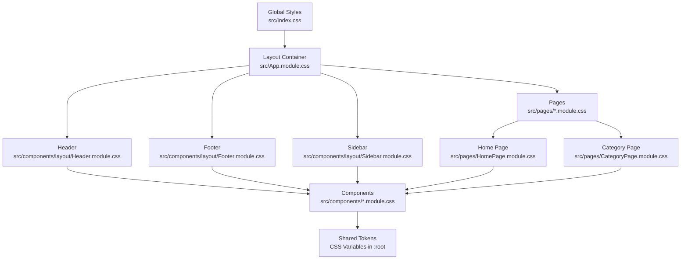
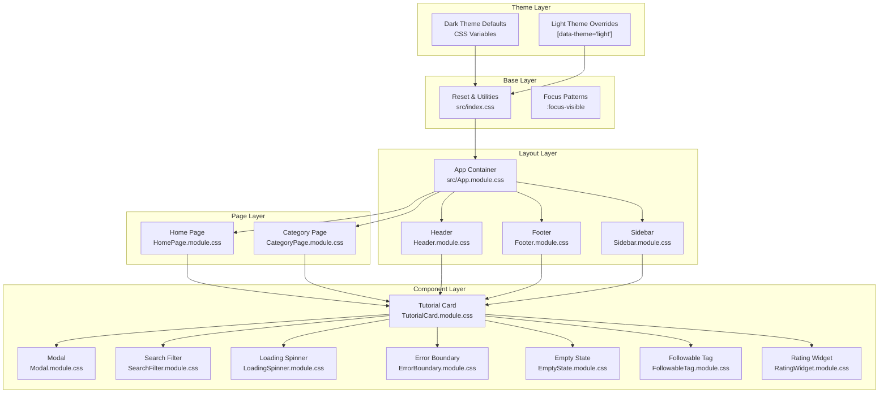
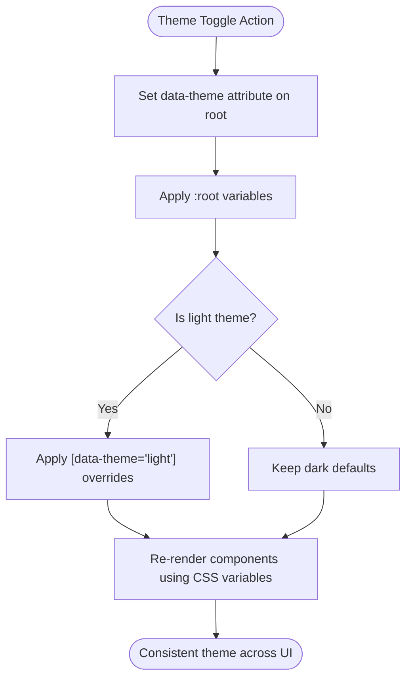
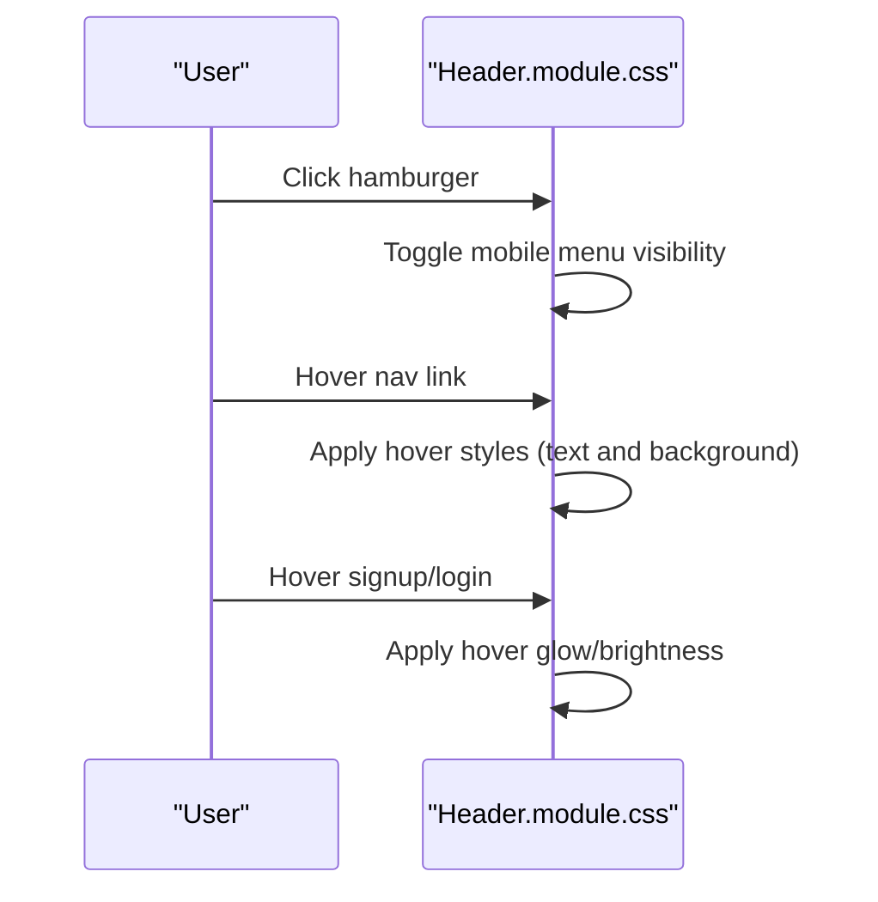
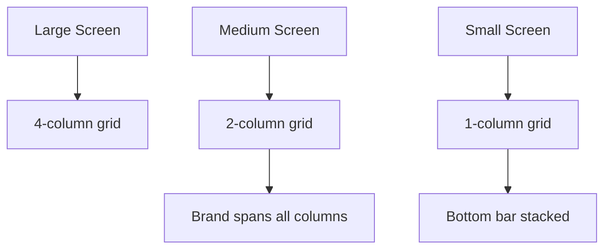
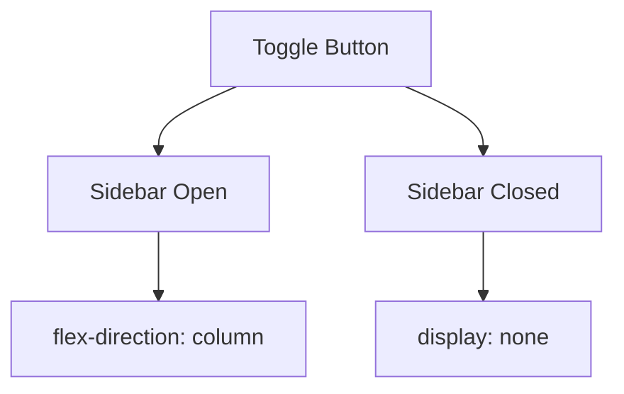
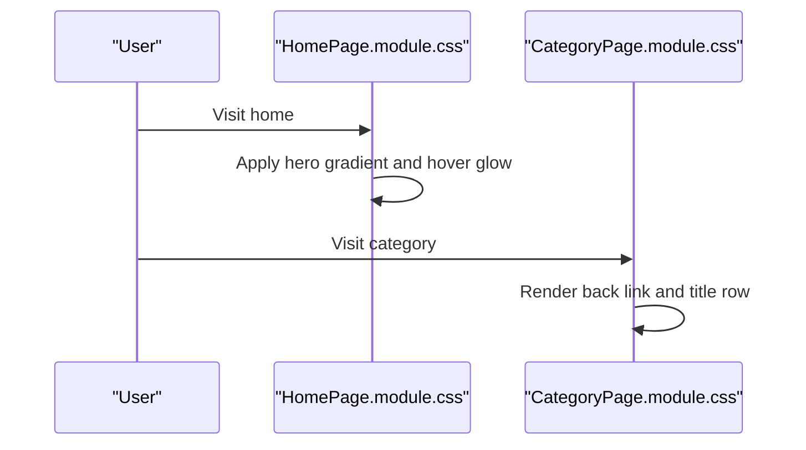
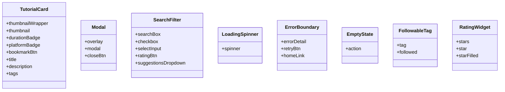
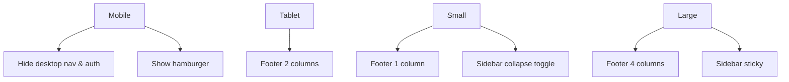
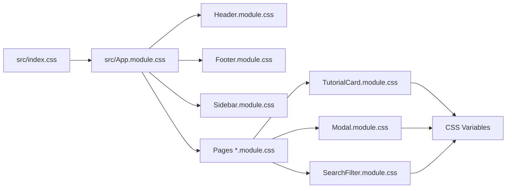

# Styling Architecture

<cite>
**Referenced Files in This Document**
- [index.css](file://src/index.css)
- [App.module.css](file://src/App.module.css)
- [Header.module.css](file://src/components/layout/Header.module.css)
- [Footer.module.css](file://src/components/layout/Footer.module.css)
- [Sidebar.module.css](file://src/components/layout/Sidebar.module.css)
- [HomePage.module.css](file://src/pages/HomePage.module.css)
- [CategoryPage.module.css](file://src/pages/CategoryPage.module.css)
- [TutorialCard.module.css](file://src/components/TutorialCard.module.css)
- [Modal.module.css](file://src/components/Modal.module.css)
- [SearchFilter.module.css](file://src/components/SearchFilter.module.css)
- [LoadingSpinner.module.css](file://src/components/LoadingSpinner.module.css)
- [ErrorBoundary.module.css](file://src/components/ErrorBoundary.module.css)
- [EmptyState.module.css](file://src/components/EmptyState.module.css)
- [FollowableTag.module.css](file://src/components/FollowableTag.module.css)
- [RatingWidget.module.css](file://src/components/RatingWidget.module.css)
- [constants.js](file://src/data/constants.js)
</cite>

## Table of Contents
1. [Introduction](#introduction)
2. [Project Structure](#project-structure)
3. [Core Components](#core-components)
4. [Architecture Overview](#architecture-overview)
5. [Detailed Component Analysis](#detailed-component-analysis)
6. [Dependency Analysis](#dependency-analysis)
7. [Performance Considerations](#performance-considerations)
8. [Troubleshooting Guide](#troubleshooting-guide)
9. [Conclusion](#conclusion)
10. [Appendices](#appendices)

## Introduction
This document describes GameDev Hub’s styling architecture and design system. It explains how CSS Modules are used for scoped styling, component-specific stylesheets, and composition patterns. It documents the design system including the dark theme with electric blue and purple accents, typography using Inter, Space Grotesk, and JetBrains Mono, and CSS custom properties for theme variables. It also covers responsive design (mobile-first), adaptive grid layouts, layout styling for Header, Footer, and Sidebar, component styling patterns (hover/focus/interactions), accessibility (focus-visible, contrast, keyboard indicators), theme toggling, and best practices for maintainability.

## Project Structure
The styling system is organized around:
- Global base styles and theme variables in a single global stylesheet
- Application-wide layout container styles via a module stylesheet
- Component-specific CSS Modules for scoped styles
- Page-level module styles for layout containers and page-specific visuals
- Shared design tokens referenced across components

**Diagram sources**
- [index.css:1-192](file://src/index.css#L1-L192)
- [App.module.css:1-10](file://src/App.module.css#L1-L10)
- [Header.module.css:1-189](file://src/components/layout/Header.module.css#L1-L189)
- [Footer.module.css:1-114](file://src/components/layout/Footer.module.css#L1-L114)
- [Sidebar.module.css:1-59](file://src/components/layout/Sidebar.module.css#L1-L59)
- [HomePage.module.css:1-186](file://src/pages/HomePage.module.css#L1-L186)
- [CategoryPage.module.css:1-48](file://src/pages/CategoryPage.module.css#L1-L48)

**Section sources**
- [index.css:1-192](file://src/index.css#L1-L192)
- [App.module.css:1-10](file://src/App.module.css#L1-L10)

## Core Components
- Global theme variables and light/dark theme switching via a data attribute on the root element
- Base resets, typography, focus-visible, and utility classes
- Layout container with flex column and main area expansion
- Header with logo, navigation, auth buttons, and mobile menu
- Footer with grid-based sections and responsive columns
- Sidebar with sticky positioning and collapsible content on smaller screens
- Page containers for content areas and hero sections
- Component-specific modules for cards, modals, filters, spinners, empty/error states, tags, and rating widgets

Key design system elements:
- Color palette: primary and secondary accents (electric blue and purple), neutral backgrounds, borders, and text scales
- Typography: Inter for body, Space Grotesk for display, JetBrains Mono for mono content
- Spacing scale, radius scale, shadows, and transitions
- Focus-visible patterns and accessible hover/focus states

**Section sources**
- [index.css:8-75](file://src/index.css#L8-L75)
- [index.css:77-97](file://src/index.css#L77-L97)
- [index.css:104-144](file://src/index.css#L104-L144)
- [index.css:136-139](file://src/index.css#L136-L139)
- [App.module.css:1-10](file://src/App.module.css#L1-L10)
- [Header.module.css:1-189](file://src/components/layout/Header.module.css#L1-L189)
- [Footer.module.css:1-114](file://src/components/layout/Footer.module.css#L1-L114)
- [Sidebar.module.css:1-59](file://src/components/layout/Sidebar.module.css#L1-L59)
- [HomePage.module.css:1-186](file://src/pages/HomePage.module.css#L1-L186)
- [CategoryPage.module.css:1-48](file://src/pages/CategoryPage.module.css#L1-L48)

## Architecture Overview
The styling architecture follows a layered approach:
- Global CSS variables define theme tokens and typography scales
- Light/dark theme is toggled by setting a data attribute on the root element
- Layout container ensures proper page stacking and spacing
- Components import their own module CSS for scoped styles
- Pages import module CSS for page-level containers and hero visuals
- Shared tokens are referenced via CSS variables for consistency

**Diagram sources**
- [index.css:8-97](file://src/index.css#L8-L97)
- [index.css:104-144](file://src/index.css#L104-L144)
- [App.module.css:1-10](file://src/App.module.css#L1-L10)
- [Header.module.css:1-189](file://src/components/layout/Header.module.css#L1-L189)
- [Footer.module.css:1-114](file://src/components/layout/Footer.module.css#L1-L114)
- [Sidebar.module.css:1-59](file://src/components/layout/Sidebar.module.css#L1-L59)
- [HomePage.module.css:1-186](file://src/pages/HomePage.module.css#L1-L186)
- [CategoryPage.module.css:1-48](file://src/pages/CategoryPage.module.css#L1-L48)
- [TutorialCard.module.css:1-244](file://src/components/TutorialCard.module.css#L1-L244)
- [Modal.module.css:1-79](file://src/components/Modal.module.css#L1-L79)
- [SearchFilter.module.css:1-239](file://src/components/SearchFilter.module.css#L1-L239)
- [LoadingSpinner.module.css:1-22](file://src/components/LoadingSpinner.module.css#L1-L22)
- [ErrorBoundary.module.css:1-83](file://src/components/ErrorBoundary.module.css#L1-L83)
- [EmptyState.module.css:1-44](file://src/components/EmptyState.module.css#L1-L44)
- [FollowableTag.module.css:1-40](file://src/components/FollowableTag.module.css#L1-L40)
- [RatingWidget.module.css:1-48](file://src/components/RatingWidget.module.css#L1-L48)

## Detailed Component Analysis

### Theme Variables and Dark/Light Switching
- CSS custom properties define color palettes, backgrounds, borders, text, spacing, typography, shadows, radii, and transitions
- Light theme overrides are applied under a selector targeting a data attribute on the root element
- Focus-visible outlines use accent colors for keyboard navigation visibility

**Diagram sources**
- [index.css:8-97](file://src/index.css#L8-L97)

**Section sources**
- [index.css:8-75](file://src/index.css#L8-L75)
- [index.css:77-97](file://src/index.css#L77-L97)
- [index.css:136-139](file://src/index.css#L136-L139)

### Header Styling and Responsive Behavior
- Sticky header with inner container constrained to a max width and centered horizontally
- Logo with gradient accent and display font
- Navigation links with hover and active states using accent dim backgrounds
- Auth buttons with hover glow and elevation
- Mobile hamburger menu and collapsible mobile menu with responsive link spacing

**Diagram sources**
- [Header.module.css:144-189](file://src/components/layout/Header.module.css#L144-L189)

**Section sources**
- [Header.module.css:1-189](file://src/components/layout/Header.module.css#L1-L189)

### Footer Styling and Adaptive Grid
- Footer grid with four columns on large screens, two on medium, and single column on small screens
- Brand section spans all columns on small screens
- Bottom bar adapts to stacked layout on small screens
- Links and social icons use hover accent transitions

**Diagram sources**
- [Footer.module.css:11-14](file://src/components/layout/Footer.module.css#L11-L14)
- [Footer.module.css:93-113](file://src/components/layout/Footer.module.css#L93-L113)

**Section sources**
- [Footer.module.css:1-114](file://src/components/layout/Footer.module.css#L1-L114)

### Sidebar Styling and Collapsible Content
- Fixed sidebar with sticky positioning and constrained height
- Toggle button appears on smaller screens to show/hide content
- Content collapses to a vertical stack when closed

**Diagram sources**
- [Sidebar.module.css:33-58](file://src/components/layout/Sidebar.module.css#L33-L58)

**Section sources**
- [Sidebar.module.css:1-59](file://src/components/layout/Sidebar.module.css#L1-L59)

### Page Containers: Home and Category
- Home page hero with gradient background and animated radial highlights, centered content, and action buttons with hover glow
- Categories grid with auto-fill columns and hover elevation
- Category page with back link, title row, and subtitle offset for icon alignment

**Diagram sources**
- [HomePage.module.css:1-186](file://src/pages/HomePage.module.css#L1-L186)
- [CategoryPage.module.css:1-48](file://src/pages/CategoryPage.module.css#L1-L48)

**Section sources**
- [HomePage.module.css:1-186](file://src/pages/HomePage.module.css#L1-L186)
- [CategoryPage.module.css:1-48](file://src/pages/CategoryPage.module.css#L1-L48)

### Component Styling Patterns
- Tutorial Card: thumbnail scaling on hover, platform and duration badges, bookmark button with hover/filled states, tag badges with mono font
- Modal: overlay backdrop blur, modal with slide-up animation, close button with focus-visible outline
- Search Filter: custom checkbox/radio with checked pseudo-elements, focus ring, suggestion dropdown with hover states
- Loading Spinner: rotating border with accent color
- Error Boundary: mono error detail block, retry/home actions with hover glow
- Empty State: centered layout with call-to-action button
- Followable Tag: follow/unfollow states with border and color transitions
- Rating Widget: star glyphs with filled and hover states, focus-visible outline

**Diagram sources**
- [TutorialCard.module.css:1-244](file://src/components/TutorialCard.module.css#L1-L244)
- [Modal.module.css:1-79](file://src/components/Modal.module.css#L1-L79)
- [SearchFilter.module.css:1-239](file://src/components/SearchFilter.module.css#L1-L239)
- [LoadingSpinner.module.css:1-22](file://src/components/LoadingSpinner.module.css#L1-L22)
- [ErrorBoundary.module.css:1-83](file://src/components/ErrorBoundary.module.css#L1-L83)
- [EmptyState.module.css:1-44](file://src/components/EmptyState.module.css#L1-L44)
- [FollowableTag.module.css:1-40](file://src/components/FollowableTag.module.css#L1-L40)
- [RatingWidget.module.css:1-48](file://src/components/RatingWidget.module.css#L1-L48)

**Section sources**
- [TutorialCard.module.css:1-244](file://src/components/TutorialCard.module.css#L1-L244)
- [Modal.module.css:1-79](file://src/components/Modal.module.css#L1-L79)
- [SearchFilter.module.css:1-239](file://src/components/SearchFilter.module.css#L1-L239)
- [LoadingSpinner.module.css:1-22](file://src/components/LoadingSpinner.module.css#L1-L22)
- [ErrorBoundary.module.css:1-83](file://src/components/ErrorBoundary.module.css#L1-L83)
- [EmptyState.module.css:1-44](file://src/components/EmptyState.module.css#L1-L44)
- [FollowableTag.module.css:1-40](file://src/components/FollowableTag.module.css#L1-L40)
- [RatingWidget.module.css:1-48](file://src/components/RatingWidget.module.css#L1-L48)

### Accessibility Considerations
- Focus-visible outlines for interactive elements using accent colors
- Sufficient contrast between text and backgrounds across themes
- Keyboard operability for modals, filters, and rating widgets
- Clear hover/focus states for links, buttons, and form controls
- Semantic use of focus-visible on buttons and stars

**Section sources**
- [index.css:136-139](file://src/index.css#L136-L139)
- [Modal.module.css:61-64](file://src/components/Modal.module.css#L61-L64)
- [SearchFilter.module.css:137-140](file://src/components/SearchFilter.module.css#L137-L140)
- [RatingWidget.module.css:25-29](file://src/components/RatingWidget.module.css#L25-L29)

### Responsive Design Approach
- Mobile-first breakpoints: hide desktop navigation and auth buttons below tablet width; show hamburger menu
- Footer grid reduces from four to two columns at medium breakpoint and to one column at small breakpoint
- Sidebar becomes collapsible and non-sticky below a larger breakpoint
- Home hero and categories adjust font sizes and grid column counts at smaller screens
- Category page title subtitle offset adapts to icon presence

**Diagram sources**
- [Header.module.css:165-189](file://src/components/layout/Header.module.css#L165-L189)
- [Footer.module.css:93-113](file://src/components/layout/Footer.module.css#L93-L113)
- [Sidebar.module.css:39-58](file://src/components/layout/Sidebar.module.css#L39-L58)
- [HomePage.module.css:158-185](file://src/pages/HomePage.module.css#L158-L185)
- [CategoryPage.module.css:32-47](file://src/pages/CategoryPage.module.css#L32-L47)

**Section sources**
- [Header.module.css:165-189](file://src/components/layout/Header.module.css#L165-L189)
- [Footer.module.css:93-113](file://src/components/layout/Footer.module.css#L93-L113)
- [Sidebar.module.css:39-58](file://src/components/layout/Sidebar.module.css#L39-L58)
- [HomePage.module.css:158-185](file://src/pages/HomePage.module.css#L158-L185)
- [CategoryPage.module.css:32-47](file://src/pages/CategoryPage.module.css#L32-L47)

### Design System Tokens and Composition
- Color palette: backgrounds, borders, text, and accent colors with dim variants for subtle highlighting
- Typography: Inter for body, Space Grotesk for headings, JetBrains Mono for code-like elements
- Spacing and radii scales for consistent rhythm
- Shadows and transitions for depth and feedback
- Components compose by referencing shared CSS variables, ensuring uniformity across themes and screens

**Section sources**
- [index.css:8-75](file://src/index.css#L8-L75)
- [index.css:48-50](file://src/index.css#L48-L50)
- [constants.js:10-14](file://src/data/constants.js#L10-L14)

## Dependency Analysis
The styling architecture exhibits low coupling and high cohesion:
- Global variables are consumed by all modules, enabling centralized theme control
- Components depend on shared tokens but remain self-contained via CSS Modules
- Pages import module styles for containers and page-specific visuals
- No circular dependencies observed among stylesheets

**Diagram sources**
- [index.css:1-192](file://src/index.css#L1-L192)
- [App.module.css:1-10](file://src/App.module.css#L1-L10)
- [Header.module.css:1-189](file://src/components/layout/Header.module.css#L1-L189)
- [Footer.module.css:1-114](file://src/components/layout/Footer.module.css#L1-L114)
- [Sidebar.module.css:1-59](file://src/components/layout/Sidebar.module.css#L1-L59)
- [HomePage.module.css:1-186](file://src/pages/HomePage.module.css#L1-L186)
- [TutorialCard.module.css:1-244](file://src/components/TutorialCard.module.css#L1-L244)
- [Modal.module.css:1-79](file://src/components/Modal.module.css#L1-L79)
- [SearchFilter.module.css:1-239](file://src/components/SearchFilter.module.css#L1-L239)

**Section sources**
- [index.css:1-192](file://src/index.css#L1-L192)
- [App.module.css:1-10](file://src/App.module.css#L1-L10)
- [Header.module.css:1-189](file://src/components/layout/Header.module.css#L1-L189)
- [Footer.module.css:1-114](file://src/components/layout/Footer.module.css#L1-L114)
- [Sidebar.module.css:1-59](file://src/components/layout/Sidebar.module.css#L1-L59)
- [HomePage.module.css:1-186](file://src/pages/HomePage.module.css#L1-L186)
- [TutorialCard.module.css:1-244](file://src/components/TutorialCard.module.css#L1-L244)
- [Modal.module.css:1-79](file://src/components/Modal.module.css#L1-L79)
- [SearchFilter.module.css:1-239](file://src/components/SearchFilter.module.css#L1-L239)

## Performance Considerations
- CSS custom properties enable efficient theme switching without duplicating styles
- CSS Modules scope styles per component, reducing cascade and specificity conflicts
- Animations and transitions leverage hardware-accelerated properties (transform, opacity)
- Minimal JavaScript-driven DOM manipulation for theme toggling keeps rendering smooth
- Consider lazy-loading heavy page visuals and deferring non-critical animations for very slow connections

## Troubleshooting Guide
Common styling issues and resolutions:
- Theme not applying: verify the data attribute is set on the root element and light overrides are present
- Hover/focus styles missing: ensure :focus-visible is supported or polyfilled; confirm selectors match component classes
- Grid layout unexpected: check media queries and grid-template-columns values for each breakpoint
- Scrollbar styles inconsistent: confirm custom scrollbar variables are defined and applied
- Component overlap or overflow: review sticky positioning and max-height constraints for sidebars and modals

**Section sources**
- [index.css:77-97](file://src/index.css#L77-L97)
- [index.css:136-139](file://src/index.css#L136-L139)
- [Footer.module.css:93-113](file://src/components/layout/Footer.module.css#L93-L113)
- [Sidebar.module.css:39-58](file://src/components/layout/Sidebar.module.css#L39-L58)
- [Modal.module.css:1-15](file://src/components/Modal.module.css#L1-L15)

## Conclusion
GameDev Hub’s styling architecture leverages CSS Modules for scoped, maintainable component styles and a robust design system built on CSS custom properties. The dark theme with electric blue and purple accents, combined with Inter, Space Grotesk, and JetBrains Mono, creates a cohesive visual identity. The mobile-first responsive approach and adaptive grids ensure usability across devices. Accessibility is addressed through focus-visible patterns and consistent interactive states. Centralized theme variables and shared tokens simplify maintenance and enable seamless theme switching.

## Appendices

### Best Practices and Naming Conventions
- Use descriptive, component-scoped class names (e.g., .header, .card, .modal)
- Prefer BEM-like naming for modifiers and states (e.g., .active, .open, .disabled)
- Group related styles per component in dedicated module CSS files
- Reference CSS variables for colors, spacing, typography, and effects
- Keep hover/focus states consistent across interactive elements
- Add media queries close to relevant styles for readability
- Avoid deep nesting; favor flat, reusable class composition

### Maintainability Guidelines
- Centralize theme tokens in the global stylesheet
- Use consistent naming for modifiers and states
- Document component class roles and states
- Keep animations subtle and performant
- Test theme switching across major browsers
- Audit contrast ratios and focus visibility regularly