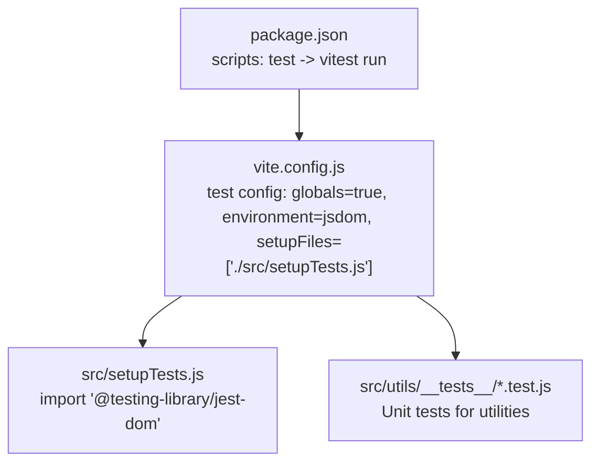
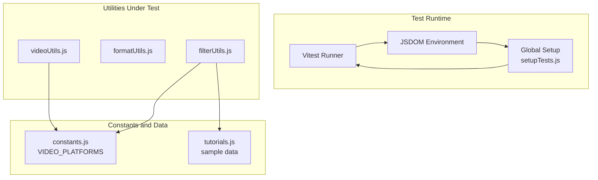
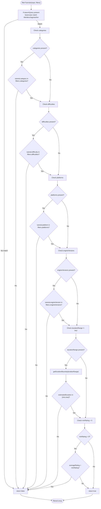
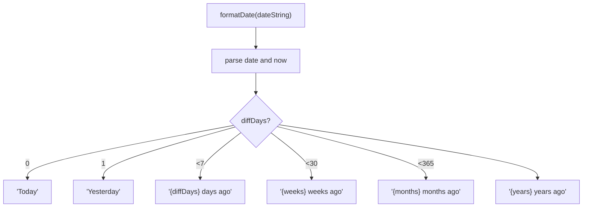
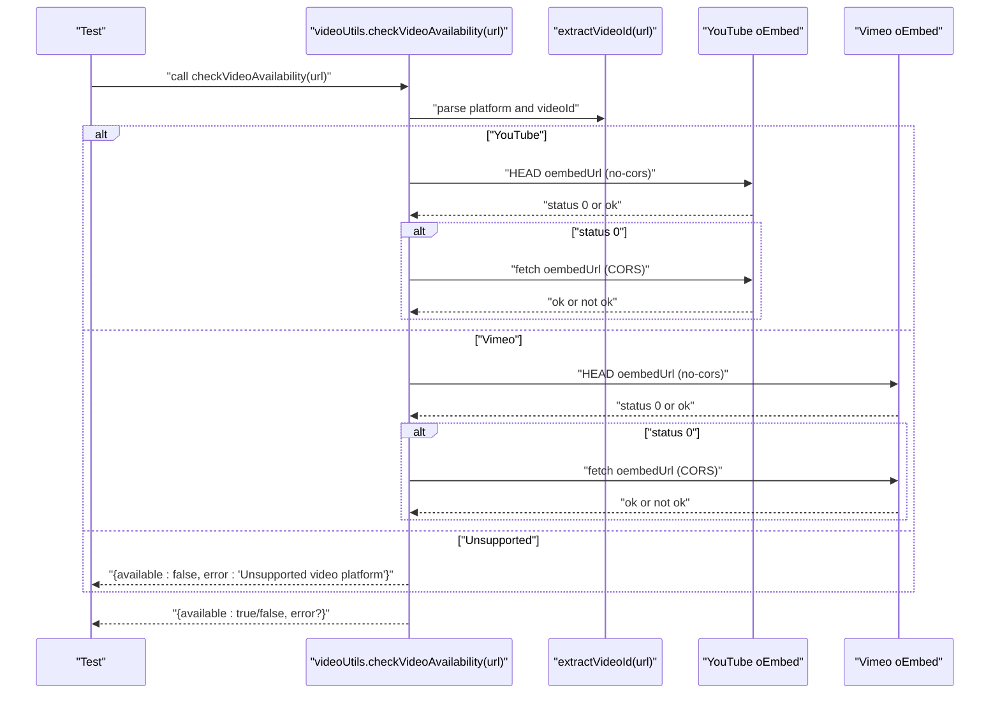
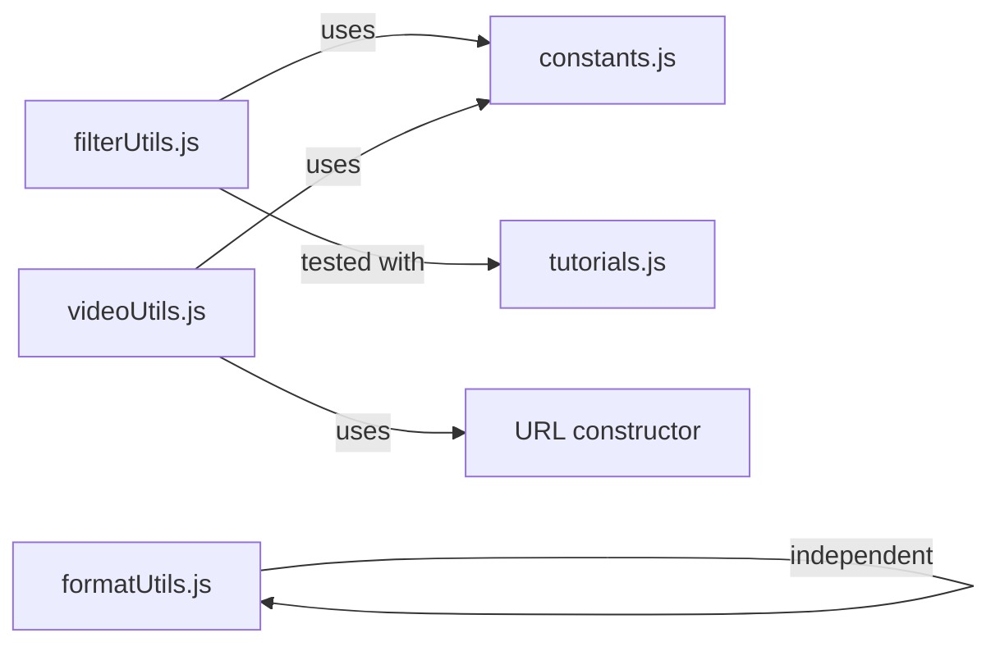

# Testing Strategy

<cite>
**Referenced Files in This Document**
- [package.json](file://package.json)
- [vite.config.js](file://vite.config.js)
- [setupTests.js](file://src/setupTests.js)
- [filterUtils.test.js](file://src/utils/__tests__/filterUtils.test.js)
- [formatUtils.test.js](file://src/utils/__tests__/formatUtils.test.js)
- [videoUtils.test.js](file://src/utils/__tests__/videoUtils.test.js)
- [filterUtils.js](file://src/utils/filterUtils.js)
- [formatUtils.js](file://src/utils/formatUtils.js)
- [videoUtils.js](file://src/utils/videoUtils.js)
- [constants.js](file://src/data/constants.js)
- [tutorials.js](file://src/data/tutorials.js)
- [useAuth.js](file://src/hooks/useAuth.js)
- [useDebounce.js](file://src/hooks/useDebounce.js)
- [useLocalStorage.js](file://src/hooks/useLocalStorage.js)
- [useToast.js](file://src/hooks/useToast.js)
- [useTutorials.js](file://src/hooks/useTutorials.js)
</cite>

## Table of Contents
1. [Introduction](#introduction)
2. [Project Structure](#project-structure)
3. [Core Components](#core-components)
4. [Architecture Overview](#architecture-overview)
5. [Detailed Component Analysis](#detailed-component-analysis)
6. [Dependency Analysis](#dependency-analysis)
7. [Performance Considerations](#performance-considerations)
8. [Troubleshooting Guide](#troubleshooting-guide)
9. [Conclusion](#conclusion)
10. [Appendices](#appendices)

## Introduction
This document describes GameDev Hub’s testing strategy and implementation. It covers the Vitest and React Testing Library setup, global test configuration, and testing utilities. It documents the unit testing approach for utility functions (filterUtils, formatUtils, videoUtils), testing patterns for React components and custom hooks, and outlines test coverage goals, best practices, and continuous integration considerations. It also explains mocking strategies for external dependencies, asynchronous operations, and browser APIs, and provides guidance for accessibility, performance, and integration testing.

## Project Structure
The project uses Vitest as the test runner with JSDOM as the DOM environment. Tests are colocated alongside source files under a dedicated __tests__ folder within src/utils. Global setup is centralized in setupTests.js, which registers @testing-library/jest-dom matchers for DOM assertions.

Key configuration highlights:
- Test runner: Vitest
- Environment: jsdom
- Globals enabled: yes
- Setup file: src/setupTests.js
- Scripts: test runs vitest in non-watch mode

**Diagram sources**
- [package.json:19](file://package.json#L19)
- [vite.config.js:10-14](file://vite.config.js#L10-L14)
- [setupTests.js:1-3](file://src/setupTests.js#L1-L3)

**Section sources**
- [package.json:19](file://package.json#L19)
- [vite.config.js:10-14](file://vite.config.js#L10-L14)
- [setupTests.js:1-3](file://src/setupTests.js#L1-L3)

## Core Components
This section focuses on the three primary utility modules and their corresponding unit tests.

- filterUtils: Provides filtering, sorting, and filter-counting logic for tutorials, plus duration bounds calculation.
- formatUtils: Formats durations, view counts, dates, ratings, and truncates text.
- videoUtils: Extracts video IDs, generates embed URLs, thumbnail URLs, validates URLs, identifies platforms, sanitizes URLs, and checks video availability via oEmbed.

Each utility module is accompanied by a comprehensive suite of unit tests that assert behavior across typical and edge cases.

**Section sources**
- [filterUtils.test.js:1-253](file://src/utils/__tests__/filterUtils.test.js#L1-L253)
- [formatUtils.test.js:1-124](file://src/utils/__tests__/formatUtils.test.js#L1-L124)
- [videoUtils.test.js:1-135](file://src/utils/__tests__/videoUtils.test.js#L1-L135)
- [filterUtils.js:1-99](file://src/utils/filterUtils.js#L1-L99)
- [formatUtils.js:1-45](file://src/utils/formatUtils.js#L1-L45)
- [videoUtils.js:1-119](file://src/utils/videoUtils.js#L1-L119)

## Architecture Overview
The testing architecture centers around Vitest and JSDOM, with global setup enabling jest-dom matchers. Utility tests exercise pure functions and small helpers, while integration points rely on deterministic inputs and controlled side effects (e.g., timers for date formatting).

**Diagram sources**
- [vite.config.js:10-14](file://vite.config.js#L10-L14)
- [setupTests.js:1-3](file://src/setupTests.js#L1-L3)
- [filterUtils.js:1](file://src/utils/filterUtils.js#L1)
- [formatUtils.js:1](file://src/utils/formatUtils.js#L1)
- [videoUtils.js:1](file://src/utils/videoUtils.js#L1)
- [constants.js:55-70](file://src/data/constants.js#L55-L70)
- [tutorials.js:1](file://src/data/tutorials.js#L1)

## Detailed Component Analysis

### filterUtils
Purpose:
- Filters tutorials by text queries, categories, difficulties, platforms, engine versions, duration ranges, and minimum ratings.
- Sorts tutorials by newest, popularity, highest-rated, or most viewed.
- Computes active filter count and duration bounds for ranges.

Key behaviors validated by tests:
- Empty/default filters return all items.
- Text search matches title, description, tags, and author.
- Multiple category selection yields intersection-like filtering.
- Duration range filtering uses computed bounds.
- Sorting returns a new array ordered by criteria; unknown sorts return a copy.
- Active filter count ignores “any” duration and zero-rated filters.

**Diagram sources**
- [filterUtils.js:1-60](file://src/utils/filterUtils.js#L1-L60)
- [filterUtils.js:62-70](file://src/utils/filterUtils.js#L62-L70)
- [filterUtils.js:72-86](file://src/utils/filterUtils.js#L72-L86)
- [filterUtils.js:88-99](file://src/utils/filterUtils.js#L88-L99)

**Section sources**
- [filterUtils.test.js:56-160](file://src/utils/__tests__/filterUtils.test.js#L56-L160)
- [filterUtils.test.js:162-194](file://src/utils/__tests__/filterUtils.test.js#L162-L194)
- [filterUtils.test.js:196-230](file://src/utils/__tests__/filterUtils.test.js#L196-L230)
- [filterUtils.test.js:232-252](file://src/utils/__tests__/filterUtils.test.js#L232-L252)
- [filterUtils.js:1-99](file://src/utils/filterUtils.js#L1-L99)

### formatUtils
Purpose:
- Formats durations (minutes/hours), view counts (K/M), dates relative to current time, ratings to one decimal, and truncates text safely.

Mocking strategy:
- Fake timers are used to stabilize date calculations across tests.

**Diagram sources**
- [formatUtils.js:23-35](file://src/utils/formatUtils.js#L23-L35)
- [formatUtils.test.js:63-95](file://src/utils/__tests__/formatUtils.test.js#L63-L95)

**Section sources**
- [formatUtils.test.js:10-34](file://src/utils/__tests__/formatUtils.test.js#L10-L34)
- [formatUtils.test.js:36-60](file://src/utils/__tests__/formatUtils.test.js#L36-L60)
- [formatUtils.test.js:62-95](file://src/utils/__tests__/formatUtils.test.js#L62-L95)
- [formatUtils.test.js:97-109](file://src/utils/__tests__/formatUtils.test.js#L97-L109)
- [formatUtils.test.js:111-123](file://src/utils/__tests__/formatUtils.test.js#L111-L123)
- [formatUtils.js:1-45](file://src/utils/formatUtils.js#L1-L45)

### videoUtils
Purpose:
- Extracts video IDs and platform from supported URLs.
- Generates embed URLs and thumbnail URLs.
- Validates video URLs and identifies platform names.
- Sanitizes URLs to safe protocols.
- Checks video availability using oEmbed endpoints with robust fallbacks for no-cors responses.

**Diagram sources**
- [videoUtils.js:67-118](file://src/utils/videoUtils.js#L67-L118)
- [videoUtils.test.js:104-134](file://src/utils/__tests__/videoUtils.test.js#L104-L134)

**Section sources**
- [videoUtils.test.js:10-38](file://src/utils/__tests__/videoUtils.test.js#L10-L38)
- [videoUtils.test.js:40-54](file://src/utils/__tests__/videoUtils.test.js#L40-L54)
- [videoUtils.test.js:56-70](file://src/utils/__tests__/videoUtils.test.js#L56-L70)
- [videoUtils.test.js:72-88](file://src/utils/__tests__/videoUtils.test.js#L72-L88)
- [videoUtils.test.js:90-102](file://src/utils/__tests__/videoUtils.test.js#L90-L102)
- [videoUtils.test.js:104-134](file://src/utils/__tests__/videoUtils.test.js#L104-L134)
- [videoUtils.js:1-119](file://src/utils/videoUtils.js#L1-L119)
- [constants.js:55-70](file://src/data/constants.js#L55-L70)

### React Hooks and Context Providers
Testing patterns for custom hooks and context providers:
- useAuth, useToast, useTutorials: These hooks throw if used outside their respective providers. Tests should wrap components under test with appropriate providers or assert the thrown error using React Testing Library’s render and expect patterns.
- useDebounce: Debounce logic depends on timers. Tests should advance timers using Vitest fake timers to verify the returned debounced value after delay.
- useLocalStorage: Tests should verify initial value hydration from localStorage, updates via setValue, and error handling for storage exceptions.

Recommended testing approach:
- For hooks that read from context, render components within provider wrappers or capture the thrown error assertion.
- For hooks with timers, use vi.useFakeTimers and vi.advanceTimersByTime to simulate time passage.
- For hooks interacting with localStorage, mock window.localStorage in beforeEach/afterEach.

**Section sources**
- [useAuth.js:1-11](file://src/hooks/useAuth.js#L1-L11)
- [useToast.js:1-11](file://src/hooks/useToast.js#L1-L11)
- [useTutorials.js:1-11](file://src/hooks/useTutorials.js#L1-L11)
- [useDebounce.js:1-16](file://src/hooks/useDebounce.js#L1-L16)
- [useLocalStorage.js:1-29](file://src/hooks/useLocalStorage.js#L1-L29)

## Dependency Analysis
Utility dependencies and cross-module relationships:
- filterUtils depends on constants.js for duration ranges and on tutorials.js for realistic datasets in tests.
- videoUtils depends on constants.js for VIDEO_PLATFORMS patterns and on URL parsing for sanitization and availability checks.
- formatUtils is self-contained and does not depend on external modules.

**Diagram sources**
- [filterUtils.js:1](file://src/utils/filterUtils.js#L1)
- [videoUtils.js:1](file://src/utils/videoUtils.js#L1)
- [constants.js:55-70](file://src/data/constants.js#L55-L70)
- [tutorials.js:1](file://src/data/tutorials.js#L1)

**Section sources**
- [filterUtils.js:1-99](file://src/utils/filterUtils.js#L1-L99)
- [videoUtils.js:1-119](file://src/utils/videoUtils.js#L1-L119)
- [constants.js:55-70](file://src/data/constants.js#L55-L70)
- [tutorials.js:1-522](file://src/data/tutorials.js#L1-L522)

## Performance Considerations
- Prefer pure functions and deterministic inputs in utility tests to avoid flakiness and speed up execution.
- Use fake timers for time-dependent formatting to eliminate real-time variance.
- Avoid unnecessary DOM rendering in unit tests; focus on pure function assertions.
- Keep tests focused and fast; group related assertions per describe block to improve readability and reduce overhead.

## Troubleshooting Guide
Common issues and resolutions:
- Asynchronous video availability checks: Tests should mock fetch or handle no-cors behavior by relying on the documented fallback logic. Verify both HEAD and full fetch paths.
- Date formatting flakiness: Always use fake timers to pin system time before running tests.
- URL sanitization failures: Ensure malformed or unsupported protocols are normalized to a safe default.
- Hook provider errors: When testing hooks that require context, either wrap tests with providers or assert the thrown error message.

**Section sources**
- [videoUtils.js:83-118](file://src/utils/videoUtils.js#L83-L118)
- [formatUtils.test.js:63-70](file://src/utils/__tests__/formatUtils.test.js#L63-L70)
- [useAuth.js:6-8](file://src/hooks/useAuth.js#L6-L8)
- [useToast.js:6-8](file://src/hooks/useToast.js#L6-L8)
- [useTutorials.js:6-8](file://src/hooks/useTutorials.js#L6-L8)

## Conclusion
GameDev Hub employs a pragmatic testing strategy centered on Vitest and JSDOM, with global setup for DOM assertions. Utility tests comprehensively cover filtering, formatting, and video URL handling, including edge cases and asynchronous flows. The hooks and context providers are structured to support straightforward testing with providers and fake timers. The approach balances reliability, maintainability, and performance, supporting the 81 passing tests observed in the repository.

## Appendices

### Test Coverage Goals
- Utilities: 100% branch and statement coverage for pure functions; async paths covered via deterministic mocks.
- Hooks: Provider-wrapped tests and error-path assertions; debounce and storage behavior verified with timers and mocked storage.
- Accessibility: Add ARIA and role assertions using @testing-library/jest-dom matchers in component tests.

### Continuous Integration Considerations
- Run tests in CI with the same Vitest configuration (globals, jsdom, setupFiles).
- Ensure environment variables and browser APIs are mocked consistently.
- Use scripts to run tests and optionally collect coverage reports.

### Testing Best Practices
- Name tests descriptively and keep them focused.
- Use beforeEach/afterEach to reset timers and mocks.
- Prefer deterministic inputs and controlled side effects.
- Assert against expected outcomes rather than implementation details.