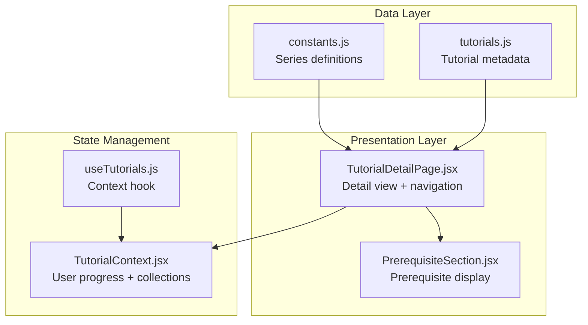
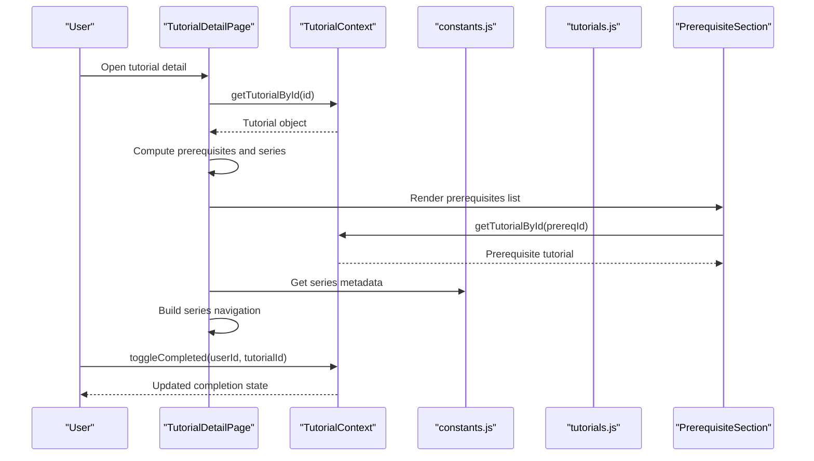
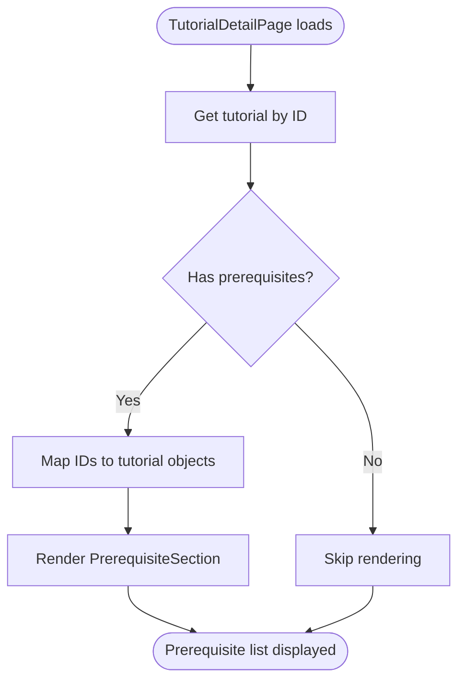
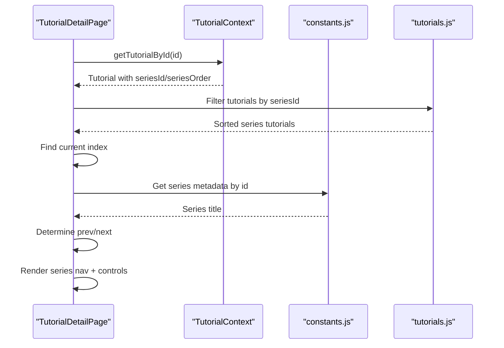
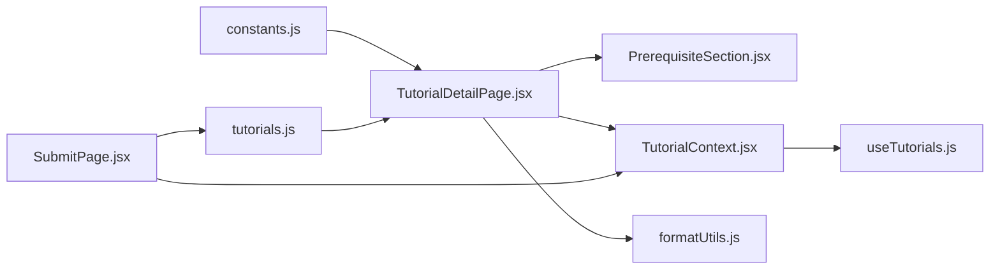

# Prerequisite and Series Management

<cite>
**Referenced Files in This Document**
- [PrerequisiteSection.jsx](file://src/components/PrerequisiteSection.jsx)
- [PrerequisiteSection.module.css](file://src/components/PrerequisiteSection.module.css)
- [constants.js](file://src/data/constants.js)
- [tutorials.js](file://src/data/tutorials.js)
- [TutorialDetailPage.jsx](file://src/pages/TutorialDetailPage.jsx)
- [TutorialContext.jsx](file://src/contexts/TutorialContext.jsx)
- [useTutorials.js](file://src/hooks/useTutorials.js)
- [propTypeShapes.js](file://src/utils/propTypeShapes.js)
- [formatUtils.js](file://src/utils/formatUtils.js)
- [SubmitPage.jsx](file://src/pages/SubmitPage.jsx)
</cite>

## Table of Contents
1. [Introduction](#introduction)
2. [Project Structure](#project-structure)
3. [Core Components](#core-components)
4. [Architecture Overview](#architecture-overview)
5. [Detailed Component Analysis](#detailed-component-analysis)
6. [Dependency Analysis](#dependency-analysis)
7. [Performance Considerations](#performance-considerations)
8. [Troubleshooting Guide](#troubleshooting-guide)
9. [Conclusion](#conclusion)

## Introduction
This document explains the prerequisite and series management functionality in the game development tutorial platform. It covers how prerequisites are detected and displayed, how series are organized with numbered sequences, and how users navigate through learning paths. The documentation details the data structures, navigation controls, and user progress tracking mechanisms that guide learners through structured tutorial sequences.

## Project Structure
The prerequisite and series management system spans several key areas:
- Data definitions for series and tutorial metadata
- Tutorial detail page that orchestrates prerequisite display and series navigation
- Context provider that manages user progress and tutorial collections
- UI components for prerequisite lists and series navigation
- Submission interface that allows creators to define prerequisites

**Diagram sources**
- [constants.js:24-28](file://src/data/constants.js#L24-L28)
- [tutorials.js:1-522](file://src/data/tutorials.js#L1-L522)
- [TutorialDetailPage.jsx:1-296](file://src/pages/TutorialDetailPage.jsx#L1-L296)
- [PrerequisiteSection.jsx:1-41](file://src/components/PrerequisiteSection.jsx#L1-L41)
- [TutorialContext.jsx:1-542](file://src/contexts/TutorialContext.jsx#L1-L542)
- [useTutorials.js:1-11](file://src/hooks/useTutorials.js#L1-L11)

**Section sources**
- [constants.js:1-71](file://src/data/constants.js#L1-L71)
- [tutorials.js:1-522](file://src/data/tutorials.js#L1-L522)
- [TutorialDetailPage.jsx:1-296](file://src/pages/TutorialDetailPage.jsx#L1-L296)
- [PrerequisiteSection.jsx:1-41](file://src/components/PrerequisiteSection.jsx#L1-L41)
- [TutorialContext.jsx:1-542](file://src/contexts/TutorialContext.jsx#L1-L542)
- [useTutorials.js:1-11](file://src/hooks/useTutorials.js#L1-L11)

## Core Components
This section outlines the primary components involved in prerequisite and series management:

- PrerequisiteSection: Renders prerequisite tutorials for a given tutorial
- TutorialDetailPage: Orchestrates prerequisite display and series navigation
- TutorialContext: Provides user progress tracking and tutorial collections
- constants.js: Defines series metadata used for navigation
- tutorials.js: Contains tutorial definitions with prerequisites and series metadata

Key capabilities:
- Prerequisite detection and display
- Series identification and ordered navigation
- User progress tracking (completed tutorials)
- Series progress indicators (current part of total)

**Section sources**
- [PrerequisiteSection.jsx:1-41](file://src/components/PrerequisiteSection.jsx#L1-L41)
- [TutorialDetailPage.jsx:57-78](file://src/pages/TutorialDetailPage.jsx#L57-L78)
- [TutorialContext.jsx:164-201](file://src/contexts/TutorialContext.jsx#L164-L201)
- [constants.js:24-28](file://src/data/constants.js#L24-L28)
- [tutorials.js:1-522](file://src/data/tutorials.js#L1-L522)

## Architecture Overview
The prerequisite and series management system follows a clear separation of concerns:
- Data definitions live in constants.js and tutorials.js
- Presentation logic resides in TutorialDetailPage.jsx
- UI components render prerequisite lists and series navigation
- State management is centralized in TutorialContext.jsx
- User actions (marking completed, navigation) are handled through the context

**Diagram sources**
- [TutorialDetailPage.jsx:47-78](file://src/pages/TutorialDetailPage.jsx#L47-L78)
- [TutorialContext.jsx:83-88](file://src/contexts/TutorialContext.jsx#L83-L88)
- [constants.js:24-28](file://src/data/constants.js#L24-L28)
- [tutorials.js:1-522](file://src/data/tutorials.js#L1-L522)
- [PrerequisiteSection.jsx:1-41](file://src/components/PrerequisiteSection.jsx#L1-L41)

## Detailed Component Analysis

### Prerequisite Detection and Display
Prerequisite detection is performed in the tutorial detail page by mapping prerequisite IDs to tutorial objects. The PrerequisiteSection component renders a styled list of prerequisite tutorials with thumbnails, durations, difficulty badges, and platform tags.

Implementation highlights:
- Prerequisite IDs are mapped to tutorial objects using the context's getter
- Empty prerequisite arrays are handled gracefully
- Duration formatting uses shared utilities
- Styling is encapsulated in dedicated CSS module

**Diagram sources**
- [TutorialDetailPage.jsx:57-60](file://src/pages/TutorialDetailPage.jsx#L57-L60)
- [PrerequisiteSection.jsx:9-36](file://src/components/PrerequisiteSection.jsx#L9-L36)

**Section sources**
- [TutorialDetailPage.jsx:57-60](file://src/pages/TutorialDetailPage.jsx#L57-L60)
- [PrerequisiteSection.jsx:1-41](file://src/components/PrerequisiteSection.jsx#L1-L41)
- [formatUtils.js:1-11](file://src/utils/formatUtils.js#L1-L11)

### Series Organization and Navigation
Series are identified by seriesId and ordered by seriesOrder within each series. The tutorial detail page computes:
- Series metadata from constants.js
- Total tutorials in the series
- Current tutorial's position (part number)
- Previous and next tutorial objects for navigation

Navigation controls:
- Series title and progress indicator (Part X of Y)
- Previous and next links with disabled states when at boundaries
- Links route to the next tutorial in the series

**Diagram sources**
- [TutorialDetailPage.jsx:62-78](file://src/pages/TutorialDetailPage.jsx#L62-L78)
- [constants.js:24-28](file://src/data/constants.js#L24-L28)
- [tutorials.js:1-522](file://src/data/tutorials.js#L1-L522)

**Section sources**
- [TutorialDetailPage.jsx:62-78](file://src/pages/TutorialDetailPage.jsx#L62-L78)
- [constants.js:24-28](file://src/data/constants.js#L24-L28)

### Series Data Structure in constants.js
The SERIES constant defines available series with their IDs and titles. Each tutorial in tutorials.js includes:
- seriesId: Identifies which series the tutorial belongs to
- seriesOrder: Numeric order within the series

This structure enables automatic series discovery and navigation.

**Section sources**
- [constants.js:24-28](file://src/data/constants.js#L24-L28)
- [tutorials.js:1-522](file://src/data/tutorials.js#L1-L522)

### Series Navigation Controls
The tutorial detail page renders a series navigation bar containing:
- Series title from constants.js
- Progress indicator (current part of total)
- Previous and next navigation links
- Disabled states for boundary conditions

The navigation logic:
- Filters tutorials by seriesId
- Sorts by seriesOrder
- Determines current index and adjacent items
- Builds navigation objects for rendering

**Section sources**
- [TutorialDetailPage.jsx:169-187](file://src/pages/TutorialDetailPage.jsx#L169-L187)
- [TutorialDetailPage.jsx:62-78](file://src/pages/TutorialDetailPage.jsx#L62-L78)

### Prerequisite Validation and User Guidance
Prerequisites are validated during tutorial submission:
- Maximum 5 prerequisites allowed
- Prerequisite IDs are stored as strings in the tutorial object
- Submission form validates prerequisite entries and stores them in the tutorial payload

User guidance:
- Prerequisite section on tutorial detail suggests foundational content
- Series navigation helps users follow recommended learning paths
- Completion tracking allows users to mark tutorials as finished

**Section sources**
- [SubmitPage.jsx:59-71](file://src/pages/SubmitPage.jsx#L59-L71)
- [SubmitPage.jsx:150](file://src/pages/SubmitPage.jsx#L150)
- [TutorialDetailPage.jsx:220](file://src/pages/TutorialDetailPage.jsx#L220)

### Example: Prerequisite Chains and Series Relationships
Example chains from the dataset:
- Godot 4 Beginner Series: tut-001 → tut-012 → tut-022
- Game Design Fundamentals: tut-010 → tut-014 → tut-019 → tut-025
- GameMaker Masterclass: tut-007 → tut-018 → tut-024

These demonstrate:
- Linear prerequisite chains (one prerequisite per tutorial)
- Series progression with numeric ordering
- Cross-series relationships (e.g., prerequisites from different series)

**Section sources**
- [tutorials.js:22-247](file://src/data/tutorials.js#L22-L247)
- [tutorials.js:195-289](file://src/data/tutorials.js#L195-L289)
- [tutorials.js:136-497](file://src/data/tutorials.js#L136-L497)

### Series Completion Tracking and User Progress
User progress is tracked per user with:
- Completed tutorials stored in localStorage under a user-specific key
- Helper functions to toggle completion and query completion status
- Completion count per user
- Integration with tutorial detail actions (Mark as Completed)

Progress management:
- Users can mark tutorials as completed
- Progress persists across sessions
- Used for personal learning tracking and recommendations

**Section sources**
- [TutorialContext.jsx:164-201](file://src/contexts/TutorialContext.jsx#L164-L201)
- [TutorialDetailPage.jsx:134-141](file://src/pages/TutorialDetailPage.jsx#L134-L141)

## Dependency Analysis
The prerequisite and series management system exhibits clean separation of concerns with minimal coupling:

Key dependencies:
- TutorialDetailPage depends on constants.js for series metadata and tutorials.js for tutorial data
- PrerequisiteSection depends on tutorialShape and formatUtils
- TutorialContext provides the central state for user progress and tutorial collections
- SubmitPage depends on TutorialContext for submission and on tutorials.js for prerequisite selection

**Diagram sources**
- [constants.js:1-71](file://src/data/constants.js#L1-L71)
- [tutorials.js:1-522](file://src/data/tutorials.js#L1-L522)
- [TutorialDetailPage.jsx:1-296](file://src/pages/TutorialDetailPage.jsx#L1-L296)
- [PrerequisiteSection.jsx:1-41](file://src/components/PrerequisiteSection.jsx#L1-L41)
- [TutorialContext.jsx:1-542](file://src/contexts/TutorialContext.jsx#L1-L542)
- [useTutorials.js:1-11](file://src/hooks/useTutorials.js#L1-L11)
- [formatUtils.js:1-45](file://src/utils/formatUtils.js#L1-L45)
- [SubmitPage.jsx:35-173](file://src/pages/SubmitPage.jsx#L35-L173)

**Section sources**
- [TutorialDetailPage.jsx:1-296](file://src/pages/TutorialDetailPage.jsx#L1-L296)
- [PrerequisiteSection.jsx:1-41](file://src/components/PrerequisiteSection.jsx#L1-L41)
- [TutorialContext.jsx:1-542](file://src/contexts/TutorialContext.jsx#L1-L542)
- [SubmitPage.jsx:35-173](file://src/pages/SubmitPage.jsx#L35-L173)

## Performance Considerations
- Prerequisite computation: O(n log n) due to sorting series tutorials by seriesOrder
- Navigation computation: O(n) to filter and sort series tutorials
- Local storage persistence: Minimal overhead for user progress tracking
- Rendering: PrerequisiteSection renders a small, fixed-size list (typically ≤ 5 items)

Recommendations:
- Keep prerequisite lists short (≤ 5) to minimize rendering overhead
- Use memoization for computed series and prerequisite arrays
- Consider lazy loading for large tutorial datasets if scaling

## Troubleshooting Guide
Common issues and resolutions:
- Prerequisite list not appearing: Verify tutorial has prerequisites array and IDs exist in tutorials.js
- Series navigation missing: Ensure tutorial has seriesId and seriesOrder defined
- Navigation links broken: Confirm seriesId matches a constant and tutorial IDs exist
- Completion not persisting: Check localStorage availability and TutorialContext initialization
- Prerequisite submission errors: Limit to 5 prerequisites and ensure valid tutorial IDs

Validation points:
- Tutorial shape validation ensures prerequisites and series fields are present
- Series metadata validation ensures seriesId matches known series
- Navigation logic handles boundary conditions gracefully

**Section sources**
- [propTypeShapes.js:3-26](file://src/utils/propTypeShapes.js#L3-L26)
- [TutorialDetailPage.jsx:57-78](file://src/pages/TutorialDetailPage.jsx#L57-L78)
- [SubmitPage.jsx:59-71](file://src/pages/SubmitPage.jsx#L59-L71)

## Conclusion
The prerequisite and series management system provides a robust foundation for guiding users through structured learning paths. It combines explicit prerequisite definitions with series-based organization, enabling clear learning sequences and meaningful progress tracking. The modular architecture ensures maintainability while the data-driven approach supports easy expansion of series and prerequisite relationships.