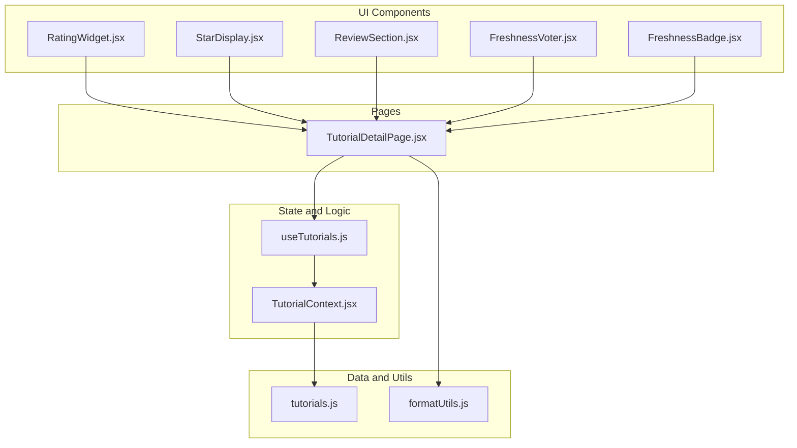
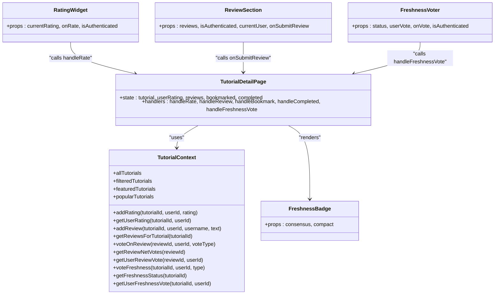
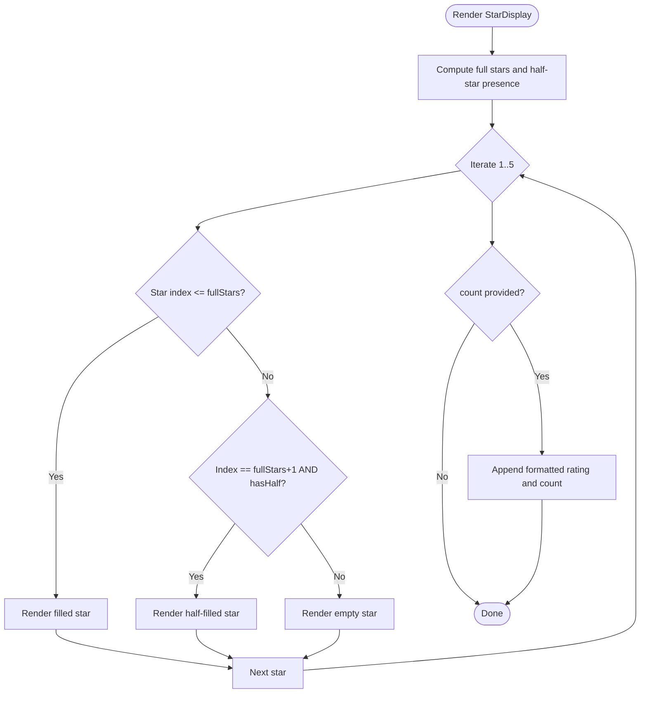
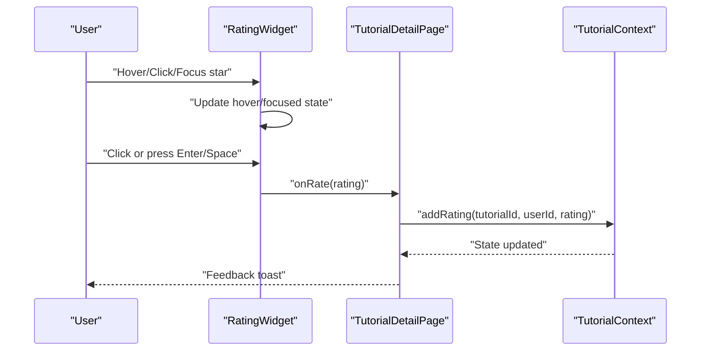
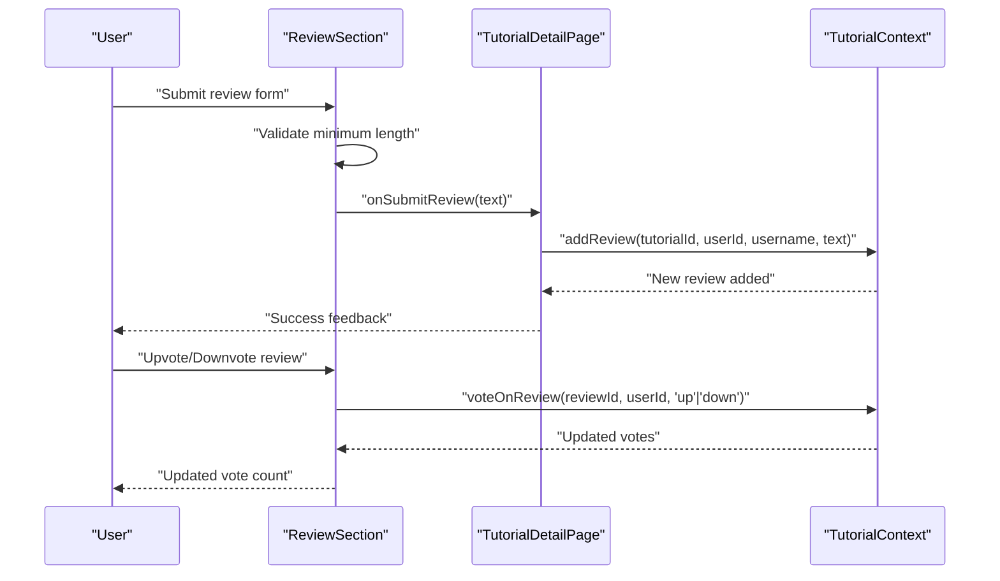
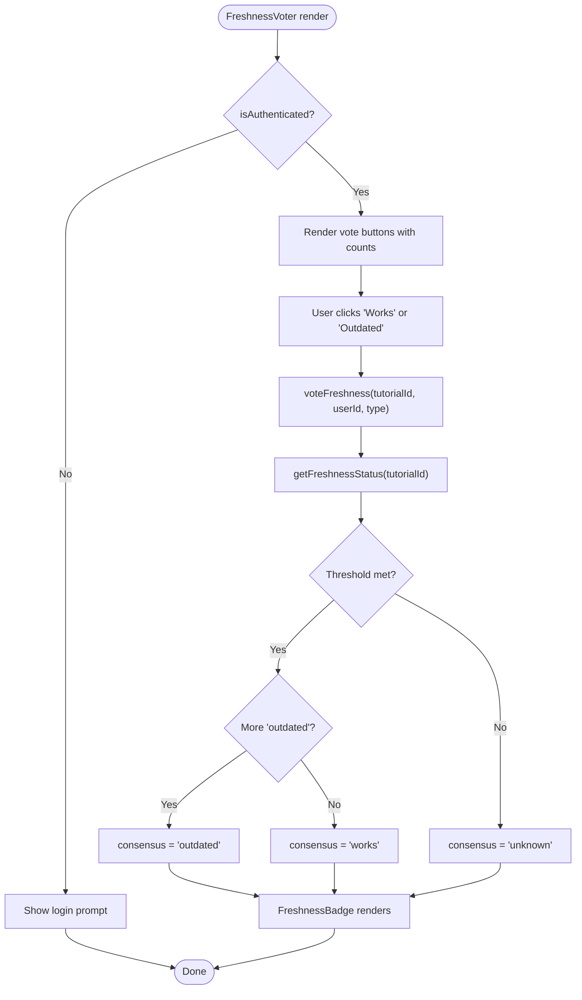
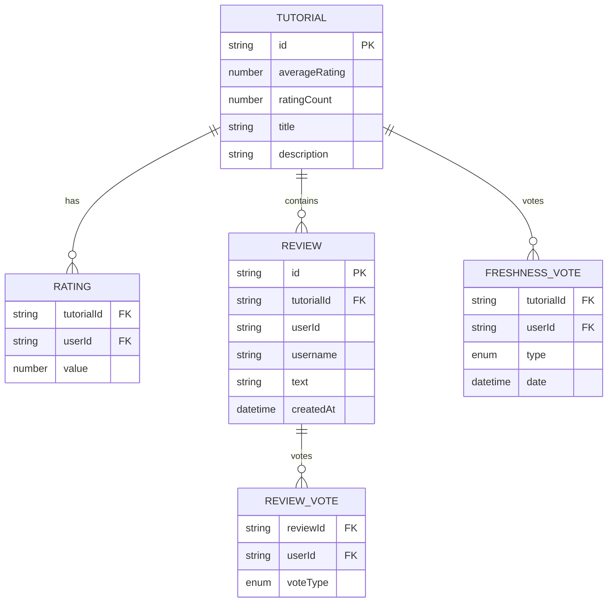
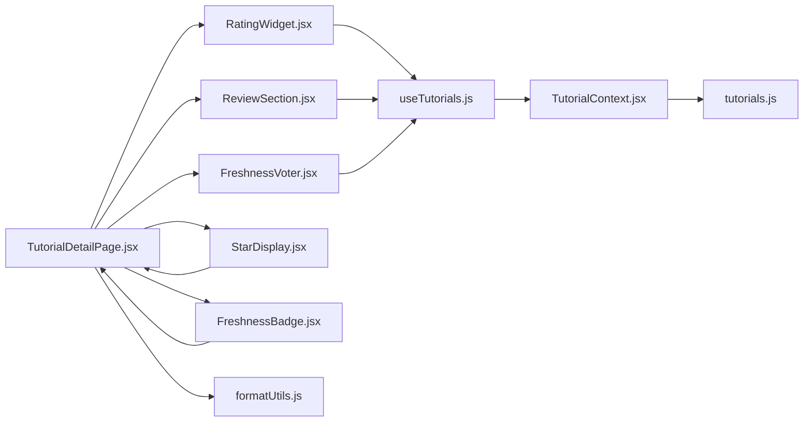

# Rating and Review System

<cite>
**Referenced Files in This Document**
- [RatingWidget.jsx](file://src/components/RatingWidget.jsx)
- [StarDisplay.jsx](file://src/components/StarDisplay.jsx)
- [FreshnessVoter.jsx](file://src/components/FreshnessVoter.jsx)
- [FreshnessBadge.jsx](file://src/components/FreshnessBadge.jsx)
- [ReviewSection.jsx](file://src/components/ReviewSection.jsx)
- [TutorialContext.jsx](file://src/contexts/TutorialContext.jsx)
- [useTutorials.js](file://src/hooks/useTutorials.js)
- [TutorialDetailPage.jsx](file://src/pages/TutorialDetailPage.jsx)
- [tutorials.js](file://src/data/tutorials.js)
- [formatUtils.js](file://src/utils/formatUtils.js)
- [RatingWidget.module.css](file://src/components/RatingWidget.module.css)
- [StarDisplay.module.css](file://src/components/StarDisplay.module.css)
- [FreshnessVoter.module.css](file://src/components/FreshnessVoter.module.css)
- [FreshnessBadge.module.css](file://src/components/FreshnessBadge.module.css)
- [ReviewSection.module.css](file://src/components/ReviewSection.module.css)
</cite>

## Table of Contents
1. [Introduction](#introduction)
2. [Project Structure](#project-structure)
3. [Core Components](#core-components)
4. [Architecture Overview](#architecture-overview)
5. [Detailed Component Analysis](#detailed-component-analysis)
6. [Dependency Analysis](#dependency-analysis)
7. [Performance Considerations](#performance-considerations)
8. [Troubleshooting Guide](#troubleshooting-guide)
9. [Conclusion](#conclusion)

## Introduction
This document describes the tutorial rating and review system, including star rating display, interactive rating widget, review submission and moderation, and the freshness voting system for community-driven tutorial quality assessment. It explains the data models, algorithms for tutorial ranking and recommendation, and security measures to prevent spam.

## Project Structure
The rating and review system spans several components and utilities:
- UI components for rating, reviews, and freshness
- Context providing centralized state and algorithms
- Page container orchestrating interactions
- Data fixtures and formatting utilities

**Diagram sources**
- [TutorialDetailPage.jsx:158-295](file://src/pages/TutorialDetailPage.jsx#L158-L295)
- [RatingWidget.jsx:6-77](file://src/components/RatingWidget.jsx#L6-L77)
- [StarDisplay.jsx:5-42](file://src/components/StarDisplay.jsx#L5-L42)
- [ReviewSection.jsx:7-131](file://src/components/ReviewSection.jsx#L7-L131)
- [FreshnessVoter.jsx:5-44](file://src/components/FreshnessVoter.jsx#L5-L44)
- [FreshnessBadge.jsx:5-27](file://src/components/FreshnessBadge.jsx#L5-L27)
- [TutorialContext.jsx:18-541](file://src/contexts/TutorialContext.jsx#L18-L541)
- [useTutorials.js:4-10](file://src/hooks/useTutorials.js#L4-L10)
- [tutorials.js:1-522](file://src/data/tutorials.js#L1-L522)
- [formatUtils.js:23-35](file://src/utils/formatUtils.js#L23-L35)

**Section sources**
- [TutorialDetailPage.jsx:1-296](file://src/pages/TutorialDetailPage.jsx#L1-L296)
- [TutorialContext.jsx:1-542](file://src/contexts/TutorialContext.jsx#L1-L542)

## Core Components
- Star rating display: renders filled/unfilled stars and optional rating count.
- Interactive rating widget: allows logged-in users to rate a tutorial via hover/click or keyboard navigation.
- Review section: enables logged-in users to post reviews, sort by helpful/newest, and upvote/downvote reviews.
- Freshness voter and badge: lets users mark tutorials as “still works” or “outdated,” and displays consensus.
- Context provider: manages local storage-backed state for ratings, reviews, review votes, and freshness votes; computes derived tutorial metrics.

**Section sources**
- [StarDisplay.jsx:5-42](file://src/components/StarDisplay.jsx#L5-L42)
- [RatingWidget.jsx:6-77](file://src/components/RatingWidget.jsx#L6-L77)
- [ReviewSection.jsx:7-131](file://src/components/ReviewSection.jsx#L7-L131)
- [FreshnessVoter.jsx:5-44](file://src/components/FreshnessVoter.jsx#L5-L44)
- [FreshnessBadge.jsx:5-27](file://src/components/FreshnessBadge.jsx#L5-L27)
- [TutorialContext.jsx:18-541](file://src/contexts/TutorialContext.jsx#L18-L541)

## Architecture Overview
The system is organized around a central context that exposes:
- Data: tutorials, ratings, reviews, votes, and freshness votes stored in local storage
- Derived metrics: tutorial average rating and rating count
- Actions: add rating, add review, vote on review, vote freshness, and helpers to compute consensus

**Diagram sources**
- [TutorialContext.jsx:453-536](file://src/contexts/TutorialContext.jsx#L453-L536)
- [RatingWidget.jsx:6-77](file://src/components/RatingWidget.jsx#L6-L77)
- [ReviewSection.jsx:7-131](file://src/components/ReviewSection.jsx#L7-L131)
- [FreshnessVoter.jsx:5-44](file://src/components/FreshnessVoter.jsx#L5-L44)
- [FreshnessBadge.jsx:5-27](file://src/components/FreshnessBadge.jsx#L5-L27)
- [TutorialDetailPage.jsx:103-146](file://src/pages/TutorialDetailPage.jsx#L103-L146)

## Detailed Component Analysis

### Star Rating Display
- Purpose: Visualize tutorial rating and optionally show rating count.
- Behavior:
  - Renders five stars with filled/unfilled states based on rating value.
  - Supports a half-star heuristic to indicate fractional ratings.
  - Optional compact mode for smaller displays.
- Accessibility: Uses semantic labels and counts when present.

**Diagram sources**
- [StarDisplay.jsx:5-42](file://src/components/StarDisplay.jsx#L5-L42)

**Section sources**
- [StarDisplay.jsx:5-42](file://src/components/StarDisplay.jsx#L5-L42)
- [StarDisplay.module.css:1-36](file://src/components/StarDisplay.module.css#L1-L36)

### Interactive Rating Widget
- Purpose: Allow authenticated users to rate a tutorial from 1 to 5 stars.
- Behavior:
  - Shows login prompt for non-authenticated users.
  - Hover/focus highlights stars leading up to the hovered/focused star.
  - Keyboard navigation supports arrow keys to move focus between stars.
  - Click or Enter/Space triggers rating submission.
  - Announces current rating to assistive tech.
- Accessibility: Uses radiogroup and radio roles, ARIA attributes, and keyboard support.

**Diagram sources**
- [RatingWidget.jsx:19-66](file://src/components/RatingWidget.jsx#L19-L66)
- [TutorialDetailPage.jsx:111-116](file://src/pages/TutorialDetailPage.jsx#L111-L116)
- [TutorialContext.jsx:90-101](file://src/contexts/TutorialContext.jsx#L90-L101)

**Section sources**
- [RatingWidget.jsx:6-77](file://src/components/RatingWidget.jsx#L6-L77)
- [RatingWidget.module.css:1-48](file://src/components/RatingWidget.module.css#L1-L48)
- [TutorialDetailPage.jsx:111-116](file://src/pages/TutorialDetailPage.jsx#L111-L116)
- [TutorialContext.jsx:90-101](file://src/contexts/TutorialContext.jsx#L90-L101)

### Review Submission and Moderation
- Purpose: Enable authenticated users to submit reviews and moderate community feedback.
- Behavior:
  - Login prompt for non-authenticated users.
  - Minimum length enforcement for review text.
  - Sorting modes: most helpful (by net votes, then recency) or newest.
  - Per-review voting: upvote/downvote with toggle and visual indication of user’s vote.
  - Vote counts reflect net votes (upvotes minus downvotes).
- Security and spam prevention:
  - Minimum length requirement reduces low-effort spam.
  - Authentication gating prevents anonymous submissions.
  - Local storage backend avoids server-side enforcement but can be extended.

**Diagram sources**
- [ReviewSection.jsx:17-22](file://src/components/ReviewSection.jsx#L17-L22)
- [TutorialDetailPage.jsx:118-123](file://src/pages/TutorialDetailPage.jsx#L118-L123)
- [TutorialContext.jsx:204-257](file://src/contexts/TutorialContext.jsx#L204-L257)

**Section sources**
- [ReviewSection.jsx:7-131](file://src/components/ReviewSection.jsx#L7-L131)
- [ReviewSection.module.css:1-205](file://src/components/ReviewSection.module.css#L1-L205)
- [TutorialDetailPage.jsx:118-123](file://src/pages/TutorialDetailPage.jsx#L118-L123)
- [TutorialContext.jsx:204-257](file://src/contexts/TutorialContext.jsx#L204-L257)

### Freshness Voting System
- Purpose: Community-driven quality assessment indicating whether a tutorial still works or is outdated.
- Behavior:
  - Two vote types: “works” and “outdated.”
  - Consensus computed when threshold reached (≥3 votes) based on majority.
  - Users can see their own vote and update it.
  - Badge displays consensus with distinct styles for “works” and “outdated.”
- Interaction:
  - Login prompt for non-authenticated users.
  - Disabled buttons until authenticated.

**Diagram sources**
- [FreshnessVoter.jsx:13-43](file://src/components/FreshnessVoter.jsx#L13-L43)
- [FreshnessBadge.jsx:5-27](file://src/components/FreshnessBadge.jsx#L5-L27)
- [TutorialContext.jsx:259-303](file://src/contexts/TutorialContext.jsx#L259-L303)

**Section sources**
- [FreshnessVoter.jsx:5-55](file://src/components/FreshnessVoter.jsx#L5-L55)
- [FreshnessVoter.module.css:1-96](file://src/components/FreshnessVoter.module.css#L1-L96)
- [FreshnessBadge.jsx:5-32](file://src/components/FreshnessBadge.jsx#L5-L32)
- [FreshnessBadge.module.css:1-48](file://src/components/FreshnessBadge.module.css#L1-L48)
- [TutorialContext.jsx:259-303](file://src/contexts/TutorialContext.jsx#L259-L303)

### Data Models and Algorithms
- Ratings:
  - Stored per tutorial per user in local storage.
  - Average rating and rating count are recomputed from stored ratings plus base tutorial data.
- Reviews:
  - Each review has an ID, tutorial association, author identity, content, and timestamps.
  - Sorting by helpfulness uses net votes; ties fall back to creation time.
- Review voting:
  - Per-user per-review vote tracked; net votes computed as upvotes minus downvotes.
- Freshness:
  - Per-tutorial array of votes; consensus computed when ≥3 votes exist.

**Diagram sources**
- [tutorials.js:1-522](file://src/data/tutorials.js#L1-L522)
- [TutorialContext.jsx:18-65](file://src/contexts/TutorialContext.jsx#L18-L65)
- [TutorialContext.jsx:110-124](file://src/contexts/TutorialContext.jsx#L110-L124)
- [TutorialContext.jsx:204-257](file://src/contexts/TutorialContext.jsx#L204-L257)
- [TutorialContext.jsx:259-303](file://src/contexts/TutorialContext.jsx#L259-L303)

**Section sources**
- [TutorialContext.jsx:18-65](file://src/contexts/TutorialContext.jsx#L18-L65)
- [TutorialContext.jsx:90-124](file://src/contexts/TutorialContext.jsx#L90-L124)
- [TutorialContext.jsx:204-257](file://src/contexts/TutorialContext.jsx#L204-L257)
- [TutorialContext.jsx:259-303](file://src/contexts/TutorialContext.jsx#L259-L303)

### Tutorial Ranking and Recommendation Algorithms
- Tutorial average rating and rating count are derived from stored user ratings and base data.
- Sorting and filtering are applied in the context provider using shared utilities.
- Recommendation-like features:
  - Popular tutorials by view count.
  - Featured tutorials flag.
  - For-you suggestions based on followed tags and recency.

These are orchestrated by the page and context but rely on the underlying data models and sorting/filtering utilities.

**Section sources**
- [TutorialContext.jsx:37-81](file://src/contexts/TutorialContext.jsx#L37-L81)
- [TutorialDetailPage.jsx:49-78](file://src/pages/TutorialDetailPage.jsx#L49-L78)

### Examples of Rating Interactions
- Rate a tutorial:
  - Authenticate, open tutorial detail, select star rating, submit.
  - Result: rating stored; average rating updates; user sees success feedback.
- Submit a review:
  - Authenticate, compose review (min length enforced), submit.
  - Result: review appears; can be sorted by helpful/newest.
- Vote on a review:
  - Authenticate, click upvote/downvote; toggle supported.
  - Result: net vote updates; user’s vote highlighted.
- Freshness vote:
  - Authenticate, click “Still Works” or “Outdated.”
  - Result: consensus computed and badge updated.

**Section sources**
- [TutorialDetailPage.jsx:111-146](file://src/pages/TutorialDetailPage.jsx#L111-L146)
- [ReviewSection.jsx:17-22](file://src/components/ReviewSection.jsx#L17-L22)
- [FreshnessVoter.jsx:23-36](file://src/components/FreshnessVoter.jsx#L23-L36)

### Review Moderation Features
- Sorting controls: “Most Helpful” and “Newest.”
- Per-review voting: users can upvote/downvote; net votes shown.
- User-specific vote state: visual indication of current user’s vote.
- Minimal text length requirement helps reduce low-effort spam.

**Section sources**
- [ReviewSection.jsx:24-32](file://src/components/ReviewSection.jsx#L24-L32)
- [ReviewSection.jsx:94-111](file://src/components/ReviewSection.jsx#L94-L111)
- [TutorialContext.jsx:245-257](file://src/contexts/TutorialContext.jsx#L245-L257)

### Freshness Badge Display
- Displays “Still Works” or “Outdated” with distinct styling.
- Compact variant for tight spaces with minimal text.
- Title attribute provides accessible labels.

**Section sources**
- [FreshnessBadge.jsx:5-27](file://src/components/FreshnessBadge.jsx#L5-L27)
- [FreshnessBadge.module.css:1-48](file://src/components/FreshnessBadge.module.css#L1-L48)

### Security Measures and Spam Prevention
- Authentication gating:
  - Rating widget, review submission, and freshness voting require authentication.
  - Non-authenticated users see login prompts.
- Content constraints:
  - Review text minimum length enforced client-side.
  - Maximum length configured on the textarea.
- Local storage persistence:
  - All data persists locally; can be extended to backend with minimal context changes.

**Section sources**
- [RatingWidget.jsx:11-17](file://src/components/RatingWidget.jsx#L11-L17)
- [ReviewSection.jsx:58-62](file://src/components/ReviewSection.jsx#L58-L62)
- [ReviewSection.jsx:19-22](file://src/components/ReviewSection.jsx#L19-L22)
- [FreshnessVoter.jsx:39-41](file://src/components/FreshnessVoter.jsx#L39-L41)

## Dependency Analysis
- Components depend on the context for state and actions.
- The page composes UI components and wires handlers to context methods.
- Utilities provide formatting for dates and durations.

**Diagram sources**
- [TutorialDetailPage.jsx:1-296](file://src/pages/TutorialDetailPage.jsx#L1-L296)
- [RatingWidget.jsx:1-84](file://src/components/RatingWidget.jsx#L1-L84)
- [ReviewSection.jsx:1-131](file://src/components/ReviewSection.jsx#L1-L131)
- [FreshnessVoter.jsx:1-55](file://src/components/FreshnessVoter.jsx#L1-L55)
- [StarDisplay.jsx:1-49](file://src/components/StarDisplay.jsx#L1-L49)
- [FreshnessBadge.jsx:1-32](file://src/components/FreshnessBadge.jsx#L1-L32)
- [useTutorials.js:1-11](file://src/hooks/useTutorials.js#L1-L11)
- [TutorialContext.jsx:1-542](file://src/contexts/TutorialContext.jsx#L1-L542)
- [tutorials.js:1-522](file://src/data/tutorials.js#L1-L522)
- [formatUtils.js:1-45](file://src/utils/formatUtils.js#L1-L45)

**Section sources**
- [TutorialDetailPage.jsx:1-296](file://src/pages/TutorialDetailPage.jsx#L1-L296)
- [TutorialContext.jsx:1-542](file://src/contexts/TutorialContext.jsx#L1-L542)

## Performance Considerations
- Local storage usage: All state is persisted locally; consider batching updates and avoiding excessive re-renders by relying on memoized selectors from the context.
- Sorting complexity: Review sorting is O(n log n); keep lists reasonably sized or implement pagination.
- Rendering: Star display and freshness badges are lightweight; avoid unnecessary re-computation by passing derived values from the context.

## Troubleshooting Guide
- Users cannot rate/review/freshness vote:
  - Ensure authentication is active; non-authenticated users see login prompts.
- Rating not saving:
  - Verify the handler is invoked and the context method is called.
- Reviews not appearing:
  - Confirm the tutorial ID matches and the review is added to the list.
- Vote counts not updating:
  - Ensure the net vote computation runs after state updates.
- Freshness badge not changing:
  - Confirm sufficient votes meet the threshold and the consensus is recomputed.

**Section sources**
- [RatingWidget.jsx:11-17](file://src/components/RatingWidget.jsx#L11-L17)
- [ReviewSection.jsx:58-62](file://src/components/ReviewSection.jsx#L58-L62)
- [TutorialContext.jsx:259-303](file://src/contexts/TutorialContext.jsx#L259-L303)

## Conclusion
The rating and review system integrates UI components with a robust context that manages local storage-backed state, derives tutorial metrics, and exposes actions for ratings, reviews, and freshness voting. The design emphasizes accessibility, authentication gating, and simple spam-prevention measures. Extending to server-side persistence requires minimal changes to the context while preserving the existing component interfaces.