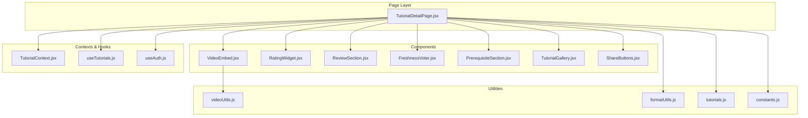
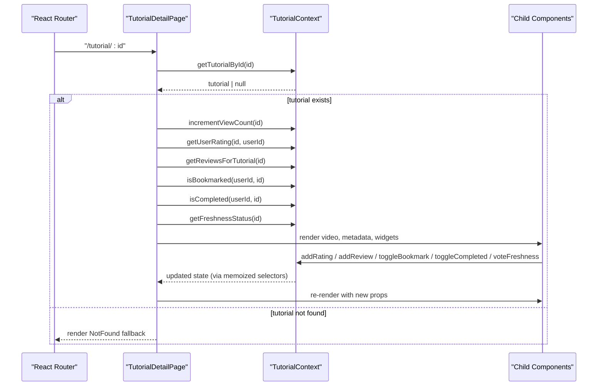
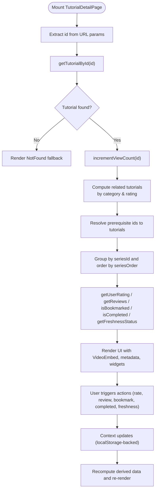
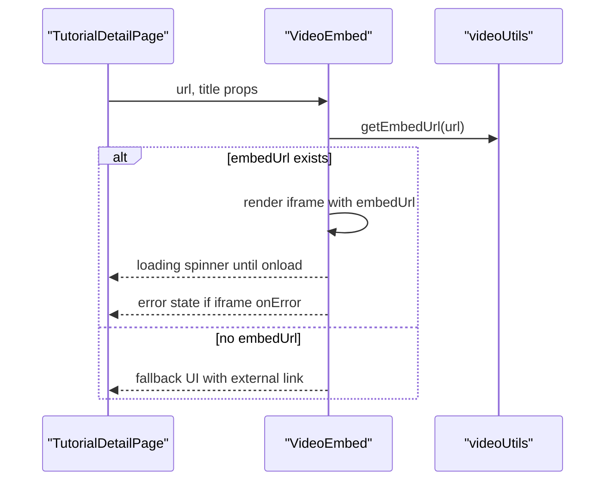
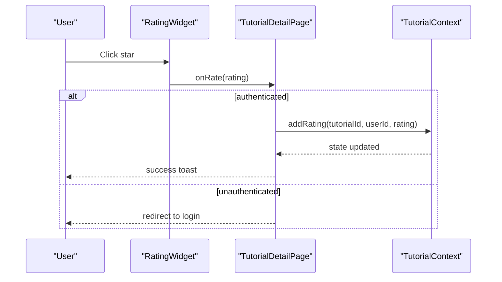
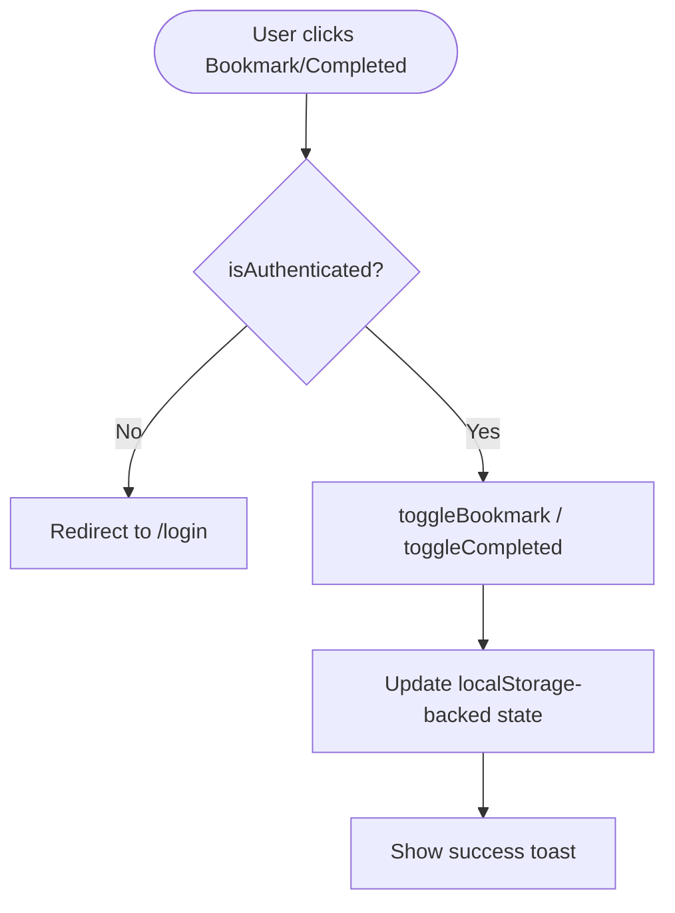
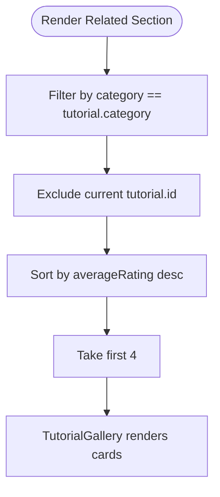
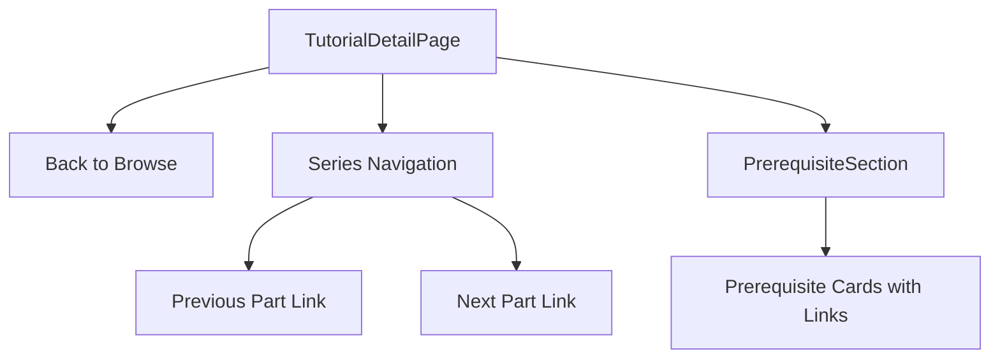
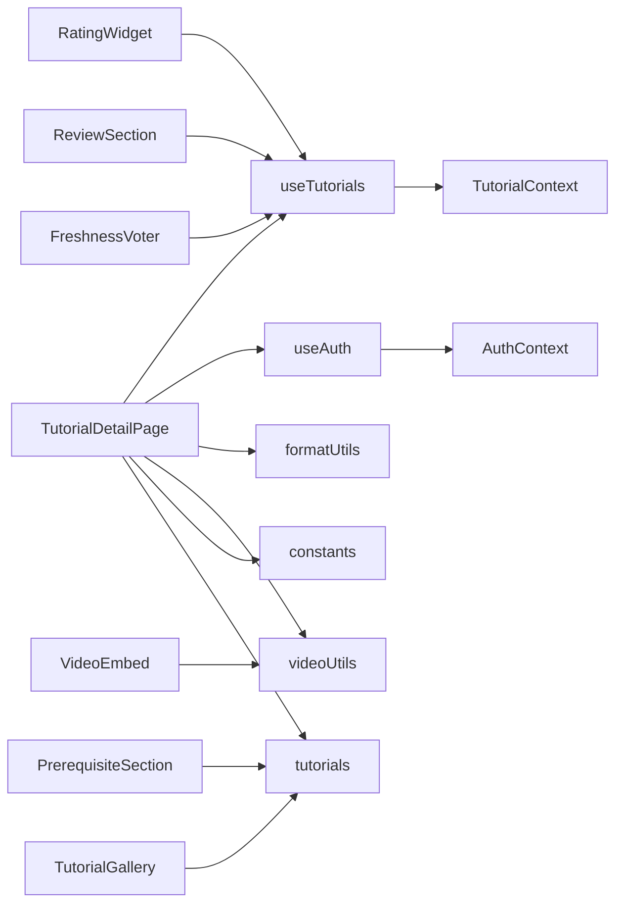

# Tutorial Detail Page

<cite>
**Referenced Files in This Document**
- [TutorialDetailPage.jsx](file://src/pages/TutorialDetailPage.jsx)
- [VideoEmbed.jsx](file://src/components/VideoEmbed.jsx)
- [RatingWidget.jsx](file://src/components/RatingWidget.jsx)
- [TutorialContext.jsx](file://src/contexts/TutorialContext.jsx)
- [useTutorials.js](file://src/hooks/useTutorials.js)
- [useAuth.js](file://src/hooks/useAuth.js)
- [videoUtils.js](file://src/utils/videoUtils.js)
- [tutorials.js](file://src/data/tutorials.js)
- [constants.js](file://src/data/constants.js)
- [formatUtils.js](file://src/utils/formatUtils.js)
- [PrerequisiteSection.jsx](file://src/components/PrerequisiteSection.jsx)
- [TutorialGallery.jsx](file://src/components/TutorialGallery.jsx)
- [ReviewSection.jsx](file://src/components/ReviewSection.jsx)
- [FreshnessVoter.jsx](file://src/components/FreshnessVoter.jsx)
- [ShareButtons.jsx](file://src/components/ShareButtons.jsx)
</cite>

## Table of Contents
1. [Introduction](#introduction)
2. [Project Structure](#project-structure)
3. [Core Components](#core-components)
4. [Architecture Overview](#architecture-overview)
5. [Detailed Component Analysis](#detailed-component-analysis)
6. [Dependency Analysis](#dependency-analysis)
7. [Performance Considerations](#performance-considerations)
8. [Troubleshooting Guide](#troubleshooting-guide)
9. [Conclusion](#conclusion)

## Introduction
This document describes the tutorial detail page functionality as the central hub for consuming tutorials. It covers the video player integration, metadata presentation, interactive features, data flow from URL parameters to state, rating system integration, bookmarking and completion tracking, related tutorial recommendations, navigation controls, and error handling for missing content and loading states.

## Project Structure
The tutorial detail page is implemented as a standalone page component that composes multiple specialized UI components and integrates with shared contexts and utilities:
- Page component orchestrates data retrieval, state computation, and renders child components
- Video embedding handles YouTube/Vimeo URLs and fallbacks
- Rating widget enables authenticated users to rate tutorials
- Context manages persisted state for ratings, reviews, bookmarks, completions, and freshness votes
- Utilities provide URL parsing, sanitization, and formatting helpers
- Related tutorials are computed from category and rating similarity

**Diagram sources**
- [TutorialDetailPage.jsx:1-296](file://src/pages/TutorialDetailPage.jsx#L1-L296)
- [VideoEmbed.jsx:1-87](file://src/components/VideoEmbed.jsx#L1-L87)
- [RatingWidget.jsx:1-84](file://src/components/RatingWidget.jsx#L1-L84)
- [TutorialContext.jsx:1-542](file://src/contexts/TutorialContext.jsx#L1-L542)
- [useTutorials.js:1-11](file://src/hooks/useTutorials.js#L1-L11)
- [useAuth.js:1-11](file://src/hooks/useAuth.js#L1-L11)
- [videoUtils.js:1-119](file://src/utils/videoUtils.js#L1-L119)
- [formatUtils.js:1-45](file://src/utils/formatUtils.js#L1-L45)
- [tutorials.js:1-522](file://src/data/tutorials.js#L1-L522)
- [constants.js:1-71](file://src/data/constants.js#L1-L71)

**Section sources**
- [TutorialDetailPage.jsx:1-296](file://src/pages/TutorialDetailPage.jsx#L1-L296)
- [TutorialContext.jsx:18-542](file://src/contexts/TutorialContext.jsx#L18-L542)

## Core Components
- TutorialDetailPage: Orchestrates data retrieval via URL params, computes derived data (related tutorials, prerequisites, series info), and renders all UI sections. It also handles user actions (rate, review, bookmark, mark completed, freshness voting) and navigates to login when required.
- VideoEmbed: Renders an iframe for YouTube/Vimeo videos, with loading states, fallbacks, and error handling.
- RatingWidget: Provides an interactive 1–5 star rating interface for authenticated users.
- TutorialContext: Centralized state for ratings, reviews, bookmarks, completions, freshness votes, and computed tutorial lists.
- videoUtils: Extracts platform and video ID, builds embed URLs, sanitizes external links, and checks availability.
- formatUtils: Formats durations, view counts, dates, and ratings consistently.
- PrerequisiteSection: Displays prerequisite tutorials with thumbnails and metadata.
- TutorialGallery: Renders a grid of tutorials with pagination and empty-state handling.
- ReviewSection: Manages posting reviews and sorting by helpfulness or recency.
- FreshnessVoter: Allows users to vote on tutorial freshness and displays consensus.
- ShareButtons: Copies link to clipboard and shares on social platforms.

**Section sources**
- [TutorialDetailPage.jsx:22-296](file://src/pages/TutorialDetailPage.jsx#L22-L296)
- [VideoEmbed.jsx:6-87](file://src/components/VideoEmbed.jsx#L6-L87)
- [RatingWidget.jsx:6-84](file://src/components/RatingWidget.jsx#L6-L84)
- [TutorialContext.jsx:18-542](file://src/contexts/TutorialContext.jsx#L18-L542)
- [videoUtils.js:28-119](file://src/utils/videoUtils.js#L28-L119)
- [formatUtils.js:1-45](file://src/utils/formatUtils.js#L1-L45)
- [PrerequisiteSection.jsx:9-41](file://src/components/PrerequisiteSection.jsx#L9-L41)
- [TutorialGallery.jsx:23-138](file://src/components/TutorialGallery.jsx#L23-L138)
- [ReviewSection.jsx:7-131](file://src/components/ReviewSection.jsx#L7-L131)
- [FreshnessVoter.jsx:5-55](file://src/components/FreshnessVoter.jsx#L5-L55)
- [ShareButtons.jsx:6-73](file://src/components/ShareButtons.jsx#L6-L73)

## Architecture Overview
The page follows a unidirectional data flow:
- URL parameters drive tutorial selection
- Context provides all tutorials and user-specific state
- Derived computations (related, prerequisites, series) occur in the page
- Child components render UI and trigger actions via callbacks
- Actions update local storage-backed state through context methods

**Diagram sources**
- [TutorialDetailPage.jsx:22-101](file://src/pages/TutorialDetailPage.jsx#L22-L101)
- [TutorialContext.jsx:83-131](file://src/contexts/TutorialContext.jsx#L83-L131)
- [TutorialContext.jsx:425-433](file://src/contexts/TutorialContext.jsx#L425-L433)

## Detailed Component Analysis

### TutorialDetailPage: Data Flow and State Management
- URL parameter extraction: Retrieves tutorial id from route params.
- Tutorial retrieval: Uses context-provided selector to fetch tutorial by id.
- Derived computations:
  - Related tutorials: Filter by same category and exclude current tutorial, sort by average rating descending, limit to 4 items.
  - Prerequisites: Map prerequisite ids to tutorial objects if present.
  - Series navigation: Group by seriesId, order by seriesOrder, compute previous/next items and current position.
- Side effect: Increments view count on mount.
- Authentication gating: Delegates actions requiring authentication to login when unauthenticated.
- Rendering: Composes VideoEmbed, metadata badges, prerequisites, description, tags, actions, FreshnessVoter, RatingWidget, ReviewSection, and related TutorialGallery.

**Diagram sources**
- [TutorialDetailPage.jsx:22-101](file://src/pages/TutorialDetailPage.jsx#L22-L101)
- [TutorialDetailPage.jsx:49-78](file://src/pages/TutorialDetailPage.jsx#L49-L78)
- [TutorialContext.jsx:83-131](file://src/contexts/TutorialContext.jsx#L83-L131)
- [TutorialContext.jsx:425-433](file://src/contexts/TutorialContext.jsx#L425-L433)

**Section sources**
- [TutorialDetailPage.jsx:22-101](file://src/pages/TutorialDetailPage.jsx#L22-L101)
- [TutorialDetailPage.jsx:49-78](file://src/pages/TutorialDetailPage.jsx#L49-L78)

### Video Player Integration: YouTube and External Platforms
- Embed URL construction: videoUtils extracts platform and videoId, then builds embed URLs for supported platforms.
- Fallback behavior: If embed URL is unavailable, renders a fallback with a link to the original site.
- Error handling: If iframe load fails, shows an error state with a link to the external platform.
- Sanitization: Ensures external links are valid before opening.

**Diagram sources**
- [VideoEmbed.jsx:6-87](file://src/components/VideoEmbed.jsx#L6-L87)
- [videoUtils.js:28-39](file://src/utils/videoUtils.js#L28-L39)

**Section sources**
- [VideoEmbed.jsx:6-87](file://src/components/VideoEmbed.jsx#L6-L87)
- [videoUtils.js:28-60](file://src/utils/videoUtils.js#L28-L60)

### Rating System Integration
- User ratings: Retrieved from context using tutorial id and user id.
- Widget behavior: Authenticated users can select stars; unauthenticated users see a login prompt.
- Submission: RatingWidget invokes callback to add rating; page shows success toast.
- Average rating display: StarDisplay receives tutorial average rating and rating count.

**Diagram sources**
- [RatingWidget.jsx:6-84](file://src/components/RatingWidget.jsx#L6-L84)
- [TutorialDetailPage.jsx:111-116](file://src/pages/TutorialDetailPage.jsx#L111-L116)
- [TutorialContext.jsx:90-101](file://src/contexts/TutorialContext.jsx#L90-L101)

**Section sources**
- [RatingWidget.jsx:6-84](file://src/components/RatingWidget.jsx#L6-L84)
- [TutorialDetailPage.jsx:103-116](file://src/pages/TutorialDetailPage.jsx#L103-L116)
- [TutorialContext.jsx:90-108](file://src/contexts/TutorialContext.jsx#L90-L108)

### Bookmarking and Completion Tracking
- Bookmark toggling: Requires authentication; otherwise redirects to login. Updates user bookmarks in context.
- Completion tracking: Tracks completed tutorials per user; toggles state and shows appropriate toast messages.
- Persistence: Both features persist via localStorage-backed context.

**Diagram sources**
- [TutorialDetailPage.jsx:125-141](file://src/pages/TutorialDetailPage.jsx#L125-L141)
- [TutorialContext.jsx:133-186](file://src/contexts/TutorialContext.jsx#L133-L186)

**Section sources**
- [TutorialDetailPage.jsx:125-141](file://src/pages/TutorialDetailPage.jsx#L125-L141)
- [TutorialContext.jsx:133-186](file://src/contexts/TutorialContext.jsx#L133-L186)

### Related Tutorial Recommendations
- Algorithm: Filter tutorials by matching category and excluding current tutorial, sort by average rating descending, take top 4.
- Presentation: Renders a TutorialGallery with “Related Tutorials” title.

**Diagram sources**
- [TutorialDetailPage.jsx:49-55](file://src/pages/TutorialDetailPage.jsx#L49-L55)
- [TutorialGallery.jsx:23-138](file://src/components/TutorialGallery.jsx#L23-L138)

**Section sources**
- [TutorialDetailPage.jsx:49-55](file://src/pages/TutorialDetailPage.jsx#L49-L55)

### Navigation Controls
- Back button: Link to browse/search.
- Series navigation: When tutorial belongs to a series, shows previous/next links based on seriesOrder.
- Prerequisite linking: Displays prerequisite cards with links to prerequisite tutorials.

**Diagram sources**
- [TutorialDetailPage.jsx:160-187](file://src/pages/TutorialDetailPage.jsx#L160-L187)
- [PrerequisiteSection.jsx:9-41](file://src/components/PrerequisiteSection.jsx#L9-L41)

**Section sources**
- [TutorialDetailPage.jsx:160-187](file://src/pages/TutorialDetailPage.jsx#L160-L187)
- [PrerequisiteSection.jsx:9-41](file://src/components/PrerequisiteSection.jsx#L9-L41)

### Metadata Presentation and Formatting
- Displays author, estimated duration, view count, creation date, average rating, and freshness badge.
- Uses formatUtils for consistent formatting of duration, view count, and relative dates.
- Tags rendered as followable tags with toggle support.

**Section sources**
- [TutorialDetailPage.jsx:200-234](file://src/pages/TutorialDetailPage.jsx#L200-L234)
- [formatUtils.js:1-45](file://src/utils/formatUtils.js#L1-L45)

### Reviews and Freshness Voting
- Reviews: Users can post reviews when authenticated; reviews are sorted by helpfulness or newest.
- Freshness voting: Community votes indicate whether tutorial still works or is outdated; user’s vote is highlighted.

**Section sources**
- [ReviewSection.jsx:7-131](file://src/components/ReviewSection.jsx#L7-L131)
- [FreshnessVoter.jsx:5-55](file://src/components/FreshnessVoter.jsx#L5-L55)
- [TutorialContext.jsx:259-303](file://src/contexts/TutorialContext.jsx#L259-L303)

### Sharing and External Links
- ShareButtons: Copy link to clipboard and share on Twitter, Discord, and Reddit.
- External watch link: Sanitized and opens in new tab with platform hint.

**Section sources**
- [ShareButtons.jsx:6-73](file://src/components/ShareButtons.jsx#L6-L73)
- [TutorialDetailPage.jsx:249-256](file://src/pages/TutorialDetailPage.jsx#L249-L256)
- [videoUtils.js:50-60](file://src/utils/videoUtils.js#L50-L60)

## Dependency Analysis
- Page depends on:
  - URL params for tutorial id
  - useAuth for authentication state
  - useTutorials for all tutorial operations and state
  - formatUtils for display formatting
  - videoUtils for embed URL and sanitization
  - constants for series metadata
  - data tutorials for defaults and initial dataset
- Components depend on:
  - PropTypes for shape validation
  - Shared utilities for cross-cutting concerns
- Context encapsulates:
  - LocalStorage-backed persistence
  - Derived computations (merged ratings/views, filtered/sorted lists)
  - Action methods for all user interactions

**Diagram sources**
- [TutorialDetailPage.jsx:1-22](file://src/pages/TutorialDetailPage.jsx#L1-L22)
- [useTutorials.js:1-11](file://src/hooks/useTutorials.js#L1-L11)
- [useAuth.js:1-11](file://src/hooks/useAuth.js#L1-L11)
- [TutorialContext.jsx:18-542](file://src/contexts/TutorialContext.jsx#L18-L542)
- [videoUtils.js:1-119](file://src/utils/videoUtils.js#L1-L119)
- [formatUtils.js:1-45](file://src/utils/formatUtils.js#L1-L45)
- [tutorials.js:1-522](file://src/data/tutorials.js#L1-L522)
- [constants.js:24-28](file://src/data/constants.js#L24-L28)

**Section sources**
- [TutorialDetailPage.jsx:1-22](file://src/pages/TutorialDetailPage.jsx#L1-L22)
- [TutorialContext.jsx:18-542](file://src/contexts/TutorialContext.jsx#L18-L542)

## Performance Considerations
- Memoization: Related tutorials and prerequisite lists are computed with useMemo to avoid unnecessary recalculations when dependencies change.
- Derived computations: Context merges default tutorials with submissions and overlays dynamic view counts and ratings to minimize repeated calculations.
- Pagination: TutorialGallery supports pagination to limit DOM rendering for long lists.
- Lazy loading: VideoEmbed defers rendering of iframe content until embed URL is available.

[No sources needed since this section provides general guidance]

## Troubleshooting Guide
- Missing tutorial:
  - Behavior: Renders a not-found message with a link to browse tutorials.
  - Action: Ensure the tutorial id exists in data or submissions.
- Video unavailable:
  - Behavior: Shows error state with platform hint and external link.
  - Action: Verify URL validity and platform support; check network connectivity.
- Authentication-required actions:
  - Behavior: Redirects to login for bookmark/completed/rating/freshness voting.
  - Action: Ensure user is logged in before invoking these actions.
- Rating not saving:
  - Behavior: No-op if user is unauthenticated.
  - Action: Confirm authentication state and that onRate callback is invoked.
- Reviews not posting:
  - Behavior: Prompt to log in or enforce minimum length.
  - Action: Ensure user is authenticated and text meets minimum length.

**Section sources**
- [TutorialDetailPage.jsx:87-101](file://src/pages/TutorialDetailPage.jsx#L87-L101)
- [VideoEmbed.jsx:40-60](file://src/components/VideoEmbed.jsx#L40-L60)
- [RatingWidget.jsx:11-17](file://src/components/RatingWidget.jsx#L11-L17)
- [ReviewSection.jsx:58-62](file://src/components/ReviewSection.jsx#L58-L62)

## Conclusion
The tutorial detail page consolidates tutorial consumption with robust integrations for video playback, metadata display, and interactive features. Its architecture leverages a centralized context for state management, memoized computations for performance, and modular components for maintainability. The design ensures clear user flows for ratings, reviews, bookmarks, completion tracking, and series navigation while gracefully handling missing content and loading states.