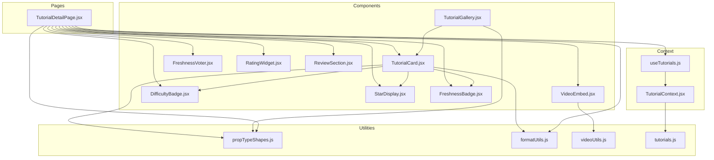
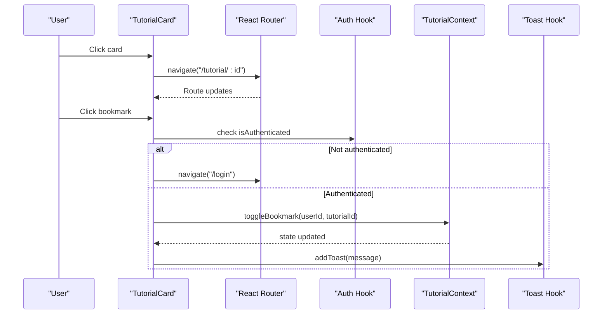
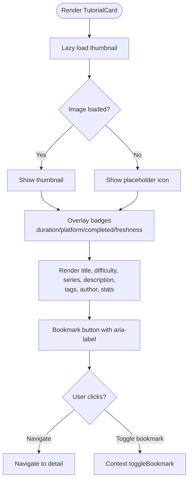
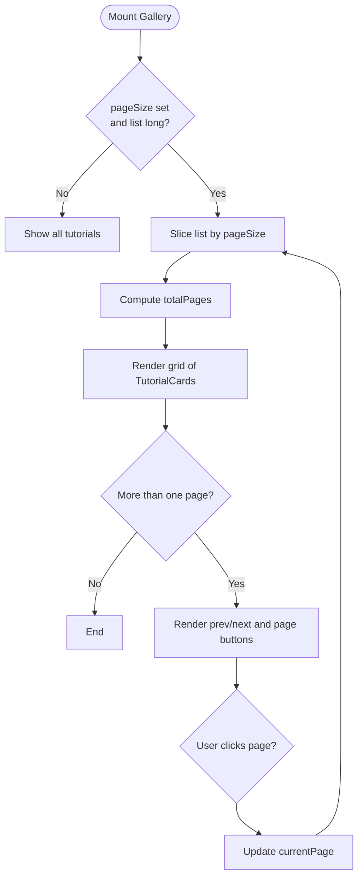
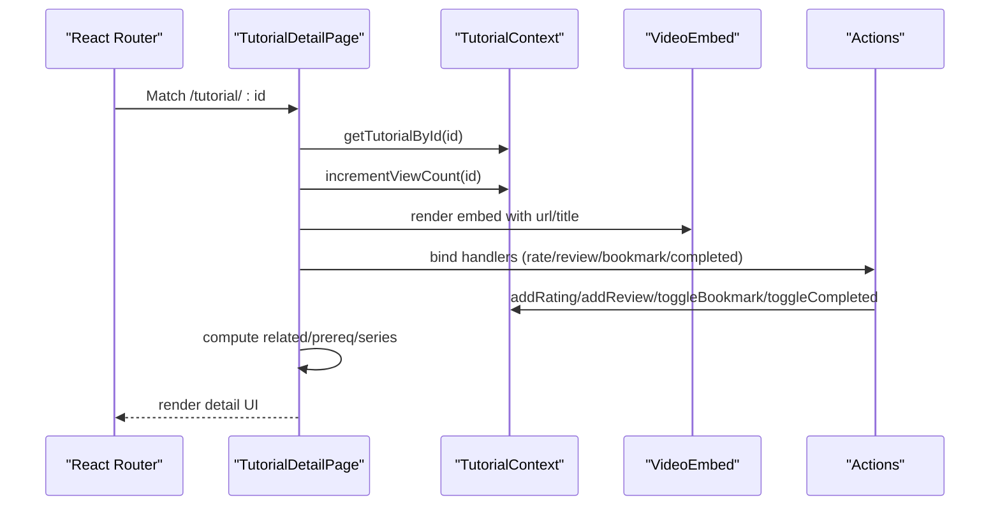
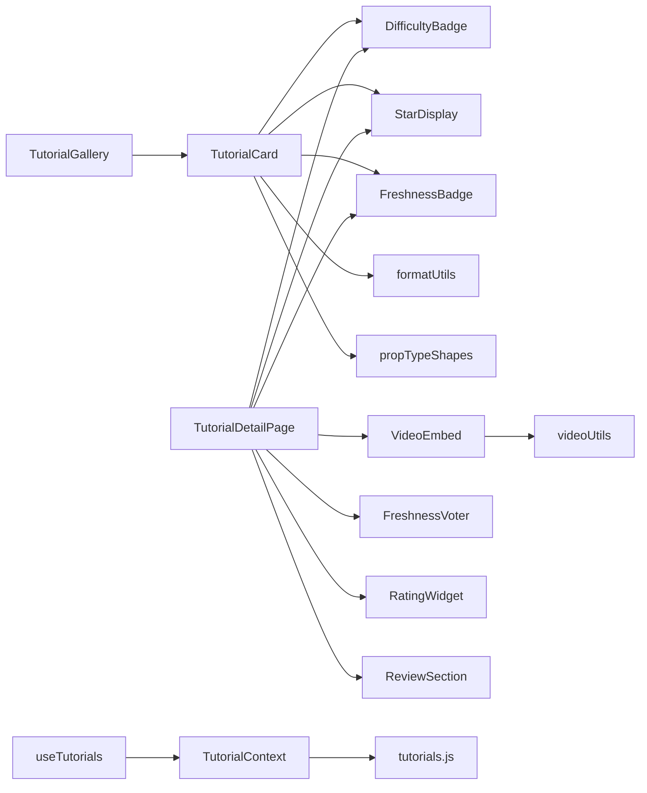

# Tutorial Display Components

<cite>
**Referenced Files in This Document**
- [TutorialCard.jsx](file://src/components/TutorialCard.jsx)
- [TutorialCard.module.css](file://src/components/TutorialCard.module.css)
- [TutorialGallery.jsx](file://src/components/TutorialGallery.jsx)
- [TutorialGallery.module.css](file://src/components/TutorialGallery.module.css)
- [TutorialDetailPage.jsx](file://src/pages/TutorialDetailPage.jsx)
- [TutorialDetailPage.module.css](file://src/pages/TutorialDetailPage.module.css)
- [VideoEmbed.jsx](file://src/components/VideoEmbed.jsx)
- [VideoEmbed.module.css](file://src/components/VideoEmbed.module.css)
- [useTutorials.js](file://src/hooks/useTutorials.js)
- [TutorialContext.jsx](file://src/contexts/TutorialContext.jsx)
- [propTypeShapes.js](file://src/utils/propTypeShapes.js)
- [formatUtils.js](file://src/utils/formatUtils.js)
- [videoUtils.js](file://src/utils/videoUtils.js)
- [tutorials.js](file://src/data/tutorials.js)
- [DifficultyBadge.jsx](file://src/components/DifficultyBadge.jsx)
- [StarDisplay.jsx](file://src/components/StarDisplay.jsx)
- [FreshnessBadge.jsx](file://src/components/FreshnessBadge.jsx)
- [FreshnessVoter.jsx](file://src/components/FreshnessVoter.jsx)
- [RatingWidget.jsx](file://src/components/RatingWidget.jsx)
- [ReviewSection.jsx](file://src/components/ReviewSection.jsx)
</cite>

## Table of Contents
1. [Introduction](#introduction)
2. [Project Structure](#project-structure)
3. [Core Components](#core-components)
4. [Architecture Overview](#architecture-overview)
5. [Detailed Component Analysis](#detailed-component-analysis)
6. [Dependency Analysis](#dependency-analysis)
7. [Performance Considerations](#performance-considerations)
8. [Troubleshooting Guide](#troubleshooting-guide)
9. [Conclusion](#conclusion)

## Introduction
This document explains the tutorial display components in GameDev Hub: TutorialCard, TutorialGallery, and TutorialDetailPage. It covers their layout, metadata rendering, interactive controls (ratings, bookmarks, completion tracking), video embedding, and social features. It also documents props, state management via context, styling patterns, responsive design, accessibility, and performance considerations such as lazy loading and pagination.

## Project Structure
The tutorial display system is composed of:
- Presentational components for cards, galleries, and detail pages
- Utility modules for formatting, video handling, and prop types
- A central TutorialContext providing state and actions
- Shared UI helpers (badges, stars, freshness voting, reviews, ratings)

**Diagram sources**
- [TutorialDetailPage.jsx:1-296](file://src/pages/TutorialDetailPage.jsx#L1-L296)
- [TutorialCard.jsx:1-110](file://src/components/TutorialCard.jsx#L1-L110)
- [TutorialGallery.jsx:1-138](file://src/components/TutorialGallery.jsx#L1-L138)
- [VideoEmbed.jsx:1-87](file://src/components/VideoEmbed.jsx#L1-L87)
- [useTutorials.js:1-11](file://src/hooks/useTutorials.js#L1-L11)
- [TutorialContext.jsx:1-542](file://src/contexts/TutorialContext.jsx#L1-L542)
- [propTypeShapes.js:1-37](file://src/utils/propTypeShapes.js#L1-L37)
- [formatUtils.js:1-45](file://src/utils/formatUtils.js#L1-L45)
- [videoUtils.js:1-119](file://src/utils/videoUtils.js#L1-L119)
- [tutorials.js:1-522](file://src/data/tutorials.js#L1-L522)

**Section sources**
- [TutorialDetailPage.jsx:1-296](file://src/pages/TutorialDetailPage.jsx#L1-L296)
- [TutorialCard.jsx:1-110](file://src/components/TutorialCard.jsx#L1-L110)
- [TutorialGallery.jsx:1-138](file://src/components/TutorialGallery.jsx#L1-L138)
- [VideoEmbed.jsx:1-87](file://src/components/VideoEmbed.jsx#L1-L87)
- [useTutorials.js:1-11](file://src/hooks/useTutorials.js#L1-L11)
- [TutorialContext.jsx:1-542](file://src/contexts/TutorialContext.jsx#L1-L542)
- [propTypeShapes.js:1-37](file://src/utils/propTypeShapes.js#L1-L37)
- [formatUtils.js:1-45](file://src/utils/formatUtils.js#L1-L45)
- [videoUtils.js:1-119](file://src/utils/videoUtils.js#L1-L119)
- [tutorials.js:1-522](file://src/data/tutorials.js#L1-L522)

## Core Components
- TutorialCard: Renders a single tutorial with thumbnail, duration, platform badge, freshness indicator, difficulty, tags, author, stats, and a bookmark button. Supports lazy image loading and fallback placeholders. Click navigates to the detail page.
- TutorialGallery: Displays a collection of tutorials in a responsive grid, supports pagination, result count, and empty state with optional filter clearing.
- TutorialDetailPage: Full-screen detail view with video embed, metadata, series navigation, prerequisites, tags, actions (completed/bookmark), sharing, freshness voting, rating widget, and related tutorials.

**Section sources**
- [TutorialCard.jsx:14-105](file://src/components/TutorialCard.jsx#L14-L105)
- [TutorialGallery.jsx:23-125](file://src/components/TutorialGallery.jsx#L23-L125)
- [TutorialDetailPage.jsx:22-296](file://src/pages/TutorialDetailPage.jsx#L22-L296)

## Architecture Overview
The components rely on a shared TutorialContext for state and actions:
- useTutorials hook retrieves context-bound functions and data
- Context manages local storage-backed state for ratings, reviews, bookmarks, completions, freshness votes, followed tags, and filters/sorting preferences
- Utilities provide formatting and video platform handling

**Diagram sources**
- [TutorialCard.jsx:25-37](file://src/components/TutorialCard.jsx#L25-L37)
- [useTutorials.js:4-10](file://src/hooks/useTutorials.js#L4-L10)
- [TutorialContext.jsx:133-147](file://src/contexts/TutorialContext.jsx#L133-L147)

**Section sources**
- [TutorialCard.jsx:14-105](file://src/components/TutorialCard.jsx#L14-L105)
- [TutorialContext.jsx:1-542](file://src/contexts/TutorialContext.jsx#L1-L542)
- [useTutorials.js:1-11](file://src/hooks/useTutorials.js#L1-L11)

## Detailed Component Analysis

### TutorialCard
- Purpose: Compact, clickable card representing a tutorial with thumbnail, metadata, and interactive elements.
- Props:
  - tutorial: shape validated by tutorialShape
- State:
  - imgError: toggles placeholder when thumbnail fails to load
- Interactions:
  - Navigation to detail page on click
  - Bookmark toggle with authentication guard
- Metadata rendering:
  - Duration badge, platform badge, difficulty badge, freshness badge, series badge, tags, author, view count, star rating
- Styling:
  - Aspect-ratio-preserving thumbnail wrapper, hover effects, badges positioned absolutely, tag chips, and compact stat row
- Accessibility:
  - Clickable container with role and tabIndex for keyboard navigation
  - aria-labels for buttons

**Diagram sources**
- [TutorialCard.jsx:14-105](file://src/components/TutorialCard.jsx#L14-L105)
- [TutorialCard.module.css:1-244](file://src/components/TutorialCard.module.css#L1-L244)

**Section sources**
- [TutorialCard.jsx:14-105](file://src/components/TutorialCard.jsx#L14-L105)
- [TutorialCard.module.css:1-244](file://src/components/TutorialCard.module.css#L1-L244)
- [propTypeShapes.js:3-26](file://src/utils/propTypeShapes.js#L3-L26)
- [formatUtils.js:1-45](file://src/utils/formatUtils.js#L1-L45)

### TutorialGallery
- Purpose: Grid-based browsing of tutorials with pagination, result count, and empty state handling.
- Props:
  - tutorials: array of tutorialShape
  - title/subtitle/viewAllLink: section header
  - showCount: whether to show result count
  - emptyTitle/emptyMessage/onClearFilters: empty state UX
  - pageSize: pagination chunk size
- Behavior:
  - Calculates current page and paginated slice
  - Generates page number list with ellipses for large ranges
  - Resets to page 1 when tutorial list changes
- Responsive grid:
  - CSS Grid with auto-fill minmax, adjusted breakpoints for tablet/mobile

**Diagram sources**
- [TutorialGallery.jsx:23-125](file://src/components/TutorialGallery.jsx#L23-L125)
- [TutorialGallery.module.css:38-65](file://src/components/TutorialGallery.module.css#L38-L65)

**Section sources**
- [TutorialGallery.jsx:23-125](file://src/components/TutorialGallery.jsx#L23-L125)
- [TutorialGallery.module.css:1-114](file://src/components/TutorialGallery.module.css#L1-L114)

### TutorialDetailPage
- Purpose: Single-page tutorial detail with video, metadata, actions, and social features.
- Data:
  - Fetches tutorial by ID, computes related tutorials and prerequisites, resolves series info
  - Increments view count on mount
- Interactive controls:
  - Mark as completed
  - Bookmark toggle
  - External watch link
  - Freshness voting
  - Rating widget
  - Reviews section with sorting and voting
- Composition:
  - VideoEmbed for iframe
  - DifficultyBadge, StarDisplay, FreshnessBadge
  - FreshnessVoter, RatingWidget, ReviewSection
  - Nested TutorialGallery for related tutorials

**Diagram sources**
- [TutorialDetailPage.jsx:22-296](file://src/pages/TutorialDetailPage.jsx#L22-L296)
- [VideoEmbed.jsx:6-81](file://src/components/VideoEmbed.jsx#L6-L81)
- [TutorialContext.jsx:83-433](file://src/contexts/TutorialContext.jsx#L83-L433)

**Section sources**
- [TutorialDetailPage.jsx:22-296](file://src/pages/TutorialDetailPage.jsx#L22-L296)
- [TutorialDetailPage.module.css:1-268](file://src/pages/TutorialDetailPage.module.css#L1-L268)
- [VideoEmbed.jsx:1-87](file://src/components/VideoEmbed.jsx#L1-L87)
- [TutorialContext.jsx:1-542](file://src/contexts/TutorialContext.jsx#L1-L542)

### Supporting Components and Utilities
- VideoEmbed: Renders responsive iframe with loading and error states; falls back to external link when embed is unavailable.
- DifficultyBadge, StarDisplay, FreshnessBadge: Reusable badges for difficulty, rating, and freshness status.
- FreshnessVoter: Allows authenticated users to vote “still works” or “outdated.”
- RatingWidget: Accessible 1–5 star rating with keyboard navigation and focus management.
- ReviewSection: Displays reviews with sorting, voting, and submission form.

**Section sources**
- [VideoEmbed.jsx:1-87](file://src/components/VideoEmbed.jsx#L1-L87)
- [VideoEmbed.module.css:1-94](file://src/components/VideoEmbed.module.css#L1-L94)
- [DifficultyBadge.jsx:1-22](file://src/components/DifficultyBadge.jsx#L1-L22)
- [StarDisplay.jsx:1-49](file://src/components/StarDisplay.jsx#L1-L49)
- [FreshnessBadge.jsx:1-32](file://src/components/FreshnessBadge.jsx#L1-L32)
- [FreshnessVoter.jsx:1-55](file://src/components/FreshnessVoter.jsx#L1-L55)
- [RatingWidget.jsx:1-84](file://src/components/RatingWidget.jsx#L1-L84)
- [ReviewSection.jsx:1-131](file://src/components/ReviewSection.jsx#L1-L131)

## Dependency Analysis
- Component dependencies:
  - TutorialCard depends on DifficultyBadge, StarDisplay, FreshnessBadge, formatUtils, propTypeShapes, and context hooks
  - TutorialGallery composes TutorialCard and uses EmptyState indirectly via its rendering branch
  - TutorialDetailPage composes VideoEmbed, badges, widgets, and sections
- Context and hooks:
  - useTutorials provides all CRUD-like actions and getters
  - TutorialContext persists state in localStorage and merges default tutorials with submissions
- Utilities:
  - formatUtils: duration, view count, dates, rating formatting
  - videoUtils: embed URL extraction, sanitization, availability checks

**Diagram sources**
- [TutorialCard.jsx:1-12](file://src/components/TutorialCard.jsx#L1-L12)
- [TutorialGallery.jsx:1-7](file://src/components/TutorialGallery.jsx#L1-L7)
- [TutorialDetailPage.jsx:1-20](file://src/pages/TutorialDetailPage.jsx#L1-L20)
- [useTutorials.js:1-11](file://src/hooks/useTutorials.js#L1-L11)
- [TutorialContext.jsx:1-6](file://src/contexts/TutorialContext.jsx#L1-L6)
- [formatUtils.js:1-45](file://src/utils/formatUtils.js#L1-L45)
- [videoUtils.js:1-119](file://src/utils/videoUtils.js#L1-L119)
- [tutorials.js:1-522](file://src/data/tutorials.js#L1-L522)

**Section sources**
- [TutorialCard.jsx:1-12](file://src/components/TutorialCard.jsx#L1-L12)
- [TutorialGallery.jsx:1-7](file://src/components/TutorialGallery.jsx#L1-L7)
- [TutorialDetailPage.jsx:1-20](file://src/pages/TutorialDetailPage.jsx#L1-L20)
- [useTutorials.js:1-11](file://src/hooks/useTutorials.js#L1-L11)
- [TutorialContext.jsx:1-6](file://src/contexts/TutorialContext.jsx#L1-L6)
- [formatUtils.js:1-45](file://src/utils/formatUtils.js#L1-L45)
- [videoUtils.js:1-119](file://src/utils/videoUtils.js#L1-L119)
- [tutorials.js:1-522](file://src/data/tutorials.js#L1-L522)

## Performance Considerations
- Lazy loading:
  - TutorialCard uses lazy loading for thumbnails and a fallback placeholder on error
  - VideoEmbed defers iframe loading until ready and shows a spinner while loading
- Pagination:
  - TutorialGallery slices large lists to reduce DOM nodes rendered at once
- Memoization:
  - TutorialDetailPage uses useMemo for derived data (related, prerequisites, series) to avoid recomputation on renders
- Virtualization:
  - Not implemented in the current codebase; consider implementing virtualized lists for very large tutorial sets to improve scroll performance
- Image optimization:
  - Prefer modern formats and appropriate sizes; current code relies on platform thumbnails

**Section sources**
- [TutorialCard.jsx:47-48](file://src/components/TutorialCard.jsx#L47-L48)
- [VideoEmbed.jsx:12-19](file://src/components/VideoEmbed.jsx#L12-L19)
- [TutorialDetailPage.jsx:49-78](file://src/pages/TutorialDetailPage.jsx#L49-L78)
- [TutorialGallery.jsx:42-44](file://src/components/TutorialGallery.jsx#L42-L44)

## Troubleshooting Guide
- Video not loading:
  - VideoEmbed handles fallbacks and error states; verify URL validity and platform support
- Thumbnail missing:
  - TutorialCard switches to a placeholder when images fail to load
- Authentication gating:
  - Bookmark and rating actions redirect to login when not authenticated
- Freshness votes:
  - FreshnessVoter is disabled for unauthenticated users; ensure proper auth state is passed
- Pagination issues:
  - Changing filters resets page to 1; confirm pageSize and list length are set appropriately

**Section sources**
- [VideoEmbed.jsx:21-60](file://src/components/VideoEmbed.jsx#L21-L60)
- [TutorialCard.jsx:19-37](file://src/components/TutorialCard.jsx#L19-L37)
- [FreshnessVoter.jsx:23-42](file://src/components/FreshnessVoter.jsx#L23-L42)
- [TutorialGallery.jsx:36-38](file://src/components/TutorialGallery.jsx#L36-L38)

## Conclusion
The tutorial display system combines reusable presentational components with a centralized context for state and persistence. It emphasizes responsive design, accessibility, and performance through lazy loading and pagination. The architecture supports extensibility for features like virtualization and advanced filtering while maintaining clean separation of concerns.