# Tutorial Management System

<cite>
**Referenced Files in This Document**
- [tutorials.js](file://src/data/tutorials.js)
- [constants.js](file://src/data/constants.js)
- [TutorialContext.jsx](file://src/contexts/TutorialContext.jsx)
- [useTutorials.js](file://src/hooks/useTutorials.js)
- [TutorialCard.jsx](file://src/components/TutorialCard.jsx)
- [TutorialGallery.jsx](file://src/components/TutorialGallery.jsx)
- [TutorialDetailPage.jsx](file://src/pages/TutorialDetailPage.jsx)
- [SubmitPage.jsx](file://src/pages/SubmitPage.jsx)
- [VideoEmbed.jsx](file://src/components/VideoEmbed.jsx)
- [PrerequisiteSection.jsx](file://src/components/PrerequisiteSection.jsx)
- [FreshnessVoter.jsx](file://src/components/FreshnessVoter.jsx)
- [filterUtils.js](file://src/utils/filterUtils.js)
- [formatUtils.js](file://src/utils/formatUtils.js)
- [videoUtils.js](file://src/utils/videoUtils.js)
</cite>

## Table of Contents
1. [Introduction](#introduction)
2. [Project Structure](#project-structure)
3. [Core Components](#core-components)
4. [Architecture Overview](#architecture-overview)
5. [Detailed Component Analysis](#detailed-component-analysis)
6. [Dependency Analysis](#dependency-analysis)
7. [Performance Considerations](#performance-considerations)
8. [Troubleshooting Guide](#troubleshooting-guide)
9. [Conclusion](#conclusion)
10. [Appendices](#appendices)

## Introduction
This document describes GameDev Hub’s tutorial management system. It covers the tutorial data model, display components, submission workflow, prerequisite handling, freshness voting, series organization, author management features, recommendations, and progress tracking. The goal is to help developers and contributors understand how tutorials are modeled, curated, presented, and interacted with across the application.

## Project Structure
The tutorial system spans data, context, components, pages, utilities, and constants. Key areas:
- Data: Static tutorial dataset and constants for categories, difficulties, platforms, series, and sorting.
- Context: Centralized state for tutorials, filters, ratings, reviews, bookmarks, completions, freshness votes, and author submissions.
- Components: Reusable UI elements for cards, galleries, video embedding, prerequisites, and freshness voting.
- Pages: Entry points for browsing, detail viewing, and submission.
- Utilities: Filtering, formatting, and video URL processing helpers.

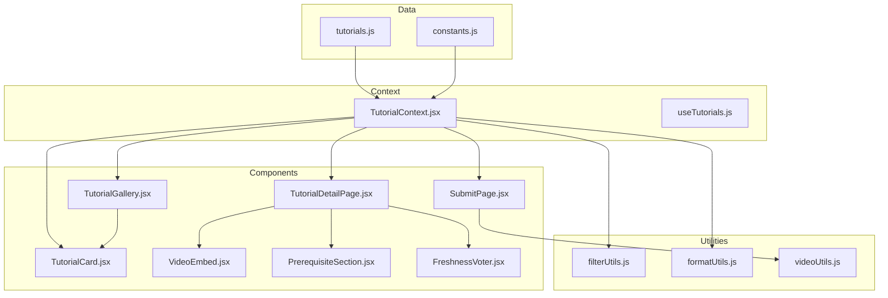

**Diagram sources**
- [tutorials.js:1-522](file://src/data/tutorials.js#L1-L522)
- [constants.js:1-71](file://src/data/constants.js#L1-L71)
- [TutorialContext.jsx:1-542](file://src/contexts/TutorialContext.jsx#L1-L542)
- [useTutorials.js:1-11](file://src/hooks/useTutorials.js#L1-L11)
- [TutorialCard.jsx:1-110](file://src/components/TutorialCard.jsx#L1-L110)
- [TutorialGallery.jsx:1-138](file://src/components/TutorialGallery.jsx#L1-L138)
- [TutorialDetailPage.jsx:1-296](file://src/pages/TutorialDetailPage.jsx#L1-L296)
- [SubmitPage.jsx:1-388](file://src/pages/SubmitPage.jsx#L1-L388)
- [VideoEmbed.jsx:1-87](file://src/components/VideoEmbed.jsx#L1-L87)
- [PrerequisiteSection.jsx:1-41](file://src/components/PrerequisiteSection.jsx#L1-L41)
- [FreshnessVoter.jsx:1-55](file://src/components/FreshnessVoter.jsx#L1-L55)
- [filterUtils.js:1-99](file://src/utils/filterUtils.js#L1-L99)
- [formatUtils.js:1-45](file://src/utils/formatUtils.js#L1-L45)
- [videoUtils.js:1-119](file://src/utils/videoUtils.js#L1-L119)

**Section sources**
- [tutorials.js:1-522](file://src/data/tutorials.js#L1-L522)
- [constants.js:1-71](file://src/data/constants.js#L1-L71)
- [TutorialContext.jsx:18-71](file://src/contexts/TutorialContext.jsx#L18-L71)

## Core Components
- Tutorial data model: Rich metadata, ratings, prerequisites, series, author, timestamps, and counts.
- Tutorial display: Grid cards, gallery pagination, and detail page with embedded player, ratings, reviews, sharing, and bookmarks.
- Submission pipeline: Form validation, video URL processing, category/difficulty/platform assignment, and optional prerequisites.
- Community features: Freshness voting, review voting, and tag following for “For You” recommendations.
- Author tools: Edit/delete own submissions.
- Progress tracking: Completion toggles and counts.

**Section sources**
- [tutorials.js:2-203](file://src/data/tutorials.js#L2-L203)
- [TutorialContext.jsx:83-494](file://src/contexts/TutorialContext.jsx#L83-L494)
- [SubmitPage.jsx:78-173](file://src/pages/SubmitPage.jsx#L78-L173)
- [TutorialDetailPage.jsx:49-78](file://src/pages/TutorialDetailPage.jsx#L49-L78)

## Architecture Overview
The system centers around a React Context that merges static tutorials with approved submissions, overlays dynamic user data (ratings, reviews, bookmarks, completions, votes), and exposes filtering/sorting. Pages and components consume this context via a small hook.

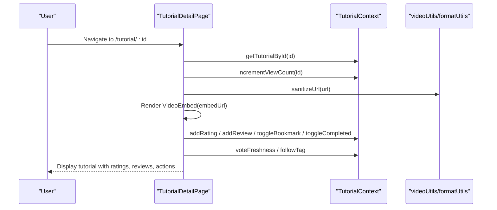

**Diagram sources**
- [TutorialDetailPage.jsx:22-156](file://src/pages/TutorialDetailPage.jsx#L22-L156)
- [TutorialContext.jsx:425-433](file://src/contexts/TutorialContext.jsx#L425-L433)
- [videoUtils.js:50-60](file://src/utils/videoUtils.js#L50-L60)

## Detailed Component Analysis

### Tutorial Data Model
- Fields include identifiers, title, description, video URL and derived videoId/thumbnailUrl, category, difficulty, platform, engineVersion, tags, estimatedDuration, author, timestamps, viewCount, averageRating, ratingCount, isFeatured, seriesId/seriesOrder, and optional prerequisites.
- Series: Grouped by seriesId with numeric ordering for navigation.
- Prerequisites: Array of tutorial IDs indicating required prior knowledge.

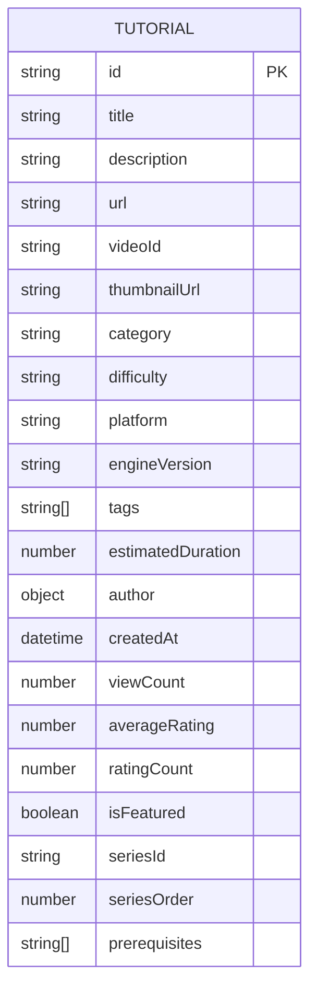

**Diagram sources**
- [tutorials.js:2-203](file://src/data/tutorials.js#L2-L203)

**Section sources**
- [tutorials.js:2-203](file://src/data/tutorials.js#L2-L203)
- [constants.js:24-28](file://src/data/constants.js#L24-L28)

### Tutorial Display Components

#### TutorialCard
- Renders a single tutorial card with thumbnail, duration, platform badge, completion indicator, freshness badge, bookmark button, title, difficulty, series badge, description, tags, author, and stats.
- Integrates with local storage for bookmarks and completion state.

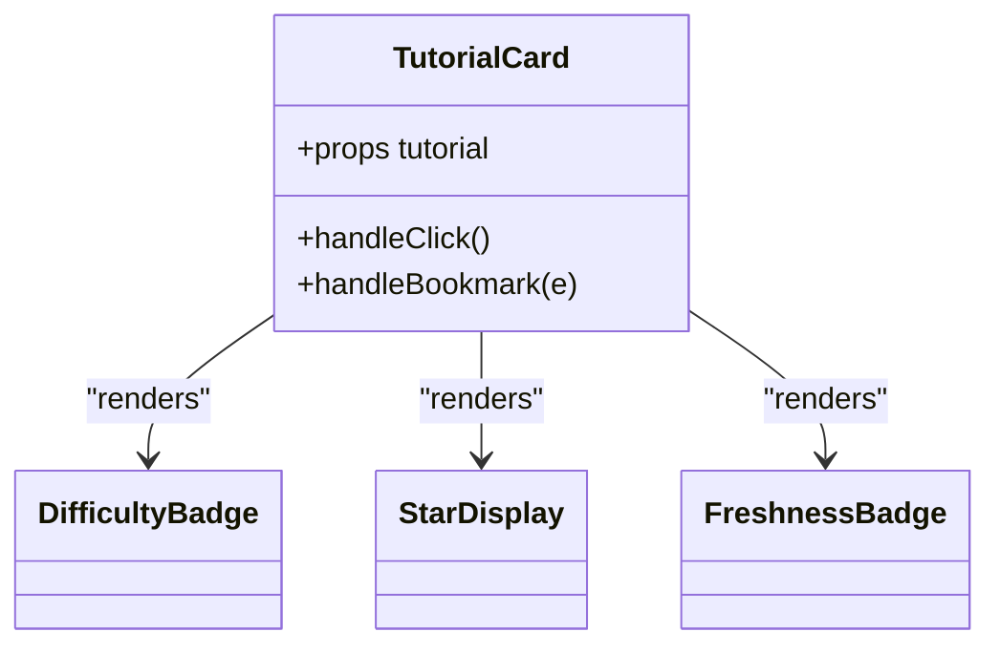

**Diagram sources**
- [TutorialCard.jsx:14-105](file://src/components/TutorialCard.jsx#L14-L105)

**Section sources**
- [TutorialCard.jsx:14-105](file://src/components/TutorialCard.jsx#L14-L105)

#### TutorialGallery
- Presents a paginated grid of TutorialCards with optional header, count, and view-all link.
- Handles pagination logic and empty states.

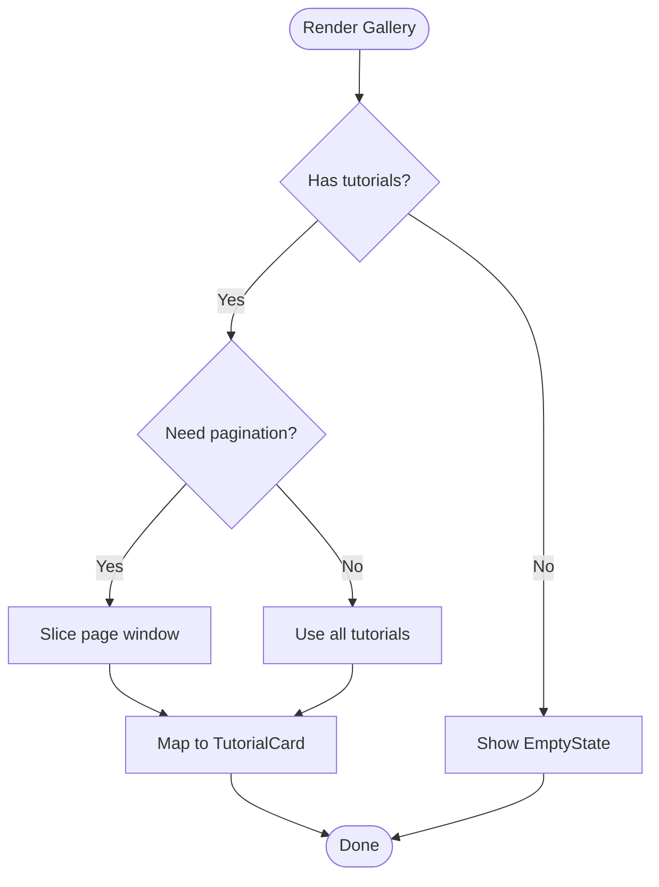

**Diagram sources**
- [TutorialGallery.jsx:23-125](file://src/components/TutorialGallery.jsx#L23-L125)

**Section sources**
- [TutorialGallery.jsx:23-125](file://src/components/TutorialGallery.jsx#L23-L125)

#### TutorialDetailPage
- Full-detail view with embedded video, metadata row, prerequisites, description, tags with follow/unfollow, actions (completed/bookmark), external watch link, share buttons, freshness voter, rating widget, review section, and related tutorials.

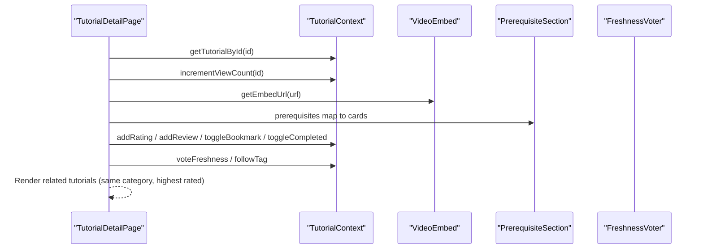

**Diagram sources**
- [TutorialDetailPage.jsx:22-296](file://src/pages/TutorialDetailPage.jsx#L22-L296)
- [VideoEmbed.jsx:6-81](file://src/components/VideoEmbed.jsx#L6-L81)
- [PrerequisiteSection.jsx:9-36](file://src/components/PrerequisiteSection.jsx#L9-L36)
- [FreshnessVoter.jsx:5-43](file://src/components/FreshnessVoter.jsx#L5-L43)

**Section sources**
- [TutorialDetailPage.jsx:22-296](file://src/pages/TutorialDetailPage.jsx#L22-L296)

### Tutorial Submission Process
- Form collects title, URL, description, category, difficulty, platform, engine version, duration, tags, and optional prerequisites.
- Validation enforces length bounds, required fields, and video URL format.
- Availability check uses oEmbed endpoints; thumbnails extracted for supported platforms.
- On submit, a new submission is created with metadata, videoId, thumbnailUrl, author, and status.

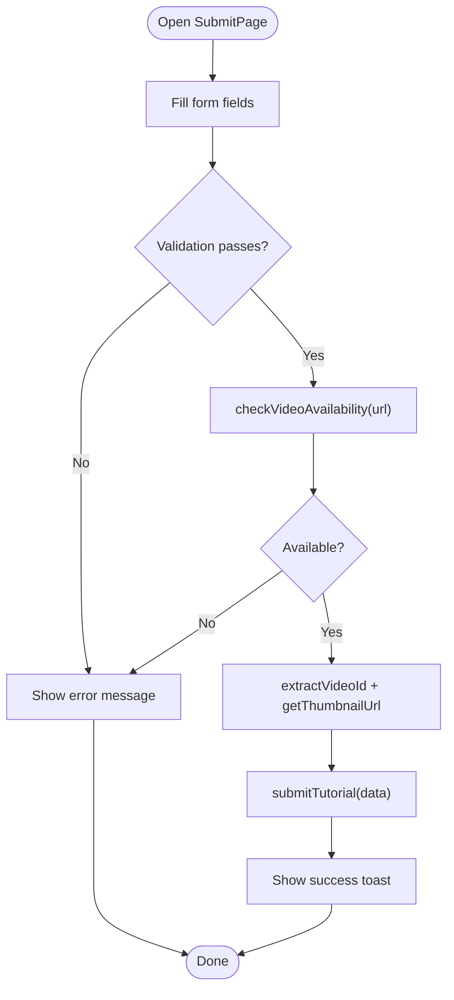

**Diagram sources**
- [SubmitPage.jsx:78-173](file://src/pages/SubmitPage.jsx#L78-L173)
- [videoUtils.js:67-118](file://src/utils/videoUtils.js#L67-L118)

**Section sources**
- [SubmitPage.jsx:78-173](file://src/pages/SubmitPage.jsx#L78-L173)
- [videoUtils.js:3-26](file://src/utils/videoUtils.js#L3-L26)

### Prerequisite Handling
- PrerequisiteSection displays linked prerequisite cards with thumbnails, durations, difficulty badges, and platform tags.
- TutorialDetailPage builds prerequisite list from tutorial.prerequisites IDs.

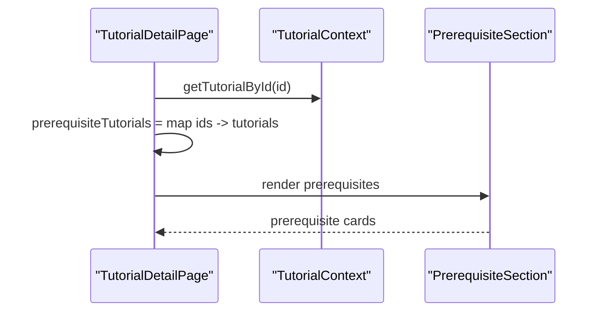

**Diagram sources**
- [TutorialDetailPage.jsx:57-60](file://src/pages/TutorialDetailPage.jsx#L57-L60)
- [PrerequisiteSection.jsx:9-36](file://src/components/PrerequisiteSection.jsx#L9-L36)

**Section sources**
- [TutorialDetailPage.jsx:57-60](file://src/pages/TutorialDetailPage.jsx#L57-L60)
- [PrerequisiteSection.jsx:9-36](file://src/components/PrerequisiteSection.jsx#L9-L36)

### Freshness Voting System
- Users can vote “Still Works” or “Outdated” per tutorial.
- Consensus computed from aggregated votes when thresholds are met.
- FreshnessVoter renders counts and enables voting for authenticated users.

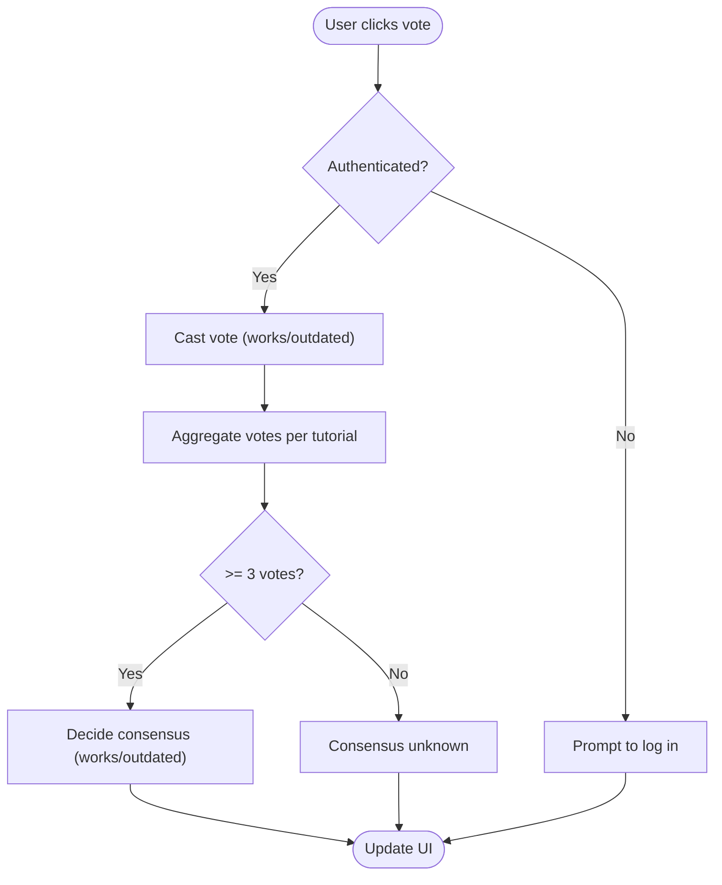

**Diagram sources**
- [TutorialContext.jsx:259-303](file://src/contexts/TutorialContext.jsx#L259-L303)
- [FreshnessVoter.jsx:5-43](file://src/components/FreshnessVoter.jsx#L5-L43)

**Section sources**
- [TutorialContext.jsx:259-303](file://src/contexts/TutorialContext.jsx#L259-L303)
- [FreshnessVoter.jsx:5-43](file://src/components/FreshnessVoter.jsx#L5-L43)

### Tutorial Series Organization
- Series identified by seriesId and ordered by seriesOrder.
- TutorialDetailPage computes previous/next within the series and renders navigation controls.

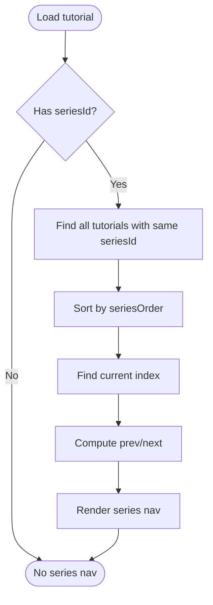

**Diagram sources**
- [TutorialDetailPage.jsx:62-78](file://src/pages/TutorialDetailPage.jsx#L62-L78)
- [constants.js:24-28](file://src/data/constants.js#L24-L28)

**Section sources**
- [TutorialDetailPage.jsx:62-78](file://src/pages/TutorialDetailPage.jsx#L62-L78)
- [constants.js:24-28](file://src/data/constants.js#L24-L28)

### Tutorial Management Features for Authors
- Authors can submit tutorials; submissions are stored with status and timestamps.
- Authors can edit or delete their own submissions using authorization checks.

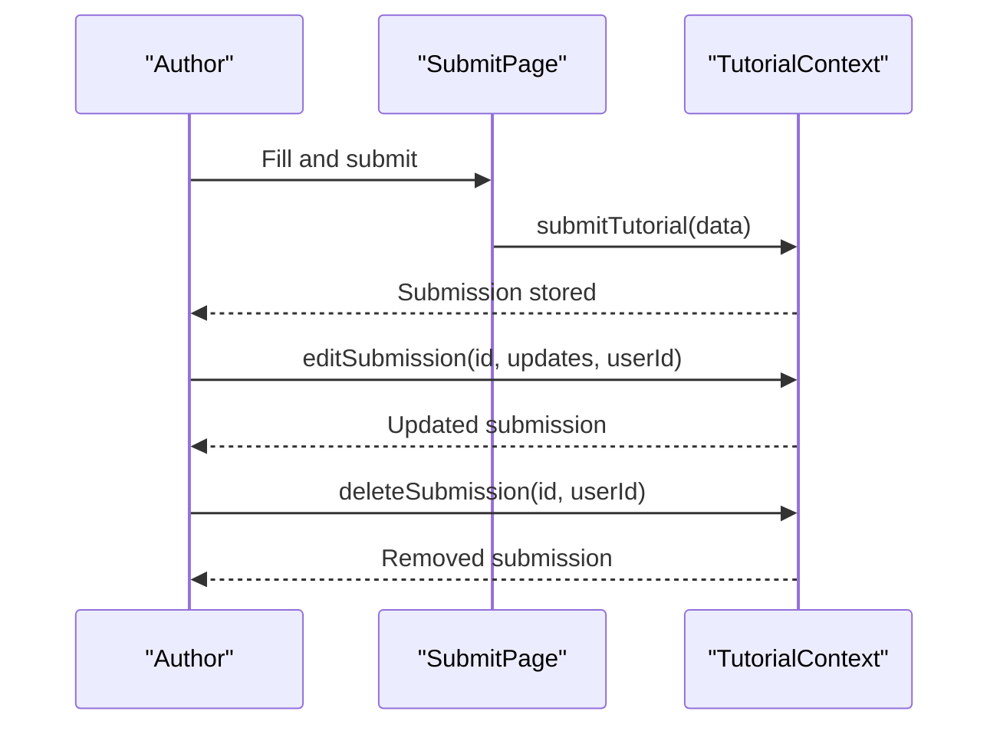

**Diagram sources**
- [SubmitPage.jsx:137-158](file://src/pages/SubmitPage.jsx#L137-L158)
- [TutorialContext.jsx:379-423](file://src/contexts/TutorialContext.jsx#L379-L423)

**Section sources**
- [SubmitPage.jsx:137-158](file://src/pages/SubmitPage.jsx#L137-L158)
- [TutorialContext.jsx:379-423](file://src/contexts/TutorialContext.jsx#L379-L423)

### Recommendations and Related Tutorials
- Related tutorials: Same category, excluding current, sorted by average rating.
- “For You”: Based on followed tags, newest first, limited to 8.

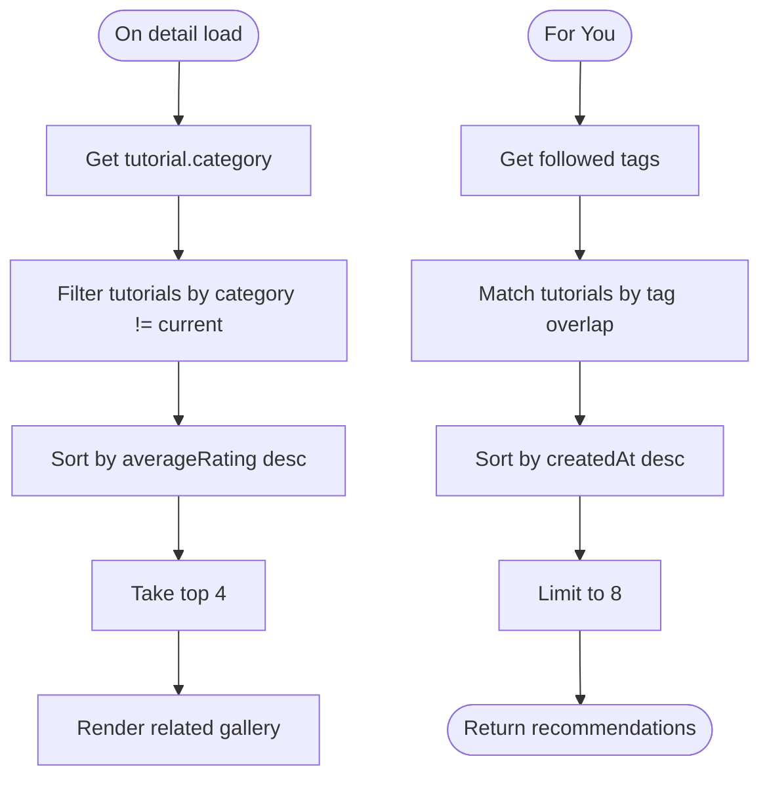

**Diagram sources**
- [TutorialDetailPage.jsx:49-55](file://src/pages/TutorialDetailPage.jsx#L49-L55)
- [TutorialContext.jsx:341-349](file://src/contexts/TutorialContext.jsx#L341-L349)

**Section sources**
- [TutorialDetailPage.jsx:49-55](file://src/pages/TutorialDetailPage.jsx#L49-L55)
- [TutorialContext.jsx:341-349](file://src/contexts/TutorialContext.jsx#L341-L349)

### Tutorial Completion Tracking and Progress
- Toggle completion per user per tutorial.
- Retrieve user’s completed list and count.

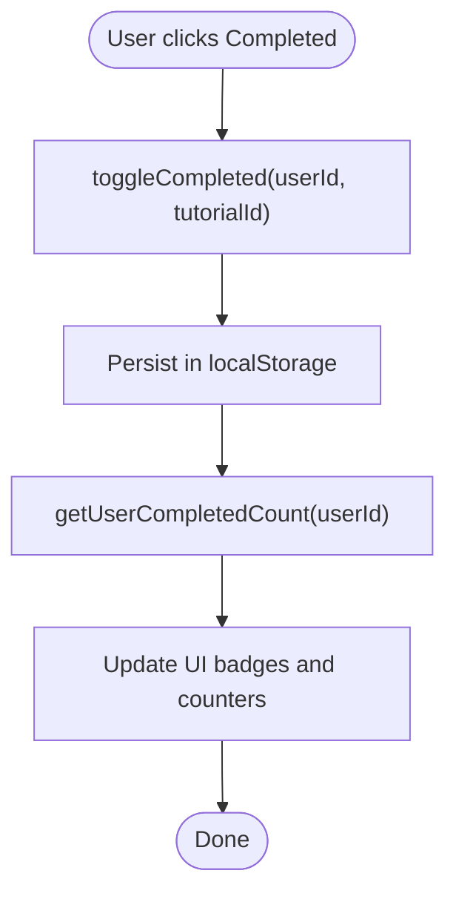

**Diagram sources**
- [TutorialContext.jsx:164-201](file://src/contexts/TutorialContext.jsx#L164-L201)
- [TutorialCard.jsx:21-23](file://src/components/TutorialCard.jsx#L21-L23)

**Section sources**
- [TutorialContext.jsx:164-201](file://src/contexts/TutorialContext.jsx#L164-L201)
- [TutorialCard.jsx:21-23](file://src/components/TutorialCard.jsx#L21-L23)

## Dependency Analysis
- TutorialContext aggregates:
  - Static tutorials and approved submissions
  - Local storage-backed user data (ratings, reviews, bookmarks, completions, votes, followed tags)
  - Dynamic computations (merged averages, view counts, featured/popular lists)
- Components depend on useTutorials hook to access context methods.
- Utilities support filtering, formatting, and video URL processing.

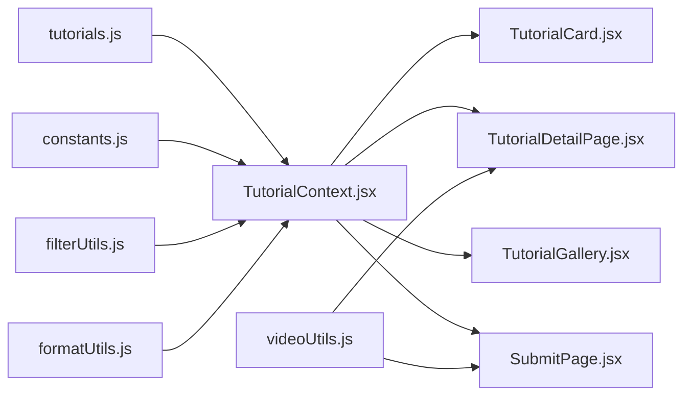

**Diagram sources**
- [TutorialContext.jsx:37-65](file://src/contexts/TutorialContext.jsx#L37-L65)
- [filterUtils.js:1-99](file://src/utils/filterUtils.js#L1-L99)
- [formatUtils.js:1-45](file://src/utils/formatUtils.js#L1-L45)
- [videoUtils.js:1-119](file://src/utils/videoUtils.js#L1-L119)

**Section sources**
- [TutorialContext.jsx:37-65](file://src/contexts/TutorialContext.jsx#L37-L65)
- [filterUtils.js:1-99](file://src/utils/filterUtils.js#L1-L99)

## Performance Considerations
- Memoization: Context merges and recomputes filtered/sorted lists efficiently; avoid unnecessary re-renders by keeping props stable.
- Pagination: TutorialGallery slices arrays to limit DOM nodes per page.
- Lazy image loading: TutorialCard uses lazy loading and fallback placeholders.
- Video embedding: VideoEmbed handles iframe loading states and fallbacks to external links.

[No sources needed since this section provides general guidance]

## Troubleshooting Guide
- Video unavailable: VideoEmbed shows an error state and directs users to the external site.
- Video verification failures: SubmitPage reports network issues or removal; suggests checking URL.
- Authentication gating: Many actions (bookmark, rate, vote, mark completed, follow tags) require login; UI navigates to login route.

**Section sources**
- [VideoEmbed.jsx:40-59](file://src/components/VideoEmbed.jsx#L40-L59)
- [videoUtils.js:110-118](file://src/utils/videoUtils.js#L110-L118)
- [TutorialDetailPage.jsx:125-141](file://src/pages/TutorialDetailPage.jsx#L125-L141)

## Conclusion
GameDev Hub’s tutorial management system combines a robust data model with modular UI components and a centralized context for state. It supports rich discovery (filters, sorting, series, tags), community-driven quality (freshness votes, reviews, ratings), author workflows (submissions, edits, deletions), and personal progress tracking. The architecture balances simplicity and scalability, enabling future enhancements like advanced recommendation engines and richer analytics.

## Appendices

### Data Model Reference
- Required fields: id, title, description, url, category, difficulty, platform, estimatedDuration, author.
- Optional fields: engineVersion, tags, prerequisites, seriesId, seriesOrder, thumbnailUrl, videoId.
- Metadata: createdAt, viewCount, averageRating, ratingCount, isFeatured.

**Section sources**
- [tutorials.js:2-203](file://src/data/tutorials.js#L2-L203)

### Constants Reference
- Categories, difficulties, platforms, engine versions, series, sort options, duration ranges, and video platform regexes.

**Section sources**
- [constants.js:1-71](file://src/data/constants.js#L1-L71)